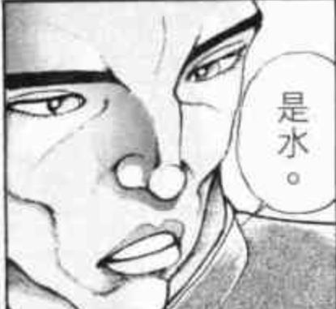
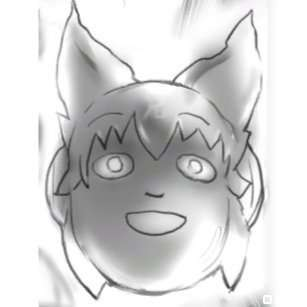
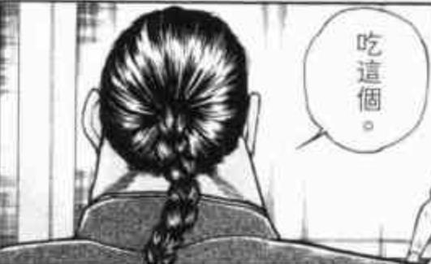

安科贴子，简单来说就是角色的大多数行动全部都由骰子决定的贴子

由作为贴主的我为角色的行动给出多个选项，然后投骰子决定故事的走向

由于有着【大失败】【大成功】的存在，因此就算开局角色暴毙/开局boss就被干死也都是有可能的展开

开这个贴子是因为我追《迪亚哥布兰度似乎正在挑战Grandorder的样子》这部AA漫追过头了以至于赶上进度之后没有新的漫画可以看了

由于实在过于悲痛因此打算自己也来尝试一下投骰子

因此本贴只是对上述漫画的拙劣模仿，换句话说只是我个人的自娱自乐而已！

由于走向全部交给骰子了因此会变成什么鬼样子我也不知道！

本来应该用AA画的但考虑到这是贴吧因此还是用图吧。

当然，肯定会有吧友好奇，你如何保证你是真的投了骰子而不是自己在编故事呢？

。。。。。。

我用热狗发誓，所有的选项全部交给骰子了！（震声）

请大家相信我不想失去热狗的心！（震声）

那么，烈海王的幻想乡生活开始了

前略，不知道因为什么原因这个世界的烈在必可活用于下一次之后来到了幻想乡。

而且还是肉穿！

由于烈上辈子是一个大体而言说得上是十分善良的老好人，因此他获得了初期特典：第一个接触到的势力头目好感恒定90以上+可以获得一份工作与住所。

那么烈啊，你要去往何处呢【1d13:9】

1 博丽神社

2 红魔馆（是红海皇！）

3 白玉楼（莫非。。是宫本武藏女性说？）

4 永远亭（皮克suki）

5 太阳花田（好危险！）

6 守矢神社（呱）

7 地灵殿

8 命莲寺

9 神灵庙

10 月之都

11 后户之国/魔法之森/辉针城

12 灵长园/**界/地狱/彼岸

13 其他的势力

神灵庙吗，是偏向人类方的势力呢。

其首领的知名度，在外界算得上相当之高呢。

话说回来，烈对圣德太子的印象是？

【1d100:63】(越1越没有听说过，越100越是了解)

看样子还蛮清楚的，是在日本修行时听同伴们说过了吗，还是自学的？【1d10:10】

1 这就是天朝格斗家的知识量

2 与boy聊天中得知

3 涉川老其实是历史宅

4 还有余地！

5 花山，你还会学历史啊

6 这就是天朝格斗家的知识量

7 这就是天朝格斗家的知识量

8 还有余地！

9 涉川老其实是历史宅

10 勇，勇次郎？！

勇伯：烈海王，你知道吗，据说历史上的圣德太子其实是稀世的美少女，不仅如此，居然！还是修道的高人以及近身格斗的专家！

勇伯：为什么要露出这种表情，你是在质疑我吗？

草，于是烈在跟勇伯的愉快对话中得知了圣德太子的存在。

那么开始导入。

。

。

。

“呀今天真是好天气~“”

头戴着相当现代的耳机，身披中二病十足的双色披风，脚踩着地摊货拖鞋

丰聪耳神子推开了道场的大门，开始了崭新的一天

在这美妙的清晨，她所看见的第一件东西是

神子：在神灵庙的门口出现了被砍到XX都出来的了留着辫子的带着假腿的中华格斗家到底是什么莫名其妙的展开啊啊啊啊啊？？？

神子的震惊程度【1d100:41】(越1越无所谓，越100越开什么玩笑)

神子：仔细想想这里是幻想乡呢，感觉是与常识完全扯不上关系的景象不过在这里大概是日常的光景把，虽然还是有点吓人

【悲报】幻想乡形势严峻

神子：话说现在不是发表感想的时候，在不做点什么他就要离世了！布都快去找永远亭的那位医生，这个时间点应该还没出门所以全力跑过去！

然后我先用道术做一下应急处理

——————天符「天之磐舟哟，向天飞升吧」——————

（物部布都使用符卡远去了）

神子的急救【1d100:90】

（90以上不需要永琳就能救命了）

烈，你捡了一条命呢

布都：太子大人，余将永琳先生带过来了！

太子：啊，那个布都啊，我似乎已经快把他治好了呢

太子大人居然是深藏不露的杏林圣手吗？！

布都。震惊了

布嘟嘟的震惊程度【1d100:5】(越1越我无所谓，越100越惊了)

布都：毕竟是太子大人，这种程度的急救拳也是理所当然的

师匠：虽然没有性命之忧了，但似乎还是带有一些伤势呢，这个样子的话

永琳的治疗【1d10：10】

1 多么健壮的腿啊（腿部再生）

2 说起来皮肤有点黑呢（美白）

3 好多内伤？？（深度修复）

4 这是剑伤…那么需要做好对利器的对策了呢！（为啥啊）

5 好多内伤？？

6 这是剑伤…那么需要做好对利器的对策了呢！（为啥啊）

7 多么健壮的腿啊

8 多么健壮的腿啊

9 好多内伤？？

10 大成功

大成功是什么啊？

（大成功/大失败时，会出现新增的十个选项，一般而言会让情况变得十分有趣或者极其糟糕）

（如果出现了大成功接大失败的话就回到原来的十个再投一次，反之亦然）

永琳：大成功是什么？

【1d10：9】

1 内伤修复+利器对策

2 皮肤修复+内伤修复

3 利器对策+内伤修复

4 “说起来今天带了一颗能让人加速修炼的药”

5 残肢再生+内伤修复

6 残肢再生+皮肤修复

7 残肢再生+利器对策

8 居然是蓬莱药的劣化品？？

9 仔细一看，这孩子有修习天文密葬法的天赋呢

10 以上随机三样

为什么？？？？？

嗯？？？？？？？

烈海王，你还是天才啊？？？？

烈：我接住了！

烈反射性的起身，摆出了迎战姿势

烈：武藏，我接住了你的剑！

神子 “战意高昂是好事，但是我可不是武藏哦”

看着面前的景象，烈海王花费了【1d10：7】分钟冷静下来。

（指烈的神经）

神子 “相当的震惊呢”

永琳‘我们也很困扰，你这样的天才为何会落到这步田地？’

神子“哎，他是天才吗”

永琳“一眼就能看得出来的才能呢，不如说已经稀有到我想要收徒了”

烈海王的说明【1d70：39+30=69】（30为圣人与月之头脑的智商补正）

“情况就是这样了，我在习得了郭海皇秘传的消力之后，更换了一条新的假腿，在决战前夜被本部先生找茬了，然后与被婆婆复活的宫本武藏进行了一场生死搏杀，最终。。。失败了”

（烈，从小学语文三年级重新读起吧）

两人：“就算你这么说也还是难以理解呢”

烈：“果然是这件事情本身太过离奇了吗”

神子“为什么中华武术的巅峰要叫做海皇呢？”

永琳“像你这样的天才，为何却只修行武术呢？是打算走肉身成圣的路线？”

烈海王，再一次在幻想乡的理解力前败退了。

神子“开玩笑啦开玩笑，多亏了我的能力想要理解你的处境还是做得到的”

“是不留遗憾的结局，做的好啊”

永琳：“所以为什么只学武术呢？

烈再一次道谢

“两位肯对我这素不相识之人伸出援手，真真不胜感激。烈永周不善言辞，也只能在此承诺，从今往后无论任何事情，我都定将听从吩咐，赴汤蹈火，在所不惜。”

先开口的是【1d2 ：1】

1永琳

2 神子

永琳：“这样的话，不如来做我的徒弟如何？如此天纵之资，若是无故浪费实在太过可惜了”

烈海王的态度是【1d100：72】（越1越愧疚，越100越我无所谓）

烈：“如果不介意我已有师承，那我自然是无所谓的！”

（烈海王的脸皮变强了）

“既然是永琳女士的吩咐，我自然无所谓。然尚若我只是平白无故当了您的弟子，那便太过厚颜无耻了！无论什么都好，请让我为您做些事情吧！”

烈的报恩【1d10：6】

1 让你尝尝中华料理的厉害吧！

2 打岩时练出的雕刻技术（为啥啊）

3 流行达人烈天王（辉夜suki）

4 多么健壮的身体啊（实验素材）

5 我总是有一把子力气的（打杂）

6 让你尝尝中华料理的厉害吧！

7 打岩时练出的雕刻技术（为啥啊）

8 多么健壮的身体啊（实验素材）

9 让你尝尝中华料理的厉害吧！

10 大成功

烈：“我虽然自傲于一身武艺，但在这妖怪横行的幻想乡，想必派不上太大用场，这样的话——让两位见识下我的厨艺，如何？”

神子：“不不不，你的实力哪怕在幻想乡里也属于基本不需要担心安全问题的那类人了哦，倒不如说寻常的小妖怪或者妖精都要绕道走了”

烈海王很高兴

（你说什么？露米娅，愤怒了）

（克劳斯皮恩，点燃了火把）

二十分钟后

神子：“这是什么惊人的味道，外界的格斗家居然多才多艺到这种程度了！”

“即使在月都上都未必能常常吃到这样的食物，更何况营养的调和还十分到位——烈，你果然是才子啊！”

“决定了，从今往后你就是永远亭的新大厨了！”

是中华美食的胜利！

那么神子那边需要什么帮助呢

【1d10:3】

1 神子 我无所谓

2 将这份恩情留到将来吧

3 虽然已经成仙但仍有口腹之欲，时常来送些吃食如何

4 神灵庙的信众们需要健壮身体以保护自身。。。（神灵庙武术教练烈海王）

5 将这份恩情留到将来吧

6 虽然已经成仙但仍有口腹之欲，时常来送些吃食如何

7 神灵庙的信众们需要健壮身体以保护自身。。。

8 虽然已经成仙但仍有口腹之欲，时常来送些吃食如何

9 神子 我无所谓

10 你对外界的流行有什么了解吗（JK神子suki）

“虽然早已得道，但却仍有口腹之欲，如果有空闲的话就来送些吃食吧？布都苏我和娘娘她们也会高兴的哦”

“铭记在心！”

于是，烈海王永远亭大厨兼永琳师匠新弟子的幻想乡生活，堂堂连载！

（本日更新结束，下来的份要等到明天或者后天或者后后天。。反正今天没有正片了， 等 完 了）

（以下是我的废话）

大 草 原

这 是 为 什 么

烈，我还以为你是一个老实人，结果这不是过分的要死了吗为什么会出现这种展开啊？？？？？？！！！！！！！！！！！！！！！

开局就做起了师匠的弟子这种设定写在同人小说里会被人骂的！

啊，恶饿鬼老师.......原来如此，同人漫画就没有关系了吗

我至今都未追上恶饿鬼老师的孤独......

再见了，从零开始的幻想乡生活，一步登天的大成功你好

原本准备的展开是虽然得到了首领的欣赏但是还是从打工开始一步步做起的异世界烈海王奋斗记

现在快要变成异世界烈海王小白脸记了

抽到神灵庙之后慢慢在想具体展开，因为说实话对庙的角色不是很了解所以一边写一边在翻thbwiki

结果烈抽到了大成功，剧本再见

突然理解迪亚哥贴主的胃疼情况了

顺便一提，这种莫名其妙的开局真的，真的，真的是骰子监督干的

我没有证据能够证明，真要说的话也只有我的热狗还好好长着这一事实了

所以我只能说

请大家相信我啊！！（声嘶力竭）我没有办法编出这种鬼展开的，我不够自由啊！

今天晚上的小番外，先来看看烈与永远亭（包括迷途竹林周边地区）的人们相性如何吧

（慧音老师因为平时在人里活动所以暂时先不投）

实际原因是之后见到也要投所以一口气全部投完吧！

首先，永琳师匠

由于被收为徒弟了因此师匠的好感度恒定80以上，具体数字是【1d20: 18+80=98】

……似乎，是永琳小姐喜欢的类型

那么其余众人如下

莉格露【1d100:97】

只比师匠低1是怎么回事，烈意外的有当小白脸的天赋吗

顺便，感觉烈会把莉格露认成少年的样子

小碎骨【1d100:16】

草，为什么对和蔼可亲的米斯提亚相性会差成这样

今泉影狼【1d100:5】大失败

。。。。。。

满月之夜会毫不犹豫地袭击过来

不如说平常见到也会立刻开战的！

因幡帝【1d100:19】

持续糟糕中

烈，平时在家记得小心地下吧，对烈海王专用兔陷阱已经在准备了

铃仙【1d100:84】

是值得信赖的后辈！

以后一同出门办事的展开值得期待

