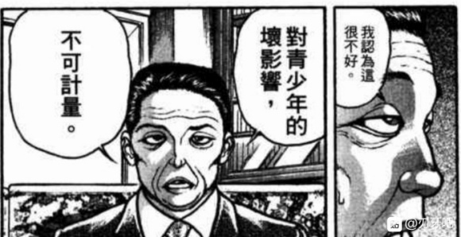
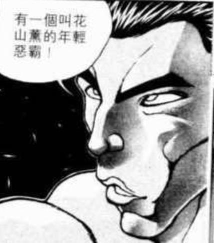
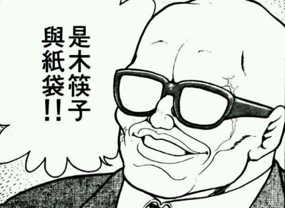
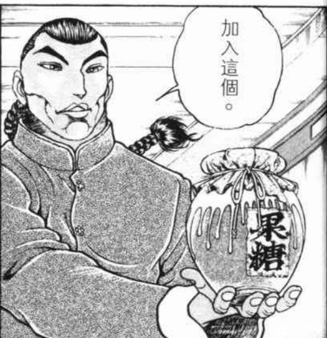
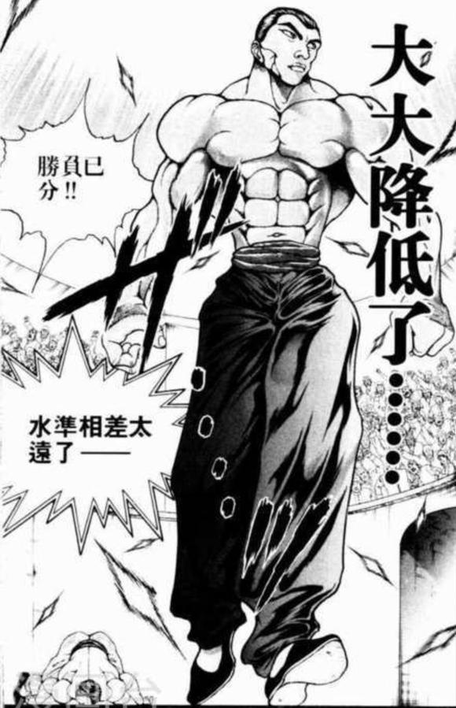
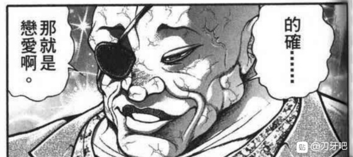

藤原妹红【1d100:42】

普普通通，“是永远亭的新人吗“”这样的感觉

然后最后是最重要的，真正的老板，辉夜大小姐的相性！

蓬莱山辉夜【1d100:17】

啊哇哇

烈。。。你加油吧

【悲报】迷途竹林分裂为了亲烈派与倒烈派

烈海王，你在干什么啊烈海王

收下吧，这是我今晚最后的骰子了！

由于是刃牙X东方因此皮克，就决定是你了！

皮克在永远亭吗？【1d100:81】(50以上就在，50以下换成其他格斗家并且roll另一个地区)

皮克已经成为永远亭的常客了！

永远亭，对于格斗家来说莫非是福地吗

不过皮克是原始人呢

作者的独断：虽然皮克过来了，但是为了让这个贴子能够安心的持续下去因此就先把皮克的X骚扰要素去除了

因为啊，想必在座的各位都已经了解了——每次见到新的女角色都要做一次热狗判定说真的过分过头了啊！

如果判定大成功了之后对面又是小铃之类的弱女子那这个贴子会完全失控的！

艳红会吃掉我的，说真的！

而且皮克一直这么硬下去的话，万一见到了那种脾气不大好的强者会变成皮克酱的

因此这里使用师匠的教育：【1d50：35+50=85】（50是让皮克维持正常理性的最低线）

居，居然变成了君子皮克！而且还好好的穿着裤头！

不过还是会时不时出门打弹幕战，此即原始人的天性

除了“你那还算是人”外，还是没法流利的讲话

如果达到90以上就有诺奖人的可能性了，真是可惜

那么一位好朋友正在永远亭等待着烈（的肉体）

今天的骰子到此结束，我已经一滴都不剩了。。。

那么开始骰下

今天要结束烈海王在幻想乡的第一天了

感觉接下来进行战斗的可能性很大，因此先做好了烈的人物卡

~烈海王的人物卡~（括号内为原本的数值，括号外为技能加成后的实际数值）

烈 海王

Atk 144（80）

Hp 13（15）

技能

烈 海 王：海王是中华武术的巅峰，烈海王又是其中佼佼者，凭借高超的技术使战斗力X1.8

消力：传自郭海皇的绝学，普通攻击以及近战系技能所造成的的最终伤害/2

四千年的传承：不会陷入异常状态，面对近战系、技术系的技能可以进行【1d100】的破解判定，75以上成功

假腿：肢体缺失导致HP-2，同时每轮战斗都需要进行一次【1d100】的假腿判定，20以下假腿断裂，该回合战斗自动失败同时之后的战斗中Atk-20

历战的战士：与大量格斗家交手后得到的战斗经验使得回避概率翻倍（由于假腿存在，该技能目前无法使用）

武术之爱：【情报不明】，失去意识/战斗不能后触发

必杀技：还没想好

（感觉烈很强吗？那是当然的！）

（但是幻想乡里各种妖怪或人类会更强，超强，强到离谱，现在的烈去挑战她们，其结果只能用悲剧来形容）

烈的问题在于其他人都有那么几招拿手技能（比如独步的老三样），但是烈的招式太多了——而且好多招都只用了一两次而已！

准确来说我想不到烈的招牌必杀用什么比较好，请大家指导我！

（如果到进行战斗时都没有公认的必杀技那就先用倒转莲花吧）

顺便解说一下这个贴子的战斗

双方投骰子决定一个数值：Atk固定值+【1d100】+技能加成 （此处无大成功/大失败判定）

数值大的那一方胜利，之后进行伤害判定：从1-10的选项中决定回避（0），小伤害（1），中伤害（2），大伤害（3），特大伤害（4）以及大成功/大失败

用HP减去收到的伤害，HP归0时战斗结束

~永远亭~

来到了从今往后的大本营，烈要做的第一件事情是？【1d10:8】

1 火锅是中华的特色，不得不品尝，永远亭的命运，幻想乡的未来，我们边吃边谈

2 师匠，请指导我！

3 该换一条不会断的假腿了

4 弹幕决斗是什么？（战斗）

5 火锅是中华的特色，不得不品尝，永远亭的命运，幻想乡的未来，我们边吃边谈

6 师匠，请指导我

7 该换一条不会断的假腿了

8 师匠，请指导我

9 该换一条不会断的假腿了

10 大成功/大失败【1d2：1】

烈：永琳师匠，请指导我！现在的我如果想要更进一步，首先要做什么呢？

永琳的建议：【1d10：7】

1 烈啊，从发射弹幕做起吧

2 说起来你的腿是怎么回事

3 月之都的科学技术世界第一！改造人烈永周堂堂登场

4 肉体的锻炼是实力的根本

5 实战才是真正适合你的道路

6 烈啊，从发射弹幕做起吧

7 说起来你的腿是怎么回事

8 肉体的锻炼是实力的根本

9 实战才是真正适合你的道路

10 大成功/大失败【1d2：2】

永琳：说起来，你的腿是怎么回事？

烈的解说【1d70:10+30=40】（师匠的智慧补正+30）

烈：其实是被好朋友吃掉了

永琳：哎哎？！

烈：按理来说应该让他吃掉所有的肉的。。。我失信了

师匠的震惊【1d80：55】（见得多了补正最大数-20）

永琳：外界的友情，已经扭曲到这种地步了吗？公主殿下平常看的那些奇怪的漫画居然是真的

由于师匠稍微震惊了因此打算回到家里再进行指导，因此接下来遇到的人是【1d10：5】

1 “你哪还算是人”

2 因幡帝

3 铃仙

4 辉夜

5 “你哪还算是人”

6 因幡帝

7 铃仙

8 今泉影狼（战斗开始）

9 “你哪还算是人”

10 大成功/大失败【1d2：1】

“你那还算是人！”

这个声音是？！

烈海王万万没有想到，在这远离尘世的幻想乡中，居然能够听到熟悉的声音

不，实际上，他无法说他以前听到过这个人讲话——那时的好友身上充满了暴力与纯真，能听到的只有喘息，咆哮与开怀的笑声

“你那还算是人！”

烈：皮克？是你吗？！

出现在烈海王眼前的，正是他生前的好友之一，同时也是令他失去一足的敌手

自太古而来的原始人——皮克，登场了！

烈：其他的先不说，为什么要骂我？

一定是因为没有吃完——这是我的过错！皮克，继续吧！这一次我不会再逃了！

永琳：皮克并不是在骂人哦，他现在是有礼貌的好孩子

他只是不会说其他的话而已

皮克默默的拿出了【1d10：9】

1 纸和笔

2 暴龙的牙

3 木筷子和纸袋

4 符卡（为啥啊）

5 纸和笔

6 暴龙的牙

7 纸和笔

8 符卡（为啥啊）

9 木筷子和纸袋

10 大成功/大失败【1d2：2】

是木筷子与纸袋！

皮克以拿笔的姿态在纸袋上画起了什么

由于原始人那顶尖的力量加成，纸袋被划出了有规律的痕迹，但却没有被戳破

皮克将纸袋递给了烈

那上面只有简单的两个字——朋友

烈的烹饪持续了【1d3:1】小时

在此期间，永远亭的其他住户也聚集过来了

因幡帝：是师匠的新弟子哦？这么轻松就混到了这个身份，让人有些莫名的不爽

（对烈海王专用陷阱准备中）

铃仙：永远亭的新住户，看上去是一位值得信赖的好人

辉夜：咿呀——明明已经21世纪了还留着辫子！现在是夏天居然穿着印花的棉袄！皮肤超级黑！假腿是怎么回事？脸一点都不帅气！永琳你到底是从哪里找来这种生物的？

永琳：虽说如此，但人很好而且意外的是超一流的天才

烈的辩白【1d10:2】（10的话能够改善印象）

辫子是战斗时的便利道具，衣着是我家乡的传统服装，皮肤是因为在烈日下锻炼过度了，腿被皮克吃掉了，脸。。。是天生的

辉夜：皮克酱没把你吃完还真是残念

烈：我是也这么想的

辉夜：哎？

皮克对晚餐的评价【1d100:83】（越1越差，越100越好）

皮克很开心

辉夜：虽然人很古怪但是厨艺确实了得

因幡帝：我也是这么想的

（铃仙没有发言，因为平常这个时间点她还在做饭，难得的能够在正常的时间吃晚饭令她十分感动，大吃大喝）

烈：那么我去准备甜品

辉夜：永琳，说起来这完全是你喜欢的类型吧？超绝的才华，正直的内心以及不屈不挠的意志，外表什么的你反正是无所谓的。

永琳：的确，因此才会想要收徒弟。不过我可不是纯情的少女，（烈）想要牵手的话起码准备50年以上才算有把握呢。

辉夜：那么到做X需要多少年？

永琳：大概【1d100：11】年吧

辉夜：（这女人搞什么鬼，到上床之后还要再过39年才能牵手？完全反了啊）

无趣的话我就不多说了，只不过，记得考虑清楚。无论是如何光彩夺目的人间俊才，最迟区区百年之后，也不过是一抔黄土

在这永远停滞的时间中，能够陪伴你我的，也只有那么区区数人罢了

永琳：然而，污秽而短寿的地上人却也有他们自己的活法

明知此生定将迎来终焉，却仍然不顾一切向着心中的目标奔跑着

对于什么事情都可以馒馒来的我们来说，是无法理解但却同样憧憬的存在啊

正如他们看待我们一样

辉夜 短暂的沉默了

算了，反正巫女和小偷也常来拜访，原始人更是莫名其妙的定居了

馒馒来吧

放松气氛的小骰子，皮克对甜品的评价是【1d100：40】（越1 越狗屎，越100越美味）

皮克觉得不如肉好吃

回归正题，师匠对烈腿的建议【1d10：8】

1 断肢重生就交给我吧

2 妖怪之山下的河童在贩卖义肢

3 （辉夜）我来推荐擅长人体再生的人才

4 （帝）去便利店买一条义肢

5 断肢重生就交给我吧

6 断肢重生就交给我吧

7 妖怪之山下的河童在贩卖义肢

8 （铃仙）就维持现状去战斗

9 “你哪还算是人”皮克的人脉

10 大成功/大失败【1d2：2】

终于吃完饭的铃仙

“我认为没有必要去担心这个问题啊”

烈：可是现在的假肢太容易坏了——

铃仙：坏了之后就，继续战斗啊

打赢之后换一条新的就好

不管发生什么都要干掉对手，这样才有办法思考未来

作为格斗家，不做好这样的觉悟可是失职了

烈：原来如此，我太过执着于区区一条腿了，反而令我的纯度变低了

不是失去了腿，而是得到了名为假腿的个性！

铃仙前辈，谢谢你的指教！

铃仙：前，前辈！

铃仙很开心

那么烈今晚要干什么【1d10：9】

1 师匠，请指导我

2 弹幕决斗是什么（寻找好敌手）

3 肉体的锻炼

4 师匠，请指导我

5 弹幕决斗是什么（寻找好敌手）

6 师匠，请指导我

7 弹幕决斗是什么（寻找好敌手）

8 与皮克交流

9 与铃仙交流

10 大成功/大失败【1d2：2】

~铃仙的交流回合~

烈：铃仙前辈，我从今往后应是要在此处生活了，关于永远亭中的诸多事务，有什么是我应当注意的吗？

铃仙 ：（前，前辈！）

交给我吧！

首先从人说起吧

辉夜大人很讨厌他人的打扰，所以在用餐时间将她的那份交给我就好，我来负责送饭

平时如果没有要事不要前去拜访她（会看到相当糟糕的画面的）

永琳师匠大部分时间都在做研究或者当大夫治病，如果对医学有研究的话可以去帮忙，没有的话作为弟子就负责跑腿吧

烈的医疗【1d100:63】

烈：我可以应付大部分的常见病，以及基础的急救，但急病重症或者超自然因素所导致的病痛恕我无能为力

铃仙 意外的够用了！那么在永琳大人问诊的时候你就在一旁帮忙吧

【朗报】护士烈海王诞生

铃仙：帝虽然看上去很乖巧但实际上相当喜欢恶作剧，并且也是幻想乡中的高资历成员了。见到她时最好保持恭敬的态度，如果有什么无理的要求就叫我一起帮忙吧。日常生活中记得小心帝的兔陷阱，堪称无处不在并且形式多样请一定注意

烈（师匠，你不管管她吗，听上去好过分啊）

铃仙：那么最后……我自认脾气还挺好的。我拥有操纵波长程度的能力，能在一定程度上察觉他人的情绪，因此不要在我面前抱有坏心思哦（虽然到现在为止一次你都没有过，说真的对自身的女性魅力有点丧气了）

烈：我对这种事情一向是无所谓的

铃仙：还有就是请尽量不要在我面前表现出过激的战斗欲望，可能会发生不好的事情

烈：（还以为你是难得的常识分子……）

烈 ：接下来是我个人的问题，请问铃仙前辈你——是兔妖怪吗？

只是我个人作为一般人抱有的好奇心，不用回答也没问题。如果冒犯到你，我先在这里说一声抱歉

铃仙 其实我是月兔哦

烈 ：是嫦娥身边的那位？！这么说辉夜小姐的真身是嫦娥！？

铃仙：不不不，月之都上有很多月兔的，我只是其中的一员而已

辉夜大人与永琳师匠过去，都曾是月之都的高层，只是由于一些原因现在选择在地上居住了

顺便一提帝和周边的兔子都是地上的兔妖怪，与月之都没有关系

烈的混乱【1d100：57】（越1越他无所谓，越100越你在说什么）

烈：感觉有些复杂但还是能够理解

烈：最后一个问题，之前从师匠处得知了铃仙前辈的全名是铃仙·优昙华院·因幡

现在用铃仙前辈这个称呼，会不会不太合适？需要更改吗？

铃仙 ：不，其实铃仙就是我本来的名字

优昙华院是师匠起的爱称，因幡则是辉夜大人所起的爱称

（因为从来没有人喊过前辈）铃仙前辈这个称呼很好啊！

~交流回合结束，烈进入睡眠~

本日结束

（下次正经的更新在周末——或者再往后）

（以下是我的废话）

第一日的发展过于平和了吧

明明已经把战斗选项加进去好几次了结果就是不出，烈啊你的斗志在哪里

想着就算不打架起码也能把腿的问题解决结果偏偏抽到了一成的月战老兵

草，仔细想想烈海王来到幻想乡的第一天除了聊天和做饭居然什么都没做，你是来度假的吗

把标题改成烈海王似乎想在幻想乡成为厨神的样子算了

补一下被艳红吞掉的103楼

烈的应对【1d10:8】

1 今晚请你吃大餐（指中餐而不是烈的腿）

2 打架

3 与皮克聊天

4 今晚请你吃大餐（指中餐而不是烈的腿）

5 今晚请你吃大餐（指中餐而不是烈的腿）

6 打架

7 与皮克聊天

8 今晚请你吃大餐（指中餐而不是烈的腿）

9 拿出秘制的糖水

10 大成功/大失败【1d2：2】

烈：皮克，我是你的朋友烈海王。上次没有让你吃饱，这一次作为补偿，就请你吃大餐吧！

（虽然心中仍存有愧疚，但是经历了这么多之后烈似乎不再执着于寻死了）

今晚的小番外

在这个世界中不死组（辉夜与妹红）的相性如何？

【1d100：83】（越1越我要杀了你，越100越我想和你做X）

蘑菇酱~

辉夜亲~

变成了在打完架之后会回亭子里打游戏顺便过夜的关系

顺便一提烈海王的必杀技决定了

由于烈会的技能实在太多了，难以找出能够代表性的必杀，因此做成了buff技能（用fgo来说的话，就是弓俄里翁的宝具或者梅林的英雄做成）

必杀技：武之怀（CT5）（即战斗开始后或使用后需要至少5回合才能发动）

没有最健壮的身躯，也没有最强大的血统

一身所学均为前人恩惠，因此也没有独一无二的必杀技

烈海王所拥有的，只有他所爱所信的武术

将身体完全交给由武术构成的“烈海王”，凭借四千年的经验与自身的潜意识进行攻击

3T内Atk+60

3T内可对所有攻击进行【1d100】的破解判定，普通攻击与近战系、技巧系技能30以上成功，其余技能50以上成功，必杀技75以上成功

PS：遇到恋恋或者小五的话说不定会失效，到时候过一个骰子吧

PS2：在之后的更新里是否需要对出场角色做一个简要的说明呢？（作为更新结束后的小番外篇）

虽然在刃牙吧，各位见多识广的吧友对东方project应该是有一定了解的，不过只看过刃牙本篇的吧友们说不定会带着一头雾水的心情而导致无法理解角色们的动机 实力定位 势力所属之类的事情

所以如果大家需要的话，我会在之后的番外篇中更新一下（绝大部分内容来自于THBWIKI的）角色简介

如果有需求请在本层回复我，谢谢大家！

更新前的废话：

烈的人物卡中武术之爱这个技能被舍弃了

因为已经有武之怀了，一个梗用两次怎么说也太过分了

因此烈啊，向师匠寻求新的技能吧

~好感度判定标准修正~

幻想乡尊重强者，因此战斗结束后，好感度判定时固定值+30

大成功是zun和半圆的加护，大成功遇到的新角色好感度固定值+50

神子是开局特典，好感度固定值+60

为什么要这样做？

因为80固定值太高了！会变成恋慕挚友倾向的概率太高了！师匠的开幕雷击就是深刻的教训啊！

幸亏。。。幸亏我当时没骰神子的好感度。。。

师匠已经骰了就算了，烈，以后可没有这么好的事等着你了

