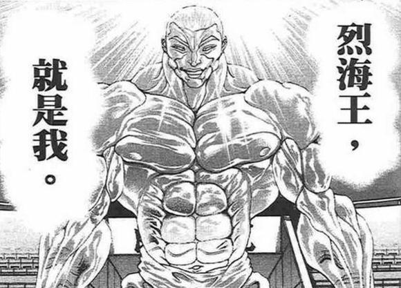

~第二天开始了~

师匠的教导：天文密葬法

经过【1d5：3+5=8】次学习后可习得

永琳：——以上是天文密葬法基本的原理，以你的资质大概再经过7次学习就可以初步运用了

我不会要求你天天都来学习，但一个星期至少要来学习一次

接下来烈的行动是【1d10：10】

1 继续跟随师匠学习

2 寻找好敌手

3 肉体锻炼

4 去神灵庙送早餐

5 寻找好敌手

6 继续跟随师匠学习

7 寻找好敌手

8 寻找好敌手

9 去神灵庙送早餐

10 大成功/大失败【1d2：1】

大成功是什么？【1d10：3】

1 灵光乍现，学会了天文密葬法的初步运用

2 红魔馆大爆炸将门番炸过来了

3 与圣白莲的相遇

4 师匠对烈进行了体质提升

5 灵光乍现，学会了天文密葬法的初步运用

6 红魔馆大爆炸将门番炸过来了

7 灵光乍现，学会了天文密葬法的初步运用

8 师匠对烈进行了体质提升

9 铃仙前辈的 一❤对❤一 指导

10 大成功/大失败【1d2：1】

。

。

。

——节选自文文新闻特刊《人与人之间的“引力“”》——

受访者 烈 海王先生

20代后半，男，武术家

“那一天发生的事情，我永远也无法忘记”

“当时初到幻想乡的我桀骜不驯”

“虽说弹幕技术一窍不通，但是身体强壮。同时在武术上也是放眼外界的高手”

“那时我感受到了微妙的妖气——以为是遇到了妖怪的袭击，便下意识地全力踢出”

“然而，那份全力被接住了”

“什么！发生了什么事情！魔法？握力来自哪？”

“就像被皮克，奥利巴和花山同时握住了腿一样啊！！！”

“疼！”

“那只手只是轻轻一挥——我就被放在了地上”

“我毫发无伤，除了腿很痛”

“无法理解吗？”

“这便是与“超人”的初次相遇——”

“真是抱歉，突然遇到了袭击，身体下意识的反应过激了。我的修行仍然不足啊。”

“话说回来，这可真是稀奇。本想来采购些药物，没想到却是遇上了有缘之人”

虽然是尼姑但却留着琉璃色的长发，来人手持魔人经卷，项戴绿色佛珠

伴随着充满慈爱的声音所出现的，是来自命莲寺的僧侣

圣白莲：我的名字叫白莲，曾是遥远的过去的一个僧侣，现在则在命莲寺中修行

初次见面的武人啊，我在你的身上感受到了佛缘，是曾经削发为僧，还是在寺庙修行过？

烈的观感【1d70：39+30=69】（越1越妖僧，越100越圣僧）

烈：（刚刚一瞬间感受到了强烈的妖气，但定睛一看却是得道高僧）

初次见面，白莲师傅。我的名字叫做烈永周，是来自外界的格斗家。我师承中华白林寺，但多数时间都只是做武术修行，佛学只有【1d100：57】的修行。

白莲：对大多数佛经都有所了解，以武术家的标准来讲真是不错。

我虽然只是一位魔法师，但也略微擅长肉体的修行。

相见便是有缘，希望这份我个人的经验，可以对你的修行起到帮助。

圣白莲的赠与【1d10：7】:

1 超 人 圣 白 莲

2 天符「释迦牟尼的五行山」

3 广目天之眼

4 迦楼罗之爪

5 广目天之眼

6 韦驮天之脚

7 超 人 圣 白 莲

8 迦楼罗之爪

9 天符「大日如来的光辉」

10 大成功/大失败【1d10：1】

白莲：这是用魔法增强自己的体质，使自身暂时超脱凡俗，成为超人的术式

构成术式的原理中使用了一定的佛学道理，但以你的积累只要稍加研习便无障碍

有缘再见吧，中华的武人。如果在修行时遇到了不解之处，随时来命莲寺拜访我即可

不过你有着如此聪慧的师父，想必是无需担心这个问题的

烈：请等一下，我无法就这么收下如此贵重的——

但话音刚落，白莲已经以超乎想象的速度拿了药后离去了

白莲的疾行【1d20：5+80=85】

烈的阻止【1d100：48】

烈：完全跟不上！简直像在跟魔改造后的摩托车赛跑，这真是僧侣能够达到的速度吗？！

话说回来这份术式到底是——

烈的震惊【1d100：82】

烈：何等天才的想法！并不是依靠于本身的锻炼，而是反其道而行之，借用魔法的力量将肉身提升至极限——就算我丝毫不懂魔法，也能感觉到这术式超凡脱俗的部分！最令人震惊的是，依靠书写者的高深造诣，这份术式连我都能看懂并进行修行！

圣白莲，到底是何等的人物

烈海王习得了新的必杀技

超人烈海王（CT6）：自身的Atk+600且给予伤害X3，之后2T回避概率翻倍

之后烈的行动是：【1d10：9】

1 寻找好敌手

2 去神灵庙送饭

3 探索迷途竹林

4 寻找好敌手

5 去神灵庙送饭

6 探索迷途竹林

7 跟铃仙前辈去人里卖药

8 寻找好敌手

9 去神灵庙送饭

10 大成功/大失败【1d2：1】

烈：为师匠她们准备好午饭之后，就应当去给神子小姐送些吃食了

救命之恩可不能忘啊

烈海王出发前往神灵庙

因幡帝的陷阱【1d85：26+15=41】（铃仙的提醒+10，烈的直觉+5,30以下陷阱发动）

烈：是陷阱！永远亭周边居然有陷阱！

辛亏昨天与铃仙前辈聊天的时候有得到提示，不然的话——

没有防备的时候很容易中招啊，虽然我逃得出来（41-10=31＞30）

烈海王前往神灵庙的途中发生了什么？

【1d10：7】

1 今泉影狼的袭击

2 露米娅饿了

3 多多良小伞的恶作剧

4 妹红的试探

5 今泉影狼的袭击

6 多多良小伞的恶作剧

7 居然什么都没有发生！（强制战斗flag启动）

8 露米娅饿了

9 今泉影狼的袭击

10 大成功/大失败【1d2：2】

刚刚忘记发上来的短暂说明

由于这个贴子的原意是让烈海王去打架或者去被暴打的，因此都已经到故事的第二天了不管怎么样都应该让烈进行一次战斗了

考虑到骰子监督很可能会不给面子的让烈海王继续混日子或者更狠连永远亭都出不去，因此——在剧情无法推进下去的时候会强行给出战斗flag骰子！

红魔馆爆炸把红美铃炸过来了！去神灵庙送饭的时候正巧遇见了神子大战圣白莲！被相性极差的今泉影狼袭击了！遇到了饥饿的露米娅！甚至是赤色杀人魔的出现！

总而言之，烈，今天你的架是打定了。

希望你有点干劲不要让我用到这个骰子。（到底还是用了）

烈：虽说幻想乡内妖怪众多，但我这么一路独自行走下来却是无事发生，看来治安应当是很好的

强 制 战 斗 flag 启 动

【1d10：5】

1 野生的今泉影狼出现了

2 露米娅饿疯了

3 被宫古芳香袭击了

4 多多良小伞的全力恶作剧

5 Chennnnnnnnnnn！

6 云居一轮 &amp; 云山来找茬了

7 在人里遇到了红美铃

8 高丽野阿吽：是入侵神社的可疑人士

9 【1d8：4】

10 不战斗就无法生存下去，给我战！别指望大成功了！【1d9：1】

那么，烈海王在送饭的路上迷路了

BGM：远野幻想物语

烈：我应该要一张地图的，这里究竟是何处？

妖精们一句话都不说，见面就发射弹幕，躲起来还真是费劲

“在这里迷路的话就是终结！”

伴随着清脆的声音出现的是，有这棕色短发和棕黑色猫耳的，10代前半的少女

她带着有荷叶边的绿色帽子，身穿红色连衣裙外套，身后长着两条猫尾巴

烈：非常抱歉，我并非故意闯入您的地界——

橙：先不管那些，欢迎来到迷途之家～

烈：（是性情温和的妖怪吗）

橙：作为地主的礼仪，让我们来打弹幕战吧！

烈：果然还是要打啊！

战斗！

BGM：凋叶棕（witheredleaf）

烈 海王

Atk 144（80）

Hp 13（15）

技能

烈 海 王：海王是中华武术的巅峰，烈海王又是其中佼佼者，凭借高超的技术使战斗力X1.8

消力：传自郭海皇的绝学，普通攻击以及近战系技能所造成的的最终伤害/2

四千年的传承：不会陷入异常状态，面对近战系、技术系的技能可以进行【1d100】的破解判定，75以上成功

假腿：肢体缺失导致HP-2，同时每轮战斗都需要进行一次【1d100】的假腿判定，20以下假腿断裂，该回合战斗自动失败同时之后的战斗中Atk-20

必杀技

武之怀（CT5）：3T内Atk+60。3T内可对所有攻击进行【1d100】的破解判定，普通攻击与近战系、技巧系技能30以上成功，其余技能50以上成功，必杀技75以上成功。

超人烈海王（CT6）：Atk+600，给予伤害X3，之后2T回避概率翻倍

橙

Atk：120（10）

Hp：10（5）

技能：式神化：Atk X 12，HpX 2，将原本弱小的妖怪借由式神化增强，被水泼中时解除

仙符【凤凰卵】 （CT4）：（弹幕类）投掷鸟蛋，使对方陷入异常状态【盲目】1T。 战斗开始时即可发动。

式符【飞翔晴明】（CT4）：（技巧类）以五角星路线快速翻滚，发出大量弹幕，对手造成【1d3】的伤害。

八云蓝的加护：ATK X 24，HP X 4: 借由主人八云蓝式神术再次增强，此处未发动

必杀技： 仙符【尸解永远】（CT6）： Atk+400，给予伤害X2，自身快速打滚的同时发出有规律的红蓝二色弹幕

鬼神「飛翔毘沙門天」：仅限八云蓝的加护发动时可以使用

T1

烈：首先用普通攻击试探

假腿判定【1d100=38】通过

攻击：144+【1d100：21】=165

橙：看招，蛋壳弹幕攻击！

仙符【凤凰卵】发动（由于烈不会陷入异常状态，技能失败）

攻击：120+【1d100：82】=202

烈：没想到以如此幼小的身躯却爆发出了强大的力量

烈的受伤【1d10：2】

1 回避

2 小伤害/2（实质无伤）

3 小伤害/2（实质无伤）

4 中伤害/2

5 中伤害/2

6 大伤害/2

7 大伤害/2

8 大伤害/2

9 特大伤害/2

10 大成功/大失败【1d2：1】

烈：用消力化解！

橙：这是什么奇怪的技术……

T2

烈：假腿判定【1d100：55】通过

攻击：144+【1d100：2】=146

橙：攻击120+【1d100：52】=172

橙：这是什么轻飘飘的攻击，你是在撸猫吗

烈的受伤：【1d10：8】

1 回避

2 小伤害/2（实质无伤）

3 小伤害/2（实质无伤）

4 中伤害/2

5 中伤害/2

6 大伤害/2

7 大伤害/2

8 特大伤害/2

9 特大伤害/2

10 大成功/大失败【1d2：2】

HP：13-4/2=11

T3

假腿判定：【1d100:48】通过

烈的攻击：144+【1d100：19】=163

橙的攻击：120+【1d100：90】=210

橙：木大木大！

烈的受伤：【1d10：5】

1 回避

2 小伤害/2（实质无伤）

3 小伤害/2（实质无伤）

4 中伤害/2

5 中伤害/2

6 大伤害/2

7 大伤害/2

8 特大伤害/2

9 特大伤害/2

10 大成功/大失败【1d2：1】

Hp：11-2/2=10

烈：我太小看妖怪了

T4

假腿判定：【1d100：58】通过

烈的攻击：144+【1d100：85】=229

橙的攻击：差值大于100，自动失败

橙的受伤：【1d10：9】

1 回避

2 小伤害

3 中伤害

4 中伤害

5 中伤害

6 大伤害

7 大伤害

8 特大伤害

9 特大伤害

10 大成功/大失败【1d2：1】

Hp：10-4=6

橙：还没结束！符卡宣言：式符【飞翔晴明】！

烈：让你看看中华武术的四千年吧！

四千年的传承发动，拆解判定【1d100：41】失败

橙：中华武术的四千年，看样子不包括弹幕战啊

烈的受伤：【1d3:3】

Hp：10-3=7

T5

假腿判定：【1d100:90】通过

烈：将身体交给武术！

武之怀发动

烈的攻击：144+60+【1d100：46】=250

橙的攻击：差值大于100自动失败

橙：还没完，符卡宣言 仙符【凤凰卵】——

烈：我不怕这个的

橙：也是哦

橙的受伤：【1d10：7】

1 回避

2 小伤害

3 中伤害

4 中伤害

5 大伤害

6 大伤害

7 大伤害

8 特大伤害

9 特大伤害

10 大成功/大失败【1d2：2】

Hp：6-3=3

T6

假腿判定：【1d100：12】失败

烈：糟了！

激烈的战斗中，烈的假腿断了！

橙：好机会！符卡宣言：仙符【尸解永远】，一口气干掉你！

由于假腿断了，本轮战斗自动失败

烈：就算没有假腿我也可以战斗！武之怀破解判定【1d100：83】（对必杀技大于75成功）

橙：什么！腿断了还能破解我的符卡，你是哪里来的斯巴达战士啊？！

烈：以前是中华白林寺！现在是永远亭！

橙的受伤：【1d10：1】

1 回避

2 小伤害

3 中伤害

4 中伤害

5 大伤害

6 大伤害

7 大伤害

8 特大伤害

9 特大伤害

10 大成功/大失败【1d2：2】

橙：但我躲过去了喵哈哈哈哈哈

T7

假腿断了，烈的ATK-20

烈：让你见识下超人的力量吧！

超人烈海王发动

烈的攻击：144-20+600+60=784

橙的攻击：差值大于100自动失败

橙的受伤【1d10：3】

1 回避

2 小伤害X3

3 中伤害X3

4 中伤害X3

5 大伤害X3

6 大伤害X3

7 大伤害X3

8 特大伤害X3

9 特大伤害X3

10 大成功/大失败【1d2：2】

Hp：3-2X3=0

战斗结束，胜者烈海王

橙：对着迷路的人找茬居然还输了，会被蓝大人骂啦

烈：橙姑娘，你好强啊

橙：哎？

烈：在你我筋力相差不小的情况下，运用技巧对我寄予了相当多的伤害——而且，用不起眼的弹幕将我的假腿都打断了！

橙：（那个其实是碰巧的事情感觉不要说出来比较好）

烈：我在绝境下的反击，居然也被闪避了。如果不是我恰巧克制你的仙符，又得到了高人指点，今天毫无疑问会是我的失败。

谢谢你的指点，橙姑娘！我太过自大了！

橙：（我只是在恶作剧而已，到底该如何跟他说明啊）

烈：作为回报，我请你吃午饭吧。

烈的厨艺【1d50：22+50=72】（75以上有好感度加成）

橙：哇，超好吃的这个！再来一碗！

话说为什么你会随身带着午饭啊？

烈：是我的午饭

橙：？

烈：原本是要去给神子小姐送饭的，顺便给自己也带了一份路上吃

现在就作为战斗的报酬送给好对手，对我来说真是赚到了

橙的观感：【1d70：25+30=55】（战斗胜利+30）

橙：会打架还会做饭，真是个有意思的陌生人。

烈海王是吗？下次记得不要迷路了

——神灵庙——

神子：哈哈哈哈！得到了圣的指点，却与实力不如你的小妖怪陷入苦战，真是有趣的经历啊！

神子的愉悦【1d100：78】

神子：真是笑死我了，把这算作圣的黑历史吧！

（本日的正经更新结束，由于明天要跟电工基海皇，电力分析海王以及课程设计海皇战斗所以明天不会更新正篇了，请大家原谅我）

（以下是我的废话）

第一天是大成功师匠收徒，第二天是大成功圣白莲传道，还都是一成的梗选项

烈海王，你在干什么啊烈海王

莫非幻想乡的bba们，都好这口吗

可是辉夜小姐她却只有17——啊，是取向的问题吗

没有在白莲传道时投好感度的主要原因是白莲在这里只起赠送技能的作用，暂时没必要骰

真实原因是我怕烈海王乘胜追击再来个大成功

等到晚上更新番外篇《本部老师的车万小常识》时顺便骰了吧

骰战斗真鸡儿累，一想到骰这么久才打完一场就更累了

我为什么要作死让烈海王打架啊？？在幻想乡当个大厨师不挺好的吗？反正烈他肯定是无所谓的

话说回来，战斗力技能和必杀技全面占优的烈居然跟橙陷入了苦战，最后还是绝地翻盘

草，说真的烈腿断的时候我在想“完了完了第一战输给了小妖怪这一后还打个屁啊——”

好歹烈比较争气总算是赢了

按这个情况遇到红海皇，别说逼出（我二设的）第二阶段完全会被第一阶段打爆吧

