今晚的番外篇

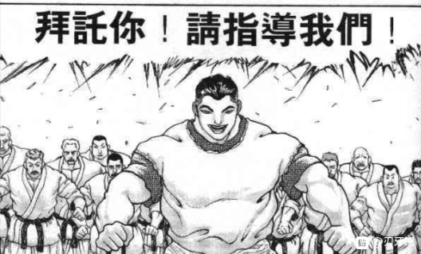

《本部老师的车万小常识》

本部：虽说是由我负责这个环节，但我也只是东方的初心者

只有每日数次从武道上离开的时候才会去看东方

因此无论是本篇还是这个小常识都在所难免的会出现一些不严谨的问题，如果大家看到了就请顺便帮我指出来吧

首先，像东方是什么？幻想乡是什么？这些问题——由于范围很大且我没有自信讲好，就请不了解的吧友们自行百度了

这个环节主要是做一些对登场人物的简要介绍，让没有接触过的人也能够了解角色们“为什么会说出这样的话，做出这样的反应”而不感到疑惑

除此之外我还想简单介绍的，就是弹幕决斗和符卡规则

我们先从幻想乡的战斗方式讲起吧

1 符卡规则是什么？

符卡规则就是相互竞技，展现美感的决斗规则。简略地说就是：

符卡就是给自己的绝技加上名字。使用时要进行宣言。

双方在决斗前要说清楚自己准备出多少张符卡。

持有的符卡全部被击破就必须承认输了。

胜利者只能拿决斗前说好的报酬，如果对对手提出的报酬不满意，可以拒绝决斗。

胜利者要积极接受失败者的再次挑战。

要有觉悟，随时可能出意外。

就是这样的内容，感觉更像是运动式的决斗。（以上内容来自东方求闻史记）

想必大家也能看得出来，尽管由于妖怪们力量强大仍旧有出现意外的风险，但符卡规则本身比起生死决斗更像是DUEL!的感觉

大家拿出自己最强的必杀技作为符卡，宣言后释放符卡，谁的符卡更强更漂亮更厉害谁就赢了

在这个贴子中由于实在不好让烈海王去比美，因此淡化了符卡关于美感的一面而强化了战斗的一面

战斗的报酬？

今天的战斗是橙单方面发起的因此她没有提要求

以后的发展中，说不定会出现：“我赢了就把你的腿给我！”“我赢了就把你的下半生交给我！”这样的展开

当然，一般情况下：“我赢了就给我去扫地/买菜/请我吃甜品”才是比较常见的

2 符卡规则的存在意义

可能很多人会好奇，为什么她们会选择用这种方法打架？

因为本代巫女博丽灵梦太强了

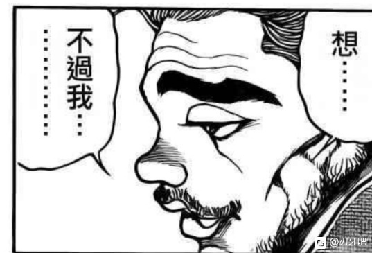

无论是什么妖怪，都无法打倒巫女。正当妖怪的存在意义快要消失时，她用一个划时代的手段，解决了这个问题。

那就是符卡规则。

导入这规则后，力量弱小的人类也有可能与妖怪一决胜负了。同时妖怪们也有可能轻松地打倒巫女，相反，妖怪也能在某种程度上乱来了。（以上内容来自东方求闻史记）

举一个简单的例子：在符卡规则推广前，可爱的琪露诺如果惹到了博丽灵梦，只会毫无还手之力地被一顿暴打

而现在，琪露诺可以安心地进行符卡宣言，然后使用冻符「Perfect Freeze」让博丽灵梦扭一扭甚至吃一嘴冰碴子

然后再被暴打一顿

虽然结果一样，但是过程大不相同，哪一天出现灵梦状态超级差琪露诺大胜利这种情况也不是没可能（实际不可能，但是就不要在琪露诺面前说了）

3 符卡

烈作为一个格斗家会有符卡吗？

当然

实际上，就算是在座的你我都可以有符卡

同样举一个例子

烈大喊一声：烈符【机关枪】然后拿着机关枪突突突突突突，这就是一次符卡宣言

同样，我拿起一块石头喊：石符【一块石头】也可以

前面的前缀名加不加都无所谓，比如纯狐女士的大多数符卡都没前缀

你说你想拿***巴或者更恶心的东西当符卡？

也可以，但弹幕决斗结束后对方不讲规矩把那些东西塞到你嘴里了，也不要后悔哦

接下来让我们简单介绍一下已经出场的人物们吧

圣 白莲

BGM:感情的摩天楼　～ Cosmic Mind

初登场于东方星莲船，是六面BOSS

种族：魔法使  能力：使用魔法的能力（擅长提升体能的魔法）

所属势力：命莲寺

圣白莲是命莲寺的住持

在遥远的过去她曾是一名人类，但经过修行后她超越了人类，成为了魔法使

她的能力是使用魔法对肉体进行的超强化，虽出自佛教但却修入魔道，平时就像没有力量的一般人类的她只要念诵咒文，拳头就能变得如同钢铁一样坚硬，五感变得十分敏锐，就算身在八卦炉中也能做到肉体的完好无损。长久的寿命和不受年龄影响的肉体都是通过魔法获得的。

对烈所说的略懂炼体完完全全是谦虚，完完全全

虽然曾经是人类，但圣白莲目前所在的命莲寺主要核心成员全都是妖怪

她并不是偏向于人类或者偏向于妖怪，而是发自内心的认为人与妖怪应当和谐相处

从这个角度上来说，可谓是有着一颗佛心

烈初见时感受到的妖气，是因为她长年累月与妖怪们共同生活所触动了烈的直觉

与本贴有关的人际关系：与神子有着复杂而微妙的关系，但绝不能说关系不好，等到之后的神子简介再说吧

冷知识：在命莲寺由白莲主持的法会被妖怪们当成了鬼故事大会

命莲寺中的妖怪们并不都像白莲一样善良，她们的目的各不相同，但是白莲会管好她们的

“圣白莲，我的超人” 圣白莲的标志性符卡名为超人圣白莲，是Lunatic难度的符卡

在深秘录中由于某些原因开上了摩托车，本人也相当喜欢飙车的样子

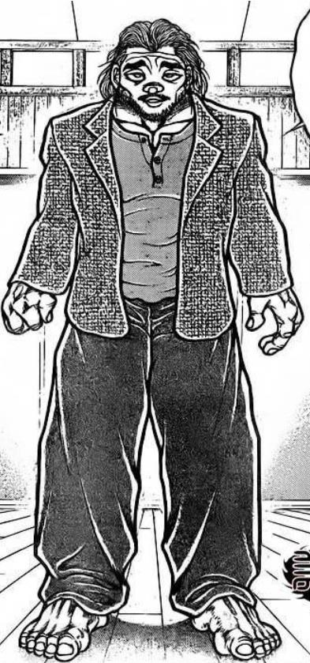

不好意思刚刚去跑步了，我们继续

接下来是今天贴子里烈的战斗对象

橙

BGM：凋叶棕（withered leaf）

初登场于东方妖妖梦，是二面Boss

种族：妖兽

能力：吓唬人类程度的能力（非式神）/使用妖术程度的能力（式神）

所属势力：迷途之家/八云家

橙是妖怪八云蓝的式神，即八云紫式神的式神，做式神期间拥有使用妖术程度的能力。

橙没有和自己的主人住在一起，而是独自在妖怪之山深处的迷途之家生活。

迷途之家是一个被荒废了的小村落，如今被山里的野猫占据，形成了猫咪的村落，橙管理着这里。

平时会来人类村庄袭击人类

如果是式神状态，就会和蓝及紫一起行动。

没有被式神附身的平时，有着和猫类似的习性，会和来人恶作剧

所谓式神不是种族，而是将鬼神凭依在她身上从而获得较高的妖力，但因为使役橙的也是式神，所以其能力稍低。

这里把式神理解为一种buff比较好（橙过来我给你加个buff）

橙在主人八云蓝附近时会拥有更加强大的妖力。

从介绍中可以看得出来，橙不是那种安分守己的妖怪，但她的危险性也并不高

考虑到迷途之家里有很多猫，说不定烈是在被一群猫围观的情况下打的第一场战斗

冷知识：橙十分怕水，一遇到水就会脱离式神状态。如果烈在今天的战斗中察觉到这一点泼了水，那接下来就不用打了。幸亏他不知道

橙对木天蓼无抵抗力。将干燥的木天蓼撒向她，她就会失去战意。幸亏烈不知道。

橙看上去很聪明，但是事实上只有附近人类的小孩程度的智慧。

橙的全名就叫橙。为什么没有八云的姓氏？zun没有说，我也不知道

一种常见的说法是因为“我式神的式神不是我的式神”，另一种说法是橙还没有成熟到能够被称为八云，但这两种说法都是二设，请不要当真

顺便一提，妖妖梦的二面道中BGM：远野幻想物语（就是烈跟橙战斗前我标的那首）是我很喜欢的曲子，大家有兴致不妨尝试一下

说实话这可真累，我太高估自己了。以后这个番外篇就不定时更新了，同时更本篇和本部我顶不住了

今晚的最后一个骰子

丰聪耳神子 好感度【1d40:9+60=69】

神子：武艺高强，厨艺得了，更重要的是面对妖怪也毫不退缩的勇气

认真聆听了一段时间，其内心也算得上纯净

烈海王，是值得期待的新人啊

《本部老师的车万小常识》

今晚的番外篇，我们来介绍一下烈海王在幻想乡遇到的第一个角色：丰聪耳神子

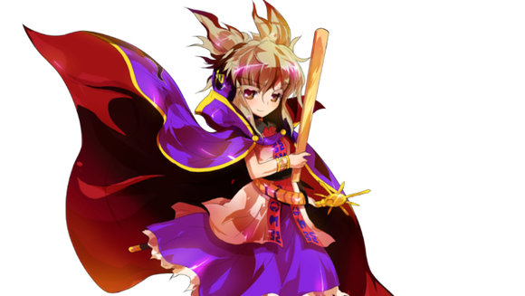

圣德道士 丰聪耳神子

BGM：圣德传说　～ True Administrator

种族：圣人 能力：能够同时听十人讲话程度的能力

所属势力：神灵庙

神子是从长眠中苏醒过来的圣人。她刚出生时就已经拥有非同寻常的才能，是远远超越了人类的超级人物。

现在成为超越了人类的仙人。但是，却还没完全对俗世的事断绝来往，偶尔还会介入人类社会的事。恐怕是过去身为执政者时残留下来的习惯吧。

性格意外的洒脱轻浮，老爱开玩笑。但当直接与她面对面时不光容易露出纰漏，甚至有全部都被看透一样的感觉，会变成更多是敬畏的感觉。

神子的能力虽然听上去很朴素，实际上却相当有用。她能够能够理解同时十个人说的话并准确的给予回答，但超绝的听力也给她带来了一定的麻烦。她所戴上的耳罩就是为了遮掩人们的声音从而保持心的平稳而存在的道具。除此之外还带有指向性功能，能选择只听到将要消失的非常微弱的声音之类的用途。

另外她还拥有即使对方没直接表达出来，也能从对方说话的方式、表情、行为等读出对方所思所想的能力，有此般洞察力的她跟常人比起来实在是卓尔不群。当那个欲望成为形成对方本体的重要因素的时候。她的能力是接近于读心，差异的地方是在于，后者是读出对方的记忆以及当前的思考内容，而前者却能做到读出对方的资质以及他的未来。（这也是神子对烈评价时所说“聆听”的来源）

神子与佛教有着奇妙的因缘。

在她还是圣德太子的时候，她表面上推行佛教以维护统治，实际却为了追求长生不老而信仰道教

神子为了追求长生不老，选择了成为尸解仙，即通过看起来死了一次后的再复活成就长生

然而神子没有想到，被她当成工具所利用的佛教实力变得非常强大，在她死后阻止了她的复活

神子耐心等到了现代，当她的存在被人质疑之时，她将灵庙搬到了幻想乡，准备在此实现拖延已久的复活

然而，一位名叫圣白莲的僧侣发现了神子的计划

为了镇压神子，她在神子的灵庙之上盖了一座寺庙，叫做白莲寺

这也是这两人奇妙因缘的开始——

本贴中的人际关系：

神子与圣白莲有着奇妙的关系

她们二人之间，与其说是敌对势力的领袖，不如说是立场不同的好友

两人同样致力于维护幻想乡的和平稳定，并为解决异变而奔走

虽然所属势力不同，但两人对彼此的实力与品行都抱有着充分的信任

在完全凭依异变中，为了调查异变真相，甚至结成了一对“主从”而共同战斗着

冷知识

与主张人与妖怪和谐相处的白莲不同，神子是彻头彻尾的人类派。她的到来甚至影响了幻想乡中的实力平衡，使得妖怪们无奈之下引入了外界的大妖怪二岩猯藏来作为制衡

神子的师傅霍青娥是天朝人，但她的理念与神子却大不相同，直白点说就是邪仙。值得一提的是，圣白莲相当讨厌青娥娘娘，神子也是把她当成反面教材的样子

神子表面上说着以和为贵，实际上嘛，那其实是叫其他人不要违抗她的意思（笑）

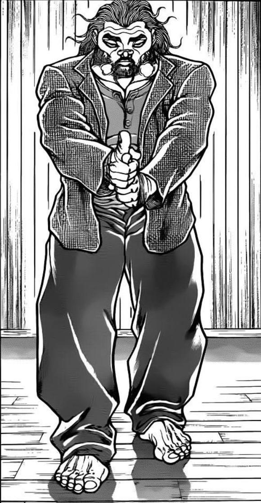

今天的另外一个话题，关于东方的实力论

先说结论：准确比较东方角色们的实力，是一件没有办法做到的事情

我们能做到的最多是将角色们大致分一下类——这些人是小妖怪，这些人比小妖怪要强，这些人是实力者，这些人是了不得的大妖怪，强者

但是如果要问“神子和圣白莲谁强？”“阿空打不打得过幽幽子？”这种问题，我只能说：

我不知道

我想除了zun也不会有人知道

因为在符卡规则和STG的体载下，东方对于实力的设定相当含糊，除了在东方绀珠传中出现过一位官方认定的天花板角色外，其他人谁打过谁我们根本没法知道

因此在不同的二次创作中，作者们往往会将角色的实力自己做一下决定

现在气氛很热烈！让她变强一些吧！

大家都很期待看的战斗，不打的势均力敌就说不过去了！

就是这样，本贴中的角色大概战力和战斗卡也都是我自己XJB搞得东西，还请大家千万不要当真

因为是刃牙X东方所以给红美铃加了海皇的二次设定，大家也千万别当真

至于跨作品比较......

就算你跟我说“露米娅一口吃了勇次郎”，那我也只能回一句“那露米娅的嘴真大啊”

另外，关于本贴的实力划分

基本上分为

1 目前的烈基本可以轻松战斗的小妖怪（Atk120以下）

2 与目前的烈势均力敌的妖怪（Atk180以下）

3 烈除了连续大成功压根没戏的实力者（Atk240以下）

4 我不想说的太失礼，请问烈海王准备死者苏生（Atk：？？？）

大概这样，具体数字随机应变决定

当烈的战力到第三档后就可以去参与解决一些小异变了

当烈的战力高于第三档后就可以去参与解决一些大异变了

当烈堂堂正正战胜了一名第四档强者之后，就可以投骰子决定是否完结了

这一天还很遥远，目前来看——

烈啊，你还是馒馒来吧

那么今天的番外到此结束，明天会更新正篇

之后的正片也会大概固定在隔一天更新一次的频率这样子

草，刚刚用手机看了一下 发现本部的东方人物简介并不怎么简，尤其今晚的神子内容太多了

这么整别说吧友们，我自己看了都嫌字太密

之后再更打算把字数控制在一半左右，只写下人物种族能力bgm这些必备信息，稍微解释一下能力和吐槽两句就结束。人物相关的具体的故事一展开又是好多行，（而且基本上copy于thbwiki）就不再加了

那么开始更新

～午饭后的神灵庙～

烈接下来要做什么？【1d10:5】

1 与神子交流

2 与霍青娥交流

3 与布嘟嘟交流

4 回永远亭

5 去人里闲逛

6 与神子交流

7与霍青娥交流

8 与神子交流

9 “神子大人，妖僧带着妖怪们打过来啦！”

10 大成功/大失败【1d2:2】

烈：神子殿下，我一直很好奇，所谓的人间之里就是幻想乡的普通人们所居住的地方吗？

神子：除了少数几位特立独行的人外，大部分的人类都集居在人里

生活所需的必备物资基本上都可以在这里买到，同时也有诸如甜品店，居酒屋等娱乐场所

有几位和你相性不错的人偶尔会去人里买东西，去碰碰运气也是不错的选择

烈的闲逛【1d10：4】

1 “红魔馆的门番真强啊”

2 采购物资的十六夜咲夜

3 卖药的铃仙

4 圣白莲的讲道

5 “红魔馆的门番真强啊”

6 卖药的铃仙

7 “红魔馆的门番真强啊”

8 路过铃奈庵

9 什么都没有发生

10 大成功/大失败【1d2：1】

“……说到底，所谓的神佛也不过就是妖怪。是作为妖怪将其排除呢，还是作为神佛将其供奉呢？那些，全都是人类自己决定的……”

在人间之里漫无目的地游荡时，烈听到了似曾相识的声音。

烈：这声音是——早上遇到的那位圣僧！

烈的情报【1d100：63】（50以上从神子处了解相关情报）

烈：（在神子殿下处得知，圣白莲是对人类妖怪平等视之的魔法师。而她的实力毫无疑问，也是幻想乡顶尖的水平。）

现在的我还差太远了——

然而，我不能平白无故受人恩惠

烈海王站在人群之中，静静等待着讲道结束

烈的等待【1d4：1】小时

一个小时过后，圣白莲的讲道结束了

烈的收获【1d10：4】

1 对命莲寺有所了解（面对命莲寺出身的对手战斗时Atk+10）

2 没有任何收获（才一个小时）

3 佛学知识提升（四千年的传承与武之怀的拆解成功值-1）

4 没有任何收获（才一个小时）

5 深有所悟（超人烈海王发动时攻击力加成+50）

6 没有任何收获（才一个小时）

7 没有任何收获（才一个小时）

8 对命莲寺有所了解（面对命莲寺出身的对手战斗时Atk+10）

9 佛学知识提升（四千年的传承与武之怀的拆解成功值-1）

10 大成功/大失败【1d2：1】

烈：感觉似乎略有所悟，但还差了那么一点

如果能多听一阵就好了

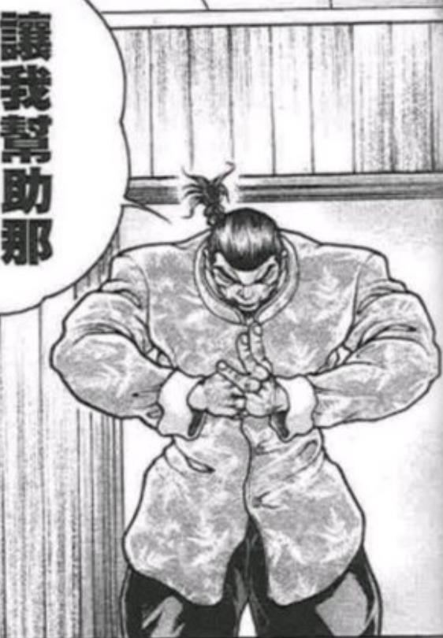

烈向讲道结束的圣白莲走去

烈：下午好，白莲师傅。今早您所教授于我的秘术真的很强大。

如果没有它的话，想必在不久前的弹幕战中，我已经一败涂地了。

我不能就这样无故接受您的馈赠，请让我报恩吧！

烈的坚持【1d70：65+30=95】（知恩图报+30）

圣白莲的开导【1d50：44+50=94】（圣僧+50）

短暂而激烈的争论后，圣白莲无奈答应了

白莲：这可真是顽固之人，我已经使出了浑身解数，却仍然不为所动，看来我的修行仍然不足啊

烈：（刚刚就差一点点就要被她说服了，好险）

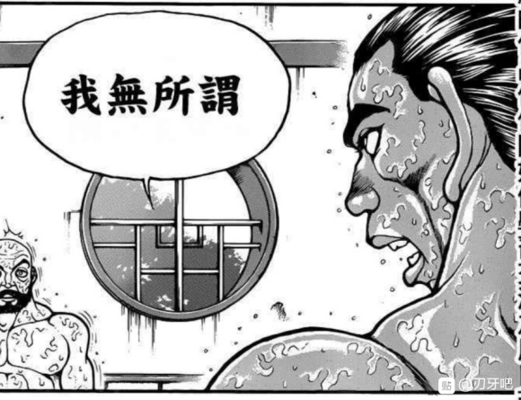

那么，烈的回报是【1d10：4】

1 帮忙进行讲道

2 在人里治病救人

3 圣白莲特供素斋

4 帮忙进行讲道

5 命莲寺武术教头

6 在人里治病救人

7 圣白莲特供素斋

8 以后再说吧

9 圣白莲特供素斋

10 大成功/大失败【1d2:1】

白莲：今早巧遇的时候我了解到，烈先生是有一定的佛学素养的

如果真的想要为我做些什么，那么不妨在我讲道时在一旁做些补充

因为与我不同，烈先生相对更加了解一般人的想法

聆听以他人视角讲解的我所诉说的佛理，对我来讲也是一种修行

——烈海王的日常任务增加了——

白莲：除此之外，我仍有一些无关紧要的话想要说，不知烈先生是否介意？

烈：我无所谓

白莲：那么，这不是作为命莲寺住持，而是仅仅作为魔法师白莲所说的话

一味的期待他人的帮助，然而自身却毫无付出，心中只有自己的存在，这毫无疑问是懒惰的【恶】

只愿意为他人而付出，却不想无故接受他人的善意，这却也是一种【恶】

两种对立的想法，却有着相同的缘由，那就是对“我”与“他人”的区别对待

烈：我并没有这么去想——

白莲：烈海王，我相信你并不是故意为之

但是你应当是遇到了一些事情，你或许以为他们所造成的影响已经消失了，但你的心中仍有执念，这在不知不觉影响了你的为人处世之道，使得本应出于善意的行为变得极端了，使得本应平和的心态变得偏激了

方才所说的【恶】只是这其中一个方面的表现而已

白莲：这件对你影响极深的事应当发生在【1d10：5】

1 前日（宫本武藏）

2 不久之前（皮克）

3 一段时间之前（大擂台赛）

4 许久之前（刃牙）

5 一段时间之前（大擂台赛）

6 不久之前（皮克）

7 【1d6：4】

8 一段时间之前（大擂台赛）

9 以上所有

10 大成功/大失败【1d2：1】

白莲：应当距离现在有2年左右的时间了吧

它对你的影响之大，甚至到现在仍有残留

不介意的话，不妨讲讲当时发生了什么？

烈：（2年前对我影响极大的事情是——大擂台赛！）

那件事情是这样的——

烈的解说【1d70：10+30=40】（圣僧的理解力+30）

烈：——海王们纷纷落败！毒手被破解了，金刚被扭曲了，被寄予厚望的春城甚至连一个照面都没有撑下来！

我们的中流砥柱刘海王，偏偏又在最开始的时候被地上最强干掉了！

结果到了最后，剩下的只有我和146岁的郭海皇作为中华武术仅剩的门面了——

（由于太过激动，烈还没有说完就情不自禁地流泪了）

白莲：（这可真是巨大的影响，原本那么坚毅的人居然说到一半就哭了出来）

烈先生，先平复下心情吧

再这么下去别说开悟，内心的压力甚至会变得更大的

烈的冷静花费了【1d30：22】分钟

烈：白莲师傅，让你见笑了。这么大个人了却还哭的像个小孩子一样，真是丢脸

白莲：那么，之后发生了什么？

烈：——最后，这一场没有结局的战斗就这么结束了。

烈的心结是【1d10：3】

1 是武术的失败

2 中华武术届无人

3 海皇之名被外人拿到了

4 是武术的失败

5 中华武术届无人

6 海皇之名被外人拿到了

7 【1d6：3】

8 是武术的失败

9 以上所有

10 大成功/大失败【1d2：2】

烈：我最为痛苦的事情是，中国武术的最高荣誉海皇之名，被外人得到了

我并不是质疑他的实力，那是毫无疑问的地上最强

我也不能责怪郭海皇，我怎么能责怪一个以146岁的高龄站出来去与那般可怕的人物进行生死搏杀的老先生呢？郭海皇是中华武术的巅峰，最后这样没有结局的结束，比起郭海皇被生生打死，终究是为我们保留了一份薄面

其余的队友们，也已经尽自己所能了

我没有办法责怪任何人

我只能怪无能的自己就这么眼睁睁的看着武术的皇冠没了

白莲的开导【1d10：3】

1 郭海皇不是武术的巅峰

2 那就把它拿回来

3 不过是一个名字而已

4 郭海皇不是武术的巅峰

5 那就把它拿回来

6 郭海皇不是武术的巅峰

7 最强的力量就在你的身边

8 那就把它拿回来

9 以上所有

10 大成功/大失败【1d2：1】

圣白莲：（糟了，烈先生刚刚讲解的太过杂乱，我一时间整理不好思路）

虽说是重要的名号，但也不过是一个虚名罢了

仅仅为了一个名字而产生心结，是不值得的

烈的纠结【1d100：13】（15以下开悟）

烈：是的，正是如此！

我太过纠结于虚名了，反而忘记了最重要的东西

中国武术并不是永远都会胜利的，我们在以前的罗马失败过，在与其他流派的战斗中也输过

但不久之后我们会汲取教训，武术会变得更强，然后战胜他们！

这就是中华武术的4001年！

圣白莲：（真没想到我没整理好思路时的随口一提会有效果）

能说出这样的话来，想必你已经看开了

如果仍有迷惑的话，去拜访武术的巅峰，去向你的师匠寻求帮助，或者直接去把海皇之名夺回来——你能做的事情还有很多呢

烈的察觉【1d100：74】（70以上get到了）

烈：白莲师傅，请您留步。您所说的武术的巅峰是？我想这世界上并不存在比郭海皇还要强的中华武者了。

圣白莲：我并不了解外界的情况，但我想中华武术并没有止于郭海皇

在雾之湖湖心的红魔馆，有一位名叫红美铃的门番

她虽然是妖怪，但却十分擅长武术，在这人间之里常有自认身手不凡的居民前去挑战她，但结果却毫无例外都落败了

烈先生，你在这幻想乡中已经有了自保的力量，但我想就现在而言，你的实力离她还有着相当的距离

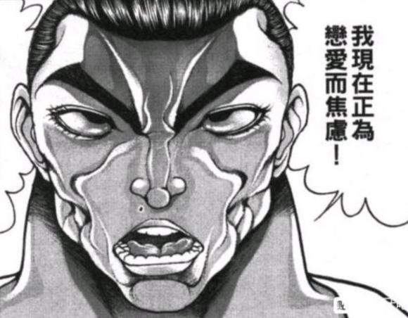

烈的反应【1d10：9】

1 明天去拜访

2 今晚去拜访

3 现在就去！

4 明天去拜访

5 明天去拜访

6 今晚去拜访

7 明天去拜访

8 现在就去！

9 【1d8：6】

10 大成功/大失败【1d2：2】

烈：多谢您的指点，我已经有了努力的方向

等到晚上人少了之后，我就前去拜访这位高手

烈道谢后离开了

白莲的好感度【1d50：4+50=54】

白莲：虽说本性不坏，但在某些方面过于执着了啊

心结被解开之后，不知会有什么变化呢

前往红魔馆前烈的行动【1d10：9】

1 寻找新的假腿

2 铃仙：“烈先生？”

3 寻找新的假腿

4 去铃奈庵看书

5 铃仙：“烈先生？”

6 寻找新的假腿

7 等不及了现在就去

8 铃仙：“烈先生？”

9 吃晚饭

10 大成功/大失败【1d2：2】

烈：不管怎么说饿着肚子都没法好好战斗，中午没吃饭有点失策了

先去吃个晚饭吧

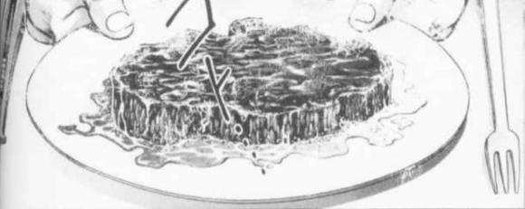

烈海王在人里随便吃了点东西

晚饭的味道【1d100：89】

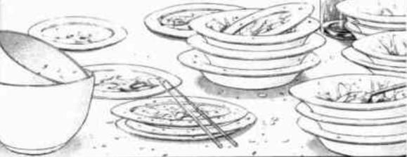

烈：只是随便找的餐厅味道却相当不错！

莫非是当地的名店？【1d100：19】（80以上与随机人物相遇）

烈：看来只是普通的店

幻想乡居民的生活水平意外的高啊

——酒饱饭足，烈海王的伤势稍微恢复了——

假腿断裂造成的Atk减值由20变成了10

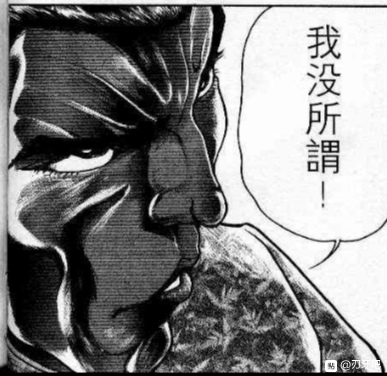

烈前往红魔馆的途中【1d100：42】（时间到了夜晚，30以下有坏事发生）

烈海王平安无事的来到了雾之湖

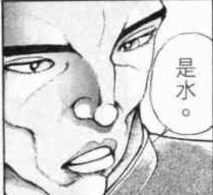

烈：湖中心的就是红魔馆吗

风景虽然不错但是交通不便啊，大概妖怪们无需担心这个问题吧

烈：不过对我来说，没什么所谓！

烈的渡湖【1d100：96大成功】（由于假腿断裂，50以下失败）

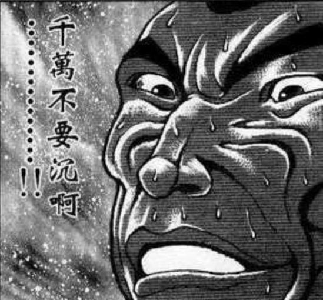

烈：哦哦哦哦哦！今晚状态绝佳一口气跑上来了！

大成功是什么【1d10：1】

1 红美铃好感度+10

2 十六夜咲夜好感度+5

3 蕾米莉亚·斯卡雷特好感度+5

4 琪露诺好感度+10

5 于踏湖中有了新的体悟，Atk+10

6 领悟了新技能（为啥啊）’

7 红美铃好感度+10

8 帕秋莉好感度+10

9 红美铃好感度+10

10 大成功/大失败【1d2:1】

BGM：上海红茶馆　～ ChineseTea

“真厉害！在行动不便的状况下仍旧展现出了如此之高的技术，这可真是难得一见啊！”

在烈海王面前出现的是，10代后半的高挑少女

她身穿建国早期风格的绿白衣，留着一头漂亮的红色长发，两侧的鬓发扎成麻花，末梢系着黑色的丝带，头上戴着绿色的上有写着“龍”字金属星形物的帽子。

红美铃：从你的身法来看，你所修习的也是中华武术吧？真是没想到，在这异国他乡的隐秘之处还能见到同乡的武者。

我是红魔馆兢兢业业的门番红美铃，你来到此处有何打算？

烈海王：初次见面，红美铃大师。

我是来自外界的武者，烈海王。

红美铃：原来是海王？怪不得会有这般技术。

你学的是哪家的功夫？老李的八极拳，老霍的迷踪拳，还是老黄的洪拳？

烈海王：实际上，现在外界的情况已经跟之前有很大不同了

各门各派的大多数武术，都开放给武者们自由地修习

各个门派的技术我都会一些，真要说独一无二的独门秘传——

是郭海皇的消力

红美铃：哎？老郭成海皇啦？？

真没想到会是他！我记得他当年突然说是要通过舍弃肌肉掌握拳理，还以为他误入歧途了，现在居然成功了吗

听你的口气，老郭现在还在？

烈海王：是的，他老人家现在身体仍然很硬朗，今年已经146岁高龄了

（她莫非认识年轻时的郭海皇？她之前还提到了那些大师们——红美铃到底多少岁了？）

红美铃：原本还想询问你的来意，现在看来已经没有必要了

不过，我已经很久没有正经跟人动手了，就算现在跟你打，也只是符卡规则下的弹幕战

这样也无所谓吗？

烈海王：红大师，我无所谓！

白林寺烈海王，请指教！

红美铃：红魔馆红美铃，只是一个门番而已，不用叫我大师啦~

这场战斗发生在红魔馆门口，红魔馆中有人旁观吗？【1d10：4】

1 十六夜咲夜

2 帕秋莉

3 蕾米莉亚

4 芙兰朵露

5 没有

6 咲夜+蕾米

7 蕾米+帕秋莉

8 芙兰+蕾米

9 【1d8：6】

10 大成功/大失败【1d2：1】

“又有人来挑战美玲了？希望能打的好看点”

在烈海王没有注意到的天空上方

恶魔之妹正饶有兴致地注视着即将发生的战斗

战斗！

BGM：明治十七年的上海爱丽丝

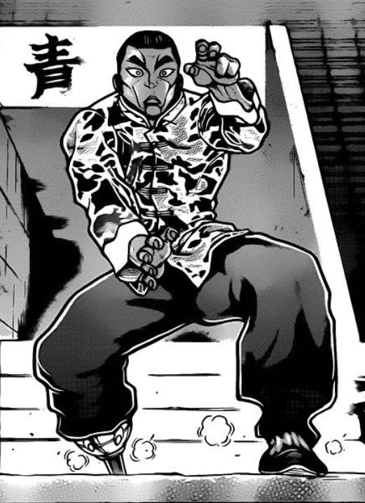

烈 海王

Atk 134（80）

Hp 13（15）

技能

烈 海 王：海王是中华武术的巅峰，烈海王又是其中佼佼者，凭借高超的技术使战斗力X1.8

消力：传自郭海皇的绝学，普通攻击以及近战系技能所造成的的最终伤害/2

四千年的传承：不会陷入异常状态，面对近战系、技术系的技能可以进行【1d100】的破解判定，75以上成功

假腿断裂：肢体缺失导致HP-2，Atk-10（吃到了美味的晚餐，断裂后的伤害减轻了）

必杀技

武之怀（CT5）：3T内Atk+60。3T内可对所有攻击进行【1d100】的破解判定，普通攻击与近战系、技巧系技能30以上成功，其余技能50以上成功，必杀技75以上成功。

超人烈海王（CT6）：Atk+600，给予伤害X3，之后2T回避概率翻倍

红美玲

Atk 160（100）

Hp 15

技能

海皇之名非我所需：弹幕战中不会使用真传武术

无冠的武艺：纵使不出全力仍是极强的武者，AtkX1.6

华符「芳华绚烂」（CT3）：（技巧系）放出相同形状的美丽弹幕，本回合Atk+30

极光「华严明星」（CT4）：（弹幕系）将七色的巨大气弹精炼后，向敌人打出，对对手造成【1d4】的伤害

【武之真意】：战斗失败且战意高昂时自动发动

必杀技：彩符「极彩台风」（CT5）：放出七彩的弹幕雨对对手造成伤害，本回合Atk+450，给予伤害X2

T1

烈的攻击【134+1d100:83=217】

红美铃的攻击【160+1d100:82=242】

红美铃：身体素质还是我更胜一筹

烈的伤害【1d10：3】

1 回避

2 小伤害/2（实质无伤）

3 小伤害/2（实质无伤）

4 中伤害/2

5 中伤害/2

6 中伤害/2

7 大伤害/2

8 大伤害/2

9 特大伤害/2

10 大成功/大失败【1d2：1】

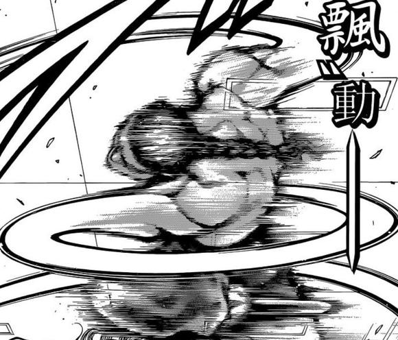

烈：这就是郭海皇所传授的消力！

红美铃：直接将受到的攻击化解了，真不错

T2

烈的攻击【134+1d100：31=165】

红美铃的攻击【160+1d100：26=186】

烈的伤害【1d10：5】

1 回避

2 小伤害/2（实质无伤）

3 小伤害/2（实质无伤）

4 中伤害/2

5 中伤害/2

6 中伤害/2

7 大伤害/2

8 大伤害/2

9 特大伤害/2

10 大成功/大失败【1d2：2】

Hp：13-2/2=12

红美铃：看来受到的伤害较大时无法完全消去啊

T3

红美铃：符卡宣言，华符「芳华绚烂」！

红美铃的攻击【160+30+1d100：20=210】

烈的破解【1d100：82】判定成功

烈：看上去漂亮但是内部规律却很明显，我已经看破了！

红美铃的受伤【1d10：2】

1 回避

2 小伤害

3 小伤害

4 中伤害

5 中伤害

6 大伤害

7 大伤害

8 特大伤害

9 特大伤害

10 大成功/大失败【1d2：1】

Hp：15-1=14

红美铃：这是观赏用符卡啦~

T4

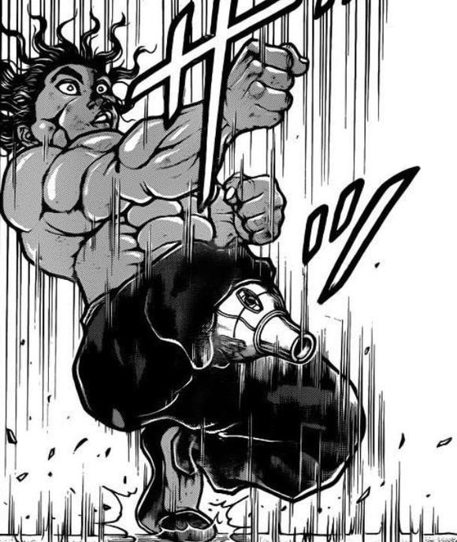

烈的攻击【134+1d100：4=138】

差值大于100自动失败

烈：糟了！

烈的受伤【1d10:6】

1 回避

2 小伤害/2（实质无伤）

3 小伤害/2（实质无伤）

4 中伤害/2

5 中伤害/2

6 大伤害/2

7 大伤害/2

8 特大伤害/2

9 特大伤害/2

10 大成功/大失败【1d2：2】

红美铃：乘胜追击，接下来这招你可没法靠技术破解了！符卡宣言，极光「华严明星」！

造成伤害为【1d4：2】

烈的Hp：12-2-3/2=9

