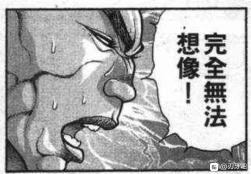
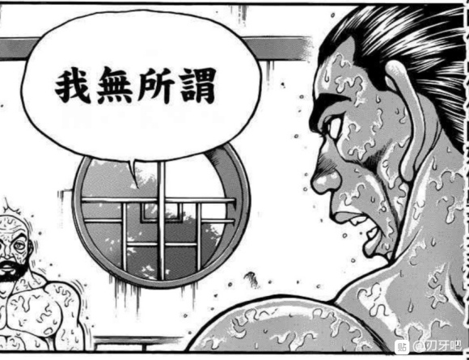

T5

红美铃：继续，接下来是这张。符卡宣言 彩符「极彩台风」！

差值大于100，战斗自动失败

烈：将身体交给武术！

武之怀发动

破解判定【1d100：59】失败

烈：红美铃……真是名副其实的强者

烈的受伤【1d10：2】

1 回避

2 小伤害X2

3 小伤害X2

4 中伤害X2

5 中伤害X2

6 大伤害X2

7 大伤害X2

8 特大伤害X2

9 特大伤害X2

10 大成功/大失败【1d2：2】

Hp：9-1X2=7

T6

烈：（武之怀的效果还在，这里先暂且不用其他技能）

红美铃：符卡宣言 华符「芳华绚烂」

（到目前为止的表现可算不上好啊）

烈的破解【1d100：15】失败

红美铃的攻击【160+30+1d100：55=245】

烈的攻击【134+60+1d100：91=285】

烈：你尝尝中华武术的厉害吧！

红美铃：不是，你跟我说这话？

红美铃的受伤【1d10：9】

1 回避

2 小伤害

3 中伤害

4 中伤害

5 大伤害

6 大伤害

7 大伤害

8 特大伤害

9 特大伤害

10 大成功/大失败【1d2：2】

Hp：14-4=10

T7

烈的攻击【134+60+1d100：53=247】

红美铃的攻击【160+1d100：79=239】

烈：逐渐适应这种风格了！

红美铃的受伤【1d10：5】

1 回避

2 小伤害

3 中伤害

4 中伤害

5 大伤害

6 大伤害

7 大伤害

8 特大伤害

9 特大伤害

10 大成功/大失败【1d2：2】

Hp：10-3=7

T8

（武之怀判定结束）

烈：这是我竭尽全力的一击！

超人烈海王发动

烈的攻击【134+600+1d100：7=741】

红美铃：那么我也以全力对应！符卡宣言 彩符「极彩台风」！（气氛十分热烈因此拼尽全力提前发动，CT-2）

红美铃的攻击【160+450+1d100：56=666】

红美铃的受伤【1d10：9】

1 回避

2 小伤害X3

3 中伤害X3

4 中伤害X3

5 大伤害X3

6 大伤害X3

7 大伤害X3

8 特大伤害X3

9 特大伤害X3

10 大成功/大失败【1d2：1】

Hp：8-4X3=0

符卡战斗结束 胜者 烈海王

红美铃好感度+30，芙兰朵露好感度+10

红美铃：啊，输了！要被咲夜和大小姐骂了~

芙兰朵露：在此之前会先被我骂哦

红美铃：二小姐也来？！

——【武之真意】发动——

红美铃：不过，久违的打了一场痛快的战斗啊。

符卡战到底还是差点意思，稍微有些想认真打一次了

当然，这场符卡战本身我已经输了，接下来的不过是个人的兴趣而已

要来过过手吗，烈海王？

烈的回应【1d10：9】

1 当然

2 当然

3 当然

4 当然

5 当然

6 当然

7 当然

8 当然

9 当然

10 来吧！

烈：当然！这正是我梦寐以求的战斗！请让我见识一下吧，超越郭海皇的中华武术！

武者 烈永周，请指教！

红美铃：那么——

太极拳 红海皇，请指教！

红美铃（战意高昂）

Atk 225（100）

Hp 18

技能

红 海 皇：超越海王，即为海皇。AtkX2.25，Hp+3

三华「崩山彩极炮」（CT5）：（近战系）给予敌人强烈的三击，造成【3d2】的伤害

彩华「虹色太极拳」（CT4）：（技巧系）发出如波纹一般在地面缓慢扩散流动的气波，由此长时间限制住对手行动。3T内对手Atk-35，3T内每T对手都需进行一次【1d100】的束缚判定，低于30陷入束缚

必杀技

星气「星脉地转弹」（CT5）：向敌人打出高纯度的巨大彩色气弹：蓄力1T，Atk+700,造成伤害X4

华符 「彩光莲华掌」（CT6）：将大量的气打入对手体内再引爆之，造成大伤害的超大打击。Atk+600，造成伤害X3，战斗结算后对方进行【1d100】的内伤判定，30以下Hp减半

烈 海王

Atk 134（80）

Hp 7（15）

技能

烈 海 王：海王是中华武术的巅峰，烈海王又是其中佼佼者，凭借高超的技术使战斗力X1.8

消力：传自郭海皇的绝学，普通攻击以及近战系技能所造成的的最终伤害/2

四千年的传承：不会陷入异常状态，面对近战系、技术系的技能可以进行【1d100】的破解判定，75以上成功

假腿断裂：肢体缺失导致HP-2，Atk-10（吃到了美味的晚餐，断裂后的伤害减轻了）

连战：Hp沿用上场战斗的最终值

必杀技

武之怀（CT5）：3T内Atk+60。3T内可对所有攻击进行【1d100】的破解判定，普通攻击与近战系、技巧系技能30以上成功，其余技能50以上成功，必杀技75以上成功。

超人烈海王（CT6）：Atk+600，给予伤害X3，之后2T回避概率翻倍

T1

【武之真意】发动：双方所有技能·必杀技CT清0

烈：红海皇，我不是你的对手——

因此我把所有的力量，全部投入在这一击之上！

武之怀发动

超人烈海王发动

烈的攻击：【134+60+600+1d100：64=858】

红美铃：让我看看你的全力吧，烈海王！

符卡宣言 华符 「彩光莲华掌」！

红美铃的攻击：【225+600+1d100：63=888】

烈的破解【1d100：40】判定失败

烈：这就是红海皇的真正实力——武术的真正力量！

即使我已经使出全身解数，仍然稍逊一筹，破解的思路更是无处可寻！

烈的受伤【1d10：8】

1 回避

2 小伤害X3

3 中伤害X3

4 中伤害X3

5 大伤害X3

6 大伤害X3

7 大伤害X3

8 特大伤害X3

9 特大伤害X3

10 大成功/大失败【1d2：2】

Hp：8-4X3=0

战斗结束，胜者 红美铃

红美铃的好感度【10+10+30+1d50：30=80】（踏湖大成功+10，中华武者+10，弹幕战胜利+30）

红美铃：好样的，烈海王。硬吃了我这全力一击而无大碍，中华武林后续有人啊！

烈：红海皇，我想还没断气应该不算无大碍

接下来可得好好休息一段时间了……

芙兰朵露·斯卡雷特的好感度【10+1d90：86=96大成功】（弹幕战观战+10）

芙兰朵露：嘿！哈！破！哦哦哦哦哦！

一边大喊大叫一边打架真有趣

而且，仔细一看人长得很帅气啊

烈海王，我会经常去找你玩的~

红美铃：我想您经常离开红魔馆的话大小姐会生气的

芙兰朵露：那就，烈海王，你要经常来陪我玩啊！我会小心地，尽量不把你玩坏的~

烈的察觉【1d100：61】（80以上察觉）

烈海王：（反正之后也会常来找红海皇）

我无所谓

红美铃：啧啧......烈啊，自求多福吧

烈：虽然刚切磋完就这么提要求实在是失礼——

红海皇，请指导我！

我现在感到有些迷失了方向

受到了永琳师匠的指点，得到了白莲师傅的馈赠，现在又见识到了至高的武艺

我不知道我应将精力集中在哪一方面了

红美铃的指点【1d10：5】

1 消力

2 天文密葬法

3 超人术

4 “你想学？我教你啊”

5 从现在开始，由扎马步开始重新练习吧

6 先把腿的问题解决

7 从现在开始，由扎马步开始重新练习吧

8 “你想学？我教你啊”

9 “你想学？我教你啊”

10 大成功/大失败【1d2：1】

红美铃：烈海王，我想你已经认识到自己的问题了

你会的技术绝不算少，无论是外界的武术还是幻想乡内的绝技，你都有所修习

然而问题在于，你的身体本身跟不上你的技术

如果是老郭来施展消力，想必就算是弹幕大玉也能轻易消去，按照他的想法应该还能将消力用于攻击吧

同样的，如果是圣白莲本人所使出的超人术，想击败我也是轻而易举

但你却做不到

归根到底，你的身体太过孱弱了

与年轻时的老郭都相差甚远，更何况是在这妖怪遍地的幻想乡中呢

我不是让你放弃技术的修习，只是烈啊

从现在开始，由扎马步开始重新锻炼你的肉体吧

烈海王陷入了沉默

芙兰朵露：美玲，你还会毒舌啊

刚刚看你打的很开心，结果其实很讨厌他？

红美铃：不是啦二小姐~

这是我们家乡的传统，有些话必须要严肃地说，与个人好恶无关的

我很欣赏烈哦

看着他那副样子，让人回想起当年的时光了

烈：谢谢你，红海皇！

你说的没错，从最基础的事情做起而不是好高骛远地渴望绝技，这才是武者应有的态度！

今晚如此冒昧拜访，真真失礼了，请问日后我可否跟随您修习呢？

红美铃：只要不打扰大小姐她们，我无所谓哦

烈：那么就此告辞

再次感谢您的指点！

再见，红海皇，再见，芙兰朵露小姐！

芙兰朵露：现在不再见哦~

烈：？？？

芙兰朵露：晚上的幻想乡对你来说很危险

我送你回去吧

——芙兰朵露抓起了烈海王，向着永远亭飞去——

（今天的更新结束，不过烈的一天还没结束，真是漫长的一天啊）

（晚上或者下午更新一下永远亭众人对烈的吐槽，然后他就终于可以结束漫长的第二天了）

（以下是我的废话）

再次骰到一成的圣白莲，真是佛缘深厚啊

因为辩论时两人的出目都太高了，高到让人感觉奇怪的地步（而且烈还赢了）因此就顺带带出白莲的说教环节了

话说回来对54好感度的人都这么有耐心，白莲，你好善良

几次错过了红海皇，还好最后一个准备放弃的骰子成功了

跟放水红海皇打的怎么跟橙这么像，不吃瘪你不会打吗

骰到后面打完了我才想起来，其实T6直接把超人开了好像也没事

就当做烈想要好好享受吧（不是）

顺便最后一个回合，是把伤害都投完了之后战斗结束了才发现这里红海皇就算技能全开也出不了更高的值了

那就为了炒热气氛直接发动吧！CT靠毅力去克服！

与红海皇的第二战，以烈目前的实力根本不用考虑怎么赢的问题

所以直接大招决胜负了，大招赢了再考虑之后的发展

然后

神子白莲红海皇都很安全，真是太好了

就在我这么想的时候

二小姐大成功了

为 什 么 啊

短暂的更新一下，结束第二日的剧情

顺便一提刚刚试了一下吧友推荐的猫爷TRPG，确实挺好用，以后就用这个网站了

感谢吧友 @资源管理earth  的推荐

回到永远亭的路途中有不长眼的妖怪袭击吗？【1d100：94】（10以下有）

芙兰朵露：那么我就回去了~要常来找我玩哦，烈……河王？

烈：是烈海王，记不住的话叫我烈就好

谢谢的你的帮忙，芙兰朵露小姐，说实话让我自己走的话大概要花上很久一段时间了

芙兰朵露微笑着在烈的脸上抹了一下，之后飞走了

烈海王回到了永远亭

烈：还好之前为了保险起见，把晚餐的份也做好了，不然可真是失职了

话说回来，我的脸上有什么东西吗？

铃仙：烈先生，你回来啦。怎么这么晚才——

烈先生你满脸是血啊！而且假腿也断掉了！送个饭而已到底发生了什么才会变成这样？！

快去找永琳师匠吧！

——师匠治疗中——

看热闹的永远亭众，正听着烈海王的说明解闷

烈的说明【1d100：11】

烈：噗——我 噗——白莲 噗——红海皇 噗噗噗——

师匠：烈啊，我理解你很想说话，但还是先把伤治好再说吧？

毕竟你现在一边讲话一边喷血，别说理解了公主已经要笑晕过去了

烈的治疗花费了【1d30：28】分钟

烈：——然后我就回到了永远亭

真是没有想到，本来只是出去送个饭，居然会发生这么多事情

铃仙：圣白莲大人真是好心肠啊。烈先生的佛缘意外的深厚？

因幡帝：哎呀呀，这可真是了不得的战果。苦战之后将猫妖击败了，之后又全力以赴战胜了放水的门番，多么强大啊

因幡帝的阴阳怪气【1d100：30】

烈的迟钝【1d100：100大成功】

烈：也没有你说的那么强，被这么夸奖感觉蛮不好意思的

大成功奖励：烈（自认为）被同伴诚心夸奖了，心情舒畅，Atk+2

因幡帝：公主大人，这人到底怎么回事？

辉夜：对他这种类型的人用你那套方法是行不通的哦。看我的

辉夜：话虽如此，无论是式神的式神还是红魔馆的门番，在幻想乡中可都算不上什么强者哦

别说跟永琳比，跟我比都差的远了

加把劲吧烈海王，咱们永远亭可就指望着你丢人了

烈：说的也是，真抱歉

皮克：“你哪还算是人”

皮克给烈海王带了一块肉

烈：谢谢你，皮克，我已经吃饱了

皮克把肉吃掉了

师匠：不管怎么说，开头的两次弹幕决斗都获胜了，这不是个不错的开始吗

强大不是一步而就的，而是日积月累的锻炼积累而成的

维持这样的劲头继续保持下去，有朝一日超越我也不是不可能哦

辉夜：不，怎么想这都是不可能的

“好的，治疗结束了”

永琳细心地将烈脸上的血迹擦拭干净，向他露出了笑容

烈的心动【1d100：75】（90以上心动）

烈：（从这个角度看的师匠真漂亮——不对，我在想什么！怎么能对恩人起这样的想法呢！）

我的修行还是不足啊

——第二日剧情结束——

成就：第一次的胜利达成！

Atk+3，Hp+1

成就：战胜橙达成！

Atk+3

此后除特殊情况外，战胜Atk120以下的对手将不会带来能力值上升了

成就：战胜红美铃达成！

Atk+4

成就：根除心魔达成！

Atk+3，Hp+1

成就：烈海王，你好强大（嘘）（迟钝100大成功获得）

Atk+2

烈的总成长：Atk：80+3+3+4+3+2=95

烈 海 王技能加成后为171

Hp：15+1+1=17

假腿技能加成后为15

消化、感悟战斗并得到以上成长共花费了烈海王【1d30：30】天的时间

下一次的剧情将从烈海王来到幻想乡的第32天开始。

本日的所有更新结束，下一次的更新在后天

附：今天下午的骰子

话说这个投骰子的网页能不能让他人进的？如果能的话直接发个网址大家就可以自己去看了

～今晚的小番外～

关于安价与安科

安科是由作为贴主的我给出多个选项，由骰子选出其中一个选项来决定故事的发展

安价则与之相反，是由贴民们（也就是吧友们）给出选项，然后用骰子从吧友们给的选项里选出一个来

为什么我要突然说这个？

因为之后的正篇更新内容会是烈在30天内与他人的交流

然而，人与人之间存在奇妙的因缘

即使是毫无关系的两个人，也很有可能在莫名其妙的地方相遇

因此，为了让故事更加有趣，决定在今晚九点进行一次安价

具体内容是烈在【什么地方】遇见了【什么新人物】

举例:在【永远亭】遇见了【八意永琳】

地方不一定要和人物有关，写在地灵殿遇到了辉夜完全没有问题

不过，由于有些角色实在是难以圆回来

因此角色的范围限制在【东方正作stg】与【东方格斗作】出场过的人物

大概就是这样，大家有兴趣的话不妨参与一下

今晚九点我会单独开一层用来安价，到时候就在那一层回复吧

选项从前十个有效的回复中骰

就是这样

安价楼

烈海王将在【什么地方】与【什么新人物】相遇？

请在此楼回复

再次重申一次，范围仅限于【东方stg正作】与【东方格斗作】中登场的人物

（以下选项按照回复时间顺序排列）

1 在太阳花田遇到了比那名居天子

2 在永远亭遇到了纯狐

3 在博丽神社遇到了八云紫

4 在魔法森林遇到了森近霖之助与宇佐见堇子

5 在香霖堂遇到了雾雨魔理沙

6 在人间之里遇到了古明地恋

7 在太阳花田遇到了风见幽香

8 在红魔馆遇到了蕾米莉亚·斯卡雷特

9 在永远亭遇到了博丽灵梦

10 在人间之里遇到了茨木华扇

【1d10:7】

那么，烈海王将在太阳花田遇到风见幽香

我的娘嘞，天子，纯狐，紫妈，恋恋，幽香，大小姐，灵梦，华扇，足足七个顶尖实力者和一个规格外

你们这是想让烈去冥界吗（悲）

我得赶紧给烈海王编个理由起码保个10左右的基础好感度——不然别说活用于下辈子，一个不小心下辈子都没了

那么今天就这样，后天的正式更新就可以看到烈与幽香的相遇了

这是发生在烈海王来到幻想乡的第【2+1d30：20=22】天的事

因幡帝：今天的陷阱又失败了……

已经22天了，无论什么样的陷阱都是，一次都没有中过是什么鬼啊！

明明中了陷阱也就只会受点擦伤而已，有必要这么警觉吗？

或许是因为连续22天的打击过于大了，又或许是帝今日过于气急败坏了——

总之，今天的因幡帝想出了一个绝对称不上好的恶作剧

因幡帝：（就算是烈海王也不会傻成这样吧）

呐呐，烈先生，可以请你帮我一个忙吗？

烈：有什么事情吗，帝小姐？如果是在我的能力范围内，我一定会全力以赴。

因幡帝：（好的，就这样提出一个他根本做不到的要求然后装出一副哭脸看他那副为难的表情！）

——可以请你去太阳花田，帮我摘一朵向日葵吗？

烈对太阳花田的了解【1d70：52+30=82】（神子的科普+30）（75以上将会有所准备）

烈海王回想起了神子的教导

“太阳花田是幻想乡中十分危险的地方”

“因为它的主人风见幽香，无论从哪方面来讲脾气都算不上好”

“只是普通误入倒不会有什么所谓，要是有人不巧把花田搞乱了——啧啧，那可只能用悲剧来形容了”

“你问惹到风见幽香会怎么样？”

“这个嘛，你可以或许考虑来我们神灵庙拜师哦！毕竟所谓的尸解仙总是要先死上一回的，不过到时候还有没有肉身能剩下就难说咯，哈哈哈哈哈！

思考着神子那一点都不好笑的冷笑话，烈海王陷入了短暂的沉默

正当因幡帝准备假哭时

烈：当然没有问题，不过可能需要耗些时间，估计会回来的比较晚

今天的饭我会提前准备好的，请不用担心

烈点点头离去了

因幡帝：不是，哎？

喂，烈海王，我只是在跟你恶作剧——

烈：太阳花田应该说是幻想乡中数一数二的危险之地了

我不能就这么空着手去，怎么都要做些准备才好

烈的准备【1d10：6】

1 烈海王秘制点心

2 永琳制特效花肥

3 凭我烈海王的口才！

4 烈海王秘制点心

5 精致小盆栽

6 烈海王秘制点心

7 永琳制特效花肥

8 四千年的种植技术

9 烈海王秘制点心

10 大成功/大失败【1d2：2】

烈：嗯，我想就算是大妖怪应该也会喜欢吃点甜食

但桂花糕这类可能会刺激到她

考虑到如果对方不在场，可能还需要等待一段时间，最好还是带些能放久一些的甜品

还好永远亭有保温盒

这样的话就做些冻的双皮奶，几块芒果班戟，烤一盘巧克力饼干，然后再来些解暑的绿豆水——

完成了！顺便给师匠她们也留一份吧

于是，烈海王带着一大盒子甜品前往太阳花田了

——太阳花田——

烈海王迈着奇怪的步伐，小心翼翼地绕开了地上的植物们

烈：（到这里就差不多了）

风见幽香女士，您好，我是来自永远亭的烈海王

我带来了一些小礼物，请问可否让我前来拜访？

有回应吗？【1d2：1】

1 有

2 没有

