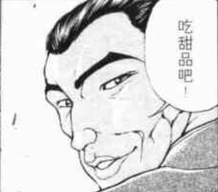
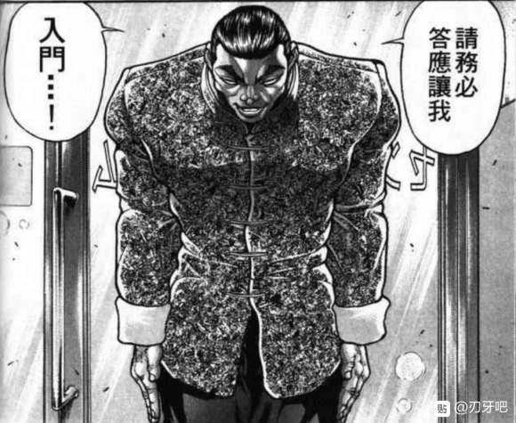

“永远亭的烈海王是吗？没有伤害到花呢，就让你进来吧”

向日葵们缓慢地移动着，为烈海王让出了一条路

“那么，你到此处有什么事情吗？很多人都不愿意来我的花田呢，明明向日葵十分美丽”

站在花田中央的，是有着明亮绿发的高挑少女

她穿着色彩明亮的服装，打着白色的阳伞，脸上带着平和的笑容

微笑着向烈搭话的，正是幻想乡中数一数二的大妖怪，风见幽香

烈：（就这么直接说明来意绝不是正确的选择！）

风见幽香女士，我为您带了一些小点心，不介意的话要不要试试呢？

我们可以边吃边谈

烈的厨艺【1d50：1+50=51】（75以上有好感加成）

幽香：马马虎虎吧，我不大爱吃凉的东西

烈：（糟了，在温度上出了差错！她居然喜欢在大夏天吃热的！）

幽香的好感度【1d90：80+10=90】（爱护花草+10）

然而，风见幽香温和地笑了

幽香：不过，你应当是在这些点心中投入心意了吧？

我并不喜爱这些味道，但我吃得出你的用心

妖精们大概会喜欢这些点心吧

你是个有礼节的人，烈海王，而你的心意与礼貌在此处得到了回报

说吧，有什么事情吗？

烈：（我的心脏啊……）

我一直听闻，太阳花田的向日葵是幻想乡中最为美丽的花朵之一，今日一见果然名不虚传

可否请您赠我一朵向日葵呢？

幽香的回复【1d10：2】

1 好啊

2 想吃甜品

3 想学武术（为啥啊）

4 想学厨艺

5 想和妖精们开茶话会

6 想去赏花

7 想吃甜品

8 想学厨艺

9 想和妖精们开茶话会

10 大成功/大失败【1d2：2】

幽香：嗯……有些想吃甜品了，热的

你带来的这些想用来招待妖精们呢

你还会做其他的吗？

烈：当然，请稍作等候

烈的选择【1d10：10】

1 芝麻糊

2 红豆沙

3 银子莲耳羹

4 热双皮奶

5 热巧克力拉瓦

6 派

7 热豆腐花

8 马蹄糕

9 流沙包

10 大成功/大失败【1d2：1】

。

。

。

烈海王在此刻，爆发出了前所未有的，对于做甜品的热情

前往人里采购材料，向一旁的商家借用了厨房，并用最快的速度将甜品制作完成

无需他人的帮忙，他只凭自己一个人就在极短的时间内完成了包含多样甜品的大拼盘！

那仿佛厨神一样的姿态，吸引了无数路人的目光，直到他无声离去之后，也仍有人沉醉在刚刚发生的奇迹中无法自拔……

大成功的效果是【1d10：3】

1 幽香好感度增加【1d10】

2 深受感动的幽香拿出了迷藏的葵花籽

3 深受感动的幽香决定教烈两招（为啥啊）

4 幽香好感度增加【1d10】

5 【1d4：2】

6深受感动的幽香拿出了迷藏的葵花籽

7幽香好感度增加【1d10】

8 随机两项

9 深受感动的幽香拿出了迷藏的葵花籽

10 大成功/大失败【1d2：2】

中式的，西式的，和风的……烈海王带来了种样繁多的精致点心

幽香：这真是超乎了我的想象

你可真厉害啊，烈海王

烈：说实话，我自己都没想到我能做的这么好

看来厨艺这东西也是越用越会进步啊，应当是这一个月以来天天做饭而有了突破吧

充分享受了甜品的幽香感到心情十分愉悦

幽香：烈海王，是吗？

你真的是个不错的家伙

不过，你的实力可是太弱了。能够打倒的就只有小妖怪们，这可算不上什么令人自豪的事情

嗯……我就来教你两招防身的技巧吧

幽香的传授【1d10：5】

1 魔炮

2 花符「幻想乡的开花」

3 幻想「花鸟风月，啸风弄月」

4 幻想春花

5 Flower Shooting

7 花符「幻想乡的开花」

8 幻想「花鸟风月，啸风弄月」

9 魔炮

10 大成功/大失败【1d2：1】

幽香：就教你Flower Shooting吧

是向前方放出大量弹幕的，美丽的花之射击

由于覆盖范围很广因此基本不会被回避，不过相对的伤害也不算高

我想对于缺乏弹幕技巧的你来说还算实用

——烈海王学会了Flower Shooting——

Flower Shooting（CT3）：（弹幕类）同时发出五个方向的大范围花弹，对对手造成必中的【1+1d4】点伤害。由于对幽香来说只是随手放出的小技能，因此CT较低

烈：真是让我不知说什么才好，本来前来拜访求花已经很失礼了，现在又学到了幽香女士的绝技……

幽香微笑着拿出了一朵枯萎的向日葵

然后，就在烈海王的眼前

那枯萎的花儿直起腰来，在美丽的少女手中重新焕发了活力

幽香：只是随手就能放出的弹幕，可算不上什么绝技啊

这是你想要的花，将它带走吧

幽香：今后也欢迎你来太阳花田做客

唉，不知为什么我这地方很少有人来，明明我是那种对人和善的妖怪呢

就连请妖精们开茶话会都要我亲自上门拜访才愿意来，到底是哪里出了问题？

烈：我想可能许多人对您都有所误解

现在天色不早了，我就在此告辞了

再一次感谢您的康概，风见幽香女士

烈海王向着幽香行了一礼，就此告辞

烈海王维持着常人的步速，不紧不慢地走回了永远亭

当他踏入亭中的那一刻——

烈浑身上下的衣物，瞬间全都被冷汗所打湿了

烈海王：呼……呼……

天哪……这是何等的强大……

就算是全力以赴的勇次郎都不会给我这种感觉！

她本人确实没有恶意，然而待在她的身边光是维持正常呼吸都已经是一种奢望了！

普通的居民或者小妖怪怕是根本察觉不到吧，但是越是有能力的人越能体会到那种恐怖！

那不是所谓的捕食者与猎物那种简单的差距，简直称得上是次元的不同！

她要干掉我简直跟撕掉一张白纸一样容易！

烈海王能够在表面上保持正常的原因是？【1d10：2】

1 旁观过闺蜜打架

2 师匠的抗压训练

3 旁观过宗教战争

4 二小姐！你好强大！

5 旁观过闺蜜打架

6 旁观过宗教战争

7 二小姐！你好强大！

8 【1d7：3】

9 旁观过闺蜜打架

10 大成功/大失败【1d2：1】

烈：还好之前师匠给我做过抗压训练

但是说真的那更过分，爆发出超强的气势之后用弹幕把人围起来，然后发射超小但被打到后痛的不行的飞弹……

一旦受伤就马上治好后继续，想想怎么感觉师匠其实更可怕？

铃仙：烈先生，怎么浑身湿透了，今天去雾之湖游泳了？顺便你今天做的甜品很好吃哦，虽然我才吃了一半剩下的就被公主大人抢走了

烈：铃仙前辈你们喜欢就好。我刚刚去找风见幽香女士要了一朵向日葵，一会换身衣服就去做晚饭了

铃仙：哦这样啊

哎？

哎？？？？

烈海王换了身衣服，找到了因幡帝

因幡帝：烈海王你这么快就复活了？！

烈：不，我压根就没死啊

这是太阳花田的向日葵，不好意思回来的晚了一些

因幡帝，震惊了

因幡帝：你这人到底在想什么啊？这只是恶作剧而已，就像人里的小孩子们欺凌弱小时让他们来竹林抓兔子一样，纯粹为难人的要求，根本不会有人去做的！

烈：我知道啊

烈：如果你是让我去战胜风见幽香，那我当然不会答应

但若只是去求取一朵花，那并不是我做不到的事情

何况我在永远亭待了一个月了，也受了大家许多照顾，我又有什么拒绝的理由呢

烈海王去厨房了，只留下呆愣的因幡帝与一支盛开的向日葵

——达成了不可能的任务，烈海王得到了一次改善印象的机会——

因幡帝的好感【19+1d81：55=74】

因幡帝：真是的

原本以为他是个大笨蛋，结果我自己才是最蠢的一个

一大把年纪都活到兔子身上了吗，我

22日结束

自这天起，烈不知为何再也没遇到过陷阱

因幡帝虽然还是那副一脸坏笑的样子，但是却不怎么给他找茬了

还有就是，因幡帝的房间里，多出了一朵漂亮的向日葵

此外，人间之里又多了一个都市传说

据说，偶尔会有一个扎着辫子的男子带着一盒点心进入太阳花田

不知为何，很多人信誓旦旦地保证那是厨神的化身

~新人物环节结束~

今日的更新结束

（以下是我的废话）

把因幡帝的恶作剧当做导入，是因为想不到什么其他的让烈去太阳花田的好方法

毕竟辉夜大小姐感觉没有无聊到这个地步（笑）

想必大家也看出来了，我拼命在给烈过保命骰子——

“好的，基本了解骰子过了！保底有了！看看准备做了什么......是厨艺！稳了这把稳了！”

然后

噔 噔 咚（51点）

我当时在给幽香过好感骰子的时候已经在想该怎么救命了，师匠的赶到骰子之类的

甜品选项写着写着我都饿了

结果在这里大成功

结果抽到一成的学习

草，烈海王战力膨胀过度了该怎么办啊（悲）

原本想着有机会让他拜红海皇为师的

结果现在，师匠，白莲，幽香

都这什么超豪华阵容（绝望）这都什么高端技能（绝望）

PS：由于明天早上突然有事因此今晚就先发一部分

剩下的部分留到明晚再更新

~交流环节~

在交流环节中，除非出现大成功/大失败或者发展成战斗，否则一般不会出现烈的能力值升降，新技能学习等事情

如果聊的投机可能会让好感度【略微】上升，但也仅此而已

关于好感度的上升

好感度：

1-75：有机会上升【1d15】或【1d10】或更少

76-85：有机会上升【1d10】或【1d5】或更少

86-90：有机会上升【1d5】或更少

91-95：有机会上升【1d3】或更少

96-100：恁还想升？没门

总的来说基础值越低越容易升，越高越难，96以上视情况都需要过恋情骰子了因此别想升

30天中，烈与哪些人进行了交流？（幽香是22天时才认识的新人物因此不加入选项中）

第一位【1d8：6】（此处忘记把皮克加进去了）

1 永琳

2 辉夜

3 铃仙

4 帝

5 神子

6 白莲

7 红美铃

8 芙兰朵露

这是发生在第【1d30：3+2=5】天时的事（出22就再投一次）

时值夏日，人间之里天气炎热

烈海王向着刚刚讲道结束的圣白莲递了杯水

烈：白莲师傅，大热天讲道辛苦了，喝口水吧

圣白莲：多谢了，烈先生

陪我讲了这么久，你也很辛苦啊，赶紧坐下歇歇吧

两人找了一个小店，坐下歇息着

烈：白莲师傅，说起来【1d10：3】

1 与神子的关系

2 佛

3 妖怪

4 超人

5 与神子的关系

6 超人

7 与神子的关系

8 妖怪

9 超人

10 大成功/大失败【1d2:2】

烈：白莲师傅，我一直很好奇

为什么你会主张人与妖怪的平等，而不是像神子殿下一样旗帜鲜明地站在人类一旁呢？

圣白莲：一开始，其实只是单纯的不想死而已

烈：不想死？

圣白莲：是的

想必烈先生你看得出来，我所修习的法术与常规意义上的佛法并不相同

倒不如说，称之为妖术，魔术更为贴切

圣白莲：这份使我长生不死的力量，是依托于妖怪们存在的

妖怪们如果消失了，世间就不会再有妖术了

因此当年的我虽然接受了许多退治妖怪的委托，但暗地里其实是在帮助妖怪的

和你心中的圣白莲差距很大吧？

烈的口才【1d100：56】

烈：白莲师傅，我一直是相信你的

一个人的品行如何，道德如何，哪怕在初次见面的时候可以伪装，相处不久之后也能被他人清晰地知道

这份想法应当不是虚假的——但之后，想必有所改变吧？

圣白莲：呵呵

烈海王从来不会纠结这些事情，真是洒脱

的确，在这个过程中，我逐渐了解了妖怪

乱世中，人类的生活是很艰苦的

可是，妖怪们的生活却也没有好到哪里去……

之后又经过了一些事情，我在前段时间，才来到了幻想乡

圣白莲：话说回来，烈先生又怎么看待人和妖怪呢？

烈的倾向【1d10：4】

1 我无所谓

2 人

3 妖怪

4 格斗家

5 我无所谓

6 妖怪

7 人

8 我无所谓

9 我无所谓

10 大成功/大失败【1d2:1】

烈：我更喜欢格斗家

圣白莲：哎？

烈：人类，妖怪，对我来说都没什么所谓

有坏人，有好妖怪，反之亦然

我想大家都需要跟我们格斗家学习一下

与其为了虚无缥缈的问题白费口舌，倒不如认认真真打上一架

无论是输是赢，战斗之后大家都是朋友

这不是很好吗

圣白莲：哈哈，是这样吗

原来还有这样的想法，今天的谈话确实令我收获匪浅啊

~与圣白莲的交流结束~

进行了一场愉快的谈话！

圣白莲的好感度增加了【1d15：11】点

圣白莲的好感度：54+11=65点

圣白莲：是因为心结解开了？还是说，这就是他的本心呢？

真是洒脱啊……

第二位

【1d8：4】

1 辉夜

2 永琳

3 铃仙

4 因幡帝

5 皮克

6 神子

7 红美铃

8 芙兰朵露

由于22日的事件对因幡帝影响极大，因此本事件将在22日后进行

这件事发生在烈海王来到幻想乡的第【22+1d10：10=32】天

这天的清早，因幡帝找到了烈

因幡帝的邀请【1d10：9】

1 恶作剧邀请

2 晚上去吃烤串

3 食材采集

4 恶作剧邀请

5 食材采集

6 晚上去吃烤串

7 恶作剧邀请

8 晚上去吃烤串

9 维护兔权

10 大成功/大失败【1d2：1】

因幡帝：烈海王，你听我说啊

有什么办法能够提高兔子们在幻想乡的地位吗？

烈：？？？

帝小姐，我想整个幻想乡应该也没几个人会过来招惹你和铃仙小姐吧？

先不说你们本身的实力，对于常人而言，想要进入永远亭都是件困难的事情啊

因幡帝：我是说普通的兔子啦！

不是像永远亭周边的那些妖怪兔，而是那种猎户都能轻易抓到的兔子

烈：普通的兔子？

因幡帝：是的，手无缚鸡之力的普通的兔子

如果是被抓去当宠物养也就算了

最近居然有很多人喜欢上吃兔肉火锅了，怎么想都很过分啊！

烈：那是挺好吃的……

因幡帝：你说什么？

因幡帝，愤怒了

烈的急智【1d100：10】

烈：兔肉不仅美味，而且可以健脾补中，凉血解毒

不仅是火锅，麻辣兔头，烤兔肉串等等都是常见的做法

考虑到去抓野生的兔子没什么成本，因此受欢迎也是可以理解的

帝小姐你在干什么？

因幡帝退后了几步，身体下压，做出了一个蓄力的动作

然后

因幡帝：接招，兔子飞踢！！！！

烈收到的伤害【1d5：4】

烈：（好痛！）

不好意思帝小姐，刚刚是职业病犯了……

因幡帝：我想听的不是兔子有多好吃！我想让他们不要吃兔子啦！

烈的对策【1d10:9】

1 推荐新的火锅

2 将兔子们保护起来

3 利用幸运

4 在人里宣传兔权

5 推荐新的火锅

6 将兔子们保护起来

7 利用幸运

8 伤害兔子的人在哪里？！

9 利用幸运

10 大成功/大失败【1d2：2】

烈：帝小姐，我记得你拥有着带来幸运程度的能力吧？

能不能利用这能力做些事情呢？

因幡帝：你是指对猎户们说“抓走兔子的人会被厄运缠身”

然后对他们用兔陷阱这样？

烈：不，与之相反

并不是伤害兔子的人会遇到厄运，而是保护兔子的人会得到好运

在人间之里放出这样的流言之后，让永远亭的妖怪兔们帮忙留意下人们的反应

然后对于那些相信流言的人们，就由你悄悄赠与好运，这样如何？

因幡帝：嗯……感觉不够过瘾啊

我还是喜欢直接一点的方法，陷阱啊迷路啊恐吓啊之类的

烈：这样做的话感觉巫女很可能会直接飞过来

搞到最后说不定连师匠和辉夜小姐都要出来打弹幕战，老实说还是算了吧

因幡帝：那就稍微尝试一下

~烈海王在人里传播了关于兔子与好运的流言~

流言的效果是【1d70：38+30=68】（忠厚老实烈海王+30）

“听那个老实的烈说兔子会带来好运呢”

“那可是厨神的说法！必然是有效的”

“一个两个都太迷信了吧，怎么可能有这种事”

……

关于兔子的流言在人间之里引起了一阵讨论

因幡帝：相当有效果？！

抱着试试看的想法给了他们看到好风景，捡到四叶草这种程度的运气，没想到真的起效了？

虽然还是有一部分人不相信

烈：总不能要求人人都迷信运气

现在这样，比以前应该是好些了吧？

——因为最近出现的流言，兔肉火锅的食客减少了——

进行了一场愉快的谈话！

因幡帝的好感度增长了【1d10：7】

因幡帝的好感度：74+7=81

因幡帝：整天一副憨憨的样子，有时候连话都说不清楚，还不会看气氛

结果头脑其实意外的好？

第三位

【1d7：7】

1 辉夜

2 永琳

3 铃仙

4 皮克

5 神子

6 红美铃

7 二小姐

这是发生在烈海王来到幻想乡的第【2+1d30：19=21】天的事

烈正在与红美铃交手，芙兰朵露在天上饶有兴致地看着

