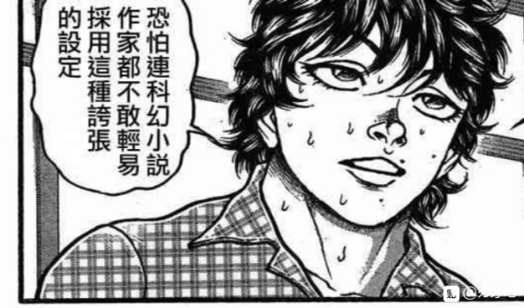

顺便将红魔馆周围的人们也骰了吧

蕾米莉亚·斯卡雷特【1d100：66】

十六夜咲夜【1d100：71】

帕秋莉·诺雷姬【1d100：26】

蕾米莉亚：芙兰最近很开心啊，找到了新玩具真好呢

咲夜：是啊大小姐，美铃最近也是，工作热情高涨很多，都不需要往她头上扔飞刀了

帕秋莉：不是，我说

你们就不觉得那人很奇怪吗？？

每天都在固定的时间踩着水过来找美铃打架，吵得我连书都没法好好看了

蕾米莉亚：不会啊

观察了一阵子发现只是个单纯的喜欢武术的老好人

对芙兰也没什么想法，这不是挺好的吗

咲夜：二小姐和美铃都很开心，大小姐也没什么想法，我觉得挺好啊

多让美铃练练也能避免她的身手退化

帕秋莉：为什么我周围都是这种肉体派……

魔理沙也是，明明是个魔法使却天天用扫帚飞来飞去，唉

~雾之湖~

琪露诺【1d100：25】

大妖精【1d100：37】

若鹭姬【1d100：60】

琪露诺：那人到底在搞什么，天天都要在湖上跑步每次都呲老娘一脸水！

对他发射弹幕也打不中，这是新的辫子妖怪吗？

大妖精：琪露诺酱讨厌的家伙我也讨厌

不过我感觉他应该是人吧

若鹭姬：能在水面上跑步，真厉害

但是为什么不直接飞过去，或者游泳呢？

~红魔馆门口~

烈海王正在被红美铃暴打

芙兰：美铃，打他的头！

红美铃：好！

芙兰：烈师傅，切她中路！

烈：没有那么容易的——不好！

烈稍微分心了一瞬，然后被红海皇打趴了

红美铃：稍微说个话都会分心，注意力不够专注！

芙兰：哈哈哈，烈跑来被打了两个多周了，除了放水的那次一次都没赢过

莫非你是喜欢被打的那种人？

烈：不，芙兰小姐

我是在跟红海皇学习武术，只是我学艺不精才会变成这样

蕾米莉亚：咲夜，为客人准备些点心吧

可不能让人觉得我们红魔馆待客无礼呢

咲夜：当然，大小姐

请您放心，我早有准备

——幻世【TheWorld】——

“打了一下午辛苦了，来吃些饼干吧？我还准备了红茶”

毫无征兆地出现在烈的面前的是，10代后半的高挑少女，红魔馆的女仆十六夜咲夜

她有着一头银灰色的短发，两侧的鬓发扎成麻花，末梢系着绿色的丝带，头上戴着女仆发箍

身上穿着以深蓝、白两色为主色调的女仆装

烈知道咲夜的能力吗？【1d100：98大成功】

大成功是什么？【1d10:9】

1 面对咲夜时战斗力增加20

2 咲夜好感度增加【1d10】

3 面对咲夜时战斗力增加20

4 面对咲夜时战斗力增加20

5 咲夜好感度增加【1d10】

6 咲夜好感度增加【1d10】

7 学会了扔小刀的技巧，战斗力提升3（为啥啊）

8 面对咲夜时战斗力增加20

9 咲夜为烈做了新的假腿（为啥啊）

10 大成功/大失败【1d2：2】

烈：那就恭敬不如从命了，谢谢你，咲夜小姐

拥有超快速移动的能力真是方便，完全察觉不到你是何时出现的

如果说原本的战斗力是100

超快速移动，小刀，厨艺，女仆技艺……把这些都加上，战斗力便不下240了

真是厉害的多面手

咲夜：烈先生真是观察力敏锐啊

咲夜对美铃打了个眼色

（你把我老底泄了的事我之后再跟你慢慢聊）

红美铃拼命挤眉弄眼

（冤枉啊咲夜小姐！我跟他说的是你会控制时间啊！）

咲夜：顺便一提，烈先生，您原本那条假腿真是太脆弱了

擦过小弹幕都容易有损伤，战斗中不注意的话一下子就会裂掉了，这怎么行呢？

我给您做了条不会断的假腿，不介意的话就请用吧

咲夜手工制假腿质量如何？【1d50：46+50=96大成功】（50是不会断的最低限度）

又……又是大成功？

大成功的效果是什么？

【1d10：7】

1 烈的战斗力提升【5+1d5】

2 这条腿会用骑士踢（为啥啦）

3 这条腿会发出弹幕（为啥啦）

4 咲夜的好感度上升【1d15】

5 烈的战斗力提升【5+1d5】

6 咲夜的好感度上升【1d15】

7 这条腿可以使用一次超快速移动！（为啥啦）

8 烈的战斗力提升【5+1d5】

9 咲夜的好感度上升【1d15】

10 大成功/大失败【1d2：2】

咲夜：这次制造假腿的时候，不知为何灵感暴涨

其结果是，带上它之后【一天一次】可以使用一次超快速移动了

表现出来就像时间暂停了一样，很有趣的哦

烈：这……这么厉害！

没想到红魔馆的女仆小姐不光是战力强大，连手工艺都这么擅长！

真是令我自愧不如啊

——烈海王的技能 假腿 升级为 假腿【The World】——

假腿 【The World】：一天一次，使用假腿中的力量进行一次超快速移动。本回合战斗自动胜利且造成的伤害必中。（对战斗力低于160的对手使用的情况下直接判定战斗结束，胜者烈海王）

成功把假腿换上，烈的霸气立刻暴增，狂增，劲增！

霸霸霸霸霸！

他此刻的气势比任何的时候也更强大五十倍！无比霸念，无比狂态，如此的可恶魔神……

天下间还有什么可以抵挡？他 马 的，天下间简直还有什么可以抵挡得了？

芙兰朵露：咲夜的手艺很厉害吧？

烈从爽爆状态回过神来

烈：（仔细想想这招对师匠那个等级的压根没啥用啊，铺天盖地的弹幕和激光压过来除了正面突破外根本没空隙躲吧）

让你见笑了，芙兰小姐，刚刚我实在是太高兴了

话说回来红海皇和咲夜小姐呢？

芙兰朵露：咲夜把茶和点心留下之后就揪着美铃的耳朵走了呢~

美铃一时半会过不来了，该陪我玩啦，烈！

烈要做什么？【1d10：4】

1 讲故事

2 关于你的姐姐

3 关于你的能力

4 关于你的过去

5 讲故事

6 关于你的能力

7 讲故事

8 关于你的能力

9 关于你的过去

10 大成功/大失败【1d2:】

烈陪芙兰朵露玩了一阵子躲避球

躲避球是指，由芙兰放出球状的弹幕，然后烈来躲避这样的游戏

由于芙兰特意控制了强度，被打多了也只是会受重伤而已

烈：说起来芙兰小姐，我一直觉得很奇怪

你是个性格很好的，善解人意的孩子，为什么不去人里找同龄人，而是来找我玩呢？

芙兰朵露：嗯~实际上我是在一段时间之前，才能够离开红魔馆的

以前的时候姐姐大人根本不让我出门呢

烈：（把这么小的孩子关在城堡里？！不管怎么想这也太过分了！）

芙兰小姐，你被关了多久？！

芙兰朵露：几百年吧

因为能力的关系，从很久以前就被关着，到了幻想乡之后也只是换个地方关而已

烈的震惊【1d100：69】（越1越无所谓，越100越震惊，没有大成功大失败）

烈：芙兰小姐你今年多少岁了？

芙兰朵露：495岁

烈：——呼……

我还是太拘泥于常识了，这里可是幻想乡

芙兰朵露：前阵子跟红白的巫女和黑白的小偷打了一架之后，她们来红魔馆也会顺便跟我打招呼了

现在可以控制好力量，脾气也没以前那么差了，姐姐大人就说我现在已经可以出门了，不过外面也没什么好玩的啊

很多人好像都挺害怕我的，管我叫恶魔的妹妹，烈你呢？

烈：回答之前我想先问一句

芙兰朵露小姐是怎么看待我的？

芙兰朵露：嗯~是很好玩的新玩具！

跟美铃她们关系也很好，陪我玩的时候也没有不耐烦，还会这样陪我聊天

我很开心啊

烈：那么芙兰小姐就是我的朋友

我是不会害怕朋友的

芙兰朵露：朋友就是玩具？

烈：不，不是这个意思……

烈海王与恶魔之妹，正在夕阳下谈论着友谊

看着那副温馨的画面，哪怕是帕秋莉都露出了微笑

——与芙兰朵露·斯卡雷特进行了一次愉快的谈话！——

芙兰朵露的好感度已经达到了96点，因此不会增加

~交流回合结束~

烈的日程：第5天与圣白莲交流，第21天与芙兰朵露·斯卡雷特交流，第22天认识了风见幽香，第32天与因幡帝交流

30天内，烈学习了【3+1d5：1=4】次天文密葬法

师匠：大概再学三次左右就能学会了

除了每周固定的学习以外才来了一次而已，有这么忙吗？

烈：师匠，我也觉得奇怪……

其实我也就每天帮忙坐诊，去神灵庙送饭，然后跑去红魔馆修习武术顺便陪芙兰朵露小姐玩玩，之后去帮白莲师傅讲经或者帮铃仙前辈卖药这样。从上周起每周还会去太阳花田锻炼耐力——

永琳：好了，烈啊，你不用再说了

你的时间安排，只能用悲剧来形容

永琳：首先，神灵庙一周去一次就可以了

一帮子早已辟谷的仙人，有什么必要天天吃饭？

其次，圣白莲的讲经或者帮铃仙卖药，只要偶尔看到时帮忙即可，没必要专门每天去做

红魔馆和太阳花田就算了，毕竟对你的修炼还是有好处的

烈：可是师匠，这样省下来的时间我要拿来做什么？

永琳：给我学习！

再学三次左右也只是初步运用，想熟练使用你还早得很！

况且，就算将天文密葬法完全掌握了，你以为你的任务就结束了吗？

秘术学完就给我学医术，医术学完就学制药

就算有朝一日技术全部都学完了，你也需要好好提升一下你的智慧！

烈：师匠，这么多东西我得学多久……

永琳：认认真真学一辈子吧

一旁的皮克回想起了自己受教育的时光，开始瑟瑟发抖

（本日的更新结束）

（以下是我的废话）

事情是从什么时候开始出了差错呢

是从安排咲夜送点心开始？

从安排红魔馆三人组日常观战开始？？

还是从骰红魔馆周边人们的好感度开始的？？？

当我看到在莫名其妙的地方大成功的时候光编选项都编得头疼

然后想着就算最糟糕不过是15好感度的时候中了假腿

假腿大成功了

一成的学技能选项又双叒被抽中了

我当场笑的从椅子上掉下来了，真的，简直就离谱啊这

仔细一想烈海王的新技能全是大成功抽一成学的

烈海王的战力膨胀今天也在继续，在这么继续下去过俩月吊打大妖怪都不是梦了

得想个办法限制一下，比如说限制技能和必杀技最多只能带一定数量的这样

真膨胀到这个地步到时候就用骰子决定吧

那么就这样，明晚更一下红海皇简介，正篇后天更

草，我刚刚是不是忘记放今天的骰子了？等我一会回家之后就发

把最重要的骰子忘了，现在补上

顺便一提，师匠的学习骰子应该是在交流剧情之前骰的，但是具体什么时候我忘了

感觉这段剧情放在交流结束后比较好就挪了一下位置

@俠極八打 吧友你在找幽香练耐力那楼的回复是对的，但是不知道为什么艳红把你的回复都吞啦我回不了wwww

今晚的番外篇

——本部老师的东方小常识——

又到了这个不定时更新的环节了

想必大家也发现了，随着故事的进展，登场的新人物越来越多，这个番外的更新速度是完全跟不上的

所以如果想要详细了解东方的人物，还是自己去查一下比较好哦？

那么，开始今晚的人物介绍

华人小姑娘 红美铃

BGM：明治十七年的上海爱丽丝

种族：妖怪  所属势力：红魔馆

初登场于东方红魔乡，是本作的三面道中兼boss

红美铃是中国风的武术家——身穿中国风的服装以及使用中国武术。

虽然她的种族为妖怪，但她的外表和谈吐与人类没有任何区别。

性格开朗率直，有些热血。偶尔会偷懒和发牢骚。

红美铃拥有运用气的能力，尤其是配合‘气’使用的武术。

这体现在格斗作美铃的符卡当中。（即本贴中红海皇认真状态下的技能与必杀技）

虽然她的种族为妖怪，但是很少使用妖术。

平时在看门的时候，她会打太极拳、睡觉或看热血漫画。（这里是红海皇自称流派为太极拳的出处）

因为她由红魔馆提供饮食[东方求闻史纪]，所以不会主动袭击人类。

不仅如此，因为职务关系，她和人类接触率很高。经常有人和她搭话。

来拜访的人有时会向她发起挑战，测试自己的身手。（这也是烈敢于直接与红美铃战斗的原因之一）

冷知识：

不光是看门：红美铃同时也是红魔馆花坛的看护人，除了看门外还要负责管理花坛

种族不明：红美铃具体是什么妖怪？除了ZUN外没人知道，但她不是人类这点是可以肯定的

铃抄千：不知为什么，红美铃的铃字经常被人打错，因此出现了“去把红美铃的名字抄一千遍”这个梗

复杂的职场环境：在有关红魔馆的大多数二次创作中，红魔馆的职场环境是属于比较好的——大家平时嘻嘻哈哈打打闹闹，共同保护红魔馆或者齐心协力炸了它这样

同时在东方非想天则中，美铃线结局也一般被向着比较正面的角度解读着

不过，在最新的官方漫画东方智灵奇传中，红魔馆的职场环境突然发生了争议性与生草度极强的转变（具体大家可以自行了解）

这很是引起了一阵子讨论——

不过大家最后发现，反正是二次创作又没必要跟原作一模一样，因此红魔馆的职场环境还跟以前一个路数就行

就是这样，本贴中的红魔馆也是传统的和谐友爱温馨的红魔馆

你说这跟一设不一样？因为这是二次创作啊，一设也没有烈海王嘛（笑）

关于异变

可能很多人会比较好奇，东方里所谓的异变是什么？

这相对来说有点难解释，因为好像也找不到什么官方的说明

所以在这里我就先用自己的话概括一下，如有错误还请大家指出

简单来说，异变就是会影响整个幻想乡平衡的异常事态

拿美漫来举例子的话就是所谓的“大事件”，但也没有那么严重

异变的形式是多种多样的，比方说笼罩天空的红雾，迟迟不来的春天，永远持续的夜晚......

这些异变往往都有着一个主谋，也即boss，幕后黑手，而找到boss并解决异变，就是自机们的任务了

异变的危害不一定大，比如说六十年一次的异变只是让整个幻想乡都开满了花（幽香很开心）

异变的危害也可以很大，比如说某次异变解决失败的结果是全地球的物理漂白

基本上，将异变理解为强者们引发的异常事态即可

负责解决异变的就是自机们，也就是所谓的城管

大家最熟悉的城管就是博丽灵梦与雾雨魔理沙（系列全勤）

另外出场较多的城管还有十六夜咲夜，东风谷早苗，魂魄妖梦等

值得一提的是，在东方天空璋中，可爱的琪露诺也当了一回城管

你问为什么琪露诺都能当城管？

这跟那次异变的性质有关系，不过也有可能是zun单纯想让她出来玩玩了，谁知道呢？

为什么我突然开始讲异变了呢？

因为我发现现在的烈海王，其实已经有能力参与一些小型的异变了（战力膨胀的后果）

当然，他可能没有办法去解决异变——那是城管们的工作

不过当成期间限定活动，成为其中的一员而充分享受着也是不错的发展

本贴中的异变该如何选择？

我原本是想着交给骰子来选的

但后来发现这压根行不通

因为后面的很多异变之间是有联系的

某些异变甚至直接就是另外一些异变的起因

在这种情况下，如果骰子出了奇怪的结果，那压根没有办法解释了

比方说，我现在骰出了完全凭依异变——但在神灵庙剧情刚过去没多久的时间点，这事压根不可能发生，因为它处在一个剧情链的最后一环，缺了前面任何一个之后的剧情都会大变

因此，本贴的异变将按照时间顺序进行，即从神灵庙刚结束不久之后开始正常的时间线

那么，之前登场过的角色们没有出场机会了该怎么办？

当然，还有吧友们的新人物安价这个最终办法

不过我想了一下，你们觉得搞笑活动怎么样？

名侦探古明地觉事件簿啊，白玉楼今天的饭啊，东风谷大小姐想要成为偶像啊之类的......

由于是搞笑剧情所以不会严肃，同时也会加一些二创成分在里面，请大家不带脑子地看吧

之后的剧情大概安排是 异变——日常——搞笑活动——交流回的循环

当然，也有可能会变，谁知道呢，不过大概思路是这样

那么今天就到这里

明天的正篇将会更新烈海王遇到的第一个异变

那是一个很适合他的，难度不高的，同时也很有意思的

有关于感情的异变

完了完了，不会吧，不会这条大家也看不到吧

（请问大家能看到吗？）

本贴中的异变该如何选择？

我原本是想着交给骰子来选的

但后来发现这压根行不通

因为后面的很多异变之间是有联系的

某些异变甚至直接就是另外一些异变的起因

在这种情况下，如果骰子出了奇怪的结果，那压根没有办法解释了

比方说，我现在骰出了完全凭依异变——但在神灵庙剧情刚过去没多久的时间点，这事压根不可能发生，因为它处在一个剧情链的最后一环，缺了前面任何一个之后的剧情都会大变

——异变发生了！——

距离博丽的巫女解决异变还有15天

自烈海王来到幻想乡，已经过去了33天

他与一些妖怪建立了不错的关系，但也有一些妖怪不喜欢他

烈的每一天都过得十分充实，这样的日子如果能够一直持续下去，想必是十分幸福的

然而，世间没有一成不变的事物

在相对平静的外界已经如此，更何况烈海王现在所处的地方，是众神眷恋的幻想乡

于是，就在烈的日常生活逐渐步入正轨的时候

感情的异变开始了

