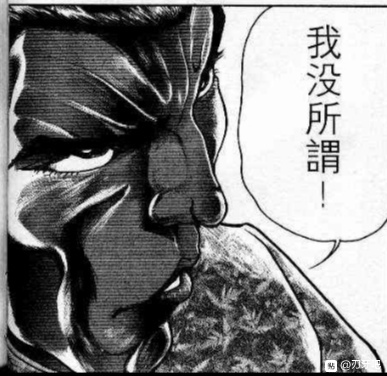
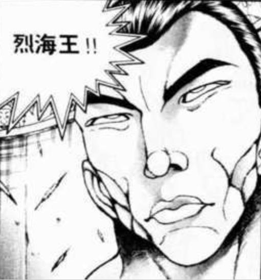
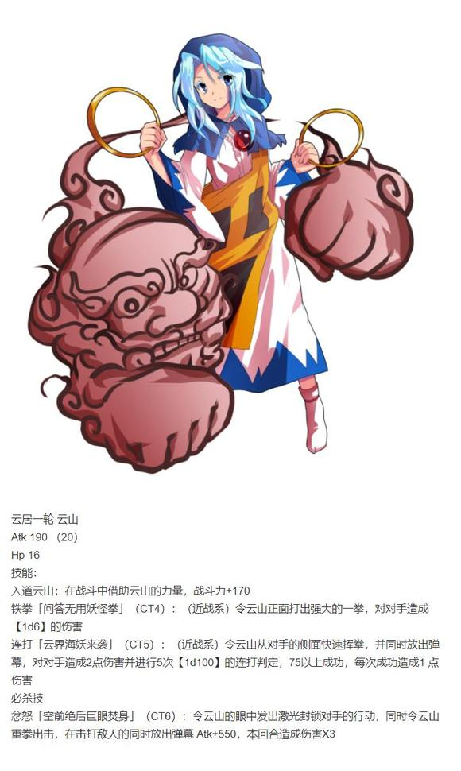
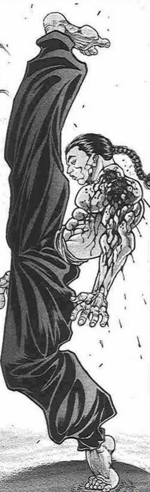

“太好了！

赢了！

一下子就成了目光焦点了呢！”

将命莲寺的高僧所打倒的，正是幻想乡的守护者，符卡规则的发明者，异变的解决者，妖怪的退治者，本代的博丽巫女——通称，乐园的美妙巫女博丽灵梦

她外表看上去是十几岁的美丽少女，脑后带着巨大红色蝴蝶结，身上穿着由红白二色构成的巫女服，以及与上衣在肩膀处分离的白色宽大袖子，在袖子的顶部以束带固定于上臂。

烈：这就是传说中的博丽巫女吗，果然是相当的强者

不过，这场战斗打的真是奇怪

我不了解博丽巫女的战斗方式如何，但是白莲师傅别说是超人术，甚至连平常的小法术都没有用过，全程只是在用普通的拳脚功夫

如果真的想赢是绝不会这么打的，这是——

烈的判断【1d10：1】

1 宗教战争的背后有问题

2 问问白莲师傅吧

3 再做进一步调查

4 白莲师傅今天状态不好

5 我也去打一场试试

6 再做进一步调查

7 问问白莲师傅吧

8 我也去打一场试试

9 我也去打一场试试

10 大成功/大失败【1d2：2】

烈：白莲师傅早已超凡脱俗，对她来讲状态不好发挥不佳是无稽之谈

而她又是一位智慧深厚之人，尚若是有好处的战斗没有就这么轻易放弃的道理

按照这个思路，结果应该是——这个所谓的宗教战争其本身是有问题的！

即使是强者们的对战，也不应当在一夜之间就聚起如此高的人气

可是问题出在哪里呢？

烈的推理【1d10：6】

1 有强者主导了这次事件

2 是参加者们的自导自演

3 问题出在观众身上

4 问题出在战斗地点上

5 这里就靠师匠教我的推理法

6 有强者主导了这次事件

7 问题出在战斗地点上

8 现有信息不足，应该等待事件的发生

9 寻求他人的帮助

10 大成功/大失败【1d2：1】

烈：按照从师匠那里听来的幻想乡一贯的路数，这次应该也是有一位强者在暗中主导了事件的发生

黑幕可能就在参加者之中，也可能隐藏在人群中注视着天上的战斗

至于动机，凭借现有的信息实在是没有思路了，靠直觉思考一下吧

烈的直觉【1d100：6】（90以上有效）

烈：什么都想不到，真不该尝试自己不擅长的事情

距离去找红海皇练武还有一段时间，接下来烈要做什么？【1d10：4】

1 继续观战

2 在人里收集情报

3 我也去打一把

4 继续观战

5 大人物们说不定会知道些什么

6 我也去打一把

7 继续观战

8 我也去打一把

9 顺便去买点食材吧

10 大成功/大失败【1d2：2】

烈：不管事件背后的真相如何，能看到强者们的战斗总是一件好事

再去看一场吧！

烈的目标是？【1d10：3】（地灵殿去不了）

1 人间之里

2 神灵庙

3 命莲寺

4 博丽神社

5 人间之里

6 神灵庙

7 人间之里

8 命莲寺

9 魔法森林

10 大成功/大失败【1d2：1】

烈：之前白莲师傅的表现有点异常……

就去命莲寺吧，看看在命莲寺战斗的会是谁

顺便看看白莲师傅在不在

~烈海王前往命莲寺~

在命莲寺战斗的人是？

第一位【1d10：3】

1 神子

2 圣白莲

3 博丽灵梦

4 雾雨魔理沙

5 物部布都

6 云居一轮

7 河城荷取

8 古明地恋

9 二岩猯藏（假身）

10 其他人

第二位【1d10：9】

1 神子

2 圣白莲

3 其他人

4 雾雨魔理沙

5 物部布都

6 云居一轮

7 河城荷取

8 古明地恋

9 二岩猯藏（假身）

10 其他人

大狸子的假身是谁？【1d10：4】

1 神子

2 圣白莲

3 博丽灵梦

4 雾雨魔理沙

5 物部布都

6 云居一轮

7 河城荷取

8 古明地恋

9 二岩猯藏（堂堂正正用真身）

10 其他人

命莲寺

与人类的聚集地人里不同，命莲寺内部的观战者大部分都是妖怪

长着奇妙狗耳的少女，带着云状妖怪的僧侣，打着大伞的妖怪……

妖怪与人类们共同观看着眼前的战斗，而烈海王也站在人群之中

博丽灵梦 VS 雾雨魔理沙（二岩猯藏）

开战！

灵梦的出力【1d100：62】

假魔理沙的出力【1d100：63】

胜者 雾雨魔理沙（二岩猯藏）！

本日的头条：魔理沙氏，击溃巫女！

“哦耶赢了！

你给我看好了哦？

我来让你见识见识

什么是真正的布教”

战胜博丽灵梦的人，正是雾雨魔理沙（伪）

她看上去是个十几岁的少女，有着一头漂亮的金发

头戴有白色蝴蝶结的大魔女帽，身穿黑白相间的帅气衣服，手上不知为何还拿着一把扫帚

灵梦的直觉【1d50:37+50=87】（巫女的超直觉+50）（80以上察觉假货）

灵梦：说话口气学的蛮像啊，连外表都一模一样

如果不是遇到我，估计其他人都会被骗过去的

博丽灵梦的怒气【1d100：19】

灵梦：真是无聊的恶作剧，你一个狸妖怪装作魔法使的样子做什么？

“嘭！”

随着一声奇妙的音效响起，假魔理沙的周围冒出了奇妙的白烟

从烟雾中出现的是，有着巨大尾巴的狸猫妖怪

她外表看上去是位成熟的女性，头上装饰着一片叶子，身穿印有各色鸟兽纹样的服饰，不知为何还戴了眼镜

二岩猯藏：果然在你面前会露馅啊

烈的震惊【1d100：4】

烈：哦

大狸子的目的是？【1d10：10】

1 借机提醒灵梦

2 现在只是单纯玩玩

3 魔理沙的委托（为啥啊）

4 借机提醒灵梦

5 魔理沙的委托（为啥啊）

6 借机提醒灵梦

7 现在只是单纯玩玩

8 现在只是单纯玩玩

9 测试自己的变身能力

10 大成功/大失败【1d2：2】

大狸子大失败了？！

大失败是什么【1d10：6】

1 提醒的方向完全错误了

2 博丽灵梦被惹火了

3 魔理沙的秘密大放送

4 提醒的方向完全错误了

5 魔理沙的秘密大放送

6 提醒的方向完全错误了

7 博丽灵梦被惹火了

8 博丽灵梦被惹火了

9 变身能力出了大问题，异变结束前都没法变身了

10 大成功/大失败【1d2：1】

烈对大狸子的相信【1d100：90】

烈对神子的相信【1d40：10+60=70】（熟人+60）

烈对白莲的相信【1d40：18+60=78】（熟人+60）

烈：什么，真正的黑幕居然是那两位吗！

白莲师傅今早那没精打采的战斗某非也是计划的一部分？！

烈：以我对她们的了解，伤害普通居民的事情她们是绝对不会做的

可是对于自身势力的扩张可是她们一直以来都十分热衷的事情啊……

符卡格斗只是吸引人气的手段，对于观众来说毫无危害，但对于她们来讲则是难得的机会

这么一想，她们本身策划这件事的可能性——很高！

烈：该去找红海皇了，再稍微思考一下就出发吧

烈之后的方针是？【1d10：7】

1 找个机会打一场

2 下午问问红海皇她们吧

3 找个机会打一场

4 之后做一下情报收集

5 晚上问问师匠吧

6 找个机会打一场

7 之后做一下情报收集

8 重新考虑刚刚的推理

9 【1d8：8】

10 大成功/大失败【1d2：2】

烈：目前我知道的信息还是不足，之后几天得找机会做一下情报收集

光凭狸妖怪的几句话就确定黑幕太不稳妥了

但是也得留个心眼，这段时间还是别去问白莲师傅和神子殿下了

~烈海王前去红魔馆了~

自由活动结束

目前已知的情报：

本次事件的背后存在黑幕

本次事件是神子，白莲，灵梦等人们收集人气的手段

神子与白莲疑似黑幕

狸猫妖怪二岩猯藏拥有很强的变身能力

博丽巫女的参战动机只是提高神社的人气，似乎与黑幕无关

感情异变的第一天结束

目前无人察觉真相

（今天早上的更新结束，下午或者晚上会再更一点）

烈的情报收集持续了【1d10：2】天

了解到多少信息了？【1d80：74+20=94】（1-3天+20，4-6天+30,6-9天+40,10天+50）

。

。

。

感情异变的第四天开始

烈海王结束了早上的晨练，做完了早饭之后，开始整理思路

BGM：名探侦烈海王

烈：虽然只有两天但却收集到了不少信息，大家对我都蛮友善的

单就这两天的观战来看，无论是宗教家还是其他妖怪们，对这次的事件都相当享受着

观众看的开心，她们打的也很开心，甚至输赢都没什么所谓了

跟地下斗技场的风格完全不一样

从参战者的表现来看，黑幕在参战者之中简直是无稽之谈

白莲师傅与神子殿下的黑幕可能性，不能说没有但也十分少了

烈：与其相对的是观众们的态度

很怪，不如说太奇怪了

仅仅是友谊性的切磋，又不是真正的生死搏杀，有必要兴奋到这个程度吗？

更怪的是，普通人居然表现得比妖怪们还要兴奋

按理来说作为没有力量的观众，起码也会担心一下自己的安全吧

表现最明显的地方就是人间之里

烈： 我现在可以基本确定，这次事件的关键问题出在观众身上！更具体点就是人里出了问题！

烈的行动是【1d10：1】

1 烈啊，真的不考虑去打一场吗（悲）

2 找神子商量行动计划

3 找白莲商量行动计划

4 靠我烈海王的实力！

5 去人里做更进一步的调查

6 靠我烈海王的实力！

7 找神子商量行动计划

8 靠我烈海王的实力！

9 找白莲商量行动计划

10 大成功/大失败【1d2：2】

烈：只靠我一个人的推理还是不够严谨

现在就去人里打上一场，在参战者的角度看看观众们的反应吧

当然，更重要的是

看了这么多天，也实在是手痒了

“圣大人又跑到哪里去了……已经找了好几个地方了”

出现在烈海王面前的正是沉着冷静的入道使，云居一轮

她头戴黑色僧帽，身穿白裙，有着蓝色的头发，身旁跟随着云状的健壮妖怪：入道云山

BGM：Sky Ruin

烈：请问您是否就是命莲寺的入道使，云居一轮师傅？

一轮：正是

这位先生是想修习佛法吗？我们命莲寺随时欢迎新信众的加入

烈：不，您误会了，我是前来挑战的

我是来自永远亭的烈海王

是叫做宗教战争，对吧？

连续看了三日比赛，我实在是难以抑制自己的心情了

如何，是否愿意与我交手呢？

两人的周围在短暂的时间内就聚集了大量看热闹的闲人们

这份速度就连烈海王也察觉到了异常

烈：（果然——之前当观众的时候还没什么感觉，现在站在台上一看，人们简直是一听到有打架看马上就过来了）

一轮：（糟糕，现在要是拒绝了，命莲寺的人气会一落千丈的）

战斗之前我必须提醒您，云山的拳头是很重的

烈：我无所谓

永远亭 烈海王 请指教！

一轮：命莲寺 云居一轮，让你尝尝入道使的力量吧

T1

烈的攻击【167+1d100：38=205】

一轮的攻击【190+1d100：40=230】

烈：入道之拳，力量确实强大

烈的受伤【1d10：3】

1 回避

2 小伤害/2（实质无伤）

3 小伤害/2（实质无伤）

4 中伤害/2

5 中伤害/2

6 中伤害/2

7 大伤害/2

8 大伤害/2

9 特大伤害/2

10 大成功/大失败【1d2：1】

烈：不过仍然可以被消力所消去！

T2

烈的攻击【167+1d100：86=253】

一轮的攻击【190+1d100：100=290】

一轮：你的功夫很厉害，但是云山的力量更强！

烈的伤害【1d10：8】

1 回避

2 小伤害/2（实质无伤）

3 中伤害/2

4 中伤害/2

5 大伤害/2

6 大伤害/2

7 大伤害/2

8 特大伤害/2

9 特大伤害/2

10 大成功/大失败【1d2：2】

Hp 17-4/2=15

T3

烈的攻击【167+1d100：20=197】

一轮的攻击【190+1d100：6=196】

烈：找到你的破绽了！

一轮的受伤【1d10：1】

1 回避

2 小伤害

3 小伤害

4 中伤害

5 中伤害

6 大伤害

7 大伤害

8 特大伤害

9 特大伤害

10 大成功/大失败【1d2：2】

一轮：残念，我可不是只靠云山战斗的

烈：还没完，这里就用幽香女士教我的护身术！

Flower Shooting发动

一轮的受伤【1+1d4：4=5】

一轮：糟糕，刚刚被他近身这招躲不开了

Hp 16-5=11

T4

一轮：上回合的攻击，现在就还给你！

一轮的攻击【190+1d100：51=241】

烈的攻击【167+1d100：11=178】

烈：这份意志我确实收到了

烈的受伤【1d10：4】

1 回避

2 小伤害/2（实质无伤）

3 小伤害/2（实质无伤）

4 中伤害/2

5 中伤害/2

6 中伤害/2

7 大伤害/2

8 大伤害/2

9 特大伤害/2

10 大成功/大失败【1d2：1】

Hp:15-2/2=14

一轮：还没有结束，尝尝云山的全力一击吧！符卡宣言 铁拳「问答无用妖怪拳」！

烈的破解【1d100：98】判定成功

烈：被打中了想必是相当痛的，可惜，破绽太大了

T5

烈：将身体交给武术！

武之怀发动

烈的攻击【167+60+1d100：79=306】

差值大于100自动成功

一轮的受伤【1d10：4】

1 回避

2 小伤害

3 中伤害

4 中伤害

5 大伤害

6 大伤害

7 大伤害

8 特大伤害

9 特大伤害

10 大成功/大失败【1d2：1】

Hp：11-2=9

一轮：光是挨打可不是我的风格！符卡宣言 连打「云界海妖来袭」！

连打判定 五次【1d100】分别为：1、56、6、37、53 全部失败

一轮：开玩笑吧？

烈：还是那句话，拳力强大但是破绽太大了！你的对手可不会站在原地挨打！

烈的破解【1d100：13】失败

烈的受伤：2+0

Hp：14-2=12

T6

一轮：烈海王，你确实是个厉害的对手

就让你看看我与云山的全力吧！符卡宣言 忿怒「空前绝后巨眼焚身」！

一轮的攻击【190+550+1d100：26=766】

烈：在这里用这招，真是不太合适

但是对手已经全力以赴，我也应当如此！

超人烈海王发动

烈的攻击【167+60+600+1d100：67=894】

一轮：什么，竟然是圣大人的秘术？！

原来如此，你就是圣大人最近所说的那位武术家吗！

一轮的受伤【1d10:1】

1 回避

2 小伤害X3

3 中伤害X3

4 中伤害X3

5 大伤害X3

6 大伤害X3

7 大伤害X3

8 特大伤害X3

9 特大伤害X3

10 大成功/大失败【1d2：2】

一轮：然而，我是见过这一招的！你的话我原封不动送给你！

烈：我离白莲师傅终究是差的太远了……

那么，继续使用FlowerShooting

一轮的受伤【1+1d4：3=4】

Hp：9-4=5

一轮：我一直想说，你这样的武术家放花弹怎么想都很奇怪吧？

烈：彼此彼此，你这样的少女却指挥着巨大的铁拳，倒也是与形象不符啊

T7

烈的攻击【167+60+1d100：33=260】

一轮的攻击【190+1d100：93=283】

烈的破解【1d100：24】判定失败

烈的受伤【1d10：6】

1 回避

2 回避

3 小伤害/2（实质无伤）

4 中伤害/2

5 中伤害/2

6 大伤害/2

7 大伤害/2

8 特大伤害/2

9 特大伤害/2

10 大成功/大失败【1d2：2】

Hp：12-3/2=11

T8

武之怀效果结束

一轮：再来一次，这一次我不会打歪了！符卡宣言 铁拳「问答无用妖怪拳」！

一轮的攻击【190+1d100：13=203】

烈的攻击【167+1d100：66=233】

烈的破解【1d100：79】判定成功

烈：很可惜，力道增强了但拳路还是没变

一轮的受伤【1d10:10】

1 回避

2 小伤害

3 小伤害

4 中伤害

5 中伤害

6 大伤害

7 大伤害

8 特大伤害

9 特大伤害

10 大成功/大失败【1d2：2】

大失败！

一轮的受伤【1d10：2】

1 小伤害X2

2 小伤害X2

3 中伤害X2

4 中伤害X2

5 大伤害X2

6 大伤害X2

7 特大伤害X2

8 特大伤害X2

9 战斗不能

10 大成功/大失败【1d2：1】

Hp：5-1X2=3

