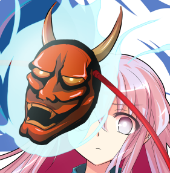
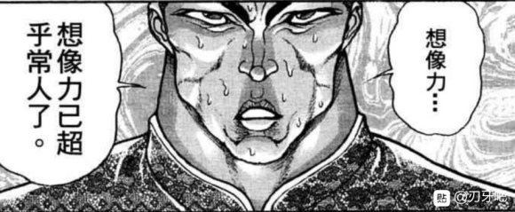

T9

超人烈海王回避效果结束

烈：幽香女士教我的防身术真是好用

再来一次，FlowerShooting

一轮的受伤【1+1d4：1=2】

Hp：3-2=1

一轮的攻击【190+1d100：71=261】

烈的攻击【167+1d100：59=226】

烈的受伤【1d10：3】

1 回避

2 小伤害/2（实质无伤）

3 小伤害/2（实质无伤）

4 中伤害/2

5 中伤害/2

6 大伤害/2

7 大伤害/2

8 特大伤害/2

9 特大伤害/2

10 大成功/大失败【1d2：2】

烈：消力！

一轮：天哪……这人难道打不中的吗？

一轮的战意【1d100：82】（10以下投降）

一轮：但是，我绝不能丢了圣大人的脸！即使是输，也要堂堂正正的拼到最后一刻！

烈：说的好！

T10

一轮：符卡宣言 连打「云界海妖来袭」！

烈：投入武术的怀抱！

武之怀发动

烈的破解【1d100：62】判定成功

烈的攻击【167+60+1d100：15=242】

一轮的攻击【190+1d100：14=204】

一轮的受伤【1d10：10】

1 回避

2 小伤害

3 小伤害

4 中伤害

5 中伤害

6 大伤害

7 大伤害

8 特大伤害

9 特大伤害

10 大成功/大失败【1d2：1】

一轮：我也，抓住你的破绽了！

一轮的反击！

烈的破解【1d100：92】判定成功

烈：你太过心急了，入道使啊。如此匆忙的拳头，是打不中人的

T11

一轮的攻击【190+1d100:11=201】

烈的破解【1d100：71】判定成功

一轮的受伤【1d10：3】

1 回避

2 小伤害

3 小伤害

4 中伤害

5 中伤害

6 大伤害

7 大伤害

8 特大伤害

9 特大伤害

10 大成功/大失败【1d2：2】

Hp：1-1=0

战斗结束 胜者 烈海王！

~人间之里的居民们为这场战斗献上了热烈的欢呼~

本日的头版头条：妖怪僧侣令命莲寺颜面尽失

烈：（这可不妙）

哪怕是之前勇次郎大战武神的时候，欢呼声也没大到这个地步

烈：是情绪……观众们的情绪隐隐约约失控了！

这次事件的本质，是人类的感情失控！

烈：一轮师傅，你还好吗？我刚刚下手可能有些重了，真是抱歉

云居一轮的好感度【1d70：14+30=44】（战斗胜利+30）

一轮：我不好

如果你的所有招式几乎都没起什么作用，你的心情也不会好到哪里去

烈的情商【1d100：36】

烈：一轮师傅，我想你应该想想办法改进一下你的战斗方式

你的招式太过于大开大合了，如果全部打中威力自然极强，但是面对善于招架或躲避的敌人则难以起效……

（云山在一轮的身后默默捂住了脸）

一轮：烈先生，谢谢你的指教了

我还有些事情，就先走一步

云居一轮臭着脸走了

云山对烈做了一个抱歉的手势后，跟着一轮走了

烈：？？？

她的情绪看上去也不是很稳定，是受到了这次事件的影响吗？

看来有必要尽快解决事件了

战胜了强大的对手后，烈海王充满了决心

接下来烈要做什么？【1d10：3】

1 等待

2 求援

3 继续找人里的居民了解具体情况

4 永琳师匠秘传推理术！

5 等待

6 求援

7 等待

8 继续找人里的居民了解具体情况

9 等待

10 大成功/大失败【1d2：2】

烈：夜半三更之时，村落中出现了异常的状况

面无表情的人们在街上游荡——就是这个！

我想我已经抓住这次事件的真相了！

烈：接下来还是按照惯例去找红海皇

晚上回亭子里做个饭，之后就去解决这次事件吧

（我歇一阵，晚上或者明天继续）

（不是更新只是杂谈）

烈海王最近膨胀的很厉害啊

现在想想幽香那个骰子抽中大必杀都好过抽中小技能了吧？

女子防身术，真的很可怕

不过大家放心

并不是只有烈海王有消力这种削弱伤害的技能

也不是人人都和一轮一样除了近战就是近战（悲）

举个例子来说，我们的灵梦小姐有一堆技能，她面对烈的时候最多就带一个近战——然后让他吃梦想封印吃到吐就好

再比如说，你们觉得花弹对于白莲会有效果吗（悲）

说白了，现在的烈海王是标准的虐菜大师，真遇到高手那就被秒了（直接过秒杀骰子）

另外，我寻思红海皇得加强一波了，大家有什么好点子请告诉我

~我的失误~

在本章的战斗结束后我才发现，我将烈海王现在的未加成的攻击力从95记成93了（忘记加迟钝大成功的两点了）

不过这并不影响本章接下来的战斗胜负，因此接下来的剧情继续按照93点攻击算，之后会给烈加回去的

实在是很抱歉，烈一定会狠狠踹我的

为了防止之后类似的情况出现，之后每段剧情结束后都会在楼里更新烈的人物卡

那么开始更新

~夜晚降临~

烈海王前往人间之里

有人陪烈一起去吗？【1d100：16】（75以上有）

辉夜：啧啧，我看烈海王的中二病已经到晚期了

永琳：是不是最近让他学得太多了……

皮克：“你哪还算是人”（我也这么觉得）

两只兔子在一旁用柔和的眼神看着烈海王

铃仙：烈先生，不要给自己这么大的压力啊

因幡帝：烈海王，我觉得你还是不要逼自己去做推理这种不适合你的事情了

烈：？？？

只是一件小事而已，今晚就会解决的，大家放心吧

现在的时间是异变开始的第四天，此时有除了烈以外的人察觉真相吗？【1d100：39】（30以下有）

那么，此时的烈海王是唯一察觉真相的人（悲）

~夜晚的人间之里~

烈海王见到的景象，绝不是人里日常应该有的样子

街道上满是面无表情的人们在漫无目的地游荡着，和白天那充满活力的样子可谓截然相反

烈：天哪，这实在是太糟糕了

和白天那副热闹的景象不同，夜晚的人里简直毫无生机！

？？？：是你……夺走了面具吗？

烈：终于出现了吗，你就是本次事件的黑幕吧？

？？？：你的身上充满了希望……对生活的，对未来的，对自己这个存在本身的希望……

不会错了，夺走我的【希望之面】之人，一定就是你！

烈：希望之面？

伴随着无感情的声音，奇妙的妖怪出现在了烈海王的面前

她外表看上去是有着粉色长发的少女，身穿绿色的上衣与橙色的蓬蓬裙

妖怪的身旁，漂浮着燃起蓝色火焰的，拥有各色表情的面具

然而与面具相反的是，少女本身的脸上却没有一丝感情

秦心：我的名字是秦心，乃是掌管一切情感之人

我调和所有的情感，以求让它们能够被平等的对待

我无法认同有失偏颇的感情！

烈：既然如此，为什么要让人里变成这样？

秦心：由于【希望之面】的丢失，我掌控情感的力量失控了

我不能让这种情况继续下去——给我把【希望之面】交出来！

烈的战意【1d100：32】（30以下尝试和解）

烈：掌握情感之人啊

我并未见过你的失物，只是单纯为了解决这次的事件而来

我不清楚所谓面具的原理，但如果能够打倒你——想必因你而起的事件，也会由此结束吧！

永远亭，烈海王，请指教！

秦心：将我的【希望之面】交出来，才是你真正应该做的事情！

虽然我跟你无冤无仇

但幻想乡的希望

都归我了！

为了全人类的感情！

战斗！

BGM：亡失的情感

烈海王

Atk 167（93）

Hp 17

技能

烈 海 王：海王是中华武术的巅峰，烈海王又是其中佼佼者，凭借高超的技术使战斗力X1.8

消力：传自郭海皇的绝学，普通攻击以及近战系技能所造成的的最终伤害/2

四千年的传承：不会陷入异常状态，面对近战系、技术系的技能可以进行【1d100】的破解判定，75以上成功

Flower Shooting（CT3）：（弹幕类）同时发出五个方向的大范围花弹，对对手造成必中的【1+1d4】点伤害。

假腿【The World】:一天一次，使用假腿中的力量进行一次超快速移动。本回合战斗自动胜利且造成的伤害必中。（对战斗力低于160的对手使用的情况下直接判定战斗结束，胜者烈海王）

必杀技

武之怀（CT5）：3T内Atk+60。3T内可对所有攻击进行【1d100】的破解判定，普通攻击与近战系、技巧系技能30以上成功，其余技能50以上成功，必杀技75以上成功。

超人烈海王（CT6）：Atk+600，给予伤害X3，之后2T回避概率翻倍

秦心

Atk 200（205）

Hp 15（16）

技能

不完整的面具：66面具其一丢失，Atk-5，Hp-1

吼怒的妖狐面（CT3）：（近战系）带上狐狸面具向对手突进，本回合战斗力+30

欢喜的狮子面（CT4）：（弹幕系）带上狮子面具向对手吐出火焰，造成【2+1d3】点伤害

忧叹的长壁面（CT5）：（技巧系）将有攻击能力的面具撒向四周，怀有敌意者接近时面具会作出反应对其发动攻击，3T内收到伤害时对对手造成【1d3】点伤害

必杀技

凭依【喜怒哀乐附体】（CT5）：以心为中心炸裂感情的波动，对应着释放的感情，会对敌人的感情产生影响，令敌人情绪不稳定，进入异常状态【混乱】，2T内对手需进行【1d100】的混乱判定，低于65时判定失败，本回合战斗自动失败

【假面丧心舞 暗黑能乐】（CT6）：以铺天盖地的面具遮挡对手的视线，其后于一瞬之间进行多次攻击，完成美丽的舞蹈，Atk+600，对对手造成的伤害X3且本回合伤害必中

T1

烈的攻击【167+1d100：36=203】

秦心的攻击【200+1d100:76=276】

烈的受伤【1d10：9】

1 回避

2 小伤害/2（实质无伤）

3 小伤害/2（实质无伤）

4 中伤害/2

5 中伤害/2

6 中伤害/2

7 大伤害/2

8 大伤害/2

9 特大伤害/2

10 大成功/大失败【1d2：1】

烈：是薙刀与扇子！没想到会用这种方式战斗，难以消去啊

Hp：17-4/2=15

T2

烈的攻击【167+1d100：98=265】

秦心的攻击【200+1d100：23=223】

秦心的受伤【1d10：1】

1 回避

2 小伤害

3 小伤害

4 中伤害

5 中伤害

6 中伤害

7 大伤害

8 大伤害

9 特大伤害

10 大成功/大失败【1d2：2】

秦心：这里就直接躲过去

T3

秦心：把希望，还给我

吼怒的妖狐面发动 Atk+30

烈的破解【1d100：63】失败

秦心的攻击【200+30+1d100：13=243】

烈的攻击【167+1d100：32=199】

烈的受伤【1d10：7】

1 回避

2 小伤害/2（实质无伤）

3 小伤害/2（实质无伤）

4 中伤害/2

5 中伤害/2

6 大伤害/2

7 大伤害/2

8 特大伤害/2

9 特大伤害/2

10 大成功/大失败【1d2：2】

Hp：15-3/2=14

烈：你尝尝幽香女士护身术的厉害吧！

Flower Shooting发动

秦心的受伤【1+1d4：2=3】

Hp：15-3=12

T4

秦心：欢喜的狮子面 发动

你用鲜花的话，我就使用火焰

烈的受伤【2+1d3：1=3】

Hp：15-3=12

烈：糟糕，这可没法用消力消掉

烈的攻击【167+1d100：96=263】

秦心的攻击【200+1d100：79=279】

烈的受伤【1d10：2】

1 回避

2 小伤害/2（实质无伤）

3 小伤害/2（实质无伤）

4 中伤害/2

5 中伤害/2

6 大伤害/2

7 大伤害/2

8 特大伤害/2

9 特大伤害/2

10 大成功/大失败【1d2：2】

烈：但普通的薙刀攻击还是可以消去的！

T5

秦心：我不会在让你这么轻易拉近距离了

忧叹的长壁面 发动

秦心：然后，你也体会一下人里居民们的感受吧

符卡宣言 凭依【喜怒哀乐附体】！

烈：的确是强力的情感

但这没有办法对我造成影响

因为克服感情的干扰一事——我们在四千年前就已经做到了！

（由于四千年的传承效果，烈海王不会陷入异常状态）

现在该我反击了，让你见识一下四千年的武术！

武之怀发动

烈的攻击【167+60+1d100：19=246】

秦心的攻击【200+1d100：61=261】

烈的破解【1d100：49】成功

秦心：想要攻击我，你也要收到伤害

忧叹的长壁面发动

烈的破解【1d100：37】成功

烈：这就是四千年！

秦心的受伤【1d10：1】

1 回避

2 小伤害

3 小伤害

4 中伤害

5 中伤害

6 大伤害

7 大伤害

8 特大伤害

9 特大伤害

10 大成功/大失败【1d2：2】

秦心：好险，躲过去了

T6

秦心：就在这里，一鼓作气干掉你！

吼怒的妖狐面 发动

符卡宣言【假面丧心舞暗黑能乐】！

铺天盖地的面具一瞬之间出现了

秦心：接招吧，烈海王，半径20米的面具结界！

在这20米的范围内，你的所有行动都会被面具所阻挠

但你也不需要担心这个问题了，因为我会在一瞬之间，以无数的攻击将你击败！

秦心手握着扇子，向被面具包围的烈海王冲去

烈：真是美丽的身姿

与其说是武，不如说是舞

如果是在平日的战斗，我定将正面与你一决高下

然而，这毕竟关乎着居民们的安全

我不能将我个人的欲望，凌驾于人们的安危之上！

烈：这是咲夜小姐的力量！

【The World】——时间停止吧！

烈的耳边响起了钟表停止的声音

眼前的秦心，天上的云彩，空气中的飞虫，围观的路人们——

在这一瞬间，就像是这个世界被按下了暂停键一样，所有的一切仿佛都停滞下来了，只有他一个人能在这短暂的数秒中行动

超人烈海王发动

烈：抱歉了，秦心小姐

秦心的受伤【1d10:10】

1 小伤害X3

2 小伤害X3

3 中伤害X3

4 中伤害X3

5 大伤害X3

6 大伤害X3

7 大伤害X3

8 特大伤害X3

9 特大伤害X3

10 大成功/大失败【1d2：1】

烈：还是稍微打轻一些吧……毕竟只是少女一样的身躯……

大成功是什么？

【1d10：9】

1 由于烈心有不忍，秦心回避

2 小伤害X2

3 小伤害X2

4 中伤害X2

5 中伤害X2

6 大伤害X2

7 大伤害X2

8 大伤害X2

9 特大伤害X2

10 大成功/大失败【1d2：1】

Hp：12-4X2=4

烈：然后时间开始流动

秦心：发生了什么？

我提不起力气了……

我输了？为什么?

粉发的少女缓缓倒下——之后，被一旁的武者扶住了

战斗结束

胜者 烈海王

异变的发起者：表情丰富的扑克脸 秦心 被击败了！

烈：抱歉了，秦心小姐

为了解决异变，而不得以出此下策

如果您不满的话，请在异变结束后前来找我吧，无论是再打一遍还是单方面被打，我都不会有一丝怨言

下一次，我不会用假腿了

秦心的好感度【1d70：8+30=38】

秦心：胜利了就是胜利了，我不会多说什么的

刚刚的那个是，你的能力？真是过分的能力啊

烈：那其实是我的假腿的能力

秦心：？？？

秦心的疑惑【1d100：83】

秦心：你在说什么？假腿可以有这种奇怪的能力吗？

烈：是啊，我也很奇怪啊

也许这就是幻想乡吧

烈：秦心小姐，请你相信我

我真的没有见过你的【希望之面】

秦心：那样的话，人里的情况该怎么办？

缺少了面具之后，我无法正常操纵情绪

烈的办法是【1d10：2】

1 永琳师匠！

2 去问问神子吧

3 去问问白莲吧

4 锻炼！靠锻炼克服它！

5 永琳师匠！

6 去问问神子吧

7 去问问白莲吧

8 我帮你找

9 锻炼！靠锻炼克服它！

10 大成功/大失败【1d2：2】

烈：我只是一个武术家，没有办法解决你的问题

但我知道一位智慧过人的圣人，如果是她的话，想要解决这次事件想必是轻而易举的

烈海王与秦心前往神灵庙

~神灵庙~

神子在庙里吗？【1d100：75】（25以上在）

烈：夜深时来访，真真抱歉

永远亭 烈海王，求见神子殿下

出来迎接烈海王的是？【1d10：9】

1 神子

2 物部布都

3 苏我屠自古

4 宫古芳香

5 霍青娥

6 神子

7 物部布都

8 神子

9 圣白莲（为啥啊）

10 大成功/大失败【1d2：2】

圣白莲：这不是烈先生吗？怎么这么晚了还到神灵庙来？

烈：白莲师傅？您怎么在这？

圣白莲为什么会在神灵庙？【1d10:9】

1 刚刚打完一场战斗

2 日常聊天

3 日常（。。。）

4 刚刚打完一场战斗

5 日常聊天

6 刚刚打完一场战斗

7 察觉到了一些不对劲

8 察觉到了一些不对劲

9 察觉到了一些不对劲

10 大成功/大失败【1d2：1】

圣白莲：烈先生知道最近的宗教战争吧？就是你今早参加过的活动

我一开始只是以为最近大家对于观战很有兴趣，因此也试着参加了

但这两天感觉有一些不对劲，却又一时间没什么头绪，因此过来找神子商量一下

神子：正是如此，虽然我们所信不同，但该合作的时候还是要合作的

说起来烈，你这么晚了跑过来干什么？也是来打架的？

我不在意哦，正巧和白莲谈了【1d3：1】个小时有点疲劳，放松一下也不错

