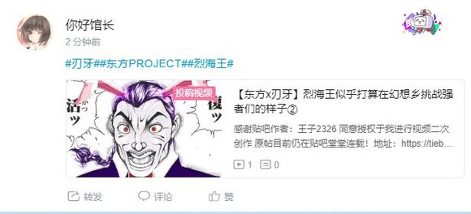
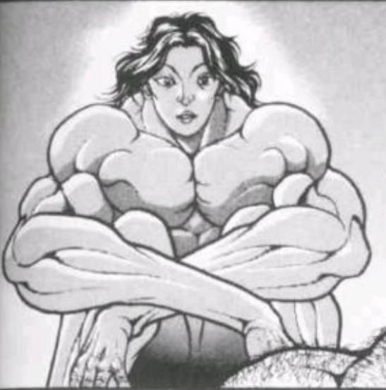
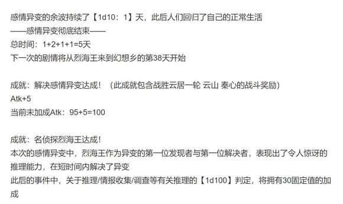
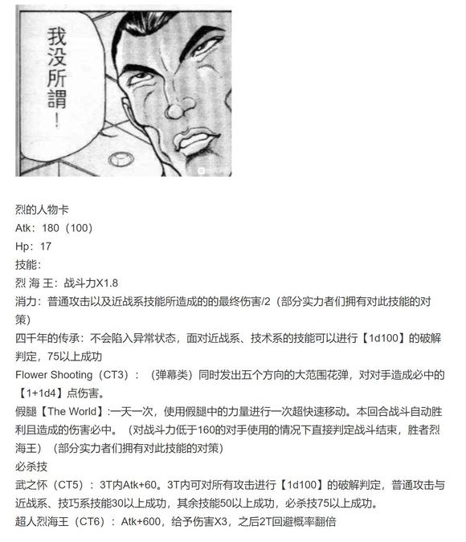
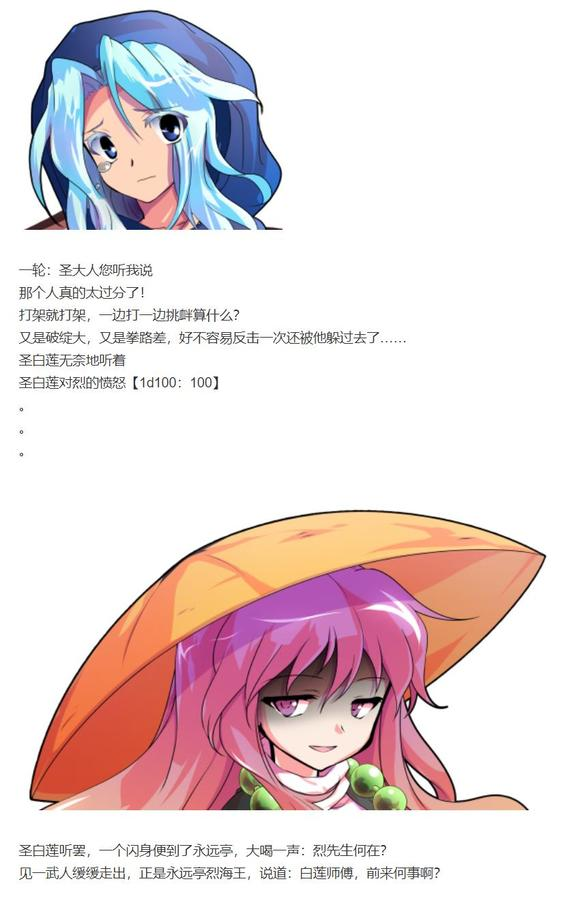
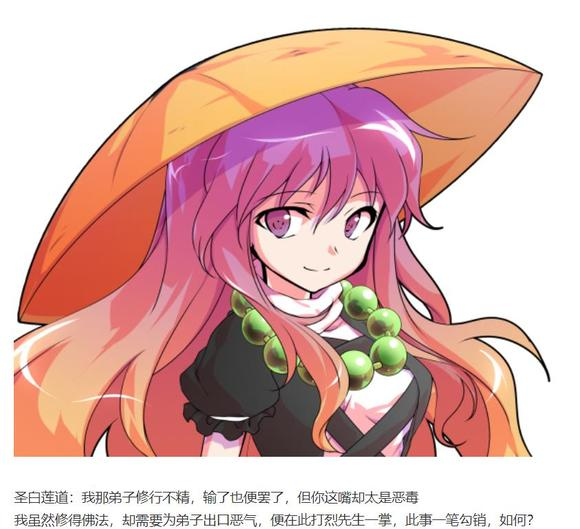
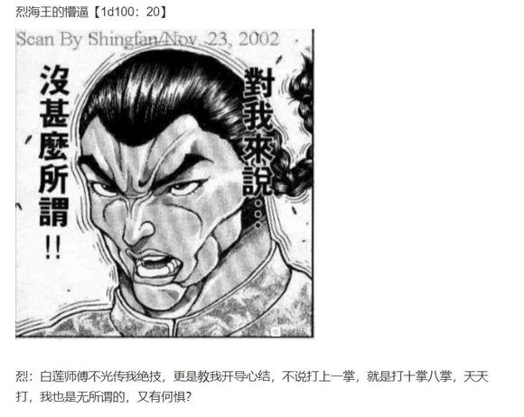
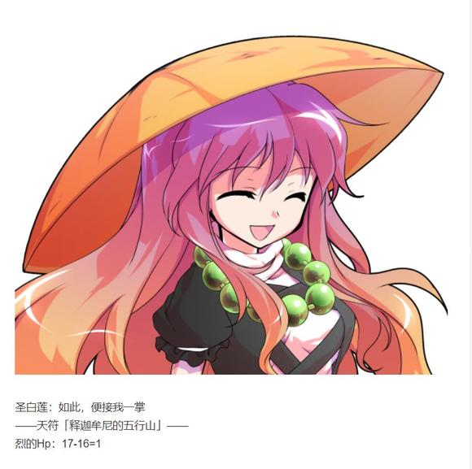

烈：是这样的，我将这次事件的元凶打倒了。

两人：？？？

烈：你们看，就是这位秦心小姐

烈的说明：【1d55：27+45=72】（神子与白莲的智慧+30，神子与白莲的默契+15）

白莲的震惊【1d100：40】

圣白莲：这可真是，没想到我们还在讨论的时候烈先生却已经把异变解决了

神子的愉悦【1d100：21】

神子：啊这可真是……我活跃的机会完全丢了……

秦心：所以说，两位有办法解决我的问题吗？

神子：让我看看……咦？

面灵气？怎么感觉有点熟悉……

你是秦河胜的面具变成的付丧神？

神子：哈哈哈哈哈哈哈！这可真是奇妙的缘分！

我为河胜所做的面具，却在这个时代变成了妖怪秦心

秦心所引起的异变，又被我所救助的烈海王独自解决了

而到了最后，兜兜转转，秦心又被烈海王带到了我的面前！

圣白莲：结果说到最后不还是你当年留下的问题？

还好意思在这里笑，你这不良圣人

神子：好好好……

来，秦心，这是新的希望之面

神子手搓了一个新的面具

烈：神子殿下，这玩意……怎么长的跟您有点像啊

秦心：不，原本的希望之面就是这样的

神子：那是当然

构成秦心的66个面具，都是我当初亲手做的

毕竟这天下除了我以外，还有谁配得上成为希望的化身？

圣白莲：光是做一个新的面具，根本没法解决问题

万一哪天面具又丢了，岂不是又要再来一回？

秦心啊，你这段时间就先跟着我们修行吧？

如果能够熟练控制你的能力，哪怕面具再度丢失也不会出现这种情况的

神灵庙中的三人，持续着欢乐的谈话

烈：不知道为什么，看上去总有种一家三口（？）的感觉

好的，那么

叫做异变是吧？

关于感情的异变，到此结束了

——感情异变结束——

总持续时间：1+2+1=4天

（不过，烈海王这漫长的一天还没结束，因为他回去之后还得跟永远亭众解释一下这次的事件）

（换句话说，明天还有解说环节和彩蛋，没有完全理解的大家也不要着急）

（本日的更新结束）

（以下是我的废话）

我现在十分理解荒木老师为什么之后老是削阿强或者压根不让他出场的心情

因为时停这个技能实在是太屑了（悲）

好端端的绝地反击硬生生能演出欺凌弱小的效果，讲真我那块都快骰不下去了

秦心加油！秦心不要输啊！好呀秦心大成功啦！

然后想起来假腿的效果是一回合

换句话说花之射击也得用

时停，还贴脸，烈又不是傻子这压根没理由不打全伤害啊（悲）

想着给秦心一个机会然后烈的良心骰子。。。没过。。。所以这里设计了让他回想起boy和克巳的剧情

毕竟，地下竞技场可没有手下留情一说啊

这次异变基本结束了，不过之后还有烈回永远亭的剧情

关于本次异变的本质会在那里进行解说，请大家放心，不要着急

那么今天就到这里，明天彻底结束感情的异变

～时停好强啊！～

时停好强啊！

但是时停没法削啊

因为烈的时停是双重大成功出来的东西

换句话说，是就此拿到真正的时停能力，都不奇怪的等级

我不能把这个腿削掉，因为这已经是对骰子的极大不尊重了

那么，时停怎么处理？

首先 你们觉得烈海王在平常的战斗中会用时停吗？比如说跟红海皇打架的时候

他肯定不会啊（笑）

烈海王遇到新角色快输的时候呢？

他也不会啊（笑）就算烈今天被一**打，他也不会用这玩意的

对于烈海王来说，时停是规格外的手段，是找到异变的元凶或者生命遇到极大威胁的时候才会用的东西

换句话说，除了最终boss战大家可以当这玩意不存在的

另外，就如上面吧友们所说的一样

幻想乡的强者们是有着时停对策的

甚至不光时停对策，atk不到某个线以上压根没有办法打，因为会被秒杀

所以请大家放心，虽然安科贴崩战力是家常便饭，但我会尽力控制的

由吧友@望远镜300  制作的第二集更新了！

大家有空的话去看看吧！

~永远亭~

铃仙：烈先生，你又一身是血啊

每次有点事情回来都这样，连我习惯了

师匠就在诊疗室，赶紧过去疗伤吧

说起来今天是去干什么了？怎么回来这么晚？

烈：就是去解决我早上说的事件

神子殿下管这次的事件叫感情异变，我还是第一次听见异变这个词

铃仙：哦

哎？

异变发生了？？

异变解决了？？？

师匠的治疗持续了【1d30：2】分钟

师匠：在这里用胶水一粘就可以了，治好了！

烈：那么我重新开始讲——

就是这样，最后把秦心小姐交给神子殿下她们之后，我就回来了

因幡帝：真是听得我头晕……我理一下思路

首先，烈海王，为什么感情的失衡会导致喜欢看打架这种结果？

烈：这与失去的感情有关

这次丢失的面具是【希望之面】，也就是说，人们失去了他们的希望，造成的结果即所谓的【厌世观】

人类没有了希望，就会追求拥护刹那的快乐，就会将希望寄托在虚无缥缈的事物上，也即虚假的希望

在这一次的表现中，就是被华丽的战斗所深深吸引，甚至将其看做自身生活的全部了

我想宗教家们或多或少都察觉到了这一点，她们参与活动的原因，除了单纯的争夺人气外，也有着利用教义以引导人们的希望这一目的在。

铃仙：但是，烈先生

如果按照这个说法，那么神灵庙，命莲寺与博丽神社的信仰宗教的人们，不也都失去希望了吗？

烈：这就与她们所相信的事物有关

神子殿下信道，是因为她喜爱那种探索自然的精神，同时向往其长生不老之法术

白莲师傅信佛，是因为她认同那种众生平等的理念，同时需要其金刚不坏之佛法

我并不了解博丽的巫女以及她所代表的神道教，在此就不加妄言，但想必其精神内核是一致的

她们所追求的，是其理念的本质与其实质性的成果

烈：然而失去希望的人们，却只看到了其外表的光鲜

只要打得好看，哪管什么神佛道之分

甚至如我一样连信仰都没有的武术家，都能得到他们的喝彩而聚集人气

如果我夺得了高人气，说不定人里中连信仰中华武术的人都会出现

这当然不是正常的现象了

皮克：嗷嗷嗷嗷嗷嗷嗷啊

皮克手写板：秦心小姐的来源是？

烈：从她们的对话来看是这样的

神子殿下生前，即她还是圣德太子的时候，曾经给她的部下秦河胜做过一套面具

但是，神子殿下的力量太强了

她亲手制作的面具在经过漫长的时间后，成为了所谓的“付丧神”妖怪，并拥有了操纵感情的能力

那份能力由于其中一个面具的丢失而失控了，从而导致了这次人里居民们的情绪异常变化，最后最直观的表现就是所谓宗教战争了

辉夜：事情的起因经过倒是搞明白了

不过，这件事就算你不调查也照样会被解决啊

人里的异常被察觉终究只是时间问题，到时候灵梦飞过去噼里啪啦打两下这事情也就结束了

短暂的祭典狂热并不会造成什么严重的后果

烈：这倒是难说，今晚的人里已经出现了感情缺失的现象

由于希望的消失，人们陷入了绝望的漩涡，如果一直没人发现，说不定感情消失会变成席卷全幻想乡的问题

烈：不过，常去人里的强者有很多，这事迟早会被发现，实际上今天神子殿下和白莲师傅已经察觉到不对劲了

之后以她们的实力，感情异变被解决也只是时间问题

所以我早上就说了，只是一件小事啊

毕竟我今天其实也就是打了两场架，真要说上午那场还没有下午锻炼的时候被红海皇打的惨呢

听完了故事，大家散去了

师匠：能够成功解决小型的异变了，这不是变得越来越强了吗

不过话虽如此，日常的学习也不能放下

继续加油啊，烈

永琳微笑着摸了摸烈的头

烈的恋情【1d100：34】（90以上察觉）

烈：师匠，你放心吧

我会继续努力的！

异变结束后的彩蛋环节

（纯搞笑剧情，无大成功大失败，无能力升降新技能学习）

~异变~

博丽神社

灵梦：最近几天神社的人气真高啊！

今天该去揍谁呢？

灵梦注意到了门口的报纸

灵梦：让我看看今天又是谁的胜利

异变发生了？

异变解决了？？

异变被永远亭的武术家解决了？？？

灵梦的震惊【1d100：79】

灵梦：惊了，这槽点太多以至于不知道从何吐起

~大狸子大失败~

二岩猯藏：哎呀呀呀……前两天刚在灵梦面前说了那样的话结果今天就看到了报纸

老朽的脸面哦……

大狸子的丢人【1d100:42】

二岩猯藏：算了，反正灵梦她无所谓的！

烈海王被一掌拍进地里了

圣白莲：啊！烈先生，您没事吧？

实在是抱歉，我刚刚与一轮聊天的时候，不知怎么回事突然怒火攻心

回过神来已经变成这样了！

烈：噗——我没什么大碍，多谢白莲师傅手下留情

今天下午讲道的时候，不如我给您带些素斋吧？顺便给一轮师傅也做一份

圣白莲：那真是麻烦您了

要不我先把您从地里拉出来吧？光剩一个头在外面，估计很难自己出来……

~说起来原本的希望之面呢~

地灵殿

古明地觉：恋恋你最近又是天天跑到地上玩？

古明地恋：姐姐你看，拿到了这个奇怪的面具之后，大家都能看到我了！我的记性好像也变好了哎

古明地觉：是谁掉落的呢？偏偏掉到地底了，估计没人能想到吧

说起来异变第四天就结束了，恋恋与秦心相遇了吗？

缘分【1d100：41】（80以上相遇）

古明地恋：不知道啊~也没有人来找我要

于是，由于烈过度的活跃，一对好朋友的相遇被推迟到不知什么时候了（悲）

~秦心再战~

神灵庙

神子：秦心啊，之前那个武术家可不是小偷哦？你误会他了

秦心：这样吗……

秦心对烈的偏见【1d100：41】（38以下可以重骰一次好感度）

秦心：虽说用能力战斗是理所当然的

但我还是觉得，用了时间停止之后打人太过分了

偏偏还是在我开了必杀技的时候

神子：这么不能接受就再去找他打一场吧

烈肯定会接受的

永远亭

烈：秦心小姐想要再来一次？没有问题

烈的出力【1d100：24】

秦心的出力【1d100:30】

秦心胜利

烈：啊我输了——

秦心：骗人，你完全没有出全力吧？

烈：这个嘛，你不也一样？

秦心：这种胜负无法让我接受

下一次有机会，我一定要堂堂正正战胜你，现在我已经有了经验，哪怕是用了假腿之后的你我也会赢的

烈：来都来了，顺便吃个午饭吧？

正好今天多做了一些

秦心的饥饿【1d100：33】

秦心：我不是很饿

烈：那就，吃点甜品？

秦心：……也行

烈的厨艺【1d50：25+50=75】

秦心：……还挺好吃

还有吗？再来一盘

~说起来，烈是怎么打架的~

幻想乡的少女们基本都会飞啊！

那烈，你是怎么打的？【1d10：9】

1 其实我也会飞

2 多么健壮的腿啊

3 多么健壮的腿啊

4 其实我也会飞

5 是轻功，我用了轻功

6 其实我也会飞

7 是轻功，我用了轻功

8 答案是月球科技

9 答案是河童科技

10 其实我也会飞

烈：之前跟铃仙前辈卖药的时候，在路边河童的地摊上买了一个携带式飞行装置

真的很好用，连充电都不用，只要戴在身上就能飞了

而且体积很小，战斗中都不需要特地去保护它

河童科技，真的很强大

PS:被遗忘的小恶魔

之前在骰红魔馆众的时候，小恶魔被遗忘了

现在就顺便补上吧

【1d100：23】

小恶魔：天天过来真的是烦人，没看到帕秋莉大人都没法好好看书了吗

我才发现我最后发骰子的那层楼被吞了

等晚上回去补一下

（以下是我的废话）

感情的异变应该是本贴的第一个“主线剧情”，也是我第一次尝试写这样的东西

与之前零零散散的日常与交流不同，烈这次有了一个明确需要解决的目标

本来我计划的发展是：参与进去打上一场——不管是赢是输都能认识新人物——从对手的嘴里得知信息或者烈自己察觉不对劲——寻找大佬们的帮助——过几个调查时间骰子——最后在相对较后的时间点旁观异变解决或者自己解决异变

但是光速解决事件的名侦探烈海王这种莫名其妙的展开完全没想到过

同时这一次我也犯了不少错误，从最基本的计算错误到实力定位没有讲清楚这些零零散散都有

在这里感谢吧友们的讨论与指出错误，我也吸取了很多经验，在之后的剧情中会更加仔细全面地考虑问题

不过骰子大成功/大失败/梗选项中了这种就真没办法了（笑）

之后的剧情会是烈的日常（剧情线上的一天）——原创活动剧情（轻松的小活动）——交流回（以及安价遇到的新人物）——新的异变这个顺序

那么今天的更新到此结束，下一次更新会是周一或者周二

（本日的更新到此结束）

说起来，大家有什么原创活动的提议吗？

就是那种像手游活动一样的，关于xxx角色的xxx活动

由于是原创活动所以并不会长，撑死就一次战斗+相关剧情这样

并不是安价楼 只是想听听大家的意见而已（笑）

（今天才发现这个贴子被加精了，真实爽到）

那么开始今天的更新

~永远亭~

烈海王做完早饭与晨练之后，开始了他在幻想乡的第38天

烈要做什么？【1d10：9】

1 跟师匠学习

2 帮师匠坐诊

3 找皮克玩吧

4 找芙兰小姐玩吧

5 去神灵殿送饭

6 去人里逛逛（随机事件）

7 跟铃仙去卖药吧

8 帮辉夜小姐跑腿

9 找红海皇锻炼

10 大成功/大失败【1d2：1】

烈：经历了昨天的两场战斗之后，感觉实力变强了

去找红海皇试试手，顺便聊聊刚过去的异变吧

烈海王前往红魔馆

路途中有出现什么事情吗？【1d100：67】（75以上有）

~红魔馆~

红美铃：今天来的这么早？

烈：是啊，昨天打了两场激烈的战斗，迫不及待地想来试试手了

红美铃：看上去又变强了，明明来到幻想乡才一个月多点，真是令人惊讶的速度

不过，我可不会原地踏步哦

红美铃突然击出一掌

烈：消力——怎么消不掉？！

红美铃：跟掌握消力的你打了一个多月，就算再蠢也能想出破解方法了

你意料之外的攻击，纯粹能量类的攻击，以及力量极大的物理攻击

只要在战斗中使用以上几种方法，就可以战胜你的消力

烈：红海皇，您的悟性真是强大

确实，我之所以来到幻想乡，也是因为消力在最后失败了……

不过如果您想学，直接问我即可，何必独自一人思考呢？

红美铃想学消力吗？【1d100：83】（80以上想）

红美铃：说实话，我对老郭这奇迹般的技术确实很好奇

破解消力的方法我已经想到了，但是如何用自己的身躯使用消力，如何用消力攻击，却是我不知道的

但我也不能白学你的技术，那么——

红美铃的报酬【1d10：10】

1 好感度上升【1d15】

2 提升烈的武术造诣（武之怀增强）

3 消力的高阶应用（攻消力）

4 好感度上升【1d15】

5 咲夜的厨艺交流（厨艺固定值增强）

6 好感度上升【1d15】

7 提升烈的武术造诣（武之怀增强）

8 咲夜的厨艺交流（厨艺固定值增强）

9 大小姐的命运占卜（为啥啊）

10 大成功/大失败【1d2：1】

红海皇大成功了？！

大……大成功的结果是什么？？【1d10：3】

1 好感度大上升【5+1d15】

2 大幅提升烈的武术造诣（武之怀增强+Atk上升）

3 消力的超高阶应用（攻消力+Atk上升）

4 好感度大上升【5+1d15】

5 咲夜的全力厨艺讲座（厨艺固定值大增强）

6 好感度大上升【5+1d15】

7 大幅提升烈的武术造诣（武之怀增强+Atk上升）

8 咲夜的全力厨艺交流（厨艺固定值大增强）

9 大小姐的命运改善！（为啥啊）

10 大成功/大失败【1d2：2】

红美铃：我学会之后就教你消力的超高阶应用吧！

按照你的描述，老郭可以做到利用消力进行强力攻击

你毕竟没有像他一样舍弃肌肉，想要直接复刻老郭的奇迹是不可能的

不过，我记得你会圣白莲的超人术吧？

红美铃：在超人术发动的时候，你应当可以完全掌握自己的肉体，此时就可以用出完全的攻消力了

另外在平时的攻击中，虽然无法完全发挥力道，但使用攻消力的思路也可以让你的攻击更强

烈：红海皇……您果然是天才

就算没有报酬，我也应当将消力教给您——

我本想这么说的，但是我实在太想追上郭海皇的脚步了

就麻烦您学会后再传授与我了

红美铃：这样下去，我的战力可也会增强喲

你想要追上我的脚步可是更难了

烈：中华武术，本就是互相学习互相提升

在这个过程中，变强的不只是我们武人，更是武术本身

若只是分享我的经验就能让武术得到进一步的成长，我当然是无所谓的

想必郭海皇也会这么说吧

——烈海王学会了攻消力——

Atk+5，未加成Atk变为105

Atk：189（105）

超人烈海王：学会攻消力后可在超人术发动时使用，威力进一步增强  Atk+650，造成伤害X4

