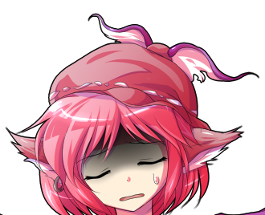

接下来烈要做什么？【1d10：5】

1 留在这里跟二小姐玩

2 去找幽香聊天

3 帮白莲讲道

4 给神子送饭

5 帮铃仙卖药

6 去人里闲逛（随机事件）

7 去找幽香聊天

8 帮白莲讲道

9 去看看秦心吧

10 大成功/大失败【1d2：2】

芙兰朵露：要走了吗，烈？明天继续过来玩哦~

烈：红海皇，芙兰小姐，我就此告辞

今天下午我打算去找铃仙前辈帮忙卖药

~人间之里~

烈海王一眼就看到了带着苦恼的表情卖药的铃仙

烈：铃仙前辈，需要我帮忙吗？

铃仙：烈先生，你在啊！

有空闲的话就顺便帮帮我吧，我实在是不适应人多的地方……

烈的帮忙【1d100：46】

烈：感觉我好像也没有帮上什么忙

毕竟我实在是没做过买卖，要不要学着一边的商贩大声叫卖一下？

铃仙：还是算了吧

看过来的人会很多，但是来买药的人还是那些

人们对于兔子的药好像总有着一份戒心

烈：好像一下午就只有几个人过来买过

药还有很多啊……

铃仙的不服输【1d100：11】（75以上继续努力）

铃仙：日常就这样啦~

天色也晚了不如我们回去吧~

烈：（充满了应付差事的味道，就这么讨厌来人多的地方吗）

算了，反正师匠她应该也不会在乎

我也得回亭子里做饭了

说起来，前辈天天吃我做的饭会不会腻啊？要不要今晚出去吃？

铃仙想出门吗？【1d100：93】（75以上想）

铃仙：我觉得可以啊！

倒不是说烈先生的厨艺不好，只是偶尔也想换换口味

铃仙：烈先生如果还要回去给永琳师匠她们做饭的话，就等做完饭之后去竹林里的深夜雀食堂吧？

虽然是小摊但是口味还蛮不错的

烈：我无所谓

~深夜雀食堂~

说起来米斯提亚的好感度是16来着（悲）

小碎骨超低好感度的理由是【1d10：7】

1 烈点了很多鸡肉料理

2 烈作为厨师的无情毒舌

3 烈在小摊打架了（为啥啊）

4 烈点了很多鸡肉料理

5 烈：八目鳗，好恐怖的东西

6 小碎骨觉得烈很丑

7 烈点了很多鸡肉料理

8 烈喝多了发酒疯（为啥啊）

9 烈作为厨师的无情毒舌

10 大成功/大失败【1d2：2】

“欢迎来到深夜雀食堂~两位要吃点什么？”

从有着红色灯笼的移动货摊中走出的，是有着羽翼的娇小粉发少女：米斯蒂娅·萝蕾拉

她头戴着有羽翼状装饰的帽子，身穿棕色的裙子，头的两侧能够看到与人类明显不同的耳朵

烈：（好久没吃禽类料理了，有点馋了）

老板娘你好，麻烦来两个烤鸡腿，三串鸡肉串，四个烤鸡翅，顺便如果有烤麻雀的话也来一只吧

米斯提亚：好过分的家伙？！你是来砸场子的吗？！

铃仙：不是这样的老板娘，他不了解情况！

烈先生，米斯提亚是夜雀妖怪，换句话说是鸟类妖怪！不要在这里点太多鸡肉料理啊

烈的情商【1d100：40】

烈：（为啥夜雀妖怪开的店里不能点鸡肉串？太怪了）

不好意思老板娘，那来点招牌菜吧

铃仙：这里的招牌菜是烤八目鳗

老板娘，我要一份元气盖饭

烈：八目鳗也太怪了……这就是妖怪开的店吗（老板娘听得一清二楚）

米斯提亚气鼓鼓地回去准备菜了

店里有其他客人吗？【1d100：74】（50以上有）

其他的客人是？【1d10：1】

1 休息中的十六夜咲夜

2 藤原妹红

3 带了蘑菇来的魔理沙

4 3+爱丽丝

5 休息中的十六夜咲夜

6 藤原妹红

7 3+帕秋莉

8 休息中的十六夜咲夜

9 藤原妹红

10 大成功/大失败【1d2：2】

“真是巧遇，这不是烈海王先生和铃仙小姐吗”

早已坐在店里的人正是红魔馆完美无缺的女仆长，十六夜咲夜

烈：没想到会在这里遇到咲夜小姐

铃仙：咲夜小姐今天难得放假了？

咲夜：就算是我也是需要休息的，出来喝两杯放松一下

你也来一杯吧，铃仙小姐？你那边的职场压力也很大吧

烈：我也一块喝两杯吧

——吨吨吨吨吨吨吨——

烈的醉意【1d100：86】

咲夜的醉意【1d100：92】

铃仙的醉意【1d100：61】

（60以上喝醉）

米斯提亚：完了完了，这仨明明酒量不行喝起来倒是蛮快的

烈：咲夜小姐我跟你讲！你给我做的假腿超级好用的！

对着放出必杀技的敌人大喊一声TheWorld！然后就用超人和弹幕！

咲夜：小刀，要扔小刀才行！

就这样一把一把扔过去，全部扔完以后让时间开始流动——超爽的那感觉！

咲夜开始扔小刀了

烈和铃仙在旁边鼓掌

小碎骨躲在柜台后面瑟瑟发抖

铃仙：最近压力真的好大

不用做饭之后，为什么活反而变多了

突然就扔给人家一堆药然后让我去卖……这么想要钱就自己去啊那个bba……

咲夜：大小姐这两天简直任性的过分……突然要养宠物，突然又要换家具……

二小姐又是天天调皮捣蛋……家里的碟子一批批换

又要收拾烂摊子又要做饭还要天天挂着一幅完美的表情，什么狗屎日子

烈：我打不过……我怎么都打不过红海皇……

天天挨揍，之前白莲师傅又神经病一样跑过来一巴掌把我打成重伤

我出生到现在连恋爱都没谈过……呜呜呜呜

三个酒鬼趴在桌子上抱头痛哭，哭完接着喝酒

三人喝了【1d6：6】小时

米斯提亚：这怎么整啊，这

他们仨连钱都没付呢

为什么铃仙每次一来都会出现需要找医生的情况啊……

兔子们在吗~过来帮我一下~

最终，老板娘和兔子们拖着烂醉如泥的三人跑到了永远亭

师匠的醒酒药【1d50：48+50=98大成功】（师匠的药术+50）

醒酒药值大于三人的醉意，三人全部清醒了

师匠的大成功是什么？【1d10：8】

1 听到烈想谈恋爱

2 听到铃仙**ba

3 咲夜的帮助

4 听到烈想谈恋爱

5 听到铃仙**ba

6 咲夜的帮助

7 听到烈想谈恋爱

8 听到铃仙**ba

9 咲夜的帮助

10 大成功/大失败【1d2：1】

师匠：真是多谢你了米斯提亚小姐，真没想到他们的酒量差成这样

——米斯提亚拿了钱飞走了——

师匠：对了，优昙华

你刚刚骂的满起劲啊，BBA是吧？

烈，你也听到了？是吗？

在这一瞬间，十六夜咲夜的求生本能觉醒了！

“今晚真是麻烦您了，来日我定将上门拜访，今日夜色已晚，我便先走一步，在此告辞！”

说出这句话并且行礼，从头到尾只用了0.5秒的时间！

下一瞬间，红魔馆的女仆长消失了！

——幻世【The World】——

铃仙：不不不不不不不师匠你相信我我说的不是你啊啊啊啊啊啊啊啊啊——

烈：师匠我没有听到我什么都没有听到——

永琳的怒气【1d100：32】

永琳：看，酒鬼在说话（笑）

算了，毕竟你们喝多了，和两个醉鬼生气也没有意义

永琳：那就只用这张吧（笑）

天咒【Apollo 13】

出现在两人面前的，是以永琳为中心瞬间展开的，铺天盖地的密集弹幕

那份美丽，就连烈海王也深深为之吸引

烈：救命啊！！！（中文）

铃仙：救命啊！！！（日文）

永远亭中响起了巨大的喊声

皮克被惊醒了！

皮克从房间里出来看了一眼，身体抖了一抖，就赶紧回去了

~第38天结束~

（我歇一阵之后更原创活动）

日常回的骰子

虽然很突然但是原创活动开始啦！

有新角色也有老角色！有没出场过的人也有已经出场过的人！

烈海王乱七八糟的一天正式开始！

——这是发生在烈海王来到幻想乡的第39天的事——

本次的原创活动是【1d10：3】

1 名侦探古明地觉事件簿

2 白玉楼今天的饭

3 旧地狱地狱擂台赛

4 皮克的完美算术教室

5 魔理沙的约会大作战

6 射命丸文的夏末特刊采访

7 东风谷早苗想要成为偶像

8 橙的母亲节报恩

9 地上最强的闺蜜打架

10 大成功/大失败【1d2：1】

旧地狱大擂台赛篇，堂堂连载！

烈海王从哪里得知了地狱擂台赛的存在？【1d10：9】

1 恋恋发的传单

2 伊吹翠香的宣传

3 文文新闻

4 人里的传言

5 与红美铃的闲聊

6 恋恋发的传单

7 文文新闻

8 恋恋发的传单

9 文文新闻

10 大成功/大失败【1d2：1】

烈海王一大早起来就习惯性地闪避了迎面而来的报纸

烈：天狗们就不能好好把报纸放下吗？

这报纸发的，每天早上我起床第一件事居然是躲暗器……

烈：让我看看今天说了什么

本日的头条是：地下最恶！鬼族的愉快擂台赛开幕！

烈的理解【1d100：6】

烈：？？？？？？？？？

啥啊，这是

地下是要跑到土里面打架？

鬼族又是什么玩意？

烈的行动是【1d10：6】

1 去问问师匠吧

2 去问问红海皇吧

3 靠我烈海王的推理！

4 去问问铃仙前辈吧

5 去问问神子殿下吧

6 靠我烈海王的直觉！

7 去问问皮克吧

8 去问问帝吧

9 去问问辉夜小姐吧（为啥啊）

10 大成功/大失败【1d2：2】

烈：逻辑思考无法理解的事情，就用直觉去思考

这里就用我烈海王的直觉！

烈的直觉【1d100：9】

烈：什么都想不到！

——在这么下去这活动没法展开了所以师匠来了——

师匠：烈，大清早在这里看着报纸发呆是做什么？

你昨晚喝得到现在都没清醒？

烈：不是的师匠，我只是看不懂这报纸在说什么而已

师匠：让我看看……旧地狱大擂台赛？挺适合你的活动啊

师匠的解说【1d50：2+50=52】（月之头脑+50）

师匠：——就是这样，明白了吗，烈？

仅限这个活动的期间内，地上的人也可以自由进出旧地狱了

烈：嗯……就是可以免费跑到地下去跟强者们打架的活动对吧？

我明白了师匠，今天我就去看看！

师匠：唉……这孩子到底是天才还是蠢材

怎么有的时候连皮克都比他聪明

做完今天的早饭与午饭后，烈海王前往旧地狱

有人与烈一起去吗？【1d100：66】（80以上有）

今天的烈海王也是独自一人出发了

~旧地狱~

烈：真热闹啊，地底下居然有这么繁华的街道

街上这些长角的就是所谓的鬼族？

确实很多鬼都是一身肌肉的健壮样子，看上去和勇次郎蛮像的

路人鬼（友情出演：范马勇次郎）：大擂台赛！大擂台赛现在开始报名了！

不管是鬼，妖怪，巫女，还是人类，只要对自己的实力有信心统统可以报名！

获胜的奖品是【1d10：2】

1 星熊勇仪特制美酒

2 由不愿意透露姓名的鬼王提供的药酒

3 伊吹萃香提供的大量酒

4 地灵殿温泉一日游（双人份）

5 星熊勇仪特制美酒

6 由不愿意透露姓名的鬼王提供的药酒

7 伊吹萃香提供的大量酒

8 古明地觉的心理辅导

9 什么都没有!（好感度）

10 大成功/大失败【1d2：2】

路人鬼：获胜的奖品居然是，由茨木——由不愿意透露姓名的鬼王大人提供的药酒！

强身健体，治病救人，想要怎么使用都行！单纯当做美酒饮用也很好！

烈：是鬼族的药酒？师匠应该会有兴趣

路人鬼：本次大赛的擂主是星熊勇仪大人！然后本次大赛意外的参加者居然【1d100：14】（50以上出现人物）一个都没有！只有我们鬼而已哈哈哈哈哈哈哈哈哈！

路人鬼：完全是鬼族大乱战！战胜了【1d6：5】轮比赛后即可拿到奖品

但是！拿到奖品的人，同样也要和勇仪大人玩两把才行！

烈：打赢鬼之后还可以和鬼王交手？！

我要报名！

路人鬼：你是人类吧？我们鬼的力量可是很大的

路人鬼对烈的评价：【1d100:16】

路人鬼：不行不行~如此瘦弱还身有残疾，这怎么能和鬼交手？

老老实实当个观众吧你

烈的行动是：【1d10：4】

1 让你看看中华武术的厉害吧！

2 “我是来自永远亭的烈海王”（以势压人）

3 鬼族的气量也不过如此（激将法）

4 让你看看中华武术的厉害吧！

5 让你看看我烈海王的口才！

6 让你看看中华武术的厉害吧！

7 鬼族的气量也不过如此（激将法）

8 让你看看中华武术的厉害吧！

9 让我报名的话就给你秘制的酒（厨艺）

10 大成功/大失败【1d2：2】

烈海王并未出言反驳

他闪电般地向一旁的空气击出一拳——

空气中响起了巨大的响声，其拳力的余波甚至连一旁的路人鬼也能感受得到

烈：这是我一位挚友所使用过的技巧

虽然我尚未达到他的境界

但作为其招式的原型，发挥出一部分的威力还是做得到的

路人鬼的评价【1d70：40+30=70】（超音速拳+30）

路人鬼：桀桀桀桀，真是看走眼了

这不是相当的强者吗！

想来打架就报名吧，一边喝酒一边唱歌一边大闹吧！

一场战斗结束后有【1d30：14】分钟的休息时间，十分充足

连续战斗胜利5场的人就可以拿到酒，然后被勇仪大人暴打一顿！

烈：正好借这个机会试试鬼族的实力

听他的意思这次只有普通鬼族参战，那就让我赢到最后看看鬼族的实力吧

烈的连胜【1d100：69】（50以上直接冠军,50以下发生随机事件）

~地狱大擂台~

路人鬼：大擂台赛第五场，开开开开开始了！

鬼族的参战选手是核弹头加藤——据说他向地灵殿的阿空学习了核爆头槌的力量！

然后是本日的黑马选手，来自地上的烈海王——目前为止的四战全部胜利！普通的拳头会被直接消去，强大的招式就用武术破解！

观众的热情【1d100：12】（75以上有角色观战）

观众场上的嘘声：“别打秒杀战了！”“吁——真的丢人，四个鬼打不过一个人！”

“阿空，你还会核爆头槌啊？”

“我不会啊？我会吗？原来我会啊！”

“傻鸟，你不会。翘班出来看比赛还以为我没有发现吗？给我回去上班，恋大人也是赶紧回家啦！”

由于没什么观战的热情，地灵殿三人组离去了

烈的出力【1d100：87】

加藤的出力【1d100：56】

烈海王 胜利！

路人鬼：6月8日，一记直拳，这场也是漂亮的秒杀！

加藤你真的丢人，你滚到地底去泡岩浆吧！

烈的满意度【1d100：54】

烈：马马虎虎吧，这些鬼们的力量确实极强——但技巧真的不大行

接下来，让我看看鬼王的力量吧！

本次出场的鬼王是？【1d10：2】（5以上勇仪，2-4萃香，1不愿意透露姓名的某位鬼王）

BGM：砕月

“哈哈哈，把旧地狱的鬼们打成这个样子，真是有趣的人类”

从观众席上一跃而下的，是醉醺醺而长着巨大双角的幼小少女

她身着白色无袖衬衫，脖子上系着红色布带，腰间穿着有金属光泽的带环腰带，

下身穿着三层套裙，双脚穿着短袜和带有洋红色蝴蝶结的黑色鞋子。双手手腕处有手铐连着锁链，末端连接有奇妙的几何物块

其真身正是山之四天王之一——小小的百鬼夜行，伊吹萃香

烈：你就是本次的擂主，怪力乱神的鬼王星熊勇仪吗？

听说是高大而独角的女子，实际看上去与传言完全不同啊

萃香：不，勇仪在看台上喝酒哦

本来应该是她下来的，但是我觉得你很有意思，就先行一步了

我是同为山之四天王的伊吹萃香

烈：既然都是鬼王，那我自然是无所谓的

萃香：烈海王，我很清楚你的事

你一次都没有参与过宴会呀

尽管永远亭的人们邀请过你一起去，但你只是做点料理让她们带上而已

因为你到现在都不觉得自己是幻想乡的一份子——

你仍然下意识地把自己看成一个来客，却连主人召开的宴会都不愿意参加

烈：我想你误会了什么，我只是单纯不适应这样的场合——

萃香：看吧这个回复，就跟我想的一模一样

接下来你又要说你无所谓了，对吧？

烈：！

萃香：不喜欢宴会却爱喝酒和打架，不知道说你是奇怪的人还是孤僻的鬼

那么，烈海王——你能坚持几个回合呢？

战斗！

BGM：御伽之国的鬼岛　～Missing Power

烈海王

Atk 189（105）

Hp 17

技能

烈 海 王：海王是中华武术的巅峰，烈海王又是其中佼佼者，凭借高超的技术使战斗力X1.8

消力：传自郭海皇的绝学，普通攻击以及近战系技能所造成的的最终伤害/2（对战斗力230以上的对手无效）

四千年的传承：不会陷入异常状态，面对近战系、技术系的技能可以进行【1d100】的破解判定，75以上成功

Flower Shooting（CT3）：（弹幕类）同时发出五个方向的大范围花弹，对对手造成必中的【1+1d4】点伤害。

假腿【The World】:一天一次，使用假腿中的力量进行一次超快速移动。本回合战斗自动胜利且造成的伤害必中。（对战斗力低于160的对手使用的情况下直接判定战斗结束，胜者烈海王）

必杀技

武之怀（CT5）：3T内Atk+60。3T内可对所有攻击进行【1d100】的破解判定，普通攻击与近战系、技巧系技能30以上成功，其余技能50以上成功，必杀技75以上成功。

超人烈海王（CT6）：Atk+600，给予伤害X3，之后2T回避概率翻倍

伊吹萃香

Atk 260

Hp 16

技能

鬼气【蒙蒙迷雾】：普通攻击以及弹幕类技能所造成的最终伤害/2（对战斗力240以上的对手无效）拥有对时停/隙间等特殊手段的耐性（对所有对手有效）

醉神【鬼缚之术】（CT3）：（技术类）以锁链捆住敌人，把敌人牵拉过来后进行追击。本回合对手无法进行普通攻击

鬼符【Missing Power】（CT4）：（自身加成类）变大，变更大，变超大，3T内Atk+60

鬼符【豆粒大的针地狱】（CT4）：（弹幕类）分化出无数小萃香发出弹幕攻击，对对手造成【2+1d3】的伤害

必杀技

四天王奥义【三步坏废】（CT5）：逐渐巨大化并不断出拳，威力极强但破绽较大 Atk+800，对对手造成的伤害X5，对手发动对本技能的破解时，其判定所需的成功值减少20

鬼符【大江山悉皆杀】（CT6）：抓住敌人将其多次扣击地面，并在最后以大爆发吹飞的投技。无法回避，无法防御，无法破解，Atk+650，对对手造成的伤害X4

T1

烈的攻击【189+1d100：11=200】

萃香的攻击【260+1d100：33=299】

萃香：力量太弱了！哈哈哈哈

烈的受伤【1d10：1】

1 回避

2 小伤害

3 小伤害

4 中伤害

5 中伤害

6 大伤害

7 大伤害

8 特大伤害

9 特大伤害

10 大成功/大失败【1d2：1】

烈：躲过去了

真糟糕，如此强大的力量根本无法消去！

T2

烈的攻击【189+1d100：1=190】

低于萃香固定值自动失败

萃香：才第二回合就想认输了吗？

烈的受伤【1d10：10】

1 回避

2 小伤害

3 小伤害

4 中伤害

5 中伤害

6 大伤害

7 大伤害

8 特大伤害

9 特大伤害

10 大成功/大失败【1d2：1】

烈：不——只是诱敌之计！

烈的反击！

萃香的受伤【1d10：10】

1 回避

2 小伤害/2

3 小伤害/2

4 中伤害/2

5 中伤害/2

6 大伤害/2

7 大伤害/2

8 特大伤害/2

9 特大伤害/2

10 大成功/大失败【1d2：1】

萃香：可惜，我看破了哦

萃香的反击！

烈的受伤【1d10：2】

1 回避

2 小伤害

3 小伤害

4 中伤害

5 中伤害

6 大伤害

7 大伤害

8 特大伤害

9 特大伤害

10 大成功/大失败【1d2：1】

Hp：17-1=16

烈：不愧是鬼王，何等丰富的战斗经验

T3

萃香：把你拉过来！符卡宣言 醉神【鬼缚之术】

烈的破解【1d100：88】判定成功

烈：使用锁链困人，的确是好主意

可惜，我们在四千年前就已经使用过了！

烈的攻击【189+1d100:27=216】

低于固定值自动失败

萃香：技术确实很不错

可惜硬实力差太远了

烈的受伤【1d10：10】

1 回避

2 小伤害

3 小伤害

4 中伤害

5 中伤害

6 大伤害

7 大伤害

8 特大伤害

9 特大伤害

10 大成功/大失败【1d2：2】

烈海王大失败！

大失败是什么？

烈的受伤【1d10：7】

1 小伤害X2

2 小伤害X2

3 中伤害X2

4 中伤害X2

5 大伤害X2

6 大伤害X2

7 特大伤害X2

8 特大伤害X2

9 战斗不能

10 大成功/大失败【1d2：2】

Hp：16-4X2=8

烈：这就是鬼王的力量吗——实在是，令人惊叹！

但我也不会就这么挨打，接招 FlowerShooting！

萃香的受伤【1+1d4：4=5/2=2】（鬼气【蒙蒙迷雾】的效果）

Hp：16-2=14

萃香：幽香的花弹是很不错的技能

但是以现在你的实力，可是难以打中我的

T4

萃香：坚持到第四回合了，真不错~

那就稍微认真一点 符卡宣言 鬼符【MissingPower】！

萃香变大了！

萃香的攻击【260+60+1d100：60=380】

差值大于100自动胜利

烈的受伤【1d10：4】

1 回避

2 小伤害

3 小伤害

4 中伤害

5 中伤害

6 大伤害

7 大伤害

8 特大伤害

9 特大伤害

10 大成功/大失败【1d2：2】

Hp：8-2=6

萃香：然后是这招 符卡宣言 鬼符【豆粒大的针地狱】！

烈的受伤【2+1d3：3=5】

Hp：6-5=1

