T5

萃香：不使用咲夜给你的假腿吗？

我现在要用必杀技了，在这个时候使用时间停止，说不定可以反杀哦？

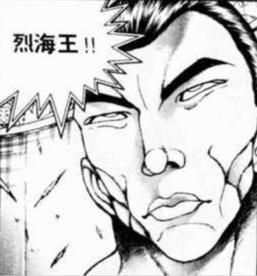

烈的恐惧【1d100：30】（90以上使用假腿）

烈：——如果您现在是要前去伤害普通的人类，那我当然会用假腿

但是在普通的战斗中使用不属于我的力量，是对对手和自己的侮辱！

来吧，伊吹萃香！

武之怀发动

萃香：那么你就瞧好了吧，这就是四天王的秘传奥义

符卡宣言 四天王奥义【三步坏废】！

烈的破解【1d100：68】（68大于75-20）判定成功！

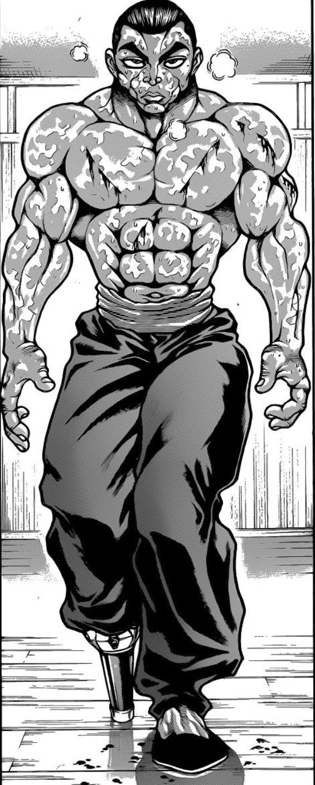

烈海王的面前，是巨大的鬼王之拳

这个时候——

无论是过去的格斗家同伴

还是现在在幻想乡的朋友们

没有一人出现在烈的脑中

他现在所想的，只是如何战胜眼前的对手

放空身体——将其交给武术

这是正面绝对无法抗衡的敌人

那就借力打力，于一瞬之间闪避后，从侧面将其破解！

“破！”

烈：我看到了，伊吹萃香，我看到你的拳了！

接下来，轮到我攻击了！

萃香的受伤【1d10：4】（武之怀发动后烈的Atk大于240，伤害不会减半）

1 回避

2 小伤害

3 小伤害

4 中伤害

5 中伤害

6 大伤害

7 大伤害

8 特大伤害

9 特大伤害

10 大成功/大失败【1d2：2】

Hp：14-2=12

T6

萃香：令人敬佩，烈海王

以如此孱弱之身，却能跟我打到这个地步——那么就用这一招了结你吧

这一次，你可没法破解了

符卡宣言 鬼符【大江山悉皆杀】！

烈：真是强大的对手——真是令人热血沸腾的战斗！

用最后一击决胜负，超人术！再加上花之射击！

超人烈海王发动

Flower Shooting发动

萃香的受伤【1+1d4：2=3】（烈的Atk大于240，不会减伤）

Hp：12-3=9

烈的攻击【189+60+650+1d100：42=941】

萃香的攻击【260+60+650+1d100：13=983】

烈的受伤【1d10：2】（鬼符【大江山悉皆杀】无法回避，此处回避选项处理为伤害/2）

1 小伤害X4/2

2 小伤害X4/2

3 小伤害X4

4 中伤害X4

5 中伤害X4

6 大伤害X4

7 大伤害X4

8 特大伤害X4

9 特大伤害X4

10 大成功/大失败【1d2：1】

Hp：1-1X4/2=0

战斗结束！

胜者 伊吹萃香！

地狱大擂台的周围爆发出了巨大的欢呼

鬼们与妖怪们，为在这场战斗中竭尽全力的两位斗士献上了他们的祝福！

伊吹萃香的好感度【1d100：60】

小小的百鬼夜行微笑着掏出酒葫芦，喝了一口酒

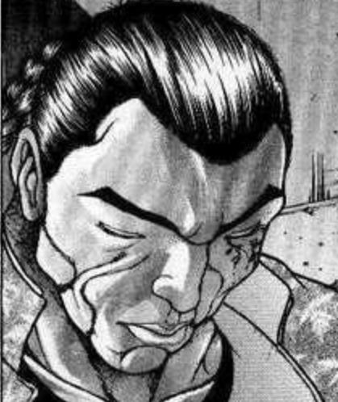

烈：这就是被鬼王击败的感觉吗……收获很大……必可活用于下一次……

拼尽了全身的力量，依然被对手以堂堂正正之势击破

烈海王心满意足地倒下了——

然后，被小小的手掌所扶住了

萃香：真是执着的家伙

以你最后的状态，使用假腿后再击中我的要害的话，就算是我也可能会输哦

烈：不可能的

您的战斗意识何其敏锐？恐怕在我使用假腿的前一瞬间，就会察觉并立刻雾化吧——那也不过是让我赢下一招而已，又有何用？

何况，面对您这样值得敬重的对手，我不能使用这样的盘外招

不知不觉间，两人的周围被鬼和妖怪们包围了

站在鬼群正中的，是原本应当上台的擂主，身穿白衣蓝裙的星熊勇仪

她是有着金色长发的高大女子，头上长着巨大的红色独角，双腕缠有断裂的锁链，手中拿着巨大的酒杯

“小的们，开宴会了！敬这位意志高洁的武人，以及我们强大的萃香！”

星熊勇仪的好感度【1d100：92】

勇仪走到烈的身旁，一把搂住了他

勇仪：好样的，原本以为只是个有点本事的武术家，这不是打的相当漂亮吗！

这是你的奖品，来自华——来自某个鬼王的药酒

不过在回去之前，先跟大家一起喝几杯吧！

烈：乐意之至

我也想尝尝看鬼族的美酒味道如何

宴会持续了【1d6：5】个小时

烈的醉意【1d100：57】（60以上喝醉）

烈：这可真是令人难忘的味道

不过我是不敢再喝了，今天如果又喝多了，师匠会真的生气的

萃香：之前一直不去宴会，结果现在你自己却喝得很享受啊

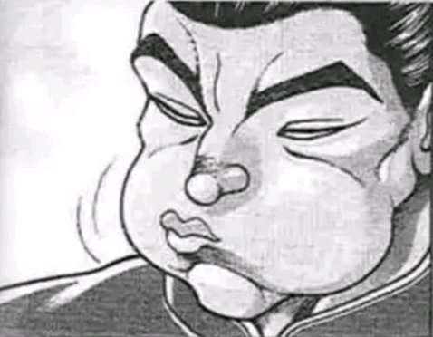

烈：哈哈，刚刚喝酒的时候我考虑了一下您说的话

打完架之后要喝酒，这不仅是鬼族的，也是幻想乡的传统吧？

入乡随俗就是如此啊

有人邀请我去宴会，那我就去

相对的，我也会邀请我的朋友一起聚会的

勇仪：要走了吗？有空再来地下玩啊，下一次跟我打一场吧

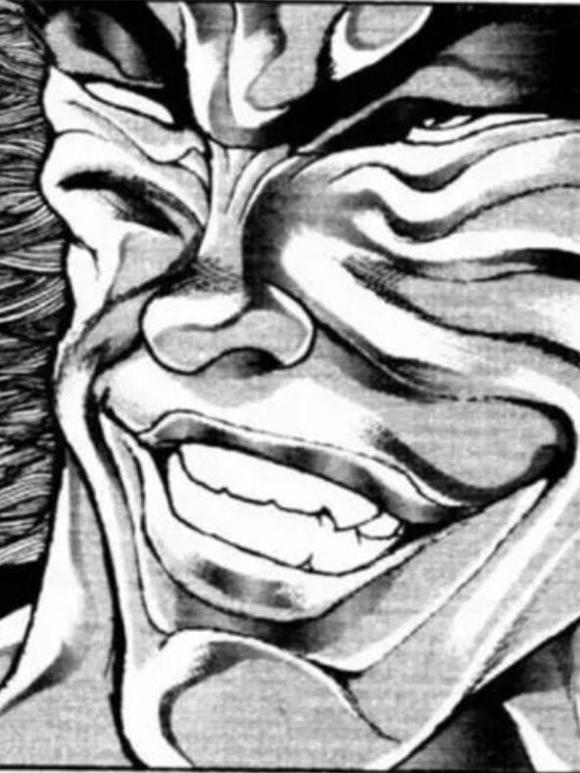

路人鬼：我们随时欢迎你来啊，烈师傅！

——烈海王回永远亭了——

回永远亭时有事发生吗？【1d100：62】（30以下有事发生）

烈海王回到了永远亭

~永远亭~

因幡帝：烈海王，你今天又去做什么了？

烈海王：去旧地狱参加大擂台赛了，跟鬼王伊吹萃香打了一架

鬼王的力量真强啊，我简直毫无还手之力（本来面对萃香应该过一个秒杀骰子的，但是大擂台赛特殊场合就没骰）

不过鬼们对我倒是非常热情，勇仪拉着我喝了5个多小时的酒才走的

因幡帝：唉……我现在已经完全懒得惊讶了

赶紧去找师匠治伤吧，跟百鬼夜行打输了还能自己走回来，看来好歹是做了点急救

又到了一天一度的烈海王讲故事时间

烈的说明【1d100：21】

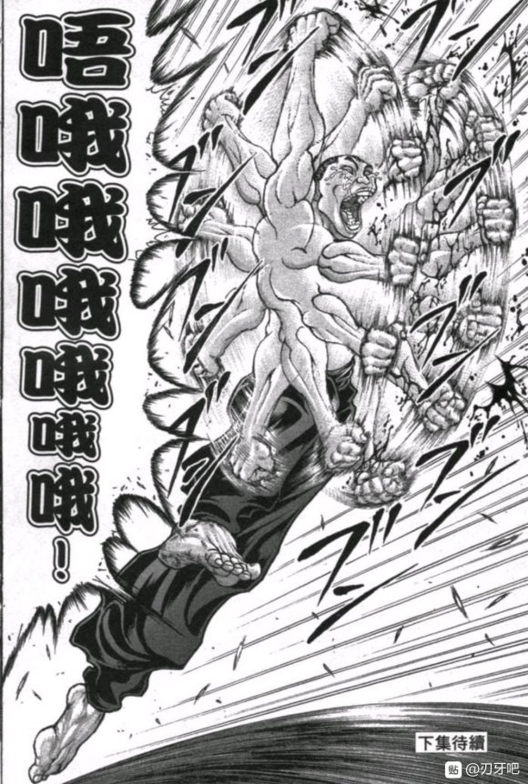

烈：噗——擂台赛 噗——鬼王 噗——

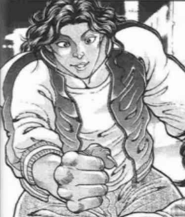

皮克这一次直接自己过去把烈的嘴堵上了

辉夜：烈海王来幻想乡已经一个多月了，到现在为止都没学会好好说话，某种意义上讲跟皮克真是半斤八两

师匠的治疗持续了【1d60：23】分钟

师匠：这一次伤的还蛮严重的，只是叫你去参加比赛，谁让你跟鬼王正面硬拼了？

铃仙：我觉得烈先生能保住一命已经很幸运了……

烈：——就是这样

旧地狱的鬼族，意外的热情好客啊

师匠：那是因为你今天虽然输了但也打的不错，并且前面的比赛都赢下来了

鬼族对于懦弱之人可是毫不留情的

辉夜：正面跟鬼王比力气，真是有创意的自杀方式

上一次去太阳花田也是这一次去旧地狱也是，烈海王每一次的尝试都失败了，真遗憾啊

皮克对地狱擂台赛的兴趣【1d100：81】

皮克下次想跟着烈一起去

烈：皮克你也想去？也是，我想那地方应该很适合你

铃仙：烈先生，虽然我说这话不太好——

因幡帝：你今天是不是忘记做晚饭了？

烈：糟糕我这就去——

烈的情商【1d100：19】

烈：对了师匠，我这次赢回来一罐鬼王的药酒，你要拿去研究不？

师匠：鬼族的药术与我不是一个路数的

你留着自己用吧，遇到危险的时候喝了说不定能救你一命呢

这一次永远亭的人们并没有散去

因为烈海王还在做迟到的晚饭呢

——第39天结束——

成就：百鬼夜行的见证者 达成！

以极大实力差面对伊吹萃香并在不使用假腿的情况下接下了其所有技能

Atk+5 未加成Atk变为110

现在的Atk：198（110）

获得了鬼王的药酒！

鬼王的药酒：战斗中使用时可让Hp回复【1+1d3】点，也可在剧情中作为礼品或急救道具使用

（本日的更新结束，下一次更新在周三）

（以下是我的废话）

那么这次的原创搞笑活动大家感觉如何呢

原 创 搞 笑 活 动

搞笑成分......在哪里啊？？？？

我骰完之后再一看发现这简直武藏战再演啊

明明之前的日常回那么轻松愉快的怎么到了活动这就拉了胯了（悲）

战斗结束之后骰萃香和勇仪的好感的时候，我直到骰完才发现忘记编个理由加点保底好感度了

结果一看，一个60一个92

娘嘞幸亏没加

要是加个10左右的保底那本贴第一个100好感怕是就要这么出现了

那么这次刚好让烈正面面对顶尖强者打了一场

大家也能发现，萃香完完全全就是烈的plus版

消力对策和时停对策对于强者们来说都是小事，atk上升技能和削血弹幕也是人手一个

在大家都有着相似效果的技能时，CT和Atk就变成了决定战斗胜负的东西

就算这么一次次+5加下去，烈想要达到跟萃香拼一拼的实力起码都要两三次异变之后了

到那个时候有这样的实力，感觉也可以接受了

最后，吧友望远镜300创作的第三集也出来了

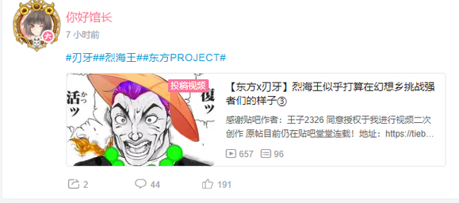

望远镜300，我的闪电侠

大家有兴趣的话就去看看吧！

最后附上大擂台的骰子

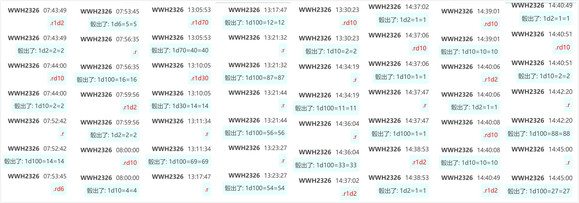

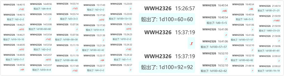

草草草，发现还有个事忘了

今天下午三点开一下新人物安价楼

还是跟上次一样，烈会在【什么地方】遇到【什么新人物】

安价的范围在【东方stg正作】以及【东方格斗作】登场的人物中，只能提一个人物

由于是新人物，现在虽然还没遇见但已经骰过好感度的角色们就不在范围内了

那么下午三点我会单开一层，在那一层回复的前十个就是本次的选项

有兴趣不妨参与一下，谢谢大家

安价楼

烈海王将在【什么地方】与【什么新人物】相遇？

请在此楼回复

再次重申一次，范围仅限于【东方stg正作】与【东方格斗作】中登场的人物，且只能提出一位新人物

本次的安价结果

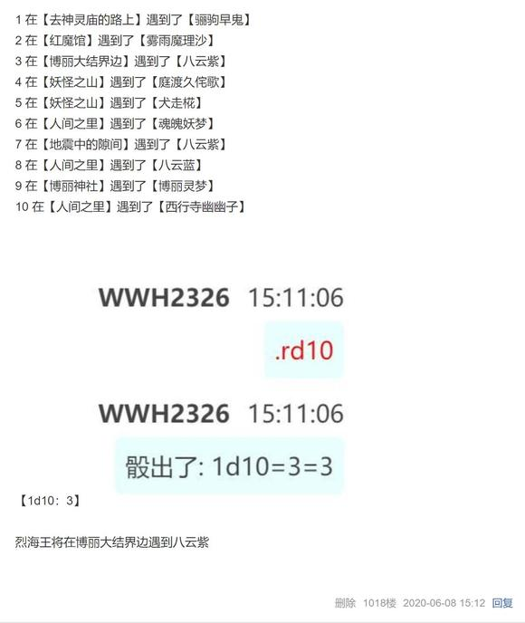

看到久侘歌，犬走椛和魔理沙这样温柔的选项真是令人松了口气——

然后剩下的选项没一个看上去安全的真可怕啊（悲）

还好现在有假腿了，怎么说跑路都是没啥问题的

顺便一提，新人物环节结束后就又到交流环节了

但是我发现现在烈认识的人有点太多了

因此交流环节的选项中就只放入【好感度60以上】且【正式见面过】的角色了

换句话说辉夜，一轮，秦心这种比较低的就不放了，莉格露，大小姐这种没正式登场过的也不放了

这在某种意义上也能减轻我的工作量，所以就打算这样了（笑）

那么周三将会更新与八云紫的相遇

该找个什么理由给烈一点保底好感呢，还是说就这样直接骰100呢

（原本的计划是明天更新新人物和交流回，但是骰完之后发现交流回太长了，全部放到明天更我早上应该顾不过来）

（因此今天晚上就先把新人物更了，明天再更交流回）

这是发生在烈海王来到幻想乡的第【39+1d30:10=49】天的事

时间来到一天前

——第48天的午饭时间——

辉夜：说起来烈海王，你是怎么来到幻想乡的？

是和皮克一样被遗忘了吗？

烈：遗忘？我想我应该不会这么快被遗忘吧

因为我来到幻想乡的时候，是刚刚结束完一场生死斗的状态

要不是神子殿下道术了得，说不定我还没见到师匠就已经死了

辉夜：听起来真是够奇怪的

一般来讲，进入幻想乡的人要么是被外界遗忘了，要么是在不知不觉间通过了大结界，即所谓神隐

像你这样在大庭广众之下消失，与其说是神隐倒不如说是结界出了问题

当然也有可能是有强者故意把你送进来了——不过我想应该没人会这么无聊吧？

烈的警觉【1d100：99大成功】

烈：这么一说真是不对劲

太奇怪了，真如辉夜小姐所说，我只是一个外界的格斗家，压根没有理由会来到这里啊

要么是单纯的意外，要么就是这件事情本身有问题

大成功的效果是【1d10：3】

1 经过调查得知了有关神隐的情报

2 在师匠处得知了八云紫的存在（好感度+10）

3 烈的警觉度提高

4 在师匠处得知了八云紫的存在（好感度+10）

5 经过调查得知了有关神隐的情报

6 明日不会独自行动

7 经过调查得知了有关神隐的情报

8 在师匠处得知了八云紫的存在（好感度+10）

9 烈的警觉度提高

10 大成功/大失败【1d2：1】

烈：往这个方向思考后总有种坐立不安的感觉……这几天还是小心一点吧

（烈海王的警觉度提高了：在本次剧情中，烈在使用假腿逃跑的情况下必定成功！）

辉夜：我看整个外界也没几个人能比你更适应这里了

这么不放心的话明天就去博丽神社拜访巫女吧

博丽神社所在的地点本身，就是外面世界和幻想乡之间的分界线上

因此灵梦的日常工作之一就是将误入幻想乡的人类送回外界，说不定会对你的情况有所了解

烈：辉夜小姐居然给我提了建议！

真是多谢您！

辉夜：可别怪我没提醒你，博丽神社周围可是妖怪的聚集地

那地方在人类间没什么人气，在妖怪中却很受欢迎的

辉夜坏笑着走了

第49日

~博丽神社前的阶梯~

烈：这可真是长啊，难怪普通人不愿意跑来这里

本来地势就偏僻，光爬台阶又是累的够呛

正当烈海王准备上楼梯的时候——

无声无息地，烈的面前出现了一条黑色的“线“

这条线的两头系着红色的蝴蝶结，其中间缓缓地拉开，露出了闪烁着无数猩红之眼的黑色空间，以及那浑身充满着不详气息的金发女子

“对你来说是初次见面吧？不必紧张，我是负责管理结界的妖怪，八云紫”

她戴着白色的蓬松帽子，身穿白裙，手握着一把阳伞，衣服的正中配有紫色的长布条状装饰物，其上绣有兑坤二卦，合为泽地萃卦

烈：！

八云紫的好感度【1d90：67+10=77】（超快速解决感情异变+5，永琳的弟子+5）

八云紫：一看到我就想逃跑，我的名气已经这么大了吗？

我对你没有恶意，烈海王——毕竟从你这段时间的表现来看，你并没有触犯这里的规矩

与此相反，在解决异变方面倒是十分积极

烈：八云女士，请您谅解

我只是下意识做出了防范罢了

八云紫：明明与幽香和永琳都常常接触，却害怕初次见面的我吗？

这可不是聪明的谎言，烈海王，你在旧地狱的朋友们面前想必是不敢这么说话的吧？

烈的愧疚【1d100：28】

烈：被您识破了，我真不该做我不擅长的事情

就像您所说的，我所害怕的不是强大的陌生妖怪

而是她有可能与我来到幻想乡有关的这个猜想

八云紫：这么说，你在怀疑我咯？

烈：如果昨天中午的时候辉夜小姐没有与我聊起这件事情，我想我可能很长一段时间内都不会来到这个偏僻的神社

然而我今天刚到这里，甚至还没登上台阶，我的面前就出现了一个态度未知的强大妖怪

她与我只是第一次见面，说话的口气却像是对我十分了解

这不得不让我心中有所顾虑

只是选择撒谎的方式保护自身，确实为人不齿

在此向您道歉

八云紫：人在妖怪的面前想要保护自己，这是无可厚非的事情，我自然不会在意

说回你自己吧，烈海王，你来到博丽神社是想要做什么呢？

烈的选择【1d10：3】

1 询问博丽巫女

2 调查博丽大结界

3 对外界的好奇

4 调查神隐

5 询问博丽巫女

6 对外界的好奇

7 调查神隐

8 厨艺交流（为啥啊）

9 询问博丽巫女

10 大成功/大失败【1d2：2】

烈：昨日聊起这件事之后，我的心里就很是好奇

不光是我来到幻想乡的原因，更重要的是外界现在的情况

是否有人击败了武藏？又是否有人如我一样再次倒在了他的刀下？

我的朋友们又是如何？

刃牙应该会去挑战武藏吧，克巳的独臂空手道练成了吗？

我的师傅现在又怎么样了？

在我离开外界已久的当下，是否有人还记得我？

烈：请原谅我的失态，八云女士

我只是抑制不住自己的好奇与怀念，并没有要强行去往外界的意思

八云紫：结果比起自己过来的原因，你却更看重外界的情况吗？

这倒是连我都没有想到

烈的察觉【1d100：37】

烈：我有太多想知道的事情了——不知道博丽的巫女能否解答我的疑问

八云紫：灵梦才不知道外界的事情

就算你问她你本身来到幻想乡的原因，我想她也很难迅速给你答复吧

因为管理这一块的妖怪，其实是我啊

烈的推理【1d70：65+30=95】

烈：（游刃有余的态度，似曾相识的名字，奇妙的空间能力，与博丽的巫女很熟且掌握了结界————）

八云女士，是我失礼了

我没有想到您居然正是妖怪贤者，幻想乡的建立者之一

八云紫：现在终于反应过来了？

之前感情异变的时候也是，明明推理能力很强却总是在前面细枝末节的地方犯错误，我想月之头脑都会因此而头疼吧

八云紫：你想知道的是外界的情况吧？

我的确能够告诉你相关的信息，不过这是有代价的，换句话说，这是一笔交易

你愿意接受吗，烈海王？

烈海王的选择是【1d10：5】

1 立刻接受（我无所谓）

2 先听听条件

3 我先自己推理一下

4 立刻接受（我无所谓）

5 先听听条件

6 我先自己推理一下

7 我先请您吃点东西吧（为啥啊）

8 我先推理一下条件

9 立刻接受（我无所谓）

10 大成功/大失败【1d2：2】

烈：我需要先听听看您的条件

如果您想让我做些我无法做到的事情，我也无奈只能放弃

八云紫的条件是【1d10:5】

1 解决一些小事情（原创剧情）

2 帮忙解决异变

3 想吃点心（为啥啊）

4 帮忙解决异变

5 解决一些小事情（原创剧情）

6 帮忙解决异变

7 地底与外界的沟通

8 帮忙解决异变

9 解决一些小事情（原创剧情）

10 大成功/大失败【1d2：2】

八云紫：对你而言只是些非常容易的小事情罢了

不过呢，我却是不太方便亲自去做

毕竟很多人对我都有着奇怪的误解，总是觉得我整天都在策划阴谋诡计一样

烈：（你看上去的确就是这么个形象……）

八云紫的委托是【1d10：6】

1 关于幽香

2 关于永琳

3 关于勇仪

4 关于萃香

5 关于人间之里

6 关于幽香

7 关于人间之里

8 关于古明地恋（为啥啊）

9 关于永琳

10 大成功/大失败【1d2：1】

八云紫：你跟幽香很熟吧

那么，能否让她帮我个忙呢？

烈：八云女士，我不能为了自己的事情而去麻烦朋友——

八云紫：先听我说完

最近有位马虎的仙人在进出幻想乡的时候没有做好防护措施，将一些外界的花粉和植物种子之类的东西带进来了

我已经去做过一次清理了，不过难免有些许遗留下来

外来物种入侵可是很麻烦的事情

只是需要你去传个话而已，实质上是我对她的委托

烈的生物学【1d100：19】

烈：我不懂这些，但如果只是去收集一点花粉和种子，我想幽香女士是不会拒绝的

八云紫：这样就万无一失了

接下来就让你看看外界的状况吧

烈海王看到了什么？【1d10:8】

1 我要守护大家！

2 侠客行……是否仍然坚挺？

3 毕竟我的弟子刚刚去世

4 烈海王是我的朋友

5 我要守护大家！

6 侠客行……是否仍然坚挺？

7 我要守护大家！

8 侠客行……是否仍然坚挺？

9 夺命之吻

10 大成功/大失败【1d2：2】

烈海王的面前，那密布着赤色眼瞳的不详空间又一次张开了

出现在他面前的是那位他十分熟悉的恶霸 花山熏

（此处的烈虽然进入幻想乡了，但在大家的认知内仍然是死了——只是一段时间后遗体消失了）

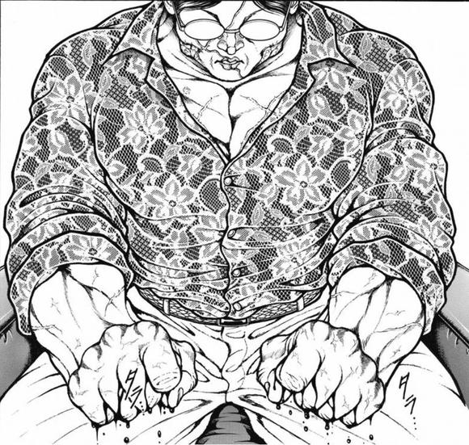

烈海王看到的画面，从花山因他的死讯而握拳开始

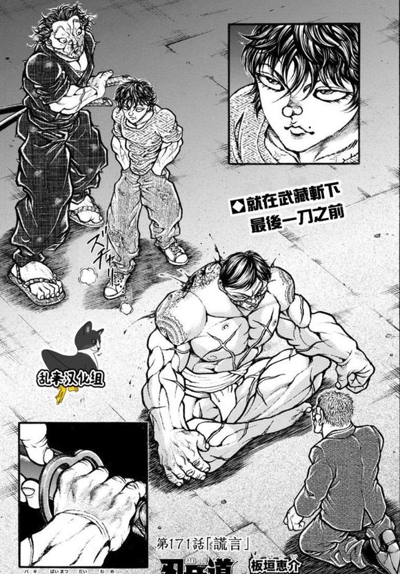

直到花山最终倒下，武藏被刃牙所阻止，他眼前的隙间才缓缓合上

八云紫：这就是你离去后的一段故事了

有何感想？

烈：花山没死真是太好了

他会因我的死而愤怒——我很感激

八云紫：没了吗？

烈：没有了……无论对于武藏还是花山，这都是他们自己的战斗

我只能旁观，而不能参与

