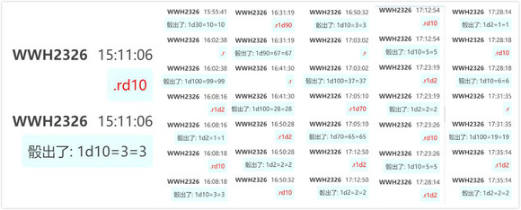
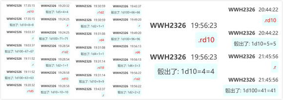
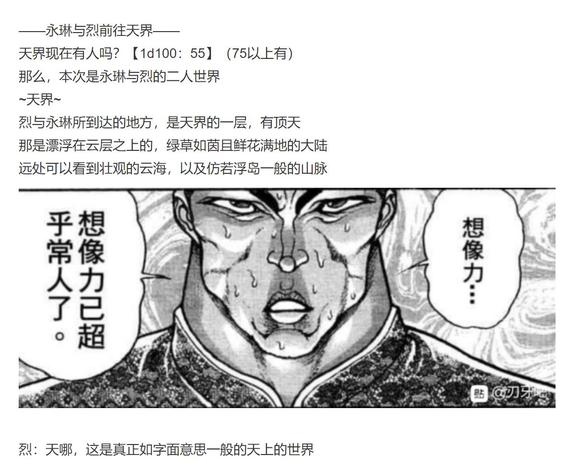
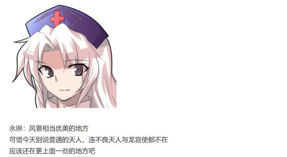
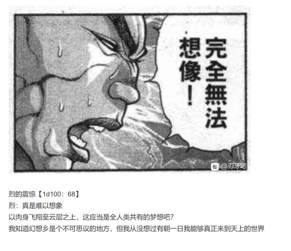

八云紫：格斗家们的思维，某种程度上和巫女还蛮像的

继续保持你那副无所谓的态度吧，烈海王——这是你在这片大地上生存至今的最大依仗了

顺便一提，今后我可能会继续找你帮些忙

都是些不值一提的小事而已，相对的我也会给出报酬，如何？

烈的情商【1d100：67】（大于60好感度上升1d5）

烈：八云女士，我想您所谓的帮忙并不是为了您的一己私欲，而是为了整个幻想乡的平衡做的调整

摩顶放踵而利天下，我自当为之

换句话说，我并不需要报酬，您只需吩咐即可

八云紫：要是灵梦能像你一样积极该多好呢~

那家伙每次都是，在解决异变的时候特别积极，帮我做点小事却懒得动弹

八云紫的好感度增加了【1d5：4】

八云紫的好感度变为81点了

“记得帮我向幽香传话哦”

暗色的隙间无声地在妖怪的身后张开

幻想乡的贤者微微一笑，便消失在这诡异的空间之中

烈：强者见得多了，倒是没有第一次见到幽香女士那般不堪了

但还是会感到一丝寒意——

是由于实力的差距，还是单纯只是因为，面前的妖怪本身过于恐怖？

烈海王摇了摇头，转头前往太阳花田

在他的身后，一块小小的黑暗中正有红色的眼睛注视着他……

~太阳花田~

太阳花田除了幽香还有其他人在吗？【1d100：71】（80以上有）

今天的幽香也是独自一人

烈：幽香女士，我前来拜访了！

烈今天带的甜品是【1d10：10】

1 红豆沙（加莲子）

2 绿豆沙（加海带）

3 巧克力熔岩蛋糕（配饼干条）

4 刚烤好的布丁（抹茶，香草，原味，红茶四种口味）

5 热苹果派（配奶茶）

6 热豆腐花（配蜂蜜与花生碎）

7 流心芝士挞（巧克力夹心）

8 奶黄包与叉烧包（配红茶）

9 热双皮奶（配草莓，芒果与红豆）

10 大成功/大失败【1d2：1】

烈：今天上午时间还蛮多的，在人里借了厨房之后突然找回了上次的手感，无论是数量还是质量都是超水平发挥！

幽香：这可真是不错~

大成功是什么？【1d10：9】

1 幽香好感度增加【1d10】

2 深受感动的幽香拿出了迷藏的葵花籽

3 深受感动的幽香决定再教烈两招（为啥啊）

4 幽香好感度增加【1d10】

5 【1d4：1】

6深受感动的幽香拿出了迷藏的葵花籽

7幽香好感度增加【1d10】

8 随机两项

9 深受感动的幽香拿出了迷藏的葵花籽

10 大成功/大失败【1d2：1】

幽香：那么我也送你点东西吧

这是蕴含妖力的葵花籽，吃了之后可以增强体魄

烈：那谢谢您了！

幽香：现在变得这么大方了？

以前的时候你可是会拼命拒绝的

烈：之前被白莲师傅提醒过一次，然后前两天又被鬼族的朋友指责了

对他人的好意过于谦让，反而是对朋友的不尊重啊

幽香：啧啧啧，随着实力的提升脸皮也变厚了

倒是和那帮子整天到处打弹幕的家伙越来越像了

烈：对了，说起来——

烈的说明【1d100：66】

烈：八云女士想让您帮她一次，就叫我过来传个话

幽香：那个离了式神之后自己什么都不会干的家伙……

我之后会去走一趟的

烈：幽香女士您明明脾气很好的，有什么必要让我来传话吗？

幽香：嗯——毕竟紫亲自过来的话，我会有点想动手的

说起来烈海王，你的实力也提升的蛮快的？

烈的恐惧【1d100：96大成功】（30以下直接激怒幽香触发战斗）

大成功的效果是什么？【1d10:4】

1 烈海王在恐惧压迫下情商暴涨的吹捧！好感度增加【1d10】

2 在恐惧压迫下情商本身暴涨！与情商有关的骰子固定值+10

3 幽香：我看你还是太弱，就再教教你吧（花之射击升级）

4 烈海王在恐惧压迫下情商暴涨的吹捧！好感度增加【1d10】

5 在恐惧压迫下情商本身暴涨！与情商有关的骰子固定值+10

6 在恐惧压迫下武术境界提升了！武之怀效果上升

7 【1d6：3】

8 烈海王在恐惧压迫下情商暴涨的吹捧！好感度增加【1d10】

9 在恐惧压迫下情商本身暴涨！与情商有关的骰子固定值+10

10 大成功/大失败【1d2：1】

烈：是啊，说不定有一天我也能够达到幽香女士您所在的境界

不，我一定会努力追上您的！

幽香：不害怕吗？

烈：说实话我怕的腿都在抖

但是在我弱小的时候，您并未伤害我

那么有朝一日我变得真正强大之时，您也绝不会攻击我

我是这么坚信着的

幽香：呼呼，我自己可没有这种信心哦

好感度上升【1d10：5】

幽香好感度变为95

——烈与幽香享用了甜品——

烈海王服用了幽香赠与的葵花籽

Atk+3 未加成Atk变为113

Atk：203（113）

烈海王离开了太阳花田

烈：娘嘞……吓死我了……

上一次是厨艺在压迫下进步了，这一次是话术在压迫下进步了

再来几次估计我的心脏就该受不了了

八云紫：跟幽香关系真好啊~

一道隙间突然从烈海王面前打开，金发的妖怪倒立着从里面探出了头

烈的惊吓【1d100：41】

烈：八云女士，请您别吓我

要不是刚被吓了一次大的，现在我怕是真要犯心脏病了

八云紫：之后还会来找你帮忙的哦

报酬是你自己说不要的，我就看情况给了~

神隐的主犯消失了

烈海王踏上了回永远亭的路

~永远亭~

辉夜：所以你整明白你是怎么来幻想乡的了吗？

烈：——我忘了问了

辉夜：永琳！永琳！

下次记得给烈海王上文法课或者语文课！他这脑子没救了！

~第49天结束~

（本日的更新结束）

（以下是我的废话）

与八云紫的接触很正常，真好啊

情商骰子本来应该是75或者80过了才给加好感度，但是考虑到烈第一次骰出了这么高的情商，就仅限一次把标准降低了

然后，那个甜品骰子完完全全是我拿来放松气氛的骰子，因为我当时也很想吃甜品

结果怎么还能把上一次的剧情复刻一遍？？？？？

我寻思这么整下去不行了，就给烈过了一个三分之一概率挨揍的骰子

结果恐惧大成功了，怎么每次遇见幽香都能整出这种事

还好好感度只加了5，这要是加6恋人骰又过了，烈的热狗怕是要保不住了

那么明天会更新交流回，骰子下一楼发

吧友 @望远镜300  制作的视频第四话也更新了！大家有兴趣的话就去看看吧！

~交流回~

上一次骰出了三十天的时间，这一次我想了一下，也用三十天感觉不错

毕竟如果骰子出了1那就是一周两次异变的高强度战斗，怎么说也和幻想乡的风格太不搭了（笑）

当然还是和之前一样，本次安价出现的新人物不列入交流回中

另外一件事情就是，现在烈认识的人太多了

如果一个个列出来怕是要骰1d20左右的数值，怎么想都觉得过头了

因此交流回的骰子里只会出现好感度大于60的人物

换句话说秦心，辉夜，一轮这些低好感的就不会让烈过去自讨没趣了

那么目前好感度大于60的角色是（未登场角色如莉格露不算，已经骰了但剧情里没和烈正式见面的如蕾米莉亚不算）

1 师匠 98

2 铃仙 84

3 因幡帝 81

4 皮克 100

5 神子 69

6 圣白莲 65

7 红美铃 80

8 芙兰朵露 96

9 风见幽香 95

11 十六夜咲夜 71

12 伊吹萃香 60

13 星熊勇仪 92

第一位【1d13：12】伊吹萃香

1 师匠 98

2 铃仙 84

3 因幡帝 81

4 皮克 100

5 神子 69

6 圣白莲 65

7 红美铃 80

8 芙兰朵露 96

9 风见幽香 95

11 十六夜咲夜 71

12 星熊勇仪 92

第二位 【1d12:12】 星熊勇仪

1 师匠 98

2 铃仙 84

3 因幡帝 81

4 皮克 100

5 神子 69

6 圣白莲 65

7 红美铃 80

8 芙兰朵露 96

9 风见幽香 95

11 十六夜咲夜 71

第三位【1d11：1】 八意永琳

首先是第一位 伊吹萃香

这是发生在烈海王来到幻想乡的第【39+1d30：8=47】天（出49重骰）的事

~永远亭~

烈海王躲过了天狗的报纸，结束了晨练并做完早饭之后，陷入了短暂的迷茫

烈：今天该做什么呢

萃香：这么无聊的话，就来陪鬼玩啊

神不知鬼不觉地出现在烈海王面前的，正是一脸醉意的鬼王，伊吹萃香

烈的震惊【1d100：86】

烈：哇！

是萃香小姐啊，吓死我了

萃香：哈哈哈，被打的快死的时候都没有害怕过，一出门遇到鬼反而会害怕？

烈：倒不是怕鬼……主要是一个人突然出现在我的面前我却丝毫没有察觉，这真的挺恐怖的

烈的话题【1d10：6】

1 关于萃香的能力

2 关于萃香的酒葫芦

3 关于鬼

4 关于提供药酒的鬼王

5 关于对我的了解

6 关于萃香的能力

7 关于提供药酒的鬼王

8 关于萃香的能力

9 关于对我的了解

10 大成功/大失败【1d2：2】

烈：萃香小姐，我一直很好奇您的能力

烈海王的推理【1d70：5+30=35】（名侦探烈海王+30）

烈：我尝试做过推理，但只得到了“可以雾化来消除伤害”“能够在各种地方神出鬼没”“能够自由的将自己或其他物体变大变小”这些表面的表现

但是能力的本质却一点都想不到

萃香：我的能力其实是能够让人们去开宴会的能力呀~

烈的相信【1d100：87】

烈：什么！原来您的能力只是这种效果，这么说这些事迹实际上是来自于您所修习的法术吗？！

没想到鬼族的法术，竟然如此精深

萃香：不，你为什么会对他人的话语这么相信啊？之前听猯藏扯谎的时候也是，毫不犹豫就相信了哦

而且最厉害的是听完之后还能自己立马脑补出一套说得通的逻辑，我现在突然很明白为什么永琳会头疼了

烈：这么说我理解错误了？

萃香：这个吗~要不你自己体验一下吧？

萃香的行动【1d10：8】

1 把烈海王变大

2 把烈海王变小

3 把酒葫芦变大

4 去萃集人心

5 把烈海王变大

6 把烈海王变小

7 自身雾化

8 把烈海王变大

9 把烈海王变小

10 大成功/大失败【1d2：1】

烈海王变大了！

萃香：那么，现在有没有想到什么？

烈的推理【1d55：13+45:58】（名侦探烈海王+30，亲身体验+15）

烈：我能想到的大概是，控制物体大小程度的能力？

雾化的原理是把构成自身的物质间距变大了

让大家开宴会是因为放大了人们对于开宴会的欲望吗？

萃香：大方向正确吧

实际上是控制疏密程度的能力

让大家愿意开宴会，其实是萃集了人心的效果

烈：真是相当精妙的能力

您的情报也相当精准，这是由于

烈的推断【1d10:9】

1 雾化从而无处不在

2 鬼族的情报网

3 跟，跟踪狂？

4 雾化从而无处不在

5 拥有强大的情报来源

6 鬼族的情报网

7 雾化从而无处不在

8 拥有强大的情报来源

9 雾化从而无处不在

10 大成功/大失败【1d2：1】

烈：我明白了，让自己成为雾状之后，就几乎可以做到无处不在了

初次见面的时候说出那样的话，是因为早就见过我很多次了吧

萃香：幻想乡中可没有能瞒过我的秘密啊~

要来一杯吗？

萃香摇了摇酒葫芦

烈：就一两杯应该没啥事

那就麻烦您了！我去做点下酒菜

想吃点什么？

萃香的点菜【1d10:8】

1 卤牛肉

2 花生米

3 咸菜

4 炸豆腐

5 肉串

6 抹茶冰激凌（为啥啊）

7 豆子

8 直接喝

9 巧克力戚风蛋糕（为啥啊）

10 大成功/大失败【1d2：2】

萃香：直接喝就可以了！

烈：那样反而容易喝多吧……

两人喝了【1d3：2】小时

烈的醉意【1d100:19】

萃香：酒量变好了？

烈：前两天喝多过一次之后遇到了相当可怕的事情

说实话这辈子都不想遇到第二次了

小小的鬼王摇着酒葫芦离去了

烈海王看着面前的一大坛子酒，思考着该如何处理

最后的结果是，永远亭今晚吃醉鸡

~第47天结束~

进行了一次愉快的谈话！

萃香的好感度上升了【1d10：6】点

萃香的好感度变为66

第二位 星熊勇仪

这是发生在烈海王来到幻想乡的第【39+1d30：18=57】天的事

具体的事件是【1d10：9】

1 烈去旧地狱喝酒

2 勇仪来地上找烈了

3 烈去旧地狱泡温泉（为啥啊）

4 烈：今天让你们见识一下我的厨艺

5 烈去旧地狱喝酒

6 勇仪来地上找烈了

7 烈去旧地狱喝酒

8 烈：今天让你们见识一下我的厨艺

9 烈：今天让你们见识一下我的厨艺

10 大成功/大失败【1d2：1】

~旧地狱的街道~

勇仪：哟，烈！今天怎么带了这么多东西？

烈：次次过来都白吃白喝，未免太过厚颜无耻了

今天让你们看看我的厨艺

勇仪：小的们听见了吗？今天烈海王请吃饭！

路人鬼：烈师傅还会做饭的？

烈的厨艺【1d50：33+50=83】

烈：毕竟不是正餐，就只做了点下酒菜

花生米、毛豆、大拌菜，然后烤了点羊肉串跟鸡翅

炸了一些鸡软骨，还有必不可缺的卤牛肉

都是我家乡特色菜，大家尝尝吧

勇仪：这量已经比正餐还多了吧？

旧地狱的街道上，恶鬼们和武术家正开着欢乐的酒宴

烈的话题【1d10:7】

1 关于勇仪的能力

2 关于旧地狱

3 关于鬼

4 关于温泉（为啥啦）

5 关于某位不愿意透露姓名的鬼王

6 关于旧地狱

7 关于鬼

8 关于勇仪的审美观（为啥啦）

9 关于某位不愿意透露姓名的鬼王

10 大成功/大失败【1d2：2】

烈：勇仪，我一直很好奇

为什么你们鬼族要跑到地下？

倒不是说地下的生活不愉快，只是地上的空间更加广阔吧？

勇仪：你无法理解吗？

那么我反问你一句，烈

你认为你与我们的相处是否愉快？

烈：那自然是十分的快乐啊

能够找到强大的对手，能够遇到可以畅谈的朋友——

这对任何人来说都是梦寐以求的

勇仪：哈！鬼也是这么想的

可惜的是，大部分的人的想法却恰恰相反

勇仪：面对强大的异族，心怀畏惧自然情有可原

但真正的勇敢者即使手无缚鸡之力，也能展现出他的意志与勇气

而软弱者就算手握利刃，却也不敢正面对敌，而是选择谎言与蒙蔽

地上的欺骗行为实在是令鬼不齿

正巧有了旧地狱这么一片空地，我们就顺带着下来了

烈：这么说，鬼所看重的不是单纯的力量，而是更偏向精神面的强大？

勇仪：不，单纯的弱鸡照样会被我们耻笑

但是如果一个脆弱的人拼尽全力向鬼挑战，哪怕被揍的只剩一口气了还要爬起来战斗

那么我们也会持有对应的敬意

烈：这倒是与我以前所处的环境截然不同

格斗家们各自都有着对于强大的独特理解，但是共同的一点就是对于胜利的执着

最基本的踢裆插眼自不必说，偷袭与追击更是家常便饭

战斗前的挑衅，心理战，盘外招，甚至直接用武器或者把自己的肉体改造成兵器——

只要能赢干什么都行，干什么都对！

勇仪：——烈，以你的性格你之前怕是也过得很辛苦吧？

烈的辛苦【1d100：14】

烈：不会啊，其实我自己也用过戳肚脐这种招式，然后被愤怒的刃牙暴打了

毕竟真正的强者们基本不吃这一套——除了武藏好像被踢过裆

武藏虽说各种各样的阴招用的也多，但他真正能打赢我还是靠的自己的剑术

归根到底，到了最后还是得靠自己的肉体与技术决胜负

勇仪：哈，说的没错

真正的强者是不吃这一套的！

酒宴持续了【1d6:6】小时

烈的醉意：【1d100：87】（60以上喝醉）

烈：我还能喝……

勇仪：呀，今天不小心灌多了

把他送回地上吧

格斗家被高大的鬼王扛在肩上，口中还在喃喃自语着什么……

与星熊勇仪进行了一次愉快的谈话！

好感度增加【1d3：2】

星熊勇仪的好感度变为94

~第57天结束~

第三位 八意永琳

这件事发生在烈海王来到幻想乡的第【39+1d10：22=61】天

师匠来找烈做什么？【1d10：8】

1 语文补习

2 医术教习

3 约会（这么急？）

4 语文补习

6 战斗训练

7 抗压训练

8 语文补习

9 约会（这么急？）

10 大成功/大失败【1d2：1】

烈：师匠，今日是技术学习还是抗压训练？

师匠：都不是

烈啊，你在战斗方面毫无疑问是个天才

但是你的话术和情商，只能用惨剧来形容了

烈的困惑【1d100：68】

烈：师匠你在说什么？我日常与人交流没什么问题啊？

无论是跟幽香女士还是旧地狱的鬼族们，我聊的都很开心的

甚至连那位妖怪贤者我都能够做到正常的交流啊

师匠：你的聊天对象本身就已经够奇怪了

能和这些人愉快的谈话就代表着你跟普通人压根没有办法好好交流啊

烈：师匠，我现在不就在跟你好好讲话？

师匠：唉这孩子……

你也不想想，每一次你回来讲话基本上都是吐血吐到话都说不清楚，首先这个说话的场合你就把握不好

等到治疗结束之后居然需要皮克帮你翻译一遍，我再在旁边加注释大家才能听懂

换句话说，你的语文功底连原始人都不如啊！

烈的羞愧【1d100：49】

烈：师匠，话虽如此，皮克他本来就很聪明啊

我以前大部分时间都在习武，文化课确实落下很多

皮克是在您这里补习过的，他的表达能力比我强，也是理所应当的吧

师匠的愤怒【1d100：54】

师匠：呼——不管怎么说，今天这个课你上定了

今天的所有活动都给我停

通过这次的补习，怎么说都要让你达到能正常交流的水平

烈：（为啥啊？）

师匠的选择是【1d10:3】

1 题海战术！

2 通过日常对话提升话术

3 通过约会活动提升情商（恋慕成功所需值-20）

4 题海战术！

5 通过社交活动提升情商（随机活动）

6 题海战术

7 通过约会活动提升情商（恋慕成功所需值-20）

8 通过日常对话提升话术

9 学习我的一言一行

10 大成功/大失败【1d2：2】

师匠：（仔细一想是个好机会啊）

正好我最近也想放松一下，你就跟我出趟门吧

多见识一下普通***常生活，看看大家平时是怎么讲话的，对你的语言能力提高应该是有好处的

烈：可是师匠我已经看过很多次了——

师匠：出发了！

约会地点是【1d10：10】

1 安定的人间之里（恋慕成功所需值-5）

2 幽静的魔法森林

3 安定的人间之里（恋慕成功所需值-5）

4 月之都（为啥啊）（需要先过一个战斗判定）

5 雾之湖湖畔

6 妖怪之山

7 安定的人间之里（恋慕成功所需值-5）

8 天界！（为啥啊）（恋慕成功所需值-10）

9 安定的人间之里（恋慕成功所需值-5）

10 大成功/大失败【1d2：2】

师匠大失败！

大失败的约会地点是【1d10：10】

1 风景优美的三途河（恋慕成功所需值+5）

2 地杰人灵的 畜 生 界（恋慕成功所需值+15）

3 神秘而优雅的隙间（恋慕成功所需值+20）

4 怨灵聚集的地灵殿温泉

5 舒爽的地底核熔炉（恋慕成功所需值+15）

6 风景优美的三途河（恋慕成功所需值+5）

7 地杰人灵的 畜 生界（恋慕成功所需值+15）

8 樱花盛开的冥界

9 舒爽的地底核熔炉（恋慕成功所需值+15）

10 大成功/大失败【1d2:1】

师匠大成功！

回到原本的十个选项再来一遍

约会地点是【1d10：8】

1 安定的人间之里（恋慕成功所需值-5）

2 幽静的魔法森林

3 安定的人间之里（恋慕成功所需值-5）

4 月之都（为啥啊）（需要先过一个战斗判定）

5 雾之湖湖畔

6 妖怪之山

7 安定的人间之里（恋慕成功所需值-5）

8 天界！（为啥啊）（恋慕成功所需值-10）

9 安定的人间之里（恋慕成功所需值-5）

10 大成功/大失败【1d2：2】

师匠：那么今天就去天界吧

看看天人们那悠然的生活，对你语文功底的提升想必是有好处的

烈：前半句与后半句之间有关系吗？有关系吗？

永琳：天人们天天就过着这样的生活啊

月之民们则住在更遥远的星球之外了

烈：月球上的居民们，会站在荒凉的环形山上看着地球吗？

永琳：不会哦

你所看到的月球并不是它真正的模样，那只是存在于结界之外的表象罢了

结界的内部，真正的月球是有着大海与都市的美丽星球

而月之民们则居住在这颗月亮的里侧

那里的风景比起天上，也毫不逊色啊

所以月亮上的人们不会来到结界之外

他们只需待在自己的城市内，就可以看到这颗对于他们来说污秽而又美丽的星球了

烈的感触【1d100：15】

烈：师匠，天人很强吗？月之民又如何？

永琳：唉，我不该指望你会有什么感悟的

能不能跟他们打架才是你最关心的吧？

烈：毕竟我只是个武术家

每个人每天所看到的风景都是不一样的，天人与月人所看到的，以我所见与我跟师匠所看到的并没有什么本质上的差异

云层上和月亮上的风景很美，但竹林里的景色也不差

永琳：你无所谓，对吗？

烈：当然，我无所谓

永琳：哈哈哈哈

感觉自己真的像个笨蛋一样

弟子自己都觉得无所谓了，我又有什么必要让他去学那些对他无用的东西呢？

以后不会再给你补习什么语文或者文法了，烈——你这样就很好

我希望你能一直这么下去

烈的恋情【1d100：60】（原成功值90，两人约会-20，天界-10，现成功值60）判定通过

烈海王看着他面前的银发女子

她站在浮空的大陆之上，身后是湛蓝的天空与一望无垠的云海

但他并不关心这些——他只是想要多看看这美丽的笑容，哪怕只是多一瞬间

在这一刻，这个脑袋像黑曜石一样的武术家清楚地认识到

他恋爱了

