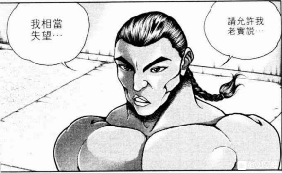
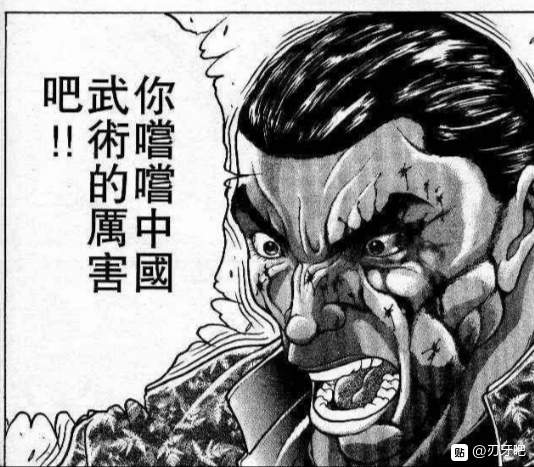
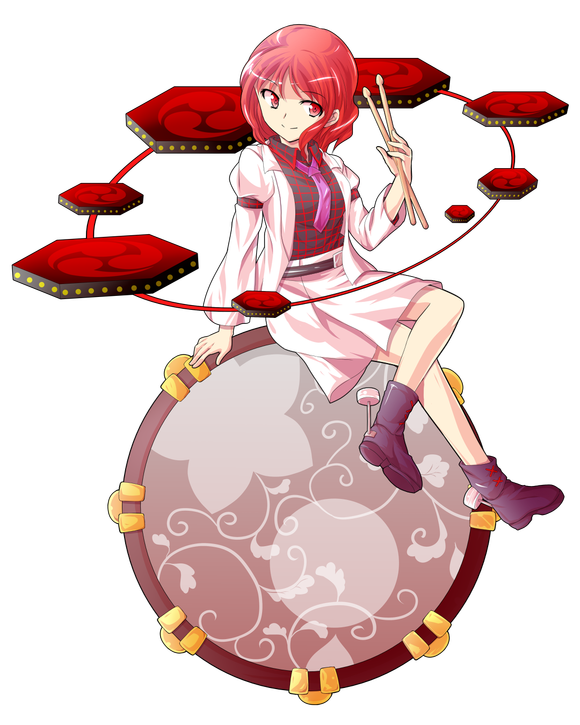

烈：没错，力量变强了

有某个势力或者某个强者将力量分给了幻想乡内的弱者

而他们的动机是【1d10:7】

1 颠覆强弱

2 破坏平衡

3 毫无头绪（过一个直觉）

4 颠覆强弱

5 单纯的取乐

6 破坏平衡

7 毫无头绪（过一个直觉）

8 制造新的付丧神

9 制造新的付丧神

10 大成功/大失败【1d2：2】

烈：毫无头绪，想不到做出这种事情的原因

尝试一下我的直觉吧

烈的直觉【1d100：55】

烈：我能想到的可能性是，制造新的付丧神或者借此破坏幻想乡的平衡

发起弱者的逆反，又或者只是强者们单纯的取乐——

无论哪一个都是可行性很高的选项，难以做出决断

你怎么看，咲夜小姐？

咲夜的判断【1d10:6】

1 去问问大小姐吧

2 付丧神

3 逆反

4 去问问帕秋莉大人吧

5 付丧神

6 破坏平衡

7 付丧神

8 去问问二小姐吧（为啥啦）

9 没有头绪（过一个直觉）

10 大成功/大失败【1d2：2】

咲夜：我想他们的目的很有可能是破坏幻想乡的平衡

弱小的妖怪与道具们拥有力量之后，最基本的实力平衡就会被打破

实际上，现在一个早上就已经出现了两起妖怪袭击事件了

这种情况持续下去，我们自然不会有事，但对于人里的居民来说麻烦可就大了

烈的行动是【1d10：2】

1 研究假腿

2 收集情报

3 听从假腿的指引（为啥啦）

4 收集情报

5 问问师匠吧

6 问问白莲师傅吧

7 收集情报

8 研究假腿

9 问问神子殿下吧

10 大成功/大失败【1d2：2】

烈：现在下结论也确实为时过早了

我想我需要做进一步的情报收集

咲夜小姐，你呢？

咲夜：我也需要再观察几天，如果真是异变就解决掉它

毕竟异变已经出现在家门口了，拖久了不处理，大小姐肯定会生气的

烈：那么我先在此告辞了

烈海王离去了

红美铃：咲夜，你跟烈到底在讲什么？

我一句都没听懂耶，道具变强了不是好事情吗

咲夜：在说你今天没有午饭吃的事情

红美铃：咲夜小姐！至少给我一个三明治！

咲夜：要牛肉的还是鸡肉的？

红美铃：想吃炸鸡馅的，谢谢

（歇一阵继续）

烈回永远亭的路上有事发生吗？【1d100：97大成功】

大成功！

大成功的效果是【1d10：3】

1 八云紫的委托

2 萃香的提醒

3 鬼人正邪来了

4 八云紫的委托

5 幽香的提醒（为啥啊）

6 勇仪的提醒（为啥啊）

7 少名针妙丸来了

8 八云紫的委托

9 雾雨魔理沙的同行

10 大成功/大失败【1d2：2】

烈海王正走在回永远亭的路上

然而就在此时——他面前的世界突然颠倒了

上变成了下，左变成了右，仿佛进入了镜面一般，整个世界变得与之前截然相反

烈：哦？这是将世界颠倒的能力？还是将事物反转的能力？

真是有趣，可惜——我们在四千年前就已经克服这障碍了！

？？？：你这样的人类，为何会步入对这件事情的调查

这不是你应当插手的事情，速速离去

在这颠倒的世界中出现的，是脸上带着坏笑的少女

她头上长着小小的双角，黑色的发丝中夹杂着红白的挑染，身穿有红黑二色箭头装饰的白色衣物，脚上不知为何踩着拖鞋

其真身正是本次异变的真正黑幕，逆袭的天邪鬼，鬼人正邪

鬼人正邪的好感度【1d50：41+50=91】（大成功+50）

正邪：我是本次异变的策划者，天邪鬼 鬼人正邪

正如你的推测一样，我们此次的目的便是让幻想乡的格局真正的变化

而这与你的生活并无关系

明白的话就赶快回归日常吧——我们将会创造一个，对于人类更为友好的世界

烈：正邪小姐，恕我冒昧

你们为何突然就要做出这样的事情？

以我所见，幻想乡妖怪遍地，但总体而言还算和平

人里的人类虽然弱小，但也有博丽的巫女护佑

不仅如此，妖怪贤者们也积极维护着整个幻想乡的稳定

我看不到令你一定要做出如此举动的理由

正邪：哈！我想你的身后要么是有着大势力的支持，要么是你自身拥有着相对强大的实力吧？

烈：——的确如此

纵使在最开始的时候，我也拥有着能够自保的能力

被师匠收为弟子之后，我也算是永远亭的一份子了，也没有人会特地来招惹我

正邪：果不其然！

烈海王，你一直都生活在幻想乡的温室之中

你看着强者们所营造的温馨假象，却从没将眼光放在随处可见的弱小者身上

我们这些无力之人是如何被凌虐的，你是不会明白的！

正邪的愤怒【1d100：49】

低于好感度91，正邪不会选择战斗

烈的推理【1d70：33+30=63】

烈：——原来如此

你的动机是弱小者们遭受凌虐，却无人护佑且无人注意的这一事实吗

正邪：不只是弱小者啊

人们与妖怪们日常所使用的道具，同样也是这幻想乡中的最底层

在此次异变之前，可有任何一人注意到道具们的感受吗？

烈：因此，你要让弱小者们发起反逆？

正邪：理所当然

我要让那些高高在上的强大者们，在反转的世界中尝尝我们的痛苦！

烈的劝阻【1d100：21】

烈：我想这么做根本无法解决最基本的问题——

正邪：哈！就这？

又是枯燥无味的说理！

无法从根本解决问题，看待事物只是浮于表面，没有真正的大局观——

你们永远说着冠冕堂皇的话语，却想不出哪怕一个确实可行的方法！

烈的方法是【1d10：7】

1 武术

2 新闻

3 我来发声！

4 武术

5 我来发声！

6 强大者们的呼吁

7 武术

8 我来发声！

9 强大者们的呼吁

10 大成功/大失败【1d2：1】

烈：——不，我有

我能有今天的实力，师匠的教导与其他人的帮助，自然功不可没

但能让我活在这个世界上的最基本保障，是我所学习的武术！

烈：我的师傅郭海皇曾经说过一句话

武术，是弱者的护身术

我并不完全同意郭海皇的理念

但我想，这句话用在这里是完全可以的！

正邪：你的意思是——

烈：武术能够让弱者不再是弱者

武术也能够让弱者在强者们的面前，拥有最基本的护身能力！

正邪：别开玩笑了！

即使对我而言，修习武术的弱小妖怪都算不上什么威胁，更何况那些站在最高处的强者！

烈：——那些高高在上的人们，又怎会特地来欺辱弱小的妖怪？！

我不知道你所经历的事情，但我在幻想乡所见的每一个强者，都不屑于去做这种令人不齿的事！

正邪的怀疑【1d100：40】（低于好感度91，判定通过）

正邪：你说的倒也有道理

但弱者们本身并不会武术啊

烈：我来教它们不就可以了

我想你完全可以定时定期的带领你想帮助的对象过来找我

我会认真负责地教授它们我的经验

我不敢保证其中会出现真正的实力者

但作为自保的技术一定是毫无问题的

正邪：那道具——

烈：首先，大多数道具本身并无意识，如果仅因使用道具一事就要发起反逆，那平常被食用的猪，牛，鸡等家禽呢？是不是也要为了它们而发声？

其次，对于不好好珍视道具的人们，我们可以使用天狗报纸的宣传，在人里传播相关的流言，甚至请强大者们发声来鼓励对道具的珍视

我曾经在帮助兔子的事件上使用过其中一种方法，其实相当的有效

正邪的怀疑【1d100：23】（低于好感度91，判定通过）

正邪：好像可行？

烈：如果不相信我的话，你大可随我一同行动

就在我的旁边观看我的所作所为是否会起到效果

若是手段用尽却毫无收获，我们再讨论其他的办法

烈：正邪小姐，您意下如何？

我想我们能够做到的事情有很多

单纯的大闹一场只会引起他人的误解，却难以起到真正的作用

正邪的坦诚【1d100：14】

正邪：——但这件事情不是我一个人能决定的

毕竟我也只是策划者而已

烈的选择是【1d10：1】

1 一起去说服正邪的同伴

2 追问具体信息（过话术）

3 一起去说服正邪的同伴

4 诚恳地拜托正邪（过话术）

5 回永远亭问师匠吧

6 去问问八云女士吧（为啥啊）

7 一起去说服正邪的同伴

8 诚恳地拜托正邪（过话术）

9 追问具体信息

10 大成功/大失败【1d2：1】

烈：那么，我们一起去说服你的那位朋友如何？

既然连你都认同了另一条道路，那么我想你的朋友也不会过于执着

正邪的决心【1d100：3大失败】

正邪大失败！

大失败是什么？【1d10:10】

1 正邪说出了真相

2 针妙丸：我都听见了

3 正邪压力过大崩溃了（为啥啊）

4 正邪说出了真相

5 针妙丸：我都听见了

6 八云紫：我一直在看哦

7 正邪说出了真相

8 正邪压力过大晕倒了（为啥啊）

9 针妙丸：我都听到了

10 大成功/大失败【1d2：1】

正邪大成功！

重骰一次决心【1d100：17】

正邪：不行……我不能直接就这么跟她说让她放弃

烈：（为什么？莫非其中还有什么深层次的原因？）

烈的推理【1d70：49+30=79】

烈;——正邪小姐

你该不会欺骗了你的同伴吧？

正邪的震惊【1d100：80】

正邪：为什么？你怎么知道的？

烈：只是简单的推理

能够引起这种大规模的异变之人，必然是相当的强者

而这位强者定是对你十分信任，并且认同你的理念

否则，她又怎会愿意与所有的强者为敌？

如果有了更好的解决方法，她自然是会乐意接受的

因此你迟迟不愿答应前去劝阻，必然是心里有鬼！

正邪：不会吧不会吧不会吧？

你就靠这几句推理出这么多？

你这算哪门子的武道家？

烈：但是你具体欺骗了她哪一点，我不能确定

两种比较大的可能性分别是最开始的动机是虚假的，以及散播能力这件事本身可能对她有害

我无法确认到底是哪一种，因此只能问你了

正邪的犹豫【1d100：19】（我求求你争点气行吗正邪）

正邪：我服了……

其实都有啦

针妙丸会协助我不仅仅是由于对弱者的同情，更是因为我骗她说小人族所受的屈辱是幻想乡的妖怪们干的

针妙丸也不知道使用万宝槌的力量是要付出代价的

烈的愤怒【1d100：63】

烈：正邪小姐，你怎能做出这样的事情？

利用友人的信任，并不比欺凌弱小好到哪里去！

现在就跟我去道歉，立即，马上！

——烈与正邪前往辉针城——

武术家与天邪鬼所前往的地方，是漂浮于天空之上的倒转城堡

由于有着正邪的带路，两人并未受到任何攻击就来到了辉针城的天守阁

烈所看到的，是本次异变的直接推手，小人的后裔 少名针妙丸

她留着一头蓝色的短发，头上戴着一个倒扣的碗，身穿红色的和服

手中所握的锤子，就是鬼族的秘宝，强大却需要付出代价的万宝槌

针妙丸：正邪，怎么现在突然过来了？

这一位是新的支持者？好高兴啊！

你是被假腿所引导过来的吧，让我们一起把这个世界颠倒过来吧！

正邪：——不，其实是这样的……

针妙丸的愤怒【1d100：24】（40以上战斗！！）

针妙丸：啊……正邪你怎么能这么骗我，太过分了~

正邪：你不生气吗

针妙丸：毕竟是正邪啊，天邪鬼本来就是这个样子嘛

话说回来，现在还要继续异变吗？计划才刚刚开始，我也没耗多少力气耶

正邪：算了吧……烈海王说的有道理，这段时间先按照他的办法试试看

针妙丸的好感度【1d100：94】（60以下战斗！！！）

针妙丸：谢谢你，烈先生！你让正邪改邪归正了啊！

少名针妙丸挥舞着手中的小锤，收回了秘宝的力量

一旁的天邪鬼正头痛地抱着脑袋，思考着之后应该怎么跟小人相处，以及烈的计划能否成功

烈：这事应该算结束了？

假腿的新力量才用了一次就没什么机会使用了，真可惜

接下来该干什么呢？去找红海皇练武，还是直接回永远亭做饭？

烈海王离开了辉针城

~永远亭~

例行常事的烈海王解说环节

烈的说明【1d100：75】

烈：——大体状况就是这样了

幸亏我发现得早，不然再过几天怕是要掀起大乱

辉夜：天啊……烈海王在讲话……

铃仙：师匠！这是异变啊！

皮克：你哪还算是人？

（你哪还算是人？）

因幡帝：这应该是万宝槌的影响吧？

黑曜石的大脑想必是被算成道具了

是万宝槌给予了烈海王正常沟通的力量！

师匠：没想到约会真的可以提高语文能力

下一次要不要再试试呢

铃仙：我先顺一下思路

这件事情的起因是，天邪鬼鬼人正邪对幻想乡内部弱者饱受欺凌的现象无法坐视不理

自身也曾被欺凌的她，选择了引发异变这一手段来颠倒强者与弱者的地位

烈：但是，正邪小姐所想的并不只是维护弱者的权益

她想要借助万宝槌的力量，令阶级互换

即令之前的弱者成为现在的实质性统治者，创造新的统治阶级

因幡帝：道具的异变是为了制造新的付丧神？

烈：是的

按照她们分配力量的手段，越是老实的妖怪越会得到大量的力量

因此任劳任怨的道具们所分得的力量是最多的

而且受到万宝槌的魔力影响后，付丧神们会不由自主地出现“向使用者复仇”的想法

据正邪小姐所说，已经出现了两个力量不错的付丧神

似乎还有一位力量极强的付丧神出现了，但她却突然消失了，不知道现在在何处

皮克：嗷嗷嗷嗷嗷啊

（所谓的欺骗小人族指的是？）

烈：简单来说，在遥远的过去，小人族的先祖们曾为了一己私欲动用过万宝槌

其结果是辉针城的出现，以及小人族的衰落

这段历史早已被小人所遗忘了

正邪小姐在知道这一点后，编造了一个谎言

“小人族的衰落是幻想乡的妖怪们欺凌的结果”

“我们都是被欺负的弱者，利用万宝槌的力量发起颠覆吧！”

师匠：这件事我知道

万宝槌的力量虽然强大，但并不是毫无代价的

天邪鬼想必没有说出这一点吧，而这才是她不敢面对针妙丸的原因啊

辉夜：——这一次你做的不错

今天发生的异变问题可不小

弱小的妖怪突然得到力量倒不会出现太大的问题

但是大量强大的付丧神出现可就麻烦了

估计某个妖怪贤者现在乐的都快开花了，还没想好对策这事就已经被解决了

听完了故事，大家各自散去了

师匠：这一次基本都没有动手就解决问题了

看来约会是有效的！

烈：我觉得这不关约会的事情吧…

万宝槌异变结束！

所用时间1天

。

。

。

万宝槌异变结束……了吗？

【1d6:5】天后

九十九姐妹：怎么办啊，现在万宝槌的魔力正在被逐渐回收中

在这么下去，我们又要变回原始的道具了

？？？：那么用其他的魔力替换这份来自于鬼的力量，不就可以了吗？

在付丧神姐妹面前出现的，是帅气的红色短发女子

她穿着成套的白色西装和短裙，衬衣上有深红色花格。胸前系着淡紫色领带，上面有逆十字的图案

身边环绕着一圈六角形鼓面的电子鼓，鼓面上绘有巴纹。身下是装饰有花朵纹样的低音鼓。

手上拿着两根鼓棒，脚上的靴子后跟装有鼓槌。

其真身为此次异变中诞生的，和太鼓的付丧神——堀川雷鼓

雷鼓：终于从外界回来了！

怎么感觉现在的气氛跟之前不大一样了？

九十九姐妹的说明【1d100：74】

雷鼓：小妖怪们在学武术？

天邪鬼改邪归正了？

异变持续了一天就结束了？

雷鼓的战意【1d100：57】（30以下不战斗）

雷鼓：咦？真是怪了……

不过，该做的事情还是要做的

就让大家看看我的演出吧！

雷鼓：你们的名字是八桥与弁弁是吧？

无需慌张，我来传授你们置换魔力的方法

就从现在开始，构造属于我们道具的乐园吧！

万宝槌异变EX关卡 堂堂连载！

（本日的更新结束，下一次的更新在明天或者后天）

（以下是我的废话）

刚开始的时候，不是很正常吗？

虽然一面和二面没了直接打了三面，但还是在可以接受的范围内

虽然不知道为什么变成了老郭的情史，但是不过只是一段搞笑剧情而已，没有关系

但是为什么随机事件会出大成功？为什么一共俩新人物选项都能抽到正邪？

我一看见正邪这个91好感度我就知道这把要糟

然后就开始疯狂给正邪过犹豫和决心，只要有一个高于91那就回归正常发展

娘的，一个都没过

这对话骰到后面我自己都觉得烈海王说的有道理，我心想这还骰个屁，咱们直接进六面打一场结束算了

结果为什么小碗一点都不生气？为什么你看到烈海王会有94好感比正邪还高？

我寻思60%以上的概率发生战斗连续骰两次总该成功一次吧？

我都想把标准改一下了但转念一想，这出目我除非改成好感95愤怒20否则怎么都打不起来啊？？？

针妙丸她是个小人族她不是鬼啊？这我怎么整啊？

还好雷鼓救回来了

还好之后还能打一场boss战

我的小碗人物卡已经做了一半了，正邪人物卡也差不多一半的进度

现在看来是用不着接着做了

辉光之针的小人族　～ Little Princess是我个人超级喜欢的一首BGM

可惜，没法打出来了，强烈推荐大家去听听

讲道理啊吧友们，这就离谱这

请问有人看到过我的大纲吗？那是个很可爱很听话的孩子请问有人见过它吗，它突然不见了！

附上本次的骰子

顺便一提吧友们，我刚刚又复盘了一次，发现这一次崩盘的最大原因是大成功遇见了正邪

但是大成功50这个设定咱们是一路用过来的，要是到这突然再改那会出问题

所以我想了一下，直接遇见50保底的黑幕这种好事以后只会出现在双重大成功的选项里面

换句话说普通大成功撑死来个四面五面之类的，最多占俩选项，剩下的都会是熟人的提示或者烈的灵光一闪这样（正邪五面当黑幕这次纯特殊情况不会再有了）

但是！如果大失败那会疯狂加遇见新人物的选项！

大失败之后就是三个普通敌人+2个超强敌人在选项里待着，而且会直接倒扣50好感！

这我寻思除非下一次烈给我整个双重大成功，否则必不可能直接通了，就算真成了，那也得过决心/战意这些判定

顺便一提，下一次的大异变大家完全不用担心再出现这种情况

因为那次异变很简单，打就完事了，反正下一次的大boss绝不可能打得过

但下一次的小异变。。。天啊。。。

顺便一提，关于好感度

战斗胜利后+30这个，是对还没有骰的角色才管用

像影狼这种已经骰过的角色，就算赢了也不会加的（笑）

至于什么时候战斗前就骰？什么时候战斗后才骰？这个其实是看我个人的决定

如果我觉得现在的气氛很正常/很紧张，或者两个人已经对彼此有了一定的了解，那么就会直接骰好感

反过来说，如果只是初次见面且毫无了解的两个人，那就会在打完之后再骰

想必吧友们已经想到了，现在的烈和雷鼓就属于第一种情况，因为他们已经了解到一定的信息了

因此，之后遇到雷鼓就会毫不留情直接骰d100（笑）

什么时候该骰好感这是为数不多我能把握的事情了，还请各位谅解（笑）

另外就是，这一次交给1d100的场合太多了，确实容易崩盘

其实1d10骰的少是因为写选项真的好麻烦。。。

但是不能一直这么懒散下去，今后会适当增多1d10的！

这些问题都是因为我毫无经验才会发生的，在此感谢大家的建议！不过还是那句话，这贴子大家图一乐就行，千万别当真啊

（今天下午被告知下周有节课调到周末上了）

（于是周末时间安排不过来了，索性今天一口气结束吧）

~第97天~

小人的末裔收回了万宝槌中的魔力，本该影响极大的异变仅仅发生了不到一天就结束了

事情本该如此，可是异变结束的五天后，天空的上方突然出现了巨大的雷云团

这份令人震撼的景象，就连在竹林中修行的烈海王都注意到了

烈：这是什么情况……异变应该已经结束了才对

烈的行动【1d10：10】

1 过去看看吧

2 靠我烈海王的推理

3 靠我烈海王的直觉

4 过去看看吧

5 问问八云女士吧（为啥啦）

6 靠我烈海王的推理

7 过去看看吧

8 问问咲夜小姐吧（为啥啦）

9 问问鬼人正邪吧

10 大成功/大失败【1d2：2】

烈海王大失败！

大失败的结果是什么？【1d10:8】

1 九十九姐妹突然袭击！

2 堀川雷鼓突然袭击！

3 烈的假腿暴动了！

4 九十九姐妹突然袭击！

5 堀川雷鼓突然袭击！

6 烈的假腿暴动了！

7 地裂了！烈海王掉到地灵殿了！

8 九十九姐妹突然袭击！

9 烈的假腿暴动了！

10 大成功/大失败【1d2:1】

“让这次异变突然中止的，就是你吧？”

“我们现在已经有了全新的力量，绝不会容忍你阻止雷鼓的计划的！”

自雷云上方而来的姐妹二人，以飞速来到了烈海王面前

九十九八桥/九十九弁弁的好感度【1d50：34】（大失败-50）

八桥：要在计划的最开始排除掉最大的不稳定因素

弁弁：多说无用，接招吧，烈海王！

烈的战意【1d100：2】大失败

本次战斗中，烈的Atk-15

烈海王毫无战意，选择逃走

烈：说真的我现在一点都不想打架……我先走一步

烈的逃走【1d100：67】

九十九姐妹的追逐【1d50：45+50=95】（大失败+50）

