八桥：休想逃！

弁弁：今天一定要解决掉你！

战斗！

BGM：魔力的雷云

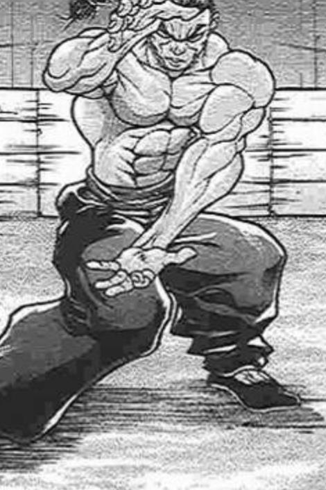

烈 海王

Atk188（113）

Hp17

技能

烈 海 王：海王是中华武术的巅峰，烈海王又是其中佼佼者，凭借高超的技术使战斗力X1.8

消力：传自郭海皇的绝学，普通攻击以及近战系技能所造成的的最终伤害/2（对战斗力230以上的对手无效）

四千年的传承：不会陷入异常状态，面对近战系、技术系的技能可以进行【1d100】的破解判定，75以上成功

FlowerShooting（CT3）：（弹幕类）同时发出五个方向的大范围花弹，对对手造成必中的【1+1d4】点伤害。

假腿【TheWorld】Plus:一天一次，使用假腿中的力量进行一次超快速移动。本回合战斗自动胜利且造成的伤害必中。（对战斗力低于160的对手使用的情况下直接判定战斗结束，胜者烈海王）不知为何，现在可以在战斗时放出小刀，攻击成功时对对手造成的伤害+1

战意低下：本次战斗中Atk-15

必杀技

武之怀（CT5）：3T内Atk+60。3T内可对所有攻击进行【1d100】的破解判定，普通攻击与近战系、技巧系技能30以上成功，其余技能50以上成功，必杀技75以上成功。

超人烈海王（CT6）：Atk+650，给予伤害X4，之后2T回避概率翻倍

秘术「天文密葬法」（CT9）：对妖怪使用效果为【？？？】，对妖怪以外的敌人使用时效果为【？？？】，一天仅能使用一次

九十九八桥/九十九弁弁

Atk 185（150）

Hp 14（10）

技能

魔力替换：替换了来自万宝槌的魔力，战斗力上升，Atk+25，Hp+4

早有准备：用弹幕进行普通攻击，不会受到消力的影响（大失败效果）

双人组合：两人一同战斗，Atk+10

弦乐【风暴的合奏】（CT4）：（弹幕类）姐妹二人同时发出大量弹幕，对对手造成【2d3】的伤害

弦乐【净琉璃世界】（CT5）：（弹幕类）发出红蓝二色弹幕阻扰对手的行动，2T内对手Atk-45

必杀技

筝曲【下克上安魂曲】（CT6）：Atk+500，战斗造成的伤害X3，不能与乐符【Double Score】同时使用

乐符【Double Score】（CT6）：对对手进行一次【1d100】的驻足判定，50以上成功，成功后对手此回合无法行动。Atk+300，战斗造成的伤害X2，不能与筝曲【下克上安魂曲】同时使用

T1

烈的攻击【188+1d100：8=196】

九十九姐妹的攻击【185+1d100：69=254】

烈的受伤【1d10：2】

1 回避

2 小伤害

3 小伤害

4 中伤害

5 中伤害

6 大伤害

7 大伤害

8 特大伤害

9 特大伤害

10 大成功/大失败【1d2：2】

Hp：17-1=16

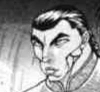

烈：完全不想跟你们打架……

T2

烈的攻击【188+1d100：2=190】

九十九姐妹的攻击【185+1d100：89=274】

烈的受伤【1d10：2】

1 回避

2 小伤害

3 小伤害

4 中伤害

5 中伤害

6 大伤害

7 大伤害

8 特大伤害

9 特大伤害

10 大成功/大失败【1d2：1】

Hp：16-1=15

八桥：早已做好准备了！

弁弁：已经调查了你好几天了！

T3

九十九姐妹的攻击【185+1d100：17=202】

烈的攻击【188+1d100：30=218】

九十九姐妹的受伤【1d10：1】

1 回避

2 小伤害+1

3 小伤害+1

4 中伤害+1

5 中伤害+1

6 大伤害+1

7 大伤害+1

8 特大伤害+1

9 特大伤害+1

10 大成功/大失败【1d2：1】

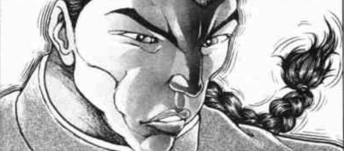

烈：躲过去了，那就补一次射击吧

花之射击发动

九十九姐妹的受伤【1+1d4：4=5】

Hp：14-5=9

T4

弁弁：符卡宣言 弦乐【风暴的合奏】！

镇魂演出开始了！

烈的受伤【2d3：4】

Hp：15-4=11

烈的攻击【188+1d100：20=208】

九十九姐妹的攻击【185+1d100：45=230】

烈的受伤【1d10：6】

1 回避

2 小伤害

3 小伤害

4 中伤害

5 中伤害

6 大伤害

7 大伤害

8 特大伤害

9 特大伤害

10 大成功/大失败【1d2：1】

Hp：11-3=8

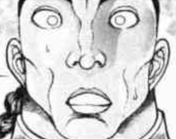

烈：糟糕......我太大意了

T5

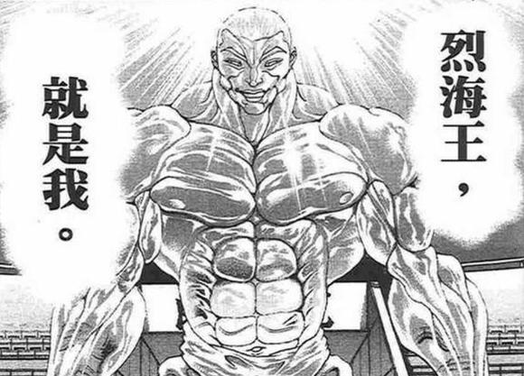

烈：加把劲结束这场战斗吧

武之怀发动

八桥：用弹幕困住你！符卡宣言 弦乐【净琉璃世界】！

烈的破解【1d100：97】成功

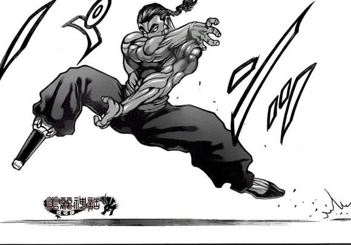

烈：抱歉，困不住的！

九十九姐妹的攻击【185+1d100：51=236】

烈的破解【1d100：40】判定失败

烈的攻击【188+60+1d100：18=266】

九十九姐妹的受伤【1d10:2】

1 回避

2 小伤害+1

3 小伤害+1

4 中伤害+1

5 中伤害+1

6 大伤害+1

7 大伤害+1

8 特大伤害+1

9 特大伤害+1

10 大成功/大失败【1d2：2】

Hp：9-2=7

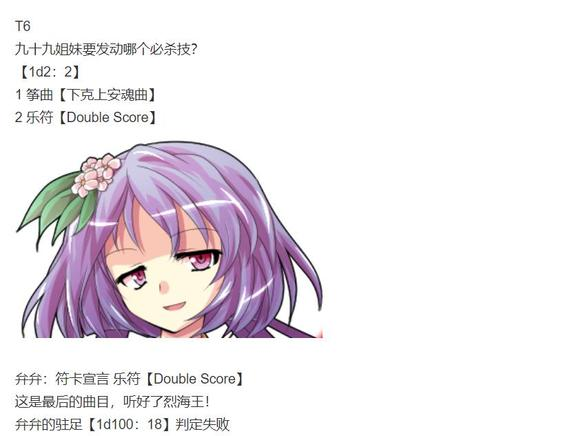

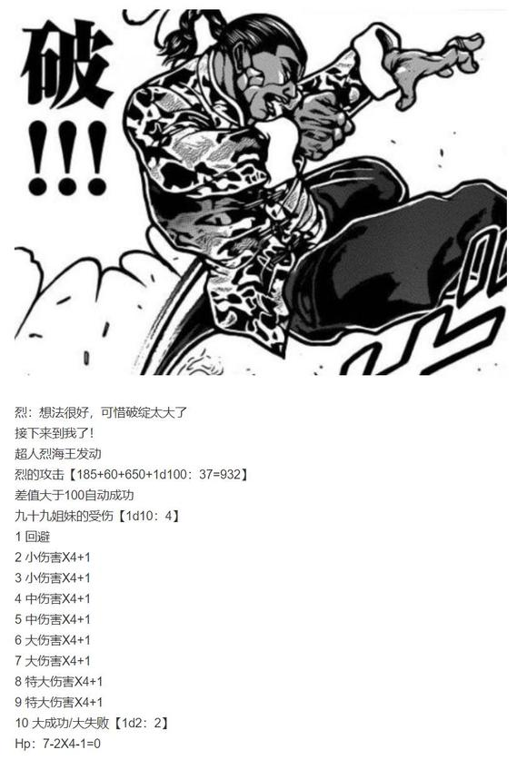

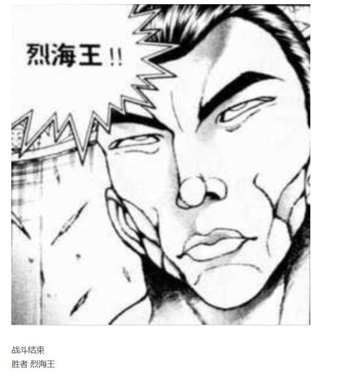

弁弁：起码咱们把所有的歌都唱完了……

八桥：我那首还没唱呢……

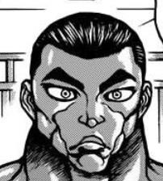

烈：这世上还有使用乐器的战斗，真是令我大开眼界，在此谢过二位

不过，两位姑娘不妨说说这是怎么回事？

我想我们之间并没有什么过节吧？

八桥：你在说什么傻话？

弁弁：要不是雷鼓给了我们新的希望，我们道具的未来就真的要消失了！

烈的决心【1d100：99】大成功

大成功是什么？【1d10:8】

1 烈海王心中充满了责任感，下次战斗中Atk+10

2 多么坚毅的人啊！雷鼓好感度+10

3 我已感受到你的决心！假腿造成的伤害由+1变为+2

4 烈海王心中充满了责任感，下次战斗中Atk+10

5 多么坚毅的人啊！雷鼓好感度+10

6 我已感受到你的决心！假腿能用出骑士踢了（为啥啊）

7 烈海王心中充满了责任感，下次战斗中Atk+10

8 多么坚毅的人啊！雷鼓好感度+10

9 我已感受到你的决心！假腿发出了奇怪的声音（为啥啊）

10 大成功/大失败【1d2：2】

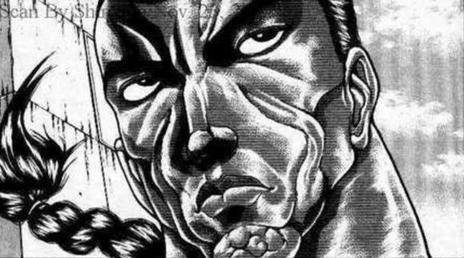

烈：不行，我不能就这么放任不管

如果这个叫雷鼓的付丧神再来大闹一通，之前正邪小姐与针妙丸小姐的让步就白费了

现在就上去看看到底怎么回事！

有其他人参与调查吗？【1d100：32】（50以上有）

烈海王又是第一个出发去战斗的人

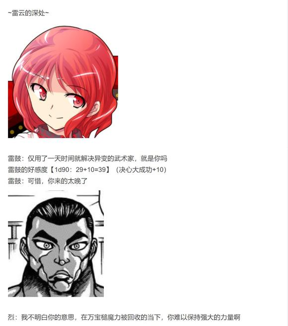

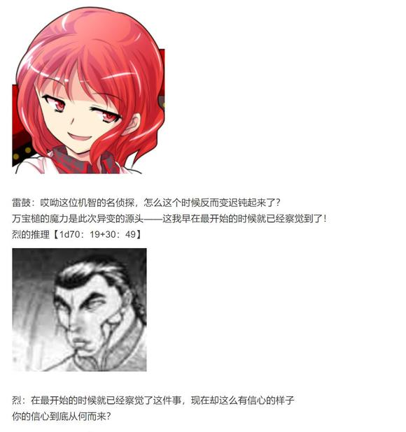

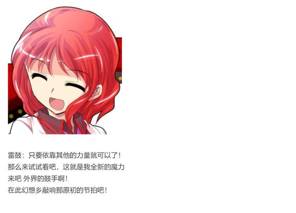

战斗！

BGM：原初的节拍　～Pristine Beat

烈海王

Atk 203（113）

Hp 17

具体数据见上

堀川雷鼓

Atk 235

Hp 16

技能：

梦幻的打击乐手：使用弹幕进行普通攻击，不会受到对普通攻击/近战类攻击减伤效果的影响。运用节奏与电流进行战斗，对时停等特殊情况拥有一定的耐性

一鼓【暴乱宫太鼓】（CT1）：（弹幕系）战斗开始时即可使用，一场战斗中只能使用一次，对对手进行八次【1d100】的攻击判定，70以上成功，每次成功对对手造成1点伤害

死鼓【Land Percuss】（CT3）：（弹幕系）对对手造成2点伤害，同时对对手进行一次【1d100】的震撼判定，50以上成功，成功后对手本回合进入异常状态【震慑】

六鼓【AlternateSticking】（CT4）：（近战系）1T内Atk上升70，对对手造成的伤害+2

七鼓【高速和太鼓火箭】（CT5）：（弹幕系）让太鼓以火箭般的速度飞出，放出大量弹幕攻击对手，对对手造成【3+1d4】点伤害

八鼓【雷神之怒】（CT5）：（弹幕系）以闪电困住对方的行动后发射弹幕攻击，对对手造成【1+1d4】点伤害，伤害结算后对对手进行一次【1d100】的驻足判定，40以上成功，成功后本回合无法行动

必杀技

【Blue Lady Show】（CT6）：发出音效不同的音符弹幕，对对手有节奏感地造成伤害 Atk+600，对对手造成的伤害X3，战斗成功后下回合对手无法行动

【Pristine beat】（CT9）:无法回避/破解/防御，令密集且形式多样的音符弹幕轰响天际，Atk+700，对对手造成的伤害X5

T1

雷鼓：现在，只属于我的演奏开始了！

符卡宣言 一鼓【暴乱宫太鼓】！

攻击判定【8次1d100=58 2 88 52 36 50 47 11】成功1次，伤害为1点

Hp：17-1=16

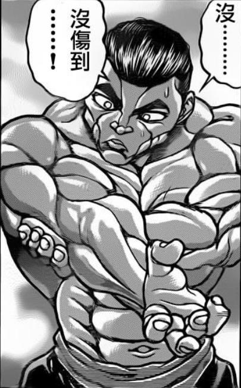

烈：小鼓爆开之后居然是弹幕，真是有创意的攻击

烈的攻击【203+1d100：76=279】

雷鼓的攻击【235+1d100：91=326】

烈的受伤【1d10:5】

1 回避

2 小伤害

3 小伤害

4 中伤害

5 中伤害

6 大伤害

7 大伤害

8 特大伤害

9 特大伤害

10 大成功/大失败【1d2：1】

Hp：16-2=14

烈：本以为与之前的姐妹俩一样只是普通的付丧神——

现在看来，力量极强啊

T2

烈的攻击【203+1d100：80=283】

雷鼓的攻击【235+1d100：42=277】

雷鼓的受伤【1d10：7】

1 回避

2 小伤害+1

3 小伤害+1

4 中伤害+1

5 中伤害+1

6 大伤害+1

7 大伤害+1

8 特大伤害+1

9 特大伤害+1

10 大成功/大失败【1d2：2】

Hp：16-3-1=12

雷鼓：有两下子啊，武术家

没想到你的腿里还藏了刀

烈：说起来你可能不信，这小刀是它自己扔的

T3

雷鼓：让你听听我这震撼人心的鼓声吧！

符卡宣言 死鼓【LandPercuss】

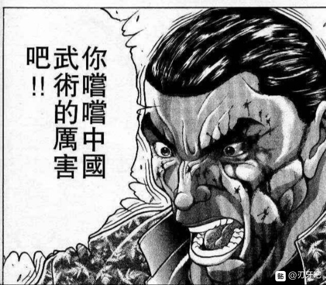

烈：根本就是物理上的震撼啊

不过很可惜——克服震动的战斗，我们在四千年前就已经做到了！

四千年的传承发动，震撼判定自动失败

雷鼓：弹幕的伤害你可躲不掉！

Hp：14-2=12

雷鼓的攻击【235+1d100：69=304】

差值大于100自动成功

烈的受伤【1d10:4】

1 回避

2 小伤害

3 小伤害

4 中伤害

5 中伤害

6 大伤害

7 大伤害

8 特大伤害

9 特大伤害

10 大成功/大失败【1d2：1】

Hp：12-2=10

烈：来而不往非礼也，接招 Flower Shooting！

雷鼓的受伤【1+1d4：3=4】

Hp：13-4=9

雷鼓：居然还有用花战斗的武术家？

T4

雷鼓：符卡宣言 六鼓【Alternate Sticking】

你用远程的弹幕，我就用近战的攻击！

烈的破解【1d100：96】成功

烈：可惜——

接近战方面，我才是专家！

雷鼓的受伤【1d10：3】

1 回避

2 小伤害+1

3 小伤害+1

4 中伤害+1

5 中伤害+1

6 大伤害+1

7 大伤害+1

8 特大伤害+1

9 特大伤害+1

10 大成功/大失败【1d2：1】

Hp：9-1-1=7

T5

雷鼓：现在开始加快节奏了！

符卡宣言 七鼓 【高速和太鼓火箭】！

符卡宣言 八鼓【雷神之怒】！

烈：将身体交给武术——让我看看你的表演吧！

武之怀发动

七鼓 烈的破解【1d100：56】大于50成功

八鼓 烈的破解【1d100：75】大于50成功

烈：火箭般发射的太鼓，与曲线闪电和密集的弹幕，真是恐怖的技巧

然而过于执着于所谓的节奏，终究是华而不实！

雷鼓的攻击【235+1d100：9=244】

烈的破解【1d100：9】失败

烈的攻击【203+60+1d100：68=331】

雷鼓的受伤【1d10：10】

1 回避

2 小伤害+1

3 小伤害+1

4 中伤害+1

5 中伤害+1

6 大伤害+1

7 大伤害+1

8 特大伤害+1

9 特大伤害+1

10 大成功/大失败【1d2：2】

雷鼓大失败！

雷鼓的受伤【1d10：8】

1 小伤害+1

2 小伤害X2+1

3 中伤害X2+1

4 中伤害X2+1

5 大伤害X2+1

6 大伤害X2+1

7 特大伤害X2+1

8 特大伤害X2+1

9 战斗不能

10 大成功/大失败【1d2：1】

Hp：7-4X2-1=0

雷鼓：怎么会——我的符卡甚至都没有用完——

烈：太天真了，白衣的演奏者

全力以赴的战斗之中，是不会有让你一轮轮悠闲出招的空隙的！

瞄准一瞬之间的胜机，并拼尽全力将其抓住，这才是正确的做法

战斗结束！

胜者 烈海王！

雷鼓：是还不适应这份新的魔力吗

还是说，是我自己太天真了？

烈：你刚刚说你替换了魔力

雷鼓：是啊

道具的力量来源于使用者

在察觉到万宝槌的真相之后，我便立刻前往外界，吸纳了外界的鼓之后更换了全新的鼓手

这样一来，即使万宝槌的魔力消失，我也仍然能够保有自身的存在

烈：这么说，我的假腿中的魔力也是可以替换的？

雷鼓：你想听详细的说明吗?

烈的渴望【1d100：68】（75以上想）

烈：算了

让它回到原来的样子也挺好

现在这个自己扔飞刀的样子，怎么想都觉得太怪了

雷鼓：唉……结果我们道具到头来还是无路可走啊

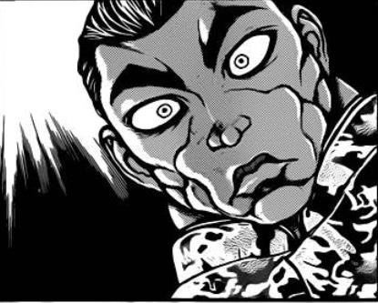

烈：？？？

你没有问清楚吗？

经过这短短一天的异变之后，很多强者都认识到了潜在的问题

现在，幻想乡中正由多位强者牵头，发起了爱护与保护道具的活动

雷鼓：哎？

她俩也没跟我说啊？

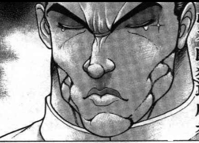

烈：——这到底是打的什么架

莫名其妙，真是乱七八糟

雷鼓：哈哈哈！

你说的没错，烈海王，我或许真的不擅长战斗

有机会的话来听我的演奏会吧

雷鼓：但你就别想让我送你票了，自己去买吧

巨大的雷云散去了

短暂的时间内，幻想乡的天空又恢复了正常

由万宝槌引起的异变，终于彻底结束了

——万宝槌异变彻底结束——

总时间：1+5=6天

成就：万宝槌异变 达成！Atk+3（今泉影狼，九十九姐妹与堀川雷鼓的战斗奖励）

现Atk为116

加成后Atk为208

——彩蛋环节——

还是跟上一次一样，不会有能力值升降/新技能学习/好感度变化等事件发生，无大成功大失败，纯粹的放松气氛事件

虽说这一次气氛压根就没紧张过（笑）

~说起来其他人的道具呢~

永远亭有其他人的道具发生异变了吗？【1d10：7】

1 皮克的写字板

2 铃仙的枪

3 师匠的弓箭

4 辉夜的PS4

5 因幡帝的年糕锤

6 皮克的裤头

7 皮克的写字板

8 辉夜的PS4

9 铃仙的枪

10 师匠的药壶

烈：皮克，你平时用的写字板也出问题了？

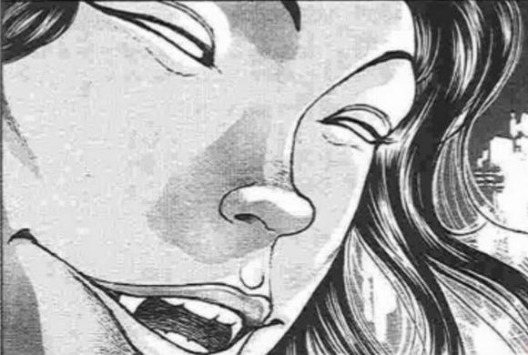

皮克点了点头

皮克（手写）：铃仙在出门的时候太过匆忙，把领带系歪了，这是合理的发展

5分钟后，烈看到了没系好领带的铃仙

皮克（手写）：因幡帝这几天都没有吃过竹笋，因此今晚想要吃竹笋料理，这是合理的发展

5分钟后

因幡帝：烈海王，今晚吃什么？有竹笋吗？

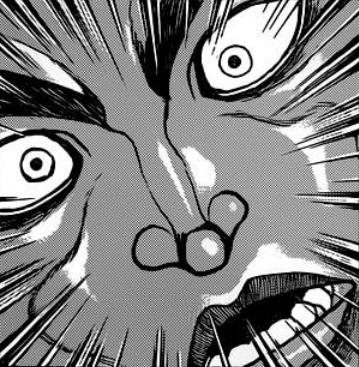

烈：——这能力也太恐怖了吧？

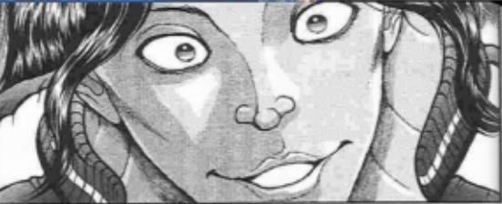

皮克：嗷嗷嗷嗷嗷嗷嗷啊

（之前对师匠和辉夜小姐试过没有用，同时写过一些比较奇怪的发展也没有出现，似乎最多只能搞点恶作剧的样子）

~弹幕天邪鬼还有吗~

蓝：——紫大人，这就是本次事件的全过程了

紫的怒气【1d100：13】（75以上弹幕天邪鬼活动继续发生）

紫：虽说持续了6天，但满打满算也就第一天上午闹了点事情

性质很恶劣，但为了半天的恶作剧搞通缉怎么想都太小家子气了

你找个时间去教训那个天邪鬼一顿，这事就算完了

蓝：好的~

~烈教头~

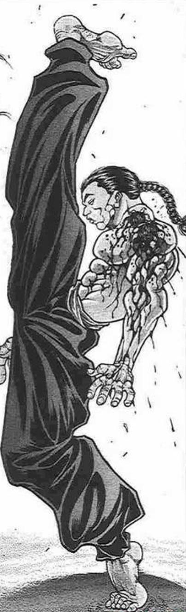

烈：这一招是最基本的腿法

若鹭姬：烈老师，我没有腿哎

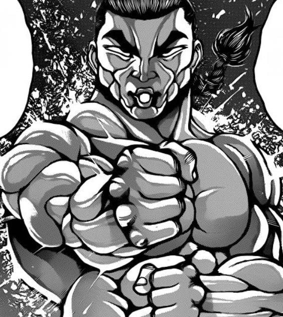

烈：马步是锻炼肌肉与平衡的架势

琪露诺：辫子妖怪，可以飞在天上扎马步吗？

烈：——大家都有手吧？

咱们直接练拳法吧

正邪：行不行啊你这，我怎么看怎么不靠谱

~摸鱼~

魔理沙：灵梦，这次的异变又结束了！

灵梦：这不是很好吗？最近我只要在神社喝喝茶，异变自己就结束了

幻想乡终于学会了自己解决异变，这是好事啊

魔理沙：我的八卦炉火力又恢复正常了，结果这次只在辘轳首的身上轰了一发

灵梦：我的退魔棒压根就没用着，真好啊

~生气了吗~

正邪：喂，你真的不生气？

针妙丸的怒气【1d100：8】

针妙丸：不生气啊~

正邪：为什么啊？？啊？？

针妙丸：被朋友原谅了，你不应该高兴吗？

正邪：本大爷是天邪鬼！越是应该高兴的场合就越是烦躁啊！

~体型~

万宝槌才用了半天就把力量收回来了，针妙丸的情况是？【1d10：10】

1 还是变小了

2 完全没变

3 变矮了

4 还是变小了

5 完全没变

6 变高了（为啥啊）

7 还是变小了

8 完全没变

9 变得超级高大（为啥啊）

10 完全没变

针妙丸：这一次力量收回的很及时，体型也没变，真好！

正邪：我求求你别说了……

（本日的更新彻底结束，周末没有更新）

（下一次更新是周一或者周二）

（以下是我的废话）

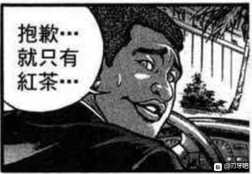

一场正经架都没打，真的很过分

因此EX面就完全是火力全开模式

多亏开场的两个大失败，就算是九十九姐妹运气够好都能让烈被活用于下一次，真棒啊

鼓哥是我个人很喜欢的角色，因此这一次制作鼓哥卡的时候火力全开

考虑到毕竟只是刚诞生不久的付丧神，怎么说都不能搞成萃香那样260的Atk，因此战力方面设置为了烈平A基本干不过，但开buff之后有戏的水平

作为补偿，几乎把雷鼓所有的符卡全都上了

除了一个近战系的以外剩下的全是弹幕，标准的技能战士模板

之前在脑内推演了一下，感觉烈要么动用药酒要么使用假腿才能拖到第九回合翻盘，打起来应该会是场不错的战斗

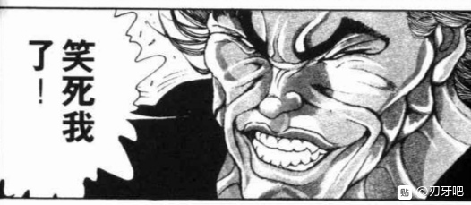

谁知道鼓哥骰运这么差啊

开场八个判定就过了一个已经很离谱了

连续被破仨技能，这啥啊？

第五回合就大失败......

哎呦。。。我做了这么久的卡啊。。。你好好打架行吗。。。

就是这样，下一次正篇的更新是在周一或者周二

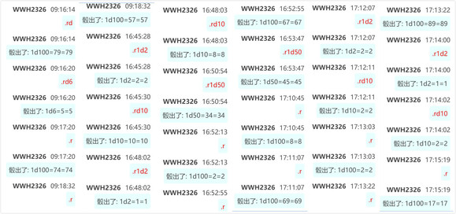

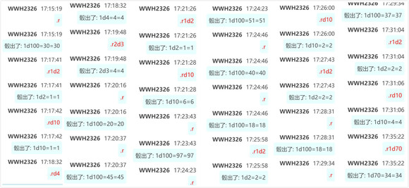

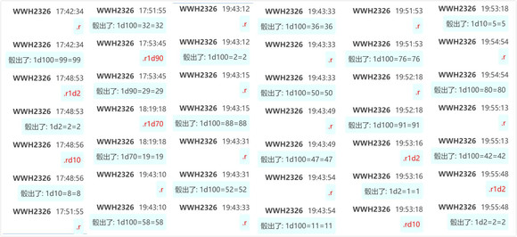

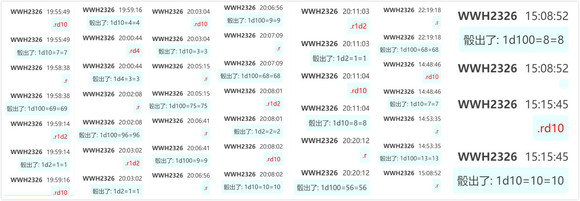

附上本次的骰子

由吧友 @望远镜300  制作的视频第六集更新了！

大家有空的话就去看看吧！在此感谢这位超人！

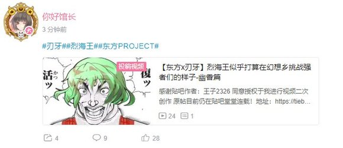

——本部老师的车万小常识——

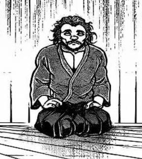

突然想起来本部老师的番外好久没更了，在这么下去本部老师就要幻想入了

因此更一下针妙丸的简介

小人的末裔 少名针妙丸

BGM：辉光之针的小人族　～ Little Princess

种族：小人 所属势力：辉针城

初登场于东方辉针城，是本作的六面boss

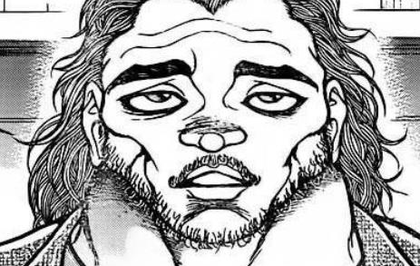

少名针妙丸的能力，就是使用万宝槌程度的能力

她是一寸法师的末裔，因此能够使用万宝槌

初代的一寸法师治退了鬼，得到了鬼的秘宝 万宝槌

不过，鬼的秘宝中当然用的是鬼的魔力，随便应用是会带来麻烦的

因此当初的一寸法师在之后的日子里并没有使用这把小锤

不过，到了许久之后的某一代，小人的后裔忘记了先祖的教诲，想要利用万宝槌建起一座统治人的城市

于是辉针城出现了

而作为许愿的代价，辉针城整个逆转，城池连同小人族一起被幽闭在了鬼的世界里

之后小人族终于看清了这把锤子的真相，将其封印起来

而到了针妙丸这一代，围绕万宝槌又发生了一些事情，那就是辉针城本篇的故事了

冷知识

血统高贵：小人族是血统高贵的种族，这一点连天子都认同

玩梗达人：东方角色们的符卡中或多或少都有些zun喜欢的梗，不过针妙丸的符卡玩得特别明显

比如【进击的小人】（进击的巨人）【Wall of Issun】（同样是巨人中的城墙梗）

【七个一寸法师】（白雪公主与七个小矮人）以及很多与一寸法师的故事相关的梗

小人：原作中，针妙丸由于过度使用万宝槌的力量，在异变结束后变成货真价实的小人了

此后，她在博丽神社暂住了一段时间

本贴由于莫名其妙展开，现在应该在辉针城里和正邪过着平静的搞事时光吧（笑）

心慈手软：在弹幕天邪鬼的某张符卡中，针妙丸在发出一段时间的弹幕后就会不再攻击了

此处可以理解为对鬼人正邪手下留情，但理解为针妙丸没力气了也可以（笑）

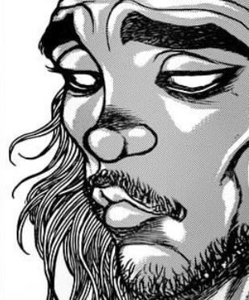

那么今晚的番外就到这里结束

下一次更新是在周一，烈海王该开始他的日常了

日常结束之后是原创活动——新人物——交流回——新异变

不过现在交流回变得更加恐怖了啊

要不要适当缩短交流回？换点别的？到时候再说吧

