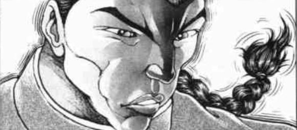

我很高兴吧友们喜欢这个贴子，但还请不要玩些会引人误会的梗。。

戒断反应啊，蚂蚁爬啊这些，可能有人看到后会很不舒服的

今后我会把类似的回复删掉的，还请大家谅解

由吧友 @望远镜300  所制作的视频第7集更新啦！

大家有兴趣的话就去看看吧！

万宝槌的异变已然结束，烈海王再次回归到他平淡无奇的日常生活中

这是发生在烈来到幻想乡的第【97+1d10：6=103】天的事

烈海王随手接住了扑面而来的报纸，开始了他全新的一天

今天早上烈要干什么？【1d10:10】

1 这报纸都扔了一百多天了，也太过分了吧

2 找红海皇练拳

3 找师匠学习弹幕技术

4 最根本的肉体锻炼

5 陪皮克玩

6 向神子殿下询问成仙法

7 向白莲师傅询问成仙法（为啥啦）

8 向勇仪询问成仙法（为啥啦）

9 去人里逛逛（随机事件）

10 大成功/大失败【1d2：2】

烈海王大失败！

烈海王大失败！

大失败的结果是什么？【1d10：6】

1 辉夜的恶作剧

2 秦心的复仇战

3 地裂了！

4 辉夜的恶作剧

5 假腿突然失控，将烈带到了奇怪的地方

6 八云紫的超过分委托（委托内容本身已经是大失败，遇见的新人物不会扣好感）

7 辉夜的恶作剧

8 雷鼓的复仇战

9 假腿突然失控，将烈带到了奇怪的地方

10 大成功/大失败【1d2：1】

紫：你看上去很闲的样子啊，烈海王？

烈：八云女士，您怎么来了？

我给您泡壶茶吧？

紫想喝茶吗？【1d100：99大成功】

紫：太好了~我现在刚好很想来杯红茶呢

大成功的效果是？【1d10:2】

1 委托变为普通难度

2 委托是厨艺相关

3 委托与熟人有关

4 委托变为普通难度

5 委托是厨艺相关

6 委托与熟人有关

7 委托变为普通难度

8 好感度上升【1d10】

9 茶泡的不错嘛，给你点奖励吧（为啥啊）

10 大成功/大失败【1d2：2】

隙间妖怪小口小口地喝着茶

烈：八云女士，请问您今天来是有什么事情要我做吗？

紫的委托是？【1d10:7】

1 白玉楼供餐，一周份

2 独自一人负责整场宴会的供餐

3 鬼族的三种酒器

4 白玉楼供餐，一周份

5 鬼族的三种酒器

6 其实是我想吃点东西（为啥啦）

7 白玉楼供餐，一周份

8 蓝想吃炸豆腐（为啥啦）

9 鬼族的三种酒器

10 大成功/大失败【1d2：1】

紫：其实我有位很喜欢美食的朋友，她居住在冥界的白玉楼中，一直都想尝尝你的手艺呢

烈：这点小事何足挂齿？您放心跟我吩咐，只要是我会做的肯定没问题

紫：不不不，和你想的有点不一样

实际上，白玉楼的食物供给稍微出了点问题

由于白玉楼的厨师离家出走了，幽幽子这一周都没有东西吃了

烈：？？？

紫：所以呢，无论是最基本的食材购买还是料理的过程，都需要你一个人来负责

顺便一提，我的朋友对于食物的要求稍微有点高——起码要【70】以上的味道才能入口

烈：也就是说我这一周都需要搬去白玉楼做菜了？

紫：我可以帮你把额外做好的料理送回永远亭，所以不必担心这边的问题

顺便一提，如果味道不够好的话她可能会有一点生气

烈：（我觉得绝不止一点生气……）

限定活动：幽幽子大小姐今天的饭开始了！

烈海王在接下来的七天需要进行七次厨艺判定，70以上通过

厨艺判定失败即刻开战，七次全部通过后触发最终事件

鬼王的药酒与假腿【The World】可以各使用一次用来抵消一次失败

烈：——八云女士，我冒昧地问一下

如果那位强者看我不顺眼，见面的第一时间就准备把我毙了该怎么办？

紫：毕竟是我介绍过去的人，怎么说都会有【1d10:5】

1 【1d10】的好感

2 【1d5】的好感

3 没有初始好感

4 【1d10】的好感

5 【1d5】的好感

6 没有初始好感

7 5点好感

8 1点好感

9 没有初始好感

10 大成功/大失败【1d2：2】

紫：怎么说都会有【1d5：4】点好感在的~

烈：这不是压根就没有多少吗……

紫：当然，这一次是出于我的个人原因，怎么说都不会让你打白工的

本次的报酬是【1d10：1】

1 介绍仙人前辈

2 没有任何报酬！（好感度）

3 体质增强（Atk上升）

4 介绍仙人前辈

5 没有任何报酬！（好感度）

6 体质增强（Atk上升）

7 介绍仙人前辈

8 介绍我家的蓝给你认识吧（为啥啊）

9 介绍秘神给你认识吧（为啥啊）

10 大成功/大失败【1d2：2】

紫：你想要成仙对吧？那么我会为你介绍一位仙路上的前辈

至于你能不能从她身上得到好处，就只能看你自己了

烈：这可真是，于情于理我都无法拒绝

但在我出发之前我想我总要做点准备，这应该没问题吧？

幽幽子的饥饿【1d100：65】（75以下可以）

紫：现在时间应该还够——不过请快点哦

烈的准备是【1d10：6】

1 找勇仪求酒

2 找萃香求酒

3 找咲夜寻求帮助

4 收集有关白玉楼主人爱好的资料

5 找勇仪求酒

6 找萃香求酒

7 找师匠求药（为啥啦）

8 去深夜雀食堂寻求帮助（为啥啦）

9 找勇仪求酒

10 大成功/大失败【1d2：1】

烈：萃香小姐？请问您在吗？

萃香：什么事啊？

烈：请问能否借我些酒？这几日我需要高强度做菜，出现差错在所难免

于是就想向您借些美酒，以备不时之需

萃香：嗯——那么就给你【1d4：3】天份的酒吧

得到了萃香的酒！

3天内厨艺基础值+5

烈：该出发了……

暗色的隙间突然出现，将烈海王吞了进去

下一个瞬间，他所身处的地方已然是樱花林之中的和风住宅

~白玉楼~

“你就是紫介绍来的新厨师吗？我是紫的朋友，西行寺幽幽子”

出现在烈海王面前的，是白玉楼的主人，冥界的大小姐西行寺幽幽子

她有着一头樱花色的短发，头上戴有蓝色的帽子与幽灵状的头饰，身穿淡蓝色的和服

无数透明的幽灵正在她的四周漂浮着

幽幽子的好感度【4+1d96：6=10】（50以上战斗结束后不下死手）

幽幽子：扎辫子带假腿的武术家？

看上去压根就不像是会做菜的样子啊

这是紫的全新恶作剧？我真的要生气了哦

烈：厨艺这东西毕竟只能靠料理来表现，无论我再怎么对自己进行吹嘘，也无法改变我本人真实的水平

还请您给我一顿饭的机会证明自己

幽幽子：——毕竟是紫介绍来的

有言在先，我现在真的很饿哦

烈的厨艺【1d45：18+50+5=73】

烈：今日前来太过仓促了，只能做出这种水平的料理

幽幽子：刚刚好好过关了，确实还是会做饭的

那么期待你之后的表现了~要坚持到妖梦回来哦~

紫：幽幽子真是的，一点都不相信我？

幽幽子：一点都不相信哦~毕竟紫天天戏弄我嘛~

幽幽子离去了

烈：今天就应付这一轮应该是够了

这口味确实是相当刁钻……难怪之前的厨师会气到离家出走

第一天生存确认！

第二天开始

烈的厨艺【50+5+1d45：10=65】

烈：糟糕了！今天失误了！

幽幽子：——今天的味道可不行呢

烈：请您稍候

今天的料理，是要配上特制的药酒一同享用的

烈海王拿出了鬼王的药酒

幽幽子：是仙人的药酒啊~

原来如此，料理本身的味道需要配上酒才能发散出来吗，不错的主意

？？？：用珍贵的酒补了一手啊

还以为第二天我就该出场了

不过，下一次你可没有这么好的运气了！

在某个阴暗的角落中，白玉楼的原厨师正注视着新来的主厨……

第四日开始

烈的厨艺【50+10+1d40：34=94】

幽幽子：今天的食材很新鲜呢~料理的味道上升了一个档次！

烈：可惜昨天找来的食材也就够用一顿的……

今天又要想其他的法子了

烈的方法是【1d10：7】

1 靠我烈海王的推理找出幽幽子喜欢的口味

2 寻找新的食材

3 询问以前的厨师

4 靠我烈海王的推理找出幽幽子喜欢的口味

5 寻找新的食材

6 询问以前的厨师

7 靠我烈海王的推理找出幽幽子喜欢的口味

8 问问八云女士吧（为啥啦）

9 问问师匠吧（为啥啦）

10 大成功/大失败【1d2：1】

烈：一共给她做了四天的饭了，从她的反应来看基本能明白这位大小姐喜欢的口味了

这里就用我烈海王的推理！

烈的推理【1d70：40+30=70】（50以上之后3天+5,75以上之后三天+10）

烈：只能推理出最基本的喜好……真是头疼

第四天存活确认！

第五天开始！

烈的厨艺【1d45：16+55=71】

幽幽子：今天也就勉强过关的样子

过于懒惰了，烈海王

烈：实在抱歉，今天发挥失误了

明天不会再出现这种问题了

？？？：还以为是我登场力挽狂澜的时候了……

幽幽子：妖梦真是不服输的孩子呢~

躲在暗中观察的庭师没有注意到，冥界的大小姐其实早已发现她了

第五天存活确认

第六天开始！

烈的厨艺【1d45：8+55=63】

（糟糕，这一次真的砸了！）

烈海王从未有过这样的感觉

自己的实力是没有问题的，食材也是优秀的——

但是最关键的工作时间实在是不够了！

收集完材料并进行处理之后，剩下的时间已经不足以精细料理！

这样下去，就是再优秀的厨师也没有办法成功

烈：这压根就没有做完啊……火候还差最后一点，调味也没做好

有没有什么应急的办法……

烈海王看向了一旁的油

在烈海王端上料理的一刹那

时间短暂的停滞了

幽幽子：咦？本来以为今天你要失败了，结果居然把味道补上了？

烈：说实话，今天的料理直到端上桌子的前一刻都没有完成

于是我使用了川菜中的技巧

在料理上淋上热油与香料，补上了最后差的一点热度并同时进行了调味

刚刚我已经没有时间做细致的处理了

因此在厨房中提前准备好了辣椒，麻椒，花椒等调味料，并热好了油

然后在端上桌前的一刻使用了能力，才能将刚刚做好好的红油浇了上去

幽幽子：运用热与辣掩盖了料理本身的不足啊

真是耍小聪明的做法，这一次就算了，但是不会再有第二次了哦？

烈：（幸亏我从之前的推理中得知她能吃辣椒……）

？？？：学到了，这个确实是实用的技巧！

第六天存活确认！

第七天开始！

烈的厨艺【1d45：27+55=82】

烈：终于……终于结束了……

这简直比连续打上七天还累啊

烈海王做好了最后一天的料理

今天的料理不是他的最高水平，只是普通的发挥而已

但在连续七天的强压下，没有人有理由继续苛责这位厨师——

除了同样经历过这种职场的另外一位厨师

“还没有结束，我不能认可这种结果！”

出现在烈海王面前的，是腰佩双刀的白发少女

她身穿白色衬衫，套青绿色短卦，系着黑色领结，下身穿着青绿色的裙子

少女的身旁漂浮着一团如同麻薯一样的东西，那是身为她半身的幽灵

这便是白玉楼的庭师，本次事件中离家出走的主厨，魂魄妖梦

妖梦：本来所谓的离家出走只是跟幽幽子大人闹变扭而已

想着这样她终究会认识到我的重要性的顺便休息半天就回来——

但是立刻去找了一位新主厨是怎么回事？

七天的考验，居然全部通过了？

这样下去我离家出走不就没有意义了吗？！

烈的混乱【1d100：65】

烈：你在说什么？抱歉我有点听不明白，你就是之前出走的那位厨师吗？

妖梦的行动是【1d10:6】

1 料理对决（双方同时做一道新料理）

2 让你看看我的厨艺

3 弹幕决斗（为啥啦）

4 料理对决（双方同时做一道新料理）

5 让你看看我的厨艺

6 弹幕决斗（为啥啦）

7 料理对决（双方同时做一道新料理）

8 既然如此我就去永远亭抢你的生意！（为啥啦）

9 弹幕决斗（为啥啦）

10 大成功/大失败【1d2：2】

BGM：东方妖妖梦　～ Ancient Temple

妖梦：事到如今我再去做料理也没有用了

那么就用弹幕战来决胜负

将白玉楼厨师的工作，还给我！

烈：哦，要开战吗？

在此之前先问一句，你看上去是使用双刀的高手？

妖梦：当然，我可是白玉楼的庭师——也是幽幽子大人的剑术教习！

接招吧，永远亭的厨师

这把妖怪所锻造的楼观剑，几乎没有其斩不断的东西！

烈：那真是太好了

上一次对战武藏时所积累的经验，如今终究有了用武之地

让我看看幻想乡的剑术吧！

说句实话，连续折腾了七天之久——就算是我也想打架了！

战斗！

BGM：广有射怪鸟事　～ Till When?

烈海王

Atk：208（116）

Hp：17

技能

烈 海 王：海王是中华武术的巅峰，烈海王又是其中佼佼者，凭借高超的技术使战斗力X1.8

消力：传自郭海皇的绝学，普通攻击以及近战系技能所造成的的最终伤害/2（对战斗力230以上的对手无效）

已然活用于这一次：面对使用刀剑类武器的敌人时，消力可对小伤害与中伤害起效，对其攻击的破解所需值-10

四千年的传承：不会陷入异常状态，面对近战系、技术系的技能可以进行【1d100】的破解判定，75以上成功

Flower Shooting（CT3）：（弹幕类）同时发出五个方向的大范围花弹，对对手造成必中的【1+1d4】点伤害。

假腿【The World】:一天一次，使用假腿中的力量进行一次超快速移动。本回合战斗自动胜利且造成的伤害必中。（对战斗力低于160的对手使用的情况下直接判定战斗结束，胜者烈海王）

必杀技

武之怀（CT5）：3T内Atk+60。3T内可对所有攻击进行【1d100】的破解判定，普通攻击与近战系、技巧系技能30以上成功，其余技能50以上成功，必杀技75以上成功。

超人烈海王（CT6）：Atk+650，给予伤害X4，之后2T回避概率翻倍

秘术【天文密葬法】（CT9）：一天仅能使用一次，【？？？】/【？？？】

魂魄妖梦

Atk：240

Hp：16

技能

半人半灵的庭师：普通攻击与弹幕类攻击所造成的伤害减半（对Atk240以上的对手无效），拥有对时停等特殊手段的一定耐性

生命的二刀流：剑术高超，对其普通攻击与技能的破解判定所需成功值+20

幽鬼剑【妖童饿鬼之断食】（CT3）：（弹幕类），剑气集聚为环后散出，对对手造成【1d5】的伤害

断迷剑【迷津慈航斩】（CT4）（近战类）往楼观剑内注入大量妖力，创造出巨大的光刀斩击本回合Atk+70，造成伤害+2

魂魄【幽明求闻持聪明之法】（CT5）（近战类）： 令半身复制本体的行动进行追加攻击，本回合造成的伤害X2，战斗结束后对对手进行一次【1d100】的追击判定，60以上成功，对手Hp-2

人界剑【悟入幻想】（CT6）（弹幕类）：放出红色中玉与蓝色米弹的前后夹击，对对手造成【1d3】的伤害，同时3T内对手受到的伤害+1

必杀技

天神剑【三魂七魄】（CT6）：彩色弹幕与红色大玉的连击，Atk+650，给予伤害X3，战斗成功后对对手进行一次【1d100】的污秽判定，60以上成功，成功后下回合对手无法行动

六道剑【一念无量劫】（CT9）：无法回避/破解/防御，以超高速对自身以外的一切进行攻击，Atk+775，给予伤害X4（原为CT7的技能，因此时妖梦并非全力战斗，因此至少到第九回合才会发动）

T1

烈的攻击【208+1d100：76=284】

妖梦的攻击【240+1d100：30=270】

妖梦的受伤【1d10:5】

1 回避

2 小伤害/2

3 小伤害/2

4 中伤害/2

5 中伤害/2

6 大伤害/2

7 大伤害/2

8 特大伤害/2

9 特大伤害/2

10 大成功/大失败【1d2：1】

Hp：16-2/2=15

烈：这诡异的手感，是运用幽灵体减弱了攻击吗！

T2

烈的攻击【208+1d100：40=248】

妖梦的攻击【240+1d100：23=263】

烈的受伤【1d10:2】

1 回避

2 小伤害/2

3 小伤害/2

4 中伤害/2

5 中伤害/2

6 大伤害

7 大伤害

8 特大伤害

9 特大伤害

10 大成功/大失败【1d2：2】

Hp：17-1/2=17

烈：真是强烈的斩击啊

不过比起武藏，还是稍逊一筹

妖梦：原来如此

你的能力是，消去小伤害程度的能力吗？

烈：硬要说的话是使用武术程度的能力

T3

妖梦：我的能力是使用剑术程度的能力！

烈：说是剑术，实际上大部分攻击都是剑气啊

妖梦的攻击【240:1d100：43=283】

烈的攻击【208+1d100：73=281】

烈的受伤【1d10:9】

1 回避

2 小伤害/2

3 小伤害/2

4 中伤害/2

5 中伤害/2

6 大伤害

7 大伤害

8 特大伤害

9 特大伤害

10 大成功/大失败【1d2：1】

Hp：17-4=13

妖梦：接下来是弹幕攻击！

符卡宣言 幽鬼剑【妖童饿鬼之断食】

烈的受伤【1d5：4】

Hp：13-4=9

烈：什么弹幕，这不还是剑气吗！

Flower shooting发动

妖梦的受伤【1+1d4：4=5/2=2】

Hp：15-2=13

妖梦：这不是风见幽香的花弹吗？

莫非你其实是太阳花田的厨师？

烈：硬要说的话算甜品师

T4

妖梦：那么就用楼观剑的高速斩击吧

符卡宣言 断迷剑【迷津慈航斩】！

烈的破解【1d100：42】失败

战力差距大于100，战斗自动失败

烈的受伤【1d10:1】

1 回避

2 小伤害+2/2

3 小伤害+2/2

4 中伤害+2/2

5 中伤害+2/2

6 大伤害+2

7 大伤害+2

8 特大伤害+2

9 特大伤害+2

10 大成功/大失败【1d2：2】

烈：已经硬接过一次斩击了——这一次不会再犯错了！

T5

烈：将身体交给武术！

上一次对战武藏时没能用出的招式，就在这一次展现出来！

武之怀发动

妖梦：武藏是指那位战国时期的剑圣吗？

不知道剑术比起我来又如何？

符卡宣言 魂魄【幽明求闻持聪明之法】！

烈的破解【1d100：40】成功值30+20-10=40 判定通过

烈的攻击【208+60+1d100：30=298】

妖梦的攻击【240+1d100：66=306】

烈的破解【1d100:99】成功

烈：武藏可不会放出弹幕，也没有半灵的协助

但他的剑术绝不在你之下！

见识过他的剑之后——事到如今，我已经不会害怕了！

妖梦的受伤【1d10:4】（烈的Atk大于240）

1 回避

2 小伤害

3 小伤害

4 中伤害

5 中伤害

6 大伤害

7 大伤害

8 特大伤害

9 特大伤害

10 大成功/大失败【1d2：2】

Hp：13-2=11

T6

妖梦：那就让你看看我真正的秘传剑术！

符卡宣言 人界剑【悟入幻想】

符卡宣言 天神剑【三魂七魄】！

烈的破解  人界剑【1d100：37】失败

天神剑【1d100：27】失败

烈的受伤【1d3：3】

Hp：9-3=6

烈：果然，现在的我还做不到直接看破

那就从正面硬碰硬吧！

超人烈海王发动

烈的攻击【208+60+650+1d100：50=968】

妖梦的攻击【240+650+1d100：90=980】

烈的破解【1d100：97】成功

烈：我握住了，魂魄妖梦！我握住了你的剑！

妖梦：居然用拳头接住了楼观剑！

妖梦的受伤【1d10:10】（烈的Atk大于240）（超人烈海王已在正面交锋中用去，此时无伤害加成）

1 回避

2 小伤害

3 小伤害

4 中伤害

5 中伤害

6 大伤害

7 大伤害

8 特大伤害

9 特大伤害

10 大成功/大失败【1d2：1】

妖梦大成功！

妖梦：太过莽撞了，烈海王

我的白楼剑也是可以斩人的！

妖梦的反击！

烈的破解【1d100：18】失败

烈的受伤【1d10:5】（同上，天神剑已在正面交锋中用去，此时无伤害加成）

1 回避

2 小伤害+1/2

3 小伤害+1/2

4 中伤害+1/2

5 中伤害+1/2

6 大伤害+1

7 大伤害+1

8 特大伤害+1

9 特大伤害+1

10 大成功/大失败【1d2：1】

Hp：6-3/2=5

烈：大意了，居然忘记了第二把剑

Flower shooting发动

妖梦的受伤【1+1d4:1=2】（烈的Atk大于240）

Hp:11-2=9

幽鬼剑【妖童饿鬼之断食】发动

烈的破解【1d100：20】失败

烈的受伤【1d5：2】

Hp：5-2=3

T7

妖梦：呼……已经硬接过一轮符卡了

哪有你这么能打的厨师啊

烈的攻击【208+60+1d100：24=292】

妖梦的攻击【240+1d100：63=303】

烈的破解【1d100：58】判定成功

烈：彼此彼此，我也没见过剑术这么高超的庭师

你尝尝中华武术的厉害吧！

妖梦的受伤【1d10:2】（烈的Atk大于240）

1 回避

2 小伤害

3 小伤害

4 中伤害

5 中伤害

6 大伤害

7 大伤害

8 特大伤害

9 特大伤害

10 大成功/大失败【1d2：1】

Hp：9-1=8

T8

武之怀效果结束

妖梦：在这一回合了结你！

符卡宣言 断迷剑【迷津慈航斩】！

烈的破解【1d100：35】判定失败

烈的受伤【1d10:10】

1 回避

2 回避

3 小伤害+2+1/2

4 中伤害+2+1/2

5 中伤害+2+1/2

6 大伤害+2+1

7 大伤害+2+1

8 特大伤害+2+1

9 特大伤害+2+1

10 大成功/大失败【1d2：1】

烈海王大成功！

烈：真是强力的斩击，但我已经见过一次了

接下来轮到我反击了！

妖梦的受伤【1d10：8】

1 回避

2 小伤害/2

3 小伤害/2

4 中伤害/2

5 中伤害/2

6 大伤害/2

7 大伤害/2

8 特大伤害/2

9 特大伤害/2

10 大成功/大失败【1d2：1】

Hp：8-4/2=6

T9

超人烈海王回避效果结束

妖梦：抱歉，烈海王

这场战斗只是因为我个人的一时冲动所引起的

没想到却打到了如今这个地步

烈：对我来说，没什么所谓！

与剑术的高手一决高下，可比连做七天料理要快乐的多了！

妖梦：确实，一直高强度为幽幽子大人做饭真的很痛苦

就用这一击决胜负吧

符卡宣言 六道剑【一念无量劫】！

烈：学成已久的技术，终于有了用武之地

符卡宣言 秘术【天文密葬法】！

天文密葬法：一天仅能使用能够一次【？？？】/引导宇宙的力量，发出轨道诡异的大量弹幕轰击无法回避/破解/防御 Atk+850，给予伤害X5

白发的少女摆出了斩击的架势

她并未关注对手的行动，只是将一切精力集中于剑上

是时间变慢了，还是说，庭师的行动太快了？

刹那间，不可计数的剑气被少女所斩出！

烈海王此刻难得的没有思考武术

寻找破绽，见招拆招，拳与拳的碰撞——

他没有考虑这些，而是回想起了师匠的教导，回想着那片神秘的星空

传自月之贤者的秘术在此引导了宇宙的力量，将其化作无数的弹幕与剑气对轰！

烈的攻击【208+850+1d100：53=1111】

妖梦的攻击【240+775+1d100:34=1049】

妖梦的受伤【1d10：5】

1 小伤害X3（天文密葬法不可回避，此处处理为小伤害X3）

2 小伤害X5

3 小伤害X5

4 中伤害X5

5 中伤害X5

6 大伤害X5

7 大伤害X5

8 特大伤害X5

9 特大伤害X5

10 大成功/大失败【1d2：1】

Hp：6-2X5=0

妖梦：没想到是永琳大人的秘术，上一次见识到这一招已经是许久之前了

真是酣畅淋漓的战斗

我输了，烈海王

烈：我学了相当之久，这还是第一次用

妖梦小姐，你的剑术真的很可怕

如果武藏现在身在此处，想必会欣喜若狂吧……

战斗结束！

胜者 烈海王！

妖梦的好感度【30+1d70：52=82】

妖梦：烈海王，今日我见识到了你的武学

下一次就让你见识下我其他的剑术吧！

烈：求之不得

与你这样的好对手战斗，可是千金难买的机会！

幽幽子：两位都辛苦了~

不过，为什么我家的临时厨师和庭师，会在我家门口打起来啊？

结果，今天的饭还是紫帮我送过来的哦

妖梦：啊啊啊啊啊啊幽幽子大人！！！

我打的上头了结果把工作忘记了！！！

烈：幸亏我今天把饭先做好了……

