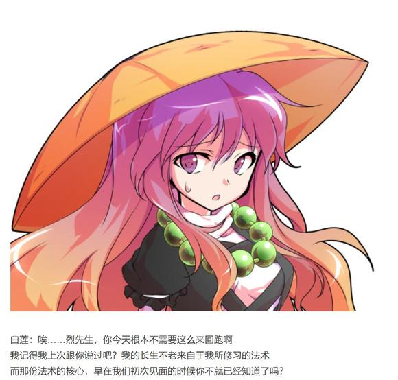
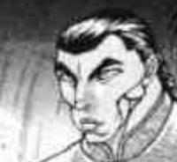
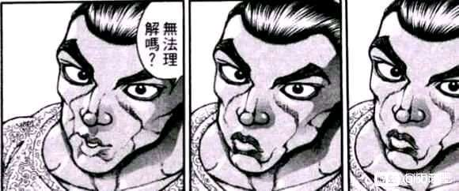

白玉楼供餐七日达成！不使用假腿战胜魂魄妖梦达成！

完成了不可能的任务，烈海王得到了一次改善印象的机会

幽幽子的好感度【10+1d90：59=69】

幽幽子：虽然有些勉强，但是这一周的料理还是完成了

而且，居然正面战胜了妖梦，我对你有所改观了哦

烈：我深感荣幸

话说回来，现在妖梦小姐已经回来了，我是不是也可以走了？

幽幽子的判断【1d10：4】（10以外可以走了）

幽幽子：你回去吧~

妖梦：下一次我们再比过！

烈：想要再战随时找我！

烈海王在此告辞，两位有缘再见

烈海王离去了

（歇一阵继续）

~白玉楼前的台阶上~

紫：工作完成的不错嘛~

烈：八云女士您说笑了

第六天那一次我真的觉得自己要完蛋了……

居然把假腿的能力用来做料理最后的调整了，万一出事了压根没法跑啊

紫：你本来也不会跑啊

“要求这么高我就一直达成给你看看”

“如果只是料理的味道不好就要开打那我就奉陪到底”

这才是你这一周内真实的想法吧

烈：——唉，这时候没有办法说无所谓啊

毕竟是您的委托，又关乎我自豪的厨艺

紫：那么作为本次任务的回报，就给你介绍仙人前辈吧！

八云紫的介绍【1d10：6】（1随机梗选项2-4青娥娘娘5-9某位不愿意透露姓名的贤者，10秘神）

紫：你听说过茨华仙的传闻吗？

在博丽神社以及人间之里的周围，经常会出现一位喜爱说教的华服女子

实际上，她与我一样也是幻想乡贤者的一员，同时也是一位修行中的仙人

那是个相当认真负责的家伙——想必跟你相性不会差吧？

那么，我就直接把你送过去了~

烈海王还没来得及出声，就被暗色的隙间吞噬了

~华扇的仙府~

“你就是紫所介绍的求仙者吧”

出现在烈海王面前的，是身穿华服，留着包子头的粉色短发女性

她身穿白衣绿裙，胸前有着与八云紫相似的带状装饰，其上绣有花与竹的图案

其右手上不知为何缠着白色的绷带，看上去十分怪异

茨华仙的好感度【1d85：39+15=54】（鬼王之友+10，紫的推荐+5）

茨华仙：我是居住在山中的仙人，茨华仙

烈先生，请问你为何要追求成仙的道路呢？

烈：您好，茨华仙人

我想要成为仙人，只是因为想要拥有长久的寿命

我所爱慕之人的寿命与我相差过于巨大

仅仅依靠人类之身的短暂光阴，是无法一直陪伴她的

茨华仙：是为了爱情？

那个，请问您所爱慕的对象是？

烈：是我的老师，八意永琳女士

茨华仙的震惊【1d100：60】

茨华仙：哎呦……这可真是……

居然能干出这样的事情，难怪勇仪她们会中意你

烈的察觉【1d100：4大失败】

大失败的结果是【1d10:3】

1 原来如此，茨华仙是月之民啊（不是）

2 原来如此，茨华仙是中华仙人啊

3 原来如此，茨华仙喜欢勇仪啊

4 原来如此，茨华仙喜欢萃香啊

5 原来如此，茨华仙是月之民啊（不是）

6 原来如此，茨华仙是中华仙人啊

7 原来如此，茨华仙是中二病啊（不是）

8 原来如此，茨华仙是鬼啊（是的）

9 原来如此，茨华仙是中二病啊（不是）

10 大成功/大失败【1d2：1】

烈：（她一副跟勇仪很熟的口气……莫非她喜欢勇仪？）

（天啊，长生者们的世界实在太怪了）

茨华仙：为什么突然露出一副奇怪的表情？

总而言之先看看你最基本的资质吧

烈的修仙资质是【1d10:3】

1 普普通通（没戏）

2 超天才（为啥啊）

3 邪仙道路

4 普普通通（没戏）

5 超天才（为啥啊）

6 魔法师道路

7 普普通通（没戏）

8 普通的天才

9 尸解仙

10 大成功/大失败【1d2：1】

茨华仙：这可麻烦了

你的资质倒是不低，但与正统的仙人修行道路并不契合啊

真要说的话，最适合你的成仙法……是邪仙

烈：我自认做事光明磊落，为何会有这种资质？

茨华仙：邪仙倒不一定是十分邪恶的

她们对于自己的目标往往极其执着，但对于无关的其他事物则是一副统统无所谓的态度

这种态度当然是与顺意自然，契合天道的正统仙人所不合的，因此才被称为邪仙啊

烈：……

突然感觉我有这种资质好像也蛮合理的

茨华仙：幻想乡中是有着一位邪仙的，而她如今就在神灵庙

她是神灵庙之主的老师，精通穿墙术的仙人，霍青娥

说起来倒还是你的同乡

以我所见，强行追求成为正统的仙人对你来说基本不太可能了

只是追求长生不老的话，不如去试试其他的方法吧？

烈的执着【1d100：47】（50以下去尝试）

烈：我无所谓

既然我与正统的仙路不和，那么就去尝试一下所谓邪仙的道路吧

在此谢过您的指点

烈海王告辞了山中的仙人，前往神灵庙了

茨华仙：紫拜托他做了很麻烦的工作吧？

结果却只是见了我一面就走了

对于报酬本身没什么所谓，而只在意自身的喜好与目标啊……

~神灵庙~

神子：哟，烈海王

最近一周怎么都没来啊？

烈的说明【1d70：11+30=41】（圣人的理解力+30）

烈：我去白玉楼做了为期七天的生死厨艺胜负，然而不知为何，魂魄妖梦被激怒了

经过一番苦战之后，终于战胜了双刀的庭师

之后我被八云女士送去见了山中的仙人，却被告知没有正统修仙的天赋

因此就来到这里求见您的老师了！

神子：烈海王，先停一下

你稍微说慢点，我现在完全无法理解你在讲什么

【1d20：17】分钟后

神子：原来如此，想要成为邪仙，就来找青娥了吗？

你可真是富有勇气啊，青娥可不是如我一样善良的人

倒不如说，那人看待事物全凭自己喜好

哪怕是我介绍来的人，也不会对她有任何影响的哦

烈：我无所谓

如果我真的与成仙无缘，那么就去寻找新的方法

只要肯下苦工夫，终究是有办法的

神子：青娥，听到了吧

这里有位武术家想要见你哦！

“没想到我的魅力已经大到这个地步了”

随着充满魅惑的声音出现的，是来自中华的邪仙，霍青娥

她身穿淡蓝色的衣裙，留着蓝色的长发，身旁飘有白色的丝绸

如簪子一般固定头发的，是她用来施展穿墙术的穿墙之凿

霍青娥的好感度【1d100：32】（50以上有戏）

霍青娥：可惜，不巧的是我实在是与这种一身正气的好人相处不来

不过毕竟是遇到了难得的同乡，就给你点建议吧

霍青娥的建议【1d10：5】（1随机梗选项，2-4神子，5-9白莲，10师匠）

霍青娥：你这幅佛缘深厚的样子，与其过来求道，还不如去念经

命莲寺的妖怪僧侣明明都教授你真传了，却像个无头苍蝇一样在外面绕圈子，真不知道这脑袋是怎么长的

神子：青娥这次说的不无道理

你的思维方式与邪仙相似，但做事方法又与正统相合

这种情况下，圣的教导倒确实适合你

毕竟那女人也是个偏执狂啊

烈的执着【1d100:45】（大于50继续追求邪仙）

烈：原来如此，真是受教了

那么我便再跑一趟命莲寺吧，之后无论结果如何，都该赶紧回亭子里做饭了

上周一直没来真是不好意思，明天我会把上周的份补齐的！

青娥：那明天帮我带几个包子，顺便炒个卷心菜炖个排骨哈

神子：你完全没帮什么忙还好意思点菜的？

顺便一提我明天想吃牛舌饭

白莲：就是这样啊

当然，还有一些其他的小技巧，例如维持肉身金刚不坏之类的

不过都不是什么太过于困难的问题，如果想要知道的话，随时过来问我即可

烈：我今天离开白玉楼之后到底都在干什么……

白莲：与更多的人缔结了缘分，这不也很好吗

长生不死的修行，绝不是可以一日而就的

之后每日有空闲的时候，就来命莲寺中修行吧~

——烈海王回永远亭了——

回去的路上有事情发生吗？【1d100：27】（75以上有）

烈回到了永远亭

皮克正在门口看书

烈：皮克……

我今天突然发现自己不是很聪明

皮克：嗷嗷嗷嗷嗷嗷嗷啊

（这种事连竹林里的兔子都知道啊）

~师匠的医疗室~

烈的说明【1d100：59】

烈：——基本上就这些了

说实话连续做了一个星期的饭真的好累

好歹之后的战斗很爽快

辉夜：听到他正常说话无论几次都适应不了啊

因幡帝：但听到连续见到两位仙人都被拒绝，就有种熟悉的烈海王回来了的感觉

铃仙：最后听命莲寺那段的时候我就在想

这一听就是烈先生干出来的事啊

皮克：嗷嗷嗷嗷嗷嗷啊

（反正他一向是无所谓的）

听完了故事，众人散去了

烈：师匠，我一直想问

其实您知道我压根不用去寻仙问道吧？

师匠：确实呢，就算没有超人法我也有其他的办法

不过，去当个仙人也没什么不好啊

最重要的是——看着弟子为了自己四处奔波，会有种莫名的幸福感呢

烈的情商【1d100：1】大失败

大失败是什么【1d10：8】

1 原来如此，师匠其实是施虐狂吗

2 原来如此，师匠其实很喜欢折磨人吗

3 原来如此，师匠的爱情表现异于常人吗

4 原来如此，师匠其实是施虐狂吗

5 原来如此，师匠其实喜欢仙人吗

6 原来如此，师匠的爱情表现异于常人吗

7 原来如此，师匠其实是施虐狂吗

8 原来如此，师匠其实特别喜欢这样的我吗（对了）

9 原来如此，师匠其实很喜欢折磨人吗

10 大成功/大失败【1d2：2】

烈：原来如此，师匠你其实特别喜欢（到处奔波的）我吗！

师匠：哎？突然一上来就是这样的问题发言？！

烈：放心吧师匠，我会让自己变成你真正喜欢的样子的！（指解决异变）

师匠：问题发言二连发了？！

你到底懂不懂什么叫做委婉的话语啊！

超直球黑曜石与月之头脑的恋爱，还在继续

（本日的更新结束，下一次的更新在周三）

成就 战胜魂魄妖梦 达成！

Atk+4

现Atk为216（120）

成就 白玉楼供餐一周 达成！

烈的厨艺基础值变为55

（以下是我的废话）

妖梦人气投票第一了！

不过最开始的剧情是在周五更新结束后骰的，所以当时我还不知道这事

缘，妙不可言

妖梦战真是骰的很麻烦

因为妖梦的战意好强啊（笑）

第六回合之后我已经在思考怎么让烈用假腿了

过一个恐惧骰子，然后用假腿躲过致命伤之类的，当然不会让他去攻击

最后居然真的撑到了第九回合，真是不容易

然后后半段一转幻想乡足球赛是怎么回事

本来想着用药酒提升华扇观感的，结果见面了才想起来药酒已经用过了

唉，这任务真的是名副其实的大失败，一圈下来除了打了一架什么好处都没拿到啊

见到白莲后应该是要过一个【1d10】的

但我寻思再这么下去就要变成幻想乡世界杯了

因此就强行回收了之前的伏笔

那么今天的更新就到这里，骰子下一楼发

本次的骰子

截图的时候有点晚了所以最开始的几条被吞了，真是不好意思

话说这一次本来是烈的悠哉日常啊

一路下来何止日常，已经过去一个周了啊（悲）

由吧友 @望远镜300  制作的视频第八集更新了！

大家有兴趣的话就去看一下吧！

目前在做皮克的人物卡

必杀技打算是最终形态和学自辉夜的一张符卡

然后小技能打算是一个急速冲击的爆发，一个原始人的减伤。。剩下还有两个主动技能不知道放什么好了，记得有吧友提到过合气，大家觉得皮克的卡还可以什么技能呢？

请吧友们指导我！

多谢大家的建议

现在打算给皮克多加几个被动，然后变成那种攻高血高的平a战士

作为代价，平时受伤也会变多，开必杀之后会有办法增加耐性这个样子

【面对着扑面而来的弹幕，皮克想起了师匠的符卡。。。】

原创活动第二季来了！

这一次一定要写出搞笑活动！绝对不会出现严肃的发展！

放空大脑后开始烈海王乱七八糟的一天吧！

——这是发生在烈海王来到幻想乡的第【110+1d10:7=117】天的事——

本次的原创活动是【1d10：5】

1 名侦探古明地觉事件簿

2 博丽神社的宴会邀请

3 旧地狱地狱擂台赛再临，与皮克的双人挑战

4 四季映姬的说教之旅

5 魔理沙的约会大作战

6 射命丸文的夏末特刊采访

7 东风谷早苗想要成为偶像

8 橙的母亲节报恩

9 地上最强的闺蜜打架

10 大成功/大失败【1d2：1】

魔理沙的约会大作战开始了！

烈海王是如何得知这件事的？【1d10：3】

1 帮师匠坐诊时遇到了前来求助的魔理沙

2 直接被魔理沙拜托了

3 在人里闲逛时遇到了为难的魔理沙

4 帮师匠坐诊时遇到了前来求助的魔理沙

5 直接被魔理沙拜托了

6 遇到了被弹幕轰到坠机的魔理沙（为啥啊）

7 帮师匠坐诊时遇到了前来求助的魔理沙

8 直接被魔理沙拜托了

9 下回 魔理沙之死！ Duel Stand By

10 大成功/大失败【1d2：1】

这一日的上午，烈海王正在人里采购食材

烈：现在才能感受的到，有时间自己慢慢挑选今天的菜是一件多么幸福的事情

妖梦小姐现在应该已经开始准备午饭了吧……

真惨啊，那份过人的脚力难不成是天天飞奔出来买东西练出来的吗

“完蛋了……明天再怎么说都要完蛋了……我是不是先留份遗嘱比较好啊”

就在这时，烈海王的面前出现了一位黑白的魔法师

她仿佛一个废人一样瘫在路边的长椅上，浑身上下散发着绝望的气息

少女的脚下放着一个手提袋，身边有几个被揉烂的纸团

烈：这位是之前狸猫妖怪变身成的魔法使？我记得是叫做雾雨魔理沙吧

烈的行动是【1d10：5】

1 前去搭话

2 不要多管闲事

3 前去挑战（为啥啊）

4 前去搭话

5 这里就用我烈海王的直觉

6 前去搭话

7 不要多管闲事

8 请她吃甜品吧（为啥啦）

9 这里就用我烈海王的推理

10 大成功/大失败【1d2：2】

烈：真是奇怪，上一次见到的她是一副十分活泼开朗的形象啊

第一次见面也找不到什么线索，这时候就该用我的直觉想想

烈的直觉【1d100：42】

烈：果然，什么都想不到！

——魔理沙的说明时间——

魔理沙：其实是之前的时间安排出了问题

等到今天我才发现，明天居然有足足【1+1d3：3=4】场约会要赶

对象大多数都是些麻烦的家伙，万一我没赶上的话……估计就要完蛋了

烈的震惊【1d100：21】

烈：我已经见怪不怪了

这大概就是新时代的年轻人吧

约会对象分别是

第一位【1d10：3】

1 灵梦

2 帕秋莉

3 爱丽丝

4 河城荷取

5 森近霖之助

6 魂魄妖梦

7 古明地恋

8 本居小铃

9 稗田阿求

10 大成功/大失败【1d2：1】

第二位 【1d10：2】

1 灵梦

2 帕秋莉

3 灵梦

4 河城荷取

5 森近霖之助

6 魂魄妖梦

7 古明地恋

8 本居小铃

9 稗田阿求

10 大成功/大失败【1d2：2】

第三位【1d10：1】

1 灵梦

2 妹红

3 灵梦

4 河城荷取

5 森近霖之助

6 魂魄妖梦

7 古明地恋

8 本居小铃

9 稗田阿求

10 大成功/大失败【1d2：1】

第四位【1d10：9】

1 魅魔大人

2 妹红

3 风见幽香（真的假的）

4 河城荷取

5 森近霖之助

6 魂魄妖梦

7 古明地恋

8 本居小铃

9 稗田阿求

10 大成功/大失败【1d2：2】

魔理沙：对象分别是爱丽丝 帕秋莉 灵梦和阿求

烈的理解【1d100：26】

烈：（这里面我只知道帕秋莉是红魔馆的魔法使……）

具体的时间安排是？

爱丽丝【1d24：13】

帕秋莉【1d24：8】

灵梦【1d24：14】

阿求【1d24：21】

魔理沙：首先是早上8点的时候去红魔馆找帕秋莉

然后中午13点去魔法之森找爱丽丝

一个小时之后的14点，回博丽神社找灵梦

最后是晚上21点陪阿求编书，这样子

烈：听起来真是紧张的时间安排

主要的问题在于中午相差一个小时的两场约会是吧？

魔理沙的为难【1d100：29】（50以上有其他问题）

魔理沙：确实……尤其是灵梦那家伙直觉超级敏锐的

表现的稍微有一点差错就会立马被逼问！

虽然她一般而言是无所谓的，但万一真生气的话超级恐怖！

然后爱丽丝那边也是，只喝了半个小时的茶就跑掉绝对会起疑心的！

烈的对策是【1d10：3】

1 邀请爱丽丝共进午餐

2 制造不得不迟到的意外

3 到时候再说！

4 干脆把两场约会变成一场吧！

5 支开博丽灵梦

6 到时候再说！

7 邀请爱丽丝共进午餐

8 到时候再说！

9 干脆把两场约会变成一场吧！

10 大成功/大失败【1d2:1】

烈：不要慌张

无论现在做出了多好的计划，在明天的具体实施中也一定会有意外发生

既然如此，我们不妨以不变对万变，今天先做好充足的准备——

然后有什么事情到了明天再说吧！

魔理沙：哦哦！说得有道理！

大不了就是吃梦想封印而已，有什么可怕的！

于是，两个一根筋的笨蛋就将希望全部交给了明天的自己（悲）

~第一百一十八天~

红魔馆

烈：听好了，一定要在12点之前出来

我会在门口与红海皇练武，如果有意外发生随时跟我打信号

魔理沙：交给我吧

今天早上的约会只是单纯的读书会而已，4个小时的时间怎么都绰绰有余了！

魔理沙飞向了图书馆

红美铃：今天的活动是帮助小偷赶约会？

烈：毕竟她昨天的样子可真是太惨了……

在红魔馆的地下有间大图书馆，其中储藏着山一样多的魔导书

由于处于地下又长时间不通风，图书馆内部有一股很重的霉味

“魔理沙，你就不能老老实实走正门进来吗”

迎接魔理沙的少女，是大图书馆的主人帕秋莉·诺雷姬

她是留有紫色长发的少女，头戴粉紫色荷叶边洋帽，饰有缎带以及标志性的新月形饰品。

少女说话间偶尔会咳嗽两声，看上去身体不是很好

四个小时的时间对一场读书会来说是绰绰有余了……会是这样吗？

意外发生了！【1d10:10】

1 帕秋莉：中午留下来吃午饭吧

2 芙兰朵露：来玩吧~

3 帕秋莉色心大起

4 帕秋莉：中午留下来吃午饭吧

5 爱丽丝突袭红魔馆！

6 帕秋莉色心大起

7 帕秋莉：中午留下来吃午饭吧

8 灵梦突袭红魔馆

9 帕秋莉的胜负心

10 大成功/大失败【1d2：2】

大失败！

大失败的内容是【1d10：7】

1 帕秋莉：今天一天都留下来吧

2 芙兰朵露：来打弹幕战吧！

3 帕秋莉：我要......跟你做X

4 帕秋莉：今天一天都留下来吧

5 爱丽丝突袭图书馆！

6 帕秋莉：我要......跟你做X

7 帕秋莉：今天一天都留下来吧

8 河城荷取参战！

9 帕秋莉：来，再打一次！

10 大成功/大失败【1d2：2】

~图书馆~

魔理沙：差不多到午饭的时间啦

帕秋莉：没关系啊，我会让咲夜准备午餐的

感觉今天的状态很好呢——就维持这个状态，读上一天的书吧

魔理沙：！！！（打出信号）

帕秋莉：怎么了，魔理沙？有什么不会的我会教你哦

我记得你上周讲过，你今天没什么事吧？

魔理沙的选择【1d10:10】

1 把锅扔回去

2 甜言蜜语

3 坦白吧（过一个怒气）

4 把锅扔回去

5 甜言蜜语

6 芙兰救命啊！（为啥啊）

7 把锅扔回去

8 甜言蜜语

9 咲夜救命啊！

10 大成功/大失败【1d2：2】

魔理沙大失败！

大失败是【1d10:2】

1 大喊：烈海王你快想想办法啊！

2 告白！就现在！

3 超烂的坦白（直接激怒对方了）

4 大喊：烈海王你快想想办法啊！

5 告白！就现在！

6 芙兰朵露过来搞事了！

7 大喊：烈海王你快想想办法啊！

8 告白！就现在！

9 咲夜过来搞事了

10 大成功/大失败【1d2：1】

帕秋莉：魔理沙？怎么不说话了？

魔理沙：——我有句话想说很久了

我喜欢你啊帕秋莉诺雷姬，跟我交往吧！

帕秋莉的震惊【1d70：28+30=58】（50以上有效）

帕秋莉：怎么会，突然选在这个时候

虽然早就已经想到了但是你这么直接说的话我也不知道该怎么办啊！

魔理沙：啊啊啊啊啊，我们都需要一定的时间稍微冷静一下啊！

就这样我先走了等到你准备好了之后我会再过来的！

魔理沙从窗户里飞走了

帕秋莉沉醉在被告白的震惊中，感觉头晕乎乎的，一时之间不知道该做什么……

烈：靠着自己解决问题了，了不起

考虑到路上会没时间吃饭为你准备了便当

就这么边走边吃吧

魔理沙：完全没解决，不如说问题变得更大了！

唯一提供的支援只有便当，这什么侦探啊

……啧，还蛮好吃的

芙兰朵露：姐姐大人，烈和魔理沙在玩什么啊？

蕾米莉亚：在自寻烦恼哦

本来只是道歉之后挨顿揍就能解决的小事，现在快要变成会胃疼好久的感情纠葛了

说到底，相信黑曜石的建议的小偷本身也没聪明到哪去啊

芙兰朵露：烈是黑曜石？烈也会头疼这种问题？

蕾米莉亚：我想不会吧

他是会一脸自然地说出“我要去给某人送甜点所以先走一步”的那种人

自己本人都过于无所谓了导致其他人都不会生气，也是一种才能吧

