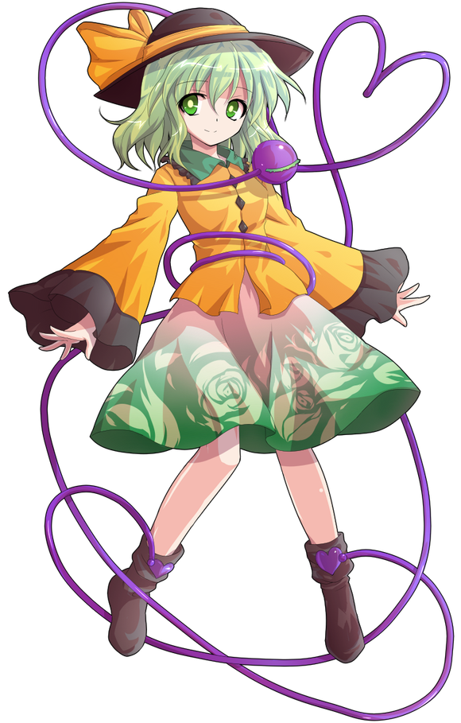

安价选项

1 在【人间之里】遇到了【爱丽丝·玛格特洛依德】

2 在【人间之里】遇到了【上白泽慧音】

3 在【妖怪的树海】遇到了【上白泽慧音】

4 在【人间之里】遇到了【火焰猫燐】

5 在【人间之里】遇到了【河城荷取】

6 在【守矢神社】遇到了【八坂神奈子】

7 在【人间之里】遇到了【古明地恋】

8 在【守矢神社】遇到了【东风谷早苗】

9 在【妖怪之山】遇到了【射命丸文】

10 在【天界】遇到了【稀神探女】

烈海王将在人间之里遇到火焰猫燐

比起前两次来说真是安全的结果

说起来地灵殿众除了勇仪以外烈一个都没见过，要不要借这个机会让他去趟地灵殿呢......还是单纯只是跟阿燐在人里办事呢

交给骰子来决定吧（笑）

那么今天就到这里，星期五的时候就可以看到阿燐了

新人物安价搞得差不多了，正在写交流回中

顺便复盘一下目前好感度60以上的人物（新人物安价中遇到的不算入其中）

1 师匠 98

2 铃仙 84

3 因幡帝 81

4 皮克 100

5 神子 69

6 圣白莲 65

7 红美铃 80

8 芙兰朵露 96

9 风见幽香 95

10十六夜咲夜 71

11 伊吹萃香 66

12 星熊勇仪 94

13 八云紫 81

14 鬼人正邪91

15 少名针妙丸94

16 西行寺幽幽子69

17 魂魄妖梦82

18 博丽灵梦89

天啊，实际列出来怎么60以上的这么多（口吐白沫）

麻烦大家帮我看下有没有少写的或者记错的，谢谢大家

这是发生在烈来到幻想乡的第118天的事情

~永远亭~

烈海王正推着轮椅带魔理沙散步

烈：昨天没能帮上什么忙，真是抱歉

魔理沙：我居然相信你能解决问题，我的脑子也是坏掉了

早知道还不如去找地底的妖怪……

虽说被读心会很丢人，但总好过现在肋骨都没了

烈：师匠昨天说会给你重新做一套肋骨的，不过再被那么抱一次大概还是会断掉

话说回来，地底的读心侦探会来地上吗？

魔理沙：那家伙没事基本不会出门

她的猫和妹妹倒是整天往外跑

烈：那按你昨天的情况好像也只能找我啊

今天给你炖点排骨汤补一下骨头吧

魔理沙：你还好意思说？！我就应该自己去！

汤里多加点蘑菇，谢谢

烈海王前往人间之里去买排骨了

察觉到烈没有跟上来之后，黑猫【1d10:4】

1 跟着烈走回去了

2 开始叫

3 跟着烈走回去了

4 开始叫

5 阿燐 使用了 爪击

6 跟着烈走回去了

7 开始叫

8 阿燐 使用了 疯狂乱抓

9 变成了人形（喂，现在还在人里）

10 大成功/大失败【1d2：2】

黑猫跳到了烈的身前，发出了猫叫

烈：您是找我有事情？

我先回去放个东西，可以吗？

黑猫点了点头

——烈海王与猫走回了永远亭——

~永远亭~

“你就是最近崭露头角的名侦探烈海王吗？咱是来自地灵殿的阿燐”

离开人里之后，黑猫迫不及待地变回了人形

出现在烈面前的，是身穿黑绿色衣物的猫耳少女

她扎着两条红色的麻花辫，手中推着一个蒙着白布的推车，身边有怨灵环绕，给人一种不祥的感觉

阿燐的好感度【1d100：62】

阿燐：看上去不是徒具虚名的人

咱的主人古明地觉大人，在听说你最近的活跃表现后对你感到有些好奇

尤其是昨天兵不血刃干掉魔理沙的手段，真是令人叹为观止

因此呢——这里有一张觉大人的侦探挑战状

如何，有兴趣来试试吗？

烈的战意【1d70：54+30=84】（名侦探烈海王+30）

烈：当然！

虽说昨天第一次的委托搞砸了，但我不会轻易放弃的！

挑战状的内容是【1d10:1】

1 寻找恋恋

2 寻找希望之面

3 揭开某位鬼王的真身

4 寻找恋恋

5 西行妖之谜（认真的？！）

6 铃奈庵的窃书案

7 寻找恋恋

8 八云紫女士今天高寿（为啥啊）

9 竹林失踪案

10 大成功/大失败【1d2：2】

阿燐：这份挑战状的内容是，寻找古明地恋大人！

她是觉大人的妹妹，已经出来玩了【5+1d10：3=8】天都没回家了

烈：这听上去怎么像是私人委托啊……

阿燐小姐，我听说您的雇主本身也是一位资深的侦探，为什么不自己去找妹妹呢？

阿燐的回应是【1d10:10】

1 因为是挑战状所以不告诉你

2 姐妹关系不合（其实挺好的）

3 说明无意识能力

4 因为是挑战状所以不告诉你

5 姐妹关系不合（其实挺好的）

6 说明读心能力

7 因为是挑战状所以不告诉你

8 姐妹关系不合（其实挺好的）

9 全说啦（你的忠诚心呢）

10 大成功/大失败【1d2：1】

阿燐大成功！（大成功方向为帮助觉赢得挑战/快速找回恋）

大成功是什么【1d10：7】

1 本次事件中烈无法从阿燐处得到任何信息

2 姐妹吵架了（烈会相信的谎言）

3 说明无意识能力与恋恋的情报

4 本次事件中烈无法从阿燐处得到任何信息

5 姐妹吵架了（烈会相信的谎言）

6 说明读心能力与恋恋的情报

7 本次事件中烈无法从阿燐处得到任何信息

8 姐妹吵架了（烈会相信的谎言）

9 全说啦+恋恋的情报

10 大成功/大失败【1d2：1】

阿燐：嘻嘻，遗憾的是这也是挑战状的一部分

有关于觉大人和恋大人的任何情报，在本次事件中咱都不会告诉你的~

烈的对应是【1d10:6】

1 做完饭之后开始调查

2 硬着头皮用推理

3 这里就用我烈海王的口才

4 做完饭之后开始调查

5 硬着头皮用推理

6 这里就用我烈海王的直觉

7 做完饭之后开始调查

8 硬着头皮用推理

9 现在立刻出发！（永远亭的空气午餐）

10 大成功/大失败【1d2：2】

烈：又是什么线索都没有的开局……

先尝试一下我的直觉吧

烈的直觉【1d100:73】（50以上少量信息，75以上大量信息，90以上绝大多数信息）

烈：我想，您雇主的姐妹关系应该不错，否则您说话的时候不会这么轻松

明明是关系很好的姐妹，却不自己出来找的原因——大概是那位恋小姐拥有抵抗读心的能力，又或者觉小姐自己不适合出门吧？

阿燐：谁知道呢？

这方面咱什么话都不会说的~

顺便一提，本次挑战的期限为1天

今晚之后如果还没有找到恋大人，你就失败了！

烈：真是铁壁般的防守

那么稍等我做完中午的菜，之后就开始寻找古明地恋小姐

——午饭时间后——

烈要做什么？【1d10：10】

1 询问阿燐恋恋常去的地方

2 收集情报

3 去问问神子殿下吧（为啥啦）

4 询问阿燐恋恋常去的地方

5 收集情报

6 突袭地灵殿（为啥啦）

7 询问阿燐恋恋常去的地方

8 收集情报

9 去人间之里转转吧

10 大成功/大失败【1d2：1】

烈海王大成功！

大成功是什么？【1d10:5】

1 烈从阿燐的面部表情推测出了恋恋常去的地方

2 其实以前收集过恋恋的情报（可以看到恋恋）

3 神子：烈，最近有个奇怪的家伙来找秦心了

4 烈从阿燐的面部表情推测出了恋恋常去的地方

5 其实以前收集过恋恋的情报（可以看到恋恋）

6 觉：想了想还是不放心，我亲自出马吧

7 烈从阿燐的面部表情推测出了恋恋常去的地方

8 其实以前收集过恋恋的情报（可以看到恋恋）

9 恋恋：你是谁啊？

10 大成功/大失败【1d2：2】

烈：刚刚做饭的时候我顺便回想了一下以前收集过的情报

古明地恋似乎拥有着操控无意识程度的能力

具体的表现就是，即使她就站在人群正中，也没有人会注意到她

同时，古明地恋自己平常也是“无意识”的行动的，她还可以操纵他人的无意识

外貌方面的话，是身穿黄色上衣带深绿色帽子的，有着浅绿色头发的小女孩

我没说错吧？

阿燐的震惊【1d100：63】

阿燐：惊了，咱可什么都没说过啊！

你到底是从哪得到的这些消息啊？

烈：能力方面，是从人里的流言与对读心能力的耐性所推测出来的

外貌方面，则是通过天狗的报纸——那上面偶尔也会有些有价值的照片

阿燐：那么名侦探先生

你现在准备做什么呢？

烈的行动是【1d10：8】

1 用排除法一个个地方找过去

2 用阿燐当诱饵

3 去问问神子殿下吧

4 用排除法一个个地方找过去

5 用阿燐当诱饵

6 突袭地灵殿（为啥啦）

7 用排除法一个个地方找过去

8 用阿燐当诱饵

9 烈：你就在这里吧，古明地恋小姐？

10 大成功/大失败【1d2：1】

烈：我现在倒是有个蛮简单的计划，不知您是否愿意配合

我们可以在人流量较大的地方放出“来自地底的猫妖被巫女抓走了”的谣言

如果古明地恋小姐听到了说不定会过来看一眼

而在了解基本情报后，有了准备的我是可以看到恋小姐的

阿燐的抵触【1d100：23】（30以下成功）

阿燐：只要咱不会真的被那个巫女退治就没问题哒

上一次虽说事出有因，但还是被揍得超惨的……

顺便一提咱是火车妖怪，不是单纯的猫妖

烈：不好意思，这方面我实在不太了解

灵梦小姐是个很和善的人

我想如果好好跟她讲道理，就算是妖怪她也不会随便出手的

灵梦：说起来上次间歇泉异变的时候你也是这个态度

阿空，恋，觉，总感觉你们地灵殿全都在受你照顾啊？

阿燐：唯一能正常交流的觉大人又不出门

最后就变成咱天天往外跑了

烈：仔细回想一下，妖梦小姐，咲夜小姐，阿燐小姐还有我和铃仙前辈……

幻想乡的职场环境，怎么一个个压力都这么大啊

烈前去散播流言了

流言的效果是【40+1d60：11=51】（忠厚老实烈海王+30，阿燐+10）（75以上恋恋突袭神社，50以上恋恋听到流言）

恋恋：咦？阿燐因为偷尸体而被灵梦捉走了？

恋恋的行动是【1d10：10】

1 去看看吧

2 过一会再去吧（之后过无意识判定）

3 找秦心帮忙

4 去看看吧

5 过一会再去吧（之后过无意识判定）

6 找阿空帮忙（你认真的？）

7 去看看吧

8 过一会再去吧（之后过无意识判定）

9 我无意识

10 大成功/大失败【1d2：1】

恋恋大成功！

大成功是什么？【1d10：3】

1 这是有人想找我

2 我无意识

3 让秦心去当工具人

4 这是有人想找我

5 我无意识

6 让阿空去当工具人

7 这是有人想找我

8 我无意识

9 我回家啦！

10 大成功/大失败【1d2：2】

恋恋前往神灵庙

~神灵庙~

恋恋：秦心~我的宠物被巫女抓走了，帮我抢回来吧~

恋恋的说服【1d50：26+50=76】（大成功+50,75以上通过）

秦心：居然会来找我求助

那我就帮你一把吧，我的宿敌哟

说起来你俩是怎么认识的【1d10:9】

1 感情异变结束后命运般相遇了

2 秦心去地下玩的时候遇见的（为啥你会去地下啊）

3 恋恋去神灵庙玩得时候遇见的

4 感情异变结束后命运般相遇了

5 阿燐的介绍（为啥啦）

6 神子的介绍（为啥啦）

7 感情异变结束后命运般相遇了

8 秦心去地下玩的时候遇见的（为啥你会去地下啊）

9 恋恋去神灵庙玩的时候遇见的

10 大成功/大失败【1d2：1】

恋恋：之前过来玩的时候，没想到你能看到我呢

秦心：那时候你看起来还很正常

不像现在这样，神出鬼没的

两人前往博丽神社了

~博丽神社~

在神社的鸟居前威风堂堂地站立着的，正是感情的掌控者 面灵气 秦心

秦心：事情我已经听说了

把我宿敌的宠物交出来！

恋恋：哦哦，好帅气！

阿燐：咦？为什么会是这孩子过来啊

我记得她是恋大人的朋友来着

烈的行动是【1d10:8】

1 这里就用我烈海王的口才

2 把阿燐交出去

3 来，再打一场

4 这里就用我烈海王的口才

5 这里就用我烈海王的推理

6 来，再打一场

7 这里就用我烈海王的口才

8 The World！时停找人（为啥啊）

9 来，再打一场

10 大成功/大失败【1d2：2】

烈：秦心小姐刚刚提到了她的宿敌，那应该就是恋小姐

她会过来这里，就代表着恋小姐已经注意到这件事情了

我想恋小姐现在就在附近的可能性十分之高

阿燐：但是就算恋大人愿意出来，我们也根本看不到她啊

烈：这点请您放心

我之前已经做好了充足的情报收集

只要将注意力集中到极致——在短暂的时间内，发现她的踪迹还是可以做到的！

秦心：烈海王？为什么你在这里

烈：抱歉，稍后再跟你解释

【The World！】

秦心：又是这招？！

——【The World】——

烈海王久违的发动了假腿的能力

时间只有短短数秒，他开始了无人妨碍的全力搜索

烈的搜索【1d40：31+60=91】（名侦探+30，时停+30）（90以上成功）

烈：找到了！

在神社正殿的房顶上，无意识的妖怪正欢乐地漂浮着

她是有着浅绿色的披肩发和瞳孔的少女，头戴深绿色的帽子，身穿黄色的上衣。帽子上饰有与衣服颜色同为黄色的缎带与蝴蝶结。

少女的身旁以爱心的形状缠绕着觉妖怪的第三只眼，不知为何，其眼睑是闭合的

烈：接下来先把阿燐小姐带过来——

然后时间开始流动

恋恋：咦？你是谁？

阿燐也在啊~

烈：我是永远亭的侦探烈海王

这一次是接受了你姐姐的委托来找你的

阿燐：真的找到了！

恋大人你该回家了，觉大人很担心你啊

恋恋的好感度【1d90：77+10=87】（看到恋恋+10）

恋恋：你能看到我吗？

烈：我们武术家应当是无时无刻都做好了战斗准备的

但即使如此，我也只能在精神高度集中的时候发现你

恋小姐，你的无意识真的很厉害

恋恋：哇~太好了~

下一次去永远亭玩吧~

秦心的混乱【1d100：82】

秦心：哎？这次又是搞什么？

不是来攻击我的？

反而跟我的宿敌聊起来了？！

灵梦：这都什么乱七八糟的……

【1d10：10】分钟后

烈的说明【1d100：4】大失败

烈：哦哦哦哦哦哦哦哦哦哦哦哦哦！

由于想说的话太多了，烈海王挥舞着双拳开始胡言乱语了

阿燐：咱今天是第一次遇到他，这人一直这样吗？

推理的时候很聪明，结果日常交流完全不行？

秦心：他以前就这样

这一位可是会对着用出必杀技的对手使用时停的人

大失败是什么？【1d10:5】

1 阿燐：对他用猫车吧

2 灵梦：你吃梦想封印冷静一下吧（战斗不能）

3 秦心愤怒了（开战）

4 紫出来捣乱了（为啥啦）

5 阿燐：对他用猫车吧

6 灵梦：你吃梦想封印冷静一下吧（战斗不能）

7 秦心愤怒了（开战）

8 恋恋：原来如此，是要打弹幕战吗？（开战）

9 阿燐：对他用猫车吧

10 大成功/大失败【1d2：2】

阿燐：把他塞进猫车里冷静一下吧！

恋恋：我来帮忙！

秦心：算我一个

在三人的齐心协力之下，混乱的烈海王被塞进了猫车

烈在猫车中冷静了【1d20：18】分钟

烈：——不好意思，我失态了

但无论怎么说这都好过分啊

那个小车里全都是 尸 体 啊！

阿燐：这是咱的工作道具哦

咱平时的工作就是来地上收 尸 体 的

灵梦：哦，这么一提我还想起来了

你可不许去挖坟啊，被我听到类似的消息就等着吃封魔针吧

“拜拜~”

夕阳西下，无意识的妖怪牵着阿燐的手，准备回家了

阿燐：只用了半天就找到恋大人了

咱不得不承认，你是厉害的侦探啊

但交流能力真的是噩梦级，太可怕了

烈：第二次的委托总算是成功了，太好了

阿燐：啊！忘记跟你讲了

这一次的挑战成功后【1d10：5】

1 没有任何奖励（阿燐好感度+【1d10】）

2 觉大人会欣赏你（觉好感度+【1d10】）

3 来自地灵殿的宴会邀请

4 没有任何奖励（阿燐好感度+【1d10】）

5 觉大人会欣赏你（觉好感度+【1d10】）

6 下一次一起破案吧

7 没有任何奖励（阿燐好感度+【1d10】）

8 觉大人会欣赏你（觉好感度+【1d10】）

9 觉大人的语文补习（为啥啦）

10 大成功/大失败【1d2：2】

阿燐：没有什么奖励……只是觉大人会觉得你很厉害而已

烈：我无所谓

帮助一位姐姐找到了她的妹妹，这本身对我而言就是一件非常有意义的事情了

猫带着妹妹离去了

秦心：我到刚刚为止都在干什么啊？

灵梦：我一直在喝茶哦

来，给你一杯

烈：灵梦小姐，这次真是多谢你的配合

不过，我总不能平白要求人家帮忙

请问你有什么想要的报酬吗？

灵梦想要的报酬是【1d10：3】

1 我无所谓

2 带魔理沙来神社

3 宴会的准备

4 我无所谓

5 带魔理沙来神社

6 钱

7 我无所谓

8 带魔理沙来神社

9 帮忙解决异变

10 大成功/大失败【1d2：2】

灵梦：那【1d10：1】天后办宴会的时候你来准备料理吧！

老是让咲夜一个人准备也有点过分了

魔理沙那家伙又只会做魔女的浓汤……

烈：当然没有问题

到时候我会推着魔理沙小姐一块来的

灵梦：把辉夜她们也叫过来吧

反正每一次办到最后，没邀请的家伙们也会自己过来的

~永远亭~

例行的烈海王讲故事时间

烈的说明【1d100：19】

烈海王开始手舞足蹈地大叫了

辉夜：皮克，翻译翻译

皮克：嗷嗷嗷嗷嗷嗷嗷哦啊

（这我也听不懂啊）

【1d20：5】分钟后

师匠：只花了半天的时间就找到无意识的妖怪了

不仅是解决异变，日常委托也是一把好手啊

魔理沙：——你等一下

寻找恋恋这种高难度委托你花了半天搞定

帮我应付约会这种委托你搞到最后是让老子躺轮椅？！

你果然是故意的吧！

烈：魔理沙小姐昨天那个我真的觉得不能全怪我

有话好好说您先把八卦炉放下行吗那玩意看上去好危险啊已经在冒火了您停手啊！

铃仙：这两个人关系到底是好是坏啊？

因幡帝：相性超级差但又不算厌恶，大概是这样的感觉吧？

~地灵殿~

在地底大都市旧都的中心，有着一幢大型别墅建筑

在这个宽敞得要命的建筑物中，只有古明地姐妹二人与她们的宠物居住

阿燐：觉大人，咱完成任务啦

不过恋大人刚回来就去找阿空玩了

觉：等到晚饭的时间她自己会回来的

话说回来，这次的挑战只用了半天吗……

那么下一次，就尝试一下更高难度的挑战吧

阿燐：（您只是想玩吧……）

觉：这就是所谓的，生活中的乐趣呢

阿燐：（啊，在地上待久了咱都忘了）

觉：猫的记性也就比鸟好点，啧啧

（由于此次觉与烈海王没有直接见面，因此先不骰好感度）

第118天结束！

~彩蛋~

第二天的宴会

烈的厨艺【1d45：22+55=77】

灵梦：还不错哦

这样子以后就不用成天麻烦咲夜啦

魔理沙：明明是博丽神社的宴会，你却老是只出一个场子

这样看来就只是妖怪们自备饮食来神社喝酒而已啊

灵梦：爱丽丝~帕秋莉~

这边这边，魔理沙在这里哦

魔理沙：灵梦你害我！

我错了不要啊！！

快放我走啊！！！

魔理沙被两个魔女围了起来

魔法使三人组在吵吵嚷嚷了一阵子之后，不知为何又平静了下来

她们愉快地谈了一阵子——之后，又可以听到魔理沙的惨叫了

虽然气氛很紧张，不过似乎没有生命危险（？）的样子

烈：说是宴会，感觉大家都在喝酒

而且怎么看上去都是些熟人啊

幽香：因为大家都喜欢灵梦啊

与你这种评价两极分化的家伙不同，灵梦可是真正人见人爱的巫女呢

烈：幽香女士，您也来了？

我还以为您不适应这种场合的

幽香：偶尔离开花田走走也不错

而且嘛，一般来说宴会开到最后——

就该打弹幕战了

烈的恐惧【1d100：47】

烈：有点害怕，但我也蛮想看看真正强者们之间的战斗

幽香：看不到的~

只能看到酒鬼们毫无章法的弹幕而已

夏季来到了末尾，但天气仍然炎热

无论是弱小的妖精还是强大的妖怪和鬼，都在巫女的地盘上肆无忌惮地嬉戏打闹着

平日压力极大的几位中间管理层，现在正偷偷聚在一起发牢骚

她们的老板唯独此时会睁一只眼闭一只眼——毕竟，博丽的巫女就在身旁

烈：这也不错啊

幽香：一直都是这样的

惟一的区别只是来参加宴会的人越来越多了

烈：就像我一样？

幽香：对，就像你一样

相互碰了碰杯，武术家与花之暴君缓缓地喝着酒

现在的他们早已不是宴会外的旁观者，而是乐于参与其中的一份子了

（本日上午的更新结束）

（下一次的更新....在下午或者明天或者一会之后）

（以下是我的废话）

这一次尝试把新人物安价回写成了一个日常小事件这样的感觉

最后回过头来看感觉最重要的阿燐戏份反而有点少，应该是我对人物把握不当而引起的失误

果然下一次还是围绕单一人物展开比较好吧？

烈海王这个大成功就离谱

而且怎么又抽中了假腿，这个选项是我看到秦心来了之后放进去的梗选项怎么还真中了

作为补偿给了一个90以上成功的高标准，还真成了，一如既往的快速通关

然后话术，三次，没一个正常的

我怀疑这是骰子的官方迫害

魔理沙的肋骨在修好之前大概都会在永远亭（笑）

不过也就是交流回结束之前的事，本次交流回结束之后会有个魔理沙出院的小彩蛋，大家可以放心

话说回来，这次交流回一如既往的搞事

全发出来已经比安价还要长挺多了，所以等我看看今天的时间安排吧

骰子下一层发

附上本次的骰子

