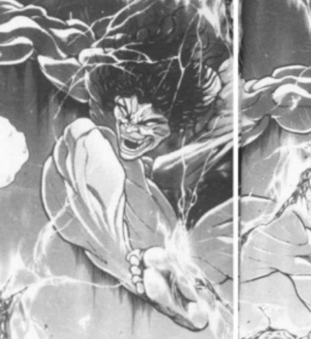
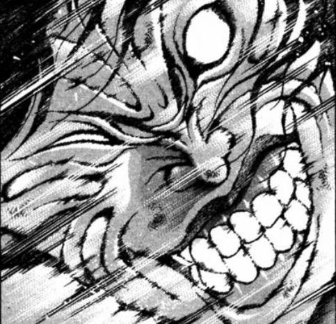

目前好感度大于60的角色是（新人物回遇到的角色不算，未登场角色如莉格露不算，已经骰了但剧情里没和烈正式见面的如蕾米莉亚不算）

1 师匠 98

2 铃仙 84

3 因幡帝 81

4 皮克 100

5 神子 69

6 圣白莲 65

7 红美铃 80

8 芙兰朵露 96

9 风见幽香 95

10十六夜咲夜 71

11 伊吹萃香 66

12 星熊勇仪 94

13 八云紫 81

14 鬼人正邪91

15 少名针妙丸94

16 西行寺幽幽子69

17 魂魄妖梦82

18 博丽灵梦89

那么开始决定这30天内的交流回

第一位【1d18:4】皮克

1 师匠 98

2 铃仙 84

3 因幡帝 81

4 神子 69

5 圣白莲 65

6 红美铃 80

7 芙兰朵露 96

8 风见幽香 95

9十六夜咲夜 71

10 伊吹萃香 66

11 星熊勇仪 94

12 八云紫 81

13 鬼人正邪91

14 少名针妙丸94

15 西行寺幽幽子69

16 魂魄妖梦82

17 博丽灵梦89

第二位【1d17：14】少名针妙丸

1 师匠 98

2 铃仙 84

3 因幡帝 81

4 神子 69

5 圣白莲 65

6 红美铃 80

7 芙兰朵露 96

8 风见幽香 95

9十六夜咲夜 71

10 伊吹萃香 66

11 星熊勇仪 94

12 八云紫 81

13 鬼人正邪91

14 西行寺幽幽子69

15 魂魄妖梦82

16 博丽灵梦 89

第三位 【1d16：1】八意永琳

第一位 皮克

这件事发生在烈海王来到幻想乡的第【117+1d30：26=143】天

具体的事件是？【1d10:9】

1 与皮克的再战

2 皮克的完美数学教室

3 皮克去狩猎了！

4 与皮克的再战

5 皮克的完美数学教室

6 皮克的语文辅导班（辅导烈的语文）

7 与皮克的再战

8 皮克的完美数学教室

9 皮克想要打弹幕战（为啥啊）

10大成功/大失败【1d2：2】

现在是下午2点半，一天之中气温最高的时候

烈海王提着一袋子冰水果，准备做些甜品解暑

就在这时，皮克来了

烈：皮克？我记得你不爱吃水果啊

皮克：嗷嗷嗷嗷嗷嗷啊

（我想打弹幕战）

烈：你要打弹幕战？跟谁？我吗？

皮可的对手是【1d100：2】（30以上烈，30以下随机人物）大失败

皮克大失败！

大失败的对手是【1d10:2】

1 风见幽香

2 蓬莱山辉夜

3 八意永琳

4 风见幽香

5 蓬莱山辉夜

6 藤原妹红

7 风见幽香

8 八云紫（你认真的？）

9 八坂神奈子（为啥啦）

10 大成功/大失败【1d2：1】

皮克（手写）：其实是想要跟辉夜公主打一场

以前刚过来的时候曾经尝试过与她战斗，结果被打的相当惨

烈：那你来找我干吗？

皮克为什么要找烈？【1d10:8】

1 希望传授弹幕战经验

2 希望帮忙加油

3 希望推理出辉夜的弱点

4 希望传授弹幕战经验

5 希望帮忙做点高热量食物补充体力

6 希望推理出辉夜的弱点

7 希望传授弹幕战经验

8 与烈海王一起战斗！（为啥啊）

9 希望推理出辉夜的弱点

10 大成功/大失败【1d2：2】

皮克（手写）：说实话我觉得一个人上阵大概还是打不过

所以烈海王，要一起来吗？

烈的拒绝【30+1d70：1=31】（武术家的尊严+30，50以上拒绝）

烈：我无所谓！

以辉夜小姐的实力，别说我们一起上阵，就算拉上铃仙前辈与帝小姐也只会被一齐暴揍而已

这可不是数量能补上的实力差啊

正好借这个机会，看看如今的我与真正的强者之间差距有多大！

——皮克和烈去找辉夜了——

辉夜：哈？

你们俩想打架？

跟我一个？

辉夜的战意【1d100：81】

辉夜要叫外援吗【1d10：1】

1 我一个人就够了

2 妹红招来

3 永琳~

4 我一个人就够了

5 妹红招来

6 魔理沙！（你肋骨好了吗？）

7 我一个人就够了

8 妹红招来

9 莉格露（为啥啊）

10 大成功/大失败【1d2：1】

辉夜：正好，我也有段时间没运动过了

那就陪你们玩玩吧，就当做跟妹红见面前的热身战——

别被打哭哦

辉夜：不过，皮克的实力也就刚刚达标

烈海王，你又如何呢？

辉夜的秒杀【1d100：12】（50以上成功）

烈：我到今天为止也与各种各样的对手战斗过了

这种程度的攻击，还是消得掉的！

战斗！

烈海王

Atk：216（120）

Hp：17

技能

烈 海 王：海王是中华武术的巅峰，烈海王又是其中佼佼者，凭借高超的技术使战斗力X1.8

消力：传自郭海皇的绝学，普通攻击以及近战系技能所造成的的最终伤害/2（对战斗力230以上的对手无效）

四千年的传承：不会陷入异常状态，面对近战系、技术系的技能可以进行【1d100】的破解判定，75以上成功

Flower Shooting（CT3）：（弹幕类）同时发出五个方向的大范围花弹，对对手造成必中的【1+1d4】点伤害。

假腿【The World】:一天一次，使用假腿中的力量进行一次超快速移动。本回合战斗自动胜利且造成的伤害必中。（对战斗力低于160的对手使用的情况下直接判定战斗结束，胜者烈海王）

必杀技

武之怀（CT5）：3T内Atk+60。3T内可对所有攻击进行【1d100】的破解判定，普通攻击与近战系、技巧系技能30以上成功，其余技能50以上成功，必杀技75以上成功。

超人烈海王（CT6）：Atk+650，给予伤害X4，之后2T回避概率翻倍

天文密葬法（CT9）：一天仅能使用能够一次【？？？】/引导宇宙的力量，发出轨道诡异的大量弹幕轰击无法回避/破解/防御Atk+850，给予伤害X5

皮克

Atk 240

Hp 24

技能

原始人：与常规意义上的人类根本不是一个物种，普通攻击对对手造成的伤害X2，同时自己受到普通攻击的伤害X2

白垩纪的肉体：拥有高速回复的能力，每回合Hp+1

与朋友的回忆（CT3）：（自身加持类）通过与朋友们的战斗而积累了无数的战斗记忆，可以对所有攻击进行一次【1d100】的破解判定，普通攻击与技能50以上成功，必杀技75以上成功

高速冲击（CT4）：（近战类）四肢着地，以急速向对手冲刺 Atk+100，造成的伤害+3

必杀技

最终形态（CT5）：自身变化为完全的战斗形态 3T内每回合Hp+2，Atk+80，对对手造成伤害后进行一次【1d100】的受伤判定，50以上+2伤害，75以上+3伤害，90以上+4伤害

新难题【金阁寺的整块天花板】（CT7）：完全就是举起一块超大的天花板砸下来而已，无法回避/破解/防御 Atk+775，给予伤害X5

蓬莱山辉夜

Atk 260（？？？）

Hp 4X4（无限大）

技能

永远与须臾的罪人：Hp无限，对时停/隙间等特殊攻击免疫

点到为止：随便玩玩，不出全力，Atk变为260，在战斗中被击破4次后败北

难题【龙颈之玉　-五色的弹丸-】（CT1）：（弹幕系）一场战斗中只能使用一次，以龙颈上的玉石作为弹幕进行攻击，对对手进行6次【1d100】的受伤判定，70以上成功，对对手造成成功次数+2的伤害

难题【佛御石之钵　-不碎的意志-】（CT2）：（弹幕系）一场战斗中只能使用一次，用钻石打造成的钵放出激光攻击对手，本回合Atk+100，对对手造成的伤害+2

难题【火鼠的皮衣　-不焦躁的内心-】（CT3）：（弹幕系）一场战斗中只能使用一次，使用燃烧着的皮衣放出弹幕进行攻击，3T内对手的Atk-60

难题【燕的子安贝　-永命线-】（CT4）：（自身加持系）一场战斗中只能使用一次，放出无限喷涌的生命之泉，2T内自身受到的伤害为0

难题【蓬莱的弹枝　-七色的弹幕-】（CT5）：（弹幕系）一场战斗中只能使用一次，令蓬莱之树化作七色的弹幕，对对手造成【3+1d5】的伤害

必杀技

新难题【艾哲红石】（CT6）：使用极热的红石进行攻击，Atk+650，给予伤害X4，对手进入烧伤状态，战斗结束前Atk-20

新难题【金阁寺的整块天花板】（CT7）：完全就是举起一块超大的天花板砸下来而已，无法回避/破解/防御 Atk+800，给予伤害X5

【永夜返】（Hp第四次归0时发动）：？？？

BGM：竹取飞翔　～ Lunatic Princess

T1

辉夜：到现在为止，已经使无数人败退的这五个难题。

你们两人能解开几道呢？

符卡宣言 难题【龙颈之玉　-五色的弹丸-】

烈的受伤【6X1d100：18 6637 93 53 53】通过一次

Hp：17-2-1=14

皮克的受伤【6X1d100：85 1820 2 19 70】通过二次

Hp：24-2-2=20

辉夜的攻击【260+1d100：76=336】

烈的攻击：差值大于100自动失效

皮克的攻击【240+1d100：90=330】

烈的受伤【1d10:5】

1 回避

2 小伤害

3 小伤害

4 中伤害

5 中伤害

6 大伤害

7 大伤害

8 特大伤害

9 特大伤害

10 大成功/大失败【1d2：2】

Hp：14-2=12

皮克的受伤

【1d10:8】

1 回避

2 小伤害X2

3 小伤害X2

4 中伤害X2

5 中伤害X2

6 大伤害X2

7 大伤害X2

8 特大伤害X2

9 特大伤害X2

10 大成功/大失败【1d2：1】

Hp：20-4X2=12

Hp：12+1=13

烈：没想到辉夜小姐的臂力居然比皮克还要强大

皮克：你哪还算是人

（她可是能够独自举起天花板的人！）

T2

辉夜：现在是第二道难题

符卡宣言 难题【佛御石之钵　-不碎的意志-】

辉夜的攻击【260+1d100:93+100=453】

差值大于100自动成功

烈的受伤【1d10:7】

1 回避

2 小伤害+2

3 小伤害+2

4 中伤害+2

5 中伤害+2

6 大伤害+2

7 大伤害+2

8 特大伤害+2

9 特大伤害+2

10 大成功/大失败【1d2：1】

Hp：12-3-2=7

皮克的受伤

【1d10:6】

1 回避

2 小伤害X2+2

3 小伤害X2+2

4 中伤害X2+2

5 中伤害X2+2

6 大伤害X2+2

7 大伤害X2+2

8 特大伤害X2+2

9 特大伤害X2+2

10 大成功/大失败【1d2：2】

Hp：13-3X2-2=5

Hp：5+1=6

T3

辉夜：这可才是第三道难题哦

符卡宣言 难题【火鼠的皮衣　-不焦躁的内心-】

与朋友的回忆发动

面对着辉夜放出的火焰之衣，皮可脑中所浮现的是

在遥远的过去，火山喷发时的景象

被火焰所灼烧是很疼的

把火焰吞下去也是很疼的

因此不能正面突破……要想个办法躲过去！

皮克的破解【1d100：41】成功

烈：皮克，你战胜了吗！将那份火焰！

辉夜的攻击【260+1d100：79=339】

皮克的破解【1d100：32】成功

皮克回想起了，在外界的战斗

那里有许多奇妙的朋友……

会挥出超快的拳头的人

会与他互相撕咬的人

会使用技术获得优势，却在最后选择比拼力气的人

以及现在就站在他身边的，会使用武术的人

他们一直都支持着皮克

辉夜的攻击很强大，但是不如他们灵巧

因此可以吞食

因此可以击倒

因此可以战胜！

辉夜的受伤【1d10：8】

1 回避

2 小伤害X2

3 小伤害X2

4 中伤害X2

5 中伤害X2

6 大伤害X2

7 大伤害X2

8 特大伤害X2

9 特大伤害X2

10 大成功/大失败【1d2：1】

Hp：4-4X2=0

烈：赢了，皮克！

皮克：嗷嗷嗷啊哦哦哦啊啊

（还没有，只成功了一次！）

只是短暂的一瞬——在格斗家们面前，蓬莱山辉夜又恢复到了完好无损的状态

辉夜：还不错啊，已经能够打倒我一次了

那么——还有三次，你们能够成功几次呢？

烈的攻击（由于辉夜的攻击被破解，自动成功）

辉夜的受伤【1d10：2】

1 回避

2 小伤害

3 小伤害

4 中伤害

5 中伤害

6 大伤害

7 大伤害

8 特大伤害

9 特大伤害

10 大成功/大失败【1d2：2】

Hp：4-1=3

烈：补上一次弹幕攻击！

Flower shooting发动

辉夜的受伤【1+1d4：2=3】

Hp：3-3=0

辉夜：现在是第二次

烈海王，你也变强了不少啊

皮克的Hp：6+1=7

T4

辉夜：接下来，第四道难题

符卡宣言 难题【燕的子安贝　-永命线-】

辉夜的攻击【260+1d100：30=290】

皮克四肢着地，摆出了冲刺的姿势

烈：皮克！先等一下，情况不对！

烈的劝阻【1d100：13】（50以上成功）

皮克没有听从烈海王的劝说

高速冲击发动！

皮克的攻击【240+100+1d100：1=341】

烈的攻击【1d100：92+216=308】

辉夜的受伤【1d10:4】（皮克的攻击）

1 无伤

2 无伤

3 无伤

4 无伤

5 无伤

6 无伤

7 无伤

8 无伤

9 无伤

10 无伤

辉夜的受伤【1d10:2】（烈的攻击）

1 无伤

2 无伤

3 无伤

4 无伤

5 无伤

6 无伤

7 无伤

8 无伤

9 无伤

10 无伤

辉夜：哈哈哈哈！残念的是，你们的攻击在这2T内是无效的！

烈：……皮克

你为什么会想要跟她打架啊

皮克：嗷嗷嗷嗷嗷嗷嗷啊

（我上次还没遇到这张符卡就输了……）

皮克的Hp：7+1=8

T5

辉夜：这是最后的难题了

符卡宣言 难题【蓬莱的弹枝　-七色的弹幕-】

烈： 将身体交给武术……

武之怀发动

烈的破解【1d100：83】成功

辉夜：啧，五个难题都通过了

下一次就用神宝吧

辉夜的攻击【260+1d100：36=296】

烈的破解【1d100：2】失败

烈的攻击【216+60+1d100：91=367】

最终形态发动

皮克咆哮着，变成了他真正的战斗形态

四肢弯折，筋肉暴涨，其身侧还能够看到霸王龙所留下的印记

那副模样与现在的人类可谓是完全不同——那是当之无愧的史前的凶兽！

皮克的攻击【240+1d100：26+80=346】

辉夜的受伤：0+0=0

皮克的Hp：8+2+1=11

T6

烈：辉夜小姐！你的五个难题，我们都战胜了！

辉夜：值得嘉奖，值得鼓励，我都想为你们鼓掌了

接下来，迎接新的难题吧

符卡宣言 新难题【艾哲红石】！

烈：还有啊！？

皮克：嗷嗷嗷啊哦哦哦啊啊

（她后面还有更过分的招式嘞）

与朋友的回忆发动

烈的破解【1d100：59】失败

皮克的破解【1d100：71】失败

辉夜的攻击【650+260+1d100：94=1004】

超人烈海王发动

烈的攻击【216+60-20+650+1d100：66=972】失败

烈的破解【1d100:98】成功

皮克的攻击：差值大于100自动失败

皮克的破解【1d100：63】成功

辉夜的受伤【1d100：10】不受到伤害加成

使用超人术的武术家，与变身为凶兽的原始人

在过去的地下竞技场中，两人曾经生死厮杀

在现在的迷途竹林里，两人面对不讲理的难题并肩作战

其结果毫无疑问——是格斗家的胜利！

辉夜的受伤【1d10：1】（烈的攻击）（超人烈海王已在交锋中用去）

1 回避

2 小伤害

3 小伤害

4 中伤害

5 中伤害

6 大伤害

7 大伤害

8 特大伤害

9 特大伤害

10 大成功/大失败【1d2：2】

辉夜的受伤【1d10：4】（皮克的攻击）

1 回避

2 小伤害X2

3 小伤害X2

4 中伤害X2

5 中伤害X2

6 大伤害X2

7 大伤害X2

8 特大伤害X2

9 特大伤害X2

10 大成功/大失败【1d2：2】

Hp：4-2X2=0

辉夜：第三次了

我可真是没有想到，你们能够打到这个地步

烈：好机会，现在再用一次Flower Shooting！

辉夜的受伤【1+1d4：1=2】

Hp：4-2=2

皮克：嗷嗷嗷哦啊哦啊啊

（下一回合，最过分的那一招就要来了！）

皮克的Hp：11+1+2=14

T7

辉夜：我不得不承认，你们确实变强了

皮克刚来的时候，只能撑到第三道难题就输了

而烈海王刚来的时候，估计也就第二道题再加点普通的弹幕吧？

那么——为了嘉奖你们的努力，就再给你们一道新题吧

符卡宣言 新难题【金阁寺的整块天花板】！

辉夜举起了一块巨大的天花板

然后，直接把它压了下来！

烈：这什么鬼符卡？！这完完全全就是暴力攻击吧！

皮克：嗷嗷嗷嗷嗷哦啊啊

（这也是你曾经教给我的招式，辉夜小姐！符卡宣言  新难题【金阁寺的整块天花板】！）

原始人也举起了一块天花板

在永远亭的上空，两块天花板相撞了！

辉夜的攻击【260+800+1d100：95=1155】

皮克的攻击【240+80-20+775+1d100：63=1138】

烈的攻击：差值大于100自动失败

皮克的受伤【1d10:6】

1 小伤害X2X3

2 小伤害X2X5

3 小伤害X2X5

4 中伤害X2X5

5 中伤害X2X5

6 大伤害X2X5

7 大伤害X2X5

8 特大伤害X2X5

9 特大伤害X2X5

10 大成功/大失败【1d2：2】

Hp：15-3X2X5=0

烈的受伤【1d10:5】

1 小伤害X3

2 小伤害X5

3 小伤害X5

4 中伤害X5

5 中伤害X5

6 大伤害X5

7 大伤害X5

8 特大伤害X5

9 特大伤害X5

10 大成功/大失败【1d2：1】

Hp：7-2X5=0

辉夜：强韧☆无敌☆最强！

粉碎☆玉碎☆大喝彩！

你们两个想要赶上我，还早了一万年呢！

战斗结束

胜者：蓬莱山辉夜

魔理沙：哈哈哈哈哈哈哈！烈海王被金阁寺的天花板压成饼了！

烈：皮克……你变强了好多啊！

皮克：嗷嗷嗷嗷嗷嗷啊

（你也一样，烈海王！）

在巨大的天花板下方，两个鼻青脸肿的格斗家看着对方那惨不忍睹的样子，哈哈大笑

辉夜：差点就被这两个笨蛋打出全力了

师匠：公主大人，辛苦了~

辉夜：我去找妹红玩了

皮克，烈海王！你们俩负责收拾亭子！

本日的最终结局是，两个浑身上下缠满绷带的格斗家，在永远亭中默默打扫着战斗后的烂摊子

顺便一提，魔理沙坐在轮椅上笑得相当开心

进行了一场愉快（？）的战斗！

皮克的好感度已经100了，因此不会上升

皮克：嗷嗷嗷嗷嗷嗷哦啊哦啊

（朋友变得更强了，我也同样变强了）

（不过，我变得更加聪明了，朋友却不会好好说话了）

（是我赢了！）

第143天结束

第二位 少名针妙丸

这件事发生在烈海王来到幻想乡的第【117+1d30：28=145】天

具体的事件是【1d10:4】

1 针妙丸想要给正邪送礼物

2 针妙丸来视察武术培训班了

3 针妙丸想要改造烈的假腿（为啥啦）

4 针妙丸想要给正邪送礼物

5 针妙丸来视察武术培训班了

6 针妙丸想要去太阳花田听演唱会（为啥啦）

7 针妙丸想要给正邪送礼物

8 针妙丸来视察武术培训班了

9 针妙丸，只是单纯过来聊天而已

10 大成功/大失败【1d2：2】

这天下午，烈海王结束了在红魔馆处的修行，准备回到永远亭中做饭

就在这时，头上戴着碗的幼小少女从天空中飞了过来

烈：这不是针妙丸小姐吗，好久不见

针妙丸：你好啊烈先生~可以帮我个忙吗~

我想要给正邪送礼物，但是不知道送什么好

毕竟正邪的性格很奇怪的，有时候不知为何就会生气……

烈：在回答之前我先问一句

针妙丸小姐，你为什么想要送她礼物？

针妙丸的动机是【1d10:9】

1 弹幕战的条件

2 作为正邪礼物的回礼

3 恋爱之情（？）

4 弹幕战的条件

5 作为正邪礼物的回礼

6 其实是想做恶作剧（为啥啦）

7 弹幕战的条件

8 作为正邪礼物的回礼

9 表达平日的感激之情

10 大成功/大失败【1d2：1】

针妙丸：其实没有什么特别的原因

只是感觉正邪平时一直都很照顾我，家务啊料理啊这些都是她负责的

所以就想要送她一个小礼物，“我也很感激你”这样的感觉

烈：正邪小姐想必会很欣慰的

针妙丸：但我总觉得她会在那里大喊大叫

“为什么你要送我东西啊？！不要这个样子对天邪鬼啦”

烈：（天邪鬼真是奇怪的种族）

这样的话，我个人的建议是【1d10：2】

1 为正邪做一顿料理吧

2 给正邪买个小首饰吧

3 请正邪出来约会吧（为啥啦）

4 为正邪做一顿料理吧

5 给正邪买个小首饰吧

6 对正邪用辉针剑吧（为啥啦）

7 为正邪做一顿料理吧

8 给正邪买个小首饰吧

9 对正邪恶作剧吧（为啥啦）

10 大成功/大失败【1d2：2】

烈：给正邪小姐买个小首饰如何？项链或者耳环之类的

没有必要买太贵重的东西，因为只是日常的小礼物而已

这样的话正邪小姐也会比较容易接受

针妙丸：这个听上去还好像还挺合适的

不过，我没有挑选首饰的经验……

烈的行动是【1d10:1】

1 靠我烈海王的情报

2 去问问魔理沙吧（为啥啦）

3 普通的去人里购买

4 靠我烈海王的情报

5 直接去问正邪小姐吧！（为啥啦）

6 普通的去人里购买

7 靠我烈海王的情报

8 你自己决定吧！（要你干甚啊）

9 普通的去人里购买

10 大成功/大失败【1d2：2】

烈：之前在人间之里收集情报的时候，似乎有听过最近流行的首饰一类的消息

让我稍微回想一下

烈的情报【1d70：57+30=87】（50以上正邪满意度+10,75以上+20,90以上+30）

烈：想到了

现在似乎很流行贝壳手链

从雾之湖收集贝壳后把它们串起来，然后在贝壳背面写上自己的愿望

很多人都说有效果……虽然我不大信，不过单纯当做首饰也不错

针妙丸：这种简单的首饰，感觉正邪会喜欢的

谢谢你，烈先生，我去雾之湖找贝壳啦！

针妙丸飞走了

烈：——其实在人里的商铺就可以直接买到

不过纯手工礼物也不错啊

~辉针城~

针妙丸：正邪，我给你带了礼物哦！

正邪的满意度【1d70：33+30=63】（烈的情报+20，针妙丸赠送+10）

正邪：（啧，这不好不坏的观感都不知道该说什么了）

就，好看的，谢谢啊

针妙丸：哇，正邪正常说话啦~

正邪：爷一直都很正常好吗？赶紧过来吃饭了

进行了一场愉快的谈话！

针妙丸的好感度上升了【1d3：1】点

好感度：94+1=95

针妙丸：烈先生不光是厉害的侦探，没想到还很懂流行啊

下一次继续拜托他吧

第145天结束

第三位 八意永琳

这件事发生在烈海王来到幻想乡的第【117+1d30：1=118】天

第118天已经有认识阿燐的事件了，因此重骰一次

这件事发生在烈海王来到幻想乡的第【117+1d30：16=133】天

具体的事件是【1d10：3】

1 约会道二 堂堂连载

2 医术教习

3 约会道二 堂堂连载

4 语文补习（不是说好了不补吗）

5 只是普通的聊天

6 医术教习

7 天文密葬法

8 只是普通的聊天

9 约会道二 堂堂连载

10 大成功/大失败【1d2：1】

又…又要约会吗？

约会的地点是【1d10：5】

1 安定的人间之里

2 幽静的魔法森林

3 风景优美的三途河（为啥啊）

4 月之都（为啥啊）（需要先过一个战斗判定）

5 雾之湖湖畔

6 妖怪之山

7 舒爽的地底核熔炉

8 再去一次天界！

9 樱花盛开的冥界

10 大成功/大失败【1d2：1】

具体的时间是【1d24：10】点

这一天的早上十点

烈：日常的锻炼完成了，食材采购也做好了……接下来要干什么呢

永琳：去雾之湖约会吧！

烈：这一次去雾之湖啊，还以为又会是天界那种超常规的地方

永琳：我都没去过几次呢，毕竟天天窝在永远亭里

说起来你倒是天天都会跑过去，要不要换个地方？

烈：我没所谓

只要师匠开心，我去哪里都可以

——两人前往雾之湖了——

魔理沙：……

我眼花了？

这两个人是那种关系吗？！

铃仙：啊……

嗯……

是这样的

~雾之湖~

这里是位于妖怪之山山脚下的湖泊

由于现在是白天，湖上被浓雾覆盖，视界不佳且非常寒冷

从白雾之间可以隐隐约约地看到妖精们飞舞的影子，以及坐落在湖心的红魔馆

烈：师匠，你喜欢这里吗？

永琳：白雾笼罩的湖会给人一种神秘感

在这里静静坐下，闭上眼睛，总会让我感觉到自己似乎到了一个全新的，陌生的地方一样

烈的情商【1d100：88】

烈：我每次来的时候都匆匆忙忙地踏着水跑过，因此从来没有注意过这点

现在跟师匠一起坐着，才发现我平常每天经过的地方，就是难得一见的风景啊

我是来自外界的人

静静地待在雾之湖畔，会有种自己刚刚来到幻想乡时的，不知去往何处的迷茫的感觉

永琳：咦？突然说起了正常的话？

我还以为你会说“这种雾气只要加把劲就能看破”“湖上的妖精们玩耍的声音很大一点都不安静”——类似这样不读空气的感想

烈：请别这样说，师匠……我最近也在反思自己平常说话的方式了

尤其是经过魔理沙小姐的那件事情之后，真切的发现有的时候不会说话还不如闭嘴

永琳：烈，比起实力上的成长，你这种人格上的成长更让我欣喜

那么，你会为了哄我开心而说些违心的话语吗？

烈：——抱歉，师匠，我做不到

我实在是没有办法为了顾及他人感受而违背自己的本心

永琳：这就是正确的做法

烈，这也是我最喜欢你的一点

你也许会犯些愚蠢的错误，但你无论如何都不愿意偏离正道

也就是所谓的人格魅力啊

烈的厚脸皮【1d100：94】

烈：师匠，不瞒你说，我也是这么觉得的！

永琳：唉……我就知道刚刚绝对是你的大脑碰巧开窍了……

离回去还有一段时间，两人要做什么？【1d10:4】

1 钓鱼吧

2 游船渡湖

3 打雪仗（为啥啦）

4 钓鱼吧

5 游船渡湖

6 学习天文密葬法（你认真的吗）

7 钓鱼吧

8 游船渡湖

9 日常对话训练！

10 大成功/大失败【1d2：1】

烈：说起来，师匠，你会钓鱼吗？

师匠的钓鱼技术【1d100：72】

永琳：虽然算不上钓鱼的达人，但我的技术也不错哦

烈：那么要不要在这里钓鱼？

钓上来的鱼可以当做今天中午的食材

永琳：嗯......今天有你在这里——

那我就看着你垂钓吧

烈：全交给我啊……我反而完全是业余的技术

雾之湖的湖畔边，坐着一对男女

他们有一搭没一搭地，一边注视着面前的钓竿，一边随心所欲地说着自己感兴趣的话题

妖精们躲在白雾中静静地看着这副景象

这个时候，就连最不知趣的家伙也不会前来打扰

钓鱼的成果是【1d100：2】大失败

大失败是什么？【1d10:1】

1 钓出了琪露诺

2 钓出了轮胎

3 钓出了皮鞋

4 钓出了若鹭姬

5 钓出了轮胎

6 钓出了皮鞋

7 钓上了大鱼，但是两人被呲了一身水

8 钓出了轮胎

9 钓出了皮鞋

10 大成功/大失败【1d2：1】

烈：有鱼上钩了！

烈海王抓起鱼竿，将线收了回来

线的最底段出现的，是一脸坏笑的冰之妖精

琪露诺：哈哈哈哈！这是你平日所作所为的报应啊！

接招 冻符【PerfectFreeze】！

烈的闪避【1d100：42】（30以上成功）

烈：这符卡破绽好大……

师匠生气了吗？【1d100：29】

永琳：唉，妖精和烈海王配在一起，简直就是完美的气氛毁灭者

还好之前没有过来捣乱

烈：师匠！你没有被冰块打到吧！

永琳：没有哦~

对了，烈

以后两人独处的时候，不需要叫我师匠哦

叫永琳就可以了

烈的尴尬【1d100：75】

烈：这个……叫了很久的师匠一时之间好像难以改口

永琳：那就慢慢训练吧

来，跟我念

永琳~

烈：永……琳……

永琳：对，就是这样哦~

虽然钓鱼一无所获，不过约会中的两位似乎并不在乎

午饭的时间要到了，烈与永琳离开了雾之湖，向着永远亭的方向走去

一路上，烈一直在练习流利地说出永琳的名字

第133天结束

告白成功后进行了一次约会

好感度+1

师匠的好感度变为99点

