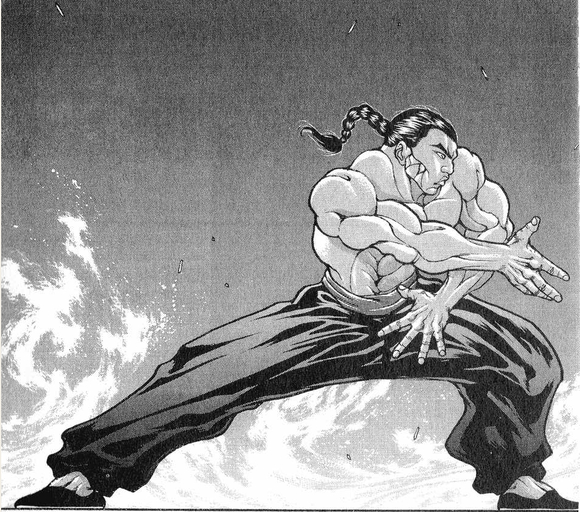

~彩蛋~

第147天

铃仙：热烈庆祝魔理沙小姐终于出院啦！

烈：没想到适应新肋骨需要这么久......看着她终于从轮椅上站了起来，感到非常的欣慰啊

魔理沙：你闭上嘴吧，全T M 你害的还好意思在这说

皮克：嗷嗷嗷嗷嗷嗷啊

（魔理沙小姐好像说出院之后第一件事是打他一顿来着）

魔理沙的怒气【1d100：46】（50以上开魔炮）

魔理沙：——算了算了

我都在这吃了30天的饭了，也没收我医药费，就这样吧

烈：谢谢你，魔理沙小姐

——魔法使坐着扫把飞走了——

因幡帝：哦，我忘记跟她讲了

之前出门的时候遇到了爱丽丝与帕秋莉，顺便告知了她们魔理沙的出院时间

现在她们应该在魔理沙的小屋里等着吧？

一回家就有人迎接，真是温馨的场面啊

魔理沙的恋爱物语，还在持续

（本日的更新结束）

（下一次的更新在周一）

（以下是我的废话）

娘嘞，二打一的战斗骰起来太累了

而且超级容易出错，我查了两三遍最后还是人物卡那里复制错了，草草草

以后坚决不打多人战，坚决不打

遇到组队行动就骰1d2,1d3来决定谁打架，哪怕再写张新卡都好过直接这么上了

哎呦，我一个感情经历跟爽哥一样丰富的人居然要写约会，这什么折磨啊

约会的时候该干什么啊我怎么知道啊（悲）

顺便一提，如果把谈恋爱当做赛跑

那么本贴的战况大概是所有选手都在前10米奋力奔跑的时候已经有一位选手在终点坐着喝茶了

哦，还有一位选手到现在为止都没找着跑道在哪（悲）

下一次的更新本来应该是深秘录剧情了

但是我觉得现在得赶紧去把红海皇打了，不然之后再打没意思了

因此打算加一天烈的日常

顺便找个机会让莉格露出场

那么今天就到这里

附上本日的骰子

哦，顺便一提，跟辉夜的战斗不会让烈的面板变高

因为主c完全是皮克啊（笑）

两个人围殴弱女子然后被反杀这能带来啥啊哈哈哈哈哈哈哈哈哈

由吧友 @望远镜300  制作的视频第8集更新了!

大家有兴趣的话去看看吧！

（其实昨晚就应该告诉大家的但是我睡太早了没看到。。）

（由于周一有事，因此挪到周日更新）

本次加一天日常的主要目的是搞定烈的期中考试

换句话说就是在恰当的时候跟红海皇再打一场，不然之后面板再高起来就没什么意思了

因此久违的需要竖起红海皇的强制战斗flag，具体来说就是如果三次行动后还是没抽到再战那就给个强制战斗选项

希望……希望别用到这个

魔理沙已经出院了，烈海王再度回归了他一成不变的日常

这天早上，烈娴熟的接住了直奔门面的报纸，开始了他全新的一天

今天早上烈的行动是【1d10：8】

1 与红海皇的再战

2 小妖怪武术班

3 跟随师匠学习

4 与红海皇的再战

5 小妖怪武术班

6 跟随圣白莲学习

7 与红海皇的再战

8 小妖怪武术班

9 跟随红海皇学习

10 大成功/大失败【1d2：1】

烈：今天该去武术培训班看看了

妖怪与人的身体构造毕竟不同，也不知道他们的进度如何

武术班的地点在【1d10:9】

1 辉针城

2 迷途竹林

3 魔法之森

4 辉针城

5 迷途竹林

6 雾之湖

7 辉针城

8 迷途竹林

9 三途河（为啥啦）

10 大成功/大失败【1d2：2】

——烈海王去往三途河了——

前往妖怪之山内侧，穿过中有之道，就可以来到三途河

三途河本身是一条极度平静的河流，河水流动缓慢，几乎听不到什么声音，河上永远也不会刮风。

河流一直被浓雾包围，雾里闪烁着光芒，河中突出很多长了苔藓的尖石。

在河岸旁停留着一条渡船，那是死神工作时用的摆渡船

小野塚小町在吗？【1d2：2】

1 在

2 不在

现在渡船上没有红发死神的身影，大概是又跑去偷懒了吧

烈：当初想要找一个清净且无人打扰的地方就选了这里

现在看来还真是不错，三途河对于人类来说是危险的地方，对于妖怪而言反而也就那样了

今天武术班的学员有【1+1d4：1=2】位

第一位【1d10：7】

1 莉格露

2 若鹭姬

3 鬼人正邪（你来干什么）

4 莉格露

5 若鹭姬

6 琪露诺

7 莉格露

8 若鹭姬

9 今泉影狼（你来砸场子吗）

10 大成功/大失败【1d2：2】

第二位【1d10:7】

1 米斯提亚

2 若鹭姬

3 鬼人正邪（你来干什么）

4 Chennnnnnn！

5 若鹭姬

6 琪露诺

7 Chennnnnnn！

8 若鹭姬

9 今泉影狼（你来砸场子吗）

10 大成功/大失败【1d2：2】

“烈师傅！好久不见！”

出现在烈海王面前的，是操纵昆虫的虫妖怪 莉格露·奈特巴格

她有蓝绿色的短发和瞳孔，头上长着昆虫样的触角，外表有萤火虫的特征，看上去像是人类的小孩一样。

她上身穿着白色短袖衬衫，下身穿着蓝色的及膝灯笼裤，披着一件像是虫翅膀的外黑内红的披风，身旁有许多微小的虫子环绕着。

烈：早上好，莉格露

今天只有你和橙姑娘两个人啊？

橙：我是因为在家太无聊了才跑出来玩的~

莉格露：我和你这种悠哉的式神可不一样！

我学武术是为了让他们认识到我们虫子的强大！

烈：唉，这个补习班的初衷是为了让你们有力量自保啊，不是让你们学会了出去打架的

说起来莉格露的好感度是离谱的97点，为什么啊？【1d10：9】

1 恋爱之情

2 烈师傅，请收我为徒吧！

3 大哥！烈海王大哥！

4 恋爱之情

5 其实是名侦探烈海王的粉丝（为啥啦）

6 大哥！烈海王大哥！

7 恋爱之情

8 其实是烈的青梅竹马（为啥啦）

9 大哥！烈海王大哥！

10 大成功/大失败【1d2：1】

莉格露：烈师傅，我能叫你大哥吗？！

我很早就在竹林里看过你战斗的样子了

我也想要像你一样战胜那些看不起我们虫子的家伙！

橙：但是虫子就是很弱啊~

莉格露：我们以前是很强的！

烈：？我无所谓

武术是投入时间与精力，就一定会得到回报的技术

每个人受天资所限，能够达到的上限不同

但是无论如何，努力之后总会比之前的自己要更强大

话说回来，你们现在学得如何了？

莉格露的学习成果【1d10：1】

1 莉格露海王！（为啥啦）

2 普普通通

3 学会了转莲华

4 学会了消力！

5 普普通通

6 学会了侦探技巧（为啥啦）

7 学会了刃牙式踢腿

8 普普通通

9 莉格露海王！（为啥啦）

10 大成功/大失败【1d2：1】

莉格露：烈大哥你所展现的绝大部分技术，我已经都能做到了！

不过消力我是真的学不会

烈的震惊【1d100：79】

烈：我的天啊……

这才两个月不到，你的技术水平已经配得上海王的称呼了

这就是妖怪的学习能力吗？真是了不起！

莉格露：这么说，我以后也可以自称为莉格露海王了吗！

烈的认同【1d70：16+30=46】（莉格露的技术+30,50以上认同）

烈：你的实力已经毫不逊色于外界的大部分海王了

但这仍然不够，因为你现在只是在模仿我的战斗方式，而没有结合你的能力，创造出属于你自己的武术

莉格露的斗志【1d100：12】

莉格露：我的能力是操纵虫子哎……这怎么结合武术啊

我要练多久才能赶上大哥啊……

烈：将小虫当做暗器，或者利用毒虫直接练出毒手，都是可行的思路

仅仅只花费了两个月的时间你就超越了外界的武术家，赶上我又算什么难题！

来，继续训练！

中华武术的4001年就寄托在你的身上了！

烈：对了，橙姑娘你怎么样？

橙的学习成果【1d10：9】

1 橙海王！（为啥啦）

2 普普通通

3 学会了转莲华

4 学会了消力！

5 普普通通

6 学会了侦探技巧（为啥啦）

7 学会了刃牙式踢腿

8 普普通通

9 橙海王！（为啥啦）

10 大成功/大失败【1d2：2】

橙：我和莉格露差不多哦~技术基本都会了，不过消力还是不会

之前试着跟她打了一场，感觉半斤八两的样子

烈的震惊【1d100：50】

烈：郭海皇啊……如果您听得到的话，请收一些妖怪做弟子吧……

武术的未来，技术的希望，就在它们身上了……

橙：现在我也是海王啦？

烈的认同（30+1d70:57=87）（50以上认同）

烈：你将我所教授的技术与平时自己的战斗经验融合，创出了一套属于自己的武术

橙姑娘，现在的你配得上这个称呼

不——今后请让我称呼你为橙海王！

莉格露：哎？！为什么我就不行啊？！

烈：刚刚已经说过了，因为你现在只是单纯在模仿我的战斗，而没有寻找到自己独一无二的战斗方法！

橙海王，你也不要松懈

你们的技术已经学会了，但是基本功却还没有做好

来，从扎马步开始练习，提高自己的身体素质！我跟你们一起训练！

烈海王与两个小妖怪正在三途河边扎着马步

直到课程结束之前，都没有一个人选择放弃

武术课程的成果超乎想象，中华武术的4000年，似乎与幻想乡的妖怪们产生了奇怪的化学反应了……

接下来烈要做什么？【1d10:2】

1 与红海皇的再战

2 学习天文密葬法

3 去太阳花田

4 与红海皇的再战

5 与红海皇练武

6 去旧地狱

7 与红海皇的再战

8 学习超人术

9 去太阳花田

10 大成功/大失败【1d2：1】

——烈海王前往永远亭了——

~永远亭~

烈：师匠，我想要继续学习天文密葬法

师匠：难得你这么有上进心

在实际运用中遇到什么问题了？

烈想要提高的方向是【1d10:6】

1 CT太长了

2 与武术相结合

3 威力不足！（你还嫌不够吗）

4 CT太长了

5 与武术相结合

6 想要用宇宙之力加强技能（为啥啊）

7 CT太长了

8 与武术相结合

9 想要自创技能

10 大成功/大失败【1d2：2】

烈：您的秘术如果当做纯粹的必杀技使用，其威力极其强大

不过我在之前上课的时候听您说过，天文密葬法其实是操纵宇宙的技术

我想尝试一下能否使用这份力量来增强我本身的技能

师匠：单纯强化一个招式？

确实是可行的思路，你自己的想法是什么？

之后一段时间会有些麻烦的事情……到时候可能还需要你去跑一趟

现在适当加强一下你的战斗力也是好事

烈的察觉【1d100：38】（75以上察觉）

烈：（麻烦的事情？又要有异变了吗）

烈：我想要加强的是【1d10：6】

1 消力

2 崩拳

3 身体素质

4 消力

5 转莲华

6 flower shooting（不要啊求你了）

7 消力

8 踢击

9 身体素质

10 大成功/大失败【1d2：1】

烈：果然还是花之射击跟宇宙力量的相性最好

师匠：烈，你不是武术家吗？

这样下去完完全全就是只靠弹幕来输出啦

烈：我无所谓！

原本我在战斗的时候就会使用飞刀一类的暗器

现在只是将其换为花弹而已

使用宇宙力量增强了Flower shooting

Flower shooting 变为了 Flower star

Flower star（CT4）：（弹幕系）对对手放出带有神秘力量的星形花弹，造成必中的【2+1d5】点伤害。

烈：招式的威力变强了，不过相对的使用时间也变长了……

师匠，谢谢你的指点！

——烈海王离去了——

师匠：现在探女应该已经开始她的计划了……

辉夜：你打算行动吗？

师匠：——我想还不到时候

辉夜：姑且静观其变吧

灵梦她们之后应该会注意到的，何况现在还有烈这个热衷于参与异变的家伙

师匠：在这一次的事件中我们可以暂且保持中立的态度

可是之后该怎么办呢，公主大人？

轻举妄动的话，反而正中对方下怀

辉夜：我才不管这些，全部交给你了~

反正你早就有计划了吧！

我也已经做好觉悟了

月之头脑与月之公主，正思考着不久之后将会发生的事件

在现在的时间点，即使是幻想乡中的圣人也对此一无所知……

时间到了晚上，烈要做什么【1d10：7】

1 与红海皇的再战

2 与红海皇练武

3 去太阳花田

4 与红海皇的再战

5 与红海皇练武

6 去旧地狱

7 与红海皇的再战

8 学习超人术

9 去太阳花田

10 大成功/大失败【1d2：1】

烈：上一次与红海皇认真战斗，已经是三个多月前的事情了

感觉像是过了很久……现在的我，能否追上她的脚步？

做完晚饭之后，烈海王走向了红魔馆

他没有特地去调整自己的状态，也不去思考红美铃变强了多少

就像平时每天都会进行的修行一样……

从永远亭走到雾之湖边，踏着水渡湖，来到红魔馆的门口

而那位值得尊敬的武者，早已站在了门边

红美铃：今天来的这么晚？

快要到晚饭时间了，这可不是打架的好时候

烈：抱歉

原本应该要等到第二天的早上，或是提前与您约好时间——

但我等不及了

有了这个念头之后，就没有办法思考其他的事情

只是一个劲的思考着，只是不停的琢磨着

现在的我，能否打倒真正的武术！

红美铃：格斗家的本性啊，真是令人怀念的话语

烈海王，这三个月以来，你的肉体变强了，你的弹幕技术变强了

不过，你的武术变强了吗？

烈：这正是我想要确认的

永远亭 烈海王，请指教！

红美铃：让我看看如今你真正的实力吧！

红魔馆 红海皇，请指教！

——红魔馆的阳台上——

蕾米莉亚：他们又要开打了

你希望谁能赢呢？

芙兰朵露：谁赢谁输都无所谓啊~

反正无论输赢她们都得陪我玩

蕾米莉亚：那就给双方喊加油吧~

战斗！

BGM：明治十七年的上海爱丽丝

烈海王

Atk：216（120）

Hp：17

技能

烈 海 王：海王是中华武术的巅峰，烈海王又是其中佼佼者，凭借高超的技术使战斗力X1.8

消力：传自郭海皇的绝学，普通攻击以及近战系技能所造成的的最终伤害/2（对战斗力230以上的对手无效）

四千年的传承：不会陷入异常状态，面对近战系、技术系的技能可以进行【1d100】的破解判定，75以上成功

Flower star（CT4）：（弹幕系）对对手放出带有神秘力量的星形花弹，造成必中的【2+1d5】点伤害。

假腿【The World】:一天一次，使用假腿中的力量进行一次超快速移动。本回合战斗自动胜利且造成的伤害必中。（对战斗力低于160的对手使用的情况下直接判定战斗结束，胜者烈海王）

必杀技

武之怀（CT5）：3T内Atk+60。3T内可对所有攻击进行【1d100】的破解判定，普通攻击与近战系、技巧系技能30以上成功，其余技能50以上成功，必杀技75以上成功。

超人烈海王（CT6）：Atk+650，给予伤害X4，之后2T回避概率翻倍

秘术 【天文密葬法】（CT9）：一天仅能使用能够一次 制造虚假的月亮，削弱妖怪的力量，3T内战斗环节中，妖怪对手的Atk变为与自身最终结算后相同，无法回避/破解/防御，给予伤害X2/引导宇宙的力量，发出轨道诡异的大量弹幕轰击无法回避/破解/防御 Atk+850，给予伤害X5

（长时间与烈海王交流武学后，红美铃的人物卡有所变化）

红美铃

Atk 225（100）

Hp 18

技能

红 海 皇：超越海王，即为海皇，AtkX2.25，Hp+3。面对所有技能可以进行【1d100】的破解判定，75以上成功

武之巅峰:（CT5）：Atk+60，3T内可对所有攻击进行【1d100】的破解判定，普通攻击与技能30以上成功，必杀技75以上成功

消力：习自烈海王的技巧，普通攻击造成的伤害/2（对Atk240以上的对手与拥有特殊技巧的对手无效）

三华【崩山彩极炮】（CT5）：（近战系）给予敌人强烈的三击，造成必中的【2+3d2】的伤害

彩华【虹色太极拳】（CT4）：（技巧系）发出如波纹一般在地面缓慢扩散流动的气波，由此长时间限制住对手行动。3T内对手Atk-40，本回合对手需进行一次【1d100】的束缚判定，低于30陷入束缚

攻消力（CT3）：（近战系）以消力技巧对对手造成巨大伤害，本回合Atk+60，造成伤害+2

必杀技

星气【星脉地转弹】（CT7）：向敌人打出高纯度的巨大彩色气弹：Atk+700,造成伤害X4

可以选择在蓄力后发动，每蓄力1T，Atk+50，蓄力2T以上时本技能无法破解/回避/防御

华符 【彩光莲华掌】（CT6）：将大量的气打入对手体内再引爆之，造成大伤害的超大打击。Atk+600，造成伤害X3，战斗结算后对方进行【1d100】的内伤判定，30以下Hp减半

T1

烈的攻击【216+1d100：59=275】

红美铃的攻击【225+1d100：9=234】

红美铃的受伤【1d10：3】

1 回避

2 小伤害

3 小伤害

4 中伤害

5 中伤害

6 大伤害

7 大伤害

8 特大伤害

9 特大伤害

10 大成功/大失败【1d2：1】

Hp：18-1=17

红美铃：办的不错嘛，烈

烈：这是您所教授于我的技术！

T2

烈的攻击【216+1d100：100=316】

红美铃的攻击【225+1d100：91=316】

以相同的力道，以相同的轨迹，两位武者同时击出一拳

力量相同的情况下，战斗的结果便看谁的武艺更加精深！

烈的破解【1d100：35】

红美铃的破解【1d100：46】

红美铃：承让了，烈海王！

烈：输在了经验上吗……

烈的受伤【1d10：8】

1 回避

2 小伤害

3 小伤害

4 中伤害

5 中伤害

6 大伤害

7 大伤害

8 特大伤害

9 特大伤害

10 大成功/大失败【1d2：1】

Hp：17-4=13

T3

红美铃：你之前教过我老郭的攻消力

现在的你能克服这份暴力吗？

攻消力发动！

红美铃的攻击【225+60+1d100:35=320】

烈的攻击：差值大于100自动失败

烈的破解【1d100：28】失败

烈：糟了！

烈海王面对的，是看似软弱无力的拳头

但是见过那场大战的他十分清楚——那份看似可笑的攻击中蕴含着多么强大的力量！

烈的受伤【1d10：10】

1 回避

2 小伤害+2

3 小伤害+2

4 中伤害+2

5 中伤害+2

6 大伤害+2

7 大伤害+2

8 特大伤害+2

9 特大伤害+2

10 大成功/大失败【1d2：2】

烈海王大失败！

烈的受伤【1d10：2】

1 回避

2 小伤害X2+2

3 小伤害X2+2

4 中伤害X2+2

5 中伤害X2+2

6 大伤害X2+2

7 大伤害X2+2

8 特大伤害X2+2

9 特大伤害X2+2

10 大成功/大失败【1d2：2】

Hp：13-1X2-2=9

烈：怪不得连勇次郎当时都要躲闪……太可怕了！

T4

烈：我也修习了新的招式，请您指点了！

接招 Flower Star!

红美铃的破解【1d100：99】成功

Hp：17-2=15

红美铃：啧，花弹的轨迹太过诡异了，即使看破了大部分也难免收到伤害啊

现在，烈海王，给我站在原地挨打吧！

符卡宣言 彩华【虹色太极拳】！

烈的破解【1d100：23】失败

红美铃的束缚【1d100：7】（30以下通过）成功

烈：糟糕！动不了了！

烈海王陷入束缚，战斗自动失败

烈的受伤【1d10：2】

1 回避

2 小伤害

3 小伤害

4 中伤害

5 中伤害

6 大伤害

7 大伤害

8 特大伤害

9 特大伤害

10 大成功/大失败【1d2：1】

Hp：9-1=8

T5

烈：将身体交给武术！

武之怀发动

红美铃：面对武术的巅峰吧！

无法防御的崩山击，你能硬吃几招？

符卡宣言 三华【崩山彩极炮】！

武之巅峰发动

烈的破解【1d100：35】成功

Hp：8-2=6（必中伤害2点）

烈：躲过大部分的攻击了！

——由于双方均可对普通攻击进行破解，因此本轮直接进行双方的破解判定——

红美铃的破解【1d100:57】

烈的破解【1d100:90】

烈：被殴打了三个多月，再怎么说也能摸出点基本套路了！

红美铃的受伤【1d10：8】

1 回避

2 小伤害

3 小伤害

4 中伤害

5 中伤害

6 大伤害

7 大伤害

8 特大伤害

9 特大伤害

10 大成功/大失败【1d2：1】

Hp：15-4=11

T6

红美铃：接下来是我与老郭一同进行的考验

符卡宣言 华符 【彩光莲华掌】！

攻消力发动

烈：三个月来的汗水与艰辛，就寄托在这一击之上！

超人烈海王发动

烈的攻击【216+60+650-30+1d100：70=966】

红美铃的攻击【225+60+600+1d100：52=937】

——进入伤害结算阶段，双方同时进行破解——

红美铃的破解【1d100：74】

烈的破解【1d100:35】

烈的受伤【1d10：4】（攻消力与彩光莲华掌在正面冲突中用去）

1 回避

2 小伤害

3 小伤害

4 中伤害

5 中伤害

6 大伤害

7 大伤害

8 特大伤害

9 特大伤害

10 大成功/大失败【1d2：2】

Hp：6-2=4

红美铃：感觉自己战胜了很多高手，感觉自己实力上升了——

清醒一点吧，烈海王

这不过是符卡规则带给你的错觉罢了！

T7

烈：红海皇，您说的没错

我至今为止经历过的战斗，与在外界的死战并不相同

或许对手没有竭尽全力

或许我的胜利并不完全

但即使如此——我所得到的成长，绝不能说是虚假的！

烈的攻击【216+60+1d100：76=352】

红美铃的攻击【225+60+1d100：67=352】

5个回合前的景象，在此刻又一次上演了

烈的破解【1d100：73】

红美铃的破解【1d100:36】

而本次的胜者是 烈海王！

烈：红海皇，这就是我给您的答卷！

红美铃的受伤【1d10：5】

1 回避

2 小伤害

3 小伤害

4 中伤害

5 中伤害

6 大伤害

7 大伤害

8 特大伤害

9 特大伤害

10 大成功/大失败【1d2：2】

Hp：11-2=9

红美铃：已经不吃激将法啦？

烈：之前已经吃过大亏了，现在不会在意了！

红美铃：你还有个压箱底的招式，对吧？

那就让我看看月之头脑的绝技吧

星气【星脉地转弹】蓄力1T

T8

武之怀效果结束

武之巅峰效果结束

烈：接招， Flower Star！

红美铃的破解【1d100：64】失败

红美铃的受伤【2+1d5：4=6】

Hp：9-6=3

红美铃：符卡宣言 彩华【虹色太极拳】！

烈的破解【1d100：2】失败

红美铃的束缚【1d100：85】失败

烈：呼——这一次好歹没被困住

烈的攻击【216-30+1d100：69=255】

红美铃的攻击【225+1d100：50=275】

烈的受伤【1d10：4】

1 回避

2 小伤害

3 小伤害

4 中伤害

5 中伤害

6 大伤害

7 大伤害

8 特大伤害

9 特大伤害

10 大成功/大失败【1d2：2】

Hp：4-1=3

星气【星脉地转弹】蓄力2T

T9

烈：红海皇，您为何不在之前就释放那份气弹？

红美铃：那还用说？

如果连对手自己都无法全力以赴，那么这场战斗本身又有什么意义

我要打倒的是竭尽全力的烈永周，而不是倒在最后一秒的烈海王

符卡宣言 星气【星脉地转弹】！

攻消力发动

烈：——多谢了！

这是师匠所传授于我的奥义

符卡宣言 秘术【天文密葬法】！

烈要使用【1d2：1】

1 虚假之月

2 弹幕攻击

随着秘术的运转，一轮虚假的月亮出现在了红魔馆的上方

在这一刻，秘术范围内所有的妖怪都能感受得到——

她们的力量来源，突然消失了

红美铃准备打出的气弹此刻忽的缩小了，变为绚丽的彩气包裹在了她的拳上

烈：如何才能证明谁的武术更强？

如何才能让胜负不变为纯粹的暴力之争？

这是我所想到的办法

当对战双方都使用着相同的力量之时

决定胜负的，就是技术本身！

红美铃： 去掉了体格，去掉了臂力，去掉了弹幕，最后留下的便是最为纯粹的技术

这什么乱七八糟的理论——真有你的风格啊，烈海王！

烈海王此时的Atk为216-30=186

由于天文密葬法的效果，红美铃的Atk变为186

两位武者拖着疲惫不堪的身躯，面对面地站立着

就如之前发生过的一样——他们伸出了自己的拳头

以象征着中华武术的崩拳

带着同样的力量，拖着相同的轨道，拳与拳相撞，相持

烈的攻击【216-30+1d100:47=233】

红美铃的攻击【186+1d100：33=219】

红美铃的受伤【1d10：8】

1 小伤害（由于天文密葬法的效果无法回避，此处处理为小伤害）

2 小伤害X2

3 小伤害X2

4 中伤害X2

5 中伤害X2

6 大伤害X2

7 大伤害X2

8 特大伤害X2

9 特大伤害X2

10 大成功/大失败【1d2：1】

Hp：3-4X2=0

这份平静总共持续了几秒呢

10秒？5秒？还是仅仅只有1秒？

就连旁观的人们都不知道

也没有人关心所谓的时间

——最终，红美铃的拳被弹开了

战斗结束

胜者 烈海王

蕾米莉亚：真不错啊

两个人都打的很愉快

不过，帕琪会觉得很吵吧？

帕秋莉：唉……美铃难得这么开心

算了算了

小恶魔：（帕秋莉大人的脾气变好了耶……是因为最近在谈恋爱吗……）

咲夜：这样就连我也没有办法责怪美铃了

今天晚上给她加餐吧

~红魔馆的住户们为两位武者献上了欢呼~

