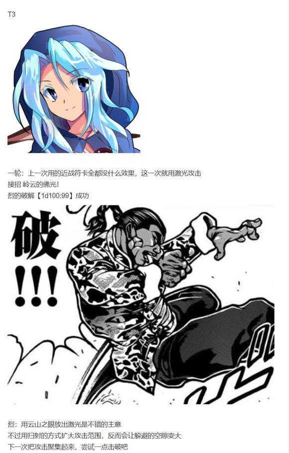
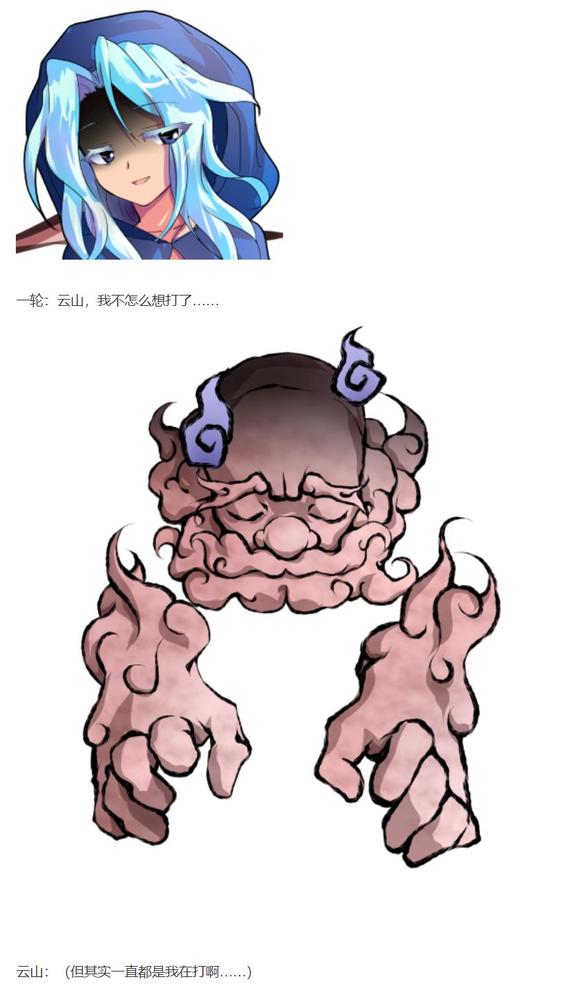
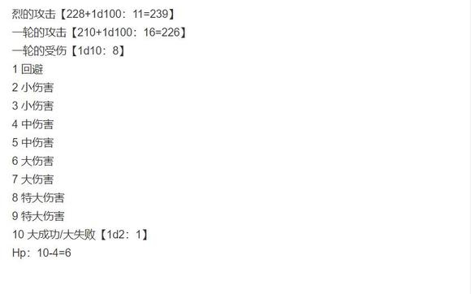

~人间之里~

烈的情报收集【1d70：2+30=32】（50以上得知一定信息）

时间到了中午，烈仍旧没听到什么有用的传闻

烈：啧，普通的居民们对这件事看上去一无所知啊

真是头疼，师匠那边也不会给我支援，今天的行动陷入僵局了……

烈要做什么？【1d10：4】

1 去问问神子殿下吧

2 与白莲和华扇会合

3 吃个饭转换一下心情吧（为啥啦）

4 去问问神子殿下吧

5 再去收集一次情报！

6 去问问灵梦吧

7 去问问神子殿下吧

8 这里就用我烈海王的直觉

9 硬着头皮用推理

10 大成功/大失败【1d2：1】

烈：白莲师傅与茨华仙人同样一筹莫展，师匠不会给我支援，灵梦小姐又不知道跑到哪里去了

这样的话，神子殿下似乎是目前最有希望的突破口

白莲师傅昨天也提到过，神子殿下已经看破了神秘珠的本质——说不定她会知道更多的东西！

事不迟疑，现在就前往神灵庙！

烈海王前往神灵庙了

路上有事发生吗？【1d100：26】（30以下坏事，70以上好事）

今天的烈海王似乎特别倒霉

具体的事件是【1d10：7】

1 一轮的复仇战

2 一直被无视的玛丽小姐

3 秦心：我漂亮吗？

4 一轮的复仇战

5 一直被无视的玛丽小姐

6 妹红的回马枪！

7 一轮的复仇战

8 一直被无视的玛丽小姐

9 堇子的伏击！

10 大成功/大失败【1d2：2】

~神灵庙~

烈海王刚到神灵庙的门口，就看到了一位熟悉的身影

烈：这不是一轮师傅吗？好久不见啊

一轮：是烈海王啊

咦？这股气息——你也有神秘珠？

交～给～我～吧~

烈的战意【1d100：59】（30以下尝试和解）

烈：你说话怎么这副口气，听上去好怪啊

也罢，刚好现在没什么思路

就爽快的打上一架吧！

一轮：我已经充分吸取了上次的教训

就用这最新最强的都市传说，一口气击败你！

战斗！

BGM：守旧老爹与前卫少女

烈海王

Atk：228（120）

Hp：18

技能

烈 海 王：超越海皇，仍为海王。AtkX1.9，Hp+1。不会陷入异常状态，不会受到驻足，束缚等判定影响，面对所有技能都可以进行【1d100】的破解判定，60以上成功

消力：传自郭海皇的绝学，普通攻击以及近战系技能所造成的的最终伤害/2（对战斗力230以上的对手无效）

Flower star（CT4）：（弹幕系）对对手放出带有神秘力量的星形花弹，造成必中的【2+1d6】点伤害。

假腿【The World】:一天一次，使用假腿中的力量进行一次超快速移动。本回合战斗自动胜利且造成的伤害必中。（对战斗力低于160的对手使用的情况下直接判定战斗结束，胜者烈海王）

武之怀（CT5）：3T内Atk+60。3T内可对所有攻击进行【1d100】的破解判定，普通攻击与近战系、技巧系技能30以上成功，其余技能50以上成功，必杀技75以上成功。

超人烈海王（CT6）：Atk+650，给予伤害X4，之后2T回避概率翻倍

秘术 【天文密葬法】（CT9）：一天仅能使用能够一次制造虚假的月亮，削弱妖怪的力量，3T内战斗环节中，妖怪对手的Atk变为与自身最终结算后相同，无法回避/破解/防御，给予伤害X2/引导宇宙的力量，发出轨道诡异的大量弹幕轰击无法回避/破解/防御Atk+850，给予伤害X5

灵异技

格斗家们的究极盛宴！（CT7）：召唤地下竞技场中斗士们的虚影，对对手进行惨无人道的群殴。Atk+700，给予伤害X4。发动前进行一次【1d10】的判定，出目为1时斗士中出现德川，Atk-50，给予伤害变为X3；出目为10时斗士中出现勇次郎，Atk+50，给予伤害变为X5；出目为2-9时效果不变。

云居一轮 云山

Atk 210 （40）

Hp 17

技能：

入道云山：在战斗中借助云山的力量，战斗力+170

打不过就去锻炼：自身的Atk增长为40，Hp增长为17，对其普通攻击与技能的破解判定所需成功值+10

岭云的佛光（CT3）：（弹幕系）云山从眼中放出激光攻击，对对手造成【1d4】点伤害

岚符【佛罚的秋台风】（CT4）：（近战系）云山在一轮周围放出一阵乱拳以横扫对手，Atk+80，造成伤害+2

积乱【见越入道云】（CT5）：（近战系）一轮与云山一起旋转倾尽全力向周围乱打，对对手造成3点伤害并进行7次【1d100】的连打判定，70以上成功，每次判定成功对手造成1点伤害

必杀技

拳固【忏悔的杀风】（CT6）：一击定胜负！接在一轮的拳击之后，云山使出浑身解数的直拳，Atk+650，造成伤害X4，由于只是单纯的拳击因此破解判定所需成功值-10

灵异技

265厘米的魔人现身！（CT7）：召唤白衣白裙的八尺大人，从其手中放出神秘的紫色波动攻击对手。Atk+700，造成伤害X4，伤害判定结束后对对手进行一次【1d100】的混乱判定，50以上成功。

T1

烈的攻击【228+1d100：51=279】

一轮的攻击【210+1d100：12=222】

一轮的受伤【1d10：9】

1 回避

2 小伤害

3 小伤害

4 中伤害

5 中伤害

6 大伤害

7 大伤害

8 特大伤害

9 特大伤害

10 大成功/大失败【1d2：1】

Hp：17-4=13

一轮：不会吧，你变强了这么多？

烈：我这段时间可一直没闲着，挨揍也能让人变强的

T2

烈的攻击【228+1d100：97=325】

一轮的攻击：差值大于一百自动失败

一轮的受伤【1d10：7】

1 回避

2 小伤害

3 小伤害

4 中伤害

5 中伤害

6 大伤害

7 大伤害

8 特大伤害

9 特大伤害

10 大成功/大失败【1d2：2】

Hp：13-3=10

烈：一轮小姐，你的力量看上去也提高了不少啊

这段时间有在加强锻炼吗？

一轮：不要在压倒我的攻击之后说这种话啊！

T4

一轮：还是用回最擅长的攻击方式吧，果然远程攻击我玩不来

符卡宣言 岚符【佛罚的秋台风】

欧拉欧拉欧拉！

烈的破解【1d100：38】失败

一轮的攻击【210+80+1d100：18=308】

烈的攻击【228+1d100：60=288】

烈的受伤【1d10：6】

1 回避

2 小伤害/2+2

3 小伤害/2+2

4 中伤害/2+2

5 中伤害/2+2

6 大伤害/2+2

7 大伤害/2+2

8 特大伤害/2+2

9 特大伤害/2+2

10 大成功/大失败【1d2：2】

Hp：18-3/2-2=15

烈：比起之前乱无章法的连打，这一招要好的多

接下来——升级之后的花弹，你能挡住吗？

Flower star！

一轮的受伤【2+1d6：1=3】

Hp：6-3=3

一轮：我已经懒得吐槽你的招式了，还有你那副好为人师的口气

烈：不好意思一轮师傅，最近这几天给小妖怪们补课有点上头了……

T5

一轮：符卡宣言 积乱【见越入道云】！

我就不信这一次还能一发都不中！

连打判定【7X1d100：30 24 21 99 54 4 4】成功一次

一轮：搞什么啊！真就只中一发啊！

武之怀发动

烈：一轮师傅，我觉得你这养气功夫还需要再练一练

烈的破解【1d100：2】失败

Hp：15-3-1=11

烈的攻击【228+60+1d100：1=289】

一轮的攻击【210+1d100：6=216】

一轮的受伤【1d10：9】

1 回避

2 小伤害

3 小伤害

4 中伤害

5 中伤害

6 大伤害

7 大伤害

8 特大伤害

9 特大伤害

10 大成功/大失败【1d2：2】

Hp：3-4=0

战斗结束

胜者 烈海王

现在一轮身上有【1d6：5】颗神秘珠

烈海王得到了5颗神秘珠

一轮：辛辛苦苦练了两个月，结果打的还没上次好！

我不打了，我不打了

还是去找那个丢盘子的老土家伙战斗有趣一些

烈：一轮师傅，我觉得您已经比上次厉害许多了

顺便问一句，您的珠子是从妹红小姐那里赢来的吗？

一轮：？？？

藤原妹红的身上也有神秘珠吗？我今天压根没去过迷途竹林啊

烈：这么说最后一颗珠子应该还是在妹红小姐身上……

一轮离去了

烈：今天真是诸事不顺，希望神子殿下那边能有些调查结果

永远亭烈海王，求见神子殿下！

出来迎接的人是【1d10：5】

1 神子

2 秦心

3 圣白莲（为啥啦）

4 神子

5 物部布都

6 恋恋（为啥啦）

7 神子

8 秦心

9 针妙丸（为啥啦）

10 大成功/大失败【1d2：1】

“唔，这不是经常来送饭的烈海王吗，阁下也是来抢夺珠子的？”

出门迎接烈海王的，是与神子同为尸解仙的风水师，物部布都

她是身材矮小的灰发少女，头戴蓝冠，身穿白色道服

说话时的遣词造句听上去与现代人略微不同，带着一股子老气的感觉

物部布都的好感度【1d80:22+20=42】（熟人+20）

布都：太子大人现在正在研究珠子

要打神秘珠争夺战的话，就由我来当你的对手！

正好借这个机会一口气把珠子集齐吧

物部布都摆出了战斗的姿势

她头顶上悬浮着的物体，毫无疑问正是神秘珠

烈：！

稍等一下，布都殿下

请问神子殿下也同样持有神秘珠吗？

布都：当然啦

根本没有人能抢夺的了太子大人的东西！

烈：我的手上有6颗珠子，妹红小姐持有一颗，您与神子殿下各持有一颗——

怎么可能？神秘珠的数量已经超过7颗了！

烈的行动是【1d10：6】

1 这里就用我烈海王的推理

2 与神子殿下一起商量对策

3 先把珠子集齐再说！

4 这里就用我烈海王的推理

5 与神子殿下一起商量对策

6 这里就用我烈海王的直觉

7 这里就用我烈海王的推理

8 与神子殿下一起商量对策

9 重新思考目前为止的经历

10 大成功/大失败【1d2：2】

烈的直觉【1d100：30】

烈：唉，什么都想不到

每一次用直觉都会失败，但还是想要尝试一下非理性的思考……

布都：阁下压根就与所谓的“灵光一闪”无缘啊

烈的行动是【1d10：1】

1 这里就用我烈海王的推理

2 与神子殿下一起商量对策

3 先把珠子集齐再说！

4 这里就用我烈海王的推理

5 与神子殿下一起商量对策

6 把珠子交给神子吧（为啥啦）

7 这里就用我烈海王的推理

8 与神子殿下一起商量对策

9 重新思考目前为止的经历

10 大成功/大失败【1d2：1】

烈：您说的没错，还是脚踏实地的使用推理吧

烈的推理【1d70：23+30=53】（50以上起效，75以上获得大量情报）

烈：我想一开始的时候神秘珠确实只有7个

但在珠子被集齐之后，神秘珠本身可能会通过某种方法增多自己的数量

也就是说，越是集齐珠子，珠子的数量越会变多

这样下去，迟早有一天神秘珠会变成幻想乡人手一个的东西

而到了那时，博丽大结界被破坏根本就是无法避免的事故了！

布都的混乱【1d100：90】（50以上起效）

布都：哎？不断增值的七个珠子？破坏结界？

这些都市传说竟然会引起这样的事故吗？

阁下请稍等片刻，我去禀报太子大人！

【1d10：8】分钟后

布都与神子过来了

神子：哈哈哈！

你的进度还是一如既往的飞速啊，烈海王

烈：但是我还是有很多东西没有想明白

尤其是关于这些珠子本身，我到现在为止除了它们可能会分裂外仍然一无所知

我实在是没有办法了，便只能前来借助您的智慧了

神子的调查进度如何？【1d10：2】

1 其实什么都还没干呢

2 有人在散播流言

3 已经发现珠子的本质

4 其实什么都还没干呢

5 有人在散播流言

6 已经发现珠子的本质

7 其实什么都还没干呢

8 有人在散播流言

9 发现了某个奇怪的珠子（好快啊！）

10 大成功/大失败【1d2：2】

神子：我目前发现的情况是，这段时间在街头巷尾都散播着与各种灵异现象有关的【流言】

我所使用的红蓝斗篷，布都的阿菊，还有圣的高速婆婆——

它们都是这些流言的一部分

烈：您的意思是说，神秘珠的运作原理与流言的传播有关？

神子：不，不仅如此

我想你太过纠结于神秘珠本身了

前段时间，人里的居民们已经被所谓的【人面犬】【卖脚婆婆】等故事所困扰许久，最后是博丽的巫女出手才帮忙解决了问题

你大概没有注意到，早在这一次神秘珠所引起的骚动之前，都市传说成真的现象就已经开始出现了

烈的理解【1d70：20+30=50】（圣人的讲述+30）

烈：我大概理解了……也就是说，所谓的神秘珠异变只不过是都市传说成真的一部分而已？

神子：我想神秘珠本身，大概就和我们所使用的力量一样，同属于都市传说的一种

然而它本身又是相对特殊的存在，因为与它【实现愿望】的外表不同，它的真正用途却是破开结界

你会前来找我求助，应该是已经调查出了一些东西吧？不妨讲来听听

烈的说明【1d70：16+30=46】（圣人的智慧+30）

烈：昨天我与白莲师傅集齐珠子之后就被送往外界了，之后我们发现本次事件的黑幕是名为宇佐见堇子的女高中生

打倒堇子小姐之后我跟白莲师傅在外界骑了16分钟的摩托车，之后回到了幻想乡却发现神秘珠又回来了！

之后，今天早上我遇到了藤原妹红小姐——

神子：好，停！

把跟圣飙车那段详细说明一下，如果可以的话配上图写一份三千字左右的感言我之后贴到命莲寺的大门口去

布都：太子大人，请不要在这么严肃的时候夹杂私心！

神子：开个玩笑开个玩笑，实际上是烈海王讲的太乱我压根听不大明白

【1d20：5】分钟后

烈：——打赢一轮师傅之后我就来找您了

神子要做什么【1d10:6】

1 重新思考目前已知的情报

2 在道场中封印神秘珠

3 “咱有个好主意哦”

4 重新思考目前已知的情报

5 在道场中封印神秘珠

6 “咱有个好主意哦”

7 重新思考目前已知的情报

8 在道场在封印神秘珠

9 去外界看看吧（为啥啦）

10 大成功/大失败【1d2：1】

“如果两位都想不出什么好办法的话，就来听听咱的主意吧？”

烈与神子顺着声音的来源方向看去

有着巨大尾巴的狸妖怪，正在一旁的树下悠哉地喝着酒

神子：是佐渡的狸猫妖怪啊

居然敢在光天化日之下跑来我的地盘，胆子不小嘛

猯藏：咱可没有与您为敌的意思呦

实际上，咱刚刚在一旁恰巧听到了你们二人的对话

于是就发现，你们似乎漏了点信息的样子

烈：猯藏女士您好，我是永远亭的烈海王

请问我们遗漏了什么？

猯藏的好感度【1d100：65】

猯藏：嘻嘻，名侦探这次意外的迟钝啊

听好了，这些球是集合了外面世界的圣地的石头的东西

也就是说是，“能量石（power stone）”这样的东西呐

烈的察觉【1d100：46】（由于曾与妹红谈话，75以上察觉关键信息）

神子的察觉【1d70：33+30=63】（圣人的智慧+30,90以上察觉关键信息）

烈：就是说这些珠子其实来自于不同的地方？

就像妹红小姐提到过的黄泉比良坂一样

神子：7个珠子其实代表着七个不同的圣地吗

猯藏：正是如此

因此呢，咱可以利用神秘珠的性质给那位女学生下一个陷阱——

如果给她一个代表幻想乡的神秘珠，会怎么样呢？

神子：——直接令她正式进入幻想乡，并在之后让她带着所有的珠子一起离开，从而彻底解决问题？

猯藏的说服【1d70：36+30=66】（大妖怪的口才+30）

神子的抵触【1d70：23+30=53】（圣人的执着+30）

神子：哈哈，真是有意思的提案

就让盲目自大的孩子体会一下妖怪们的恐怖吧！

送出假珠子的人选是【1d3：2】

1 神子

2 猯藏

3 烈海王（为啥啊）

猯藏：现在是异变开始的第二天

在异变开始的第六天时，咱会前往外界将陷阱设下

这个计划还需要跟其他人商量商量，因此咱先走一步了！

“嘭！”狸猫妖怪在白烟中消失了

烈的理解【1d100：22】

烈：神子殿下，我完全没有理解你们在讲什么……

神子：其实就是一个简单的圈套

狸妖怪打算在前往外界之后，给那位黑幕一个代表幻想乡的神秘珠，也就是幻想乡的能量石

在拥有了那颗珠子之后，黑幕就可以正式进入幻想乡了

烈：正式进入？

神子：她之前所做的不过是保持境界而穿透结界，即所谓的神隐

可以带进来的东西和带出去的东西都是有限定的，大部分时候持续的时间也是有一定限制的

面对着暂时神隐的家伙，我们一般也无法出手应对

呵呵，不过通过正式的手续，在结界上打开空穴穿越从而进入幻想乡之后可就不一样了

烈：——原来如此

猯藏女士估计会给她一个假珠子，光能进来却不能出去

（话说回来，我又是怎么进来的？都在这待了这么久也没出去，架都打了蛮多场，看来我的情况并不是神隐……）

（等这次异变结束之后调查一下吧）

神子：之后嘛，这段时间被珠子所困扰的家伙们就可以在自己的地盘上光明正大的打上她一顿了！

感觉差不多出够气了就象征性地输掉，把珠子让给她

最后让她带着所有的珠子一块离开幻想乡，这次的异变也就结束了

烈：堇子小姐集齐珠子之后就能出去了，但由于她已经正式进入幻想乡，因此过不了多久就会像我和白莲师傅一样被拉进来

然后她就会再挨一顿揍……

烈的良心【1d100：66】（75以下退出计划）

烈：虽然有点于心不忍，但这也是为了她好啊

这计划算我一个吧

神子殿下，布都殿下，烈海王在此告辞

多谢您二位今天的指导

烈海王前往永远亭了

（上面打错一个字，是良心75以上退出计划）

烈：——基本上就是这样了

四天之后就开始执行猯藏女士的计划，之后再过几天堇子小姐应该就会进入幻想乡了

妹红：哟，听上去挺有意思的

到时候我也去打一架吧

铃仙：（烈先生今天到底错过了多少次机会啊……）

因幡帝：（大概是这就是正常说话的代价吧？）

神秘珠异变的第二天结束

新增的情报：

神秘珠的数目不止七个

集齐神秘珠之后，其本身会自我分裂以不断增多数目

神秘珠本身也是都市传说异变的一部分

神秘珠实际上是来自不同地区的能量石

通过神秘珠进出幻想乡并不算入正式手续中

（还有一点内容，吃完早饭继续）

在第六天之前，烈做了什么？【1d10：1】

1 相信猯藏的计划，什么都不做

2 复盘一次目前为止的行动

3 收集珠子前往外界

4 相信猯藏的计划，什么都不做

5 去问问灵梦小姐吧

6 收集珠子前往外界

7 相信猯藏的计划，什么都不做

8 去给小妖怪们补习武术

9 收集珠子前往外界

10 大成功/大失败【1d2：1】

烈：就连神子殿下也认同了，这份计划想必是万无一失的

就让堇子小姐体验一下热情好客的幻想乡吧！

~第160天~

~博丽神社~

天色已近黄昏，狸猫妖怪在离开【1d30：5】分钟后就回来了

烈：好快的速度！

魔理沙：真以为各个都跟你一样，跟堇子打架都要费上半天功夫啊？

猯藏：毕竟咱压根就没认真打嘛~

把狸猫变成的假珠子送给她之后咱就回来了

华扇：这样一来准备就完成了

大家做好准备，之后给宇佐见堇子小姐开一场盛大的欢迎会吧！

神子：呀，这个糟糕的事件总算要结束了

白莲：说实话开摩托车的感觉并不坏呢~之后要不要自己买一辆呢~

幻想乡的强者们露出了和善的笑容

烈：怎么感觉我们这边更像反派一样……

——最后的救命骰子——

说起来现在灵梦在神社吗？【1d2：1】

1 在

2 不在

灵梦：这些一肚子坏水的家伙……

唉，总感觉事情有些不对头，但还是想不出来到底哪里不对劲

烈的听力【1d70：42+30=72】（50以上听到，烈海王+30）

烈：灵梦小姐，你也有这种感觉吗？

我也觉得好像遗漏了一些信息，但是不知道到底是那一块出了问题

不如我们一块讨论一下？

灵梦的疑惑是【1d10:5】

1 堇子的计划

2 神秘珠的来源

3 堇子的灵异攻击

4 堇子的计划

5 神秘珠的来源

6 堇子的灵异攻击

7 堇子的超能力（为啥啦）

8 神秘珠的来源

9 堇子的灵异攻击

10 大成功/大失败【1d2：1】

灵梦：我有很多在意的地方……硬要说一个最好奇的，就是这些珠子的来源

烈：？

这方面之前猯藏女士解释过了吧，珠子是各个地区的能量石

灵梦：是的，可是具体是哪七个地区？

之前堇子的灵异技似乎也跟这个问题有关

烈：我只知道妹红小姐说过其中一个地区是黄泉比良坂……

烈的行动是【1d10:5】

1 问问猯藏女士吧

2 问问神子殿下吧

3 靠我烈海王的调查

4 问问猯藏女士吧

5 直接在这里研究吧！

6 靠我烈海王的调查

7 问问猯藏女士吧

8 没什么大不了的，不管他了（为啥啊）

9 靠我烈海王的调查

10 大成功/大失败【1d2：1】

烈：现在在场的大家除了我以外都是幻想乡内一流的强者

大家一起再收集一次珠子，然后直接在神社研究吧！

我去跟大家说明理由

烈的说明【1d100：90】（75以上有效）

烈：——就是这样，请问大家能配合一下吗？

大家的震惊【1d70：50+30：80】（烈海王在好好讲话+30）

魔理沙：灵梦！烈海王在条理清晰的说话啊！

这是异变啊异变！

神子：是不是出现了新的都市传说？令人的特质反转之类的？

白莲：大概是烈先生最近终于学会了如何锻炼大脑吧！

【1d30：6】分钟后

华扇：大部分珠子都在在场的各位手里，收集起来还挺快的

猯藏：只要感应一下魔力就可以，咱已经检查完毕了！

七个神秘珠所代表的七个地点分别是金字塔 巨石阵 巴别塔 黄泉比良坂 纳斯卡地画 地狱谷以及月之都

烈的察觉【1d70：61+30=91】（与灵梦的交谈+30，90以上察觉）

烈：稍等一下

为什么……为什么会出现月之都的名字？

魔理沙：嗯？月之都也是著名的神秘地点吧

月之民所居住的神秘都市，很符合那个喜欢神秘的家伙的口味啊

烈：不，我的意思是

宇佐见堇子扔来的神秘珠中，为何会包含月之都？

其余六个地点都是外界的人们多多少少了解一点的地方

但是月之都这个名字，我以前从未听说过

是到了幻想乡之后，和师匠聊天的时候才知道的

灵梦：——对了！就是这个！

月之都在幻想乡属于有点实力的人都知道的常识

但是在外界，就像烈海王所说的一样

根本就没有月之都的都市传说流传啊！

华扇：也许堇子是在进入幻想乡的时候听到了月之都的传闻？

猯藏：糟了，咱下意识的就把幻想乡的常识套到外界去了

咱觉得偶然听到传闻不太可能，因为没几个人会把月之都相关的话题挂在嘴边

就算堇子可以偷偷进来幻想乡，她也很难直接了解到相关的信息

然后另外一个问题是，就是堇子真的了解相关信息

她又是从哪得到的月之都的能量石？

神子：把那个珠子给我看一下

神子的调查【1d70：57+30=87】（圣人的智慧+30，75以上得知部分信息，90以上基本解密）

神子：现在可以看出来的是，这个珠子已经被掉包了

只有这个珠子散发着强烈的灵气，它跟其他那些来自外界的石头根本不是一种东西

我可以肯定，如果这颗珠子的力量被完全激发出来，那绝对会发生相当糟糕的事件

华扇：如果原先的珠子被完全激发后会让幻想乡与外界联通的话

这颗珠子加进去之后，该不会连月之都也会与幻想乡连到一起吧？！

神子：我想大概就是这样，但这是它的力量与其他神秘珠被一同被激发后的结果

现在这颗珠子已经在发挥它的能力了

而它具体的作用是什么，我还需要进一步的调查

大概要【1d10：9】天左右

白莲：这样不行，时间太长了

堇子小姐再过几天就要正式进入幻想乡了，她可不会等我们慢慢解密的

魔理沙：啧，情况反而变得更复杂了

喂，烈海王，你有什么馊主意吗？

烈的建议【1d10：10】

1 继续原计划

2 去找堇子套出信息

3 靠我烈海王的推理

4 继续原计划

5 直接向堇子说明真相

6 靠我烈海王的推理

7 继续原计划

8 靠魔理沙的口才！（为啥啦）

9 靠我烈海王的推理

10 大成功/大失败【1d2：1】

烈海王大成功！

大成功是什么？【1d10:7】

1 稍微更改原计划

2 烈海王准备了对堇子专用话术，本次事件中对堇子使用话术时基础值+50

3 烈海王的名推理

4 稍微更改原计划

5 堇子：我听到了哦

6 烈海王的名推理

7 稍微更改原计划

8 魔理沙火力全开！本次事件中魔理沙对堇子使用话术时基础值+50

9 烈海王的名推理

10 大成功/大失败【1d2：2】

烈：我刚刚确实想到了一个好主意

神秘珠的问题要解决，但堇子小姐个人的问题也要解决

如果这次把珠子扔出去之后，她三天两头过来再扔点珠子就跑路，那根本没法处理

这样的话，不妨把原计划稍微更改一下

烈的说明【1d100：95】（75以上说服众人）

烈：——就是这样

计划的大部分完全没有什么变化，只是在最后一块，堇子小姐集齐神秘珠回到外界时给她下一个埋伏

各位觉得如何啊

灵梦：魔理沙，我觉得你上次输的不冤啊

魔理沙：这个逼唯独在坑害女孩子这件事上可以发挥出无与伦比的脑力与行动力……

我呸

烈：我上次真的不是故意的……

话说这计划还需要一个人配合我一下啊，有谁愿意上吗？

烈的同行者是【1d10:5】

1 灵梦

2 针妙丸

3 恋恋（为啥啊）

4 华扇

5 魔理沙

6 神子

7 白莲

8 无人同行

9 猯藏

10 大成功/大失败【1d2：2】

魔理沙：我去我去！

我要看看堇子到时候究竟是什么样的表情，哈哈哈哈哈！

灵梦：啧啧，你自己也不是什么好东西

敲定了计划的具体细节后，众人带着一脸的坏笑离去了

可怜的堇子还不知道，之后将会有什么样的遭遇在等着她……

第六天结束！

新增加的情报：

七个神秘珠代表七个不同的地点，其中一个是月之都

代表月之都的珠子被掉包了，其具体作用未知

如果神秘珠的力量被激发，外界 幻想乡 月之都将被同时联通

（本日的更新结束，下一次的更新在周六或者周日）

