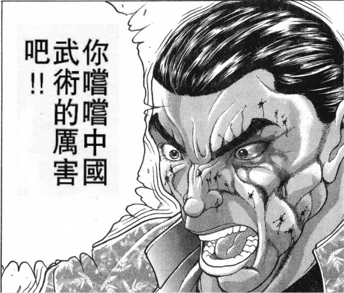

（以下是我的废话）

烈海王的这一天堪称诸事不顺啊

每一次遇到线索都错过了，然后居然还刚好抽中了原作选项

我想着再这么下去就很没意思了，然后最后加了一个救命骰子

结果还真中了嘿

然后几个高难度判定全过，这是骰运全压到最后了？

只要有一个没过就是烈海王自己想办法的发展咯

那么这一次基本上解开与深秘录相关的大部分谜题了

最关键的那个秘，看上去要等到本次异变结束后才能揭晓了

下一回的更新不会太长，大概就是堇子受难记——boss战——后日谈+彩蛋这样子

那么下一次的更新在周末，骰子下一楼发

附上本次的骰子

由吧友 @望远镜300  制作的视频第11集更新啦！

大家有兴趣的话就去看一下吧！

~第160天~

在神秘珠异变发生的这十天以来，有不少妖怪通过神秘珠短暂去到了外界

与此同时，堇子也在积极地探索着幻想乡

终于，时间到达了异变开始的第十天

在这天晚上，宇佐见堇子使用了猯藏交给她的珠子，从而正式进入了幻想乡

~博丽神社~

堇子：好嘞！

这次也顺利地进入幻想乡了

至今为止虽然只能暂时进来一会儿

但是只要有了这块从妖怪狸猫那里得到的幻想乡的能量石，就再也没有时间限制了

华扇：的确如此，欢迎来到幻想乡

堇子的惊讶【1d100：3】大失败

堇子大失败！

大失败是什么【1d10：10】

1 堇子对华扇出言不逊

2 紫：让我也加入吧

3 堇子完全理解错误了

4 堇子对华扇出言不逊

5 萃香：让我也加入吧

6 堇子完全理解错误了

7堇子对华扇出言不逊

8 摩多罗来了！

9堇子完全理解错误了

10 大成功/大失败【1d2：2】

堇子双重大失败！【1d10：6】（为了保住堇子的命，无三重大失败）

1 华扇愤怒了！（秒杀）

2 紫、蓝：让我们也加入吧

3 堇子的超能力突然出问题了，本事件中无法闪避

4 华扇愤怒了！（秒杀）

5 萃香、勇仪：让我们也加入吧

6 堇子的超能力突然出问题了，本事件中无法闪避

7 华扇愤怒了！（秒杀）

8 堇子被抓进后户之国了！（为啥啦）

9 堇子的超能力突然出问题了，本事件中无法闪避

10 华扇愤怒了！（秒杀）

堇子：吼，你是之前的仙人啊

打扮的像是小薄本里的角色一样，是过来投降的吗？

不用这个样子，我们还是可以当朋友的嘛，哈哈哈哈！

华扇：我突然想起来你会闪来闪去，想打中还蛮麻烦的

那么这段时间内——你就老老实实待着吧！

堇子：什么？

等等，不会吧

瞬间移动无法使用了？！

这是个陷阱？难道是那块石头

华扇：现在你已经没有退路了

好好接受幻想乡流的洗礼吧！

堇子的攻击【1d80：66】（无法闪避，上限-20）

华扇的攻击【1d50:38+50=88】（早有准备+50）

Hp：16-1=15

堇子：怎么会这样，竟然真的回不去了！

堇子的逃跑【1d80：1】（高于10成功）

华扇：本来以为这种程度的威胁应该就差不多了

看来你还是不太听劝告啊？

那就再来一场吧

堇子的攻击【1d80：77】

华扇的攻击【1d50:29+50=79】

Hp：15-1=14

堇子：咕！

堇子的逃跑【1d80：70】（高于10成功）

粉发的仙人故意吃了一发念力冲击，她的神秘珠跑到了堇子身上

堇子终于飞走了

华扇：一不小心让她死掉引起骚动的话，也许会从外界引来调查人员也说不定啊

幻想乡的恐怖之夜，还请慢慢享受啦！

堇子逃去哪了？【1d10:5】

1 神灵庙（秦心）

2 人间之里（一轮）

3 辉针城（针妙丸）

4 神灵庙（布都）

5 人间之里（恋恋）

6 辉针城（针妙丸）

7 命莲寺（白莲）

8 人间之里（恋恋）

9 迷途竹林（妹红）

10 大成功/大失败【1d2：2】

~人间之里~

堇子：这里是？很有影视城的感觉呢

？？？：喂喂——，能听到吗——

堇子：咦，哪里来的声音？

？？？：喂喂——我是玛丽小姐——

堇子：我记得好像有个类似的都市传说……接了电话之后“我就在你身后”这样子

堇子拿出了她的手机

虽然身在幻想乡并没有信号，但其中的确传出了声音

堇子把手机放到了耳旁

？？？：喂喂——我现在——

恋恋：就 在 你 眼 前 哦 ！

堇子的惊吓【1d50：20+50=70】（玛丽小姐+30，恋恋+20）

堇子：呜哇啊！出，出现了——！　妖——怪——啊——！

恋恋：呜哇啊！吓到了——！我就是妖怪哦！

终于吓到一次人了！接下来

把 你 的 尸 体 挂 在 地 灵 殿 门 口 吧

堇子：这句话更可怕！这句话比玛丽小姐还要恐怖啊！

恋恋的出力【1d100：57】

堇子的出力【1d80:45】

Hp：14-1=13

堇子的逃跑【1d80：79】（大于10成功）

恋恋：这一次的效果真棒啊

对了对了，你还没拿珠子呢！过来打我一下啊！

超能力者使尽浑身解数拼命逃跑

在她的身后，无意识妖怪正快乐地挥舞着菜刀

堇子逃去哪了？【1d10:3】

1 神灵庙（秦心）

2 人间之里（一轮）

3 辉针城（针妙丸）

4 神灵庙（布都）

5 人间之里（大狸子）

6 辉针城（针妙丸）

7 命莲寺（白莲）

8 神灵庙（神子）

9 迷途竹林（妹红）

10 大成功/大失败【1d2：2】

~辉针城~

堇子：地上不管到哪里都是妖怪，还好我的飞行能力还能用

妖怪什么的根本不可怕——

才怪咧！ 之前说了这些真是对不起啊

果然妖怪还是好可怕……

针妙丸：这不是前两天过来的变态吗

堇子：哇，是那个超级可爱的小姑娘！

感觉被治愈了~来当我的妹妹吧~

正邪：针妙丸，你还挺招人喜欢啊

可惜，这孩子已经有人养了

针妙丸：我没有被养！

正邪你平常只是负责洗衣服做饭干家务这些而已！

正邪：一般来说这就叫饲养哦

好了，该办正事了

既然你这么喜欢妖怪——那不如就永远的沉睡在这片土地上，跟妖怪作伴吧？

针妙丸：让来自宇宙的小绿人吃掉你！

堇子的出力【1d80：61】

针妙丸与正邪的出力【1d70：30+30=60】（双打+30）

堇子：咿呀，小姑娘旁边的家伙表情像鬼一样！

还以为是难得的净土，结果跟其他地方一样啊……

还是先去找回家的方法吧

堇子带着神秘珠跑路了

正邪：本大爷可是出了全力的，你为什么一直在划水啊？

针妙丸：在这里赢了的话反而会变麻烦的

正好让她把珠子带走，然后迎接真正的地狱吧

堇子逃去哪了？【1d10:9】

1 神灵庙（秦心）

2 人间之里（一轮）

3 迷途竹林（妹红）

4 神灵庙（布都）

5 人间之里（大狸子）

6 迷途竹林（妹红）

7 命莲寺（白莲）

8 神灵庙（神子）

9 迷途竹林（妹红）

10 大成功/大失败【1d2：1】

~迷途竹林~

堇子：嗯？好像有点迷路了

这里是哪啊？

妹红：哦哦，你就是之前提到过的宇佐见堇子对吧

亲眼一见发现是个一脸娇生惯养的家伙

感觉有点火大啊

堇子：说什么娇生惯养真是太失礼了！

我可是在烦扰缠身的现代社会里过着焦虑重重的学校生活

你知道一个星期要复习八门功课有多痛苦吗？

妹红：很遗憾，我只知道一直死不了或者一直被杀有多痛苦

你看上去倒也不弱啊——不如你也体验一下吧？

堇子的出力【1d80：48】

妹红的出力【1d50：48+50=98】（生气了+50）

Hp：13-1=12

妹红：还以为会是个强大的对手，结果并没有什么势均力敌的感觉

堇子：呜哇！已经不想再打了！

这个竹林里怎么绕都出不去，瞬间移动也用不了……莫非我真要死在这里了吗……

妹红：会出不去是理所当然的，这个竹林被施加了迷路的咒术

我就顺便把你带出去吧

走的时候，记得把珠子拿上

堇子：——你莫非意外的是个好人？

妹红：谁知道呢

说不定10分钟之后，你就不这么想了

~博丽神社~

妹红把堇子带来之后，就挥挥手离去了

堇子：结果我到最后还是回到了这座神社啊……

之前来到幻想乡的时候也都是从这里出发的

必须得想点办法才能回到原来的世界……

？？？：哟，终于来了？

？？？：我们都等不及了

？？？：接下来该进入教育环节了

堇子：这次又是什么啊？！

快点让我回去啦——怎么这么多妖怪啊？！！！！

面带微笑的面灵气

背着巨大背包的河童

长着大尾巴的狸猫妖怪

白衣的风水师与妖怪跟随的僧侣

头戴耳机的圣人与手持经卷的圣僧

以及站在她们之中，散发着巨大存在感的，红白的巫女

超能力者一瞬之间，就被形形色色的妖怪们所包围了

神子：还真是会说些奇怪的话呢

我们一直等在这里的原因就是为了把你送回外界啊

连同这些神秘珠一起送回去

堇子：对了，神秘珠！只要有神秘珠我就可以回外界了！

白莲：您之前几次前来幻想乡，都是依靠着在这里散播的神秘珠吧

这一次正好就把您连人带珠一块送回去吧

灵梦：不过在此之前

你还得跟我们打上一场呢！

一帮妖怪与人类一拥而上，对堇子开打了车轮战

战斗持续了【20+1d40：22=44】分钟

Hp：12-4=8

灵梦：宇佐见堇子，你现在感觉如何，感觉如何啊？

堇子：救命啊！！！！！！！

神子：差不多到时间了

接下来，你就安心地回去吧！

博丽大结界张开了一个口子

堇子带着所有的珠子回到了外界

灵梦：真是期待啊……五分钟后，她会是什么表情呢？

~外界~

堇子：呼……呼……

历经千辛万苦，总算是回到了外界

但现在只是暂时性的离开了……总要想点办法才行！

堇子的决心【1d100：46】（30以上发动计划）

堇子：没办法了

本来是打算让幻想乡的妖怪们自己发动的

现在就由我宇佐见堇子本人亲自上阵

哪怕燃烧生命，也在所不惜！

堇子调动起了她全部的能力

以生命力的燃烧为代价，堇子的念动力瞬间暴涨数倍！

堇子：这就是初代秘封俱乐部会长最后的伟业了

解放神秘珠的力量，让我自己成为破坏结界的钥匙！

就在她将力量灌入神秘珠的前一瞬间

？？？：我就知道她肯定还有后手，拜托你了魔理沙小姐！

？？？：让你见识见识什么叫专业！

一道黑白色的身影骑着扫把猛然冲来

她手中的神秘珠，被一个也不剩的夺走了

魔理沙：呦，好久不见了！

上一次忘记跟你说了，我偶尔也会兼职当一下小偷

就像现在这个样子，偷走你们珍视的宝物呢！

烈：真没想到有朝一日我也会当小偷的同伙啊……

魔理沙：少来这套，这主意还是你出的

堇子：——刚刚那些话你们都听到了？

烈：嗯……

蛮有气势的

魔理沙：幻想乡的人一般不会这么讲话

这是你们外界独有的特色吗？

烈：别说了，魔理沙小姐……

堇子的恼羞成怒【1d50：20+50=70】（真的很丢人+50）

堇子：啊啊，想必你们二人大概是不会忘记刚刚的事情了……

被逼入绝技的女子高中生临死前的反扑居然被早有准备的敌人们粉碎了

真的是，毫无价值的牺牲啊！

烈：堇子小姐，请冷静一下

没有人想让你死的，刚刚是你自己自说自话地燃烧起生命了

魔理沙：哇，这一如既往的话术发挥

堇子： 只要把你们打到失忆，再把珠子抢回来，今天晚上的怪谈故事就可以画下句点了！

烈的战意【1d100：40】（30以下尝试和解）

魔理沙的战意【1d100:42】（30以下尝试和解）

魔理沙：我来主攻，你负责辅助

注意别站在魔炮前面，我保证把你俩一块轰咯

烈：我无所谓

我有些话想要跟这位女学生好好讲讲！

堇子：让我最后的力量铭刻在你们的脑海中

让人类界最后的夜晚，刻进你们基因的最深处！

烈：——这里应该说些什么帅气的话吗？我不擅长这些

魔理沙：灵梦的话大概会说“让幻想乡最初的夜晚，刻进你无尽的噩梦中！”这样

不过我说不大来这种话

烈：那还是用我以前那套吧

肆意妄为的超能力者，你尝尝中华武术的厉害吧！

（吃完早饭继续）

战斗！

BGM：Last Occultism　～ 现世的秘术师

宇佐见堇子（生命燃烧）

Atk：259（35）

Hp：8（10）

技能

超能力者：面对人类时Atk+200，Hp+6/面对非人类时Atk+175，Hp+5。自身回避概率翻倍，对于所有技能可进行【1d100】的回避判定，75以上成功

华扇的禁锢：战斗结算时无法进行回避，无法对技能进行回避判定

热情好客幻想乡：经过乡民们的欢迎仪式，Hp变为8

生命燃烧：燃烧自身的生命力，大幅提升超能力，Atk上升剩余生命值8X3=24，本次战斗中即使Hp归0也不会停止战斗，第8回合结束时自动判定战斗失败

枪符【3DPrinter Gun】（CT3）：（弹幕系）利用3D打印枪发射子弹，对对手造成【1d6】点伤害

念力【PsychokinesisAPP】（CT4）：（技巧系）操纵大量垃圾进行攻击，对对手造成【2d3】点伤害

念力【Telekinesis电波塔】（CT5）：（近战系）用巨大的电波塔进行刺击，Atk+100，造成伤害+3

必杀技

念力【Psycho Plosion】（CT6）：令念力瞬间爆发，对对手造成巨大伤害，Atk+650，给予伤害X3，战斗结算后对对手进行一次【1d100】的重伤判定，60以下Hp减半

灵异技

深秘的七大不可思议（CT7）：召唤出七个神秘地点的幻象，对对手进行灵力冲击，Atk+700，给予伤害X4，对对手进行7次【1d100】的幻觉判定，90以上成功，成功后对手本回合无法行动。

现世的神秘主义者（CT8）：聚集所有神秘珠的力量，发出威力极强的念力炮。Atk+800，造成伤害X5（由于神秘珠被夺走无法使用）

雾雨魔理沙

Atk：260（240）

Hp：18

技能

普通的魔法使：用魔力形成屏障，普通攻击以及弹幕系技能所造成的的最终伤害/2（对Atk250以上的敌人无效）。普通攻击造成的伤害+1。不会陷入异常状态，不会受到驻足/禁锢等判定影响。异变发生时Atk+20。

烈海王的支援：面对所有技能都可以进行【1d100】的破解判定，60以上成功

Sweep Aside（CT3）：（近战系）利用扫帚加速当场使出大回旋，最后利用回旋的势头用扫帚给予一击。Atk+30，给予伤害+1

Powerful Drug（CT4）：（弹幕系）投掷装有特殊药剂的魔法瓶，限制对手的行动范围同时对其造成伤害。对对手造成【1d3】的伤害，同时本回合对手无法回避

彗星【BlazingStar】（CT4）：（技巧系）以最大速度向对手突进并放出星弹攻击，对对手造成【3+1d3】的伤害

星符【SatelliteIllusion】（CT5）：（弹幕系）召唤卫星辅助单元。一边跟在自己身边，一边自动攻击靠近的对手。3T内每回合对对手造成2点伤害，同时自身受到的伤害-2

必杀技

恋符【Master Spark】（CT6）：释放强烈光和热的魔理沙招牌魔法，以超高的火力摧毁对手！Atk+700，造成伤害X4，由于过于注重威力破绽较大，对本技能的回避/破解判定所需成功值-20

魔炮【Final Master Spark】（CT7）：还没有打倒敌人就继续增加火力，以最强的火力发出无法阻挡的魔炮！无法回避/破解/防御，Atk+850，造成伤害X5，伤害结算后对对手进行一次【1d100】的重伤判定，60以下Hp减半

灵异技（由于烈海王的支援，本次使用烈海王的灵异技）

格斗家们的究极盛宴！（CT7）：召唤地下竞技场中斗士们的虚影，对对手进行惨无人道的群殴。Atk+700，给予伤害X4。发动前进行一次【1d10】的判定，出目为1时斗士中出现德川，Atk-50，给予伤害变为X3；出目为10时斗士中出现勇次郎，Atk+50，给予伤害变为X5；出目为2-9时效果不变。

T1

魔理沙的攻击【260+1d100：15=275】

堇子的攻击【259+1d100：97=356】

魔理沙的受伤【1d10：4】

1 回避

2 小伤害

3 小伤害

4 中伤害

5 中伤害

6 大伤害

7 大伤害

8 特大伤害

9 特大伤害

10 大成功/大失败【1d2：1】

Hp：18-2=16

堇子：以我现在的状态，就算你们两个一起上也打不过我！

魔理沙：一上来出力就这么高，肯定是你刚刚的发言把堇子惹毛了

烈：魔理沙小姐，你自己划水为什么要怪我啊……

T2

魔理沙的攻击【260+1d100：85=345】

堇子的攻击【259+1d100：96=355】

魔理沙的受伤【1d10：3】

1 回避

2 小伤害

3 小伤害

4 中伤害

5 中伤害

6 大伤害

7 大伤害

8 特大伤害

9 特大伤害

10 大成功/大失败【1d2：1】

Hp：16-1=15

堇子：很好！现在就是我绝地反击的时候

就算是两个妖怪一齐上，也打不过全身全灵的超能力者！

魔理沙：我是人类哦，旁边这个才是妖怪，会使用武术的假腿付丧神

烈：好过分，我也是人类啊！

你怎么不说自己是会用魔法的扫把付丧神？！

堇子：不要在气氛紧张的时候讲漫才！

给我适可而止！

T3

堇子：符卡宣言 枪符【3DPrinter Gun】！

吃子弹吧！

烈的破解【1d100：22】失败

魔理沙的受伤【1d6：4】

Hp：15-4=11

魔理沙：我就知道指望不上你

接招 Sweep Aside！

魔理沙的攻击【260+30+1d100：16=306】

堇子的攻击【259+1d100：62=321】

魔理沙的受伤【1d10：1】

1 回避

2 小伤害

3 小伤害

4 中伤害

5 中伤害

6 大伤害

7 大伤害

8 特大伤害

9 特大伤害

10 大成功/大失败【1d2：2】

烈：好，躲过去了！

T4

堇子：符卡宣言 念力【PsychokinesisAPP】

用垃圾淹没你！！

魔理沙：烈海王，直接击破后拉近距离！

烈：了解，破！

烈的破解【1d100：71】成功

魔理沙：OK，这个距离你可躲不掉了

接招，Powerful Drug

符卡宣言 彗星【Blazing Star】

超能力者的攻击我已经看过一遍了

你也看看魔法使的攻击吧！

堇子的受伤【1d3：2+3+1d3:3=8】

Hp：8-8=0

堇子：按照你们的规则我应该是已经输了……

不过现在我连命都不要了，规则也就无所谓了！

在这份力量消失之前，至少要把你们赶回去！

魔理沙的攻击【260+1d100：27=287】

堇子的攻击【259+1d100：86=345】

魔理沙的受伤【1d10：10】

1 回避

2 小伤害

3 小伤害

4 中伤害

5 中伤害

6 大伤害

7 大伤害

8 特大伤害

9 特大伤害

10 大成功/大失败【1d2：2】

魔理沙大失败！

大失败是什么？【1d10：3】

1 小伤害X2

2 小伤害X2

3 中伤害X2

4 中伤害X2

5 大伤害X2

6 大伤害X2

7 特大伤害X2

8 特大伤害X2

9 战斗不能

10 大成功/大失败【1d2：2】

Hp：11-3X2=5

烈：魔理沙小姐，您为了不伤害她而特意手下留情了吗

您真的很温柔……

魔理沙：我失误一次你就在旁边阴阳怪气？！

平时讲话的时候怎么就没看到你这份口才？！

T5

堇子：符卡宣言 念力【Telekinesis电波塔】

用巨大的铁塔把你们砸碎！

烈：这招我见过，交给我

魔理沙：那你来指路，我们从塔身中直接穿过去！

烈的破解：【1d100:64】成功

听从着武术家的指引，魔法使全力加速，仿佛流星一般闪过了交叠的铁塔

魔理沙：符卡宣言 星符【SatelliteIllusion】

撑过这三个回合就该结束了

堇子的Hp：0-2=0

魔理沙的攻击【260+1d100：44=304】

堇子的攻击【259+1d100：80=339】

魔理沙的受伤【1d10：7】

1 回避

2 小伤害-2（无伤）

3 小伤害-2（无伤）

4 中伤害-2（无伤）

5 中伤害-2（无伤）

6 大伤害-2

7 大伤害-2

8 特大伤害-2

9 特大伤害-2

10 大成功/大失败【1d2：1】

Hp：5-3+2=4

T6

堇子：符卡宣言 枪符【3DPrinter Gun】

符卡宣言 念力【Psycho Plosion】

你的生命已如风中残烛，在我的力量耗尽之前，就能干掉你了！

烈的破解 3D枪【1d100:97】成功

烈：上次就说过让你换把真枪，就是不听

魔理沙小姐，是不是可以稍微扩大些出力了？

魔理沙：看来堇子到现在为止依然没什么悔过的意思

那就让她看看我雾雨魔理沙的招牌符卡

符卡宣言 恋符【Master Spark】！

Sweep Aside发动

由于星符【SatelliteIllusion】的效果，堇子受到2点伤害

Hp：0-2=0

由于瞬移能力被封印，堇子无法进行回避

魔理沙的攻击【260+30+700+1d100：66=1056】

堇子的攻击【259+650+1d100：9=918】

堇子的受伤【1d10：5】

1 回避

2 小伤害X4+1+1

3 小伤害X4+1+1

4 中伤害X4+1+1

5 中伤害X4+1+1

6 大伤害X4+1+1

7 大伤害X4+1+1

8 特大伤害X4+1+1

9 特大伤害X4+1+1

10 大成功/大失败【1d2：2】

Hp：0-2X4-1-1=0

堇子：可恶……拼不过吗……

魔理沙：这是战斗经验的差距哦

你以为我至今为止解决过多少次异变了啊？

T7

由于星符【SatelliteIllusion】的效果，堇子受到2点伤害

Hp：0-2=0

堇子：神秘珠不在我的手上，但是我还有都市传说的力量

其为七个神秘的圣地，其为七处力量之源

深秘的七大不可思议！

宇佐见堇子调动起了这份属于怪谈与流言的力量

代表巨石阵的光柱、代表巴别塔的电球、代表纳斯卡地画的绿色飞鸟、代表黄泉比良坂的黑色灵气、代表地狱谷的火焰、代表金字塔的金色三角——但代表月之都的攻击却并未出现

象征着六个地点的灵力汇聚为对应的形象，向着烈与魔理沙发起了攻击

魔理沙：之前你说这里由你负责？

烈：没错……我有些话想对她说

堇子小姐，你觉得自己很强吗？

堇子：你又要在这个时候嘲笑我吗？！

烈：并非如此

我们格斗家对于【强】有着各自独特的理解

勇次郎认为，强就是自由的最小单位

刃牙认为，强就是让他的父亲能坐下来跟他好好说话

郭海皇则认为，强是对于自身欲望的抑制

堇子：你到底想说什么？

烈：我想说的是——

用着自己天生的力量肆意妄为，仅为了满足自身的愿望就去给其他无关者添麻烦，却丝毫不考虑自身行为的后果

做着这样事情的人，无论如何都算不上强大！

我要让你见识一下，真正的强者们是什么样的！

格斗家们的究极盛宴发动

格斗家的成分【1d10:10】（1出现德川，10出现勇次郎）

堇子所发动的灵异攻击，被从烈海王身后走出的虚影们挡住了

面容清秀的少年、满面疤痕而戴眼罩的武神、矮小瘦弱的武圣、坐在轮椅上的海皇、蓬头垢面的古武术家

独臂而健壮的空手道家、身穿白色西装的流氓、身材异常高大，嘴部有明显疤痕的战士

肌肉暴涨，面带微笑的黑人、面容纯真却异常凶猛的原始人、手握利刃的剑圣

还有带着耳机的老年人，身带武装的改造人……

仿佛是这个世界上所有的格斗家，都站在了这片小小的天空之上！

有一个人站在了战线的最前方

他的头发高高竖起，他的背部仿若鬼神，他是强大的代言词，他是真正的都市传说——

他是地上最强的生物：范马勇次郎！

烈：你看看吧！你看看这些强者！

他们的力量或许不如你——但他们每一个人都比你清楚，何为强大！

烈与魔理沙的攻击【260+750+1d100：93=1103】

堇子的攻击【259+700+1d100：4=963】

堇子的受伤【1d10：5】

1 回避

2 小伤害X5+1

3 小伤害X5+1

4 中伤害X5+1

5 中伤害X5+1

6 大伤害X5+1

7 大伤害X5+1

8 特大伤害X5+1

9 特大伤害X5+1

10 大成功/大失败【1d2：2】

堇子的Hp：0-2X5-1=0

堇子：搞什么……我的攻击真的被这些格斗家击破了？！

堇子的震惊【1d100：16】（75以上放弃战斗）

堇子：但我不会放弃

被说弱小也好，无理取闹也罢

这是我一生中唯一且最大的梦想

就算献出生命，也在所不惜！

T8

堇子：啧……神秘珠已经被你们夺走了

最后的必杀技也没法使用了……就到此为止了吗

烈：我的话已经说完了

接下来交给你了

魔理沙：你才明白吗？现在跟她讲道理已经没用了

烈海王，把珠子给她

抛弃一切的小手段，让我们光明正大的对轰一场吧！

符卡宣言 魔炮【Final Master Spark】！

烈把珠子扔给了堇子

堇子：在最后关头居然对我放水？！这可是你们自己选择的！

将神秘珠的力量全部汇集——然后投入最后一击！

现世的神秘主义者！

魔理沙的攻击【260+1d100:92+850=1202】

堇子的攻击【259+1d100：51+800=1110】

伴随着四溅的星点与灼热的空气，魔理沙轰出了今晚声势最大的一发魔炮

那是真真正正的最终必杀技，纯粹而强大的魔力轰击！

堇子最后的攻击在短暂的僵持后就被其吞没

这场战斗最后的悬念，就此结束

堇子的受伤【1d10：10】

1 回避

2 小伤害X5

3 小伤害X5

4 中伤害X5

5 中伤害X5

6 大伤害X5

7 大伤害X5

8 特大伤害X5

9 特大伤害X5

10 大成功/大失败【1d2：2】

堇子大失败！

大失败是什么？【1d10:2】

1 紫：让我也加入吧

2 战斗不能

3 自爆！

4 彻底投降

5 自爆！

6 战斗不能

7 彻底投降

8 自爆！

9 战斗不能

10 大成功/大失败【1d2：1】

堇子：明明对手已经手下留情，我却仍然什么都做不到

这不是彻底失败了吗……

异变的发起者：秘封俱乐部初代会长 宇佐见堇子 战斗不能！

战斗结束 胜者 魔理沙&amp;烈海王！

魔理沙：呼，总算是完成任务了

话说堇子这家伙被打晕了，怎么办？

烈：刚刚都有手下留情，应该没什么生命危险

魔理沙小姐，能不能请你先照看一下她？我还有些事情想做

魔理沙对外界的兴趣【1d100：70】（75以上不照看堇子）

魔理沙：我想多在外面玩玩啊~

但是一想到是跟你一块出来的立马就没什么兴致了

算了，我先在这等着吧，反正再过【10+1d20：9=19】分钟就该回去了

烈：真是多谢你了

还有19分钟，烈要做什么？【1d10:10】

1 去地下竞技场

2 去看看花山吧

3 去找克巳吧

4 去地下竞技场

5 去看看花山吧

6 去找涉川吧

7 去地下竞技场

8 去看看花山吧

9 去找勇次郎吧

10 大成功/大失败【1d2：1】

烈海王大成功！

大成功是什么？【1d10：2】

1 现在就在巨蛋门口

2 花山来了

3 克巳来了

4 现在就在巨蛋门口

5 花山来了

6 涉川来了

7 现在就在巨蛋门口

8 花山来了

9 勇次郎来了

10 大成功/大失败【1d2：1】

烈海王降落在一条小巷之中

他从中走出，来到了一条繁华的街道

烈：这里好像是……花山平常负责的那一块？

烈海王忽然心有所感

他转过头，看见那位身负侠客行的流氓正巧就站在他的身后

