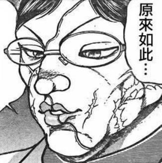
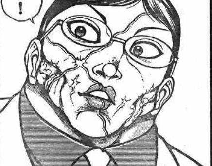
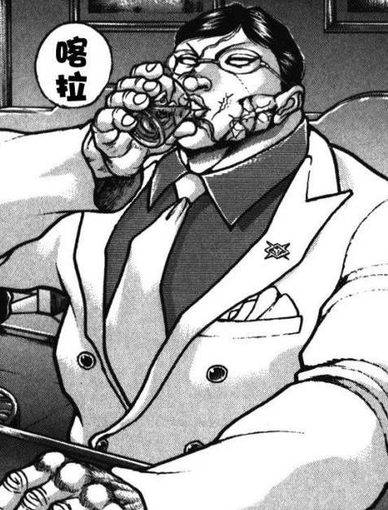
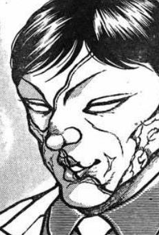
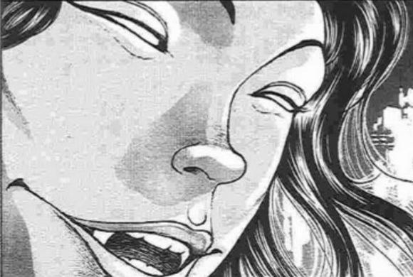
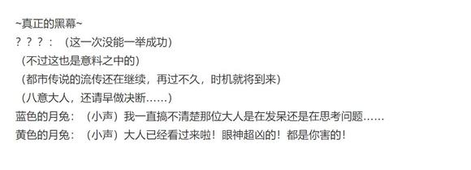

花山的震惊【1d100：71】

花山：我看不清楚你的样子……

但我很熟悉这种感觉

烈海王，是你吗？

烈：——我不想对你说谎

花山薰，我是烈海王

我之前输掉之后到了一个奇妙的地方……然后现在，暂时回来一趟

烈的说明【1d100：52】（50以上大致理解）

花山笑了

花山：像童话故事一样

还有19分钟，来喝一杯吧

我请客

~街边的酒吧~

花山打开了一瓶威雀威士忌

武术家与流氓坐在小小的吧台前，喝着放入冰块的烈酒

只有短短的19分钟……他们并没有说到太多的东西

说起来这个世界中，武藏的结局如何？【1d10：7】

1 夺命之吻

2 被刃牙干掉了

3 至今逍遥法外

4 夺命之吻

5 被老英雄守护了！（为啥啊）

6 被刃牙干掉了

7 夺命之吻

8 被勇次郎干掉了！（为啥啊）

9 夺命之吻

10 大成功/大失败【1d2：2】

克巳又怎么样？【1d10：9】

1 独臂空手道还未大成

2 机械克巳！

3 复制了烈的手臂（为啥啊）

4 独臂空手道还未大成

5 机械克巳！

6 复制了自己的手臂

7 独臂空手道还未大成

8 机械克巳！

9 独臂空手道已然大成

10 大成功/大失败【1d2：2】

花山并没有提起武藏

他只是跟烈说着最近发生的事情——出现了一位很厉害的相扑手，奥利巴的肋骨碎了现在还在住院，克巳的独臂空手道练成了，大家现在准备跟大相扑打比赛……

之后，花山听烈讲着他的故事

他听到烈的武术变强了，听到烈找到了一个对她很好的女朋友，听到烈认识了很多妖怪……

他听到烈说他看到了自己与武藏的战斗

他听到烈海王很感激他

两人的故事刚刚说完，19分钟已经过去了

格斗家们相互碰了碰杯，将劣酒喝尽

玻璃杯掉在了小小的把台上

而旁边那模糊的黑影已经不在了

仿佛这里从来就没有第二个人，只是未成年的流氓怀念起了过往的时光，便拿出两个杯子祭奠着过去的朋友

花山揉了揉眼睛，突然发现一旁的杯子里有些东西

那是一朵不知从何而来的鲜花

他捧着烈的杯子，脸上露出了笑容

花山组的老大今晚很开心

整条街上的人都能听到他那豪迈的笑

~博丽神社~

魔理沙：哎呦，真是吃力不讨好的差事

——你怎么哭了？

烈：我去看了一个老朋友，顺便问了一下朋友们的近况

大家境遇不同，但起码都没死……我很开心！

魔理沙：哇，哭的更厉害了！

你离我远点！

堇子被救醒之后绑在了柱子上，和蔼可亲的幻想乡强者们围在了她的身旁

华扇：现在神秘珠已经全都放回外界了

佐渡的二岩，用你的都市传说消除掉她的记忆怎么样？

猯藏：黑衣人那个只是闹着玩的

没法做到真正消除记忆啊

灵梦：只要她不再闹事了，放着不管也没问题吧？

对了，那颗奇怪的珠子呢？

魔理沙：在我这里！这可是我的战利品

神子：先借我研究一段时间如何？

我不会私吞你的珠子，这点你大可放心

白莲：大家是不是先听听堇子小姐怎么说吧？

这孩子好像挺害怕的……

堇子的悔过【1d50：22+50=72】（被痛揍一晚+50）

堇子：对不起了……我给大家添麻烦了……

烈：对了，堇子小姐

关于这颗被掉包的珠子你知道些什么吗？

堇子：神秘珠被掉包了？什么时候？

烈的说明【1d100：8】

烈：哦哦哦哦哦哦哦！

烈海王急于表达自己的想法，开始对着空气手舞足蹈了

堇子：哎哎哎哎哎哎？还是要杀掉我吗？！

神子：不不不，这个是正常现象来的

白莲：看来这次神秘珠异变终于结束了！

之前烈先生奇迹般的口才，想必是神秘珠的影响吧

【1d20：9】分钟后

灵梦：——明白了吗？

你这次可是完完全全被人利用了

如果这份力量真的被你所释放出来，将会发生无法预料的后果

最坏的结果，就算幻想乡与外界被同时毁灭都是有可能的

堇子的震惊【1d50：23+50=73】（真的很恐怖+50）

堇子：我完全不知道这件事……

我真的没有想过这会威胁到我自己的世界

烈：那会威胁到这边的世界就无所谓了吗？

堇子：对不起了！真的很抱歉！

现在我才知道如果大家想干掉我的话机会简直多的数不过来了，我却一直以为是自己真的很厉害才会这样

甚至到了最后的决斗，都是靠两位放水才有机会正经败北的……

我以后不会再给大家添麻烦了！

魔理沙：这倒没什么，毕竟在座的各位基本上三天两头就会相互打上一架

你所经历的就是幻想乡的欢迎仪式哦

打完架大家就是朋友了！

华扇：堇子小姐，我最后再问一句

关于这个珠子的来源，你真的一点都不知道吗？

堇子的灵感【1d10:2】

1 不知道

2 不知道

3 不知道

4 不知道

5 不知道

6 不知道

7 不知道

8 不知道

9 有点想法

10 大成功/大失败【1d2：2】

堇子：我真的一点都不清楚

它好像不知不觉间就混在里面了

烈：看来只能等神子殿下的调查结果了

那么，虽然都市传说似乎还在起效

不过神秘珠的异变，就到此告一段落了

堇子被送回了外界，强者们也各自离开了

烈海王与大家告别后，便回到了永远亭

~永远亭~

今天的烈海王故事会开始了

烈的说明【1d100：28】

烈：噗噗噗噗噗噗噗噗——

皮克：嗷嗷嗷嗷嗷嗷哦啊哦啊

（烈海王恢复正常了！）

辉夜：看样子之前是异变的影响

说不定有颗神秘珠跑到他脑子里去了，他才能正常讲话

师匠：唉……

看到他难得有进步就让他全力补习了四天语文，结果这不是完全没用吗

【1d20：8】分钟后

师匠：只是有点内伤而已，很快就好了

烈：——就是这样，最后堇子小姐回去了，事情也就结束了

因幡帝：稍等一下

你们是怎么做到刚好埋伏到堇子的？

如果事先就去到外界埋伏，很容易打到一半就被强制派遣回幻想乡了吧

烈：堇子小姐最后来到神社的时候，不是有很多妖怪把她围起来了吗

这个时候我跟魔理沙小姐其实就在人群外观察情况，并且让恋小姐帮忙操纵了一下堇子小姐的无意识

铃仙：所以其实没人在外面，你们是堂堂正正地跟着堇子一块出去的？

恋恋：对啦！我很厉害吧！

烈：——恋小姐你什么时候又跑过来了？

（恋恋已经走掉了）

烈：但是到了最后，我还是不明白这颗被掉包的珠子到底是从哪来的

师匠：这样的话，不妨用一下你最擅长的推理如何？

烈的推理【1d70:9+30=39】（50以上得知部分信息）

烈：我还是想不到，难不成是有月之民把东西落在地上了？

师匠的守口如瓶【1d100：57】（60以下透露少量信息，30以下透露大量信息）

师匠：本次的都市传说异变，其真身是月之民的某个计划

而这次我们不作任何事情也正是出于这个原因

因为远在地上的永远亭，并不想要站在任何一边呢

烈的理解【1d50：35+50=85】（月之头脑+50）

烈：我大概明白了

月之民们出于某种目的，开展了一个与都市传说有关的计划

堇子小姐的好奇心正好被其所利用

而师匠与辉夜小姐此时正处于尴尬的境地

虽然是月之民，但在地上居住已久，现在也已经是幻想乡的一份子了

站在哪一边都不合理，站在哪一边都会犯错——于是直接选择中立的态度，便不参与本次的异变了

可是，我这次也参与了异变的解决吧？这不会给你们添麻烦吗？

辉夜：解决异变的是幻想乡的肌肉侦探烈海王，跟永远亭的厨师有什么关系啊？

烈：……还能这样吗？

~彩蛋~

一如既往，纯搞笑剧情，无大成功大失败，无能力值升降

~我宇佐见堇子又回来啦~

午后的博丽神社正举办着异变结束后的宴会

具体的参加者是本次异变的参与者们，没怎么干活只是在纯粹享受都市传说的家伙们，还有只是过来蹭酒喝的酒鬼们

一如既往，乱七八糟

堇子：大家好呀，我又来了！

然后，外界的超能力者也加入了

灵梦：哈？你还没吃够苦头吗？

我已经说过你要是再来我们就不会饶你了吧

堇子：你先听我说啦，我也吓了一跳

从那之后不知道是怎么回事，唯独在睡觉的时候

我才会来到这里。

所以我现在，是在梦境之中

魔理沙：咦？压根就抓不住她啊

魔理沙想要抓住堇子，但她的手却直接穿过了堇子的身体

烈：仿若幻梦一场啊……

对了堇子小姐，请问你有搜索到与武藏有关的信息吗？

堇子的调查【1d10：8】

1 压根没搜

2 听说与刃牙打了一场

3 夺命之吻

4 压根没搜

5 听说与本部以藏打了一场

6 夺命之吻

7 压根没搜

8 听说与刃牙打了一场

9 夺命之吻

10 压根没搜

堇子：之前用手机搜索了一下，据说是与一个叫范马刃牙的高中生打了一架

之后就没有任何消息了

烈：是吗……是刃牙解决了他吗

我没有疑问了，多谢你的帮忙

对了，之前你遇到过的妹红小姐说你上次把卡片落在她那了

下次来的时候去找她吧

堇子：那只是随用随丢的卡片而已啦

看上去要上课了，我该走了

真是，简直像一场梦境一样

上课铃响了，堇子从梦境中醒来

她唯独在梦里成为了幻想乡的居民。

此后她的肉体再也未曾进入过幻想乡，

但她的生活已经不再像以往那般枯燥。

~玛丽小姐~

永远亭

烈海王正在准备午饭

恋恋：之前终于成功了一次~

这一次来吓烈海王吧！

喂喂——我是玛丽小姐——

我现在就在你的身后！

烈的惊吓【1d100：51】

烈：吓我一跳

恋小姐您怎么来了？要吃点甜品吗？

恋恋的无意识【1d50：33+50=83】（75以上忘记吓人）

恋恋：对哦，我是来吃甜品的

烈：顺便带几个给阿燐小姐她们一块尝尝吧？

于是，恋恋带着一袋子甜品回到了地灵殿

觉：这个是，恶作剧的战利品？

恋恋：好像忘记吓人了！

~摩托爱好者~

妖怪之山下的玄武之泽

白莲：虽然现在还能用都市传说，但之后这份力量消失了就没法飙车了

请问河童会制作摩托车吗？

荷取：至少要【1000X1d100：80=80000】元呢

白莲：比飞行装置贵那么多？

荷取：因为这东西很帅气啊！而且体积大造起来要蛮久的

白莲的个人资产【1000X1d100：32=32000】元

白莲：要攒一阵子钱了……

~笑声~

千春哥：老大，你很开心？

花山：烈海王送了我一朵向日葵

千春哥的惊讶【1d100：63】

千春哥：烈海王还活着？！

花山：他过得很好呢……

阿巴阿巴，我忘记放骰子了

等我吃完午饭补上

附上本次的骰子

题外话，我刚刚看回复的时候发现花山那里打错一个字......好毁气氛啊

其实一开始写这段的时候是两人随便找了一个酒吧喝劣酒（因为没时间找好地方了）

但后来转念一想，花山不喝威士忌没内味啊，就把前面的描述改了

结果后面的字却忘改了就变成了这样（悲）

还有就是格斗家大战灵异那里，本来想细致地描写一下的

结果发现出来的格斗家太多了，光压就能把堇子压死了（悲）

写着写着感觉像是一群老害以大欺小，就直接对轰一下完事了

由吧友 @望远镜300  制作的视频第12集更新啦！

本期是异变结束后烈的日常，大家有兴趣的话就去看看吧！

补一个彩蛋骰子（无大成功/大失败）

~远程攻击~

说起来烈啊，你平常对战的时候是怎么放远程攻击的？【1d10：10】

1 飞刀

2 普通的放光弹（学自永琳）

3 彩色气弹（学自红海皇）

4 飞刀

5 普通的放花弹（学自幽香）

6 彩色气弹（学自红海皇）

7 飞刀

8 普通的放光弹（学自永琳）

9 扔飞钵（学自圣白莲）

10 曲线激光（学自圣白莲）

烈：之前去找白莲师傅修行的时候学会了发出曲线激光的魔法

虽然由我来说不太合适，但这招的轨迹十分诡异，稍有不慎就会中招

作为远程攻击的手段相当不错

灵梦：魔理沙，我记得你跟白莲对战的时候好像在这招上miss了【1d10：3】次来着

魔理沙：别提了，我看见这个就犯恶心......

由吧友 @望远镜300  制作的视频第13集更新啦！

本集的内容是地狱擂台赛，大家有兴趣的话就去看看吧！

由吧友 @侠极八打 创作的本贴同人文在b站发布了！ https://www.bilibili.com/read/readlist/rl281977

大家有兴趣的话就去看一下吧！

（更新前的短暂说明）

原作中在深秘录剧情过去不久后，接下来的大异变就马上开始了

不过我觉得连续两个异变打起来好累，所以就还是接着日常——原创活动——交流回再接下一个大异变了

那么开始今天的更新

~第161天~

神秘珠异变已然结束，烈海王再次回到了他的日常之中

一如既往，新的一天从接下天狗的超音速报纸开始

烈的躲避【1d100：41】（50以下中招）

烈的破解【1d100：83】（60以上成功）

烈海王伸手一拨，报纸卷便在半空中打起了转，然后被他握在手上

？？？：怎么还能这样——这是犯规啊——

派报纸的天狗嘟囔着飞走了

烈：每天早上收报纸居然都能成为锻炼武艺的好办法，这在半年前我是绝对想不到的

烈今天要做什么？【1d10:2】

1 这天狗扔了这么多天报纸也太过分了吧

2 去问问八云女士吧

3 去找白莲师傅修炼

4 去太阳花田

5 去找红海皇练武

6 去找二小姐玩

7 去旧地狱喝酒

8 去找师匠学习

9 永远亭漫画大赛！（为啥啦）

10 大成功/大失败【1d2：1】

烈：之前听神子殿下讲过神隐与正式进入的区别

按照我现在的情况，我应当也是正式进入幻想乡的

但是，是谁那么好心帮了我一把？正好是在我临死之前，又刚好把我扔到了神子殿下面前……

现在想想，这事真的很不对劲

等到做完早饭之后，就去问问八云女士吧

做完了日常锻炼与永远亭的早饭之后，烈海王前往博丽神社了

路上有事发生吗？【1d100：37】（75以上有）

~博丽神社~

烈海王站在神社前长长的台阶之下

这里是他初次遇见八云紫的地方

烈：八云女士，请问您在吗？

我有个怎么都想不明白的问题，还望您能帮忙解答

有人回复吗？【1d100：98大成功】（30以上有）

烈海王大成功！

大成功是什么？【1d10:9】

1 烈海王灵机一动，突然回想起了自己过来时的细节

2 紫：这一次就免费回答你的问题吧

3 秘神来了！（为啥啦）

4 烈海王灵机一动，突然回想起了自己过来时的细节

5 紫：这一次就免费回答你的问题吧

6 蓝：紫大人之前吩咐过了，有事的话就问我吧

7 烈海王灵机一动，突然回想起了自己过来时的细节

8 紫：这一次就免费回答你的问题吧

9 古明地觉来了！（为啥啦）

10 大成功/大失败【1d2：1】

纯粹的私货骰子：觉有没有坐轮椅？！【1d2：2】

1 有

2 没有

真遗憾，小五没有坐轮椅（悲）

“神隐的主犯大概不在吧，因为她现在正忙于调查先前的异变呢”

出现在烈海王面前的，是拥有着紫色的短发与深红的眼眸的少女

她身穿有心形装饰的淡蓝色上衣以及有玫瑰图案的渐变色及膝裙，穿着粉红色的拖鞋和带褶边的短袜

与烈曾见过的古明地恋相同，少女的身旁同样缠绕有第三只眼，其表皮呈现红色，眼球部分垂于左胸心脏处

古明地觉的好感度【10+50+1d40：15=75】（大成功+50，完成古明地觉的挑战+10）

烈的察觉【1d70：19+30=49】（50以上察觉）

烈：（这一位是谁？她看上去跟恋小姐有点像）

请问您是——

觉：和恋恋相似是正常的，因为我是她的姐姐啊

我是来自地底的读心侦探，古明地觉

烈：（原来如此！怪不得她也有第三只眼）

（——等会，您能听得到是吗？）

觉：可以哦

很抱歉擅自读了你的心，但这是我无法控制的

烈的无所谓【1d50：6+50=56】（我无所谓+50）

烈：（我刚刚好像还想了一下今天的菜谱……这真是失礼了）

觉：不是因为被读心而难受吗？

烈海王终于找到了说话的机会

烈：我自认平日心中没有阴暗的想法，因此就算被他人听到也没什么所谓

（话说回来，您为何会在神社前呢？）

