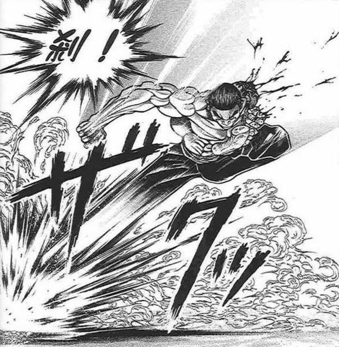
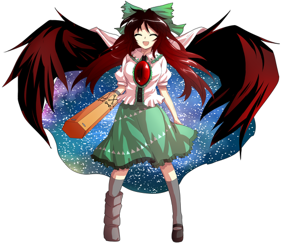

觉为什么在这里？【1d10：4】

1 邀请烈成为侦探助手

2 对于照顾恋恋的感激

3 古明地觉的语文补习课！（为啥啦）

4 邀请烈成为侦探助手

5 对烈海王来到幻想乡的原因感兴趣

6 古明地觉的心理学小课堂！（为啥啦）

7 邀请烈成为侦探助手

8 其实只是昨晚喝太多了

9 古明地觉的战斗讲义！（为啥啦）

10 大成功/大失败【1d2：1】

觉：烈海王，我觉得你是个很有能力的人

拥有着足以自保的身手，巅峰造极的厨艺，同时仅限事件发生时有着极其敏锐的头脑——简直是侦探助手的最佳人选，不是吗？

我想如果在解决事件的时候有你帮忙会轻松很多

当然，我会视情况给你报酬

共同解决的第一个案件，就定为烈海王幻想入之谜，这样如何？

烈：我无所谓！

您既然愿意帮助我解开谜题，我又有什么不帮忙的理由呢？

（不过这样好像就没法自称侦探了……话说回来侦探助手要做什么啊）

觉：你自己解决事件的时候，不需要自称是我的助手哟

在我需要的时候帮忙就好

侦探助手的话……帮忙收集情报，提供思路，最后解决掉敌人就可以了

烈：这些我都很擅长，请您放心

觉：那么就开始调查我们的第一个案件吧

调查的第一步是【1d10:5】

1 让烈叙述幻想入前的场景

2 从神灵庙开始的实地考察

3 想起【恐怖的回忆】

4 让烈叙述幻想入前的场景

5 从神灵庙开始的实地考察

6 寻找八云紫（为啥啦）

7 让烈叙述幻想入前的场景

8 从神灵庙开始的实地考察

9 去外界（为啥啦）

10 大成功/大失败【1d2：2】

觉：刚刚与你交谈的时候我有听到，你来到幻想乡的时候正好落在了神灵庙门口

烈：（然后我应该是遇到了神子殿下，不过当时我处于昏迷状态，具体发生了什么我并不清楚）

觉：你所昏迷的这数分钟，可能就是这起事件的关键了

接下来，去神灵庙询问一下事件的第一目击者丰聪耳神子吧

~神灵庙~

烈：永远亭烈海王与地灵殿古明地觉 求见神子殿下！

出来迎接的是【1d10：3】（2-8神子，1随机人物，10梗选项）

神子：地灵殿之主也来了？

这可真是稀客，两位里面坐吧

【1d10：7】分钟后

烈的说明【1d100：93】

多亏了觉妖怪的辅助，烈海王得以条理清晰地说出了两人今天的来意

觉：这还真是辛苦

我第一次知道人可以同时想着那么多件事情

明明只是简单的说明，为什么会扯到剑术上面？

神子：哈哈哈，他一向是这样的

关于烈刚来的时候啊……让我回想一下

神子的回想【1d10：5】

1 似乎有结界故障的感觉

2 什么都想不到

3 烈海王好像在喃喃自语

4 似乎有结界故障的感觉

5 什么都想不到

6 似乎看到了狐狸的尾巴（为啥啦）

7 似乎有结界故障的感觉

8 什么都想不到

9 似乎看到了巫女（为啥啦）

10 大成功/大失败【1d2：1】

神子：不好意思，我虽然自诩过目不忘，但在那天早上却什么都没有注意到

没有任何征兆，仿佛他突然之间就出现在了我家门口了一样

（当然，对于身为觉妖怪的你来讲，我也没什么必要白费口舌呢）

觉：您说笑了

太子殿下与我有着相似的能力，想要封闭自己的内心也不过是小事一桩

烈：连神子殿下都没有头绪？

神子：倒也不用想的多么复杂，或许只是结界突然间出了问题将你吞了进来

毕竟从你进入幻想乡到我开门之间也应当是有一段小小的时间差，说不定结界的波动在这段时间内恰好被抚平了

（不过我个人觉得不太可能啊）

（毕竟这世间哪里有这么凑巧的事情）

烈的疑惑【1d100：65】

烈：感觉不太可能啊

不管怎么说都多谢您所提供的情报，烈海王在此告辞！

（这周来送菜的时候做什么好呢）

觉：完全是不同风格的心声……

那么我也一同告辞了

神子：调查出结果了就告诉我一声吧！

武术家与觉妖怪离开了神灵庙

烈：觉小姐，您觉得我们现在该做什么呢？

觉的行动是【1d10：3】

1 让烈叙述幻想入前的场景

2 烈海王，你怎么看？

3 想起【恐怖的回忆】

4 让烈叙述幻想入前的场景

5 烈海王，你怎么看？

6 寻找八云紫（为啥啦）

7 让烈叙述幻想入前的场景

8 烈海王，你怎么看？

9 去找八意永琳（为啥啦）

10 大成功/大失败【1d2：2】

觉：我倒是有个办法，不过需要看你个人能否接受了

我可以读取你现在心中的想法，不过对于你所忘却的陈年往事却无能为力

这个时候，就可以采用催眠术

也就是我的符卡 想起【恐怖的回忆】

其原理是读取对方不愿回想起来的心伤记忆——倒是非常适合用在现在的你身上

烈：（确实，来到幻想乡之前我所经历的是生死战）

（那是我一生之中数一数二的，痛苦的回忆啊）

烈的好奇【1d70：52+30=82】（对幻想入的好奇+30）

烈的恐惧【1d80：64+20=84】（对死亡的恐惧+30，战胜妖梦-10）

烈：觉小姐，我还是有些害怕……

我知道这是我应当面对的过去，但是只要回想起刀刃加身的感触，就不由得心生抵触

觉的劝说【1d70：57+30=87】（读心侦探+30，75以上成功）

觉：“收获很大，已然活用于这一次”

“我握住了你的剑！我战胜了她的剑！”

虽然嘴上说着害怕，但是心里却非常激昂啊

烈：——是啊，其实没什么好怕的

现在的我，能否再次面对宫本武藏了？

请指导我，觉小姐！

觉妖怪对着武术家用出了催眠术

——想起【恐怖的回忆】——

下一个瞬间，烈海王回到了地下竞技场

（手很痛……这是……）

烈海王看向前方

他的拳中紧握着武藏的剑

然后，他被武藏所抛了起来

烈海王知道接下来会发生什么

烈的行动是【1d10:5】

1 消力！

2 反击

3 什么也不做，观察状况

4 呼救（为啥啊）

5 反击

6 什么也不做，观察状况

7 一时休战

8 反击

9 什么也不做，观察状况

10 大成功/大失败【1d2：1】

是身体的本能？又或者是下意识的举动？

烈海王瞬间扭转了身体

他用那条完好的腿向着下方猛然踢去

烈的踢击【1d100：74】

武藏的斩击【1d100：57】

那曾置他于死地的斩击，那他当时未能够反应的攻击——

被现在的烈海王击破了！

烈：糟！光顾着打架了，得赶紧观察一下周围的环境

烈看到了什么？【1d10:8】

1 结界上的空穴

2 隙间的痕迹

3 什么都没看到

4 结界上的空穴

5 一片树叶

6 狐狸的尾巴

7 结界上的空穴

8 巫女（为啥啊）

9 门

10 大成功/大失败【1d2：1】

烈海王突然发现，在观众席之中，靠近他这边的位置，有一位略显奇怪的观众正注视着他

她有着一头绿色的长发，身穿蓝白色的巫女服，看上去与周围的观众格格不入，却似乎被大家忽视了

之后，烈海王回到了现实之中

烈：觉小姐，您看到了吗？！

觉：嗯，我看的很清楚

并且我也知道那是谁

她是守矢神社的巫女 东风谷早苗

烈的情报收集【1d70：1+30=31】（75以上知道早苗）

烈：我似乎只是偶尔听到过这个名字，但没有做过详细的调查

觉：早苗是居住在守矢神社的现人神

她日常的工作是传播神社的信仰，在遇到异变的时候也会出手帮忙解决问题

在各种意义上都比灵梦更像个巫女呢

烈要做什么？【1d10：8】

1 拜访守矢神社

2 在人里寻找早苗

3 好紧张啊，先坐下喝杯茶吧（为啥啦）

4 拜访守矢神社

5 在人里寻找早苗

6 好紧张啊，先去吃个午饭吧（为啥啦）

7 拜访守矢神社

8 在人里寻找早苗

9 觉小姐，你怎么看？

10 大成功/大失败【1d2：2】

烈：日常工作是传播信仰……那么她应当经常在人里出没吧？

觉：的确，我记得早苗时不时会在人里搞些活动来宣传她的神社

像是直通到山顶的索道车，或者免费帮忙除灵之类的

烈：我想去人里待一阵子，说不定碰巧能遇到这位早苗小姐

您要一起去吗？

觉的抵触【1d70：11+30=41】（读心妖怪+30,50以上不去）

觉：尽量不要去人太多的地方就好

我记得人里是恋恋经常去玩的地方……

我也趁这个机会去看一下吧

~人间之里~

今天的人间之里一如既往的和平，人们居住在低矮的房屋之中过着安分的生活

偶尔也有妖怪会来到路边的店铺中买些东西，不过村民们似乎已经习以为常了

早苗在人里吗？【1d100：30】（75以上在）

烈：我四处走动了一圈，但并没有看到绿发巫女的身影

看来早苗小姐今天没有过来啊

觉要做什么？【1d10:2】

1 拜访守矢神社

2 去博丽神社看看（你俩刚从神社出来哎）

3 运动了好久，先坐下喝杯茶吧

4 拜访守矢神社

5 明天再说吧（为啥啦）

6 运动了好久，先去吃个午饭吧

7 拜访守矢神社

8 【1d7：2】

9 烈海王，你怎么看？

10 大成功/大失败【1d2：1】

觉：早苗与灵梦是好友，说不定她现在就在博丽神社那边做客

烈：觉小姐，我们不是刚从神社出来不久吗？

觉的执着【1d100：51】（75以下重新考虑）

觉：嗯……思维有些混乱，稍微重新思考一下

重新思考的结果是【1d10：6】

1 拜访守矢神社

2 说不定与早苗无关（为啥啦）

3 运动了好久，先坐下喝杯茶吧

4 拜访守矢神社

5 明天再说吧（为啥啦）

6 运动了好久，先去吃个午饭吧

7 拜访守矢神社

8 【1d7：5】

9 烈海王，你怎么看？

10 大成功/大失败【1d2：1】

觉：运动了一个上午有点累了

先去吃个午饭再决定之后的行动吧！

烈：（这几步路算运动吗？）

觉：对我来说很累的

烈：我觉得您最好适当多做些运动，就像恋小姐一样

她昨晚拿着菜刀追着堇子小姐跑了半个多小时，连气都不喘一下的

觉：恋恋到底天天在外面做些什么啊？！

午饭的地点是【1d10：9】

1 人里的普通店铺

2 妖怪之山的野餐

3 去白玉楼蹭饭吧！（为啥啦）

4 人里的普通店铺

5 妖怪之山的野餐

6 回永远亭吧！（为啥啦）

7 人里的普通店铺

8 妖怪之山的野餐

9 去旧地狱喝酒吧！（回家了）

10 大成功/大失败【1d2：1】

烈：（人里这边的环境对于觉小姐来说实在不大好受……）

（换个其他的地方吧，去旧地狱喝酒？）

觉：偶尔去参加鬼们的酒宴也不错

烈与觉前往旧地狱了

~旧地狱~

旧地狱现在有事件发生吗？【1d10：4】（2-8一如既往的酒宴，1 10随机事件）

旧地狱的街道上只有喝酒的妖怪们与玩乐的鬼族，和之前相比并没有什么不同

只是，原本想与烈海王打招呼的鬼们在看到觉妖怪后便立刻露出晦气的表情离去了

烈：？？？

之前几次来的时候大家还很欢迎我啊，今天这是怎么了？

觉：并不是每一个人都跟你一样对于被读心无所谓的

实际上，大家都不喜欢被他人听到自己的心声

勇仪：烈和小觉？这可真是奇怪的组合

你们两个怎么凑一块了？

不好意思啦小觉，那帮家伙总是在你面前放不大开

烈的说明【1d100：66】（50以上理解）

勇仪：哦哦哦，在小觉的帮助下居然能够说得这么有条理！

觉：这个人平时到底是如何跟人交流的啊？

烈：跟勇仪她们交流其实都不怎么用说话……

勇仪：有拳头和酒就够了！

（这两个人的侦探组合……这可真有意思，给他们灌点酒吧）

觉：下午还要接着解密，喝酒就算了吧

烈：（我其实想喝两杯）

觉：现在你是我的助手呢，要听我的

正好现在回到地下了，叫阿燐帮忙调查一下吧

【1d120：70】分钟后

烈的醉意【1d70：65】（控制酒量醉意上限-30,60以上喝醉）

烈：——我跟魔理沙小姐齐心协力，才八个回合，就让那个女高中生毙了！

勇仪：哈哈哈哈！说是控制饮酒结果还是喝多了

话说跟女学生打架都要二打一，你们行不行啊？

觉要做什么？【1d10:9】

1 想起【恐怖的回忆】

2 勇仪的暴力醒酒法

3 对他用猫车吧！

4 想起【恐怖的回忆】

5 勇仪的暴力醒酒法

6 明天再说吧（为啥啦）

7 想起【恐怖的回忆】

8 勇仪的暴力醒酒法

9 用他用地底太阳吧！（会死人的）

10 大成功/大失败【1d2：1】

觉：让阿空帮他醒醒酒吧

勇仪：（哇，真的生气了？）

觉：没有生气哦，没有

~灼热地狱遗迹~

在旧地狱的最深处，有着一片熊熊燃烧的火海

这里是现在的间歇泉中心，过去灼热地狱的遗址，其最深处是核融合炉心

觉的宠物灵鸟路空正在这片地狱的中心，进行着她日常操控火力的工作

她外表看上去是身穿白衣绿裙的高挑少女，头戴绿色的蝴蝶结，身披内侧有星空闪烁的白色斗篷

少女的背后有着一双巨大的翅膀，胸前镶嵌着红色的宝石，其左足、右足与右手分别是用来操控能力的【分解之足】【融合之足】以及控制二者的【第三足】

阿空：觉大人，我没有偷懒哦

（我有没有偷懒来着？）

觉：你是怎么做到连自己干了什么都记不清楚的……

阿空，对他用一张你的符卡，不要用太强的那种

阿空：哦哦，交给我！

爆符【Mega-Flare】！

烈的破解【1d100：8】失败

醉酒的烈海王，一瞬间就被急速冲来的超高温火球所吞没了

烈的受伤【1d8：8】

Hp：18-8=10

烈：噗！

不好意思觉小姐，我刚刚又喝多了

（好强的冲击力，想跟她打上一场啊）

阿空的好感度【1d100:1】

好感度居然是1，具体的原因是？【1d10：9】

1 阿空觉得烈身上有股讨厌的感觉

2 阿空：我也不知道哎

3 阿空觉得烈很傻（你认真的？）

4 阿空觉得烈身上有股讨厌的感觉

5 阿空讨厌酒鬼

6 阿空觉得烈会把觉大人抢走（为啥啦）

7 阿空觉得烈身上有股讨厌的感觉

8 阿空讨厌酒鬼

9 阿空觉得烈很丑

10 大成功/大失败【1d2：2】

阿空：觉大人，他长得好丑啊！

光是看着就犯恶心，我可以干掉他吗？

（哇，他真的长得好丑啊！）

烈的内心受伤【1d100;56】

烈：我这脸是天生的……我也没办法啊……

觉：阿空，不要以貌取人哦

烈海王现在是我的助手，所以先不要因为长得丑就攻击他

接下来，酒也醒了，听听阿燐的汇报吧

觉拿出了一个眼球状的通讯工具，从中传出了阿燐的声音

早苗现在在【1d10：9】（2-8守矢神社，1 10随机选项）

阿燐：咱去妖怪之山上看了一下，早苗小姐现在就在山顶上的神社

觉：那么下午的目的地就是守矢神社了

具体的交通手段是【1d10：8】

1 坐缆车吧

2 飞上去

3 爬山咯！（为啥啦）

4 坐缆车吧

5 飞上去

6 坐轮椅吧（好耶）

7 坐缆车吧

8 飞上去

9 阿空航班（为啥啦）

10 大成功/大失败【1d2：1】

烈：（估计觉小姐不喜欢走山路……）

我们直接飞过去吧？

觉：我只是不太喜欢运动而已

阿空记得好好干活哦，我们先走了

烈与觉离去了

前往守矢神社的路上有事情发生吗？【1d100：19】（70以上好事，30以下坏事）

烈海王在天上飞行的时候顺便给自己做了一下急救

烈的急救【1d100：63】（50以上+2,75以上+3,90以上+4）

Hp：10+2=12

具体的事件是什么？【1d10:1】

1 犬走椛的拦截

2 早苗：这就是幻想乡的问候方式

3 射命丸文的八卦新闻突击！

4 犬走椛的拦截

5 早苗：这就是幻想乡的问候方式

6 转转今天心情超级差

7 犬走椛的拦截

8 早苗：这就是幻想乡的问候方式

9 神奈子想玩弹幕游戏（为啥啦）

10 大成功/大失败【1d2：1】

两人飞到了山中的瀑布附近

突然间，一片警告性的弹幕射了过来

“再往前就到了天狗的地盘了，还请二位在此留步！”

出现在二位侦探面前的，是负责警备工作的白狼天狗 犬走椛

她看上去是有着白色短发的矮小少女，头戴小型红色六角帽，穿着白色上衣以及红边黑裙

右手持弯刀，左手持有红叶图案的白色盾牌

烈要怎么做？【1d10:8】

1 这里就靠我烈海王的口才

2 请觉小姐说明吧

3 靠我烈海王的厨艺！（为啥啦）

4 这里就靠我烈海王的口才

5 请觉小姐说明吧

6 靠我烈海王的实力！

7 这里就靠我烈海王的口才

8 请觉小姐说明吧

9 靠我烈海王的推理（这里有什么好推理的吗？）

10 大成功/大失败【1d2：2】

烈：觉小姐，可以请你帮忙说明情况吗？

（不知道为什么，我每次在这种场合都会引起误会）

（话说这位是天狗吧……看上去是使用武器战斗？有点想试试）

觉：明智的选择

说起来你无论看到谁都会有“上去打一场”的想法吗？

“是格斗家的天性”，原来如此

觉的说明【30+1d70：7=37】（50以上起效，读心侦探+30）

犬走椛：我——

觉：“职责所在不得不防”但我们并不是所谓的入侵者哦，只是来参拜山上的神社而已

“早点说啊，我的大将棋才下到一半就飞过来了”抱歉，我也没想到今天的天狗这么敬业嘛，而且是你先飞出来攻击的

“咦！为什么会知道”不好意思擅自读了你的心

哎哎，为什么生气了

烈：觉小姐，你平时是不是也不太擅长与人交流啊？

觉：因为我不怎么离开地下的……

烈的口才【1d100:13】

烈海王想要帮助觉进行说明，但由于太过紧张，开始挥舞着拳头手舞足蹈了

犬走椛：你们两个是来找茬的吧？！

上去参拜神社而已，有必要在这里为难我吗？！

今天就把你们赶回去！

烈的战意【1d100：48】（30以下尝试和解）

烈：正好趁这个机会看看天狗是如何战斗的！

觉的秒杀【1d100：94】

一道暗红色的光线闪过，白狼天狗瞬间倒在地上睡着了

觉：我想尽可能避免没有意义的战斗，就先让她睡一觉吧

烈的震惊【1d100：10】

烈：（毕竟是地灵殿之主啊……刚才那一瞬间的气势，似乎比恋小姐还要强一些）

觉：实际打起来输的肯定是我呢

毕竟我压根就没法知道那孩子在想什么

烈海王将巡逻的天狗搀扶到了一旁的树下并留了张说明的字条，之后与觉妖怪一同离开了

（由于椛椛刚出来就被秒杀了因此不骰好感度）

~守矢神社~

一段时间之前，地灵殿的阿空曾引发过一次间歇泉异变

而妖怪之山上的守矢神社，就是在间歇泉异变发生前不久连带着风神之湖一同出现的

穿过入口处的鸟居，便是铺有方形石砖的参拜道

沿着参拜道一路上行至尽头，就可以看到成片的御柱竖立在道路的两旁，以及那系着粗大注连绳的威严正殿

这便是两人今日的目的地，三位神明所居住的守矢神社了

烈：（跟守矢神社一比，灵梦小姐的神社显得好寒酸啊）

觉：不过，博丽神社在妖怪间的人气可比这里要高多了

一说到开宴会的地方，大家第一时间都会想到去找灵梦呢

烈：（大概是因为灵梦小姐跟所有人的关系都不错吧？）

觉：也可以解释为在她眼里所有人都差不多呢

好了，接下来你先别出声

地灵殿古明地觉，前来拜访

出来迎接的人是【1d10：2】（1诹访子，10神奈子，2-8早苗）

“连地下的妖怪都来参拜神社了？！太好了，这样神奈子大人也会微笑的！”

从神社中出来迎接二人的，正是妖怪之山上的风祝，带来奇迹的巫女，风与湖的通神者——守矢神社的现人神 东风谷早苗

她外表看上去是头戴蛇、蛙发饰的绿发少女，身穿蓝白色的巫女服，以及与灵梦相似的、与上衣在肩膀处分离的白色宽大袖子，手持白色的御币

早苗：是地灵殿的古明地觉小姐和——

（哎，烈海王？！）

觉：果然，你认识他啊

早苗：是觉妖怪的读心术啊……这样可就没办法了

烈：东风谷早苗小姐你好，我是永远亭的烈海王

实际上，我与觉小姐正在调查我会来到幻想乡的缘由

今天上午觉小姐对我使用了催眠术，而我在幻想入前的记忆中看到了您的身影

依您现在的反应来看，那大概不是错觉

请问您对于我来到幻想乡一事的缘由了解多少呢？

早苗的行动是【1d10:5】

1 常识早就丢掉了，先打一场再说吧！

2 其实我什么都不知道（不要啊）

3 其实是神奈子大人的吩咐（为啥啊）

4 常识早就丢掉了，先打一场再说吧！

5 其实早苗是地下竞技场的老观众了

6 其实是诹访子大人的吩咐（为啥啊）

7 常识早就丢掉了，先打一场再说吧！

8 其实早苗是烈海王的粉丝

9 其实是烈的青梅竹马（认真的吗？）

10 大成功/大失败【1d2：1】

早苗：其实我从很久以前开始，就在看你们的比赛了

我记得烈海王第一次上场是在办史上最大比赛祭典的时候

用转莲华秒杀谢尔·达克罗夫，之后一分钟就干掉了手段卑鄙的巨人斗羽

第三轮的时候看到你一拳就让那个愚地克巳下场了，就觉得中华武术真的好厉害啊！

对冠军的那一场比赛，虽然最后输了，但是打的也很棒啊！

烈的震惊【1d100：95】

烈：什么——幻想乡的神明居然会看外界的格斗吗？！

早苗：我们守矢神社其实是前几年才搬进幻想乡的

在此之前我与神奈子大人和诹访子大人都一直待在外界，平时上学很无聊的时候就会去看比赛舒缓压力呀~

来到幻想乡之后，偶尔还是想要回去看你们的战斗，这时候就拜托神奈子大人帮忙让我去外界了

烈：现在的女高中生真的很厉害……

这么说，是早苗小姐你让我进入幻想乡的？

是早苗出手的吗？【1d2：2】

1 是

2 不是

早苗：并不是我

虽然我有着能够招来奇迹程度的力量，但让你突然进入幻想乡这种程度的奇迹，没有长时间的准备是无法做到的

实际上我当时是准备先用奇迹的力量暂时将你救下来的……

结果没想到现在烈海王变成了幻想乡的侦探，这不也很好吗！

（说实话之前看报纸的时候真是大吃一惊，没想到那个烈海王还会破案）

觉：所谓人不可貌相正是如此

不过这样一来，事件就变得更加有趣了……那个时间点烈海王所看到的嫌疑者，应当就只有你一个人而已

早苗，你当时有注意到什么吗？

早苗的回忆【1d10:9】

1 似乎是结界出了问题

2 神奈子大人的力量（为啥啦）

3 诹访子大人的力量（为啥啦）

4 似乎是结界出了问题

5 什么都没有

6 似乎看到了门

7 似乎是结界出了问题

8 隙间的痕迹

9 狐狸的尾巴（为啥啦）

10 大成功/大失败【1d2：1】

早苗：不知道是不是错觉，我似乎有一瞬间看到了狐狸的尾巴

（如果我没有记错的话，那应当是……）

觉：说到狐狸的话，就会想到她啊

无论在幻想乡还是外界，都是相当知名的人物呢——虽然所用的名字并不一样

烈海王，你听说过八云蓝这个名字吗？

烈对八云蓝的了解【1d70：1+30=31】（75以上知道）

烈：完全没印象，她是八云女士的家人吗？

早苗：八云蓝是八云紫的式神

顺便一提，蓝自己也有式神，是叫做橙的猫妖

烈：哦哦！就是橙海王经常挂在嘴边的蓝大人啊

早苗的混乱【1d100：46】

早苗：你该不会把橙教成海王了吧？

烈：橙海王是我的武术班之中的优秀学员

还有一位进步很大的学员是莉格露，现在也已经达到外界一般海王的武术水准了

早苗：之后不如举办一场幻想乡格斗大赛吧！

主要参加者是小妖怪们，实力者们负责解说和做评委

我们守矢神社可以负责出场地的！

（这样既能看比赛又能扩大神社的信仰，真是个好主意！）

觉：真是敬业的巫女，灵梦该向你好好学学

接下来该寻找八云蓝了，这一位找起来可有些麻烦咯

烈：早苗小姐，多谢你的帮忙！

早苗：下次打格斗的时候记得叫我去看啊~

幻想乡的弹幕战很有趣，但我还是喜欢拳拳到肉的感觉呢

早苗的好感度【1d60：28+40=68】（地下竞技场的老观众+40）

早苗目送着离去的二人，脸上露出了微笑

神奈子：今天你很开心啊

早苗：感觉像是自己以前天天在电视上看到过的偶像，隐退之后过上了幸福的日常生活

尽管只是旁观者，也不由得为他感到高兴

诹访子：下次邀请他来神社玩吧~

说起来，迷途竹林那边好像还没有分社的样子

早苗：对哦！竹林里的小妖怪们也可以提供信仰的

下一次去那边传教试试吧！

天色已近傍晚，这是今天二人的最后一次行动了

烈与觉要做什么？【1d10:5】

1 还是去找八云紫吧

2 去找橙吧

3 先吃了晚饭再说（你们今天是出来旅游的吗？）

4 还是去找八云紫吧

5 去找橙吧

6 油豆腐作战

7 还是去找八云紫吧

8 去找橙吧

9 明天再说吧

10 大成功/大失败【1d2：1】

烈：既然橙海王是蓝女士的式神，那她应该也有联系蓝女士的办法

不如去迷途之家问问橙海王吧？我顺带做些点心一块带过去

觉：“中华武术中难得一见的强大者”原来如此，这就是海王啊

“觉小姐想吃点心吗？”嗯……想吃甜品的欲望大概是【1d100：94】

烈：（这不是很想吃吗）

那我一块给您做点吧

觉：“战胜了白玉楼的考验之后，我的厨艺已然大涨了”

你的日常生活还真是丰富多彩

烈的厨艺【55+1d45：20=75】

觉：原来上次恋恋带的甜品就是你做的啊

真不错，下次叫阿燐来跟你学学吧

烈：（阿燐小姐原来还要负责做饭吗……）

~迷途之家~

烈：橙海王，请问你在吗？

出来迎接的人是【1d10：10】（1蓝，10紫，2-8橙）

妖怪贤者从隙间中探出了头

紫：这么晚了还过来拜访我式神的式神

而且还是和地底的觉妖怪一起啊……真是有趣

烈的说明【1d100：74】

在觉的帮助下，烈海王得以顺畅的说明出两人今晚的来意

烈：——就是这样

我们想拜访您的式神八云蓝女士，因此来问问橙海王有没有她的联系方式

紫的行动是【1d10：5】

1 蓝，你自己过来讲吧

2 完成任务就告诉你情报（都已经找上门来了哎）

3 真的只是结界出了问题

4 蓝，你自己过来讲吧

5 你之后会知道的（门）

6 真的只是结界出了问题

7 蓝，你自己过来讲吧

8 其实我们也不知道（不要啊）

9 真的只是结界出了问题

10 大成功/大失败【1d2：2】

八云紫把头缩回了隙间中，只留下了一个通讯用的道具

觉：（这样就读不了心了，真是谨慎的家伙）

紫：我还以为你们今天最多就查到守矢神社那里，没想到连蓝都发现了

这个做事留手尾的笨蛋，之后要好好教训一下她

烈：八云女士，这么说我进入幻想乡这件事本身，正是您的计划吗？！

紫：呼呼，你们为什么每次一遇到事件都会往我的头上想呢？

蓝是我派出去的没错，不过这一次只是简单的监视任务哦

监视某位同事有没有滥用职权，这样的事情

觉的察觉【1d70：45+30=75】（读心侦探+30，75以上察觉）

觉：另一位幻想乡的贤者——不会是她吧？

烈的察觉【1d70：47+30=77】（逆转的名侦探+30，75以上察觉）

烈：我所见过的贤者除了您之外就只有茨华仙人……但她看上去对此事一无所知啊……

您所指的是我并未见过的第三位贤者吗？

紫：觉妖怪已经想到了哦

不过，为了保障趣味性，你就暂时先不要告诉他了

觉：哎呀呀，我真的没想到会是这么重量级的人物

烈的懵逼【1d100：73】

烈：？？？

八云女士，我听不懂你们在说什么

紫：听不懂没有关系，反正再过一段时间你大概就能见到她了~

对了，顺便帮我跟你的师匠带句话

就说“上次的酒味道不错，有机会的话再一起喝酒吧”

紫将通讯器收了回去，之后隙间无声无息的闭合了

觉：我们的第一个案件就到此结案了

烈：（还没有结束吧？无论是幕后黑手还是动机，我都一无所知啊）

觉：幕后黑手我已经知道了呢，只是限于八云紫的要求暂时不告诉你而已

反正按紫的话来说，再过一段时间你肯定会遇到她的

至于动机——那种东西在幻想乡里是最没有意义的事物了

烈：为什么？

觉：因为妖怪们都是些随心所欲的家伙，想要理解她们的动机无异于天方异谈

放出铺天盖地的红雾只是因为不想晒太阳，夺取整个幻想乡的春天只是想让后院的樱花树开花

而我去调查这些案件也并不是出于我自身的责任感——仅仅是因为，这样很有趣而已

烈：我还以为你们会很注重 Why dun it呢

觉：那是魔术师才会在意的东西

那么，本日的调查圆满结束，我也该回地灵殿了

我的事件簿中又多了一个有意思的故事，之后讲给恋恋听吧~

烈：（该不会这才是你破案的真实动机吧？）

觉：谁知道呢？就像我说的一样，这在幻想乡中是最没有必要去关注的事物了

之后遇到案件的话，我会用这东西联系你的

觉把一个眼球装的通讯器交给了烈海王，之后就飞走了

猫妖从小屋里走了出来

橙：咦，烈海王？你怎么来了？

烈：橙海王你好

本来是有些事想要请教你的，不过现在已经无所谓了

对了，我给你带了一些点心，跟猫们一块分着吃吧

烈海王行了一礼便离去了

橙的懵逼【1d100：97大成功】

橙大成功！

大成功是什么？【1d10:6】

1 橙把点心分给了蓝，得到了表扬

2 橙把点心分给了紫，得到了表扬

3 橙海王若有所悟，武术境界提高了（为啥啊）

4 橙把点心分给了蓝，得到了表扬

5 橙把点心分给了紫，得到了表扬

6 橙海王若有所悟，厨艺上升了！（为啥啊）

7 橙把点心分给了蓝，得到了表扬

8 橙把点心分给了紫，得到了表扬

9 橙把点心分给了秘神，得到了表扬（搞什么鬼啊）

10 大成功/大失败【1d2：1】

橙：喵喵喵？烈海王到底是来干什么的？

话说这个点心……是流沙包啊，我似乎也可以试一试

【1d60：50】分钟后

橙：做好了！味道跟烈海王带过来的差不多嘛

下一次做给蓝大人吃吧~

橙海王的厨艺基础值提高了30点

~永远亭~

一天一度的烈海王故事会开始了

烈的说明【1d100:60】

多亏了觉今天的多次辅助，烈海王似乎找到了正常说话的技巧

铃仙：烈先生最近的话术提高了不少啊！

因幡帝：说不定是师匠的语文补习延迟起效了？

烈：——然后我就回来了

辉夜：从博丽神社跑到神灵庙，在人里调查之后去旧地狱喝酒，下午又去了守矢神社和迷途之家……

侦探调查原来是这么费体力的工作吗？

皮克：你哪还算是人！

（只是他们两个思维都不同于常人吧）

（像是中间去旧地狱那块怎么听都觉得很奇怪啊）

师匠：话说回来，幻想乡的第三位贤者……

这我还真是不了解

烈的情商【1d100：80】（75以上起效）

烈：师匠，我想这位贤者对我应当是没什么恶意的

如果她真的想害我，又何必大费周章将我引入幻想乡呢？

想必那一定是一位善良而超然的强者吧

烈海王的背后，一扇小小的门无声无息间合上了

（？？？好感度+5）

辉夜：咿呀——这个战斗狂肌肉脑居然一本正经的为奇怪的嫌疑人说好话——

师匠：烈，你是不是发烧了？

听完了故事，众人散去了

烈：永琳，刚刚八云女士托我向您带话

说是有时间再一起喝酒

永琳：……

嗯，我知道了

过段时间在永远亭办场宴会吧，把所有人都邀请过来

烈：那我可得好好准备

可不能让妖梦小姐她们找到机会说永远亭待客不周到之类的话

永琳：不问问为什么吗？

烈：永琳你不想告诉我，自然是有原因的

那么我就按照你所说的去做

因为你是绝对不会害我的

贤者与武术家在月下相视一笑

一方所顾忌的是，不久的将来将会发生的事件

一方所思考的是，不久的过去已经出现的谜团

但各怀心思的两人，唯有在对彼此的信任方面却从未有过一丝的怀疑

