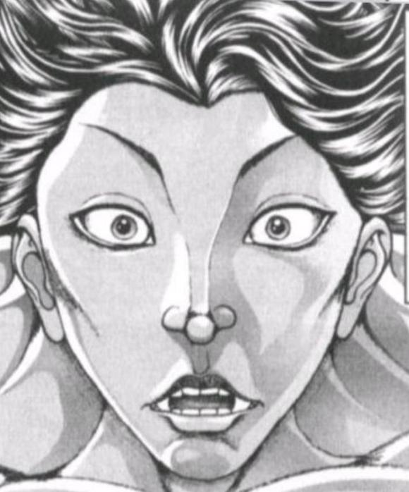
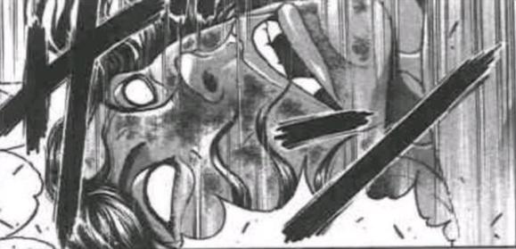

大妖精：感谢【Water wolf】的两位妖怪~

接下来是第三支乐队，大家都很熟悉的【鸟兽伎乐】

有请我们的老板娘米斯提亚小姐与愉快的山彦幽谷响子小姐！

米斯提亚：呀呼！摇滚 爆音 电吉他！

响子：朋克就是灵魂的尖叫！来听我们的歌吧！！！

【鸟兽伎乐】的选曲是【1d10:4】

1 门前的妖怪小姑娘

2 夜雀的歌声　～ NightBird

3 大悲咒（为啥啦）

4 门前的妖怪小姑娘

5 夜雀的歌声　～ NightBird

6 竹取飞翔　～ LunaticPrincess（为啥啦）

7 门前的妖怪小姑娘

8 夜雀的歌声　～ NightBird

9 感情的摩天楼　～ CosmicMind

10 大成功/大失败【1d2：1】

*巨大的爆音*

响子：Yahooo！！！！！！！！

佛经道理全部扔到一边，我是命莲寺的愉快山彦！！

米斯提亚：醉鬼兔子女仆庭师黑曜石都统统给我去死啊！！！！！

不要在人家的场子点鸡肉串啊！！！！！！！！

烈：我承认她俩的声音很好听……但是这样的也能叫歌吗？

幽香的评价【1d100：42】（对小妖怪不会用魔炮，但40以下会扔花弹）

幽香：编曲和声线都还可以

但是歌词简直是毁灭级的灾难

跟夜雀说一声，下次自己单干比较好

——【鸟兽伎乐】演出结束——

烈：老板娘跟响子小姐都辛苦了！

顺便一提，幽香女士认为你们的歌词似乎有些……不太恰当……

响子：因为我们是来发泄的啊~

米斯提亚：生活压力太大了！歌声已经变成减压的道具了！

烈：（得亏幽香女士今天心情还行，不然生活压力怕是要变成生存压力了）

——烈在响子眼里只是普通工作人员因此不骰好感——

大妖精：我头有点晕……她们唱完了吗？？

唱完了？

那接下来请九十九姐妹上场，我先下去歇一会

顺便一提，妖精们的评价是【1d100:27】

看上去妖精们不喜欢摇滚

弁弁：让你们这帮业余人士见识一下什么是真正的音乐！

八桥：虽说打架只是三流而已，但我们的音乐造诣可是一流的！

弁弁与八桥的选曲是【1d10：10】

1筝曲【下克上安魂曲】

2弦乐【风暴的合奏】

3弦乐【净琉璃世界】

4哀歌【人琴俱亡】

5两吟【星辰降落之歌】

6音符【大热唱琵琶】

7平曲【祇园精舍的钟声】

8幻想净琉璃

9 Magical Storm

10 大成功/大失败【1d2：1】

九十九姐妹大成功！

大成功是什么？【1d10:7】

1 辉光之针的小人族　～ LittlePrincess（基础值+10）

2 今昔幻想乡　～ FlowerLand（基础值+20）

3 第六十年的东方审判　～ Fateof Sixty Years（基础值+15）

4 幽雅地绽放吧，墨染的樱花　～Border of Life（基础值+10）

5 Last Remote（基础值+10）

6 献给已逝公主的七重奏（基础值+10）

7 幽梦　～ InanimateDream（基础值+20）

8 Bad Apple!!（基础值+15）

9沉睡的恐怖　～ SleepingTerror（基础值+20）

10 大成功/大失败【1d2：2】

与先前登场的三支乐队不同，九十九姐妹选择的是彻头彻尾的纯音乐

使用着琵琶与古琴却演奏出了电子音乐的感觉，不得不称之为神迹

烈的察觉【1d70:69+30=99】大成功

大成功是什么？【1d10:7】

1 幽香好感度上升【1d5】

2 学会了魔炮（不要啊）

3 九十九姐妹好感度上升【1d10】

4 幽香好感度上升【1d5】

5 九十九姐妹好感度上升【1d10】

6 音乐造诣提升了！

7 幽香好感度上升【1d5】

8 九十九姐妹好感度上升【1d10】

9 音乐造诣提升了！

10 大成功/大失败【1d2:1】

烈：咦？

这曲子给人的感觉很熟悉……神秘，强大却又带有一丝灵动的电子音乐

幽香女士，这是您的曲子吗？

幽香：哎呀，听出来了？

这是很久以前的曲子

那时的灵梦还需要骑着乌龟飞行，魔理沙还是个小学徒

爱丽丝在魔界待着，而我还没搬到花田来——

真的是，很久之前的故事了

幽香的好感度上升【1d5：1】

好感度：95+1=96

（由于现在是演唱会期间，因此好感倾向等到结束再骰）

花之暴君——不，幽香听着这属于她的音乐，回忆起了许久之前的时光

幽香的评价【1d50：29+50=79】（九十九姐妹+30，选曲成功+20）

幽香：曲子与乐器都是很好的

但人还是过于急躁了

她们还需要再练一练——

等到明年的夏天，让她们再来一次吧

——九十九姐妹的演奏结束——

烈：两位辛苦了！

幽香女士非常欣赏二位的实力，给出了79分的高评价

她让你们回去再磨炼一阵子，等到明年夏天再来吧

弁弁：收……收到了下一次音乐会的邀请？！

八桥：之前特地去翻了旧曲谱是正确的选择啊！

长期饭票有着落了哦哦哦哦哦！

大妖精：这真是令人惊叹且华丽的演出！感谢八桥与弁弁小姐为我们带来的美好时光！

接下来，本次演唱会最为重量级的嘉宾终于登场了！

有请堀兹姆利巴乐团！

雷鼓：哟，终于轮到我们上场了

女士们，有信心超过我们亲爱的付丧神姐妹吗？

普莉兹姆利巴三姐妹未发一言，只是举起了手中的乐器

雷鼓：说的也是

还是让我们用音乐说话吧！

堀兹姆利巴乐团的选曲是【1d10：5】

1原初的节拍　～ PristineBeat

2幽灵乐团　～ PhantomEnsemble

3天空的花都

4原初的节拍　～ PristineBeat

5幽灵乐团　～ PhantomEnsemble

6幽雅地绽放吧，墨染的樱花　～Border of Life

7原初的节拍　～ PristineBeat

8幽灵乐团　～ PhantomEnsemble

9今宵是飘逸的自我主义者(Livever)　～ Egoistic Flowers.（好早啊）

10 大成功/大失败【1d2：1】

露娜萨拉小提琴，梅露兰吹小号，莉莉卡弹着钢琴拉着手风琴，贝斯和大鼓由雷鼓负责

四人齐力协作，将许久之前乐队的成名曲完美的展现给了在座的观众们

烈：我想这是今夜最棒的曲子了

真的……真的很好听

幽香的评价【1d50：40+50=90】（堀兹姆利巴乐团+50）

幽香：如果将音乐比喻为战斗的话，她们就是硬实力最强的战士

不需要特地为观众进行调整，也没有必要改变自己最熟悉的曲风

将一切不纯的杂质去除掉之后，留下的除了音乐外便什么都没有了

烈：您是指纯度？

幽香：这倒是个好词

是的，纯度很高

——最后的演奏结束了——

在场的所有人都为这首曲子献上了热烈的欢呼

烈：雷鼓小姐，你的实力果然名不虚传

幽香女士说你们的纯度非常高

雷鼓：纯度？有用吗？

被你这家伙夸奖，我可完全高兴不起来

露娜萨：但是我们很开心啊~

梅露兰：毕竟是那个幽香的认可

莉莉卡：明年再来一次吧，下一次尝试新的曲子！

（同上，工作人员不骰好感）

【1d3：3】个小时后

妖精们散去了，莉格露也走了，只剩下烈海王收拾着满地的瓜子皮和冰棒棍

烈：总算收拾完了……这帮子妖精真是，哪有这么随地乱扔东西的

啊……说起来幽香的感情倾向是……【1d10：5】

1 挚友

2 恋慕之情

3 未来的好对手

4 挚友

5 恋慕之情

6 弟弟（为啥啦）

7 挚友

8 恋慕之情

9 其实早就一见钟情了（为啥啦）

10 大成功/大失败【1d2：1】

娘嘞，真是恋慕啊

那么幽香的态度是【1d10:6】

1 kiss

2 等你成长起来再说吧

3先把你办了再说（不要啊）

4 kiss

5等你成长起来再说吧

6等打赢我再说

7 kiss

8等你成长起来再说吧

9 先去约会吧（不要啊）

10 大成功/大失败【1d2：2】

幽香：哎呀，真是麻烦你了

如果你不在这里，我可得自己慢慢收拾了

烈：幽香女士，您这是说的什么话？

既然帮忙当然就要帮到底了

幽香：是啊，你是来帮忙的

——今后你也会继续帮我吗？

烈的情商【1d100：64】（75以上察觉）

烈：那当然

我来到幻想乡这半年以来，您是帮助我最多的人之一

如果没有您的花弹，我可能早就死掉了

就算帮您一辈子忙，也是我应当做的！

幽香：哈哈哈哈

是吗，一辈子啊

那么我就先提出一个委托吧

——等你变成真正的强者之后，就来跟我打一架吧

烈：幽香女士，这不算什么委托

因为到了那时就算您不说，我自己也会前来挑战！

幽香：啧啧，不怕死吗？

烈：——说实话怕的要死

但是该做的事情还是要做的！

武术家与花之妖怪在深夜的花田立下了决斗的约定

只不过，这时的烈还不知道，幽香的话语究竟蕴含着怎样的深意……

~锻炼~

本次的报酬，幽香的锻炼效果如何？【1d10:7】

1 Atk+3

2 花弹变化了

3 学会了开局小魔炮

4 Atk+3

5 花弹变化了

6 学会了魔炮（不要啊）

7 Atk+3

8 花弹变化了

9 天文密葬法的CT-1（为啥啊）

10 大成功/大失败【1d2：1】

烈的Atk+3

现在的Atk：237（125）

师匠：怎么一夜之间突然变强了？

烈：幽香女士帮我锻炼了一下......

开局就是一发魔炮糊脸......然后是花弹的狙击，我还没反应过来就被拉近了距离

我今天才知道原来幽香女士的近战这么厉害......

~伤势~

说起来魔理沙这一次的伤势如何？【1d70:45+30=75】（75以上住院）

烈：——魔理沙小姐，您这次是怎么伤着了？

魔理沙：双 臂 粉 碎 性 骨 折

铃仙：还是之前那个床位可以吗？

因幡帝：还是之前那个轮椅可以吗？

皮克：嗷嗷嗷嗷嗷哦啊啊

（还是之前那堆纸钱可以吗？）

魔理沙：你们这什么服务态度啊？！

烈：（还是先别告诉她医药费的问题了）

（本日的更新结束，下次更新在周日晚上）

（以下是我的废话）

想必大家也看出来了，这一次的活动我骰的相当艰难

一方面是大成功大失败特别多，另外一方面感觉写成了流水账（而且编歌词好麻烦编出来还特别糟），不得已在选项中加入了金发小女孩以保证趣味性

不过老是迫害魔理沙真的太过分了

大家有什么新的迫害对象吗（

唉，战斗和魔炮一次都不中，好感和学技能次次中招

你们两个相性怎么这么好呢？

好歹最后抽了个拖时间的选项，这要是当场把烈办了我就真不知道怎么编了

顺便一提，虽然放暑假了但是我的日常生活变得更忙了（悲）

具体来说就是每天都得上课，写贴子和发帖子的时间都会变少

今天是难得休息一次所以早上更，之后这个月可能都要晚上更新了

那么今天就到这里，下一次的更新在周日的晚上

顺便一提，新人物安价楼今天下午4点会发

附上本次的骰子

吧友们到不用太担心倒时候打不过的问题。。。

大家应该也看得出来，放水一线是260，其实呢，认真一线也就280左右（

你问那几位论外的家伙？

这个嘛，等到下次大异变就知道了（

所以其实等烈255左右就可以尝试挑战一下了，但是打赢之后的事更胃疼啊（悲）

我得赶紧去学习一下迪亚哥海皇是怎么处理人际关系的

安价楼

烈海王将在【什么地方】与【什么新人物】相遇？

请在此楼回复

再次重申一次，范围仅限于【东方stg正作】与【东方格斗作】中登场的人物，且只能提出一位新人物

1 在【永远亭】遇到了【稀神探女】

2 在【铃奈庵】遇到了【比那名居天子】

3 在【太阳花田】遇到了【射命丸文】

4 在【三途川】遇到了【四季映姬】

5 在【无缘冢】遇到了【森近霖之助】

6 在【月之都】遇到了【赫卡提亚】

7 在【三途川】遇到了【四季映姬】

8 在【无缘冢】遇到了 【森近霖之助】

9 在【梦境】遇到了【纯狐】

10 在【畜 生 界】遇到了【哆来咪】

烈海王将在永远亭遇到稀神探女

吧友们是真的很会整活

清一色的一线强者已经是家常便饭了，怎么这次还混了两个超级恐怖的家伙进去

提出霖之助的两位真的很温柔（泣）

那么周日的更新内容会是烈海王遇到谈女的故事

......总之先想个办法把觉或者皮克的写字板拿过来？要不然这还怎么沟通啊（

目前为止的存稿我都有保存，请大家放心（

不过贴吧上实际更新的时候我会做些润色和小改动（以及修正计算错误），所以。。大家如果有兴趣可以截个图保存一下

也没必要太过紧张，相信强而有力的吧务团队会守护我们的

由于明天有事，因此改到今晚更新

烈的察觉【30+1d70：58=88】（75以上察觉）

烈：（听这口气应该是永琳认识的熟人，但却特地避而不见……）

（是立场上的问题？还是与她的能力有关？）

我明白了，师匠，是您暂时没法招待的人物吧？

有什么我需要注意的地方吗？

师匠的良心【1d100：26】（50以上提醒）

师匠：这方面就靠你自己猜吧

当做一种锻炼也不错哦~

铃仙：（好过分……哪怕是辉夜大人好歹都会提醒一句的……）

烈的懵逼【1d100：83】

烈：？？？

总感觉师匠给我挖了个坑？

~第186天~

~永远亭~

烈海王醒来的时候，永远亭众人已经离去了，只剩下他跟皮克两人看家

一如既往，新的一天从接报纸开始

烈的格挡【1d100：36】（失败）

烈的破解【1d100：3大失败】

烈海王大失败！

大失败是什么？【1d10:1】

1 今日的报纸是烈的八卦新闻

2 烈被砸晕了！

3 烈被砸进了地底

4 今日的报纸是烈的八卦新闻

5 烈被砸晕了！

6 其实破解成功了，但报纸卷砸到了访客

7 今日的报纸是烈的八卦新闻

8 烈被砸晕了！

9 其实破解成功了，但报纸卷砸到了访客

10 大成功/大失败【1d2：1】

烈：糟——

超音速报纸今日终于起效，一举砸中了烈的脑门

烈的受伤【1d4：4】

Hp：18-4=14

？？？：好耶！半年来终于砸中一次了！

？？？的爽度【1d100：61】

？？？：仿佛像是新年第一天戴上了新的帽子一样的清爽感！

苦练了这么久的投掷终于起效了！

烈：还请您留步

我自认没有得罪过天狗吧？！为什么派报纸要这么暴力啊？

烈的挽留【1d100:7】（30以上起效）

然而，黑发的天狗已经飞走了……

皮克捡起了地上的报纸

今天的报纸标题是：魔理沙的后继者！幻想乡新一代渣男！

皮克的理解【1d100：73】

皮克：你哪还算是人？

（专门攻略BBA的武术家烈海王……为了排除竞争对手不惜坑害魔理沙令其两度重伤……）

烈：师匠之前说今天会有客人前来拜访，那我就先等一阵子吧

【1d6：6】个小时后

来自月之都的访客站在了永远亭的门前

她是一位以手掩口的白发赤瞳女子

来者身穿白色外套与裙边化作箭矢状的紫色连衣裙，领口系着红色的领结，脚踏棕色皮靴

引人注目的是，其身后有着仅在右侧生长而出的白色羽翼

烈的察觉【1d70：37+30=67】（50以上察觉）

烈：（这位大概就是师匠说过的访客吧？）

女士您好，我是永琳师匠的弟子烈海王

昨日师匠吩咐过，说是今日有事外出，让我在此迎接您

如果您有什么需要帮忙的事情，还请吩咐我一声

？？？：…………………..

……………………

……………………

银发女子指了指自己的嘴，摇了摇头

烈的察觉【1d70：10+30=40】（50以上察觉）

烈：您是渴了吗？我去给您倒点水？

摇头摇头

烈：您饿了？我给您做点吃的？

？？？的饥饿【1d100：24】

摇头摇头

烈：（这什么情况……）

您是不愿意说话？

点头

烈的行动是【1d10:6】

1 去找皮克借写字板吧

2 靠我烈海王的手语！

3 劝她说话（不要啊）

4 去找皮克借写字板吧

5 靠我烈海王的手语！

6 靠我烈海王的直觉！

7 去找皮克借写字板吧

8 靠我烈海王的手语！

9 靠我烈海王的推理！

10 大成功/大失败【1d2：2】

烈：这什么情况，用我的直觉想想办法

烈的直觉【1d100：29】（75以上起效）

烈：什么都想不到！

重新思考一下，烈的行动是【1d10：9】

1 去找皮克借写字板吧

2 靠我烈海王的手语！

3 劝她说话（不要啊）

4 去找皮克借写字板吧

5 靠我烈海王的手语！

6 去找觉帮忙吧！

7 去找皮克借写字板吧

8 靠我烈海王的手语！

9 靠我烈海王的推理！

10 大成功/大失败【1d2：2】

烈：用推理技巧试一试……

烈的推理【1d70：68+30=98大成功】（75以上推理出能力）

推理大成功！

大成功是什么？【1d10:4】

1 探女好感度+【1d10】

2 与探女战斗时Atk+15

3 无需翻译，可以理解探女的意思了！（为啥啦）

4 探女好感度+【1d10】

5 与探女战斗时Atk+15

6 无需翻译，可以理解探女的意思了！（为啥啦）

7 探女好感度+【1d10】

8 与探女战斗时Atk+15

9 我完全理解了

10 大成功/大失败【1d2：1】

烈：原来如此，这可真是失礼了

我想您一说话就会带来无法承受的后果，比如说——令所说出的事态逆转？

我去找皮克帮您借一个写字板，还请稍等片刻

探女好感度上升了【1d10：7】

【1d10：7】分钟后

烈：这是我的朋友平常所使用的写字板，您看能用吗？

探女的好感度【7+1d93：76=83】（永琳的弟子+30，地上人-30，大成功+7）

探女（手写）：虽然看上去一副憨憨的样子，但实际上头脑却很灵活，不愧是八意大人的弟子

我的名字是稀神探女

正如你所猜测的一样，我拥有仅凭言语便能让世界的走向改变的力量

因此除非必要，我不会开口

烈：稀神女士您好

请问您这次前来拜访，是有什么需要我们帮助的事情吗？

探女（手写）：原本想着顺路来拜访八意大人，但她果然是避开我了

实际上，我的一位部下与我失去了联系

她是主管情报的黄色月兔

我此行正是为了寻找她的踪迹

烈的理解【1d100：66】

烈：原来如此，知晓大量情报的下属突然失联，难怪您会亲自出场

不过我觉得您没有必要太过紧张……幻想乡大体而言是个安宁祥和的地方，一般不会有人去特地为难人

找人这事我很熟悉，如果您不介意的话，就让我来试试吧？

她的外貌特征大体是怎么样的？

探女的说明（手写）【1d100：42】

探女（手写）：铃瑚是长着耳朵，穿着黄色衣服，喜欢吃团子的月兔

烈等了【1d4：2】分钟

探女（手写）：铃瑚是女性

烈：（靠这点信息找人，确实很有挑战性）

烈的行动是【1d10：4】

1 靠我烈海王的情报

2 靠我烈海王的搜索

3 靠我烈海王的厨艺！（为啥啦）

4靠我烈海王的情报

5靠我烈海王的搜索

6 去问问魔理沙吧（为啥啦）

7靠我烈海王的情报

8靠我烈海王的搜索

9 靠我烈海王的直觉

10 大成功/大失败【1d2：1】

烈的情报收集【1d70：12+30=42】（75以上起效）

烈：最近没有并收集到这位铃瑚小姐的目击情报……

探女（手写）：我也不清楚她平时在哪一块活动

接下来烈要做什么？【1d10:9】

1 靠我烈海王的直觉

2 靠我烈海王的搜索

3 靠我烈海王的厨艺！（为啥啦）

4 去问问灵梦小姐吧（为啥啊）

5 靠我烈海王的搜索

6 去问问魔理沙吧（为啥啦）

7 去拜托觉小姐吧

8 靠我烈海王的搜索

9 靠我烈海王的直觉

10 大成功/大失败【1d10：2】

烈：让我试试我的直觉！

烈的直觉【1d100：14】

烈：什么都想不到！

探女（手写）：这是，地上最新的笑话？

并不能理解笑点在哪里

——再这么下去故事就没法发展了因此皮克过来了——

皮克的建议【1d10:10】

1 去人里收集情报吧

2 拜托魔理沙小姐一起调查吧

3 其实我看见过她（真的假的）

4 去人里收集情报吧

5 拜托灵梦小姐一起调查吧

6 其实我看见过她（真的假的）

7 去人里收集情报吧

8 拜托觉小姐一起调查吧

9 其实我看见过她（真的假的）

10 大成功/大失败【1d2：1】

皮克大成功！

大成功是什么？【1d10:9】

1 在人里的团子店看到了铃瑚

2 魔理沙：我刚刚见到了黄衣服的月兔哎

3 在神灵庙看到了铃瑚（为啥啦）

4 在人里的团子店看到了铃瑚

5 灵梦：我刚刚见到了黄衣服的月兔哎

6 在命莲寺看到了铃瑚（为啥啦）

7 在人里的团子店看到了铃瑚

8 觉：新的委托是寻找月兔的踪迹

9 在博丽神社看到了铃瑚（为啥啦）

10 大成功/大失败【1d2：2】

皮克：你哪还算是人！

（其实我昨天去找灵梦小姐玩的时候，在博丽神社看到了符合描述的人物）

烈：是弹幕决斗吗？

你坚持了几回合啊？

皮克的战绩是【1d10：1】

1 6回合

2 8回合

3 被秒杀了（好菜啊）

4 6回合

5 8回合

6 连大招都没放出来的3回合

7 6回合

8 8回合

9 平局（什么？！）

10 大成功/大失败【1d2：1】

皮克：嗷嗷嗷嗷嗷哦啊啊

（坚持到了第6回合的必杀技，然后就被梦想封印打昏了）

烈：理所当然的结果……

探女的懵逼【1d100：72】

探女（手写）：这个生物只是在说脏话和发出无意义的吼叫，为何你能够与他沟通？

烈的说明【1d100：75】

烈：这是皮克语

虽然只有骂人与吼叫两句话，但通过音调的变化以及面部表情的调整，就可以做到与其他人正常沟通了

探女的兴趣【1d100：69】（75以上学习皮克语）

探女（手写）：通过音调的变化来表达与字面意思所不同的含义

倒确实是一个有趣的思路，但是这样的还是算了吧

烈与探女前往博丽神社了

（由于突然发现冰箱空了因此买个菜回来继续）

~博丽神社~

铃瑚现在在博丽神社吗？【1d100：80】（75以上在）

烈：稀神女士，一会到了神社之后该如何介绍您呢？

探女的介绍【1d10：5】

1 说是永远亭的人就可以

2 说是月兔的上司

3 说是绵月姐妹的同事（为啥啦）

4 说是永远亭的人就可以

5 说是月兔的上司

6 说是月之都的高官（认真的吗）

7 说是永远亭的人就可以

8 说是月兔的上司

9 说是天上的女神（为啥啦）

10 大成功/大失败【1d2：2】

探女（手写）：说我是铃瑚的上司就可以了

不必详细介绍我

烈：明白了

永远亭烈海王，前来拜访！

灵梦：你是来找魔理沙的吗？

话说这一位是？

烈：（为什么会提到魔理沙？）

烈的说明【1d100：47】（50以上理解）

烈：这一位是月兔的上司

皮克说他昨天跟你打到第六回合就输了，之后刚好看到了黄色的月兔

我想那应该就是失联的铃瑚小姐，于是就前来寻找她了

顺便一提，这位女士不方便讲话，因此暂时先靠手写板交流

灵梦：停一下停一下

为什么会扯到皮克？

探女的说明（手写）【1d100：21】（天探女+30，手写-30）

探女在手写板上画了一只在神社里的兔子

探女（手写）：就是这样

灵梦：哈啊？

额……是来吃兔肉火锅的吗？？

