【1d10：1】分钟之后

灵梦：我大概明白了

你们是来找月兔的？

探女（手写）：是的，铃瑚这几天突然失联了

连每日例行的汇报工作都没有做，这是必须要让我亲自确认一下的情况

灵梦的察觉【1d50：45+50=95】（75以上察觉）

灵梦：原来如此

能让月之都的佐具卖特意来到地上，看来她的工作还蛮重要的

探女的震惊【1d100：66】

探女（手写）：没有任何信息就认出来了？

灵梦：啧啧，不能开口本身就已经是非常明显的提示了

我在月之都也待过一段时间，你身上那股感觉跟依姬她们简直是一模一样

烈：（佐具卖？是稀神女士的别称吗？）

话说为什么这位铃瑚小姐会在博丽神社啊？

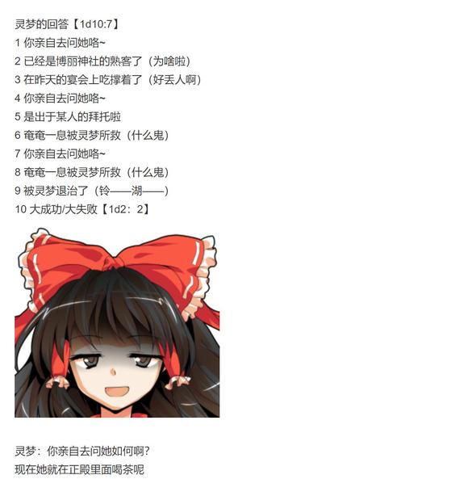

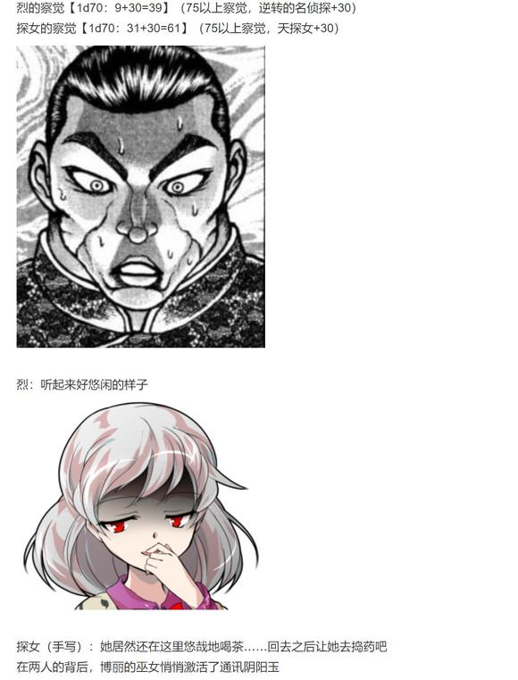

【1d30：22】秒钟后，烈海王与稀神探女走入了博丽神社的正殿

【22+1d6：4=26】秒钟后，两人看到了被绑成一团的月兔铃瑚

【26+1d4：3=29】秒钟后，两人发现正殿中还有另外的【2+1d4：2=4】人

【29+1d4：1=30】秒钟后

博丽的巫女发动了【犯规结界】

博丽神社的正殿此刻彻底与外隔绝

第一位埋伏者【1d10：2】

1 魔理沙

2 神子

3 白莲

4 华扇

5 猯藏

6 紫

7 神子

8 魔理沙

9 白莲

10 大成功/大失败【1d2：1】

第二位埋伏者【1d10：7】

1 魔理沙

2 紫

3 白莲

4 华扇

5 猯藏

6 紫

7 魔理沙

8 魔理沙

9 白莲

10 大成功/大失败【1d2：2】

第三位埋伏者【1d10：7】

1 白莲

2 紫

3 白莲

4 华扇

5 猯藏

6 紫

7 神奈子

8 诹访子

9 白莲

10 大成功/大失败【1d2：1】

第四位埋伏者【1d10：7】

1 白莲

2 紫

3 白莲

4 华扇

5 猯藏

6 紫

7 白莲

8 诹访子

9 早苗

10 大成功/大失败【1d2：2】

神子：哈，原本以为最多钓出个中间管理层

没想到大鱼上钩了

白莲：没有白白耗费时间呢

魔理沙：刚出院第一天就赶上了这么有趣的事，看样子我运气还不错

灵梦：结界的封印已经完成

现在你无法轻易离开了

探女：（八意大人的弟子背叛了？！）

（魔法使……就算与烈海王一起上也应付的过来）

（巫女、圣人、妖僧，相当麻烦……）

“来自天上的佐具卖，让我们好好谈谈如何？”

此刻发言的是最后一位埋伏者

其外表看上去是紫发红瞳的成熟女子，头戴稻草绳，在绳子的右侧，修饰了红枫和银杏的叶片

她身穿白色长袖衫，套红色短袖衫，下着红色长裙，脚踏草鞋

胸口装饰着【真澄之镜】，身后背有围成圆形的巨大注连绳

她正是守矢神社的三神之一，八坂神奈子

探女：（建御名方神……完蛋了）

白发的女神在瞬息之间就明白了自己的处境

她立刻张口，准备发言——

探女的发言【1d100：56】

白莲的阻止【1d50:10+50=60】（灵梦的事先提醒+50）

然而，早有准备的僧侣将手轻轻放在了她的肩上

白莲：这位来自月之都的朋友，还是先不要太过着急吧？

贸然开口对大家都不是什么好事

烈的懵逼【1d100：8】

烈： 原来如此，你们是在准备晚上的宴会吗？

说起来这位女士是？

神奈子的好感度【1d100：68】

神奈子：你还没察觉到吗？

之前看你傻乎乎的给这位神明大人带路，我还以为你也是间谍之一呢

自我介绍一下，吾是守矢神社的神明，山丘与湖的化身，八坂神奈子，理解为早苗的上司即可

探女（手写）：没想到你们进入了幻想乡

神奈子：不愿远离地上，但外界又无人相信神明，便只能自寻出路了

现在吾在这片土地上过得还算不错——

而天津神们的入侵行动又是出于何意？

时隔久远的时光后，想要再来一次天孙降临吗？

烈：？？？

稍等一下，我能询问一下这到底是在干什么吗？

我有些跟不上目前的发展了

神子：还没有回过神来吗，烈海王？

那就让我为你梳理一遍月之民到目前为止的行动吧

首先，这位稀神探女将她的珠子混入了神秘珠之中，以求令幻想乡/外界/月之都同时联通

这个计划被我们所破解了，但月之民的行动还没结束

她们派出了大量月兔潜伏于幻想乡之中

而现在都市传说的流传还在继续，想必她们是企图通过某个流言的成真在此令月之都与幻想乡中重现吧？

而到了那时，月兔与月之民里应外合，从幻想乡开始的，毁灭一切生命的地球漂白计划就正式完成了！

白莲放在探女肩上的手不知不觉间收紧了

探女的疼痛【1d100：59】

探女（手写）：我不会说话的所以请少用点力气谢谢

烈：为什么只是搬家却要变成这么恐怖的事情！？

白莲：烈先生，你总是不愿意往最坏的方向去想

月之民所居住的地方必然是无秽净土

换而言之——那是所有带有【污秽】的生命都不应存在的地方

神子的怒火【1d100:86】

神子：正是，正是如此

哈哈哈哈哈哈哈！仅因为所谓【污秽】的多少便擅自区分了生命的贵贱，这真是我这些年来听过最有趣的笑话！

按照这个道理，白玉楼的主人便是这世界最为洁净无瑕之人——那可是超脱世间的亡灵！你们这些仍有污秽在身的高贵存在，是不是应当奉她为月面之王啊？！

神奈子：神子哟，不必太过愤怒

天津神的自命不凡早已是世人皆知的常识

而现在探究她们的动机才是真正应该做的

灵梦：不……神子应该已经明白了什么

魔理沙：她不是会因为这种念头便如此愤怒的人，因为她自己也是个高高在上的臭屁家伙

神子深深吸了一口气

神子：稀神探女，我现在就打破你最后的妄想

为什么月之民会迁入梦中世界？

为什么幻想乡会有月兔潜伏？

为什么月都高层会选择迁都地上？

答案只有一个

因为月之都早已被那位【纯狐】逼入了绝路！

神子： 你想做的无非是借迁都之名逼迫幻想乡出手解围——若是成功自然万事大吉，若是失败则直接与地上开战

而我们这些地上人的生死存亡，你们从来就没有考虑过！

这才是我真正愤怒的原因

自认高贵的神明居然会用这种卑鄙的手段，真真是可笑至极！

探女的愧疚【1d40：33】（守护月之都-30，地上人-30）

探女（手写）：正如你所说，月之都现在已经被冻结了

纯狐再一次对月之都发起了侵略，但我们现在完全束手无策

——实际上，根本没有月民期望迁都

迁都幻想乡是我们无奈之下的下下策，我只能如此解释

神奈子：哦？但最关键的问题你还是没有说明啊

地上的妖怪与人类们怎么办呢？

探女的坦诚【1d100：92】

银发的女神在这紧张万分的时刻露出了笑容

探女（手写）：只要月之都能够得救

那 些 东 西 怎 样 都 好

烈的震惊【1d100：18】

烈：（早已听闻月之民冷漠，现在一见果然名不虚传）

稀神女士

现在的你很卑鄙！

探女（手写）：你们的看法与我何干？我无所谓

幻想乡的妖怪们提前得知了真相，这的确出乎我意料之外

但即使如此，未来也不会有任何改变

今日最差的结局，不过是我死在这里，潜伏的兔子们全部被消灭——而这又如何呢

无非是换一个人，无非是换一批兔子罢了

神子要怎么做？【1d10:3】

1 先把她揍一顿再说

2 靠我神子的虚张声势

3 靠白莲的劝说

4 先把她揍一顿再说

5 靠我神子的虚张声势

6 靠神奈子的威慑

7 先把她揍一顿再说

8 靠烈海王的推理

9 靠灵梦&amp;魔理沙的人格魅力（为啥啦）

10 大成功/大失败【1d2：1】

神子：圣，交给你了

白莲：唉，嘴上说得好听一到麻烦的阶段就推给别人

白莲的话术【1d50：36+50=86】（圣僧+30，神子的讲解+20，75以上起效）

白莲：我想您不必如此紧张

正如神子先前所说，我们今日的行动并无敌意，而只是想与您谈谈此事的解决方法

在场的各位基本上都是头脑灵活的人物，一个双方都能接受的方案还是拿的出来的

探女（手写）：没有这个必要

八意大人再过不久就会察觉到我的处境

你们的选择无非是在她赶来之前杀了我，或是在她赶来之后放弃，仅此而已

白莲：您很是相信月之贤者的力量——

不过，幻想乡的贤者们可是一位都没到场啊

烈的察觉【1d70：34+30=64】（50以上察觉）

烈：（她们会合作吗？这里该不会是在讹人吧？）

确实，八云女士与华扇女士都不在场，更别说那位未知的第三贤者了

白莲的默契【1d85:3+15=18】（老熟人+30,没听过的人物-15）

白莲：哎？还有第三位贤者吗？

烈：您可能不知道，我说的这一位就是令我幻想入的强者

那是一位低调但却力量极强的世外高人，我简直难以想象她的力量

探女：（八意大人很可能已经被拦截了！）

（而且，幻想乡还有隐藏战力？！）

（糟糕，战力评估出了问题……）

灵梦：我是没听说过这人……不过烈海王平日从不说谎，那大概是真的吧

还要继续固执下去吗？

魔理沙：如果真的要打架我们奉陪哦！

探女的选择是【1d10：7】

1 暂时合作

2 等待永琳

3 直接合作！（认真的？）

4 暂时合作

5 等待永琳

6 抵抗到底！（为啥啦）

7 暂时合作

8 等待永琳

9 探女探女快说话（会死的）

10 大成功/大失败【1d2：1】

探女（手写）：没有想到幻想乡居然还有未知的贤者存在

就先听听你们的话吧

（注：此处未过信任骰是因为白莲的话术已经起效，烈的情报仅作补充）

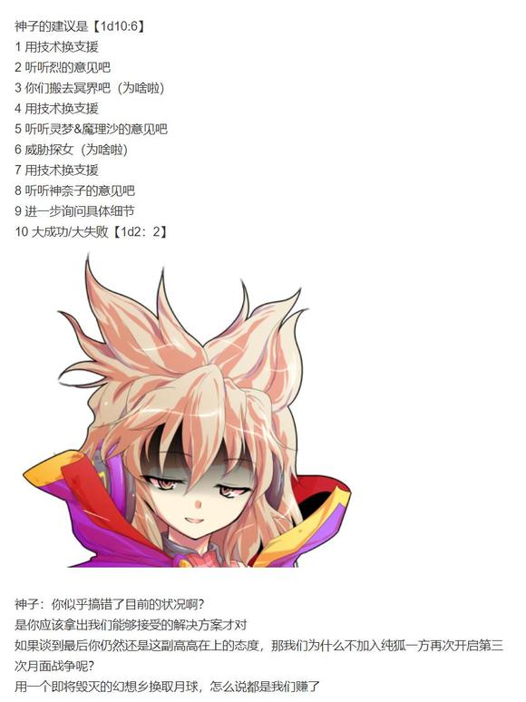

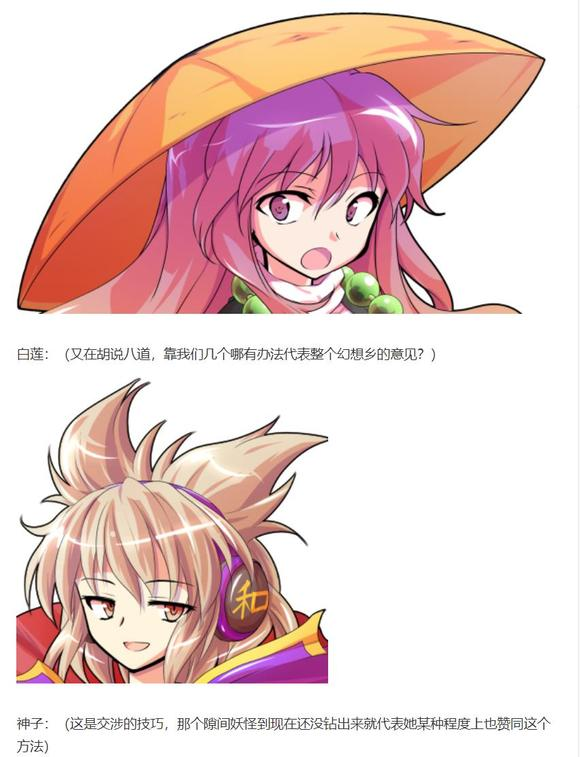

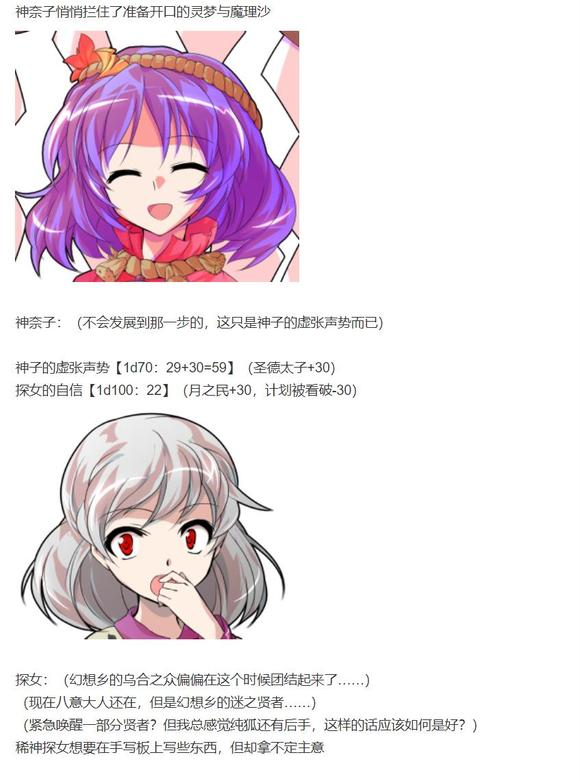

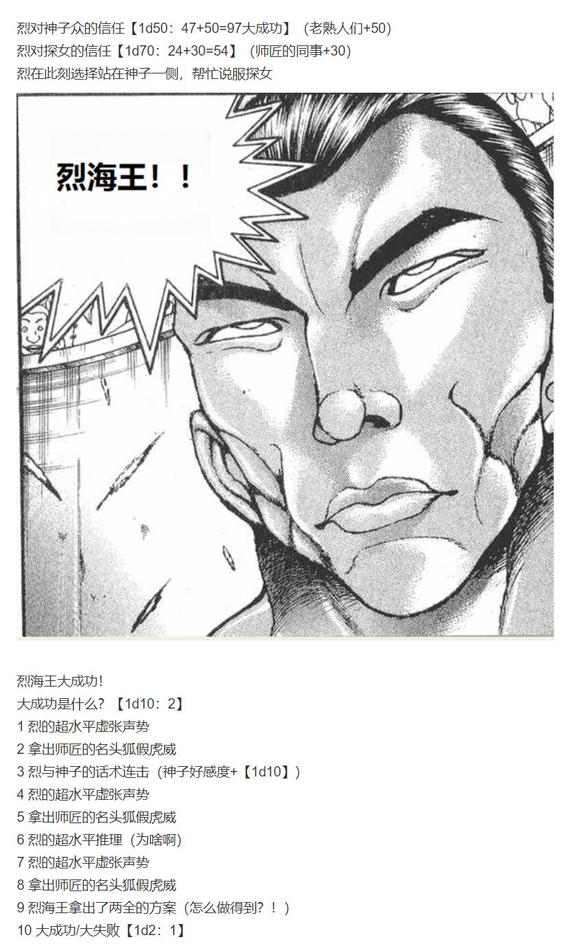

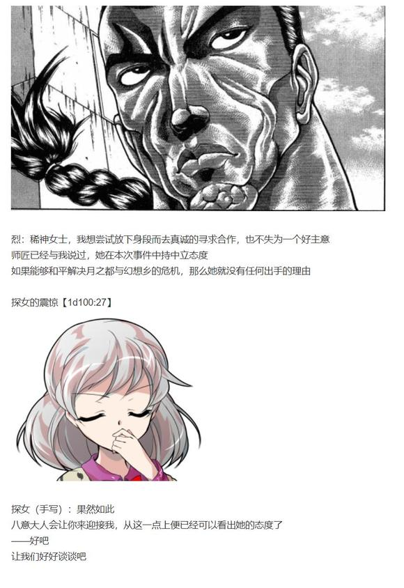

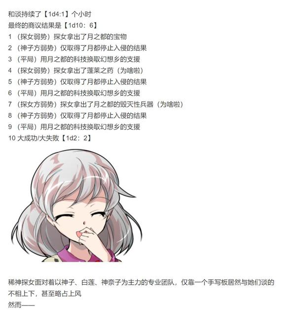

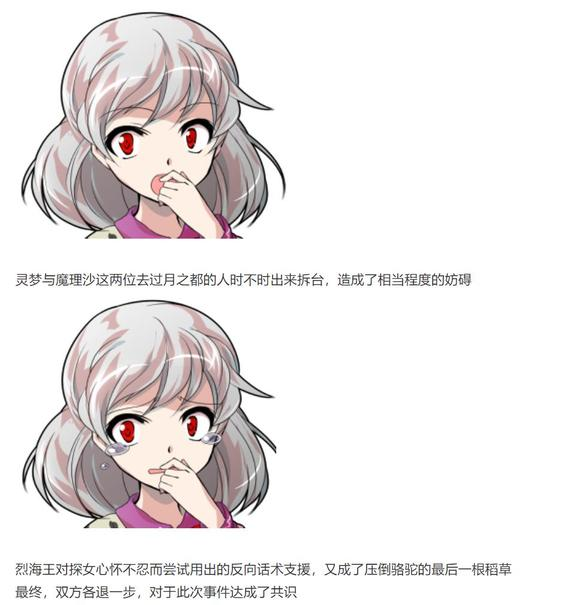

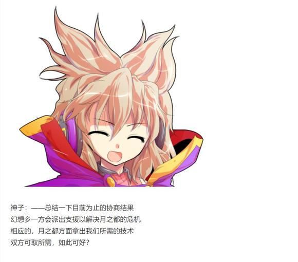

哇，今晚吞楼吞疯咯，全得截图才能发

——隙间打开了——

妖怪贤者扔出了一张清单

紫：正面是目前可以民用的技术

过多引入月都科技会引发幻想乡的不稳定，因此我将需要封存或仅限部分使用的技术印在了背面

这部分的内容就由我们保管吧

当然，在座的各位都有使用权

探女（手写）：我最多给出1/3

紫：全部，不然开战

紫的虚张声势【1d100：98大成功】（妖怪贤者+30，次次都输-30）

八云紫大成功！

大成功是什么？【1d10：8】

1 探女被监管了（不要啊）

2 师匠也同意了！（为啥啦）

3 ？？？的站台

4 探女被监管了（不要啊）

5 师匠也同意了！（为啥啦）

6 探女：我会帮忙的

7 探女被监管了（不要啊）

8 师匠也同意了！（为啥啦）

9 探女：我会帮忙的

10 大成功/大失败【1d2：1】

紫：顺便一提，刚刚我将和谈的结果告知了月之头脑

她很高兴呢，说“这对双方来讲都是好事”

草草草草草，说起来师匠你们现在在干什么啊【1d10:1】

1 地灵殿+旧地狱周游之旅~

2 妖怪之山的野餐~

3 中途发现不对劲然后被紫和华扇拦截了

4 去红魔馆拜访吧~

5 天界风景真好啊~

6 中途发现不对劲然后被？？？拦截了

7 三途河边的风景也不错~

8 白玉楼开宴会啦~

9 其实已经冲到神社门口了！

10 大成功/大失败【1d2：1】

【1d10：8】分钟前

~旧地狱顶部的间歇泉~

辉夜：这水温真不错~这次都不用妹红去加热了~

妹红：我是锅炉吗？

师匠：偶尔泡泡温泉可以缓解肩酸，不过别泡太久哦

铃仙：难得出来玩的时候不是我看家，真好~

因幡帝：那个笑话怎么说的来着？

《烈与皮克在永远亭》？

辉夜：错了错了，是《上白泽慧音在寺子屋》

妹红：不要开这么可怕的玩笑啊！慧音听到之后真的会生气的！

温泉中回荡着欢乐的笑声

就在这时，一位新的客人进入了温泉中

那是八云紫的式神，狐妖的巅峰八云蓝

她头上有着一对狐狸耳朵，头带着有两个尖角的帽子，原本应当穿着蓝色的道服，不过此刻只裹着一条浴巾（由于没找到浴巾图，请大家自己脑补浴巾）

她身后有着九条巨大的尾巴，其耀眼的毛色给人以一种神圣的感觉

蓝：不好意思打扰各位了

紫大人叫我来传条口信

蓝的说明【1d70：39+30=69】（50以上理解，九尾狐妖+30）

辉夜：哈？探女被抓了？迁都计划被看破之后，双方达成了和谈？

师匠：——太好了，这对双方来说都是好事

这样一来之后的事情就好解决了！

铃仙：（师匠，那是你的同事哎……）

因幡帝：（我一直觉得师匠才是咱们这真正的坏胚……）

蓝：然后这里是紫大人给出的交换条件

您意下如何？

师匠：不算太过分

我没有意见，之后的细节你们与探女协商即可

具体的行动计划我早已有所打算，人选也已经决定了

但我们双方都需要再做一些准备

公主大人，一个月后的今日开始如何？

辉夜：我觉得她们再拖半年也不成问题，时间还很充裕

蓝：很高兴与您达成合作

——我的任务已经完成了，可以一起泡温泉吗？

辉夜：把你的尾巴借我玩玩吧~

妹红的懵逼【1d100：32】

妹红：几个老阴谋家又在策划什么东西……

话说这笑话是不是又该改了？

《稀神探女在博丽神社》？

短暂的交谈结束了，温泉中再一次充满了欢声笑语

~博丽神社~

探女（手写）：我接受条件

但是等到计划开始时，我必须确认所谓【援军】的实力

如果连我这一关都过不去，那么也不必再提驱逐纯狐了，我们会再次开启计划

灵梦：哦？你很有自信啊？

魔理沙：不过这也确实，上一次去月之都是我们的惨败吧

紫：这方面的问题会由月之头脑解决

具体的沟通就交给烈海王了

烈：哎？交给我吗？！

紫：没错，和在座的所有人关系都不错的你就是目前最恰当的人选

接下来这个月你就负责跑腿吧~

魔理沙：我跟他关系不好啊！

灵梦：关系超好的吧，你俩

神子：那么今日的工作终于结束了

【纯狐】啊……如果记载没错的话，那可是相当可怕的敌人

神奈子：具体的人选还需要慢慢商量……不过我想也就是你们几个熟面孔

哦，烈海王似乎也可以

灵梦：（怎么回事，这股子麻烦要来的感觉）

对了对了，事情办完就把铃瑚带走吧

这家伙都在我这白吃白喝好几天了

灵梦松开了月兔的捆绑

橙衣黄裤的橙发月兔跑到了探女跟前

铃瑚：探女大人我一句话都没说！

那个道士不知道为什么问了几句话就自己得到情报了！

探女的怒气【1d100：21】

探女（手写）：算了，这早已超出了你的能力范围

之后罚你去当最基层的士兵，以后别管情报了

铃瑚的感激【1d100：23】

铃瑚：（这都能罚我？！什么屑上司……）

白莲：还有最后一个问题

只要探女小姐一开口，今天的所有努力就会全部白费了

探女想说话吗？【1d70：45】（基本达成合作-30,50以上想说话）

探女（手写）：在利益达成一致的当下，我已经没有开口的必要了

如果你们真的有希望能见到纯狐，那么我将会使用这份力量

到时候，月之都的迁都计划与纯狐的入侵计划将会被同时破坏

之后的发展，便交由逆转后的命运决定

烈：稀神女士，您要回月之都了吗？

探女要回去吗？【1d10：2】（2-9回去，1 10 随机选项）

探女（手写）：大致的计划已经商定好了，但许多细节仍旧需要完善

我需要与贤者们进行进一步的讨论

而与地上人们的沟通，在这段时间内就先交给你了

探女把手写板递到了烈的面前

探女（手写）：我稍微改造了一下这块板子，之后你可以在上面看到我所发送的信息

烈：额……这是月之民的短信？

探女的疑惑【1d100：58】

探女（手写）：短信？地上人传递信息的方式吗？

烈的说明【1d100：21】

烈海王想要向探女说明外界的科技，但过于着急，因此挥起了车轮拳

探女的愉悦【1d100：81】

探女：噗呲

在所有人惊恐万分的眼神注视下，稀神探女笑出了声

魔理沙：灵梦！要出问题了吗？！

灵梦：只是拟声词！只是拟声词而已不会出事的！

探女（手写）：这是你今天最成功的一次喜剧表演

不好意思，真是失态了

银发的女神将手写板递到了烈的手里，之后带着月兔离去了

神子的惊吓【1d100：48】

神子：我还以为她要突然变卦，吓我一跳

白莲：啧啧，胆小如鼠的圣人

话说回来，烈先生

我想你应当跟这位天探女学一学，如非必要千万别张口……

神奈子：我差点就以为要当场开战了

烈：我前段时间明明话术发挥都很好的……为什么今天一路不顺呢……

告别了在场的各位强者后，烈海王回到永远亭了

~永远亭~

今天的固定项目不是故事会，而变成了烈的工作汇报

烈的说明【1d100：15】

“哦哦哦哦哦哦哦哦哦哦哦哦哦哦！”

由于今日发生的事情太多了，烈海王急于说明而不由得使出了车轮拳

辉夜在一旁鼓起了掌

辉夜：回来了，都回来了

师匠：这怎么就治不好了呢？上次好不容易都恢复正常了！

因幡帝：烈海王恢复正常了，但是皮克好像不怎么高兴啊

皮克：你那还算是人！

（我的板子怎么在闪光啊？）

【10+1d30：16=26】分钟后

烈在皮克的帮助下终于把今日的故事全都说完了

皮克：你那还算是人？！

（那我的板子怎么办？）

烈：我给你买个新的行吗？

皮克想要新板子吗？【1d100：2大失败】

大失败是什么？【1d10:1】

1 皮克愤怒了！

2 皮克使用了拳击！

3 皮克说话了！（为啥啦）

4 皮克愤怒了！

5 皮克使用了暴力！

6 皮克说话了（为啥啦）

7 皮克愤怒了！

8 皮克使用了咬击！

9 皮克：我来跟她交流！

10 大成功/大失败【1d2：2】

皮克：嗷嗷嗷嗷哦啊哦啊啊！

（我就要这个！）

仿佛是被夺走了心爱的玩具一样，原始人开始大吼大叫

师匠：皮克~之后给你买一个一模一样的所以现在先安静一下~

皮克的恐惧【1d50：36+50=86】（75以上收手，真的很可怕+50）

皮克安静的坐下了

烈：不好意思皮克，我没拦住她……

请你吃【1d6：4】顿大餐行吗？

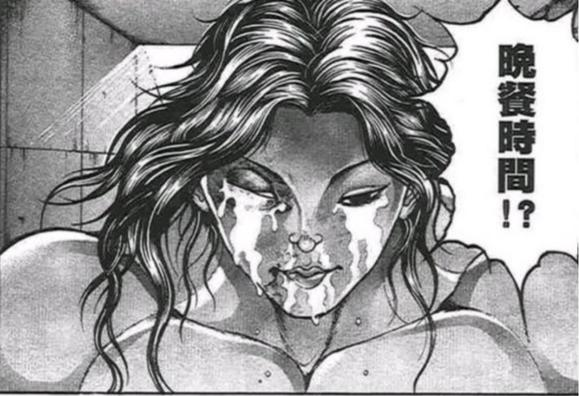

皮克：你那还算是人！

（至少得【1d10：6】顿，不要素的）

因幡帝：这不和你平时吃的没啥区别吗？

安抚了暴怒的原始人之后，众人再次回归了正题

烈：——今天的大题情况就是这样了

师匠，请问那位纯狐到底是？

师匠的守口如瓶【1d100：95】（75以下透露部分信息，30以下透露大量信息）

师匠：抱歉，烈，我现在并不能告诉你有关她的情报

因为这很可能为你带来不必要的危险……了解的太多会让原本简单的战斗变得复杂起来，如果你无意间触动了她的逆鳞，那将是灾难性的后果

我只能告诉你，她很强，强到超乎你的想象

烈：这我倒是已经想到了

能将月之民们逼到这个地步，又怎么可能会是弱者？

辉夜：以往纯狐的进犯都被贤者们所携手击退了

但这次她偏偏攻击到了月之民的死穴

听探女的说法，那可是连看一眼都做不到的，极致的污秽——

对我这种污秽的罪人来说倒是完全无用，但对于她们而言那可是至上的恐怖啊

师匠：与此相同的是，地上的居民们也并不会感到恐惧

这也是求援的意义所在呢

烈：师匠，我还是有问题

就算战胜了所谓的污秽，我们也打不过那位纯狐吧？

难道说你和辉夜小姐也要上阵吗？

辉夜：开什么玩笑

先不提打不打得过，她与我们相见的瞬间真正意义上的死战就会开始

纯粹至极的怒火就是这么不讲理的东西，就算她的愤怒与我们无关也是如此

师匠：烈，你觉得我们的目的是什么？

烈的推理【1d70：67+30=97大成功】（75以上察觉真正目的）

烈海王大成功！

大成功是什么？【1d10:1】

1 下次的异变将与铃仙共同行动

2 辉夜的好感度+【1d10】

3 下次的异变将与魔理沙共同行动（为啥啦）

4 下次的异变将与铃仙共同行动

5 辉夜的好感度+【1d10】

6 下次的异变将与灵梦共同行动（为啥啦）

7 下次的异变将与铃仙共同行动

8 辉夜的好感度+【1d10】

9 下次的异变将与皮克共同行动（搞笑活动？！）

10 大成功/大失败【1d2：1】

烈：（打不过的对手……贸然启用高端战力可能导致死战……月之都的目的……多次进犯……）

——原来如此，令其战意消退才是真正的目的

派出战力适当的地上人与其进行战斗，得到她的认可后劝服这位强者使其退去！

师匠：正是如此

优昙华，一个月之后你与烈一同行动

这一次作战最初的两位参加者，就决定是你们了！

铃仙：交给我吧，师匠！

烈：铃仙前辈，还请你多关照了！

筹备已久的计划在此刻终于敲定

一个月之后，拯救月之都的作战就将正式开始！

（话虽如此，接下来的内容其实是交流回）

（本日的更新结束，下一次的更新应该在周二晚上）

（以下是我的废话）

众所周知，新人物安价回是用来推主线剧情的好机会

——但这一口气推了大半个gzz也属实离谱啊？！

探女过来找铃湖——铃瑚在奇怪的地方——铃湖刚好现在就在——抽到了奇怪的原因——俩人察觉双双拉胯

不是，怎么就能这么顺呢？！

怎么今天你们这么喜欢大成功？！

怎么探女就一个大成功都没有啊？！

结果后面我写的快吐血了，一边推剧情一边讲设定还得琢磨琢磨这烂摊子怎么处理

好歹是把四面保住了，至于某个三面......你EX面再出来玩好不好啊？

这一次尝试写了一下谈判的剧情

说实话不怎么样，完全变成了神子的个人秀

谁让她大成功了

谁让烈也大成功了

谁让师匠她们在泡温泉

总之这个比原创活动字数还多的个人回算是结束了

之后是交流回，然后接大异变

——话说这还算异变吗？

那么本次的更新就到这里，下一次更新应该是在周二晚上

课表经常改动我也很无奈啊（笑）

骰子之后发

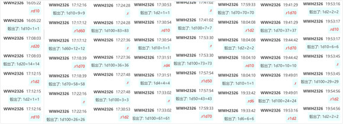

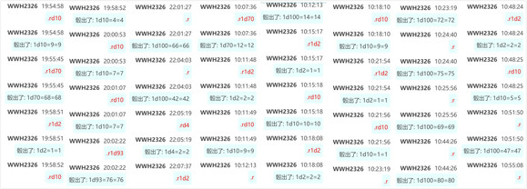

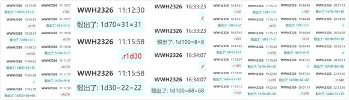

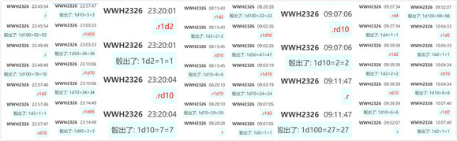

附上本次的骰子

截得时候好像被吞了一点（但是我懒得找是哪一段了）

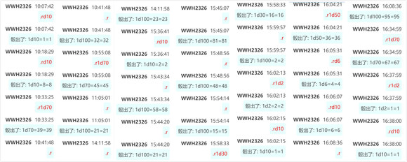

