（补一下被吞的两层楼）

神子的调查进度【1d10：3】

1 灵异珠+月兔

2 1+流言

3 1+梦中世界

4 灵异珠+月兔

5 4+流言

6 1+冰封

7 灵异珠+月兔

8 7+流言

9 完 全 理 解

10 大成功/大失败【1d2：2】

魔理沙拿出了那颗奇怪的神秘珠

魔理沙：还记得我在上次异变时所拿到的战利品吗？

神子调查完之后，发现这玩意拥有令流言成真的力量

神子：这颗神秘珠就是都市传说异变的真正源头

注意到这点之后，我开始留意最近新出现的流言

没想到居然发现了潜伏于幻想乡中的月兔

白莲：我们几个商量了一下，就先抓了一位月兔来问问情况

“现在的月之民生活在虚假的梦中世界”，结果得到了这么夸张的信息

这倒是也可以解释为什么仅仅一只月兔失联居然会惊动了这么大牌的人物——看来目前月之民的人手相当紧缺啊

灵梦：最后的步骤，利用铃瑚钓鱼也成功了

还得感谢魔理沙这几天为我们传递的信息，不然还得担心辉夜她们过来搅局

原本是打算让魔理沙这几天去找烈海王探听情报的——

结果她居然真的重伤了！然后就顺理成章地入住永远亭了！真是可喜可贺！

魔理沙：可喜可贺个鬼啊？！

烈的理解【1d55：27+45=72】（神子与白莲的说明+45）

烈：原来如此，我基本上明白了

稀神女士，不，稀神探女

请问您为何要做出这样的行动？

我想远在天上的月之都与地上的幻想乡，应当不会有什么无法调和的矛盾存在吧？

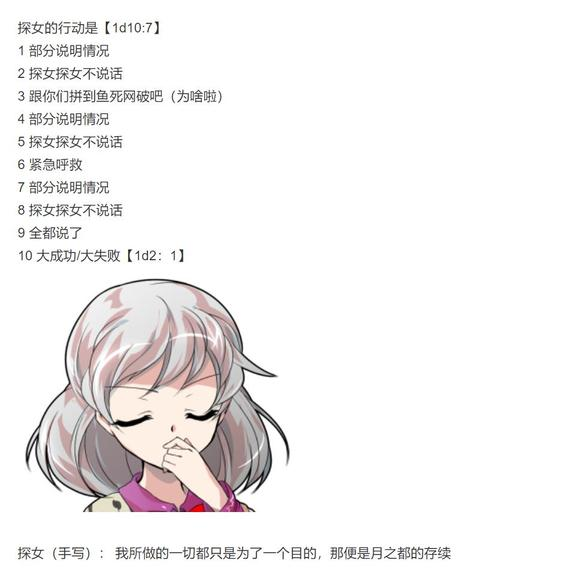

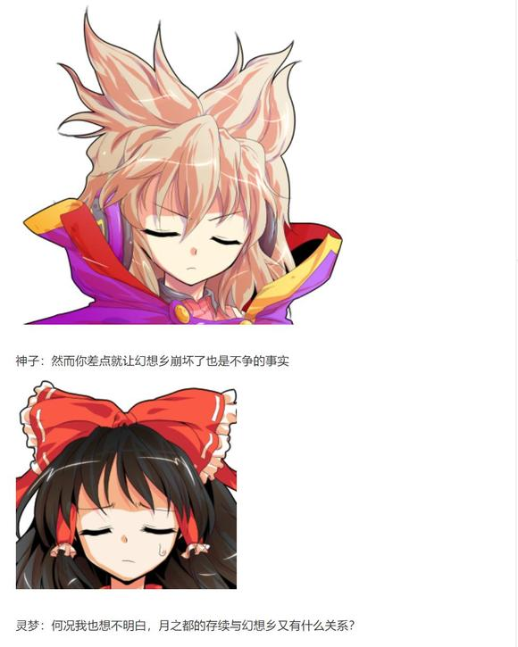

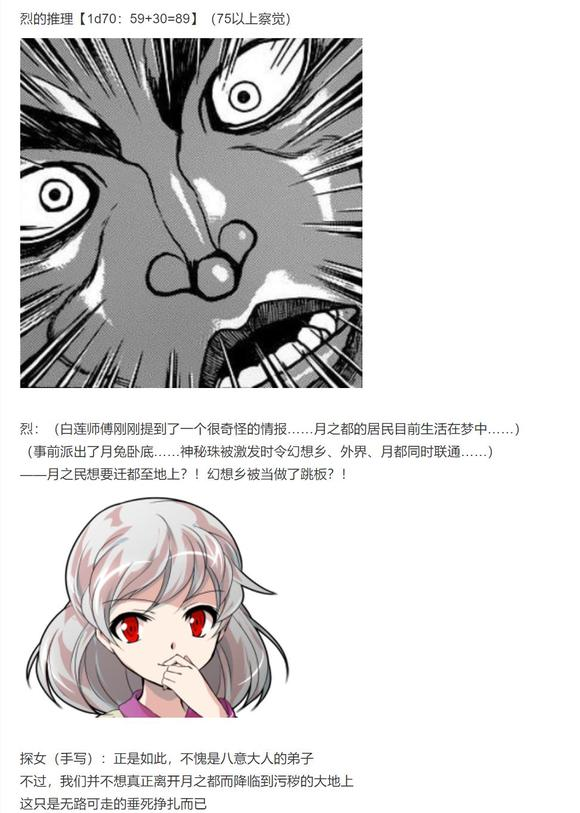

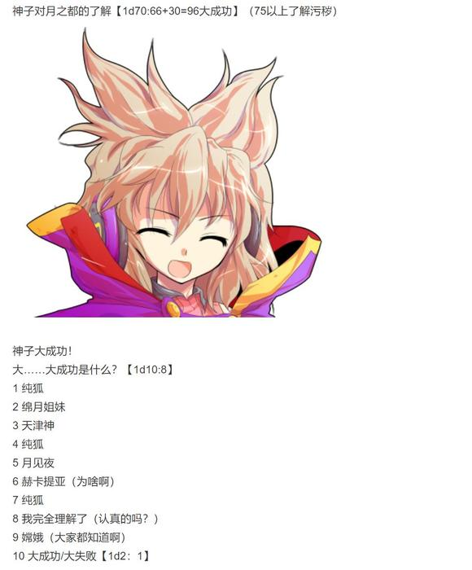

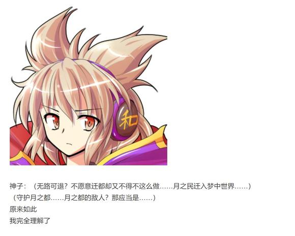

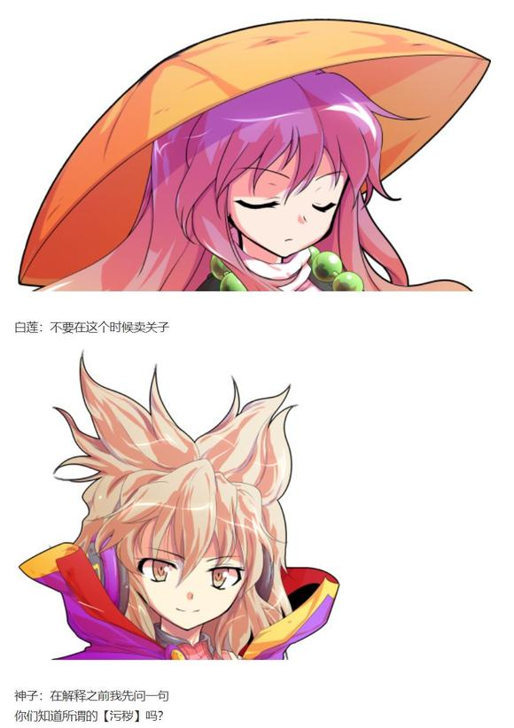

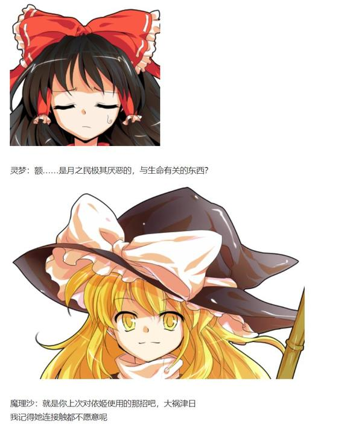

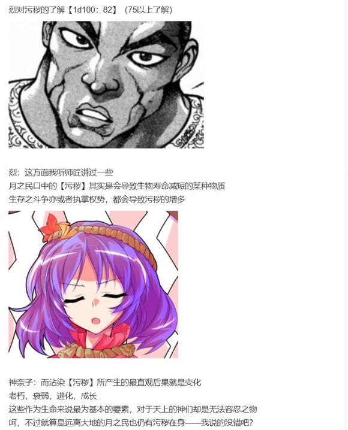

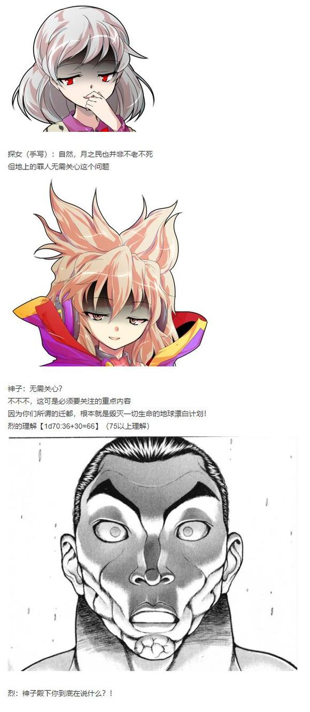

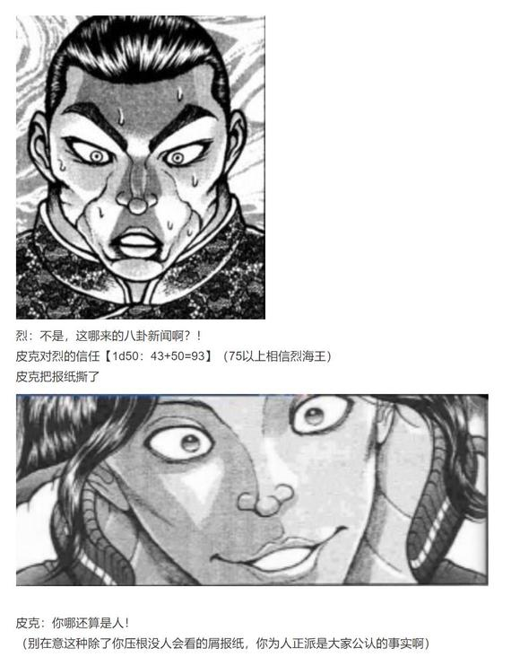

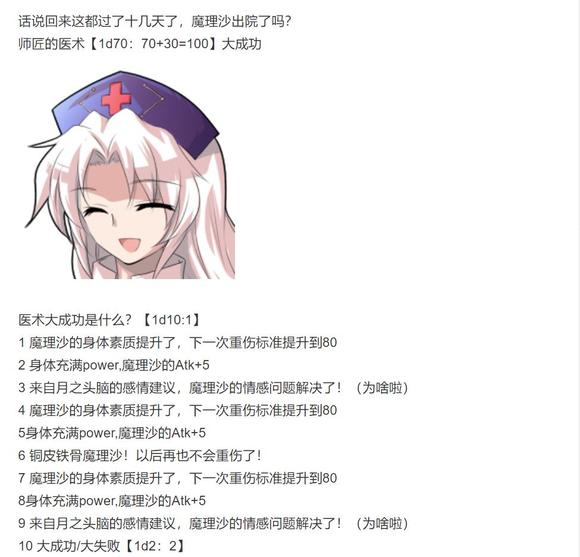

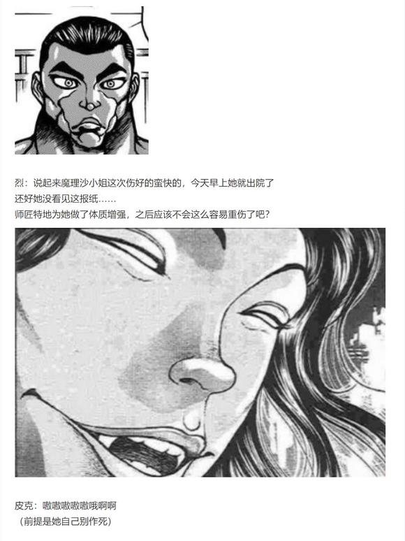

补一下被吞的楼层

由吧友 @望远镜300  制作的视频第15集更新了!

本期的内容是紫的安价回，大家有兴趣的话就来看看吧！

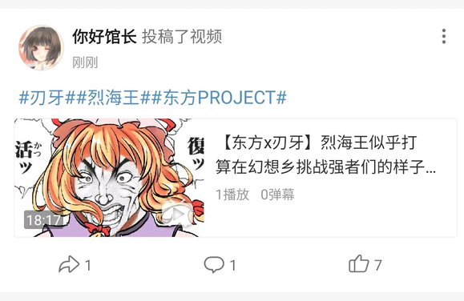

来自热心吧友的翻译招集:

不好意思打扰各位一下

相信大家都听说过之前有有能人士有意将《烈海王幻想入》这个系列翻译成日语上传至niconico

我也找了那位有能人士聊了聊，他表示目前正在进行翻译工作，但由于这个项目需要大量的文本翻译工作，以及还需要涉及到本地化方面的工作，他表示，只凭他一个人的力量，翻译进展十分缓慢，因此，想在此召集各位有能人士的帮忙。如果各位有想法，可以添加这个 Q Q群 ：294225539 。谢谢你们了！

原话：“大家好，我是aitenn。相信很多人看了王子的原贴和馆长做的视频，都感到非常激动。我也一样，有种拾回了久违的激情的感觉。如此好的作品，只让我们自己欣赏实在可惜，因此就有了逆输出的计划。假如火了，那对中日亚文化的文流来说好影响不可估量，就算反响不太好，能够一起做一件有意义的事，也是好事。但我虽然是日语专业毕业，但毕竟不是母语使用者，对安科、东方也不算熟悉，一个人的力量始终是有限的。在此，希望各位懂日语的大佬能够伸出援手，中翻日虽然难度很大，但也算是个很有趣的挑战吧”

大家有兴趣的话就参与一下吧！

大概七点半左右更新

又到了交流回的时间

本次原本是打算按照85以上 75以上 60以上这样的新骰法

但是幽香恋慕太恐怖了，这万一要是再来一个恋慕那我真不知道怎么编了

因此还是按照原本的来吧

（注：由于此前的安价回中与探女建立了暂时的情报交流关系，因此本次特例将探女列入）

那么开始更新

目前好感度大于60的角色是（新人物回遇到的角色不算，未登场角色不算，已经骰了但剧情里没和烈正式见面的如蕾米莉亚不算）

（注：由于此前的安价回中与探女建立了暂时的情报交流关系，因此本次特例将探女列入）

1 师匠 99

2 铃仙 84

3 因幡帝 81

4 皮克 100

5 神子 69

6 圣白莲 78

7 红美铃 80

8 芙兰朵露 96

9 风见幽香 96

10十六夜咲夜 71

11 伊吹萃香66

12 星熊勇仪 94

13 八云紫 81

14 鬼人正邪91

15 少名针妙丸94

16 西行寺幽幽子69

17 魂魄妖梦82

18 博丽灵梦89

19 火焰猫燐62

20 古明地恋87

21 河城荷取72

22 二岩猯藏65

23 古明地觉75

24 东风谷早苗68

25 稀神探女83

26 八坂神奈子68

第一位【1d26：9】风见幽香

1 师匠 99

2 铃仙 84

3 因幡帝 81

4 皮克 100

5 神子 69

6 圣白莲 78

7 红美铃 80

8 芙兰朵露 96

9 十六夜咲夜 71

10 伊吹萃香 66

11 星熊勇仪 94

12 八云紫 81

13 鬼人正邪91

14 少名针妙丸94

15 西行寺幽幽子69

16 魂魄妖梦82

17 博丽灵梦89

18 火焰猫燐 62

19 古明地恋 87

20 河城荷取 72

21 二岩猯藏 65

22 古明地觉 75

23 东风谷早苗 68

24 稀神探女 83

25 八坂神奈子 68

第二位【1d25：9】十六夜咲夜

1 师匠 99

2 铃仙 84

3 因幡帝 81

4 皮克 100

5 神子 69

6 圣白莲 78

7 红美铃 80

8 芙兰朵露 96

9 伊吹萃香 66

10 星熊勇仪 94

11 八云紫 81

12 鬼人正邪91

13 少名针妙丸94

14 西行寺幽幽子69

15 魂魄妖梦82

16 博丽灵梦89

17 火焰猫燐 62

18 古明地恋 87

19 河城荷取 72

20 二岩猯藏 65

21 古明地觉 75

22 东风谷早苗 68

23 稀神探女 83

24 八坂神奈子 68

第三位【1d24：1】 八意永琳

首先是第一位 风见幽香

这是发生在烈海王来到幻想乡的第【186+1d30：3=189】天的事

具体的事件是？【1d10:5】

1 约会（认真的吗）

2 烈向幽香寻求支援

3 风见幽香想变可爱（好可怕）

4 约会（认真的吗）

5 烈向幽香寻求支援

6 风见幽香想学做甜品

7 约会（认真的吗）

8 烈向幽香寻求支援

9 风见幽香想学武术（有必要吗？！）

10 大成功/大失败【1d2：2】

时间回到第186天晚上

~永远亭~

师匠：若是直接派出最强的妖怪们前往月之都，则很可能彻底激怒纯狐引发死斗

此外妖怪们本身也根本无法统一意见，才到半路就闹着要回家简直是必然出现的情况

因此，这个艰巨的任务就交到了你们手上

烈：师匠，恕我直言

我觉得我和铃仙前辈加起来也不可能打得过那位纯狐

铃仙：先不论她是否愿意打弹幕战……

我们能不能在战斗中生存下来都是问题……

师匠：当然，这点我也考虑到了~

为你们特别准备的药物已经在调配之中了

但是你们自己也需要做些准备

辉夜：之前灵梦她们去解决间隙泉异变的时候，就采用了一人出击、多人辅助的模式

而凭借月之都的科技，即使在月面之上也可以让妖怪们为你们提供支援

这就能够保证你们最基本的实力了

烈：哦哦！师匠和辉夜小姐可以提供支援吗？！

辉夜：想得美

我和永琳负责支援因幡，你的支援自己去搞定

师匠：先去拜托你认识的强者吧

实在找不到人的话，我同时支援两人也没问题哦~

~第189天~

烈：怎么感觉跟拉赞助一样……这算是烈海王队的老板吗？

跟我关系不错，愿意提供支援并且平常也没什么事的强者——

感觉幽香女士最符合这个条件

去拜托她试试吧！

烈海王前往太阳花田了

~太阳花田~

今天烈带的甜品是？【1d10：8】

1 蜂蜜莲子雪梨水

2 流心芝士蛋糕

3 木瓜杏仁银耳水

4 红豆沙汤圆

5 热豆腐花（配蜂蜜与花生碎）

6 芝麻糊配芒果班戟

7 烤苹果派+红茶

8 热杏仁茶配糖不甩

9 烤布蕾（抹茶、栗子、红茶、芝士共四种口味）

10 大成功/大失败【1d2：2】

烈：幽香女士，今天给您带了热杏仁茶和糖不甩

这是中华南方的甜品，您试试味道如何？

烈的厨艺【1d45：25+55=80】

幽香：杏仁茶里加了糖桂花汁，口感很好

这个撒了芝麻碎的团子是你那边的独特做法吗？倒是挺有趣的

烈：您喜欢就好

说起来，我今日倒是来求您帮忙的——

烈的说明【1d100：24】（恋慕下不会开战了）

烈海王急于说明自己的来意，在幽香面前挥起了车轮拳

花之暴君微笑着看了【1d6：5】分钟之后使用了花之射击

烈的受伤【4+1d4：1=5】

Hp：18-5=13

幽香：再补一发魔炮吧？

烈：已经完全冷静下来了多谢您了！

【1d10：2】分钟后

烈：——就是这样

一个月之后我将面对无法战胜的敌人

虽说不是生死战，但为了保证存活并完成任务，还是需要强者们的援助才行

幽香女士，请问您愿意帮助我吗？

幽香：啧啧，真没想到妖怪们有朝一日会与月之民并肩作战

第一次月面战争也只是千年之前的事情，看来这一次月之都是遇到大麻烦了

烈的震惊【1d100：41】

烈：千年之前……多么久远的时光啊

幽香：活得久了之后，时间也就不过是单纯的数字罢了

说回你的请求，你这次是打算叫几个外援？

烈：师匠说大概3-4个左右就行了

幽香：算上我最多【1d4:2=2】个

人数再多你的外援们就会自顾自地打成一团

到时候你或许可以向那位纯狐提个暂停战斗的请求，看看她会不会同意？

烈的情商【1d100：36】

烈：我明白了，您是想让我靠口才去说服纯狐吗？

幽香：说不定她会笑到放弃战斗？你可以试试啊

幽香的威压【1d50：28+50=78】（75以上烈闭嘴，花之暴君+50）

烈：不好意思幽香女士，我太没有自知之明了......

幽香：提供支援倒是没什么问题，至于条件嘛——

幽香的行动是【1d10：7】

1 不需要条件了~

2 风见幽香想喝酒

3 风见幽香想变可爱（好可怕）

4 风见幽香想开茶话会

5 不需要条件了~

6 风见幽香想学做甜品

7 约会（认真的吗）

8 不需要条件了~

9 风见幽香想学武术（有必要吗？！）

10 大成功/大失败【1d2：1】

幽香：陪我出去玩一趟就可以了

烈的情商【1d100：91】（75以上察觉）

烈：（这莫非是……约会吗？!）

烈的行动是【1d10:10】

1 别想太复杂先去吧

2 肯定是我想多了

3 我有恋人了！

4 靠我烈海王的直觉！

5 肯定是我想多了

6 我有恋人了！

7 靠我烈海王的口才！

8 肯定是我想多了

9 我有恋人了！

10 大成功/大失败【1d2：2】

烈海王大失败！

大失败是什么？！【1d10：2】

1 堂堂正正的去！（胃疼）

2 他恋爱了（你别啊！）

3 超级冷漠的拒绝（开战）

4 堂堂正正的去！（胃疼）

5 他告白了（不要啊！）

6 超级冷漠的拒绝（开战）

7 堂堂正正的去！（胃疼）

8 超级冷漠的拒绝（开战）

9 烈海王的全力自爆

10 大成功/大失败【1d2：1】

这只是与幽香女士普通的同行？还是说，是她蕴含深意的约会邀请呢？

在阳光照耀的太阳花田中心，风见幽香向他伸出了手

她脸上仍旧带着那和善的微笑，但眼中的那份冷漠却早已不在了

不知为何，烈想起了他与幽香共度的这半年时光

他与幽香坐在花田中吃着甜品，聊着日常的琐事

他与幽香在博丽神社的角落中默默碰杯，注视着眼前欢乐的宴会

他与幽香在萤火虫照耀着的夜幕下，聆听着属于妖怪的旋律

这一瞬间，他是如何思考的？

烈海王并不知晓

他只知道自己反应过来的时候，便已经握住了她的手掌

他只知道自己再次看到眼前的少女，便会感到脸红心跳

他只知道自己已经无可救药的，爱上了名为风见幽香的大妖怪

在烈神情恍惚的时候

花之暴君悄悄露出了暧昧的笑

他们离开了太阳花田，只剩下向日葵后偷窥的妖精们窃窃私语

约会的地点是【1d10：1】

1 风景优美的三途河

2 幽静的魔法森林

3 紫樱盛开的无缘塚

4 去旧地狱喝酒吧！（为啥啊）

5 舒爽的地底核熔炉

6 妖怪之山

7 不如就去迷途竹林吧（不要啊）

8 去天界吧（为啥啦）

9 樱花盛开的冥界

10 大成功/大失败【1d2：2】

~三途河~

现在河边有人吗？【1d100：8】（50以上有）

今日没办武术班，河边看不到小妖怪们的身影

而本该在此的某个死神似乎又跑去摸鱼了

甚至连垒石头的水子之灵都不在，三途河岸边一片寂静

烈：唉，一旦没人监督就全都跑去偷懒了

这怎么行呢

幽香：真可惜，她们不在啊

烈：幽香女士，您是想过来找小妖怪们聊天吗？

幽香：一半一半吧

上一次来三途河的时候，整个幻想乡都开满了鲜花——

那是死神偷懒所造成的后果，但却有很多人都以为是我做的呢

烈：我几乎就没怎么见过那位死神……

她现在也在偷懒吧？但是幻想乡却没有开花啊？

幽香：现在没有那么多的灵魂需要渡河

因此河边也看不到彼岸花了

——话说回来，为什么你会选择在这个地方教武术？

烈：我当时光想着找个安静的地方……

您知道的，幻想乡内有很多地区都是强者们的势力范围，而若是过于靠近人里又会打扰到普通居民的生活

最后思来想去就选了这么个地方，结果效果还不错

荒凉的河岸边变得更加安静了

因为今日前来的两人突然找不到聊天的话题了

——尴尬的沉默——

幽香：（原本想着过来看看花和小妖怪，结果全都没有）

烈：（糟糕糟糕，我完全不知道该说些什么了！幽香女士不会想听这些的！）

为了打破僵局烈要做什么【1d10：9】

1 总之先把手放开如何

2 练武术吧！（为啥啦）

3 谈谈两人的过去吧！

4 总之先把手放开如何

5 唱歌吧！（为啥啦）

6 谈谈两人的过去吧！

7 总之先把手放开如何

8 钓鱼吧！（这里没法钓鱼啊！）

9 谈谈两人的过去吧！

10 大成功/大失败【1d2：1】

烈：说起来幽香女士，我之前听音乐会的时候就有点好奇

您似乎从很久之前就已经认识灵梦小姐和魔理沙小姐了？

幽香：呼呼，那首曲子的故事啊

那时候灵梦和魔理沙都跟现在很不一样

我也并不住在太阳花田

嗯，怎么说呢……

烈：黑历史？

幽香：就是这个词

那可真是过分的故事

我还穿着睡衣就被她们袭击了——

幽香的说明【1d100：71】

烈海王静静地听着幽香讲述从前的故事

两个蛮不讲理的女孩轰开了她家的大门，将沉睡的幽香唤醒了

换了一身正装之后，三人之间展开了激烈的战斗

那时候还没有所谓的符卡规则，战斗就是战斗，用尽自己的每一份力气，到最后还能站着的人就是胜者

之后幽香又去了一次魔界

在那里，她遇到了爱丽丝和她的母亲，以及魔理沙的恶灵师傅——

说起这些故事的时候，幽香说话的口吻不知不觉中改变了

她不再是那个令人畏惧的大妖怪，而像是变成了一个略显俏皮的女孩

烈的察觉【1d70：17+30=47】（75以上察觉幽香的孤独）

烈：（感觉像是变了一个人一样）

（这些故事对于幽香女士来说，就是她珍藏在心中的回忆吧？）

幽香：你在进入幻想乡之前又在做些什么呢？

烈的说明【1d100：35】

烈海王磕磕巴巴地讲述着他的故事

他的叙述混乱且模糊，省略了大量细节的同时还带有强烈的感情色彩

一般人根本无法理解他在讲什么吧？

不过还好，他身旁的妖怪有着充足的时间

那是一个由白林寺开始的漫长故事——

【1d6：6】小时后

烈：——之后我就遇见幽香女士您了

这怎么都到下午了？

幽香：在河畔坐了大半天呢~

烈：难得跟您出来一次，结果完全是在聊天……

幽香：不也挺好的？

之后的战斗我会帮你一把的

不要忘记我们的约定哦

烈海王想要从河岸边起身

这时他才发现，两人的手从离开花田开始就从未松开过

烈的厚脸皮【1d100：5大失败】

烈海王大失败！（此处部分选项等同于幽香大成功）

大失败是什么？【1d10：6】

1 幽香：就这么一直牵着手回去吧~

2 烈过于混乱从而说出了超级不理智的发言

3 烈被幽香抱走了（为啥啦）

4 幽香：就这么一直牵着手回去吧~

5 烈过于混乱从而说出了超级不理智的发言

6 烈被顺带着kiss了（不要啊）

7 幽香：就这么一直牵着手回去吧~

8 烈过于混乱从而说出了超级不理智的发言

9 被其他人看到了！

10 大成功/大失败【1d2：1】

烈：我，这，不是，我

哦哦哦哦哦！

烈海王过于慌张以至于根本无法说出完整的句子了！

幽香：哎呀，牵个手都慌成这样——

绿发赤瞳的少女忽然将脸贴近

下个瞬间，唇与唇相接

烈的脑海刹那间变成一片空白

他完全无法思考了

之后，仿佛蜻蜓点水一沾而过，他的初吻结束了

幽香微笑着后退了一步

幽香：遇到这种程度的刺激，你又该怎么办呢？

花之暴君打着阳伞离去了

只剩下痴呆的烈傻乎乎地站在原地，不知如何是好

【1d3：3】小时之后，恢复行动能力的烈海王回到了永远亭

~永远亭~

又到了烈海王的故事会时间——这还算是故事会吗？

烈的坦诚【1d50：48+50=98大成功】（烈海王+50，75以上说明情况）

草，烈海王大成功

大成功是什么？【1d10:5】

1 你捡了一条命啊

2 看不下去的辉夜提供了支援

3 师匠她无所谓（为啥？为啥啊？）

4 你捡了一条命啊

5 看不下去的铃仙提供了支援

6 皮克的掩护（怎么做到的？！）

7 你捡了一条命啊

8 看不下去的因幡帝提供了支援

9 魔理沙的经验分享（谢谢你）

10 大成功/大失败【1d2：1】

铃仙你怎么做到的？【1d10:3】

1 铃仙：师匠你想想辉夜大人她们！

2 铃仙：这就是外界人的恋爱观！

3 铃仙：师匠你无所谓的！（草）

4 铃仙：师匠你想想辉夜大人她们！

5 铃仙：这就是外界人的恋爱观！

6 铃仙：师匠息怒，等下个月再打死他！

7 铃仙：师匠你想想辉夜大人她们！

8 铃仙：这就是外界人的恋爱观！

9 铃仙：师匠明鉴，都是那花田妖怪的错啊（为啥啦？！）

10 大成功/大失败【1d2：1】

师匠：今日的进展如何啊？

烈：师匠，我好像爱上幽香女士了！

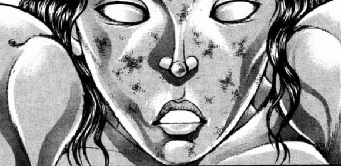

——恐怖的10秒钟寂静后——

师匠：你 再 说 一 遍 ？

烈：我今天下午的时候，那个……被亲了！

师匠：烈，你很好

我也有段时间没动手了

正好借这个机会看看实力有没有退步吧——

【1d10：8】分钟后

皮克：嗷嗷嗷嗷哦哦啊哦哦啊

（烈海王已经没有呼吸了！）

因幡帝：灵魂！灵魂冒出来了！

辉夜：哇，永琳真的生气了！

如果用骰子来比喻就是基础值100然后再骰【1d100】的那种愤怒与狂气！

铃仙：（不能再这么下去了……如果烈海王被打死了，还有谁会叫我前辈！还有谁会帮我做饭啊？！）

师匠，快住手！

你无所谓的！

师匠的迷惑【1d100：12】

师匠：优昙华，你也想过来挨揍吗？这我的确是无所谓的

铃仙：不不不师匠你听我说

以烈先生的黑曜石脑袋，你就算把他打成幽灵或者洗了脑，他也改不了主意！

师匠：——

铃仙：而且师匠你仔细想想，这事你见的多了

无论是公主大人她们三个还是魔理沙小姐她们好几个，这事在幻想乡天天发生永不停息！

烈先生的恋爱观一定是已经被这些司空见惯的日常所腐蚀了才会变成这样！

辉夜：（今晚有你好受的，你给我等着）

铃仙抛出了最后一颗言弹

铃仙：只要师匠你每一次都把他打到再起不能，他之后就再也不敢有什么新想法了——

然后这个糟糕的感情问题就交给时间解决！时间与暴力可以解决一切问题的！

一个月不行磨个几百年总有办法的

所以我才说，您无所谓的！

师匠：好像确实有点道理……？

公主大人，您是怎么处理的？

辉夜：顺其自然咯，还能怎么样

反正现在可是比当年要好的多了

因幡帝：那时候一见面简直不死不休啊……

永远亭的各位不知为何开始缅怀起了过去的时光

皮克偷偷把烈的魂塞回嘴里，然后背着已经快没气的烈海王去做急救了……

~太阳花田~

风见幽香哼着不知名的曲子，无聊地翻阅着今天的文文新闻

她的日常过于无趣，以至于连天狗的报纸都成了她娱乐的一部分

看完的报纸被她随手扔到了柜子里面

那里存放着今年的每一份报纸——

理所当然的，也包括3天前的那份八卦小报

~第189天结束~

——烈的伤势分析——

师匠：下颚骨骨折

下颚节骨骨折

下颚枝骨骨折

左眼窝底骨折

鼻骨凹陷，上颚骨骨折

前齿后齿全部磨损断裂，多处损伤

两鼓膜破损

脊椎左右扭伤30度以上

肋骨粉碎6处

两手骨及手腕全部骨折

两脚骨重度骨折

全身上下多出皮下出血

脑部……内脏多处……

灵魂出窍……

师匠的愧疚【1d100：11】

师匠：这一次就暂且先做到这里~

幽香的事情我们慢慢解决，但你如果再敢沾花惹草——

我 就 把 你 的 X X 捏爆

（口吐白沫）

出去跑个步顺便倒个垃圾，然后继续接下来的交流回

下一位 十六夜咲夜

这件事发生在烈海王来到幻想乡的第【186+1d30：21=207】天（为了保证烈不再继续屑化，永琳的交流回将在咲夜之前进行）

说起来现在烈的伤好了吗？【1d80：62+20=82】（铃仙的医术+20，75以上治好）

烈：铃仙前辈，多谢你们的照顾

现在我总算是能从轮椅上起来了

铃仙：烈先生，你还是去向妹红学几招吧

烈：妹红小姐她很擅长处理感情问题？！

铃仙：妹红能够保证自己每次出事都死不了……

烈：唉……我先去跟红海皇她们打个招呼

差不多都三周没去红魔馆了

烈海王前往红魔馆了

~红魔馆~

女仆长的事件是什么？【1d10:9】

1 咲夜的假日

2 想要给美铃做家乡菜

3 今日的宴会该怎么办呢……

4 咲夜的假日

5 想要给美铃送礼物

6 飞刀技术交流！（为啥啊）

7 咲夜的假日

8 想要跟美铃约会！（你也开始了？！）

9 叫上大家一起去喝酒吧！（为啥啦）

10 大成功/大失败【1d2：2】

烈海王刚刚跑过雾之湖，就看到了一脸苦相的红美铃以及拉着她出门的咲夜

红美铃：烈海王，快救我！

咲夜小姐她不堪重负终于发疯啦！

咲夜：说什么傻话

美铃是第一个，接下来——就到你了

红魔馆的女仆长看向了烈海王

烈的懵逼【1d100：78】

烈：这么了这是？

红魔馆今天罢工？

BGM：フリージア

红美铃的说明【1d100：44】（50以上理解）

红美铃：我们一直以来的努力，全部白费了

从今以后也是，只要红魔馆还有工作，咲夜的压力就会不断累积

烈：红海皇，您在说什么啊？红海皇！

红美铃突然挣脱了咲夜的束缚

红美铃：先下手为强哦哦哦噢噢噢哦哦！

红美铃 使用了 车轮拳

咲夜 使用了 殴打

红美铃倒下了！

红美铃：什么啊，我打的一点都不准啊

红美铃被咲夜扛起来了

烈：红海皇——

红美铃：你的声音为何要颤抖，烈！

烈：因为，因为……

红美铃：我可是红魔馆的门番，海皇红美铃，区区一发冲拳算不了什么

我是不会停下来的，只要你们不停下来，我就会在前方等着你们！！！

所以，不要停下来啊！！！！

红美铃颤颤巍巍地伸出一只手指指向前方——

咲夜：只是叫你们去喝酒而已为什么反应这么大啊！

红美铃：我不要喝酒啊——咲夜喝多了之后次次都往我身上扔刀子——

【1d10：6】分钟后

烈：所以咲夜小姐是想喝两杯？

咲夜：最近的压力说实话真的太大了

就算可以用能力搞定大部分工作，但我自身还是会感到疲劳的……

所以就去请大小姐批了一天假

红美铃：（那叫请吗？大小姐被吓到抱着头蹲在墙角了哎）

烈：哦哦，要去深夜雀食堂啊

我是无所谓，您还要找其他人吗？

咲夜：原本就打算叫上你和美铃的

接下来再找【1d3：1】个人就差不多了

咲夜邀请的下一位成员是【1d10:1】

1 妖梦

2 阿燐

3 魔理沙

4 妖梦

5 阿燐

6 灵梦

7 妖梦

8 阿燐

9 铃仙

10 大成功/大失败【1d2：1】

咲夜：妖梦她也好久没有离家出走了

这次一块叫上她吧

咲夜要怎么做？【1d10:2】

1 砸瓦鲁多

2 通讯器（铃仙制造）

3 让烈海王去叫她吧

4 砸瓦鲁多

5 通讯器（铃仙制造）

6 让美铃去叫她吧

7 砸瓦鲁多

8 通讯器（铃仙制造）

9 大家一起去找她吧

10 大成功/大失败【1d2：2】

咲夜从兜里掏出了一个科技感十足的道具

烈的察觉【1d70：9+30=39】（逆转的名侦探+30）

烈：这是您的新武器吗？

咲夜：这是铃仙制造的通讯器

虽说很方便但平日却用的很少，只有这种时候才会想起来

这样就不用特地过去找她了~

红美铃：以前没这东西的时候一般都是用能力直接把人搬过来的……

烈：哎？这样幽幽子女士会生气吧？

咲夜：会给她留下料理与字条的

幽幽子又不是那种脾气很差的妖怪

倒不如说妖梦出去跟朋友聚会，才是她想看到的发展吧？

烈：（脾气不差？她脾气还不差吗？）

三人前往深夜雀食堂了

