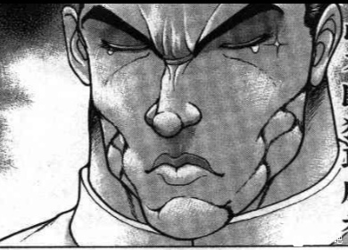
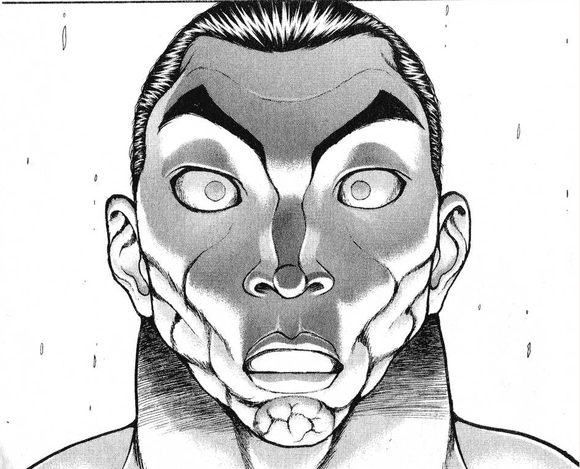
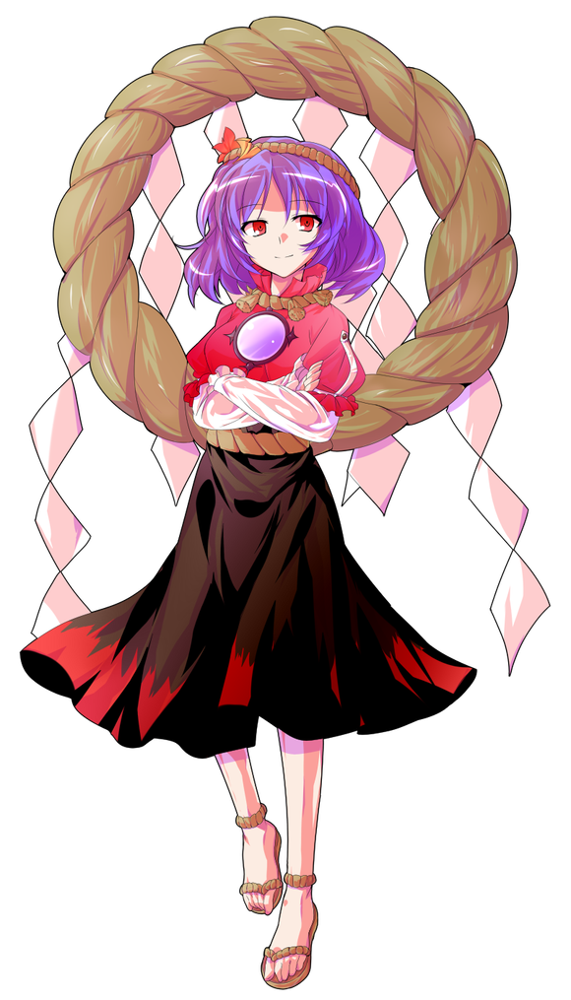

——吨吨吨吨吨吨吨——

烈的醉意【1d100：83】

咲夜的醉意【1d100：98大成功】

红美铃的醉意【1d100：47】

妖梦的醉意【1d100：27】

（60以上喝醉）

咲夜醉酒大成功！

大成功是什么？【1d10:6】

1 之后一段时间的工作减少了

2 对美铃说出了真心话

3 我不做人类了！（为啥啦）

4 之后一段时间的工作减少了

5 对美铃说出了真心话

6 咲夜学会了醉拳（为啥啦）

7 之后一段时间的工作减少了

8 对美铃说出了真心话

9 咲夜的厨艺提高了！（为啥啦）

10 大成功/大失败【1d2：2】

烈：我在轮椅上坐了半个月

去给小妖怪们上课的时候大家都在偷偷笑……

之前被魔理沙看到的时候，她居然笑的从天上掉下来了

有这么好笑吗？红海皇你说，我被师匠打到坐轮椅有这么好笑吗？！

红美铃：你这个，怎么说呢

是真挺丢人的

烈：我真的 T M 是个混账东西

我怎么就能起那种想法呢？

我怎么偏偏那个时候就给傻了呢？！

我该死啊，呜呜呜呜呜呜呜呜

红美铃： 一句安慰你的话都想不出来啊

红美铃拍了拍烈的背

咲夜：我对大小姐都是一心一意照顾的……

可是她自己却天天找事……天天找事……

那个破泳池都是好久之前用的了，结果今天突然又说要游泳！

还要新泳衣哎，她那个身材就算几百年前的不都照样用吗？

妖梦：我最近倒还好耶~

前两天蓝不知道为什么来白玉楼帮忙了，工作清闲好多~

咲夜：搞什么，你这个悠闲的叛徒

接我一拳~

咲夜醉醺醺地打出一拳

妖梦：你看这个咲夜就是逊啦，才喝几杯就醉成这样噗——

女仆长毫无章法的一拳，正正击中了庭师的脸

烈：好~功夫~

这水准，得练了有个~七~八年吧~

红海皇，你这醉拳教的真不错~

红美铃：我没教过她这招啊！？

哎呀所以我才不想跟她喝酒……每一次喝多了都整活……

烈：呜呜呜呜呜呜

我这事该怎么办啊……

我怎么就这么混账呢……

咲夜的口才【1d100：80】（75以上说服烈）

咲夜：闭嘴，男子汉大丈夫哭哭啼啼的算什么样子！

不就是亲了个嘴吗！

烈：但这不对啊——

咲夜：谁管这些，既然事都办了就老老实实负起责任来

去跟你的师匠大声讲，说我爱她也爱你就行了！

红美铃：咲夜小姐这样做烈会死掉的千万不要啊——

妖梦：咲夜，工作压力再大也不要杀人泄愤啊！

咲夜：你们这一个两个才是没搞清楚

闷在心里的话语，根本就没有任何意义

不去说是不会有人理解的！不去说是不会有人认同的！

你们说，我十六夜咲夜为什么天天从早忙到晚累的要死要活？

红美铃：那个……是为了拿工资？

咲夜：是因为爱！

如果不是因为我爱这个破房子，如果不是因为我爱你们，谁愿意天天帮你们做饭啊？谁愿意天天帮你们收拾烂摊子啊？！

咲夜一边灌红酒一边激昂地演讲着

咲夜：爱的力量是可以战胜一切困难的！

寿命，种族，世俗观念，这些加在一起也没有爱强大！

去把你的爱展示出来——

不要像我一样，把无数的话语闷在心里......

那根本毫无意义......毫无意义......

啪叽一声，咲夜喝的断片了，然后倒在了红美铃的身上

妖梦：美铃，脸红透了哦

你也喝多了？

红美铃：是啦是啦我也喝多了！

真是的这个笨蛋咲夜，所以我才不想跟她出来喝酒的……

老板娘不好意思桌子我明天赔你啦！

红美铃带着咲夜离去了

银发的少女在妖怪的怀中沉睡着

她的眼角有泪痕，脸上却带着安心的笑

烈：——我懂了！多谢你咲夜小姐！

哦哦哦哦哦哦哦！

烈海王挥着车轮拳跑回了永远亭

妖梦：那啥，老板娘，辛苦你了……

米斯提亚：我求求你们下次过来别喝酒了，行吗？

咱们就吃点家常便饭再聊聊天不好吗？

~永远亭~

烈海王带着一身酒气跑到了永琳面前

永琳的怒气【1d100：34】

永琳：你还敢喝酒？！

烈：师匠，我爱你！！！

永琳的措手不及【1d70：33+30=63】（突然直球+30）

永琳：你现在突然跟我说这个也——

烈：我也爱着幽香女士！

永琳的再次愤怒【34+1d100:26=60】（大于63开打）

永琳：你到底想说什么啊？！

烈：咲夜小姐说得对，我要负起责任来

这件事情从头到尾，全都是我一个人的过失

但既然已经发生了，我就一定会负责到底

我一定会坚持到最后的——哪怕我死了！我也绝不会放弃！

烈海王终于完成了他的爱之宣言

然后他也断片了

师匠要接住他吗？【1d2：2】

1 接

2 不接

烈海王倒在了永琳的脚下

永琳：公主大人，这怎么办啊？！

辉夜：你问我合适吗？

我哪知道啊？

总之你先把他扔回屋里如何？

最终，烈被永琳扔回了他的房间里

而两人之间那股剑拔弩张的气氛，似乎略微缓解了一些……

~第207天结束~

兄弟们我顶不住了，我去洗个澡回来继续

第三位 八意永琳

这是烈海王来到幻想乡的第【208】天的事情

（注：如果出在咲夜回之前我就真的圆不过来了，还请大家理解）

具体的事件是【1d10:5】

1 去太阳花田

2 行动前的医术教习

3 绀珠之药的实验环节

4 去太阳花田

5 行动前的紧急补习

6 绀珠之药的实验环节

7 去太阳花田

8 去太阳花田

9 绀珠之药的实验环节

10 大成功/大失败【1d2：2】

~永远亭~

师匠正推着烈海王在竹林中散步

原本已经好全了的伤势，由于昨日的酗酒又再次复发了

因此烈海王又坐回了轮椅

烈：永琳，我——

师匠：都说了这么天了，歇歇吧

先说正事，今天要给你紧急补习一下

你现在的战斗力还是不足，连纯狐都没见到就死在半路上可怎么办？

烈：师匠你之前不是说有准备药吗？

说起来绀珠之药现在有做改动吗？【1d10:10】

1 做成了一次性用品

2 由于有妖怪支援所以不用了

3 与原作相同

4 做成了一次性用品

5 由于有妖怪支援所以不用了

6 与原作相同

7 做成了一次性用品

8 由于有妖怪支援所以不用了

9 与原作相同

10 大成功/大失败【1d2：1】

大成功！

大成功是什么？【1d10:6】

1 可以使用【1d2】次的救命药

2 我给你联系了超强的支援哦（恶意）

3 仅在一次战斗中起效的有限前知+一直起效的Atk强化

4 可以使用【1d2】次的救命药

5 我给你联系了超强的支援哦（恶意）

6 仅在一次战斗中起效的有限前知+一直起效的消力强化

7 可以使用【1d2】次的救命药

8 我给你联系了超强的支援哦（恶意）

9 仅在一次战斗中起效的有限前知+一直起效的破解强化

10 大成功/大失败【1d2：2】

永琳：原本准备的是一旦使用之后就会终生起效的超强力药物

但那份药物的副作用过大了……在已经达成合作意向的现在，不能随便使用这样的东西呢

所以就帮你们改进成了使用后仅在一次战斗中，可以窥见未来的药物

烈的震惊【1d100：99大成功】

震惊大成功！

大成功是什么？【1d10:6】

1 烈海王的超水平话术发挥！（感情问题有望解决）

2 烈的全力吹捧（后续教导效果增强）

3 师匠好感度+1（有必要吗？）

4 烈海王的超水平话术发挥！（感情问题有望解决）

5 烈的全力吹捧（后续教导效果增强）

6 消力史诗级加强（为啥啊？）

7 烈海王的超水平话术发挥！（感情问题有望解决）

8 烈的全力吹捧（后续教导效果增强）

9 师匠她无所谓

10 大成功/大失败【1d2：1】

烈：这，这种事情也能做得到吗？

师匠，你真的是天才……

这早已超越了所谓贤者的等级了

你是幻想乡与月都都难以匹敌的，超乎想象的圣贤啊！

永琳：呼呼，我还没说完就已经惊讶成这个样子了？

我顺便帮你做了一份辅助药物

使用之后，你应当可以更加灵活地使用你的肉体，以达成你原先不可能做到的奇迹

烈：你是说消力？

永琳：对啦

这原本是你防身最大的依仗，结果现在却逐渐变成鸡肋了

如果连命都保不住，还怎么跟强者战斗？

消力才是你现在最需要增强的技巧

烈：师匠，我——

永琳：这样一来之后我也可以放心开打了~

不是很好吗~

永琳将一瓶冒着气泡的诡异黑色糊状物塞到了烈的嘴里

烈的恐惧【1d50：37+50=87】

烈：（呕——这感觉像是在嘴里开了化工厂——）

烈海王一句话都说不出来，开始在轮椅上发抖了

消力升级了！

完全消力：传自郭海皇的绝学，现在经由再度的设计再度增强

普通攻击以及近战系、弹幕系技能所造成的的最终伤害/2（仅对战斗力260以下的对手起效）

自身所收到的普通攻击伤害-1，近战系、弹幕系技能伤害-2（仅对战斗力261以上的对手起效）

永琳：来，用急救

烈海王使用了急救拳

Hp：0+1=1

皮克：嗷嗷嗷嗷哦啊哦啊啊哦！

（那坨东西变回烈海王了！）

烈：——我居然活过来了？！

永琳：月球医术，很神奇吧？

烈：师匠，这一招真的好实用啊……

增多一轮战斗回合，在生死战中说不定就是反败为胜的机会！

永琳：实际上真的被逼到用出急救时就基本上已经是败局了，所以还是不要太过依靠急救术

皮克，你先回去吧

我有些话要和烈说

（皮克回去了）

两人之间陷入了短暂的沉默

最终先开口的是【1d2：1】

1 烈

2 永琳

烈：永琳......为什么？

你不应该这样子的......我——

永琳：实际上嘛

我昨晚一直在考虑

要不要杀掉这个肆意妄为却又自以为是的家伙呢？

大概进行了【1d100：41】次左右的思考，实际操作尝试了【1d100:17】次

永琳：但是，没有一次能够成功

我的理性思维告诉我，只要把烈海王解决掉，所有的麻烦都会消失的，就和为了公主大人那一次一样，一了百了——

不过，似乎无论如何都做不到

就算是在看不到的地方用弓箭射击，举起的箭矢却也难以射出

烈的恐惧【1d100：94】（30-70之间产生矛盾）

烈：——我完全不知道啊

现在真的是感觉连牙齿都在颤抖

但是永琳，为什么？

永琳：因为我发现，八意永琳并不想杀掉你啊

我至今为止都是是在为了月之都，为了公主大人尽心尽力

但是我内心的声音，却一直被我所忽视了

烈：内心的声音......

永琳：你昨晚的话语，也是发自内心的吧？

我也一样

我并不想杀掉我的弟子与恋人

因此，我要让他至少不会死在莫名其妙的地方

永琳：听好了，烈永周

我不允许你轻易地死掉

你是我八意永琳的学生

无论是太阳花田的妖怪，还是纯粹至极的怪物，都给我从正面堂堂正正的打败她们

然后在一切结束之后，我要你跟我打一场

烈：——我会的

永琳：话语，决心，统统都是无用的表象

想要收拾你的烂摊子，那就将你的实力证明给我看

如果那时候你真的输掉了——那我就会毫不犹豫的，立刻将你抹杀掉

烈：啊啊，我明白

我会做到的，师匠

不——我一定会证明给你看，永琳！

月之贤者推着被她打成重伤的弟子在竹林中悠然前行

感情问题是件非常复杂的事情

不过，幸亏这里是幻想乡

无意义的话语不必再提，让我们光明正大的，用战斗决定结局吧！

（本日的更新结束，下一次的更新应该在周五晚上）

（以下是我的废话）

在差不多一个月之前我认为让我写约会已经是最高等级的折磨了

事实证明我错了

但是写幽香回好爽啊！

察觉！恋慕！kiss！好耶！

哦哦哦哦哦哦！

哈哈哈哈哈哈哈！

呜呜呜呜呜呜呜呜

最后还是回到战斗了

谁叫你们两个怎么都不去花田，那我怎么办嘛

打架，就打架就完事了，反正一个刃牙一个幻想乡全都是这个脑回路，有什么问题打一架再说！

于是今天的更新终于结束了

下一次还得更个日常，因为烈的支援还没搞定

本来是打算三个交流回搞定支援的，为什么会变成这样（泣）

骰子下一层发

附上本日的骰子

PS：以下是我的个人恳求

我恳请大家，不要在与本贴无关的地方讨论与本贴内容相关的东西

因为我在刃牙动画的弹幕中看到的了类似的消息——

这让我非常不安，如果打扰了其他人正常的观看体验，那就是我的责任啊

因此再次恳请各位，请不要在与本贴无关的地方讨论与本贴内容相关的东西

LZ在这里谢谢大家的配合了

对了，昨晚的对话写的有点急了，没解释清楚

其实是跟铃仙一起解决异变——实力足够后去跟幽香战斗——最后师徒之战这样的主线

不会让烈打三连战的大家放心吧

补一下被吞的楼

——由于昨晚太乱大家可能没看到因此再发一次——

以下是我的个人恳求

我恳请大家，不要在与本贴无关的地方讨论与本贴内容相关的东西

因为我在刃牙动画的弹幕中看到的了类似的消息——

这让我非常不安，如果打扰了其他人正常的观看体验，那就是我的责任啊

因此再次恳请各位，请不要在与本贴无关的地方讨论与本贴内容相关的东西

LZ在这里谢谢大家的配合了

（附上望远镜的动态）

由于吧友们的热情太高涨了，许多人在翻译群中进行剧情讨论

因此新建了一个水群供大家聊天，如果想要单纯讨论的话可以到这里来

由吧友 @望远镜300  制作的视频第16集更新啦

本期是交流回的剧情，大家有兴趣就去看看吧！

顺便说一下，我知道骰子很好玩

但还请别在这里发群聊骰子/自己骰的骰子这样的回复

一个是普通翻楼的吧友可能会感到误解，另外一方面这也不是水楼

还请大家配合一下，多谢了

——本部老师的车万小课堂——

这个番外篇上一次更新......是什么时候的事情来着？

其实上这篇本来是打算在探女回结束后更的，不过不知道为什么忘记了

大概是过于沉迷武道了吧（不是）

回归正题，今日结束的人物为探女回主角队的大佬之一，八坂神奈子

八坂神奈子

BGM：神圣庄严的古战场　～ SuwaFoughten Field

初登场于东方风神录，是六面Boss

能力：创造乾程度的能力

种族：神明 所属势力：守矢神社

八坂神奈子是从外部世界，连同神社与湖一起搬来的神明

虽然大多数神明都自由的来往于幻想乡与外部世界间，但是她将据点移到了幻想乡，似乎想要将信徒锁定在幻想乡的人类和妖怪身上，藉由此来募集坚定的信仰

她是掌管风雨的神，因为掌管着刮风下雨这种事情，所以她也被当作农业之神祭祀着

由其姓氏八坂(无数的山坡)来看，她也被叫作山神，这份力量则是在诹访大战结束后，为了维护统治而借来的，洩矢诹访子的力量

她的性格非常专横并且以自我为中心，但看起来也十分可靠，同时容貌非常庄严

神奈子拥有着创造乾程度的能力

从字面意思上来理解，便是创造【天】程度的能力，她与拥有着创造坤程度的能力的洩矢诹访子一同开凿地形，创造洞穴，同时也将这份能力用来建造建筑物，但却并未将其用于赐福

在战斗之时，神奈子会在身后竖起四根高大的御柱，同时其也拥有着利用御柱攻击的符卡

人际关系

与洩矢诹访子是过去的敌人，现在的同事与挚友

这两人之间的关系相当复杂，一言半语难以解说，不过她们现在则是感情十分要好同时利益关系一致的朋友了，时间的力量真奇妙

东风谷早苗是祭祀诹访子的风祝，但同时也是神奈子的巫女，并且与她们一样也是守矢神社的神明

值得一提的是，早苗还是诹访子的子孙后代

为什么守矢神社会供奉着两位神明？这一点早苗也不知道，大家感兴趣的话可以自己去查一查

冷知识

守矢神社的建筑工业幻想乡第一：神奈子曾出手帮助白莲建造命莲寺，并在一夜之间就完成了工作

新能源革命：神奈子想要推动新能源革命并实现可控核融合，为此她将八咫乌塞入了地狱鸦阿空身中，用以实现计划

换句话说，她造了一个六面

之后就是东方地灵殿的故事了

gift：神奈子喜欢礼物，如果不小心激怒她了，还请赶快送礼

这是由你开启的故事啊：守矢神社迁入幻想乡是宗教篇这一长串故事的起点，可以说本篇的所有故事都与其有着直接或间接的关系

不过到了宗教篇结束的心绮楼，守矢神社的三人却完全没有出场，因为这时她们在忙于与天狗沟通以建造上山的缆车

~新作与旧作~

可能有些吧友对于幽香的部分对话会感到一头雾水

似乎出现了从来没听说过的人物与剧情？

实际上，这是由于这个贴子里玩了一些旧作的梗

大家日常所谈论的东方project，实际上大部分都是从Th06东方红魔乡开始的，所谓新作的内容

而在1996年至1998年这段时期，zun曾经在PC-98平台上发表过Th01-Th05这五部作品

它们被现在的玩家称作东方旧作，也称黑历史

当时ZUN的社团名称为「ZUNSoft」，上海爱丽丝幻乐团还并不存在

被称为黑历史的原因，其实很简单

因为那时的zun制作游戏的心态，与之后可以说是完全不同的

大家玩红魔乡的时候可能会觉得：“哇咧这帮人说话怎么这么电波的”，然而旧作中这种电波对话可以说是更过分......

如果你打的太菜进了bad end，自机甚至会跟你说“你状态比较好的时候再选我”这种打破第四面墙的发言

理所当然的，旧作的世界观与人物设定与大家熟悉的新作之间存在大量矛盾，此处当然是以新作为主了

不过呢，旧作与新作也并不是毫无联系的

比如说，大家熟悉的灵梦、魔理沙、爱丽丝与幽香都曾在旧作中出现过

她们那时的表现当然与现在截然不同，这也是所谓黑历史的一部分吧（笑）

本贴中的旧作梗其实是那种，玩过的人会会心一笑，没玩过的人也无所谓的小捏他

像幽香虽然加了一些旧作元素，但主体还是以新作为主

所以大家完全不用在意

顺便一提之后可能偶尔也会有旧作角色出来跑个龙套，不过当然是不会影响剧情的，也不会进日常和安价，所以大家大可放心

把她们当做现在在幻想乡中隐居的老住户们可能会比较好吧？

那么本日的番外篇到此结束

下一次这个番外什么时候更新？谁知道呢（笑）

大概七点半左右更新。。。吧？

