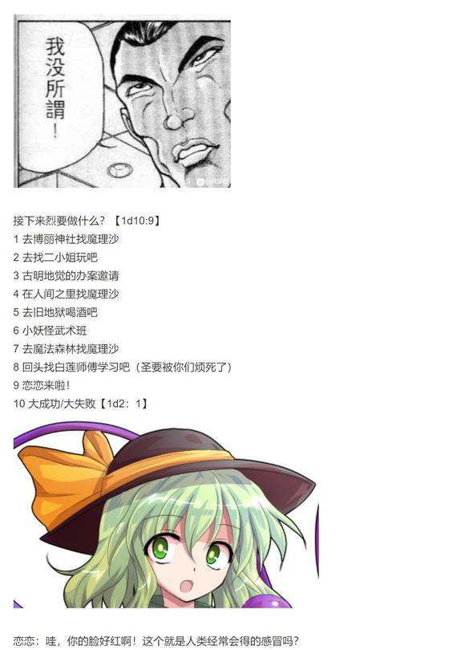
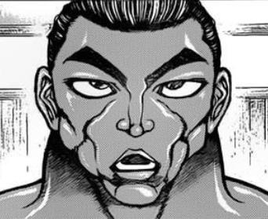
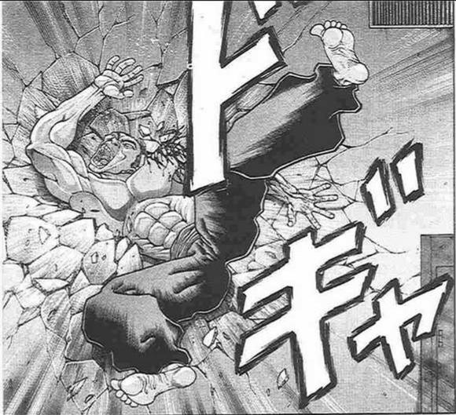

附上本日的骰子

~彩蛋~

~地灵殿~

恋恋：我打包了晚饭和轮椅~

觉：？？？

恋恋：今天烈海王和魔理沙在谈（论）恋爱（的话题）

觉：？？？？？？

恋恋也到了懂得情爱的年纪了？？？？？？？

恋恋的说明【1d100：71】（50以上理解）

觉：吓我一跳......

话说这个轮椅好像还挺方便的

恋恋：之后推着你出门吧~

补一下被吞的楼层

吧友 @望远镜300  制作的视频第17集更新啦

本期的内容是交流回（下），有兴趣的话就去看看吧！

~画师招集~

近日有热心的同人社团想要将本贴内容制作为同人志

但由于本贴的大量素材不能直接使用而需要画师重绘，他们遇到了一些问题

因此在此紧急召集画师，具体内容下一层发，如果有感兴趣的朋友欢迎与他们联系

～针对公告的补充说明～

社团负责人的话：

大家好，我是这次负责同人本的Rizer

这次时间的确是异常的紧张，但我们需要的也不是像漫画一样的作图，需要的仅仅是烈海王的一些表情和图，以及东方众人的表情。

毕竟图片的重复率还是挺高的。

时间上有空余的话还会考虑画一些插图。

感觉大家好像有点误会了。。。在此说明一下，昨天我发的那个公告就和我平常转点吧友们的同人图一样，只是帮忙转发一下

至于具体的制作过程这些，当然是与我没有关系的，我也不需要出钱（笑）换句话说，我只负责发个公告和喊加油而已，还请大家放心

顺便一提更新是在今天晚上，具体几点。。到时候再说吧

今晚时间有点紧张，所以更新量会缩减一些

那么7点半开始更新

~第217天~

~永远亭~

清晨，永远亭众人围坐在师匠的诊疗室中

师匠：具体要做的事情你们应该已经明白了

烈与优昙华本次需要共同行动，而灵梦、魔理沙和早苗她们则自己决定路线

皮克的前写字板上出现了闪着光芒的字迹

探女（手写）：计划的第一步是，来到月之都并通过我的考验

烈：稀神女士，我们该如何前往月之都啊？是要坐火箭飞上去吗？

探女的路线规划【1d10:9】

1 第四槐安通道

2 紫的隙间

3 三段式火箭！（那玩意很慢的吧）

4 第四槐安通道

5 紫的隙间

6 月之羽衣（普通人能用吗？）

7 第四槐安通道

8 紫的隙间

9 【1d8：7】

10 大成功/大失败【1d2：2】

探女（手写）：在妖怪之山的湖中，有着我们曾为迁都行动而设立的前线基地

月兔们会在此为你们打开前往梦境世界的通道——

经由阿波罗经络而前往月之都吧！

烈的理解【1d90：26+10=36】（基础情商+10）

烈：？？？

我们是要一觉睡过去吗？

铃仙：烈先生，不是你想象中的那种梦境世界……不其实也是那个......

唉，到时候你就知道了

辉夜：断 头 饭吃了吗？

祈祷做了吗？

遗书都准备好了吗？

那就出发吧！

第一次地月合作行动，现在堂堂开始了！

皮克：嗷嗷嗷嗷嗷哦啊啊

（咦，这么危险？）

因幡帝：本来就是超过分的紧急行动……

不过这一次事先做了那么多准备，基本上不可能会出事的

烈：铃仙前辈，这次还请你多多指教了！

铃仙：加把劲完成工作吧~

~太阳花田~

圣僧与大妖怪在花田中相对而坐，两人中间的桌子上摆着一个神似阴阳玉的装置

幽香：是命莲寺的圣白莲对吗？

烈海王经常说起你的故事呢

白莲：您称我为白莲即可

我之前也只是偶尔在宴会上见过幽香小姐

像这样面对面坐着聊天，还真是第一次

幽香：哎呀，那么叫我幽香就可以了

没必要这么拘谨

要来杯酒吗？还是要茶？

白莲：佛教中有着不饮酒戒的戒律……给我杯清茶就好

幽香启动了支援装置

幽香：喂喂~听得到吗~

烈：！

是幽香女士啊，吓我一跳

白莲：我也在哦~

之后的战斗中我们会负责支援，还请放心前进

幽香：如果这样都输的话，就请你吃魔炮吧

烈：不会输的！不敢输的！

烈与铃仙前往前线基地了

路上有事发生吗？【1d100：75】（75以上有）

恰好压线，发生的事件是？【1d10:8】

1 铃瑚的伏击

2 天狗的采访请求

3 魔理沙的同行

4 铃瑚的伏击

5 天狗的采访请求

6 早苗的同行

7 铃瑚的伏击

8 天狗的采访请求

9 铃瑚与清兰的双重伏击（你俩不怕挨骂吗？）

10 大成功/大失败【1d2：1】

“两位还请留步”

烈与铃仙刚刚飞到妖怪之山附近，黑发的天狗就出现在了他们面前

铃仙：是射命丸啊

我们不是入侵者哦

这个行动计划你也知道的吧？

文文：我就是为了这个而来的

等到行动结束后就来接受我的采访吧！

神秘月都的第一手资料！内部人员的真实访谈！

出一期月都特刊的话，销售量绝对会暴涨的

烈：我是无所谓

铃仙前辈你呢？

铃仙的害羞【1d100：84】（75以下接受采访）

铃仙：采访还是算了吧……

文文：真遗憾，不过好歹确保了一位受访者

文文扔给了烈一个玩具相机

文文：这是天狗的玩具相机

不能消除弹幕也不能释放符卡，只有最基本的拍照功能而已

路上如果看到了什么有意思的景象就用它拍一张吧，多谢配合啦

烈：一般来说相机也不会有那些功能的！

——文文飞走了——

~妖怪之山的湖中~

这里是月兔们秘密建立的前线作战基地之一

不过在计划已经更改的当下，大部分月兔已经撤走，只剩下那么一两只在此等候援军

出来迎接烈与铃仙的是【1d10：8】

1 铃湖

2 哆来咪

3 清兰

4 铃湖

5 哆来咪

6 探女（为啥啦）

7 铃湖

8 哆来咪

9 随机人物

10 大成功/大失败【1d2:1】

“有人跟我说需要让你们通过这里

不用再去做无谓的战斗，倒也是一件好事”

出现在烈与铃仙面前的，是头戴红色睡帽的深蓝发女子

她身穿黑白相间的连衣裙，其上衬有反色的绒毛球，左手持一本印有D字样的蓝色封皮大书、右手拿着粉红色的梦魂，脚上仅穿着一副白色短袜

女子身后有一根奇妙的长尾巴，看上去很像牛尾

铃仙：竟然是貘？

没想到你会出现在现实世界之中

哆来咪：我是哆来咪·苏伊特，梦境世界的支配者

这次事件和我也有一定关系，所以前往月都的引路工作也有我的一份

烈：通过梦境世界前往月都……请问您是要使用催眠术吗？

哆来咪的好感度【1d100：30】

哆来咪：这不是好战成狂的武术家吗

没想到现实世界中反而像是个遵守礼节的人物

感到好奇的话，不妨问问您身旁的月兔如何？

铃仙：地面与月之都的联络通道就是精神世界，也即梦境世界

我们需要做的是以肉身直接穿过通道进入其中

这个区域的话，应该是第四槐安通道吧？

烈的理解【1d90：78+10=88】（75以上理解）

烈：哦哦，我明白了

梦境世界就像月之都、冥界或者地狱一样，同样是所谓“异界”的一种

只要利用相应的手段也就可以进入了

哆来咪：正是如此

那么，欢迎来到我的世界

~阿波罗经络~

穿过月兔们的前线基地，烈与铃仙来到了梦境世界

这里看上去像是儿童梦想中的宇宙空间

漆黑而宁静的世界中漂浮着层层叠叠的方格网络，以及飞翔的鹤型纹样

而在这世界的深处，一轮巨大的满月散发着巨大的存在感

铃仙：好久没来都快忘记这里的样子了......

辉夜：因幡来到地上是多少年前的事来着？

师匠：大概是数十年前？幻想乡与外界隔绝之后，将要百年左右的时间点

这么一想确实蛮久了……

烈的震惊【1d100：40】

烈：这可真是奇妙的景象……给射命丸小姐拍几张照片吧

幽香：和我想象中的倒是不大一样

白莲：我还以为会是像透过万华镜而看到的，五光十色的异界一般

哆来咪：那倒也没有说错

所谓的梦境世界，是这世上所有生物梦境的总合

而你们现在所看到的，也只是其中一个侧面而已

【1d30：7】分钟后，短暂的梦游结束了

哆来咪：我的工作就到此结束

沾染污秽的月兔与极端执着的武术家

我仅能给您们一个忠告——

如今的月之都已经完全充满了狂气

以梦境来比喻的话，那毫无疑问就是最高等级的Lunatic

请您二位万分小心

哆来咪：那么最后，祝各位好梦

梦境的支配者送别了前来支援的二人

而下一个瞬间，他们所面对的是不带一丝生气的冰冻之都

~月之都~

BGM: 冻结的永远之都

这里是远离污秽大地的，天津神们所居住的城市

月之都没有那时而让生物痛苦的季节，一年中总是兼有春季的温暖、夏日的活力、秋天的丰收以及冬日的寂静。

城市中散落着在蓝色的星球下光辉美丽的桃树，还有兔子们的笑声。

——原本，应当是这样的

然而，现在的月之都，是一片毫无生机的城市

它就像字面意思一样，被完全的“冰冻”了，甚至连原本的居民们也抛弃了他们的城市，不知去往何方

只剩下密密麻麻的阴阳玉向着来援的二人疯狂地发射着弹幕与激光

铃仙：虽然已经料想到了大致情况……但这刺骨的寒气与无人的街道真是……

烈：铃仙前辈，感叹之前先躲避激光好吗？！

铃仙：这是月之都的自动防卫装置与探女大人的阴阳玉！

烈先生小心一些，不要miss了！也别拍照了！

两人的miss判定（共两次）

【1d100：59】【1d100：45】（15以下miss）（烈的支援/铃仙的支援/假腿/防护罩共可以抵消四次miss）

【1d20：7】分钟后

穿过了阴阳玉的封锁，两人终于见到了城市中央那银发片翼的女神

铃仙：顺利通过，这点程度不算什么~

探女大人，我们来参与考验了

烈：稀神女士您好，您是要与我们战斗吗？

探女（手写）：你们是到达月之都的第【1d4：4】组

巫女，魔法使与现人神都已经离去

最后的考验结束后，我的任务也就终于完成了

烈：？！我们是最后一组吗？

铃仙：是因为烈先生你刚刚一直在拍照吧……

参加考验的人是【1d2：1】

1 烈

2 铃仙

探女（手写）：有着八意大人与辉夜大人支援的月兔，自然无需我的考验

不过，仅有两个妖怪支援的你实在是令人难以放心

哎呀，毕竟之前那么多妖怪一起来都被八意大人一网打尽了wwwww

白莲：这个w看上去有种让人不舒服的感觉......

幽香：对面都这么说了那我们也要相应的认真一些

听 到 了 吗，烈 海 王？

烈：哦哦哦哦哦明白！

稀神女士，请！

探女：让我试炼一下吧

自地上而生你的力量！

铃仙：（探女大人开口了！）

师匠说让我别插手试炼……烈先生你加油吧！

战斗！

T1

烈的攻击【265+1d100：37=302】

探女的攻击【261+1d100：11=272】

探女的受伤【1d10：3】

1 回避

2 小伤害

3 小伤害

4 中伤害

5 中伤害

6 大伤害

7 大伤害

8 特大伤害

9 特大伤害

10 大成功/大失败【1d2：1】

护身阴阳玉：4-1=3

烈：稀神女士，承让了！

幽香：月之民的强大力量真是令人印象深刻（笑）

探女（手写）：可以理解您的感受

毕竟拼尽全力也才打破了一个阴阳玉而已呢www

白莲：两位稍微控制一下情绪可以吗？

烈先生现在已经满头大汗了……

T2

烈的攻击【265+1d100：17=282】

探女的攻击【261+1d100：85=346】

烈的受伤【1d10：3】

1 回避

2 小伤害-1（无伤）

3 小伤害-1（无伤）

4 中伤害-1

5 中伤害-1

6 大伤害-1

7 大伤害-1

8 特大伤害-1

9 特大伤害-1

10 大成功/大失败【1d2：1】

烈：完全消力，成功！

铃仙：我怎么都理解不了这种技术的原理……

探女（手写）：这是八意大人开发的全新科技吗？

烈：这是中华武术的秘传技！

不过师匠也帮忙改进了一下……

T3

探女（手写）：开始正式攻击了

玉符【乌合的逆咒】

烈的破解【1d100：54】失败

烈的受伤【2d3：5-2=3】

Hp：19-3=16

幽香：烈海王，花弹

烈：好的，Flower star！

探女的受伤【2+1d6：5=7】

护身阴阳玉：3-1=2

烈的攻击【265+1d100：39=304】

探女的攻击【261+1d100：15=276】

探女的受伤【1d10：4】

1 回避

2 小伤害-1（无伤）

3 小伤害-1（无伤）

4 中伤害-1

5 中伤害-1

6 大伤害-1

7 大伤害-1

8 特大伤害-1

9 特大伤害-1

10 大成功/大失败【1d2：2】

护身阴阳玉：2-1=1

T4

探女（手写）：继续，玉符【乌合的二重咒】

烈的破解【1d100：62】成功

烈：整体思路与上一招一模一样

重复的技能是没有效果的！

探女（手写）：一如既往，头脑很灵光呢

烈的攻击【265+1d100：61=326】

探女的攻击【261+1d100:40=301】

探女的受伤【1d10：5】

1 回避

2 小伤害-2（无伤）

3 小伤害-2（无伤）

4 中伤害-2（无伤）

5 中伤害-2（无伤）

6 大伤害-2

7 大伤害-2

8 特大伤害-2

9 特大伤害-2

10 大成功/大失败【1d2：2】

白莲：攻击被阴阳玉之墙挡住了……

我真的不擅长应付这种类型的敌人

幽香：你觉得直接正面对攻比较好？

真巧，我也是

T5

探女（手写）：顺便测试一下科技部上个月的研究成果

玉符【秽身探知型水雷　改】

稀神探女释放了大量阴阳玉形状的水雷

它们自动追踪着烈海王的行动，一旦被击破就会留下暗雷以限制对手行动

武之怀发动

烈的破解【1d100：48】成功

烈：稀神女士，这东西的包围速度太慢了

只要不攻击阴阳玉而直接攻击本体，威胁程度就会大大降低啊

探女（手写）：测试结果 不合格

打回去重做吧

烈的攻击【265+1d100：87+60=412】

探女的攻击【261+1d100：92=353】

烈的破解【1d100：51】成功

探女的受伤【1d10：2】

1 回避

2 小伤害

3 小伤害

4 中伤害

5 中伤害

6 大伤害

7 大伤害

8 特大伤害

9 特大伤害

10 大成功/大失败【1d2：2】

护身阴阳玉：1-1=0

烈：稀神女士，你的阴阳玉已经全部被我击破了！

探女（手写）：嗯，表现不错

那么就稍微……认真一些吧

T6

探女：玉符【乌合的逆咒】

玉符【众神的光辉弹冠】

金黄色的阴阳玉环绕着银发的女神冲天而起

它们的速度逐渐加快，最终化为了螺旋状的旋风

仿佛巨大的钻头带着无数的弹幕向烈海王袭来！

烈的破解 逆咒【1d100：33】失败

光辉弹冠【1d100：7】失败

烈的受伤【2d3：5-2=3】

Hp：16-3=13

烈要使用的必杀技是【1d2：1】

1魔炮

2超人术

烈：压迫力瞬间暴涨！

幽香女士，拜托您了！

幽香：哎呀呀

向月之民开炮的机会……这可真是久违了~

白莲：（脸上的表情好恐怖！好恐怖啊！）

风见幽香从座位上起身

所谓的魔炮其实是一种非常简单的技巧

只要在手中聚集大量的，巨量的，海量的魔力——

然后将其压缩后一口气轰出去就可以了！

花之暴君将手放到了支援装置上

三十八万公里之外，魔力凝聚而成的光柱与阴阳玉的金色旋风正面相撞！

烈的攻击【265+700+60+1d100：57=1082】

探女的攻击【261+650+1d100：9=920】

最终，幽香的魔炮带着一往无前的气势，将所有的阴阳玉粉碎的一干二净！

探女的受伤【1d10：9】

1 回避

2 小伤害X5

3 小伤害X5

4 中伤害X5

5 中伤害X5

6 大伤害X5

7 大伤害X5

8 特大伤害X5

9 特大伤害X5

10 大成功/大失败【1d2：2】

Hp：16-4X5=0

烈：我的天啊……一炮全部搞定……

幽香：那还用说？

白莲：果然？

战斗结束

胜者 烈海王！

铃仙：几位都辛苦了！

师匠：探女，放水过头了吧？

全程都在用阴阳玉打架

你完全可以再稍微加把劲嘛

辉夜：虽然我说这话不太好

你有必要这么为难自己的弟子吗？

师匠：无论是对弟子还是恋人都十分有必要呢

探女（手写）：原本是打算最后我自己出手的……结果还没到最后就输了QAQ

烈：真是多谢您手下留情

探女将手从嘴上移开

探女：我是佐具卖探女。仅凭言语便能改变世界的走向的存在

在从我口中说出的同时，命运就将改变

月之都的迁都计划你们已经了解

因为我说出了这个计划

所以迁都到幻想乡已经不可能实现了吧

而纯狐的侵略计划也是一样

如今，命运终于开始逆转

向敌人的根据地，静海进发吧！

探女（手写）：这是我以天津神之身下达的敕命——

原本想这么说的，但是八意大人在旁边听着实在不好意思这么开口了OMO

直面终极的狂气吧

算上之前的那三人，你们就是拯救月都的希望了！OVO

烈的情商【1d90：75+10=85】（40以下吃孤翼的白鹭）

烈：这个一直都有的字符画就是颜文字吗？

这样就能方便的表现心情了，不愧是稀神女士

探女的好感度上升了【1d4:1】

好感度：83+1=84

探女（手写）：在文字后面稍微添加几个符号，语言的灵活性就上升了一个档次

人类难得发明出了好用的东西(ﾟ▽ﾟ)ノ

铃仙：（这个颜文字的风格简直令人回到了十年前的幻想乡！已经不止是过气的等级了！）

那么探女大人我们先走一步……

烈与铃仙离开了冰封的月之都，前往静海

~舒缓气氛的中途聊天~

烈：铃仙前辈，稀神女士所说的静海，指的是月之都内的海洋吗？

“终极的狂气”是从海洋中出现的？

铃仙：听上去像是浑身触手的章鱼头邪神……

虽然意外的合理但是有些微妙的不同

之前永琳师匠跟你讲过月球的结界吧？

师匠：是在第一次约会的时候~

烈：对的，我记得结界的外侧是荒凉的大地，也即我之前所认知的月球表面

而结界的内侧是一颗美丽的星球

我们现在所在的地方，则是星球的里侧，也即月之都的所在地

幽香：在约会的时候还不忘普及基础知识，真是尽职尽责的【老师】啊

师匠：毕竟这是我的本职工作呢

无忧无虑的【闲人】们不需要考虑太多，真是令人羡慕

白莲的察觉【1d70：48+30=78】（75以上察觉）

白莲：（风见幽香与八意永琳间的修罗场……这可真是）

（烈先生想必是快要裂开了，下次有机会的话带他去兜个风吧）

铃仙：（气氛突然变得好糟糕！）

对对就是这样，我们目前要前往的地方就是结界的外侧，即被【污秽】所封锁的月面！

也就是你以前在科普书上看到过的静海啦！

烈：（帮大忙了多谢你铃仙前辈！）

哦哦，这一次终于有机会去当传统意义上的太空人了

环形山与月之平原，这是我儿时梦想中的场景啊

我还以为我们要去的是位于结界内侧的，作为海洋的静海

铃仙：永琳师匠的两位弟子就负责驻守静海，只是现在她们应当已经去梦境世界避难了

辉夜：那片毫无生机的海洋除了离地球近以外还有什么意思？

不过你们之后还是要去一趟……因为那家伙现在应该就在那里

【1d30：22】分钟后，烈与铃仙来到了月面的静海

在那里，他们见识到了真正意义上的，充满疯狂与绝望的可爱【地狱】

