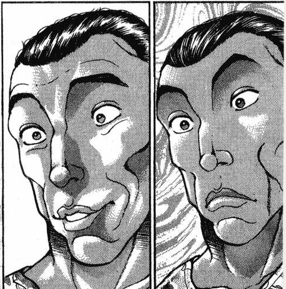
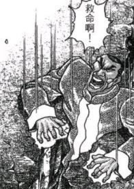
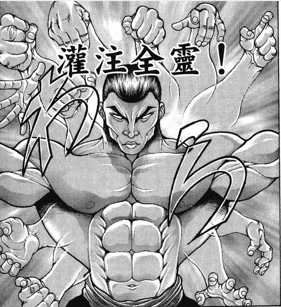

~静海（表）~

荒凉的大地上密布月球坑，黑色的星空中悬挂着蓝色的地球

一望无垠的灰色平原中，甚至还躺着人类送到月球的探测器的残骸

与那如梦似幻的清静都市不同，表侧的静海与一般人心中对月球的想象一模一样

唯一的一点不同在于，这本该寂静无声的场所如今却充满了欢笑

是的，那是污秽之极的，难以想象的，堪称疯狂的——

妖精的笑声

（友情出演：东方三月精）

BGM：遥遥38万公里的航程

妖精

妖精妖精

妖精妖精妖精

扔弹幕的妖精

扔火球的妖精

互相嬉戏打闹的妖精

什么也没有做只是在原地欢笑的妖精

妖精妖精妖精妖精妖精妖精妖精妖精妖精妖精妖精妖精妖精妖精妖精妖精妖精妖精妖精妖精妖精妖精妖精妖精妖精妖精妖精妖精妖精妖精妖精妖精妖精妖精妖精妖精妖精妖精妖精妖精妖精妖精妖精妖精妖精妖精妖精妖精妖精妖精妖精妖精妖精妖精妖精妖精——

月球变为了妖精们的乐园！

这些无谓生死的家伙们身上撒发着巨大的生命力，正欢笑着相互扔着弹幕与火焰

不远的地方可以看到一连串的火光与爆炸，那应当是妖精们正在拦截先行到达的灵梦三人

除烈与铃仙外有人在此处与妖精们战斗吗？【1d10:3】

1 灵梦

2 魔理沙

3 早苗

4 大家都已经飞到很远的地方了

5 灵梦

6 魔理沙

7 早苗

8 铃仙二号（咦你在的吗）

9 全员都被妖精拦截了（好菜啊）

10 大成功/大失败【1d2：1】

烈：一眼望去全都是……妖精?

这就是……极致的污秽？绝对的狂气？

铃仙：这就是侵略者？

我听师匠说过那位纯狐强的离谱

但月之民对于区区妖精程度的污秽应该也不会害怕的……

幽香的愉悦【1d70：42+30=72】

幽香：哈哈哈哈哈！

哎呀哎呀，真是失态了

月之民们被一群妖精堵在了门口，这可真有意思

永琳：公主大人？这里由您先撑一阵可以吗？

虽然如今早已为污秽之身，但看到这些还是会有心理上的不适

辉夜：去吧去吧

我现在完全可以理解探女她们为什么会被逼成这样了……

白莲的察觉【1d70：14+30=44】（75以上察觉）

白莲：额，请问是为什么？

我怎么看都感觉只是一群普通的妖精

实力倒是都算强，但是这不足以对月之民构成威胁吧？

烈的察觉【1d70：29+30=59】（75以上察觉）

烈：——是因为月之民不忍杀生？面对可爱的妖精们下不去手吗？

“你们两个怎么还有心思在这里聊天啊？！妖精们已经来了快跑啊！”

绿发的巫女从爆炸中飞来，将烈与铃仙拎在手上转身就跑

烈：？？？

早苗小姐你好

妖精的攻击……

铃仙：妖精的攻击有什么可怕的吗？

路人妖精（友情出演：莉莉白）：呀呼！新的敌人来啦！快去报告皮丝老大！

你们好哇，我是来自地狱的妖精~

路人妖精2（友情出演：大妖精）：我们该怎么办！杀了？烧了？炸掉？

初次见面，我是来自月面的妖精~

路人妖精：全都试一遍！

不知名的三位将死的访客哟，欢迎来到化为地狱的月球！

路人妖精振臂一呼，无数的妖精们呼啦啦地集合到了一起

下一个瞬间，总数为【10X100d100：56730】的蛋状弹幕与星形弹幕，伴随着妖精们的狂笑声飞驰而来！

烈：救命啊！！！（中文）

这是什么啊！！！！

铃仙：救命啊！！！（日文）

这是什么啊！！！

早苗：是超级无敌宇宙幻影加特林妖精！有空扯闲话就赶紧躲吧！

本日的更新结束，下一次的更新应该在周三

（以下是我的废话）

前三面全都被跳过的副作用就是完全变成了烈海王梦游仙境，而且还没啥有意思的情节

好水啊！但是还不能跳过！

哆来咪小姐大概要等到EX面才能来打上一场了

虽说是放水的试炼，真就一炮被搞定了也太过分了吧？

探女你行不行啊？！

顺便一提这一次出演路人妖精的几位分别是大家熟悉的大妖精，三月精三人组以及莉莉白

本来想用莉莉白/莉莉黑的，但是一看大妖精的图都截好了那就直接用吧

你是琪露诺？等之后会有她的戏份的

之后烈终于可以体会一下什么叫绀珠传五面了（笑）

写起来好爽啊真的好爽啊

那么本次的更新到此结束，下一次更新应该在周三

骰子等到异变结束后一块发

~第二次画师召集~

前天所提到的同人志计划，目前已经召集到主要画师了

考虑到时间与成本问题，社团本次的进度大概是做到本贴的第二天剧情结束的时间点

目前还需要几张黑白色的插画作为补充，因此社团委托我再次发一个公告

总计6张插画，并不需要一人全部完成——有兴趣的话完成其中一张或多张都可以

具体内容如下

大概七点更新

——前情回顾——

总数为【10X100d100：56730】的蛋状弹幕与星形弹幕，伴随着妖精们的狂笑声飞驰而来！

烈：救命啊！！！（中文）

这是什么啊！！！！

铃仙：救命啊！！！（日文）

这是什么啊！！！

早苗：是超级无敌宇宙幻影加特林妖精！有空扯闲话就赶紧躲吧！

三人的miss判定（共三次）

【1d100：3】【1d100：66】【1d100：68】（40以下miss）（三人的支援/假腿/防护罩共可以抵消五次miss）

烈：扭不过去了！

铃仙：两位站到我身后

【障壁波动（EvilUndulation）】！

铃仙发动了总计三层的防护罩

当三层防护完全破碎时，妖精们的第一波攻击结束了

早苗：帮大忙了，铃仙！

路人妖精：咦咦？

他们撑过去了

路人妖精2：太好了！第二波攻击开始~

这么喜欢扭弹幕，就用激光射击吧！

幽香：真可爱啊~

之后邀请她们来花田喝茶吧~

烈：幽香女士你醒醒啊，不要被外表所蒙蔽了！

妖精们发出了高能激光封锁了三人的行动

其后，总数为【100X1d100：9=900】的巨大红色星弹海来袭！

三人的miss判定（共二次）

【1d100：40】【1d100：67】（40以下miss）（三人的支援/假腿共可以抵消四次miss）

早苗：神奈子大人，拜托了！

神奈子：感觉有点像我的符卡

那么就陪妖精们玩玩游戏吧

神祭【ExpandedOnbashira】

带有神力的巨大木柱凭空出现，为三人博得了一丝生机

早苗：区区妖精在神奈子大人面前算不了什么！

开场暖身结束，中段与众人会合的人是？【1d10：4】（2-5魔理沙，6-9灵梦，1 10随机）

魔理沙骑着扫帚从妖精堆中钻了出来

魔理沙：当心！妖精头子来了！

妖精们突然停止了行动

路人妖精：皮丝老大来啦！

路人妖精2：皮丝大佬来啦！

“呀啊啊啊啊！发生有趣的事情了！”

在全体妖精的簇拥下出现的，是仿若小丑一般的领袖

她有着一头金黄色的长发，头戴滑稽可笑的帽子，身穿着印有星条旗图案的连衣裙，以及与衣着反色的过膝袜

她的脸上带着欢乐的笑容，左手所持的火炬散发着令人疯狂的光芒

？？？：妖精们啊，速度快一点！

It's lunatic time！

欢迎来到狂野的世界！

小丑般的妖精挥舞着手中的火炬

妖精们被火炬之光照耀之后，原本就极强的气势再次暴涨！

魔理沙：该死，她又开始了

之前我好不容易都快冲出包围圈了，结果火炬一挥妖精们全部都发狂了！

爱丽丝：我就说你应该先把头目解决掉

帕秋莉：明明之前那波攻势可以钻过去的

荷取：先把杂兵们炸完现在何必这么麻烦

霖之助：我这里有CD机，您想听什么曲子？

魅魔：真贴心啊~

那就梦消失吧

魔理沙：三个瞎指挥帮倒忙的也就算了，你们两个为什么在听歌开茶会啊？！

妖精的火炬把你们也全都搞疯了吗？！

烈：……我突然感觉支援太多也不是好事

铃仙：魔理沙，真辛苦啊

路人妖精：噢噢噢噢，充满power！

路人妖精2：激光战略继续！

大型妖精们以自身为圆心放出了释放激光的光弹，其后是小妖精们的【100X1d100：3=300】个小星弹攻击

白莲：才300个，看来妖精们累了

四人的miss判定（共1次）

【1d100：22】（40以下miss）（烈、铃仙的支援/假腿三次、魔理沙的支援二次，共抵消五次miss）

烈：可是我们也累了啊！

白莲师傅拜托您了！

白莲：交给我吧

魔法【魔界蝶之妖香】

与妖精们的攻击相对应，圣放出了蓝色的魔界蝶与激光

魔理沙：用你的假腿啊，靠白莲算什么本事？

烈：靠假腿就算本事了哦？！

路人妖精：激光战略大失败

我就说这招不行

路人妖精2：拿出小子们刚刚赶工做好的那玩意吧！

路人妖精：好注意！地狱飞行阵启动！

妖精们手忙脚乱地搬出了形似星球运行轨道的红蓝二色法阵

然后，齐心协力将其直接砸向了众人！

铃仙：缝呢？缝在哪里？

早苗：好像在800多米之外！

呀呼，完全是犯规级的弹幕！

打个比方来说就像是柴千春使出了二天一流！

烈：早苗小姐突然在这个时候亢奋起来了？！

四人的miss判定3+【1d100：94】（75以下miss）（魔理沙、铃仙的支援/假腿共抵消四次miss）

Miss三次！

魔理沙：魅魔师匠，靠你了！

魅魔：对于无法逾越之壁，直接砸开才是正确的选择

原始天仪！

魅魔扔出了带有不同符文的四个奇妙球体

蓝色法阵被击破了！

铃仙：师匠，之后还有一道法阵

这个红色的看上去范围更大！

师匠：烈，抓好时机

秘术【天文密葬法！】

烈：明白，【The World】！

神秘的宇宙力量化作弹幕，将赤色的法阵砸出了空隙

就在此时，烈海王发动了来自十六夜咲夜的力量

烈：几秒钟的时间无法击破所有的妖精……

他在静止的时间中带着众人越过了赤色法阵

还有时间剩余吗？【1d2：1】

1 有

2 没有

烈：但把领头的两位干掉还是没问题的！

接招，Flower star！

——然后时间开始流动——

路人妖精：啊我中弹了我中弹了！

路人妖精2：医疗妖精，滚过来！

呜呜呜呜最后一波攻势没得打了

早苗：怎么就结束了，还没有过瘾呢

魔理沙：再继续下去咱们都得完蛋！

烈：我是不是打得太轻了……她们看上去完全没事

铃仙：就算是妖精，拥有这种程度的生命力也未免太过奇怪

是因为那个头领手里的火炬？还是某种更加强大的力量？

？？？：哦？

竟然能从那么多被火炬照过的妖精中穿过来

你们几个有两下子嘛

烈：那个，不好意思打断一下啊

请问您身上这衣服是怎么回事？让我想起了奥利巴

早苗的笑点【1d100：74】

早苗：奥利巴妖精……地上最自由的妖精……

噗哈哈哈哈哈！

有画面了脑子里有画面了！

？？？的懵逼【1d100：7】

？？？：我可不是奥利巴妖精

我是地狱的妖精，克劳恩皮丝！

早苗：你就是地狱最自由的妖精吗？

克劳恩皮丝：说什么傻话，我可是有主人的

月之民是朋友大人的敌人

朋友大人的敌人是主人的敌人

主人的敌人就是我的敌人！

绝不手软哦

魔理沙：我估计这话没什么效果——不过我们跟月之民可没什么关系

铃仙：啊啊，我也早已成为地上的兔子了

皮丝的战意【1d100：52】（大失败时放弃战斗）

克劳恩皮丝：只要是从月之都出来的家伙

人家说了我不管干什么都可以的

就让你们见识一下【纯化】后超越鬼神的，我等妖精之力！

烈的察觉【1d70：14+30=44】（75以上察觉）

烈：纯化？她在自夸于自身的纯度吗？

白莲的察觉【1d70：64+30=94】（75以上察觉）

白莲：——不，我明白了

难怪月之民们会难以踏出都市一步

具体等战斗结束后我再详细说明，她们的力量来自于自身那异常旺盛的生命力！

参与皮丝战的人为【1d10:4】

1 烈&amp;铃仙

2 烈&amp;魔理沙

3 魔理沙&amp;铃仙

4 烈&amp;铃仙

5 烈&amp;魔理沙

6 早苗&amp;铃仙

7 烈&amp;铃仙

8 烈&amp;早苗

9 烈海王单挑（会死人的）

10 大成功/大失败【1d2:1】

主战者是【1d2：2】

1 烈

2 铃仙

烈：魔理沙小姐，早苗小姐你们先走

这里就交给我们吧！

铃仙：烈先生，这次我来主攻

辅助工作就拜托你了

让来自地狱的自大妖精见识一下，我们地上之人的狂气吧！

战斗！

BGM：星条旗的小丑

T1

克劳恩皮丝：这是开场的欢迎仪式

狱符【地狱之蚀】！

不可思议的事情发生了

在烈与铃仙的面前，一轮巨大的月亮带着无数红色星点直冲而来！

Hp：24-1=23（地狱的妖精效果）

铃仙：烈先生，可以破解吗？！

烈的破解【1d100:17】失败

烈：别说击破月亮，我连规避弹幕的思路都想不到！

克劳恩皮丝的攻击【290+100+1d100：1=391】

差值大于100自动成功

疯狂判定：由于铃仙已经疯狂自动失败

铃仙的受伤【1d10:2】

1 回避

2 小伤害+1

3 小伤害+1

4 中伤害+1

5 中伤害+1

6 大伤害+1

7 大伤害+1

8 特大伤害+1

9 特大伤害+1

10 大成功/大失败【1d2：1】

Hp：23-1-1=21

克劳恩皮丝：咦？你没有发狂啊？

铃仙：从我来到地上开始——

不，在我离开月之都的时候

我就早已发疯了！

烈：（战斗时的表现和平常真是截然不同……）

T2

克劳恩皮丝：月球飞行进入第二圈~

请二位观众站稳扶好，不要被压扁啦~

烈的破解【1d100：82】成功

烈：我懂了！

铃仙前辈，借助她的月球抵挡弹幕，然后趁轨道变化时拉近距离！

铃仙：居然要贴着月亮飞行，另一种意义上像是回家了一样

铃仙的攻击【280+1d100：71=351】

克劳恩皮丝的攻击【290+1d100：55=345】

克劳恩皮丝的受伤【1d10：6】

1 无伤

2 无伤

3 无伤

4 无伤

5 无伤

6 无伤

7 无伤

8 无伤

9 无伤

10 无伤

克劳恩皮丝：哈哈哈哈哈！在击破月球之前，你们永远无法接近我！

辉夜：居然是无敌

怎么会有这么bug的技能，真是过分的家伙

铃仙：辉夜大人您就别说这个了！

T3

克劳恩皮丝：加速加速，继续加速！

这是最后的月球冲击！

烈的破解【1d100：57】

烈：速度太快已经跟不上了！

铃仙：那就直接撑下这次攻击

等到下个回合，就让她全部还回来！

克劳恩皮丝的攻击【290+100+1d100：2=392】

差值大于100自动成功

铃仙的受伤【1d10:2】

1 回避

2 小伤害+1

3 小伤害+1

4 中伤害+1

5 中伤害+1

6 大伤害+1

7 大伤害+1

8 特大伤害+1

9 特大伤害+1

10 大成功/大失败【1d2：1】

Hp：21-1-1=19

BOOM!

高速飞行的月球突然停止，然后在妖精的狂笑中化作了美丽的烟花

师匠：这什么恶趣味的招式……

话说回来，来自地狱的妖精？纯狐什么时候跟地狱扯上关系了？

烈的察觉【1d70：25+30=55】（75以上察觉）

烈：也许是她特意抓来的外援？话说师匠你没事吧？

师匠：虽然现在已经无惧污秽了但是心里还是受不了这种……

T4

铃仙：地狱的狂气也不过如此

让你见识一下月之民的狂气吧！

符卡宣言 幻波【赤眼催眠(MindBlowing)】

符卡宣言 狂视【狂视调律(IllusionSeeker)】！

克劳恩皮丝的受伤【3+1d4：3=6】

Hp：26-6=20

疯狂判定：由于克劳恩皮丝已经疯狂自动失败

克劳恩皮丝：操纵波长所带来的疯狂，对已经发疯的我们来说是没有作用的！

尝尝激光地狱吧 狱符【Star and Stripe】！

数道高能激光瞬间出现在铃仙身侧，而前方唯一的求生路线则被星弹所阻挡了！

铃仙：烈先生，星弹交给你可以吗？

烈的破解【1d100：98】成功

烈：没有问题！

铃仙前辈，趁现在突进！

烈海王放出了大量花弹，将妖精释放的星弹拦截在有效射程之外

狂气的月兔趁机穿过激光封锁，来到了妖精的身前

但由于激光过于密集，铃仙仍旧不可避免的受到了伤害

Hp：19-2=17（必中伤害2点）

铃仙的攻击【280+1d100：55=335】

克劳恩皮丝的攻击【290-50+1d100：38=278】

铃仙：连续轰炸了四个回合，很开心对吧？

这一次就让你连本带利吐出来！

克劳恩皮丝的受伤【1d10：10】

1 回避

2 小伤害+2+3

3 小伤害+2+3

4 中伤害+2+3

5 中伤害+2+3

6 大伤害+2+3

7 大伤害+2+3

8 特大伤害+2+3

9 特大伤害+2+3

10 大成功/大失败【1d2：2】

克劳恩皮丝大失败！

大失败是什么？【1d10：8】

1 小伤害X2+2+3

2 小伤害X2+2+3

3 中伤害X2+2+3

4 中伤害X2+2+3

5 大伤害X2+2+3

6 大伤害X2+2+3

7 特大伤害X2+2+3

8 特大伤害X2+2+3

9 战斗不能

10 大成功/大失败【1d2：2】

Hp：20-4X2-2-3=7

赤眼的月兔一把抓住了挥舞着火炬的妖精

两人双目相交的瞬间，地狱的妖精便陷入了迷茫之中

克劳恩皮丝：哎？

铃仙并未使用任何【技巧】

这是所有人都会使用的，最为基础的攻击方式

将拳头握紧，握紧，握到极限

向后扭转身躯，增加挥拳的速度

然后，就这样直接一拳轰出去！

身披星条旗的妖精甚至来不及出声，就被打飞到了遥远的天际！

烈：体重——不对，这里应该是狂气

狂气X速度X握力=破坏力

这可真是熟悉的招式啊……

辉夜：好！就该这么打！

T5

眼冒金星的妖精头子被妖精们慌慌张张地抬了回来

克劳恩皮丝：噗——战斗——噗——还没结束——

不会让你们再靠近了！狱炎【擦弹的狱意】！

Hp：17-1=16（地狱的妖精效果）

烈的破解【1d100:79】

烈：只要靠近这些炎弹，它们就会自动停止行动

我来吸引弹幕，铃仙前辈你放心攻击吧！

铃仙：多谢了，烈先生

铃仙狂笑着掏出了双枪

铃仙：不靠近就无法攻击了吗？弹幕岂是如此不便之物！

接招【月面弹跳(Lunatic Double)】！

无数赤色的光弹从中射出，它们依靠着周围的妖精不断弹跳，将克劳恩皮丝的活动范围限制在了极小的空间之内！

克劳恩皮丝的受伤【1d4：4】

Hp：7-4=3

烈：是实弹

不愧是铃仙前辈，觉悟比起女高中生强多了

铃仙的攻击【280+1d100：64=344】

克劳恩皮丝的攻击【290-40+1d100：75=325】

克劳恩皮丝的受伤【1d10：10】

1 回避

2 小伤害+2

3 小伤害+2

4 中伤害+2

5 中伤害+2

6 大伤害+2

7 大伤害+2

8 特大伤害+2

9 特大伤害+2

10 大成功/大失败【1d2：1】

克劳恩皮丝大成功！

在那由枪弹所构成的，仅容一人站立的狭小空间内，地狱的妖精展现了不可思议的灵活度——没有一颗子弹能够击中妖精！

克劳恩皮丝：区区子弹而已，我在地狱已经见识过不知多少次了！

来，享受地狱的乐趣吧！

克劳恩皮丝的反击！

铃仙的受伤【1d10：10】

1 回避

2 小伤害

3 小伤害

4 中伤害

5 中伤害

6 大伤害

7 大伤害

8 特大伤害

9 特大伤害

10 大成功/大失败【1d2：2】

铃仙大失败！

铃仙的受伤【1d10：1】

1 小伤害X2

2 小伤害X2

3 中伤害X2

4 中伤害X2

5 大伤害X2

6 大伤害X2

7 特大伤害X2

8 特大伤害X2

9 战斗不能

10 大成功/大失败【1d2：1】

Hp：16-2=14

星条旗的小丑穿过了枪弹的封锁，向铃仙使出了急速的连打！

头部、腹部、手臂、腿脚……最终，妖精的拳头结结实实地砸中了铃仙的面庞

她正想乘胜追击，但月兔却一把抓住了她的胳膊

铃仙：给我认真点打架

你这样的也算是攻击吗？啊？！

铃仙奋力挥动手臂！

克劳斯皮恩再次被扔到妖精堆里了！

烈：挥拳的速度要快到连呼吸都没有余力才能算的上连打

这可是基础中的基础，你回去好好练练吧

克劳恩皮丝：这两个人有毛病！他们都疯了！

辉夜：不好意思，我们永远亭的人的确就是这种风格~

师匠：叫他俩来还真是对了……

T6

克劳恩皮丝：再跟你们打近身战我就是傻子

接招 地狱【Striped Abyss】

被无限的交叉激光烧焦吧！

Hp：14-1=13（地狱的妖精效果）

烈：铃仙前辈，这招我解决不了了

直接硬碰硬吧

辉夜：因幡，需要支援的话说一声就好~

铃仙要使用【1d2：1】

1 散符【真实之月(Invisible Full Moon)】

2【永夜归返　-拂晓-】

铃仙：不能总是麻烦辉夜大人

这里就用我的符卡

符卡宣言 散符【真实之月(InvisibleFull Moon)】！

铃仙的攻击【280+650+1d100：77=1007】

克劳恩皮丝的攻击【290+675-40+1d100：90=1015】

不在执着于近战后，克劳恩皮丝爆发出了强大的力量

铃仙所释放的虚实弹幕被无限的激光所吞没了！

铃仙的受伤【1d10：7】

1 小伤害X2（无法回避）

2 小伤害X4

3 小伤害X4

4 中伤害X4

5 中伤害X4

6 大伤害X4

7 大伤害X4

8 特大伤害X4

9 特大伤害X4

10 大成功/大失败【1d2：2】

Hp：13-12=1

月兔的身上传来了烧焦的味道

烈：铃仙前辈，下个回合加油吧

铃仙：都不问问我有没有受伤？

烈：一眼就知道是重伤了

但是前辈你会因此停止战斗吗？

铃仙：啊啊

毕竟是工作

工作是一定要完成的！

T7

克劳恩皮丝：阻拦你们是主人交给我的任务

和你一样，无论发生什么我一定也会将其达成！

让诞生于流言中的真实，为你们带来终极的绝望——

【Apollo捏造说】！

仿佛是战斗开场时的情境重现，妖精再次召唤出了巨大的满月

只不过，这一次的数量是三个！

烈的察觉【1d70：63+30=93】（75以上察觉无敌，90以上使用超人术）

烈：铃仙前辈，情况不太对

如果跟之前那招情况相似的话，这一次我们也难以对其造成伤害！

这里先让我来撑过去！

铃仙：烈先生，那就先拜托你了！

（由于本回合由烈海王代替铃仙进行战斗，铃仙不会受到地狱的妖精效果所带来的1点伤害）

烈的攻击【272+700+1d100：60=1032】（圣白莲的支援令超人术变为700）

克劳恩皮丝的攻击【290+650-40+1d100：6=906】

克劳恩皮丝的受伤：0

克劳恩皮丝：在这三轮圆月消失之前，无论什么方法都不可能攻击到我！

T8

克劳恩皮丝：倒数第二波攻击

狱符【Star and Stripe】！

烈的破解【1d100：13】失败

铃仙的受伤【2+2d3：5+1=8】（地狱的妖精+1）

Hp：1-8=0

月兔还没有战胜最终的敌人，就倒在了无尽的激光之下——

但是，来自后辈的急救将其再次拉回了战场

烈海王使用了急救拳

Hp：0+3=3

师匠：优昙华，还撑得住吗？

烈：——前辈，她的无敌无法永远持续下去

下一回合就是最后的机会了，她一定会将全部的力量拿来攻击

铃仙：师匠，烈先生，我没问题

这里就靠我……

辉夜：因幡，你给我去旁边歇着

【永夜归返　-拂晓-】

月之都的公主在地上的永远亭发动了她的能力

她要将停滞的黑暗暂时抹去——

于是漆黑的宇宙之中便迎来了清晨

辉夜：妖精，你刚刚打的很爽啊

那不妨试试你那来自地狱的疯狂，能否战胜这份地上的晨曦！

铃仙的攻击【280+750+1d100:37=1067】

克劳恩皮丝的攻击【290+700+1d100：74=1064】

辉夜所释放的清晨化为光弹，将三个月球一口气推了出去！

克劳恩皮丝的受伤：0

T9

克劳恩皮丝：那两个家伙也快突出包围圈了……不能再这样下去了

把所有的力量全部拿来进攻！这就是最后一回合了！

这就是我的任务——这就是我的意义所在！

铃仙：这是你今夜唯一一句正确的话语

战斗吧……战斗吧！

不战斗的话就无法生存下去！

符卡宣言 幻波【赤眼催眠(Mind Blowing)】

符卡宣言 月眼【月兔远隔催眠术(Tele-Mesmerism)】！

巨大的三轮月球在此刻加速到了极致

它们不在围绕妖精旋转，而是携带着卫星般的弹幕向着月兔陨落！

而狂气的月兔已经不关注眼前的战况了

她将全部的能力投射向了身后的月亮

那是幻视？亦或是真实？无法分辨真伪的弹幕之海，经由疯狂的赤瞳于此降临！

铃仙的攻击【280+775+1d100：84=1139】

克劳恩皮丝的攻击【290+750-50+1d100：77=1067】

克劳恩皮丝的受伤【1d10：10】

1 小伤害X3（无法回避）

2 小伤害X5

3 小伤害X5

4 中伤害X5

5 中伤害X5

6 大伤害X5

7 大伤害X5

8 特大伤害X5

9 特大伤害X5

10 大成功/大失败【1d2：2】

克劳恩皮丝大失败！

大失败是什么？【1d10:1】

1 战斗不能

2 自爆

3 供出了纯狐的信息

4 战斗不能

5 自爆

6 供出了？？？的信息

7 战斗不能

8 自爆

9 供出了纯狐和？？？的信息

10 大成功/大失败【1d2：2】

从流言中诞生的月亮

从月亮中诞生的幻觉

两方的攻击都是真实？亦或者，均为伪物？

何者能够胜利，是由疯狂的程度所决定的

最终，地狱的妖精被地上的狂气所吞没了

克劳恩皮丝 战斗不能

战斗结束

胜者 铃仙·优昙华院·因幡！

