师匠：优昙华

辛苦了

辉夜：回来之后给你的工资翻倍哦

铃仙：那真是多谢——不对吧我平常压根就没有工资啊！

烈：（我也没有……）

铃仙前辈，我先帮你包扎一下伤口吧

之后的战斗就交给我

失去了头领的妖精们，此时已经被魔理沙与早苗清理得七七八八了

魔理沙：呜哇，这可真是……

早苗：没能参与大战稍微有些遗憾呢

说起来，为什么妖精们会这么强啊？

杂鱼们暂且不论，这个头领已经完全超出所谓妖精的范围了

不如说甚至是有能力掀起异变的等级

白莲：刚刚克劳恩皮丝自我介绍的时候我听到了一个奇怪的词

【纯化】

我想这就是妖精强大的理由

同时，这也是月之民被逼入绝路的原因了

烈的理解【1d90：43+10=53】（75以上理解）

烈：您是说她们的纯度变高后，实力就变强大了？

这我倒是可以理解……但我还是不懂月之民为何会惧怕妖精

（注：由于污秽的设定略微含糊，此处加入了大量我本人的理解，还请大家图个乐呵千万千万不要当真）

白莲的说明【1d70：3+30=33】（50以上理解）

白莲：所谓妖精本就是污秽的化身

而这群妖精又被纯化到了极致

换而言之，对于月之民而言她们就是最为恐怖的，连看一眼都无法做到的不可名状之物啊

魔理沙：停一下，停一下

你这么解释大家反而更听不明白了

师匠的说明【1d50：24+50=74】（50以上理解）

师匠：让我来说明吧

所谓的妖精，其实就是生命力的化身

烈：——啊，带来变化的生命力！

对于停滞的月之民而言，妖精就是行走的污秽化身！

辉夜：就是这样

如果只是那种普普通通的妖精，我们只要让月兔去处理就可以了

师匠：但是这次的情况不同

妖精们被纯狐所【纯化】了

她们距离纯粹的生命力仅有一步之遥

如果说普通的妖精只是令人敬而远之的污秽

那么这些纯化妖精，简直称得上猛毒

白莲：我想对于月之民来说，所谓的不能直视并不是心理上的障碍

那应当是真的无法做到，哪怕眼神接触都会瞬间沾染污秽

而保持已久的洁净之身被打破的结果，就是变化的到来

而对于月之民而言的变化是什么？

神奈子：答案是寿命

失去洁净的天津神，到头来与地上的生物又有何区别？

而她们真正的寿命还有多少——这可就不好说了

魔理沙：啧啧啧，这不完全是月之民的天敌吗

说起来这家伙怎么办？早苗，试一试你的奇迹？

早苗的奇迹【1d100：88】（75以上起效）

早苗：这可是我的本职工作~

早苗手握符咒画了一个星星，小丑般的妖精便睁开了眼睛

早苗：哎？！居然成功了？！

魔理沙：你自己都不知道会不会成功？！

早苗：奇迹就是这样的东西啦~

克劳恩皮丝：哈…哈…哈…

为，为什么……？

明明我等象征着生命的妖精族还支配着这里

月之民就根本毫无还手之力啊

烈的说明【1d100：46】

烈：魔法使 现人神 武术家 地上的月兔，魔女、僧侣、恶灵、河童、道具店主、妖怪、神明、以及两位在地上生活的月之民

严格意义上，你面前的全都是地上来的支援啊

克劳恩皮丝：哎？有这么多家伙......

不不，有这么多阁下吗？

明明眼前好像只有四个？

幽香：说明的时候不要把支援也算上

这孩子完全混乱了

克劳恩皮丝的好感度【1d100：42】（仅辅助破解招式，无好感度加成）

克劳恩皮丝：原来地上人才是敌人吗

我都搞不清了

好累啊，好困啊

任务已经失败了，我可以回家了吗？

魔理沙：话说为什么我们在太空中还能呼吸啊？

早苗：妖精同时也是自然的具现化，她们带来了空气~

——等等你别睡啊！也别走啊！你的力量消失之后我们都会死的！

烈：……幸亏刚刚把她救起来了

铃仙：没关系的，只要一直憋气就不用担心呼吸了~

克劳恩皮丝，纯狐现在在哪里？

克劳恩皮丝：朋友大人就在海的另一侧

那个红白的巫女已经先过去了……她真的好厉害啊……

告别了无精打采的妖精们，四人前往静海了

~最终战前动员会~

烈：海的另一侧是指，结界内侧的海洋？

铃仙：对，同样也叫做静海

魔理沙去过一次的

魔理沙：啊——那可真是不堪回首的记忆

被那个叫做绵月依姬的家伙完全打败了，毫无还手之力啊

帕秋莉：当时就知道你们肯定会被揍得很惨，所以我压根没去~

师匠：比起我离去的时候，依姬也成长了很多呢~

好了，现在开始说正事

在穿过最终的阻拦之后，与纯狐开始战斗之前，所有人都把药吃下去

为了保证你们的安全，这份药起效的时间很短，因此一定要用在最重要的时间点

早苗：就是那个体验未来的药物？

这样我们就赢定了吧！

师匠：——不

这样你们就不至于开场暴毙了

烈的震惊【1d100：32】

烈：虽然早就知道了纯狐很强……但她居然这么恐怖？

师匠：烈、优昙华，听好了

进入静海之后我与公主大人为了避免激怒对方都不会出声了，所以这是我最后的【命令】

如果你们无法击败纯狐——

铃仙：（就不用回永远亭了？！）

烈：（就战斗到死为止？！）

师匠：——就给我逃跑

逃回地上，逃回永远亭，之后的事情交给我来解决！

八意永琳单方面切断了通讯

幽香：真是个笨蛋

我以前还以为她只是心思深沉，现在看来她是真的不懂如何表达自己的心意

如果想要保护弟子，就不要说这样的话啊

魔理沙：唉……永远亭二人组现在身上的战意已经快要变成斗气了……

早苗：完全是一副要打到死为止的表情！

你们两个清醒一点，清醒一点啊！

【1d30：19】分钟后，冷静下来的众人来到了真正的海洋上空

（本日的更新结束，下一次的更新在周五或周六）

（以下是我的废话）

前半段很轻松后半段突然严肃起来的五面终于结束了

接下来就是一直严肃到结束为止的六面了

实际上今天不更完的主要原因，是我本人时间不够了

我算了一下，我得更新到12点半才能结束六面的剧情

歇了歇了，之后再说

那么本次的更新就到这里

下一次的更新会接受六面的剧情

再下一次......EX面能不能搞定真的够呛，看情况吧

那么今天就到这里，下一次的更新在周五或者周六

骰子等到明天更新结束后一块发

~偷偷摸个鱼~

昨晚的皮丝战过去后，可能大家会觉得本贴的数值已经快要爆炸了

其实之后的六面和EX面数据会更加糟糕（悲）

“这次异变数据已经这么恐怖了，之后的战斗该怎么办？！烈海王要怎么打啊？！”

一般而言，普通的漫画/小说中，越到后面主人公所面对的敌人越强，并在最终战胜最强的敌人后完结

不过，东方的异变不大一样

因为本次的异变，和之前几次与之后将面临的战斗都完全不是一个等级的

拿FGO来打个比方就是：

咕哒一行人打倒了吉尔德雷，阿提拉与伊阿宋，兴高采烈地前往了下一个特异点——

然后本次的boss战是盖提亚与提亚马特的混合双打

如果蘑菇敢写出这样的主线，玩家们想必会真的生气的

但是zun，他无所谓！

上一个异变的boss是皮克，下一个异变的boss是刃牙，然后本次异变的boss是假面骑士DCD与逢魔时王！

真是过分的实力波动（悲）

为了让格斗家们至少能够战斗几下不得不给他们加上了匆忙制造的骑士系统，也就是所谓的支援

理所当然的，在这次异变结束后自机们的支援都会消失

之后的异变偶尔也会给自机们加点支援，但怎么说都不会有这次的超豪华阵容（笑）

也不会有这么过分的boss了（大概吧大概吧）（心虚）

所以请大家放心，本次异变的数据已经是本贴的天花板，之后不会有也不可能有这种恐怖的战斗啦

估计大概八点左右更

~静海（里）~

BGM：故乡之星倒映之海

这里是距离地球最近的地方

月之风轻轻吹过，在没有任何生物所栖息的寂静之海上掀起了波纹

抬眼望去，天空中闪烁着点点繁星，散发出红色气息的地球就悬挂在这片星空的中央

这美丽的星球在海中的倒影，便是静海中所唯一存在的污秽

红白的巫女飞行在海面之上，等待着援军的来临

烈：师匠所说的地方原来就是这里啊

给射命丸小姐拍点照片吧

......话说为什么我会有种奇怪的感觉？

铃仙：我感受了奇妙的波长

像是悲伤，又像是愤怒……

早苗：呀呼，灵梦小姐~

魔理沙：灵梦，你跑的倒是蛮快啊？

话说灵梦的攻略进度如何？【1d10：5】

1 使用了支援

2 没有使用支援

3 已经在躲流星雨了（好快）

4 使用了支援

5 没有使用支援

6 其实miss了（别啊）

7 使用了支援

8 没有使用支援

9 其实已经跟纯狐交过手了（为啥啊）

10 大成功/大失败【1d2：2】

灵梦：呼呼，这种程度的弹幕围攻对我来讲可算不了什么

我刚刚已经破解了几次攻击

距离见到纯狐，应该只剩下最后一次进攻了

话音刚落，最后的攻击来临了

一开始，只是几条流星划过天际

【1d10：4】秒之后

静海之上，星落如雨

miss判定（共八次）

【1d100：8 9 27 78 8577 64 74】（75以下miss，共五次）（魔理沙、灵梦的支援抵消二次）

烈：这要怎么躲啊？！！！

灵梦：已经到最后时刻了，把所有的支援全部用上！

紫！

八云紫：好好，真会指使人~

魍魉【二重黑死蝶】

魔理沙：爱丽丝、帕秋莉、拜托了！

爱丽丝：小心不要miss了！

诅咒【上吊的蓬莱人偶】

帕秋莉：日符【Royal Flare】！

地上的支援短暂保护了众人一段时间

然而，无穷无尽的流星雨最终还是令其中的三人不得不提前服下了绀珠之药

尚未吃药的两人分别是

【1d5：1】

1灵梦

2魔理沙

3早苗

4铃仙

5烈

【1d4:4】

1魔理沙

2早苗

3铃仙

4烈

耗尽了支援的魔法使与现人神，以及早已深受重伤的月兔提前吃下了永琳的药

而至今未中弹的二人，分别是博丽的巫女以及永远亭的武术家

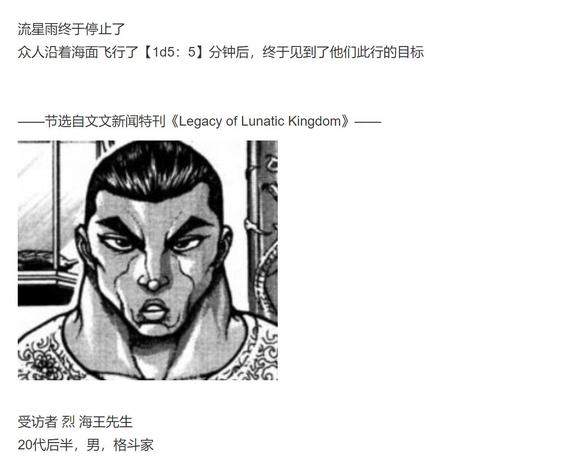

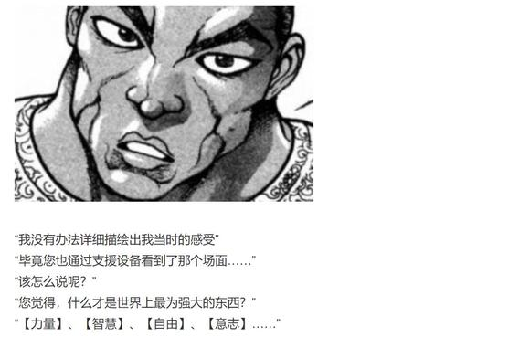

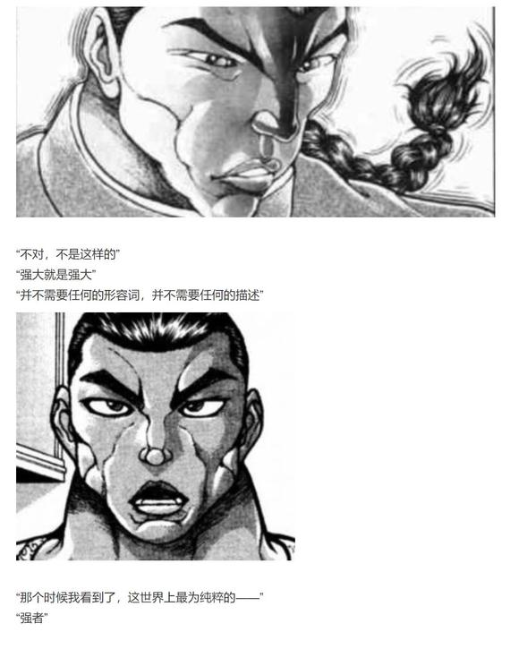

BGM：故乡之星倒映之海

“不管如何拟定计划

对手却总有办法成功破解

真不甘心

明明只差一点点就能到达宿敌的面前了呢”

那是，无可抵挡的存在感

那是，化为实质的压力

那是，纯粹的无名存在

纯粹的怨恨

纯粹的愤怒

纯粹的灵魂

她身穿绣有九尾的黑色宫服，头戴黑色的冠冕，留有一头黄色的长发

被七条紫色的灵气所簇拥着的伟大存在，向面前的五人展露了微笑

烈：我的天哪

这是何等的纯度！

纯狐：我的名字是纯狐

乃与月之民敌对的仙灵

那么首先——

让我承认我的败北吧

灵梦五人：啊？！

纯狐：足足有【两名】地上人来到了我的面前

那些眼里容不下一点沙子的月之民，竟然会使用这种不入流的手段

真是可笑，真是可悲

狂气之民已然堕落回正常了

铃仙：狂气之民仍然是狂气的

会接下这种工作的我，就是最好的证明！

魔理沙：而且，与你战斗的可不止有两人啊

早苗：没错！你就是侵略月之都的家伙吧！

请和我决一胜负！

纯狐：可惜，像你们这种被死秽的气息包围的家伙怎么可能将我打倒

以我的纯化之力，一瞬之间就可以无条件的将你们杀死

铃仙：你在说什么？我们根本就没有miss——

魔理沙：硬要说的话也只是刚刚吃药的时候被稍微蹭到了几下而已......

纯狐：你们并不知道那份药的原理，是吗？

那就让我来告诉你们吧

无论它外在的表现如何，服药的真正效果都只有一个——

那就是令使用者变为身无污秽的，所谓完美生物

早苗：我们的药效已经过去了

这就代表着……

“啪”

纯狐伸手打了一个响指

药效已然消退的三人体内，那本就属于他们的污秽瞬间【纯化】了

她们已然无力维持飞行，于是就此堕落到了静海之中

雾雨魔理沙 战斗不能

东风谷早苗 战斗不能

铃仙·优昙华院·因幡 战斗不能

纯狐：不共戴天之敌，嫦娥啊。你在看着吗！？

月之民所设下的愚蠢计策！这些污秽的人类！

烈的察觉【1d70:51+30=81】（90以上察觉）

烈：（纯狐与，嫦娥？总感觉似乎听过有关的故事，她是中国人？）

铃仙前辈，你们伤势如何！？

铃仙：她手下留情了

我们还有一口气在

灵梦：还能战斗吗？

早苗：只能提供支援了，直接上场怕是做不到

魔理沙：灵梦，不用管我们，去把那个家伙退治掉吧！

灵梦：——交给我吧！

烈：纯狐女士，您既然已经认同了自身的败北，又为何要做出这样的事情？！

纯狐：这次的战意虽然已经丧失了……

但还是让我来招待一下努力至今的你们

这才能称之为礼仪

至于没有资格参与游戏的三位，就请在一旁休息吧

灵梦：把你那副高高在上的态度给我收起来，要打架就好好打！

本来月之都的事情就与我无关，现在我可是一肚子火气

给我听好了，我是幻想乡的巫女，博丽灵梦

你这种胡作非为的灵魂，就由我来退治！

烈：果然还是要战斗

永远亭烈海王，请指教！

纯狐：让我见识一下吧！赌上性命的地上人的可能性！

你们也见识一下吧！拒绝了生死的纯粹的灵力！

毫无意义可言的最终战，于此开始

BGM：Pure Furies　～心之所在

博丽灵梦

Atk：310（255）

Hp：18（16）

技能

博丽的巫女：异变发生时Atk+20，不会陷入异常状态，不会受到驻足，束缚等判定影响，拥有对时停等特殊攻击的耐性，对所有技能均可进行【1d100】的回避判定，50以上成功。自身所受到的所有伤害-2。

绀珠之药：对于无法回避/破解/防御的必杀技可以进行回避/破解/防御，不会受到技能的必中伤害

八云紫的支援：可以使用隙间回避一次致命伤，可使用必杀技境符【波与粒的境界】

伊吹萃香的支援：使用鬼族的遗失之力强化身体素质，Atk+35，Hp+2

射命丸文的支援：操纵风的力量辅助灵梦，回避判定所需成功值-15

神技【天霸风神脚】（CT3）：（近战系）连续使出威力强大的倒挂金钩踢，Atk+75，给予伤害+2

宝具【阴阳鬼神玉】（CT4）：（弹幕系）投掷巨大的阴阳玉，对对手造成必中的【3d3】点伤害

神技【八方龙杀阵】（CT4）：（技巧系）以不可思议的力量束缚对手的行动，本回合自身不会受到伤害，给予伤害+3

回灵【梦想封印　侘】（CT5）：（弹幕系）放出大量灵符令其自动追击对手，3T内对手Atk-65，每回合受到3点伤害

必杀技

境符【波与粒的境界】（CT7）：无数高速移动的弹幕在波与粒子之间变化，无法回避/破解/防御，Atk+800，给予伤害X4

神灵【梦想封印　瞬】（CT7）：由于有紫的支援懒得使用

大结界【博丽弹幕结界】（CT6）：制造没有境界的世界，营造二重的结界。Atk+700，造成伤害X4

【梦想天生】（CT8）：博丽灵梦的究极奥义，化作无法触及的存在，以阴阳玉自动攻击对手。无法回避/破解/防御，Atk+900，造成伤害X6，本回合无敌。

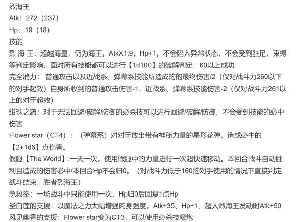

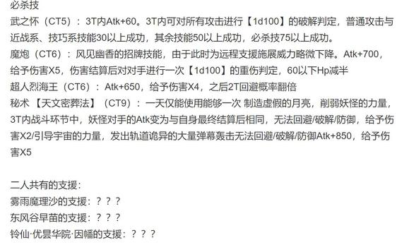

纯狐

Atk：270/280/290/300/310/320/330（？？？）

Hp：3/4/5/6/16/20/24（？？？）

技能

战意低下：自身被击破7次，或使用所有技能/必杀技后战斗结束

弹幕游戏：自身所有技能必中，所有必杀技均不可回避/破解/防御，自身技能/必杀技的破解/回避/防御判定所需成功值+15

无名的伟大存在：所有特殊攻击手段/异常状态/各类判定对其无效

【掌上的纯光】（CT1）一场战斗中仅会使用一次，无缝小玉与激光的配合攻击，请在小玉后方躲避激光。进行6次【1d100】的中弹判定，50以上成功，对对手造成2+成功次数的伤害

【杀意的百合】（CT2）一场战斗中仅会使用一次，发射由纯粹的杀意所构成的百合花，请在活动范围内积极引导花朵的去向。Atk+100，给予伤害+2

【现代的神灵界】（CT3）一场战斗中仅会使用一次，以四色的弹幕构建囚笼，尽力向外侧移动吧。给予伤害X2，本回合对手无法进行普通攻击

【战栗的寒冷之星】（CT4）一场战斗中仅会使用一次，所有弹幕均包含大量寒气，建议随着弹幕的速度左右移动躲避。给予伤害X3，本回合对手无法使用技能，Atk-70

【纯粹的狂气】（CT5）一场战斗中仅会使用一次，轨迹难以预测的弯曲激光，直接消耗必杀技抵消掉比较好哦。3T内自身Atk+60，3T内对手无法使用回避/破解/防御判定。

必杀技

【溢出的瑕秽】（CT6）一场战斗中仅会使用一次，这便是极致的污秽。对手本回合无法行动，Atk+700，给予伤害X4

纯符【纯粹的弹幕地狱】（CT6）一场战斗中仅会使用一次。如同字面意思一样，除了弹幕外什么都没有的攻击。4T内分别对对手造成3点伤害/Atk+700，给予伤害X4/Atk+800，给予伤害X5/Atk+900，给予伤害X6

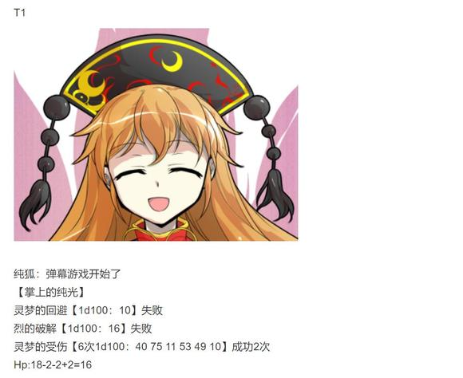

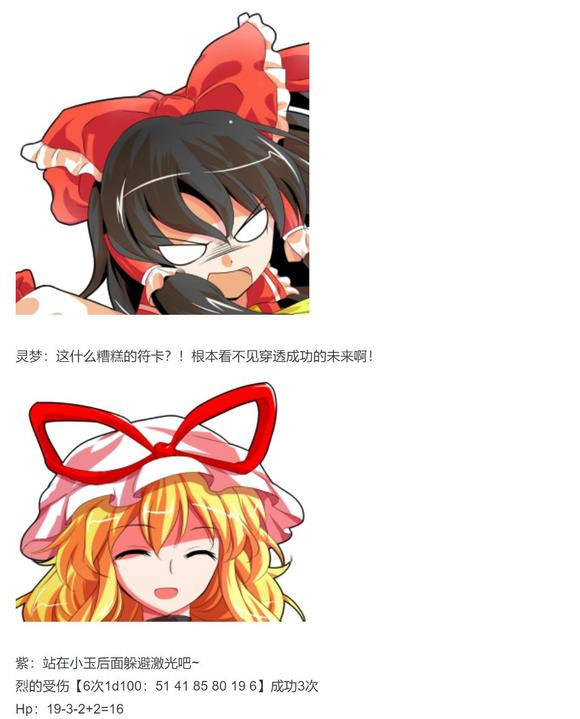

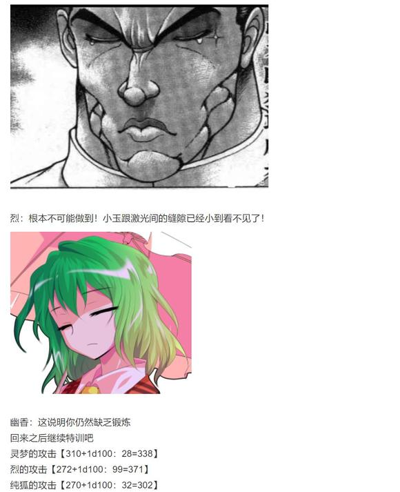

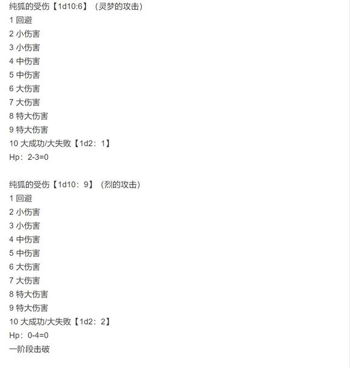

T2

纯狐：道术与中华武术，练得倒都还不错嘛

让我看看你们的意志力吧

【杀意的百合】

无名的存在高声长笑着，放出了美丽的百合花

而构成花朵的物质，则仅是她一人的杀意而已！

灵梦的回避【1d100：85】成功（回避技能为Atk加成，本回合无需战斗判定自动成功）

灵梦：——我看到了！不过是重复数十次就可以躲闪的普通弹幕！

文文：不愧是灵梦小姐！

烈的破解【1d100:7】失败

烈：我看不懂！纵使已经重复了上百次我也完全看不懂！

幽香：那就直接冲过去

用你最熟悉的方式去战斗

纯狐的攻击【280+1d100：44+100=424】

烈的攻击：差值大于100自动失败

烈的受伤【1d10：7】

1 回避

2 小伤害-1+2

3 小伤害-1+2

4 中伤害-1+2

5 中伤害-1+2

6 大伤害-1+2

7 大伤害-1+2

8 特大伤害-1+2

9 特大伤害-1+2

10 大成功/大失败【1d2：1】

Hp：16-3-2+1=12

烈海王拼命穿过美丽的百合，向着纯狐一拳击出

然而，他的拳却被轻易握住了

烈：！

纯狐：技术倒也配得上海王的名字

但是杀意太低了

战斗的时候要时刻心怀杀意——这是四千年以来一成不变的，对敌人最根本的【尊敬】哦

与此同时，纯狐的拳头深深打入了烈海王的腹部！

烈：——多谢您的指导

灵梦小姐，拜托你了！

烈死死抓住了纯狐的手臂，而博丽的巫女则趁此机会，向其发起了突袭！

纯狐的受伤【1d10:3】

1 回避

2 小伤害

3 小伤害

4 中伤害

5 中伤害

6 大伤害

7 大伤害

8 特大伤害

9 特大伤害

10 大成功/大失败【1d2：1】

Hp：3-1=2

萃香：打起架来还是一副不要命的样子

身体倒是比之前强多了

烈：幸亏有白莲师傅的加护……不然这一拳下去，腹部大概就要被打穿了

T3

纯狐：这就对了

游戏继续

【现代的神灵界】！

灵梦的回避【1d100：19】失败

烈的破解【1d100:33】失败

灵梦：光是躲避弹幕就已经竭尽全力了，根本无法攻击！

烈：我也用弹幕回击

接招 Flower star！

纯狐的受伤【2+1d6：6=8】

Hp：2-8=0

二阶段结束

纯狐：花弹的威力确实强大

只是尚不可称之为道

幽香：哦呀，不喜欢花道吗？

纯狐的攻击：由于灵梦与烈无法攻击自动成功

灵梦的受伤【1d10：8】

1 回避

2 小伤害X2-2

3 小伤害X2-2

4 中伤害X2-2

5 中伤害X2-2

6 大伤害X2-2

7 大伤害X2-2

8 特大伤害X2-2

9 特大伤害X2-2

10 大成功/大失败【1d2：1】

Hp：16-4X2+2=10

烈的受伤【1d10:3】

1 回避

2 小伤害X2-1

3 小伤害X2-1

4 中伤害X2-1

5 中伤害X2-1

6 大伤害X2-1

7 大伤害X2-1

8 特大伤害X2-1

9 特大伤害X2-1

10 大成功/大失败【1d2：1】

Hp：12-1X2+1=11

T4

纯狐：把那些美丽的弹幕暂且忘记

用自己身体去感受这份寒冷吧

【战栗的寒冷之星】！

灵梦的回避【1d100：86】成功

红白的巫女穿梭在极寒的冻星之中

本应无法回避的技能，被绀珠之药那短暂的未来视所战胜了！

紫：没有白特训这么长的时间，我很欣慰哦~

烈的破解【1d100：37】失败

白莲：烈先生，做好准备

这个回合只能靠你自己的身躯去战斗了！

灵梦：现在该我反击了

这么不想接受攻击的话，我就把所有的符卡全部用一遍！

符卡宣言 神技【天霸风神脚】

符卡宣言 宝具【阴阳鬼神玉】

符卡宣言 神技【八方龙杀阵】！

纯狐的受伤【3d3：5】

Hp：4-5=0

灵梦的攻击【310+75+1d100：40=425】

烈的攻击【272-70+1d100：8=210】

纯狐的攻击【300+1d100：92=392】

纯狐的受伤【1d10：7】

1 回避

2 小伤害+3+2

3 小伤害+3+2

4 中伤害+3+2

5 中伤害+3+2

6 大伤害+3+2

7 大伤害+3+2

8 特大伤害+3+2

9 特大伤害+3+2

10 大成功/大失败【1d2：1】

Hp：0-3-3-2=0

三阶段击破

T5

纯狐：防御、回避、破解……

战斗中不需要这些额外的小把戏

只有强大，才是决定胜负的要素！

【纯粹的狂气】！

武之怀发动

烈：纯狐女士，我无法认同你的观点

若是只存强大而别无他物，那么技巧与武术又有何意义？！

正是通过这些所谓的小把戏，我们才有能力站在您这样的强者面前！

纯狐：你才明白过来吗？

意义不过是人为附加的概念，物质不过是神明所取的名字

而在我的能力面前——世间万物均毫无意义！

灵梦：我才不关心你的能力是什么

谁打赢了谁说的对！

符卡宣言 回灵【梦想封印　侘】！

Hp：5-3=2

灵梦的攻击【310+1d100：31=341】

烈的攻击【272+60+1d100：29=361】

纯狐的攻击【310+60+1d100：92-65=397】

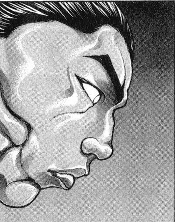

烈海王在目前为止的战斗中，第一次感受到了绝望

那充满狂气的话语中却蕴含着无与伦比的纯粹，因为这世界本就是这般疯狂

他们在遥远的月球之上，为了与己无关的城市和失去战意的敌手打着生死战——

何等荒唐，何等滑稽，何等疯狂

毫无意义，无论是战斗还是自身都是

毫无意义

白莲：烈先生，快醒过来

你被纯狐的疯狂所影响了！

“幻波【赤眼催眠(Mind Blowing)】！”

就在此时

深受重伤的月兔从后方冲来，向着无名的存在释放了她的催眠术

铃仙的支援：本回合对手Atk-50

由于铃仙的支援，纯狐的攻击变为【397-50=347】

烈：铃仙前辈？！

铃仙：烈海王，你给我清醒一点！

连那个恐怖的妖精都被我们所击倒了

而现在，你却要倒在纯狐的狂气之下吗？

仅仅因为这不知所谓的话语，就足以令你失去你的执着吗？！

纯狐：操纵波长从而控制狂气

身为月兔却已然化为地上之人

哈哈哈哈！有趣，真是有趣！

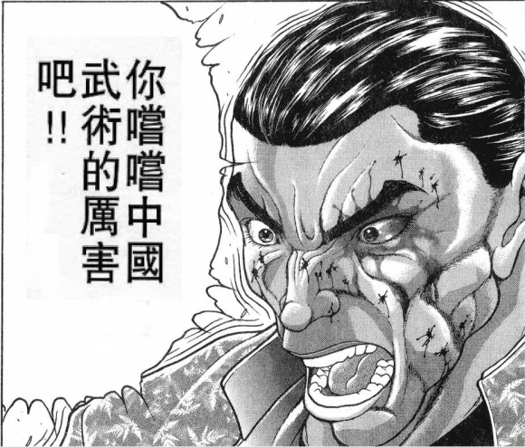

烈：——铃仙前辈，白莲师傅，多谢你们了

我所坚信的意义，没有脆弱到会被几句妄语所轻易毁灭

你尝尝中华武术的厉害吧！

纯狐的受伤【1d10：9】（烈的攻击）

1 回避

2 小伤害

3 小伤害

4 中伤害

5 中伤害

6 大伤害

7 大伤害

8 特大伤害

9 特大伤害

10 大成功/大失败【1d2：2】

Hp：2-4=0

四阶段击破

纯狐：四千年的意志没有丢失，确实存在于你的身上

这可真是令人欣慰

接下来

见识一下我的武，如何？

T6

纯狐的Hp：16-3=13（【梦想封印　侘】的效果）

纯狐：生、老、病、死、爱别离、怨憎会、求不得、五阴炽盛

月之民称其为污秽

而就像你们刚刚所见到的一样，污秽也是可以提纯的

即为极致的情感，即为极致的疯狂

【溢出的瑕秽】！

纯狐双手举起，仰天嘲笑

静寂的月之海便化作了沸腾的生命之汤

这是以无处不在的赤色瑕秽为材料，以茫无边际的静海为基底所构成的，世间最为可怖的囚笼

而格斗家与巫女无论重复多少次，也仍然寸步难行！

“什么极致的污秽，说到底也就是数量多点的弹幕而已”

“既然如此，就一炮把它们全部轰碎！”

“恋符【Master Spark】！”

炽热的魔力光束自两人身边呼啸而过

仿佛先知举起了他的手杖，无限的污秽之海被魔炮硬生生轰出了一条光明的通路！

灵梦：魔理沙？

你的魔炮什么时候这么强了？！

魔理沙：香霖的魔改还真挺管用的

别废话了快上！

雾雨魔理沙的支援：本回合两人可以进行战斗

烈：白莲师傅，我现在已经不再迷茫了

战斗的意义，武术的意义，我所存在于此的意义

不需要思考这些

我是以战斗为乐的武者

我唯一需要做的事情，就是拼尽全力——不，心怀杀意而干掉眼前的敌人！

白莲：善哉，此即所谓心意通透

谈玄论道非你所长

用你的拳去证明你的心！

超人烈海王发动

紫：灵梦，用结界

灵梦：符卡宣言 大结界【博丽弹幕结界】

在此将你封印，无名的仙灵！

烈的攻击【272+1d100：71+700+60=1103】

灵梦的攻击【310+1d100：21+700=1031】

纯狐的攻击【310+700+60+1d100：81-65=1086】

纯狐的受伤【1d10:7】（烈的攻击）

1 回避

2 小伤害X4

3 小伤害X4

4 中伤害X4

5 中伤害X4

6 大伤害X4

7 大伤害X4

8 特大伤害X4

9 特大伤害X4

10 大成功/大失败【1d2：1】

Hp：13-12=1

Flower star发动

纯狐的受伤【2+1d6：4=6】

Hp：1-6=0

五阶段击破

