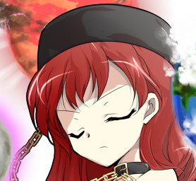
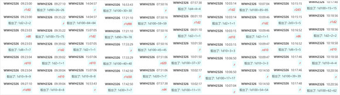
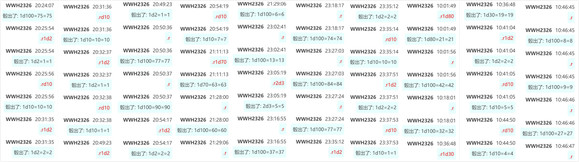

烈：（......这位怕不是和勇仪是一类人？）

那请问之后袭击的事情……

纯狐的执着【1d100:35】（纯狐+50，战胜嫦娥-50，50以下不袭击月都）

纯狐：复仇结束了

袭击月之都已经没有意义

之后需要找点其他的乐趣了

烈：那我们能回幻想乡了吗……

纯狐：本来就说好了，由我送你们回去啊~

赫卡提亚：我就先不去了

这一次真是被伤的很重啊……需要休养个【1d30：26】天左右才行

告别了新认识的朋友，幻想乡五人众与纯狐回到了永远亭

（本日的更新结束，周日把最后的收尾剧情和永远亭故事会搞定顺便加点彩蛋，看不懂的设定问题会在那里解释所以不用担心）

（以下是我的废话）

纯狐战我骰的是真的蛮累的......

大家应该也看得出来，这一场比起普通对战更像是剧情杀，毕竟是五人团本再输真的很过分

不过真的就差点没击破，辛苦最后烈的【1d2】中了

然后这个纯狐赫卡提亚嫦娥的夺命三连击是他娘的怎么回事啊？！！！！！！！！！

我真顶不住了这怎么编啊？！！！！！！！！！！！

师匠什么都不想看我也一样啊！！！！！！！！

相比之下赫卡99好感简直是小事

最后总算是把这段结尾了

大家一定很迷，相信我，我比大家更迷（悲）

另外刚刚看到又有人说要完结了......

怎么可能啊，纯狐的问题解决了烈自己的问题还没解决呢（笑）

皮丝在赫卡那好感都100了她也没无敌啊（笑）

总之今天就到这里，周日终于能结束这次的异变了

骰子明天再发了，摸了摸了

补上本次的骰子

顺便一提皮丝战结束后白莲与师匠讲解污秽那段的说明骰子由于网站崩了所以没截到（就是那俩说明骰子）

~同人本的进度更新~

社团方面联系我说摊位已经申请下来了

在本次上海Comic Cup梦-02，社团名称为orugoru1919，大概50一本送4张人物卡

目前估计是做76P左右，具体效果如图

大家感兴趣的话到时候可以去看一下

附赠的人物卡牌效果如下，社团方面说感觉效果不太好，如果有会做这种的欢迎联系他们

大概早上十点左右更新

（由于三位神仙大战了半天，因此现在已经到第218天了）

~第218天~

~永远亭~

早已做好准备的兔子医疗队们将重伤的几位抬上了担架

而烈与铃仙则带着纯狐前往医疗室了

烈：师匠，我们回来了

铃仙：那个……有位客人说想见见您……

纯狐：你好哇~

师匠的震惊【1d100：11】

师匠：虽说我也想着之后邀请你过来谈谈

但没想到，居然自己找过来了

纯狐：原本是想让赫卡提亚也一起来的

可惜的是，她在刚刚的战斗中受重伤了

话说回来，你就是想出这副计策的月之贤者吧？

居然牵扯到与此无关的幻想乡，真过分

师匠：迁都计划是探女她们制定的

而支援月之都则是幻想乡的贤者们与其商议后做出的妥协结果

我不过是在中间出了一份力，仅此而已

纯狐把玩着铃仙的耳朵

纯狐：听上去你也很为难啊？

站在月之都与幻想乡的中间点，真是不好做的工作

师匠：——换个话题吧

那个恶妇终于死了

你的复仇也结束了

纯狐：一时之间都不知道该做什么了

具体来说……对呢，赫卡提亚之前提到过了，嫦娥现在也只是被拆成基本粒子封印了而已

会不会有人想要将她救出来呢？

我可必须要确保着她的死亡……

这份纯粹的恨意永远不会消失

直到这世间无人记得她的存在

直到构成她的每一个粒子都被彻底毁灭

纯狐：之后已经没有理由袭击月之都了……多亏你教出了优秀的弟子，这段时间倒是还有很多乐趣

铃仙在纯狐的怀中瑟瑟发抖

烈：纯狐女士，您能先放过铃仙前辈吗？

我想她现在需要治疗

纯狐：要换成你吗？

我无所谓❤

烈的勇气【1d100:33】（75以上换烈）

烈：（抱歉了铃仙前辈……这样做的话永琳会干掉我的……）

铃仙：（烈先生，快拿出你跟纯狐拼命时的勇气啊？！）

纯狐之后要去往何方？【1d10:4】

1 自由人

2 幻想乡

3 去地狱找赫卡提亚吧

4 自由人

5 幻想乡

6 去月之都吧（为啥啦）

7 自由人

8 幻想乡

9 在永远亭居住吧（为啥啦？！）

10 大成功/大失败【1d2：2】

纯狐：想要做的事情已经全部完成了

之后要做什么呢？在幻想乡中住段时间，或者去地狱？再去找月之民们玩玩也不错

再见了，地上的月之民们

我会常来玩的哦~

纯狐搓了搓怀中的兔子后，便转身离去了

烈：师匠

那这事现在终于算是结束了吗？

师匠：——啊啊

永远的结束了

啪叽

经过了极为恐怖的战斗，又在梦境世界待了12个小时

如今终于完成任务的武术家与月兔双双倒在了地上

这场牵扯甚广的疯狂任务，就在两人倒地的声音中划下了句号

（纯狐的教学在彩蛋环节）

辉夜三人的乐子持续了【1d30：19】分钟后，终于被忍无可忍的师匠用胶布封上了嘴

辉夜：呜呜呜呜呜呜呜！

师匠：公主大人先安静

好了现在说正事，先把通讯断掉之后的事情跟我讲一下吧

风见幽香的通讯里面只提了关键点，但关于这个离谱的事件的来龙去脉我真是一头雾水

烈的说明【1d100：29】

烈：哦哦哦噢噢噢哦哦！

由于想要表达的事情太多，烈海王挣扎着从轮椅上站起来后挥起了车轮拳

魔理沙：哈哈哈哈哈哈哈哈！

你 他 妈 害我，我肋骨断了不能笑哈哈哈哈哈哈！

辉夜撕掉了胶布

辉夜：皮克——

皮克：你那还算是人？

（听不懂，真的听不懂）

因幡帝：以后给烈海王也配个写字板吧？

师匠：好了烈你闭嘴吧

优昙华，你来说明

铃仙的说明【1d100：91】

与烈海王形成鲜明对比的是，在日常生活中一向靠谱的铃仙将纯狐——赫卡提亚——嫦娥这个离谱的连锁有条有理的描述了出来

她甚至准确复述出了每一个人当时都说了些什么

烈：师匠，到底为什么会发展成这样啊？

月之贤者微笑着伸出双手抓住了烈与铃仙的脑袋

师匠：“那是护卫那位大人的月兔！”

“我知道了，那位大人是嫦娥！”

你们这两个直接引爆火药桶的家伙还好意思说这话吗？！

我怎么就教出了这么好的弟子呢？还是两个？！

铃仙：师匠饶命啊头骨要碎了！

烈：师匠饶命啊头骨真的要碎了！

灵梦：我一看这一幕就完全可以理解为什么这两个人能干出这种事了

早苗：这永远亭的教育思路从根子上就出问题了吧？

月之肌肉脑吧这是

辉夜：好了好了永琳你冷静一下

——严格意义上来说就算他们两个什么都不干这件事的结局也不会有任何改变

那可是自数千年前就已经结下的仇怨，隔着这么近的距离，就算纯狐和赫卡提亚都瞎了也能感知到嫦娥的气息

师匠：我是气这个吗？

这俩憨货居然都不尝试一下调解或者拖延时间而是直接喊“哇，嫦娥”才是最过分的事情！

因幡帝：怎么说呢……也别对黑曜石要求太高了吧？

灵梦：永琳，麻烦先别收拾你那两位高徒了

魔理沙：先讲讲这三个人之间到底是怎么回事可以吗？

师匠：——那可是个相当复杂的故事了

简单来说，纯狐憎恨着嫦娥

而嫦娥，则是纯狐丈夫的妻子

早苗：等一下，如果跟神话传说中记载的相同，嫦娥的丈夫应该就是那个射日的羿吧？

烈：而纯狐女士……如果她就是史书中的那位，那么她的丈夫应当是夏朝有穷国的君主羿啊

这不是两个人吗？

烈的震惊【1d100：4大失败】

烈海王大失败

大失败是什么【1d10：4】

1 我不是针对你……

2 早苗：你尝尝相扑推手的厉害吧！

3 烈：我要学习神明的相扑！

4 我不是针对你……

5 早苗：你尝尝相扑推手的厉害吧！

6 烈：尚不及武神武圣

7 我不是针对你……

8 早苗：你尝尝相扑推手的厉害吧！

9 烈：连克巳也做得到啊

10 大成功/大失败【1d2：1】

烈：早苗小姐，我不是针对相扑

我是说相扑、空手道与合气道，通通都无法与我们中华武术相提并论！

居然胆敢自称最强……你要立刻向中华武术道歉！

早苗：哦？你想试试守矢综合格斗术？

那就来跟我打一场！就现在，就在这里！

烈：我无所谓！

毫无疑问，会是我们中华武术的大获全胜！

师匠：——公主大人，稍微闭一下眼

除了激烈争吵的两个武痴外，其余所有人都自动自觉闭上了双眼

皮克甚至把耳朵也捂上了

月之头脑推着两位轮椅战神来到了永远亭外

师匠：说正事的时候不要在旁边像两个小孩一样吵架！

神符【天人的族谱】！

如系谱般延伸的激光以永琳为中心将两位本就无法动弹的强者包围了起来

其后，宛如暴雨般的弹幕轰向了烈与早苗

【1d30：16】分钟后

师匠推着两眼无神的烈与早苗回到了医疗室

早苗：我要向幻想乡医疗协会投诉……

烈：被击中的瞬间就被师匠治好了所以身上一点伤都没有

月球医术真神奇啊……

师匠：继续刚刚的话题

纯狐与嫦娥都曾是羿的妻子

——而纯狐的丈夫杀死了她的儿子

灵梦：这什么啊……好恐怖……

师匠：之后，纯狐为了复仇杀掉了羿

而天赋异禀的恶妻嫦娥，也被纯狐理所应当地所憎恨着

魔理沙：是单纯的迁怒？还是说那个“恶妻”就是这份仇怨的起点？

早苗：杀戮儿子的羿

杀戮丈夫的纯狐

以及那个所谓的“恶妻”嫦娥……

感觉好像都不是什么好人？

师匠：用现在的善恶观去定义那个时代的存在，自然会得到不可理喻的结论

而这数千年前的仇怨具体为何而起，对于现在的她们而言已经无所谓了

唯一残留的只有纯粹的仇恨和愤怒，除此以外别无他物

烈：好沉重啊……

那赫卡提亚跟这件事又有什么关系？

师匠：说实话我之前也觉得不可理喻……不过知道她跟纯狐是朋友之后就想通了

地狱的女神会参合进来则是由于另一件事

那是你最为熟悉的神话传说之一

烈的察觉【1d70：48+30=75】（75以上察觉）

烈：莫非是射日的传说？！

这和地狱有什么关系？

师匠：正如你所说，羿击落了太阳，也就是阿波罗

光明存在的同时也造就了暗影

　　   本来，没有太阳地狱就无法存在

　　  而由于失去了强烈的光明，地狱的黑暗也因之减弱了

魔理沙：太阳不是好好地存在于我们的头上吗？

师匠：过去的太阳与现在的太阳可是完全不同的

烈：《山海经》与《淮南子》中都提到了羿射十日的传说

我小时候听到的童话版本，则说是羿射下了九个太阳，而为民众保留了其中的一个

这也是击落阿波罗的一个侧写吗？

师匠：你可以这么理解

阿波罗被羿击落之后，太阳的【光明】极大减弱了

这甚至削弱了地狱中的力量，赫卡提亚作为掌管地狱的女神也因此怨恨上了羿

皮克：你那还算是人？

（但是羿已经被纯狐所杀死了啊？）

师匠：是的，赫卡提亚本应无理由复仇了

但是她认识了一位名叫纯狐的朋友

在这位朋友的影响下，她对羿的怨恨转移到了嫦娥身上

于是，两位复仇者的作战计划就这样开始了

早苗：等一下，等一下

羿、纯狐和嫦娥都是中国人吧？

而赫卡提亚和阿波罗，我记得是希腊神话里面的神明

听神奈子大人说月之都的月之民们则是日本的天津神

——他们到底是怎么掺和到一块去的啊？！

灵梦：我不大清楚希腊是什么地方......也许是他们那个时代还没有所谓的地区之分吧？

亦或者，持有不同名字的神明其实是同一存在？

师匠：这就不在我的讲解范围内了

你们都是能够降神的巫女，感兴趣的话就自己去问吧~

辉夜敲了敲黑板

辉夜：回归正题

赫卡提亚虽然直到最后才登场，但她在本次计划中才是真正意义上的核心

还记得那个妖精吗？

铃仙：您是指被【纯化】过的地狱妖精 克劳斯皮恩？

辉夜：对，就是那家伙

现在看来她就是赫卡提亚的部下

烈：也就是说，在这一次的行动中赫卡提亚派出了妖精们，而纯狐则负责将其纯化到极致后来封锁月之都

师匠：从之前与赫卡提亚短暂的交谈来看，她本人则负责监视梦境世界的月之民们

我估计她们按照原版月之都的待遇依葫芦画瓢，在梦境中的伪月都又玩了一次污秽围城……

烈的震惊【1d100：90】

烈：？？？？？？？

那如果赫卡提亚她铁了心要把月之民全灭的话，她就完全可以在梦境世界困上个几百上千年……

然后月之民的高层因为污秽围城又出不去，普通月兔又打不过，这不是压根无解吗？

师匠：所以才会让你们几个去救援啊

无论纯狐还是赫卡提亚，都是你们根本无法触及到的存在

而本次作战的真意，其实只是提醒她们“幻想乡与地球被卷入你们的复仇计划了”这样一个简单的事实而已

于是不愿伤及无辜的她们便因此而熄灭了战意

灵梦：你们就没想过她们不愿意让步该怎么办吗？

辉夜：纯狐的反应大体还在预料之内，毕竟我们已经与她战斗过不知多少次了，万一真出事了就由我和永琳顶上——

但是我们根本不知道那个赫卡提亚会下场啊！

那位与幻想乡跟月之都根本不是一个水准的存在！

魔理沙：说起来这位远超幻想乡与月之都水准的存在

灵梦：被一只蛤蟆

早苗：打成重伤了！

铃仙：都说了那不是蟾蜍，是嫦娥大人！

师匠：这才是昨天发生的最为离奇的事件……

别说那是被封印的嫦娥，就算那坏女人当真处于全盛时期并配合蓬莱之药，她也绝不可能重创地狱的女神

烈的察觉【1d70：52+30=82】（75以上察觉）

烈：师匠，蓬莱之药是什么？

师匠的守口如瓶【1d100：86】（75以上不说）

师匠：等你打败我或者公主大人再告诉你

我是真的想不通赫卡提亚到底是怎么受的重伤……

烈：她们之间的实力差距达到了这种地步吗？

辉夜：举个例子来说就是，烈海王大战魔理沙与纯狐的联手并在最终成功重创了纯狐

你觉得可能吗？

魔理沙：关我屁事？这都能扯上我？！

烈的迟钝【1d100：5】大失败（75以上觉得可能）

大失败是什么【1d10:6】

1 烈：我觉得我可以重创魔理沙

2 纯狐：做不到的

3 烈的口才激怒了辉夜

4 烈：我觉得我可以重创魔理沙

5 纯狐：做不到的

6 赫卡提亚：好过分的例子

7 烈：我觉得我可以重创魔理沙

8 纯狐：做不到的

9 魔理沙愤怒了！

10 大成功/大失败【1d2：2】

烈海王：绝不可能吧，就算我与纯狐女士单挑也绝不可能做到所谓重创

话说回来举这种例子她会生气吧……

赫卡提亚：就是说啊，好过分的例子~

地狱的女神，不，现在是头顶地球的地上的女神赫卡提亚一脸自然地站在烈海王的轮椅后方加入了众人的对话（有地球身立绘但由于时间不大够没截，下次出场补）

烈的惊吓【1d100：81】（由于大失败不管出多少都断肋骨）

烈海王吓得从轮椅上跳了起来！

烈的肋骨在这个过程被他自己蹦断了！

赫卡提亚：Yahoo，好新颖的欢迎仪式！

烈：啊我的肋骨……话说赫卡提亚你什么时候来的啊？！

赫卡提亚什么时候来的？【1d10：5】（1 10随机选项，2-5一直在，6-9刚来）

赫卡提亚：我从谈话开始就一直在啊，大概是那边的三位大笑的时候就进来了

中途还有位有意思的绿发小姑娘过来跟我打了个招呼，不过似乎是觉得气氛太严肃就又走了

辉夜的冷静【1d70：41+30=71】（50以下攻击）

辉夜：——你看见没有？这就是恐怖的实力差

她这样的存在被嫦娥打成重伤，怎么都不可能的

师匠：真是失礼了，不过您既然来了也至少应当打个招呼吧

赫卡提亚：本来是想按个门铃的，不过永远亭似乎没这东西

进来之后又找不到插话的机会，我也很无奈哦

早苗：所以你到底是因为什么才会受重伤啊？

赫卡提亚重伤的理由是【1d10:4】

1 守护纯狐的存在意义

2 只是月球身躯重伤

3 其实那是继承了全月之民力量的崇皇嫦娥（什么玩意）

4 守护纯狐的存在意义

5 只是月球身躯重伤

6 为了彻底封印嫦娥而付出的代价

7 守护纯狐的存在意义

8 只是月球身躯重伤

9 其实我真没那么强啦

10 大成功/大失败【1d2：1】

赫卡提亚：是为了守护纯狐啊

师匠的察觉【1d50：13+50=63】（75以上察觉，月之头脑+50）

师匠：您在说什么？

她根本无需任何人的守护吧？

赫卡提亚：不不，不是指战斗方面的守护

而是她的存在意义

烈海王，你能理解吗？

烈的察觉【1d70：50+30=80】（75以上察觉）

烈：（纯狐的意义？对嫦娥的怨恨……那么必须存在一个怨恨的对象……）

不会吧……

难道说你其实是可以……其实是可以完全毁灭掉嫦娥的？

哪怕她可以无数次死而复生？

赫卡提亚：Bingo！这就是我看好你的原因哦！

干掉嫦娥很简单，但我不能这样做

如果嫦娥不复存在于此世之中，那么现在的纯狐就没有生存意义了

你明白吧？复仇爽爆了，但是她爽完之后很可能真的就会当场消失

没有了仇恨与愤怒的纯狐，会把自己纯化为真正意义上无思无想的灵魂

灵梦：——你这家伙，我就说当时怎么感觉不对劲

你是在与纯狐和嫦娥同时战斗！

赫卡提亚：完全正确

我不能让纯狐就这么杀掉嫦娥，以她的纯化之力她真的有可能做到这一点

因此，趁着她彻底陷入疯狂而难分敌我的时候

我代替嫦娥承受了绝大部分的攻击

魔理沙：别开玩笑了！

你在承受那个纯狐全力进攻的同时，还控制着自己的力量不下杀手，而是慢慢将嫦娥拆成了粒子后分别封印了起来？！

这怎么可能做的到？

烈：这就是后面我们无法理解的，战斗的真意？！

铃仙：然后……花费了12个小时的时间之后……

你为纯狐留下了一个永远无法行动的，等同于死亡却仍然存在于此的仇人？！

赫卡提亚：真聪明！

说实话最麻烦的部分是要骗过纯狐哦，万一她察觉到了我对嫦娥放水的话……

想想就害怕，那可真是太过危险了

哪怕知道我是为了救她，她也会追着我杀上几百年吧！哈哈哈哈哈！

赫卡提亚：那么我的故事说完了，可别跟纯狐说这事哦

可以让也我入院治疗一下吗？现在才刚过了一天，我还得修养个25天才行呢

皮克打着哆嗦给赫卡提亚也推了张轮椅

地狱的女神一屁股坐了下来，快乐地加入了轮椅战神的队伍中

月之头脑、永恒与须臾的罪人，博丽的巫女，普通的魔法使、狂气的月兔、奇迹的现人神、永远亭的武术家、史前的原始人、因幡的白兔……

在场的所有人，全都说不出一句话了

守护挚友的温柔的心

同时迎战二人的强大的实力

为此甘愿深受重伤却不愿告知好友的，坚毅的意志

以及最终将其付诸于谈笑之间的，超然的态度

这份感动，这份敬仰……应该如何表现呢？

结论就是在场的所有人，都不约而同的同时拍手鼓掌

“一个人也守护不了，还有什么生存的价值呢~”

而赫卡提亚·拉碧斯拉祖利却只是坐在轮椅上，愉悦的哼着不知名的歌曲

~第219天结束~

——月之都异变结束——

——永恒的复仇结束——

——都市传说异变尚未结束——

异变总持续时间：1天

成就：解决月之都异变 达成！

Atk+1

成就：无名仙灵的认可 达成！

Atk+3

现在的Atk：245（129）

成就：直面伟大存在 达成！

与无名的纯狐进行了战斗，与地狱的女神成为了挚友

对抗了纯粹的强大，理解了真正的温柔

此后不会被秒杀

决心、战意、勇气等意志力相关判定基础值+30

成就：幻想乡联合军 达成！

与其余四人并肩作战，直面生死

除日常打闹与切磋等特殊情况外，不会与博丽灵梦/雾雨魔理沙/铃仙·优昙华院·因幡/东风谷早苗进行战斗

~彩蛋~

一如既往，纯搞笑剧情，无大成功大失败，（除本次纯狐的教学外）无能力值升降

~永远亭的宴会~

在恢复了【20+1d20：18=38】（大失败断肋骨+20）天后，烈海王终于拆掉了全身的绷带，回归到了他的日常生活之中

由于其他四位也差不多是这个时间点康复，因此庆祝异变解决的宴会便推迟到现在才办

烈：大家有什么想吃的直接点就行！今天拜托隔壁雀食堂的老板娘也来帮忙了，基本上什么菜都能做！

幽香：我还是要点心就行了~

白莲：我就吃点斋菜吧，素烧鹅之类的

纯狐：来一只德州扒鸡

赫卡提亚：有玛格丽特披萨吗？

值得一提的是，本次异变的两位主谋相当自然的参与到了宴会之中来

不如说由于经常过来玩，已经快要成为永远亭的常驻人员了

师匠：一个成了纯狐感兴趣的对象，一个成了赫卡提亚的挚友

我怎么就这么会教徒弟呢？

这都什么事啊……

月之头脑捂着额头叹了口气

