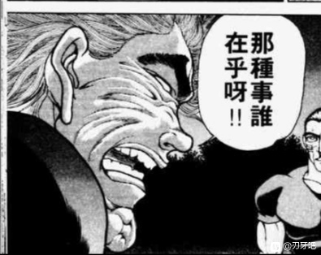

四季：对青少年的坏影响，不可估量

决定了，今天的第一个目标就是宇佐见堇子

她现在在哪里？

堇子现在在哪啊？【1d10：5】

1 一如既往的博丽神社

2 人间之里

3 在香霖堂

4 一如既往的博丽神社

5 人间之里

6 在旧地狱（为啥啊）

7 一如既往的博丽神社

8 人间之里

9 在守矢神社（为啥啊）

10 大成功/大失败【1d2：1】

烈：现在这个时间点，堇子小姐应该正在人间之里吃早饭

我一块带您过去吧

烈与四季前去寻找堇子了

皮克：你那还算是人？

（我怎么感觉他俩的关注点有点奇怪呢？）

因幡帝：她差点把幻想乡炸了才是真正应该骂的地方吧！？

~人间之里~

宇佐见堇子今日睡得特别早，从早上第一节的国文课就开始来幻想乡玩了

她如今正在人里的小摊上买了一堆吃食，准备在梦中享用早餐

堇子：在幻想乡无论吃多少也不会影响现实中的躯体呢~

真棒啊，简直是女高中生的天堂！

就在这时，武术家与阎魔出现在了她的眼前

烈：堇子小姐你好

这一位是来自彼岸的四季映姬小姐

堇子：大清早看见你可真是晦气……

话说这孩子超可爱啊！

哎呀呀，四季妹妹你好啊，我是来自外界的宇佐见堇子~

要来聊天吗？我请你吃零食哦~

四季的怒气【1d100：39】

四季：多谢你的好意，零食就免了

比起那种事情，你啊

没错，作为人类你过于傲慢了些

堇子：目中无人是女高中生的特权哦

四季：如果你就这样死掉的话

就要把你丢进血池里了

堇子：咿呀，这孩子一脸平静的说出了超级可怕的话

让我想起了那个同为绿发的觉妖怪

四季：你应当对自身的生活和周边的事物都抱有敬重之心

如果由我担当你的仲裁的话

你可要受血池之刑呢

堇子的恐惧【1d100：74】（75以上听劝告）

堇子：啧啧啧，听起来真是可怕的刑罚

只可惜，以你这幅样子说出来的话简直毫无威慑力

烈：堇子小姐，你不应当总是以貌取人

四季小姐是乐园的最高裁判长，负责裁决死者的阎魔大人

她所说的并不是口头的警告，而是你死后将要遭遇的未来啊

堇子：这么一说就更是无所谓了

我一个大活人为什么要担心死后的事情？

何况等我要死的时候起码都过去几十年了

谁知道那时候的科技会发展成什么样子，说不定人均寿命百年起步都没问题哦

四季：我早已明白，只重视现在而不考虑未来的人类越来越多

但如你一般连当下都不重视，还真是可悲

不趁现在悔改的话，等死后再后悔就晚了！

堇子的迷惑【1d100：90】

堇子：？？？？？？？

不不不，四季小姐你等一下

我最近可真的是什么事情都没干啊，怎么就不重视当下了？

之前神秘珠异变时闯的祸我也已经充分道歉并悔改了——那时候我还被你旁边那个人打了两顿哎？！

说起来你真正该骂的是这个以大欺小的假腿辫子肌肉大叔才对吧？！

烈：好过分的称呼！

四季：不要转移话题，现在我在说的是你的罪过

宇佐见堇子——你为什么不好好学习？

现在在外界应当是早上第一堂课刚刚开始不久的时间，你居然在这个时候就进入睡梦之中玩乐

连作为学生的本职工作都不重视，又谈何重视当下？

堇子的狡辩【1d10:5】

1 我的本职工作是超能力者（战斗开始）

2 学校的东西对我而言太过简单了（随堂考试）

3 关你屁事哦（被秒了）

4 我的本职工作是超能力者（战斗开始）

5 学校的东西对我而言太过简单了（随堂考试）

6 我已经保送大学了（真的假的）

7 我的本职工作是超能力者（战斗开始）

8 学校的东西对我而言太过简单了（随堂考试）

9 乖乖听话（怎么改主意了？）

10 大成功/大失败【1d2：1】

堇子：把时间浪费在毫无意义的事情上可算不上什么尊重当下

我宇佐见堇子在外界可是一等一的天才少女

学校所教授的知识，对于我来说不过是考前随便翻翻就能掌握的东西，上课又有何意义？

四季：看吧

所以我才说，你对周围的人与事都缺乏敬重，而这便是你的罪行

一味凭借天赋偷懒，就算现在可以蒙混过关，也迟早会被努力的一般人所超越

堇子：真可惜你完全无法证明这一点呢

听上去只是小孩子不服气的顶嘴罢了

烈：想要证明谁对谁错倒是挺简单……

给堇子小姐出份卷子不就行了？

高中程度的日本历史题我应该能写一份出来

四季：好主意

那么我就出一份数算的题目吧——

有言在先，这可都是完完全全的基础题

就算你的天赋再好，知识点不懂也绝对是写不出来的

堇子：到了幻想乡还要考试？！

行啊行啊就让你们看看本小姐的厉害

我要让你们哑口无言！

~随堂小测开始了~

（由于本次是毫无准备的突击测试，因此堇子无基础值加成）

堇子的日本史【1d100：70】（75以上合格）

堇子的数学【1d100：78】（75以上合格）

堇子：这种程度的题目对我来说简直是小菜一碟！

烈：数算卷子倒是合格了——

但是日本史刚好差五分及格

全部都是基础题还扣了30分，这可不能说是认真听讲了

堇子：你确定不是你出的卷子有问题吗？

说到底一个外国人出的日本史卷子……

四季：那就来对对答案吧

首先是选择题第一道 开场的送分神话题

曾设计引出天照大神的神明为

A 八意思兼神

B 建御名方神

C 月读命

D 绵津见大神

正确答案是A，你的选择是B

堇子：古代神话方面我不大熟啦……

烈：但是你的民俗传说题也没对啊

选择题第八题 平安时代的知名武将 拥有带领四天王斩鬼除妖之传说的武士是

A 源赖政

B 源赖光

C 源赖朝

D 源义经

正确答案是B，你选了D

堇子：普通人都会想到源义经吧……

而且这个也不是正经历史题！

四季：那就来看正经的历史题吧

填空题第二道

曾经参与关原合战、大坂之役、岛原之乱，并著有《兵道镜》、《五轮书》等著作的战国时代知名武士是【】

正确答案是宫本武藏、新免武藏守藤原玄信或者其他的别称，但你写的是上泉信纲，怎么解释？

堇子：啊……这个……这个……

烈：填空题第八道 最简单的年份题

知名历史故事《侠客行》发生的时间为【 】

正确答案为1616年，你这题空了

堇子：这种东西谁记得住啊？

四季：填空题第十题 人物题

目前已知最古老的人类男性名为【 】

很遗憾答案并不是亚当

烈：正确答案是皮克

平时多看点新闻吧，堇子小姐

堇子：啊是那个一头散发的肌肉佬吗！

四季：论述题

被称为圣人的飞鸟时代政治家圣德太子，如今被许多史学家认为是虚构人物

对此，你有什么看法？你认为我们应当以什么样的态度看待真伪难辨的历史？

根据素材写一篇不少于400字的论述

烈：而你一共才写了200多字就交卷了

神子殿下看到之后会很生气吧

堇子：——不是，这些东西你能写的出来吗？！

四季：相同时间内他写了800字的小作文，经我确认后确实没有问题

顺便问一句，烈海王你的文凭是？

烈：说来惭愧，我自幼便在寺中习武，历史方面主要靠师傅们讲故事和自己翻书学习

按现在的标准来看，大概也就是个体校毕业吧

堇子的丢人【1d70：14+30=44】（一科不及格+15，历史不如烈海王+15）

堇子：哇咧……日本史比不过邻国的体校大叔，这确实有点点丢人啊

四季大人我知错了……

四季：在人生中多做善事，才是让死后的生活变得舒适的唯一方法

而这一次的测试，将会成为你行善的一个开始吧

认真的对待自己的学业，对周边的事物抱有敬重之心

这就是现在的你要积累的善行

~堇子带着一脸微妙的表情逐渐透明化而离去了~

烈：相信堇子小姐今后应当会认真学习了

对了，四季小姐

如果她两份题目都及格了您准备怎么办？

四季：全部都是基础题，只要错一个都该说教

如果她全部都做对了，那便说明我的话语有失偏颇，我便应当向她到道歉——然后继续说教有关她处事态度的罪过

（例行跑步倒垃圾，9点左右继续）

接下来四季的说教对象是【1d10:9】

1 太阳花田的恐怖妖怪 风见幽香

2 扰乱风纪的魔法使 雾雨魔理沙

3 浑水摸鱼的巫女 博丽灵梦

4 不事生产的neet公主蓬莱山辉夜

5 调皮捣蛋的觉妖怪 古明地恋

6 肚子好饿啊先去吃饭吧（为啥啦）

7 压榨劳动力的黑心老板 八云紫

8 恶贯满盈的幽灵 西行寺幽幽子

9 纯狐（为啥啦？）

10 大成功/大失败【1d2：1】

烈：四季小姐，您接下来的目标是？

四季：之前听你大概介绍了现在的幻想乡

那位名为纯狐的仙灵，也是最应当被说教的人物之一！

烈的震惊【1d100：98大成功】

烈海王大成功！

大成功是什么【1d10:8】

1 纯狐：我会好好听话的（会吗？）

2 四季好感度+【1d10】

3 师匠来帮忙啦（为啥啦）

4 纯狐：我会好好听话的（会吗？）

5 四季好感度+【1d10】

6 仅限本次对纯狐的说教中，烈海王的口才+50

7 纯狐：我会好好听话的（会吗？）

8 四季好感度+【1d10】

9 赫卡提亚来帮忙啦（为啥啦）

10 大成功/大失败【1d10：2】

烈：什……什么？！

那可是那位纯狐女士啊！居然要对她进行说教

不愧是四季映姬小姐，令人憧憬，令人崇拜啊！

四季的好感度增加了【1d10：5】

好感度：71+5=76

四季：只要背负罪过，无论何人我都会对其进行说教

纯狐这段时间一直在骚扰兔子，并流窜于各地拍照，给当地居民带来了极大的困扰，这可不是她应当做的事情！

说起来现在纯狐在哪啊？【1d10:4】

1 永远亭

2 博丽神社

3 靠我烈海王的情报收集

4 永远亭

5 红魔馆（为啥啦）

6 胃疼！四季的胃疼突然犯了！

7 永远亭

8 白玉楼（为啥啦）

9 在月之都哦

10 大成功/大失败【1d2：2】

~永远亭~

今天的铃仙也在纯狐的怀中挣扎着

纯狐：铃仙，今天要出去玩吗 ？

我给你做了便当哦~一起吃吧~

而一旁的原始人正不安的搓着手

皮克：你那还算是人？

（请您快放过铃仙吧……她看上去好可怜……）

因幡帝：她看上去明明蛮爽哦，脸都快要红透了

铃仙：（快来人救救我啊！永琳师匠，公主大人，为什么只是看着？！）

就在这时，烈与四季赶回了永远亭

身材矮小的阎魔大人将手中的木牌指向了无名的仙灵

四季：到此为止了！

虐待月兔的行为，就是你的罪！

烈：纯狐女士，还请您先住手

铃仙前辈她快要不能呼吸了……

纯狐要做什么？【1d10:5】

1 先放开铃仙

2 那你们过来换她吧

3 抱得更紧了（为啥啦）

4 先放开铃仙

5 那你们过来换她吧

6 呼叫师匠（为啥啦）

7 先放开铃仙

8 那你们过来换她吧

9 呼叫辉夜（为啥啦）

10 大成功/大失败【1d2：1】

纯狐：你是之前那个负责与月之民和谈的阎魔啊

我并没有虐待铃仙哦，只是在和她聊天而已~

或者，你们要来代替她吗？我无所谓❤

烈的恐惧【1d100：61】（50以下去代替铃仙）

四季的恐惧【1d100：95】（50 以下去代替铃仙）

四季：烈海王，为了职场的前辈而挺身而出

这就是现在的你要积累的善行

烈：不不不不，师匠她就在医务室里看着啊！

视线已经快要凝为实质了，铃仙前辈现在还死不了但我如果去了一定会死的！

铃仙：正气凛然的走了出来结果到了要担当的时候就全缩了？！

你们两个比纯狐更过分吧！

四季映姬清了清嗓子

四季：咳咳

言归正传，赫卡提亚大人的朋友，无名的仙灵纯狐呦

虽说眼前的月兔是抛弃同胞的自私之徒，但你也不应当如此折磨她

你本就是执念于复仇的存在，如今又再度犯下罪孽

若是不知悔改，死后定会坠入地狱的！

纯狐的答复是【1d10:1】

1 那不是很好吗？

2 我可没有折磨兔子哦

3 乖乖听话（脾气真好啊）

4 那不是很好吗？

5 我可没有折磨兔子哦

6 纯狐愤怒了（别啊）

7 那不是很好吗？

8 我可没有折磨兔子哦

9 我要找你的上司告状（为啥啦）

10 大成功/大失败【1d2：2】

纯狐：那不是很好吗？

这样子我就可以直接住在赫卡提亚家里了~

四季映姬哑口无言

四季：（糟糕，她根本就不怕下地狱……倒不如说，到了地狱简直跟回家一样！）

于是接下来拯救铃仙的人是【1d10:6】

1 靠我烈海王的口才！

2 皮克挺身而出！

3 因幡帝站出来了！（为啥啦）

4 靠我烈海王的口才！

5 靠四季的教育！

6 师匠不再继续旁观了

7 靠我烈海王的口才！

8 四季：换个人说教吧（为啥啦）

9 是辉夜！

10 大成功/大失败【1d2：2】

就在这时，师匠从医务室中走了出来

师匠：纯狐，我并不反对你与优昙华玩耍——

但正如阎魔所说，你的游戏对于我的弟子来说就是折磨

师匠的劝说【1d100：40】（月之头脑+50，纯狐的执着-50，50以上成功）

铃仙：果然最值得信赖的还是师匠——

师匠：至少在我看不到的地方玩吧

一直这么看下去良心会受折磨的

烈：师匠，你发言的方向完全不对头啊！

皮克：你那还算是人？！

（你那还算是人？！）

纯狐：那么我们出去玩？

铃仙想去哪里呢？

铃仙：我无所谓……

这里已经没有什么值得留念的了……

因幡帝：铃仙的眼神死掉了！

阎魔大人你赶紧想想办法啊！

四季的急智【1d10：10】

1 不要把朋友当成玩具！

2 过分的亲近只会给对方带来困扰

3 不要把玩具当成朋友（反了吧？）

4 这里就用我的净琉璃之镜（不要啊）

5 过分的亲近只会给对方带来困扰

6 想不到什么好办法，烈海王你来吧（为啥啦）

7 不要把朋友当成玩具！

8 过分的亲近只会给对方带来困扰

9 胃疼突然犯了（你也争气点啊）

10 大成功/大失败【1d2：1】

四季映姬大成功！

大成功是什么？【1d10：7】

1 在四季的说教下，铃仙与纯狐成为了真正的朋友

2 四季映姬的社交讲座

3 纯狐找到了新的玩具（谁这么倒霉？）

4 净玻璃之镜唤醒了纯狐的母性（为啥啊）

5 四季映姬的社交讲座

6 烈海王的超水平话术再临

7 在四季的说教下，铃仙与纯狐成为了真正的朋友

8 四季映姬的社交讲座

9 最强无敌的四季映姬，从此不会再受伤了！（为啥啊？）

10 大成功/大失败【1d2：2】

四季：无名的仙灵啊，你究竟将眼前的月兔视作何物？

纯狐：铃仙是很有意思的兔子呢~

四季：不要用这种暧昧不明的说法！

人与人之间的关系，应当是黑白分明的

如果将其看做朋友，就应当拿出对待友人的态度

如果仅仅视为玩具，那也没有欺瞒月兔的必要

纯狐搓着铃仙的耳朵，陷入了沉思

纯狐：真要说的话……

是呢，铃仙是我的朋友吧？

铃仙：我是吗？！

我何德何能？！

四季：单方面的表露善意而不在意对方的感受，这种行为能够称之为友情吗？

赫卡提亚大人同样也是您的朋友，您二位私下相处的时候，难道会像现在这样贴在一起吗？！

话说你们会贴贴吗？【1d2：1】

1 会

2 不会

纯狐：会啊

朋友之间贴在一起是很正常的事情吧？

烈的情商【1d90:39+10=49】（30以下吃赫卡提亚的报复）

烈：（结果是赫卡提亚带的坏头吗？！）

（她脑子里在都想些什么啊？！！！）

纯狐女士，可能是地狱的礼节与地上略有不同吧

一般而言，我们在交友的时候并不会突然做出这种……比较亲密的举动

这也是铃仙前辈不太适应的原因

纯狐：哎哎？是这样吗？

我还以为是这孩子一直很害羞的原因呢

对不起哦，铃仙

纯狐放开了怀里的兔子

铃仙：得救了！

阎魔大人、烈先生你们做得好啊！

四季的震惊【1d100:40】

四季：那个赫卡提亚大人干出这样的事情，我居然并不感到多么震惊呢……

师匠：没事吧？

你现在的表情跟刚刚的优昙华一模一样哦

四季：感觉胃疼快要复发了

说回正题，纯狐啊

不因自身的强大而无视旁人的感受，在复仇完成后过上闲适而超然的生活，这就是现在的你要积累的善行

纯狐：但还是会想搓搓铃仙呢

偶尔让我抱一抱可以吗？

铃仙：事前打好招呼的话就没问题……

说实话只要不一见面就贴上来其他怎么样都好啦

烈：说起来，为什么铃仙前辈在日常生活的时候从不摆出战斗时的态度？

如果是那副疯狂的姿态，想必就连纯狐女士也不会太过亲近

四季：大概是因为那会让她想起过去的罪孽吧

毕竟，铃仙·优昙华院·因幡，也是理应坠入地狱的大罪之人

烈的察觉【1d70：1+30=31】（50以上察觉）

烈：（按照四季小姐的标准，怕是大家统统都要下地狱了）

现在快到晚上了，您还准备继续说教吗？

四季的行动是【1d10：7】

1 说教neet公主吧（你跟永远亭杠上了吗）

2 说教西行寺幽幽子

3 说教八云紫

4 说教蕾米莉亚斯卡雷特

5 说教鬼人正邪

6 先吃个晚饭吧（为啥啊）

7 说教古明地恋

8 说教丰聪耳神子

9 说教东风谷早苗

10 大成功/大失败【1d2:2】

四季：当然

本日最后的目标是，无意识的觉妖怪 古明地恋

烈：恋小姐？

虽说她的确是给姐姐添了些麻烦……不过她似乎并未作出什么过分的举动吧？

四季：你完全没有明白啊

那被称为无意识的能力本身，就是古明地恋所背负的，最为沉重的罪过

烈的察觉【1d70：60+30=90】（75以上察觉）

烈：（恋小姐的罪过？如果说这份能力本身并不是她应该拥有的……那么……）

您指的是，她所闭合的第三只眼吗？

四季：正是如此

具体就等找到古明地恋后再进行说明

寻找恋恋的方法是【1d10:4】

1 使用觉的联络装置吧

2 靠我烈海王的情报收集

3 回地灵殿守株待兔（要等多久啊）

4 使用觉的联络装置吧

5 靠我烈海王的情报收集

6 靠我烈海王的直觉

7 使用觉的联络装置吧

8 靠我烈海王的情报收集

9 恋恋：在找我吗？

10 大成功/大失败【1d2：1】

烈海王拿出了一个眼球状的联络装置

烈：那我先问问觉小姐，看看她妹妹在不在家吧

喂喂，是觉小姐吗？我是烈海王

请问恋小姐现在在地灵殿吗？

恋恋在家吗？【1d2：1】

1 在

2 不在

觉：恋恋今天没出去玩哦

话说你问这个干什么？要来地灵殿玩吗？

烈的说明【1d100：71】（50以上理解）

烈海王在四季映姬的辅助下，将两人今日的行程与来意一五一十的向读心侦探说了出来

觉的抵触【1d100：91】（75以下同意说教）

觉：麻烦你帮我转告阎魔大人，就说她大可不必对我的妹妹指手画脚

恋恋她变成现在这样子有我的一部分责任——

但是我不会允许任何人揭开她内心的伤口

哪怕是出于善意的说教，也是一样

觉妖怪单方面切断了通讯

四季与烈要怎么做？【1d10:5】

1 堂堂正正突击地灵殿

2 找鬼族帮帮忙吧

3 想办法把恋恋钓出来（诱拐吗？）

4 堂堂正正突击地灵殿

5 找鬼族帮帮忙吧

6 用点心贿赂觉（为啥啦）

7 堂堂正正突击地灵殿

8 找鬼族帮帮忙吧

9 把觉也一起说教吧！（为啥啦）

10 大成功/大失败【1d2：1】

四季：觉妖怪居住在旧地狱……

而那里可是鬼族们聚集的地方

烈：您要拜托勇仪她们帮忙吗？

四季：你还认识怪力乱神的鬼王啊？

那就方便多了，直接让鬼王出面说服那个固执的觉妖怪吧

烈：话说您本来是打算怎么做的？

四季：？

我是地狱的阎魔判官，鬼族助我一臂之力自然是分内的工作

烈：（她们都退休好多年了吧……这时候突然摆着一副上司的样子过去使唤真不会生气吗……）

烈与四季前往旧地狱了

~旧地狱~

旧地狱的街道中，鬼们一如既往的重复着无不停息的酒宴与玩乐

他们看到了前来拜访的烈海王，便高兴地打着招呼——而在看到他身后的四季映姬后便立马做出了正经的样子

路人鬼：烈师傅你好啊

这位不是阎魔大人吗！真是好久不见了，欢迎您来旧地狱玩

烈：（意外的很正经？！）

四季：无需多礼，我今日只是在度假时顺路过来说教

你们的首领在吗？

出来迎接的人是【1d10:8】

1 勇仪

2 是恋恋（为啥啦）

3 萃香

4 勇仪

5 早有准备的觉

6 华扇（为啥啦）

7 勇仪

8 早有准备的觉

9 阿空（为啥啦？！）

10 大成功/大失败【1d2：1】

咯吱咯吱，咯吱咯吱

众人的后方传来了轮子转动的声音

周围的鬼们突然露出了不安的神色

他们立刻远离了声音传来的方向，并自发为其让开了一条通路——

于是，红发的猫妖推着轮椅出现在了两人面前

而因读心能力而为人所畏惧的地灵殿之主，正以端坐在轮椅之上

四季：你是——

觉：初次见面，是非曲直亭的阎魔大人

我是地灵殿的主人，读心妖怪古明地觉

站在我身后的是我的宠物阿燐

你的名字是四季映姬，这点你已经在心中告诉我了

烈：（觉小姐是来喝酒的吗？话说为什么要坐着轮椅啊？）

觉：恋恋送我的这东西还挺方便的，不需要我自己去走路了

你和这位四季大人想要来地灵殿说教恋恋，但我并不同意

而与鬼族关系不错的你们二人会想来寻求鬼族的帮助，也是意料之中

所以，我早就已经让勇仪她们先行回避了——很遗憾，你们没有外援了

四季：真是思维敏捷的妖怪

但如此聪慧的你自然明白，我所说的话语绝非出于私心

明晓自身的罪孽并及时更正，才能避免死后堕入地狱之苦

觉：的确，你的说教都是正确的内容

但那又如何呢？

恋恋现在并不需要这些所谓的道理

她已经充分适应了目前的状态，并成为了与众不同的觉妖怪

而若只因为她的所作所为不符其天性便要说教——

那我也只能称你为迂腐而不知变通的石头地藏了，四季映姬·夜摩仙那度

阿燐：如果执意要打扰恋大人的话，那我们就打上一场吧~

烈与四季要做什么？【1d10:9】

1 四季的全力说教

2 那就来打架吧！（战斗开始）

3 靠我烈海王的口才（你认真的吗）

4 四季的全力说教

5 那就来打架吧！（战斗开始）

6 先不管这些大家来喝酒吧（为啥啦）

7 四季的全力说教

8 那就来打架吧！（战斗开始）

9 靠我烈海王的厨艺！（为啥啦）

10 大成功/大失败【1d2：2】

觉妖怪与阎魔的话语针锋相对，一时之间却是辨不明白

气氛逐渐变得剑拔弩张起来，阿燐已经悄悄做好了应战的准备

就在这时，烈海王站了出来！

阿燐：烈先生要站在阎魔一边吗？

烈：不，我想说的是

不管您二位的争论结果如何，都还请考虑一下与此无关的鬼们吧

现在已经到晚饭时间了！

而他们还没吃饭，因为现在实在不是能开宴会的时候啊！

觉妖怪与阎魔将目光投向了周围的鬼族们

他们正心烦意乱的往口中灌着酒……

一方是现在地段的主人，一方是过去的老上司，两人正激烈争吵的当下，实在不是吃饭的时候

偏偏有能力调解的鬼王又都不在！这种时候居然只能饿着肚子旁观啊！

四季：已经到饭点了？

烈：我先去给大家做点吃的

等到吃完晚饭再讨论说教的事情，如何？

阿燐：觉大人我……

觉：你也去帮忙吧

说起来阿空和恋恋好像也没吃饭，一块给她们做一份

于是，烈海王与阿燐在旧地狱的街头摆起了路边摊

烈与阿燐的厨艺【1d35：29+65=94】（烈的厨艺+55，双人合作+20，临时小摊-10,90以上缓和两人的关系）

由于基本功过于扎实，虽然只是普通的路边摊，两位大厨仍然做出了让幽幽子都会交口称赞的料理

大排档炒饭与手抓饼自不必说，烤串、章鱼烧与大阪烧也是一定得有

途中偷偷出门的恋恋和阿空居然带了一头野猪回来，因此今天晚上还有炸猪排和烤肋骨

在美食的帮助下，旧地狱再一次充满了欢声笑语

而觉妖怪与阎魔正对着眼前的两盘猪扒饭沉默不语

四季：我好久没按时吃饭了……

居然忘记了最基础的事情，这是我的罪过

觉：我也有点饿了……

阎魔大人也会忙到没空吃晚饭吗？

“因为想要先把工作做完”，原来如此，你平日也相当辛苦啊

四季映姬往嘴里送了口饭

四季：！

这个比居酒屋里的要好吃很多啊！

觉：阿燐和烈海王的厨艺都不错的

话说你这么正经的样子也会去居酒屋吗？

“把工作做完之后就只有居酒屋开门了”，这样啊……

“这次休假就是因为过劳而产生的胃疼” 彼岸的职场也不容易呢

阿燐：起效了

没想到请大家吃晚饭居然真的管用！

烈：要放在我家乡那边应该下碗面条或者包个饺子之类的

之前看电视剧里经常出现猪扒饭就尝试做了一下，没想到还真行

阿空：要多谢我提供的食材哦~

话说这个人长得真的好丑啊

我应该可以干掉他吧！没问题吧！

恋恋：不~行~

姐姐和我都会生气的

晚餐时间持续了【1d90：39】分钟

鬼们填饱了肚子之后又回到了日常生活中

而酒饱饭足的觉妖怪与阎魔则在一旁有一搭没一搭的聊着天

四季：你也明白我心中是怎么想的

古明地恋现在的状况，已经可以称之为异常了

我并不是一定要让她现在就恢复原样——

觉：“但仅仅闭上眼睛而封闭心灵，是不会带来任何改变的”

这样吗……

觉的行动是【1d10:10】

1 同意说教

2 需要保证话语的柔和度

3 我自己来！（为啥啦）

4 同意说教

5 需要保证话语的柔和度

6 果然还是不行（为啥啦）

7 同意说教

8 需要保证话语的柔和度

9 我跟你一起说教吧（恋恋快跑啊）

10 大成功/大失败【1d2：1】

古明地觉大成功！

大成功是什么？【1d10:6】

1 第三只眼全开，觉的超水平读心

2 古明地恋可不是什么小石头！超级坚强的恋恋

3 这是我作为姐姐的责任，觉的超水平话术

4 第三只眼全开，觉的超水平读心

5 古明地恋可不是什么小石头！超级坚强的恋恋

6 我要守护我的妹妹！四季映姬被催眠了

7 第三只眼全开，觉的超水平读心

8 古明地恋可不是什么小石头！超级坚强的恋恋

9 与四季映姬并肩作战，加油啊恋恋（哭泣）

10 大成功/大失败【1d2：2】

觉：但是，我还是不能就这么直接让你去说教

想起【恐怖催眠术】！

面对极近距离下觉妖怪的突然袭击，毫无防备的四季映姬当场中招了

四季：什么？！

我——哎，还能正常说话？

觉：我所下的催眠术只有一个作用

当你即将说出可能会伤害恋恋的话语时，我就会立刻让你闭嘴

四季：你这个只会溺爱孩子的长辈——

你身上的罪过，丝毫不少于你的妹妹！

觉：烈海王天天挂在嘴边那句话怎么说来着？

我 无 所 谓

烈：——这已经是过度保护了吧？

阿燐：也不能这么说……毕竟对咱这种妖怪而言，心理或是精神上的受创可比身体上的伤害要严重得多呢

于是，被下了催眠术的四季映姬，在觉的严密监视下走到了正在吃章鱼烧的恋恋跟前

恋恋：你好啊~

我是地灵殿的古明地恋~

四季：我是彼岸的阎魔判官，四季映姬·夜摩仙那度

紧闭第三只眼的觉妖怪，你太过于封闭自己的内心了

恋恋：我？

四季：在这么下去，你将永远无法走出自己的世界

仅仅是因为不敢面对他人的心灵，你就闭合了自身的觉之瞳

过于长久的自我封闭，甚至将你自身变为了无意识的妖怪——这就是你的罪孽

觉的危险判定【1d100：11】通过（75以上停止四季的发言）

恋恋：没这种事情哦

虽然无法读取内心了，但我也不需要关心他人的心声了

得到了无意识的能力之后，无论做什么都不会有任何人阻碍我——

这是十分愉快的，只属于我的生活啊

烈：然而，失去了他人的厌恶的同时也意味着丢失了他人的喜爱

无意识的自由行动，就相当于生活失去了目的

恋小姐，我觉得你本质上是个讨人喜欢的妖怪

但每当我看到你穿梭在人群中却得不到丝毫注意的样子，都会感到一丝凄凉

恋恋：我自己并不会有这种感觉呢

回到地灵殿中有姐姐、阿燐、阿空和勇仪

而在地上也有你、秦心和灵梦魔理沙她们会陪我玩

四季：然后呢？

你的人生还有很长的路要走，你就打算在之后的漫长岁月中，永远只和你身边的人相处，而绝不肯踏出舒适圈一步吗？

你是天生便拥有读心能力的觉妖怪，学会掌控这份力量本就是你的义务所在

而你现在的无意识状态，却终究只是对自身能力的一种逃避罢了

觉的危险判定【1d100:51】（65以上停止四季的发言）

古明地觉一言不发的用手指敲击着轮椅的把手

烈：彻底封闭了自己的内心便无法被任何事物所触动

完全远离了外面的世界便无法接触到成长的契机

恋小姐，我想四季小姐并不是要你现在就立刻睁开眼——

四季：你只是应当学会成长

而不是一味停留在永远的时空中

觉的危险判定【1d100:23】通过（55以上停止四季的发言）

在心中聆听完四季的话语之后，终于发现自身过度紧张的古明地觉悄悄松了口气

四季的劝告【1d50：41+50=91】（彼岸的判官+30，烈的辅助+10，所有危险判定通过+10,75以上起效，90以上暂时开眼）

尽管处于觉妖怪的严格监视之下，但四季映姬的话语却仍然突破了重重阻碍，触及到了无意识的妖怪心中

那早在数年前就因与巫女和魔法使相遇而变得柔和的第三只眼，如今悄悄睁开了一道缝隙

觉的察觉【1d70：17+30=47】（90以上察觉）

烈的察觉【1d70：43+30=73】（90以上察觉）

读心侦探忙于监控着阎魔的心灵，而武术侦探则致力于说出自己心中的话语

因此，两人都没有察觉到恋恋身上那微小的变化

恋恋：“绝对不会让你伤害我的妹妹的”

“我不能看着恋小姐一直这么自闭下去”

这样吗……

无意识的妖怪扑到了姐姐的轮椅上

恋恋：偶尔听一听其他人的心声也不错啊！

觉的震惊【1d100：80】

觉：哎哎哎哎哎哎哎！？

恋恋你没事吧？！

觉之瞳的开眼只持续了【1d10：10】秒钟

在觉想要对妹妹使用读心术的时候，那份短暂的奇迹便已经消逝了

阿空：阿燐，我刚刚好像看到恋大人的眼睛睁开了？

阿燐：那不是很好吗~

咱看到现在这个场景就已经很满足了~

恋恋的无意识【1d50：25+50=75】（75以上忘记说教）

恋恋：啊咧？为什么姐姐在抱着我？

烈的震惊【1d100:85】

烈：她才觉悟了10秒钟就马上忘记了！

觉：果然还是一如既往的恋恋……

觉妖怪无奈的叹了口气

不过，阎魔大人却难得的露出了微笑

四季：距离你来到彼岸还有着十分遥远的时光

然而，阎魔的判决终将到来

为了减轻自身罪孽，就要从今日开始积累善行

开放自身的心灵，迎接未知的世界，这就是现在的你要积累的善行

四季映姬留下了最后的告诫，便一脸满足的离开了旧地狱

她知晓了自身的告诫并非毫无效果

因为她身上的催眠术，早已被恋恋在那十秒之中所解除了

