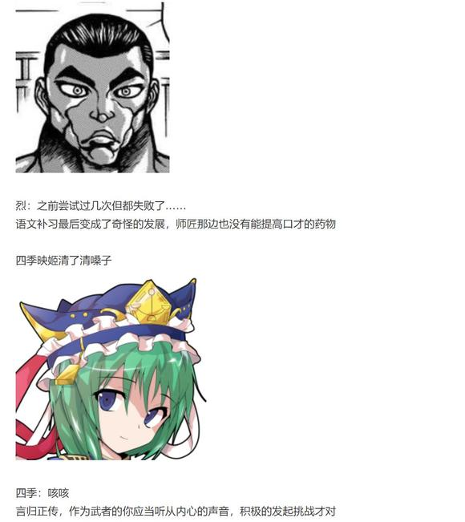
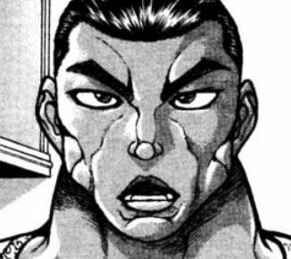
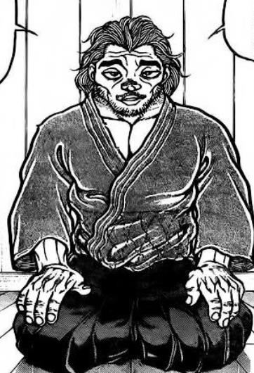
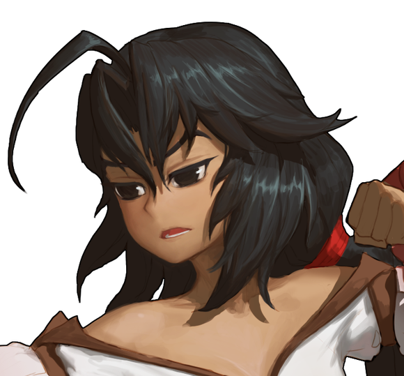
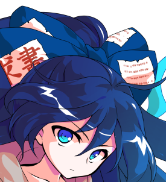
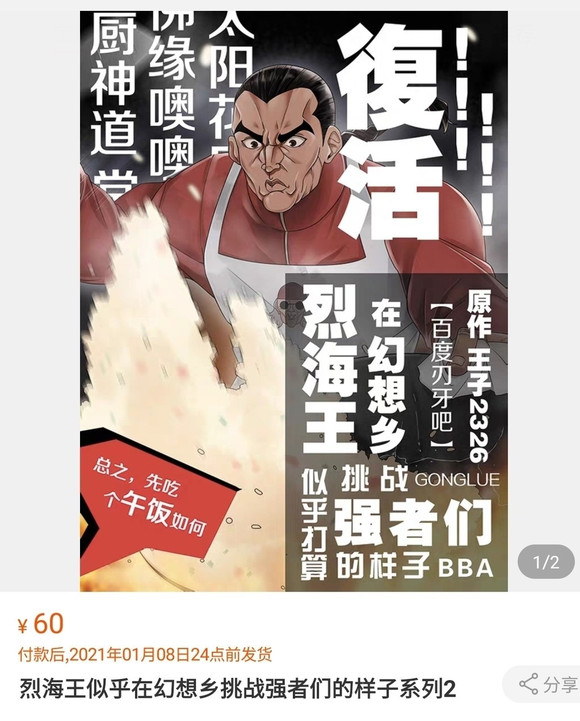

烈：——真是抱歉，四季小姐

这是我作为武者的天性，并未有意冒犯

四季：不，你把重点搞错了

你的罪过并不是想要战斗，而是压抑自己作为武人的心

要是你就这样死掉的话，毫无疑问是会堕入地狱的

烈的口才【1d100：20】

面对阎魔突如其来的指责，烈海王他——

由于想要说的话太多了，一如既往的挥起了车轮拳！

烈：哦哦哦噢噢噢哦哦！

四季的震惊【1d100：55】

四季：哎哎哎？

刚刚是让你认真听我说教的意思，并不是说要现在开战啊

那个……总之先冷静下来好好说话可以吗？

四季：你那边的判官在面对武者时，便会采用这一套标准评判吧

但即使如此，你也无法为自身的罪孽所辩解

既然已经将我视作想要战斗的强敌——

那么你就应当直接询问我是否接受挑战

而在我做出回应之后，你的行为才能够体现你的武道

烈：——这着实是我失礼了

我一味想着应当敬重周围的人们

却总是忘记，这里是决斗如同日常一般的幻想乡

对强者做出挑战就像在外界面对同类时一样，是如同呼吸一般自然的事情

您说的没错，武人的本分是不应丢失的！

烈的战意【1d70:63+30=93】（50以上发出决斗请求）

烈：乐园的最高裁判长四季映姬·夜摩仙那度

请问您是否愿意接受我的挑战？

四季的回应是【1d10:7】

1 下次再说（下一次日常回/交流回开战）

2 我不打架

3 当场开战（现在已经很晚了哎）

4 下次再说（下一次日常回/交流回开战）

5 我不打架

6 需要达成四季的委托（为啥啦）

7 下次再说（下一次日常回/交流回开战）

8 我不打架

9 你现在还太弱了（已经够强了吧）

10 大成功/大失败【1d2：1】

四季：本应如此

取得心与力的平衡，修得真实的自我，这就是现在的你要积累的善行

如今天色已晚，我的休假也已经结束了

等到下一次休假的时候，我就来看看你是否有理解我的教诲

烈：真是感谢您的教导

那时我定将全力以赴！

四季映姬将木板指向了面前的武者

而烈海王则对着面前的判官抱拳致意

两人在通往地上的道路中立下了决斗的约定

这一次的战斗中不含任何私心——只是阎魔大人的例行说教，与武者的日常挑战而已

因此，他们的脸上并没有什么复杂的表情

只是和今天的大多数时候一样，带着淡淡的笑意

~永远亭~

又到了今天的烈海王故事会时间

烈的说明【1d100：34】

烈：——于是，我与四季小姐定下了决斗的约定

辉夜：于是个鬼哦？！

你以为这是漫画吗，一个破折号就可以搞定所有的前情提要？

烈：四季小姐之前建议我说口才不好就少说点……

师匠：省略的部分太多了照样什么都听不懂啊！

给我从头到尾好好说一遍！

【1d20:8】分钟后

烈：——于是，我与四季小姐定下了决斗的约定

因幡帝：那个一丝不苟的阎魔大人……

上次跟她打完之后，我在床上躺了好几天呢

皮克：嗷嗷嗷嗷嗷哦啊啊

（看到她的第一眼我就能明白，她超强的）

铃仙：对于现在的烈先生来说还太早了吧？

师匠：如果像上次对战大妖怪时一样运气很好的话，说不定也能赢？

因幡帝：哪可能次次都那么好运气......

我记得之前异变的时候，她跟那个风见幽香都打到不分胜负吧？

烈海王现在过去战斗怕不是会被揍得超级惨

烈：对我来说，没什么所谓！

无论是赢是输，这都是我应当去做的事情

哪有打不过就不打架的道理？

辉夜：对于一般人来说你的话语完全反了！

谁会去打没有胜算的战斗啊？！

永远亭的众人依然一如既往

日后的战斗，究竟是谁胜谁负？

谁知道呢，就连月之头脑也无法预测未来的发展吧？

（本日的更新结束，下一次的更新大概在周五）

（以下是我的废话）

那么本次的原创活动结束了

原本是搞笑活动结果写成了温馨日常回的感觉，为什么会变成这个样子？

果然四季大人还是太严肃了一点（笑）

话说中间遇到纯狐那里我都有点傻了啊

这玩意一个大失败出来纯狐开战那岂不是又要再骰一次纯狐战，求求你们饶了我吧

还好四季大成功了，谢谢你四季大人

觉大人这一回也是超级认真的

和隔壁的月之头脑形成了鲜明的对比（笑）

那么本次的更新到此结束了，骰子一会再发

按照规律应该是周三更新的，但是我周三和周四都有考试（悲）

于是只能等到周五再说了

话说又到了安价楼的时候，但是今天时间太晚了

于是明天早上的时候我再发安价楼吧，八点半左右

附上本次的骰子

贴子恢复了，感谢大家的努力

考虑到楼层太高很容易爆破，之后的更新我会用小号来开一个第二季的贴子继续

今晚7点的时候我会在本贴发一个安价层，之后等到星期五的时候在第二季贴子更新安价回

此外，由于已经被爆了两次了，还请大家别在贴子里发 色 图 或者 敏 感 话题了，谢谢吧友们了！

之前提到过的热心吧友余烬单开了一个贴子抽奖

https://ti eba.bai du.co m/p/684305 4238

大家感兴趣的话就去参与一下吧！

安价楼

烈海王将在【什么地方】与【什么新人物】相遇？

请在此楼回复

再次重申一次，范围仅限于【东方stg正作】与【东方格斗作】中登场的人物，且只能提出一位新人物

1 在【灵长园】遇到了【冈崎梦美】

2 在【香霖堂】遇到了【比那名居天子】

3 在【香霖堂】遇到了【上白泽慧音】

4 在【寺子屋】遇到了【本居小铃】

5 在【雾雨魔法店】遇到了【森近霖之助】

6 在【无缘冢】遇到了【森近霖之助】

7 在【人间之里】遇到了【比那名居天子】

8 在【废弃洋馆】遇到了【上白泽慧音】

9 在【寺子屋】遇到了【上白泽慧音】

10 在【辉针城】遇到了【比那名居天子】

烈海王将在【香霖堂】遇到【比那名居天子】

和前几次混乱的选项相比，这一次大家都把目标集中在了几个人的身上

嗯，不知道为什么有个超级可怕的家伙偷偷混进去了，而且还是在第一个

前十个选项中还有一位吧友填了辉夜，但咱们这是新人物安价回啊（笑）所以就没有算进去

不过，现在看来新人物快要不够用了

因此下一次的安价回我打算换一种方式，只要是【东方STG正作】以及【东方格斗作】中出场过的角色都可以进选项

换句话说，下一次吧友们就可以直接填自己喜欢的角色了，哪怕出场过也没有关系（因为还没出场的角色着实不多了）

那么今天就到这里，周五的时候大家就可以看到天子的安价回了——

话说烈现在根本打不过这家伙吧？不做点保险真的没问题吗？而且还是在香霖堂？

~本部老师的车万小讲堂~

又到了本部老师出场的时间

这个番外篇上一次出现好像是绀珠传之前？其实也没过多久嘛（笑）

那么，今天就来介绍一下在本贴中多次出场的无意识妖怪 古明地恋吧

紧闭的恋之瞳古明地恋

BGM：哈德曼的妖怪少女

种族：觉妖怪所属势力：地灵殿

初登场于东方地灵殿 是本作的EX面boss

古明地恋是居住于旧地狱里地灵殿中的，种族为“觉”的妖怪，她的姐姐就是大家熟悉的古明地觉

与她天真烂漫的外表不同，古明地恋的内心世界极其的复杂而多变

有的时候，她会表现出单纯而幼稚的一面：她会和秦心认真争论希望之面是属于谁的，也会在说话的时候像小孩子一样“哇——咿”的大叫，就像本贴大多数登场的时候一样

而有的时候，她也会表现出令人毛骨悚然的一面：她会对着刚见面的人说“我要把你的尸体挂在地灵殿的门口做装饰”，又或者“我就送给你死在路边的未来吧”这样黑暗风格的话，就像她追杀堇子的时候一样

在某种程度上，我们也可以认为古明地恋的心中其实是空空如也的，而具体如何，只有她自己清楚了

能力：

古明地恋拥有操纵无意识程度的能力，但这并不是她天生就拥有的力量

觉妖怪是拥有读心能力的妖怪，这份能力在为她们带来便利的同时，也导致她们会被身边的人物所厌恶

在得知这一点之后，古明地恋闭上了她的第三只眼，从此便不再聆听他人的心声了

然而，读心的能力也反映着自身内心的强度

只因为被他人厌恶便闭上眼睛，便代表着不接受他人的心里而将其完全屏蔽

这不过只是单纯的逃避，其结果等同于封闭自身的心灵（这也是本贴中四季映姬对其说教的原因）

她因此而失去了读心的能力，但却得到了操纵无意识程度的能力

首先 恋恋可以在无意识的状态下行动。此时她自己也不知道接下来会做什么，处于一种顺从现场气氛做事的状态，无心无欲

在无意识的状态下，恋恋的存在感十分稀薄，别人往往难以注意到她，且认为她是突然出现的，但实际上恋恋已经接近他们很久了

在无意识的状态下，就连她的姐姐古明地觉也无法读取她的内心

同时，恋恋那操纵无意识的力量也可以作用于他人，她可以强行唤醒其他人在潜意识中思考的事情，或是唤醒其他人内心深处连记忆都称不上的某种印象等等，而在本贴中的表现则是帮助烈与魔理沙跟踪堇子

冷知识

战斗开始了吗？：恋恋会无意识的准备好攻击并放出弹幕，此时连她本人都没有意识到自己正在战斗

大彻大悟还是啥也没想：白莲认为恋恋已经接近了觉悟的“空”之境界，但一轮则认为“无心”与“什么都没想”不是一回事

我无意识：现在的恋恋不再招人讨厌，但同时也不会被恐惧，也不会被人喜欢了，而她一旦离开视野，眨眼之间又会被人遗忘

我有意识：但并不是所有人都会被恋恋所影响，比如铃仙就可以借助自身的能力感知到恋恋无意识的举动，同时一部分小孩子也能看见她

佛缘深厚：由于命莲寺众曾被埋入地底，恋恋在过去就已经认识一轮与船长等人了

心理学大师：恋恋的许多符卡名都与著名的心理学研究者以及其学说有关。她是从哪得知这些知识的？谁知道呢

感谢大家的努力，本贴再度复活了

由于现在的楼层实在太高了，再加上之后我会用小号开第二季的贴子

因此我将本贴设置为仅我关注的人可以回复了

换句话说，现在大家都没法回复贴子了，本贴正式进入了博物馆

这也是为了贴子的存活着想，恳请大家理解（悲）

当然，之后的第二季贴子和之前一样，是大家都可以正常回复的，因此不必担心

这两天我会整理贴子内不适当的内容，避免这种情况再次发生

那么，烈海王似乎打算在幻想乡挑战强者们的样子 第一季 堂堂完结

第二季将在本周五用二代目的号继续连载，在此感谢吧友们一直以来的支持

上课时摸鱼的王子2326 写于7月28日

今天中午的时候，我在古道吧友的帮助下与官方人员取得了联系，之后如果再次被炸，想要恢复就方便许多了

之后的更新我仍打算在新贴进行，但本贴的回复墙我就先关闭来看看情况，换句话说大家可以正常回复了

呕呕呕，总算是考完试了

明天早上九点更新第二季

到时候我会在贴子里放链接的，请大家放心

由于现在贴子想恢复简单很多了，因此决定还是用这个号继续更新第二季

链接如下，9点开始更新

https://tieba.bai du.co m/p/68513 77332

第二季贴子炸了，目前正在申请恢复中，还请大家不要着急

贴子又被炸了，大家慢慢等待吧

（补一下鵺战的5T 6T）

T5

鵺：符卡宣言 鵺符【UndefinedDarkness】

于无尽的未知黑暗中永远沉迷吧！

纯粹武道发动

烈的破解【1d100：73】成功

烈：怀抱武术，心存执着——

烈海王仅在此刻达到了纯狐的境界

无需考虑所谓的意义，只需干掉眼前的敌人！

封兽鵺所化的黑暗，在这无色的意志引导下被武者击破了！

鵺的变化【1d100:52】无变化

烈的攻击【230+70+1d100：53=353】

鵺的攻击【270+1d100：45=315】

烈：既然您一直在用象形拳，那么我也以象形拳回报

这是我所想象出的，目前战斗过最强的对象——

烈海王的身后出现了一位女子的虚影

鵺：这啥？感觉好恐怖……

T6

鵺：我不用变化了——直接用妖力碾碎你！

符卡宣言 鵺符【弹幕奇美拉】

符卡宣言 真相不明【恐怖的虹色UFO袭来】！

烈的破解 奇美拉【1d100：76】成功

UFO【1d100：49】失败

烈：要正面对拼力量吗

那就来吧！超人术！

超人烈海王发动

鵺：什么？圣的超人术——

你就是那个把一轮打了两遍的家伙！

难怪她会那么生气，我完全理解了

应该过会就好了！大家稍等片刻啊！洗个澡之类的！

第二季贴子已经恢复啦！

~防剧透提醒~

由于第二季陷入了无限循环，因此我将余下的内容搬到了原本的这个贴子继续更新

补到这里的朋友们请确定自己已经看完了第二季的贴子再继续

【自本层以后的内容是接在第二季贴子的最新进度之后的】，并不是接在第一季的最后一次更新之后的，请大家注意哦

Q：换句话说？

A：本贴24727层——第二季贴子全篇（到51906层为止）——本层，请按照此顺序阅读

那么友情提示结束

~女子力话题~

【1d2：1】

1 普通的紫苑

2 七天反转时的紫苑

~三途河畔~

“欧拉！”

“喝啊！”

入道使与虫妖怪正在河畔进行着格斗练习

参考着两人交手的贫穷神小姐则在画本上飞速打着草稿

紫苑：完成啦

多谢两位，这样一来《牙刷人》的动作设计就差不多了

莉格露：不用客气，紫苑小姐

话说你为什么不找烈大哥啊？

紫苑：这次我打算让女孩子当主人公

直接照搬男性的格斗动作会显得很不协调

所以就来拜托擅长格斗技的你们了

蓝发的僧侣擦着脸上的汗走了过来

一轮：原来如此——

喂莉格露同学？没事吧，为什么突然露出了这么沮丧的表情？

小小的虫妖怪黑着脸坐在了河岸边

莉格露：只是突然想起了过去的经历而已

我呢，之前去外界的时候和烈大哥的朋友交手了两次

第一次是位中年空手道大叔，第二次是块头很大的黑道……

紫苑：是被欺负了吗？

莉格露：他们两个直到战斗结束后才发现我是女孩子

一轮&amp;紫苑：……

虫妖怪无视了正绞尽脑汁想着安慰话语的两人，以一种相当残念的语气说到

莉格露：呐，你们说

为什么换了身女仆装大家就会觉得“好可爱”但是穿吊带裤就会被认成男的啊？

女子力，到底是什么啊？

入道使困扰地摸了摸下巴

一轮：要我说的话，是那种“照顾人”的感觉吧？

就像圣大人一样，会有耐心地聆听你的烦恼并给出自己真诚的意见，一言一行都显得稳重而又大方，虽然身在佛门却也并不迂腐，而是会设身处地的为对方着想……

我觉得圣大人就是我理想中的女性形象了

紫苑：温柔体贴，落落大方的女性的确很有吸引力呢

莉格露，你觉得女子力高是什么样的表现啊？

莉格露理想中的女性【1d6:6】

1 师匠

2 幽香

3 红海皇

4 影狼

5 经常见到的小町

6 灵梦

莉格露：果然还是像博丽的巫女那样比较好吧

平时轻飘飘的，不知道在想些什么

偶尔也会表现出贪财懒惰的一面，并不是毫无缺点

但是，她在战斗的时候，飞行的时候，使用符卡的时候……

那飘飘然的，随心所欲的身姿，会让我感到一种不可思议的浪漫感

果然“少女”就是这种感觉吧

一轮：还有那身从各个方面看来都很厉害的巫女服

她就算在冬天都坚持要露出来那块哎，真的不冷吗？

莉格露：反正我是绝对不会穿那种衣服的

灵梦小姐她真的天天都穿这套出门，从这个角度上我也很佩服她……

紫苑：真要说的话我觉得白莲小姐的骑手服也挺大胆的

一轮：那是时尚啦，时尚

话说你穿这身也好意思评论别人哦

破衣服贴催债单也真的太惨了吧紫苑小姐！

紫苑：呜呜呜，我又不是自己想才穿成这样的……我是贫穷神嘛……

啊，是不是到我了？

我觉得赫卡提亚大人或者勇仪老大那种的才是女子力比较高的类型

莉格露：怪力乱神的鬼王吗？！为什么啊？！

虽然她拿了冠军但那比赛本身就很扯淡啊，连皮克都有希望拿冠军哦！

命莲寺的僧侣颤抖着指向了贫穷神

一轮：我本来以为你应该不会残念到这个地步的

紫苑小姐，你，该不会——

是想说身材吗？！

紫苑：额，虽然我是觉得身材很重要.......

说实话身材真的很重要......

糟了我越说越羡慕了怎么办啊

莉格露：别想这些无关的事情说重点啦！

紫苑：对对，我想说的其实不是这个

我觉得最关键的应该是“自信”吧

莉格露：自信？

紫苑：对，或者说是“强者的余裕”比较好？

无论何时都面怀微笑，从不在意他人的看法，就这样沿着自己的道路前行，按照自己的想法去做

我觉得这样自信的身姿，才是最吸引人的

嘛，因为我怎么都做不到这样呢……

莉格露：原来如此

这么说，女子力最重要的点在于“温柔”、“浪漫”与“自信”啊！

——完蛋了，我觉得自己一条边都不沾

一轮：啊哈哈

这么一想我自己也不是女子力很高的类型啊……

紫苑：我更惨呢……别说女子力连基本的人间力都要消失了

没关系的，莉格露……

在这方面，我和一轮小姐都是你的同伴哦……

突然变得一脸消沉的三人组，在残念的空气之中齐齐抱腿坐在了河岸边

莉格露：我以后，要不要天天穿那套女仆装出门啊……

这样至少不会被误认成男孩子了……

一轮：我可受不了这种衣服……

加把劲，莉格露同学

努力提升自己的内在，总有一天的话一定——

紫苑：啊，仔细想想果然还是身材最重要

莉格露&amp;一轮：我就知道你还是这么想的！！！紫苑小姐你这残念贫穷神！！！

（小梗结束）

