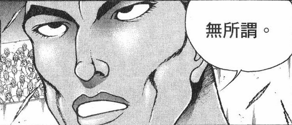
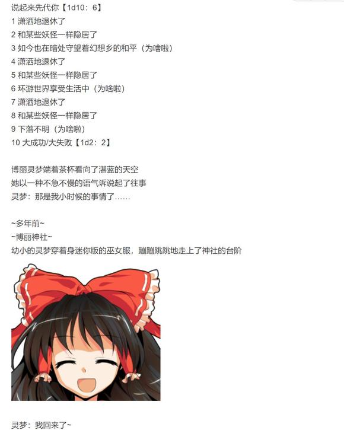
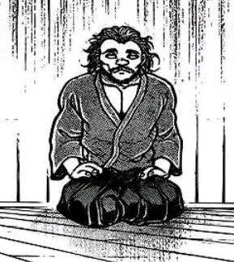
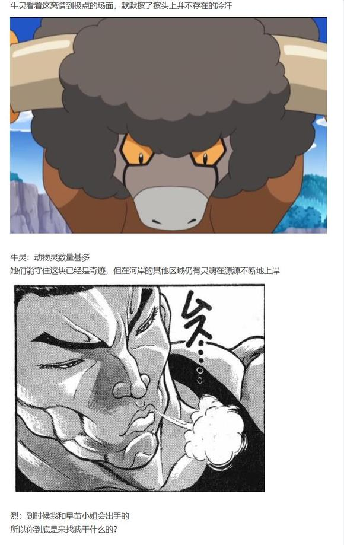

最后一个小梗，去除了已经中过的选项和一个很糟糕的选项顺便把一个被吞掉的选项加了进来

1 【魔理沙】【阿空】【符卡】

2 【烈】【一轮】【拳愿比赛】

3 【铃仙】【妖梦】【女子力】

4 【魔理沙】【烈海王】【私奔的准备】

5 【八云紫】【摩多罗】【灵梦和烈的教育】

6 【烈】【莉格露】【多利安的故事】

7 【烈海王】【十六夜咲夜】【奇妙冒险】

8 【摩多罗隐岐奈】【烈海王】【烈的生日】

9 【烈】【铃仙】【提升女子力的方法】

10 【皮可】【阿求】【结婚典礼】

11 【烈海王】【博丽灵梦】【博丽巫女的结局】

12 【琪露诺】【鵺】【关于对烈使用娘化药水的报复行动】

13 【烈】【八意永琳】【嫦娥与羿与纯狐】

14 【灵梦】【露米娅】【先代巫女】

15 【稀神探女】【烈海王】【女儿】

16 【烈】【魔理沙】【下地狱】

17 【风见幽香】【八意永琳】【“偷腥的金发小猫’】

18 【一轮】【圣白莲】【佛法】

19 【魔理沙】【一轮】【烈海王】

20 【蓬莱山辉夜】【十六夜咲夜】【《JOJO的奇妙冒险》】

21 【鬼人正邪】【少名针妙丸】【恋爱】

22 【正邪】【阿求】【力量平衡】

23 【烈海王】【灵梦】【无所谓】

24 【烈】【魔理沙】【私奔】

25 【摩多罗】【秦心】【烈海王】

26 【烈】【云居一轮】【白林寺】

【1d26:11】

~博丽巫女的结局~

~博丽神社~

灵梦：又到春天了~

这次的宴会，该找谁好呢

排除魔理沙之后，按顺序是我、咲夜、妖梦……

是不是该你了？

烈：料理的准备？

我倒是无所谓

灵梦：那就拜托你了

真好啊，又是一个平安无事的春天~

博丽的巫女悠哉地给自己倒了杯茶

武术家看着她那悠然自在的身姿，突然想到了一个奇怪的问题

烈：说起来

我之前参加宴会的时候就发现了，你的厨艺水平似乎也不错啊

至少比只会做魔女锅的魔理沙要强多了

明明你也是一个人生活的……难道是八云女士教的？

灵梦：怎么可能啊！

紫那家伙懒到把绝大多数事情都交给式神了，她哪会做料理？

我基本上是自学的，也从霖之助先生那里学到了一些技巧，剩下的——

嘛，就是上一任巫女偶尔做过的料理了

“上一任巫女”

听到这个词语的时候，武术家才反应过来

一直以来都居住在神社的灵梦，仿佛理所应当就存在于此的少女，其实并不是幻想乡的第一任巫女

烈：不好意思愣了一下

一提到博丽的巫女第一时间想到的总是你，却没意识到还有先代巫女的存在

灵梦：那是当然的吧

博丽神社可是在幻想乡与外界隔绝之前就已经存在了

我一个青春靓丽的少女，怎么可能从那么久之前就担任巫女啊

烈：（我怎么从来没听说过这位的消息……）

这位先代巫女是退休了？

灵梦：我也一样没想过这个问题

等到我需要思考这件事的时候……

那时的幻想乡，会和现在一样吗？

烈：虽说幻想乡的变化很缓慢，但也总是有变化的

结界内部的我们同样会受到外界的影响

那时的幻想乡，会出现更多的新面孔吧

灵梦：就是这样啦

到时候的事情就等到到时候再说

说不定我那时感到厌倦了，就学着先代一样培养下一代巫女

说不定我那时依然有着和现在一样的心，那就继续做幻想乡的巫女

烈：难以想象啊，那时候的灵梦会变成什么样子

灵梦：我以前听过一个说法

“幻想乡的时间流动的很慢”

如这个说法是真的话

那会是，很久很久以后的事情了吧？

那时的你又会变成什么样呢

满脸大胡子一头白发？不，说不定会秃头？

烈：我肯定不会变成刘海王那样的好吧！

应该和现在差不多吧，除了脸可能显得更老点

灵梦：那我到时候可能会变成和先代一样的成熟女性——

不，还是算了，我可不想变成那种随心所欲的家伙

烈：（我觉得你在随心所欲这方面可不会逊色于任何人……）

无风的春日中，巫女与武术家在神社慢悠悠地喝着茶

一如既往

今日的幻想乡也十分平和

~外界~

~某个小镇~

~酒吧~

迪奥：教育子女，真是件困难的事情

我的儿子和女儿都在与我无关的地方取得了自己的成就，身为父亲真是心情复杂

独步：一定要手把手帮助他们吗？

子女们靠自己取得了成就，身为长辈的我们应当感到高兴啊

先代：没错

到一定时候了就要选择放手，之后让他们走自己的路才对！

迪奥：说的也是，这样一想感觉好多了

——话说你们是谁啊？

独步：一时兴起就来搭话了

我是来旅游的空手道家

先代：真巧啊，我也是来旅游的，职业是巫女哦！

（小梗结束）

于是我总算是到上海了

明天会去参加第二天的cp27，如果有吧友去的话欢迎来th20摊位找我聊天哦(

(不过我只买到了十一点入场的票，希望明天队不会很长。。希望吧)

在摊位坐了半天，感觉气氛蛮不错的(

从cp撤退咯，今天和蛮多朋友聊了天，感觉很开心!

接下来4号要考最后一科，于是下一次更新在5号或6号，内容是异变回

大概明晚七点半左右更新

这次是异变回，一次肯定是更不完的

所以大家不用着急啊(

本次更新的内容是我先前用碎片时间一点点骰的，因此篇幅大概只有平时的2/3左右

那么开始更新

~这件事发生在烈海王来到幻想乡的第【815+1d30:18=833】天~

~畜 生 界~

鬼杰组的组长坐在长桌的一头，静静地凝视着另外几位沉默不语的动物灵们

吉吊：真不可思议

放在半年之前，三个月之前，甚至一个月之前，我都绝不会想到——

你们居然愿意面对面地听我讲话

不，在此之前

我们几个能够这样和谐地坐在一起，本来就已经足够荒谬了

真棒，简直就像朋友一样，我们是不是该为彼此之间的友谊干一杯啊？

早鬼：别在这讲废话浪费时间

有什么主意就赶紧拿出来，不然在座的各位全要完蛋

吉吊：在此之前

你那位骁勇善战的外援现在情况如何？

现在是一周之中的第【1d7：7】天（见第633日剧情，皮克周六去打工）

早鬼：要不是他昨天过来打了一天，现在开会就不是在这栋楼了

可惜人家脑子精明的很，打工可以，卖命不干！

击退最后一波攻势之后就按点下班咯

鬼杰组的组长用手指轻轻敲着桌面

吉吊：（就像骊驹组长说的，原始人头脑简单，却也不会轻易替人卖命）

（直接利用希望不大，依靠私人关系拜托也许还有可能，但这就没有隐藏情报的余地了）

（早已做好的原计划成功率最高，此外还有——）

她想起了办公室抽屉里的某个通讯器

吉吊：（一个人情，吗）

吉吊的信任

皮克【1d100：18】

烈【1d100：11】

（74以下履行原计划，其中一个达到75以上时改变计划）

吉吊八千慧摇了摇头

对于畜 生 界有着一定了解的他们两人，不会像无知的人类一般全盘按照自己的计划行事

身处在这弱肉强食世界的她，也不会将任何一丝希望寄托在虚无缥缈的所谓“信任”之上

她维持着那标志性的和善笑容，向着其他几人缓缓开口

吉吊：那么，就请各位按我所说的去做吧……

幻想乡的春天已经结束，炽热的夏季终于要开始了

平和的日子持续了很久，所有人都沉浸在了这份安宁无事的日常之中

而幻想乡的人们却并不知晓

在地狱的某个偏僻的角落

有一群非人的灵魂，暗中向他们露出了獠牙

于是，在这个夏季之初的某日——

有关于动物灵的异变，开始了

~动物灵异变开始了~

博丽的巫女将在【1d5：1】天后解决异变

自机介绍

无所谓的武术家 烈海王

种族：人类/魔法使

大家熟悉的武术家，永远亭的武术家

幻想乡中出现了大量的动物灵

常在三途河边活动的他很清楚，这是从河对岸前来的灵魂

正在此时，地狱的来客出现在了他的面前……

烈遇到的动物灵是【1d10：2】（注：本贴中野狼/水獭/大鹫灵的实力强于牛/鸡/龟灵）

1 野狼灵

2 牛灵

3 是戎璎花哦（为啥啦）

4 水獭灵

5 鸡灵

6 没有灵（为啥啦）

7 大鹫灵

8 龟灵

9 吉吊：“我亲自上阵”（为啥啦）

10 大成功/大失败【1d2：2】

~赛之河原~

烈：……

牛灵（友情出演 爆炸头水牛）：……

武术家与样貌奇怪的灵魂正在河岸边大眼瞪小眼地对视着

先开口的是【1d2：2】

1 烈

2 牛灵

看上去很是憨厚的灵魂首先开口了

牛灵：让我凭依上去，就能得到很强的力量

烈：哦

可惜，我烈海王并不需要这样平白得来的能力

在此之前，先说说你的来意——

与这帮动物灵到底是怎么回事，如何？

第一批动物灵的进攻【1d100：70】

小妖怪们的防守【1d100：91】

牛灵扭头看向了三途河的方向

这里原本，应该只有早夭的孩子们的灵做着垒石头的工作

因此，来自地狱的动物灵们正轻易地一个接一个踏上幻想乡的土地——

原本应该是这样的

但是，为什么呢？

为什么水子之灵们学会扔飞刀了？

为什么这地方居然建起了一座相当豪华的竞技场？

为什么会有一群看上去比黑帮们还要暴力的家伙在一帮闲人的欢呼中对着动物灵大打出手啊？

早苗：守矢竞技场今日紧急举办特别节目！

妖怪武术家大战地狱入侵者！

来自三途河岸另一侧的灵魂们能否突破参赛者们的防线？！少数的精锐们能够靠自己的技术取得胜利吗？最终获胜的究竟是数目的暴力，还是绝对的武艺？

目前暂居第一的是猫猫拳橙海王，让我们拭目以待最后的结果吧！

橙：喵呜~

小虫你好菜哦，打杂鱼都这么慢

莉格露：这哪里是杂鱼啊？！

一个个都眼露凶光跟要杀人一样，这样的杂鱼只有你才能面不改色地上去打哎！

啊琪露诺被打飞了！

琪露诺：你们这帮人居然敢小看老娘！

接招 完美冻结！！！

三位骁勇善战的猛士正在观众与同学们的欢呼声中大展身手

畜 生 界的先锋部队居然被战斗意识更胜于地狱居民的妖怪们硬生生拦在了河边......

~畜 生 界~

吉吊：（时间差不多了，该动身前去迎接计划中的人类了）

（按照我收集的情报来看，大概率是巫女或者魔法使吧）

“叮铃铃♪”

就在这时，某个她所送出的通讯器响了起来

吉吊要接通讯吗【1d2：1】

1 接

2 不接

吉吊：（这个点过来闲聊你难道不用上班吗……）

您好，烈海王

不好意思，我目前还在工作——

烈的说明【1d100：92】（50以上理解）

身处畜 生 界的吉吊八千慧目瞪口呆地听着对方那条理有序的说明

烈：——差不多就是这么个情况

这位牛灵是你们那边的叛徒？

所谓邪恶的动物灵指的又是谁啊？

畜 生 界的动物灵们基本上不都混黑道吗，还有比这更加糟糕的势力吗？

鬼杰组组长静静思考着自己应当做出的应对

吉吊：（在这里说出实情的话无异于引火烧身）

（计划开始后，就没有直接放弃的道理）

（既然你已经主动闯了进来……那就索性成为战力的一部分吧）

吉吊的口才【1d60：40+40=80】（鬼杰组组长+40，50以上成功，75以上彻底打消怀疑）

吉吊：就像您所说的那样

那个家伙的性质可比我们区区黑帮要恶劣多了

您应当看到了那些越过三途川的动物灵了吧？

那就是被邪恶的灵魂逼到无路可逃的，我等的末路啊

烈：居然还有这种事情？

吉吊：我是不认同这种激进而缺乏思考的办法的

贸然前往地上只会为我们树立更多的敌人，而一旦失败就再无退路

我一人之力不过杯水车薪，身为灵魂的我们却又拿“祂”毫无办法

因此，我才会特意派出手下寻求人类的帮助

他们当然是叛徒——在这盲从而无知的数量暴力之下，能够发出理智声音的寥寥几位，在它们眼中不正是背叛者吗？

烈：的确是相当严重的问题，搞不好会引起大骚动的！

这可不能放着不管……

时间紧张，我现在就出发

谢谢你的情报！

吉吊：很高兴看到您能理解我的选择

那就拜托您了——

侦探先生

吉吊八千慧笑着关闭了通讯

~赛之河原~

牛灵：哞，那我能凭依上去了吗？

我比较内向，说话有些老气，可能会对你的性格造成一些影响

我不是很擅长正面冲突，能够提供的辅助是体力回复……

烈：我无所谓！

~牛灵凭依上了烈海王~

牛灵凭依：牛灵并非是最为精锐的动物灵，无法提供Atk加成

凭依后每回合Hp+1，性格变得有些落后于时代

不知是好事还是坏事，战斗时无意识的阴阳怪气同样变少了

早苗：凭依上去了吗

被动物灵凭依的感觉如何？

烈：无甚变化

早苗：嗯？

武术家赶紧摆了摆手

烈：没什么变化

这说话的口气好像不经意间就受了点影响，我得适应一下

我先出发去地狱了

徒儿们就托你照看一二了，早苗小姐

早苗：噗，徒儿们？

我看你明显就不怎么适应嘛

一路顺风哦，这边的防守我会帮把手的~

烈海王前往地狱了

有人同行吗【1d100：85】（70以上有）

哦呼，终于有了

具体来说是【1d10:7】

1 解决异变的灵梦

2 早苗

3 出来见世面的莉格露（为啥啦）

4 解决异变的魔理沙

5 过来参观的正邪

6 碰巧路过的皮克（为啥啦）

7 解决异变的妖梦

8 过来参观的铃仙

9 吉吊：果然我还是不放心（为啥啦）

10 大成功/大失败【1d2：1】

妖梦的凭依动物灵是【1d3：2】

1 野狼灵

2 水獭灵

3 大鹫灵

“动物灵们正在一个接着一个地渡过三途河——

等会，和报告中说的好像不太一样？”

急匆匆赶来的双刀剑士，望着眼前与动物灵大战的小妖怪们陷入了短暂的迷惑

烈：这不是妖梦小姐吗

你也是来调查异变的？

妖梦：哦哦，是烈海王啊

幽幽子大人收到了动物灵入侵的报告，就把我派来查看情况了

实际看来状况似乎还行？

不好意思，看样子我搞错了……

烈：时间紧张，你我先下地狱，边走边说

小心些，莫要碰触孩子们所垒的这些圆石

武术家与剑士一同出发了

早苗：突然变得很弱气的妖梦小姐与莫名其妙说话变古风的烈海王？

这都什么情况啊？

路上有事发生吗？【1d100：72】（30以下坏事，70以上好事）

今日烈海王的运气似乎相当不错

具体来说是【1d10：5】

1 小町：我载你们一程吧

2 遇到了友善的牛鬼

3 再次与队友汇合（为啥啦）

4 小町：我载你们一程吧

5 遇到了友善的牛鬼

6 遇到了来接应的二羽渡（为啥啦）

7 小町：我载你们一程吧

8 遇到了友善的牛鬼

9 皮克的通讯（为啥啦）

10 大成功/大失败【1d2：1】

【1d30：9】分钟后

~三途河~

BGM：Lost River

平静的河流之上弥漫着淡淡的雾气

碧蓝的平面之下，隐约可看到些巨大的黑影

那似乎是河中所栖息的古代鱼——在外界已经灭绝的超大型鱼类

武者与剑士以极快的速度飞行在这条分隔此岸和彼岸的河流上空

“还以为是走失的亡灵，这不是还活着吗？”

而在他们开始行动的不久之后，栖息于此区域的妖怪出现在了两人的面前

她的头上长着一对红色的牛角与一对牛耳，头发为左右对称的半黑半灰

她身穿黄色的白边背心与短裤，披着件有着奶牛花斑图案的外套，怀中捧着一个裹在红色襁褓里的婴儿石像

三途河上的牛鬼摇晃着身后红色的尾巴，看向了身前的两位现世来客

妖梦：你……莫非是牛鬼？

来得正好，我是来自冥府的使者魂魄妖梦

不过我有点迷路了，彼岸的方位在哪来着？

？？？：你是假的吧！冥府的使者怎么可能在三途河上迷路啊

话说这位是？

我在你身上感受到了很亲切的气息呢

牛鬼妖怪好奇地靠近了武术家

烈：我为武人烈海王，自幻想乡前来，欲往彼岸一探究竟

你所感受到的气息应当来源于我身上的这位牛灵

牛灵：你好，牛鬼小姐

你的角保养的真好啊！

牛崎润美的好感度【1d100：84】（友好接触保底30，牛灵+10，总计40）

润美：多谢称赞，你角上的纹路也很精致哦~

我是三途河的牛鬼 牛崎润美

仔细一看，你们两位的实力都相当强啊

明明是活人却要前往彼岸？

烈：说的确切些，是要前去地狱

润美：那还真是……

现在的地狱比起过去可要混乱的多，几乎变为许久之前那全无秩序的状态了

如果要去那边的话，还是保存些魔力为好

河里有许多灭绝的鱼类，没有死神的护卫乱走可是会遭到它们袭击的

跟着我来吧，我带你们走相对安全些的道路

牛鬼招呼着两人向前飞去

妖梦：万分感谢，真是麻烦你了~

说起来，烈海王你这是被凭依了？

说话方式怎么变了这么多？

烈的察觉【1d70：64+30=94】（50以上察觉凭依，75以上察觉具体对象）（没什么意义的骰子，因为已经相信了吉吊小姐的话）

烈：大抵是这位牛灵的影响吧，说话时的口气有了些许改变

倒是你难得这般客气……应该也是被凭依了

对象就是那位偶尔会替吉吊小姐接电话的獭灵，对吗？

水獭灵：真不愧是您

明明连她自己都还没发现呢

妖梦：我被动物灵凭依了？什么时候？！

润美：无忧无虑而且脑子缺根筋

看来你真是冥府的园丁呢

【1d60：53】分钟后

~彼岸~

三面的进度是【1d10:6】

1 目前还没人来过哦

2 灵梦过去了

3 魔理沙战斗中（为啥啦）

4 目前还没人来过哦

5 灵梦过去了

6 测试员变成了小町（为啥啦）

7 目前还没人来过哦

8 灵梦过去了

9 测试员变成了四季（为啥啦）

10 大成功/大失败【1d2：2】

BGM: 不朽的曼珠沙华

三途河的另一侧，即是与此岸相对的彼岸

这里没有日夜变更，也没有四季变化

包围着这片这片无边无尽花原的，只有一片温暖而柔和的光

在这暖色调的原野上盛开着一丛丛妖艳的彼岸花

死者的灵魂们就在这花丛之中静静地站着

他们无法睡觉，无法进食，无法对话

只能在此静静等待，等待着阎魔裁决的来临

自幻想乡前来的三人，此刻便踏上了彼岸的土地

润美：送到这里就差不多了，我就先回去了

现在的地狱可比以前混乱的多，你们两位好自为之吧

个人建议，还是早些回来比较好哦

妖梦：多谢你了，牛鬼小姐~

牛崎润美离去了

烈：这里看上去倒很是安宁，看来畜 生 界的混乱还未影响到此处

接下来我们——

“稍等片刻

我从四季大人那里得到了吩咐

叫我好好试试你！”

武者与剑士将目光投向了声音传来的方向

红发的死神正悠哉地坐在自家那条破旧的木船上

她吊儿郎当地把镰刀扛在了肩上，并坏笑着向两人勾了勾手指头

妖梦：小町？

你怎么会在这里，看守口岸的二羽渡大人呢？

久侘歌去哪了【1d10：10】（2-5狼灵梦刚来过，6-9狼魔理沙刚来过，1 10随机）

随机是什么啊【1d10:6】

1 灵梦魔理沙的混合双打

2 早鬼提前行动了

3 今天我休息哦（为啥啦）

4 灵梦魔理沙的混合双打

5 早鬼提前行动了

6 被偶像绑架了（你搞啥啊）

7 灵梦魔理沙的混合双打

8 早鬼提前行动了

9 被动物灵绑架了（为啥啦）

10 大成功/大失败【1d2：1】

~数小时前~

久侘歌：该准备开始今天的工作了

畜 生 界那边到底出什么事情了呢——

路人埴轮A（友情出演 绿哈尼）：找到了！

路人埴轮B（友情出演 哈尼）：是鸡神！

？？？：庭渡久侘歌，就是你吧

不好意思，麻烦你跟我们走一趟

上！

久侘歌：哎？

哎哎？？

怎么回事，不是，哎？？救命啊！！！！！！！！！！！

~时间回到现在~

小町：你大概不相信，说实话连我自己收到消息后都吓了一跳

——久侘歌她被一群奇怪的土偶绑架了

烈：土偶？

小町：学名应该是叫做埴轮来着

就是那么一群东西拿着陶制武器呼啦啦涌过来，把可怜的鸡神一绑就跑回地狱去了

很离谱吧？我也觉得很离谱哦，连四季大人听到汇报都愣住了！

她一时之间找不到合适的人手，于是就让我来代班了

妖梦：啊？

我记得二羽渡大人的能力只是治愈喉咙疾病而已啊

土偶们为什么要绑架她？

烈的察觉【1d70：20+30=50】（90以上成功）

烈：（地狱居然还有会活动的土偶？真是大开眼界）

这位久侘歌小姐原本的任务，看样子是实力测试？

三途河的船夫举起了手中那锋锐的镰刀

小町：没错，要试试你们在地狱里能不能受得了

虽说我觉得对你们俩没这必要，不过工作就是工作嘛

来来来，谁想上？

烈的战意【1d60：4+40=44】（50以上应战）

你战意怎么这么低啊【1d10：4】

1 没意思，不想打（小町愤怒了）

2 这里就交给妖梦

3 没有意义的战斗，直接跑了（为啥啦）

4 没意思，不想打（小町愤怒了）

5 这里就交给妖梦

6 想到了鸡神被绑架的原因（为啥啦）

7 没意思，不想打（小町愤怒了）

8 这里就交给妖梦

9 埴轮卷土重来！（为啥啦）

10 大成功/大失败【1d2：1】

烈：我看不出这所谓测试的意义所在

大家对彼此的实力都有了解，现在赶快去解决异变才是正事

被凭依后显得有些畏首畏尾的剑士弱弱地劝说起了身旁的武术家

妖梦：烈海王，你这话说的太激进了

阎魔大人肯定是有她的考虑的……

小町：实力方面姑且不提

你这心性我可是一点都不敢相信

呵，满脑子只想着干架的武术家，跑去**界怕是会被那帮动物灵吃干抹净吧？

烈：小町小姐似乎很不信任我？

小町：上次差点坑害四季大人的愚人，还真有自信在我面前这么说啊？

别搞错了，武术家

这可不光是公务

因为我看你不爽已经很久了！

烈：原来如此

既然是私人挑战，便没有拒绝之理由了

永远亭，烈海王

请指教！

烈要使用【1d2：2】

1 巨阙

2 百辟

【1d2：1】

1 花弹

2 崩拳

【1d2：2】

1 老三样

2 弹幕地狱

战斗！

BGM：彼岸归航　～ Riverside View

烈海王

Atk：279（147）

Hp：23

技能

烈 海 王：超越海皇，仍为海王。AtkX1.9，Hp+1。不会陷入异常状态，不会受到驻足，束缚等判定影响，面对所有技能都可以进行【1d100】的破解判定，55以上成功

完全消力：普通攻击以及近战系、弹幕系技能所造成的的最终伤害/2（仅对Atk260以下的对手起效）自身所收到的普通攻击伤害-1，近战系、弹幕系技能伤害-2（仅对Atk261以上的对手起效）

牛灵凭依：每回合Hp+1

天符【伸手及月】（CT1）：一场战斗中只能使用一次，3T内自身每回合Hp+2，战斗骰变为【3d40】，并暂时获得对特殊攻击的耐性。

异红符【百辟】（CT3）：（弹幕类）以魔力凝结自身血液铸为锋利无比的匕首，在攻击后化为赤色之雾破除邪祟。本回合Hp-1，给予对手【1+1d4】点伤害，3T内可发动一次，无效对手所使用的下一次特殊攻击。本回合进行一次【1d100】的特殊攻击【破邪】判定：出目为1-30时，对手本回合所有需要魔力发动的【技能/必杀技】所造成的伤害减半，出目为31-60时，对手本回合所有需要魔力发动的【技能】自动失败，出目为61-100时，在31-60的效果基础上对对手造成无视防御的2点伤害。（面对具有特殊攻击耐性的对手时，成功标准值变为36-65，66-85，86-100）

Flower star（CT4）：（弹幕系）对对手造成必中的【2+1d6】点伤害。

急救拳：一场战斗中只能使用一次，Hp归0后回复1点Hp

贫穷神的加护：自动发动，一天只能使用一次，令对手的大成功转变为大失败

必杀技

纯粹武道（CT5）：怀抱纯粹的武术，心存无色的执着。3T内Atk+70，对对手造成的伤害+3。3T内可对所有攻击进行【1d100】的破解判定，近战系、技巧系技能30以上成功，其余技能40以上成功，必杀技60以上成功

【无秩序的弹幕地狱】（CT6）以千奇百怪的弹幕建造无尽的混乱地狱。

3T内Atk+700，给予伤害X3/Atk+800，给予伤害X4/Atk+900，给予伤害X5，每回合进行一次【特殊攻击】混乱：进行一次【1d100】的混乱判定，10以上对手本回合无法使用技能，30以上对手本回合无法造成伤害，50以上对手本回合战斗自动失败，70以上对手本场战斗自动失败（面对具有特殊攻击耐性的对手，标准值变更为40/60/85/96，对手拥有回避/破解/防御能力的场合，仅第六回合可以使用）

（注：在消力升级后，对刀剑类敌人的经验活用已经并入完全消力之中）

小野冢小町

Atk：265

Hp：17

技能

三途河畔的摆渡人：不会陷入异常状态，拥有对时停等特殊攻击的耐性，【？？？】时发动必杀技【？？？】

地狱【无间之狭间】（CT1）：（近战系）一场战斗中仅能使用一次，斩击敌人的同时创造出一个能阻止对手横向移动的区域。本回合Atk+30，3T内自身攻击必中

死歌【八重雾中渡】（CT3）：（弹幕系）乘坐渡船前行，并引导一群幽灵形成弹幕攻击，对对手造成必中的【1d7】点伤害

薄命【余命无几许】（CT4）：（近战系）Atk+60，本回合战斗成功时，不进行伤害判定并直接令对方的Hp减半（与必杀技共同发动的场合，不计算此效果）

死神【HiganRetour】（CT5）：（弹幕系）以各色铜钱形成的弹幕进行攻击，3T内自身Atk+60，每回合对手的Hp上限-1（最小降至1）

必杀技

【？？？】：无法回避/破解/防御，？？？

魂符【生魂流离的镰刀】（CT6）以怨灵汇集而成的刀刃切向敌人就会飞出带有对方生命力的怨灵，小町可以回收之以间接吸收体力。Atk+700，给予伤害X3，本回合自身Hp回复普通攻击造成伤害数值的1/2

死符【区别死者的镰刀】（CT7）无法回避/破解/防御，将镰刀打入地面，再从上空突袭完成必杀一击。Atk+775，给予伤害X4

死价【Priceof Life】（CT8）无法回避/破解/防御，将对战对手一生的价值转换成金钱并展示在其面前的弹幕攻击。Atk+850，给予伤害X5

T1

小町：站好了就别动了！

符卡宣言 地狱【无间之狭间】！

烈的破解【1d100：5】失败

赤发的死神挥下了那巨大的镰刀

锋锐的斩击被武者轻易闪过——但他却并未走出对手制造的禁区！

烈：暂时无法大幅度移动了，还算是实用的招式

符卡宣言 天符【伸手及月】

一轮明亮的银月出现在了彼岸的天空之中

在这柔和的光芒下，武者与死神进行了第一次交锋！

烈的攻击【279+3d40：89=368】

小町的攻击【260+30+1d100：70=360】

镰刀的攻击范围无疑比拳要更长

而武者却有着更快的出手速度

在小町踏步前行的瞬间，轨道扭曲的激光就攻向了她的面门！

小町的受伤【1d10:3】

1 回避

2 小伤害

3 小伤害

4 中伤害

5 中伤害

6 大伤害

7 大伤害

8 特大伤害

9 特大伤害

10 大成功/大失败【1d2：2】

Hp：17-1=16

三途河的船夫在千钧一发之际与武者的突袭擦肩而过

小町：还挺难对付啊……

烈：原想出其不意来上一击，却不料被你躲了过去

身手当真了得，不愧是四季小姐的下属

小町：嗯？

你阴阳怪气的功力退步了？

这可还没你上课的时候骂的难听啊

烈：你为何会有这般想法？

我不过说出心中所想罢了

若是心怀恶意，直接拳脚相向便是，哪用得着白费这般口舌！

T2

小町：近战不行的话就试试远程攻击

这你可没理由能躲过去了

接招 无惑而生的人灵！

死神的镰刀轻轻一挥，就有紫色的怨灵紧贴地面飞向了动弹不得的武者

烈：以怨灵作为弹幕？

倒也稀奇

烈的攻击【279+3d40：54=333】

小町的攻击【265+1d100：76=341】

烈的受伤【1d10：5】

1 小伤害-1

2 小伤害-1

3 小伤害-1

4 中伤害-1

5 中伤害-1

6 大伤害-1

7 大伤害-1

8 特大伤害-1

9 特大伤害-1

10 大成功/大失败【1d2：2】

Hp：23-2+1=22

Hp：22+1=23

永远亭的武者抬手硬接下了这记怪异的攻击

死神的弹幕令他微微后退了一步

但在月光的照耀之下，这不值一提的伤势片刻后就已经愈合了

妖梦：哇，刷的一下就好了！

小町：恢复能力都强成这样了

你真不是地底跑出来的鬼吗？

烈：莫要说笑，小町小姐

我离鬼族差远了，勇仪可压根就不会受到这种伤害

T3

小町：没办法，要认真的上了！

符卡宣言 死歌【八重雾中渡】！

巨镰使跳上了河边的渡船，率领着一帮幽灵向着被禁锢的武者冲了过来！

烈的破解【1d100：1】失败

烈：这次是与幽灵同上？

不知我这血刃对亡灵的破邪效果如何

符卡宣言 异红符【百辟】！

Hp：23-1=22

破邪判定【1d100：39】

对手本回合所有需要魔力发动的【技能/必杀技】所造成的伤害减半

烈的受伤【1d7：1-2=0/2=0】

小町的受伤【1+1d4：2=3】

Hp：16-3=13

赤红色的短匕在空中爆散为一团血雾，将死神所呼唤的亡灵纷纷驱离了战场

而终于挣脱束缚的武者在此时飞身而出，竟四平八稳地站在了木舟的船头！

烈的攻击【279+3d40：101=380】

小町的攻击【265+1d100：1=266】

小町：（动作意外得快……）

烈：承让了，小町小姐！

匆忙招架起的镰刀未能应对这突变的局势，狭小的木船上又做不得过大的动作

因此，措手不及的红发少女没能挡下对手这出其不意的急袭

单足笔直站立，一腿高高蹬起

迅如疾风的踢击自正面命中了三途川的摆渡人！

小町的受伤【1d10：9】

1 回避

2 小伤害

3 小伤害

4 中伤害

5 中伤害

6 大伤害

7 大伤害

8 特大伤害

9 特大伤害

10 大成功/大失败【1d2：1】

Hp：13-4=9

遭受重击的死神摇晃着倒在了渡船的尾部

小町：有一套啊，武术家

好久没打弹幕格斗了，真是大意了~

烈：你心态很好嘛

妖梦：因为对于现在的小町来说……

获胜的可能性，其实不小啊

T4

天符效果结束

狱符效果结束

小町：妖梦，别随便泄露我的战术哦

符卡宣言 薄命【余命无几许】

烈的破解【1d100：23】失败

烈：恕我愚钝，我认为你已经没什么胜算了

接招 flower star！

小町的受伤【2+1d6:3=5】

Hp：9-5=4

持镰刀突击的死神小姐并未做出任何的格挡动作

以正面承受大半伤害为代价，她终于来到了武者的身旁

烈海王突然感到了一阵寒意

他曾见过对方缩短距离的表现——死神根本没必要如同常人一般向前突击，只需轻轻一划镰刀，就能将数米之外的人物带到自己的身旁

那么，她为何要这样做？

这个时候，他清清楚楚地看到了

处于极大劣势的小野冢小町，却在脸上露出了一抹诡异的笑容

小町：上~当~了~

无需再隐藏自己真正的身手，死神终于抛离了那刻意伪装的缓慢动作

巨镰化作了一抹闪亮的光芒，在刹那之间劈斩在了武者的身躯之上！

烈：什——

死神的斩击并未带来任何物理上的伤害

却有诡异的球状光芒自他的身上升起

武者看着对方的身旁突然出现了极其相似却暗淡无比的光辉——

小町：符卡宣言

换命【不惜身命，可惜身命】！

换命【不惜身命，可惜身命】：无法回避/破解/防御，在一瞬之间扭转危机的强力符卡。自身Hp小于等于7点，且对手Hp大于自身的场合，自动发动。进行一次【1d100】的换命判定，30以上成功，成功时交换敌我双方的剩余Hp（对手的Hp为17点以上的场合，按照17点计算）

换命判定【1d100:49】成功！

烈的Hp：23→4

小町的Hp：4→17

命之光沿着相反的方向投入了双方的体内

武者感受着自身那突然趋弱无比的身体，看着状态完全的死神，心中隐约明白了些什么

烈：换命……

你交换了我们的体力？

小町：很有趣吧？

这就是死神的必杀技啊

接下来，你尝尝这招吧！

烈的攻击【279+1d100：65=344】

小町的攻击【265+60+1d100：48=373】

战斗的局势在此刻反转

先前胜券在握的武者却成了被逼入绝路的一方

状态万全的死神小姐略施手腕便勾出了武术家的体内的“生命”

刀光一闪，半分光芒便又消失不见！

（薄命【余命无几许】的效果，不进行伤害判定）

Hp：4/2=2

Hp：2+1=3

烈：这又是哪般鬼蜮伎俩？

小町：不是刚刚才跟你说过吗？

死神的必杀技呦~

很卑鄙吧？

小町：不过呢，你要去的地方是地狱，臭名昭著的恶棍们齐聚一堂的究极混乱区域！

以为他们会像幻想乡的大家一样和你堂堂正正一决胜负吗？

别做梦啦！

就你这天真烂漫的样子，怕是被恶鬼们卖掉了都还乐呵呵地替他们数钱呢！

