T5

小町：现在知道为什么四季大人要派人来考验了吗？

我们并不怀疑你们的实力

但如果没有相应的觉悟就匆匆忙忙地跑来地狱，可绝对逃不过被人利用的命运

符卡宣言 死神【Higan Retour】！

纯粹武道发动

烈的破解【1d100：34】失败

Hp：3-1=2

三途川的过河费，是生者对死者的追念心之总和

而这些样式古朴的铜钱，就是只属于死神的弹幕攻击

死后世界的攻击又一次带走了武者的些许活力——

烈：多谢提醒

不过

对我而言，没什么所谓！

烈的攻击【279+70+1d100：2=351】

小町的攻击【265+60+1d100：41=366】

小町：都被逼得无路可逃了，还真有这般底气啊？

你给我老老实实下船吧，烈海王！

形状可怖的镰刀向着虚空一斩

不见对方做出丝毫动作

武术家却像是自寻死路一样，突然出现在了刀锋的面前！

烈的受伤【1d10：3】

1 回避

2 小伤害-1

3 小伤害-1

4 中伤害-1

5 中伤害-1

6 大伤害-1

7 大伤害-1

8 特大伤害-1

9 特大伤害-1

10 大成功/大失败【1d2：1】

Hp：2-1+1=2

Hp：2+1=3

武者狼狈落水的画面——

没有出现

因为这足以将人一分为二的斩击，被一个轻描淡写的回旋如玩笑般破去了！

小町：喂喂，开什么玩笑啊

这么离谱的事情都能做到？

亏我还用了能力偷袭......

烈：死神的能力确实很可怕

但你的刀法比起妖梦小姐可要差远了！

妖梦：哎嘿嘿，我也这么觉得耶~

小町：你别在旁边抱着头傻笑行吗？！

我是摆渡人又不是正经的战斗部队，有这样的技术已经很不错了好吧！

T6

Hp：3-1=2

小町：呼，你的生命已如风中残烛

差不多该结束了

回幻想乡去吧，你还不足以应付地狱呢！

符卡宣言 死歌【八重雾中渡】

符卡宣言 魂符【生魂流离的镰刀】！

死神如旋风般转起了手中的大镰

这令人畏惧的凶器带着离心力自下而上斜斩而过，就有无数紫色的刀刃飞向了船头的武人！

烈的破解 死歌【1d100：22】失败

魂符【1d100：76】成功

这也是连小町自己都并不喜爱的规格外招式

以怨灵之刃剥夺对手的力量，在其命中的瞬间，怨灵们就会携带着敌人体内的生命飞散而出

这损人利己，堪称阴毒的手段，用来代表地狱可谓是再合适不过了

然而——

烈：破！

武者一脚了跺向老旧的木板

渡舟不动，然有千朵浪花激起

流水无力，却将魂刃吞噬殆尽

烈海王负手站在原地，面色如常地看向了自己的对手

烈：诈术、毒术、暗杀术、奇门兵器……

我们在四千年中研发过太多卑鄙的手段

我一位年轻有为的少年朋友，就被此中的“毒手”害得几乎丧命

这些非常规的战法，我全都见过

要论下三滥的招数，我会的不比你少！

烈：但我烈海王一向不屑为之

就算对手的招式再过卑鄙，我也没所谓

因为就像你看到的那样

在真正的强者面前，这些手段没有任何意义！

小町：啧啧啧

口口声声说的这么好听，谁知道你是不是在吹牛皮

用一个出来看看啊？

烈：想看外道招式？

好

符卡宣言 【无秩序的弹幕地狱】！

异红符【百辟】发动

混乱判定【1d100：3】失败

破邪判定【1d100：25】失败

小町的受伤【1+1d4:3=4】

Hp：17-4=13

烈的受伤【1d7：2-2=0】

难以理解的低语在她心中响起

不可名状的几何图像隐约浮现在了视野之中

形状怪异却散发着莫名存在感的魔弹突然出现在了死神的身旁

没有任何一丝征兆，狂乱的无序地狱降临了！

烈的攻击【279+700+1d100：88=1067】（差值大于100自动成功）

小町的受伤【1d10：6】

1 回避

2 小伤害X3

3 小伤害X3

4 中伤害X3

5 中伤害X3

6 大伤害X3

7 大伤害X3

8 特大伤害X3

9 特大伤害X3

10 大成功/大失败【1d2：1】

Hp：13-3X3=4

妖梦：啊！小町被砸到岸上了！

死神喘息着用镰刀支撑起了自己的身体

小町：呼……呼……

我就随口顶一句而已

没想到你还真会啊？

烈：非常规的手段我会不少，其中威力最强的就是这个

你还有什么特别的招式，不妨一并用出来吧

我一一接下便是！

Hp：2+1=3

T7

Hp：3-1=2

小町：让你失望咯，“非常规”的伎俩已经用完了

现在能拿出来的，只剩下“普通”的必杀技了~

烈：比起奇门外道，还是正经的战斗更加合我心意

请了，小町小姐

弹幕地狱 第二阶段！

小町：那就给我接好了

死是死者失，生是生者得——

死符【区别死者的镰刀】！

混乱判定【1d100:63】

本回合小町无法造成伤害

秘神的力量已经在不知不觉间对死神造成了影响

她眼中所见的风景逐渐扭曲，心中诡异的吟唱却在慢慢增强

世界逐渐变成了无法理解的样子，自已所要战胜的敌人现在何方？

小町：可恶，这样根本就没法好好战斗啊！

啊啊，不管了！

至少要先把这令人作呕的领域破坏掉！

将体内所有的魔力汇聚到一点

高高举起手中象征死神的兵器

红发少女向着这狂乱而扭曲的世界，发起了自己竭尽全力的一击！

烈的攻击【279+70+800+1d100：100=1279】

小町的攻击【265+60+775+1d100：21=1121】

死神紫色的魔力，地狱混乱的光芒

这两种截然不同的力量瞬间占据了彼岸的天空

而在数秒之后，死之色彩变得微弱，变得闪烁，最终——

消逝在了那狂乱无序的光芒之中

小町的受伤【1d10：8】

1 小伤害X2（无法回避）

2 小伤害X4

3 小伤害X4

4 中伤害X4

5 中伤害X4

6 大伤害X4

7 大伤害X4

8 特大伤害X4

9 特大伤害X4

10 大成功/大失败【1d2：2】

Hp：4-4X4=0

武术家将掉落在岸边的镰刀拾起

他走向了倒在花田之中的红发少女，并将镰刀端正地摆在了她的身旁

烈：令人印象深刻的技巧

这世界果然宽广，我增长了新见识

小町小姐，这样是否算是通过考验了？

还是说，你想再来一场？

死神懒洋洋地向他挥了挥手

小町：“大意了，不算数！”

我脸皮还没厚到能说出这样的话来啊~

无论怎么看都是你赢了

考验通过了，祝一路顺风啊！

战斗结束

胜者 烈海王！

【1d15：14】分钟后

修整完毕的小町坐回了自己的渡船上

小町：最后，我还是要做些警告

地狱的灵们都盯着人们内心的不备

如果内心存在不安，可能就会有灵趁虚而入

烈海王，妖梦，你们的说话方式感觉和以前都有些微妙的不同了

你们的身上应该已经有动物灵凭依了吧？

妖梦：我身上的是个胆子不大的孩子呢~

烈：凭依我的这位牛灵说话似乎很复古，性格挺老实的

小町：别大意了

烈海王，你应该知道畜 生 界的那帮灵魂平时都在干些什么

这是四季大人的劝告，小心你们身上的动物灵啊

烈：还请让四季小姐放心吧，我已经完全了解这次动物灵异变的起因了

只要过去打倒那个邪恶的灵魂，异变自然就会解决了！

小町：是吗？我也不是很清楚它们具体在搞什么鬼……

你已经调查清楚了就没事了

啊，顺便如果看见久侘歌的话记得帮我把她带回来啊！

她是长得很像鸡，头上顶着鸡的鸡神，如果没看见就算了

妖梦：不要说顺便啊！

被绑架的久侘歌小姐会很伤心的！

告别了哈哈大笑的摆渡人，武者与剑士继续出发了

牛灵与水獭灵在见到死神之后就没有说出任何话来

但两人却没有在意这点小小的违和感——

毕竟，他们已经从动物灵的首领处得知了这起事件的全过程

如今，快些解决异变才是正经事

除此以外，还有什么需要担忧的呢？

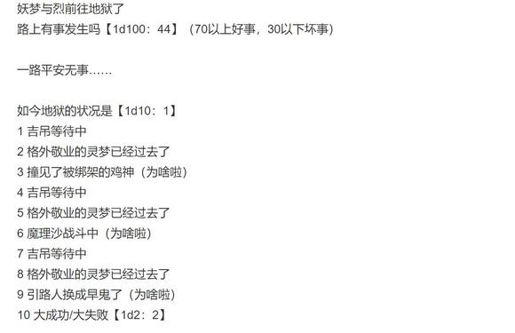

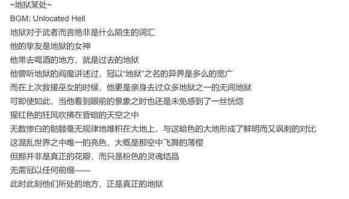

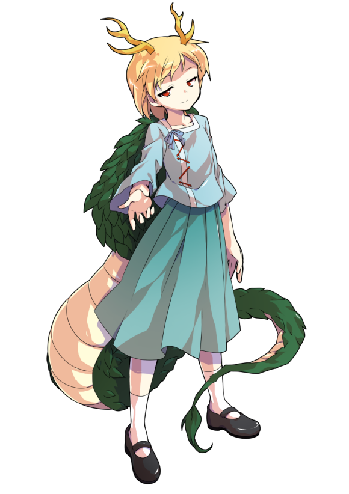

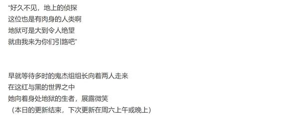

（以下是我的废话）

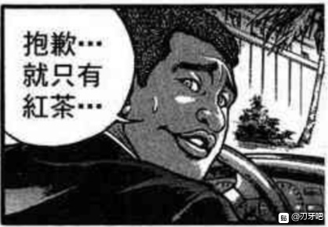

动物灵异变的第一次更新到此结束

仔细一看进度发现已经打完三面了，什么嘛这不是正常进度嘛（笑）

虽然部分重要角色提前出场了不过居然没有出现我预想中的糟糕速通开局也算是不错，不如说这次开局意外的很稳定哦

话是这样讲的不过动物灵先锋部队你们在干啥啊？本来是想着渲染气氛来过个对抗骰没想到你们真被小妖怪挡住了哎，幻想乡防卫军吗这是？！

原本想着按照一如既往的永远亭收集情报开始不过这次异变发生的地点就在河岸边，偏偏上次安价回又出现了赛之河原的守矢竞技场——

啊那当然会出现这种场面，动物灵一过来正好进到人家竞技场大门口，无论观众还是竞技选手看到之后大概都蛮开心的想想真是过草

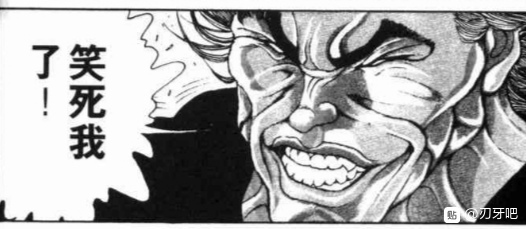

吉吊小姐你的骰运最近是不是越来越猛了怎么次次都能过啊？

除了第一次出场的大失败连发外这个人真的从来都没放过任何一个机会，不愧是组长哎

三面被换成小町了导致我不得不临时车了张卡

小町由于机制原因不能给太强的面板（不然会变成滥强卡），但同时技能伤害也得维持在应有的水平，因此我还满苦恼的——

结果明明是应该先减半后换血的却由于前期太跨了导致换血被动直接提前触发了

然后小町小姐只能对着仅剩4血的烈用出减半（悲）

最惨的是明明大优势却真的被锁血翻盘了，烈师傅最近是不是老打这样的架啊？你也和梦烈一样不锁血不会玩吗？

本来还以为至少能打出急救的（悲）

鸡神莫名其妙就被埴轮们绑了，为啥啊？？？

仔细算算这是梗选项三连击才能中的结果所以到底为啥啊？？？

那么本次的更新到此结束，骰子异变结束后一块发

下一次的更新是在周六的上午或晚上，具体看情况

由于明早有事出门，因此明晚七点半左右更新

前期提要

战胜了三途川的摆渡人，烈与妖梦来到了真正的地狱

在此等待着他们的，正是那位鬼杰组的组长小姐

接下来的发展会是。。。！

动物灵异变，锐意连载中

~地狱 某处~

妖梦：你是谁？

看起来不像是地狱的鬼呢

你认识烈海王吗？

吉吊：初次见面

我是鬼杰组的组长，吉吊八千慧

至于您，【首先报上名来吧】

“理所应当”的，银发的剑士向初次见面的陌生人说出了自己的来意

妖梦：失礼了，我是魂魄妖梦

我是为了调查正在侵略地上的动物灵

而从冥界的白玉楼来的

烈：吉吊小姐

你所说的那位“邪恶存在”，现在究竟在哪里？

吉吊：那邪恶的灵魂就在你所去过的**界

我很清楚您的实力如何，因此也就不再做无谓的试探了

那么，我就带你们去应当打倒的敌人那里

妖梦（水獭灵）：谢谢，就等您这句话了！

妖梦：咦？

为什么我会对初次见面的对象这样低声下气啊……

妖梦的察觉【1d100：93】（90以上察觉不对劲）

半人半灵的剑士面无表情地握住了腰间的刀柄

妖梦：等一下

我，平时对幽幽子大人说话都没有这样客气的

是水獭灵的影响？

还是说，是你吗——

吉吊八千慧！

吉吊要做什么【1d10:6】（失败后直接过对抗骰）

1 使用能力

2 甩锅给水獭灵

3 开战（你想啥呢）

4 使用能力

5 甩锅给水獭灵

6 交给你说明了，烈海王（为啥啦）

7 使用能力

8 甩锅给水獭灵

9 实话实话（为啥啦）

10 大成功/大失败【1d2：2】

由于水獭灵的轻举妄动，这敏锐的人类已经对她产生了怀疑

此时直接出言相劝并非最好的选择

这里应该借助已经完全相信她的武术家的力量

这般想着，鬼杰组的组长看向了一脸懵逼的烈海王

吉吊：看上去您的朋友对我有些误解

拜托您帮忙说明一下吧，烈海王

烈的理解【1d100：27】（50以上成功）

而令人遗憾的是，武术家完全没能理解她的意图

烈：？？？

我也没搞明白为什么

妖梦小姐以前说话确实不这样啊？

妖梦：我不明白

我不明白到底是什么状况……

但是，你们一定做了手脚！

吉吊：【稍——

冥界的庭师拔刀指向了眼前的可疑之人

妖梦：我无法相信你

不要有任何动作，吉吊八千慧

从我的体内滚出来，水獭灵

告诉我你们真正的目的！

高速思考着的动物灵

吉吊：（看上去很是单纯，没想到却这样敏锐啊……）

（大意了，应该从最开始就直接用能力的）

持剑戒备着的剑士

妖梦：（这个人太古怪了，她到底做了什么？）

（烈海王似乎很相信她，这也是出于同样的原因吗？）

以及，完全状况外的武术家

烈：（？？？？？？？）

（怎么回事啊？）

（为啥妖梦小姐和吉吊小姐突然吵起来了？？）

令人不安的沉默降临在了三人之间

最终，仿佛是想要出言劝慰对手一般

鬼杰组的组长轻启双唇

与此同时，半灵剑士立刻挥出了楼观剑！

吉吊的开口【1d100：93】

妖梦的反应【1d100：12+30=42】（提前戒备+30）

人符【现世斩】

这是魂魄妖梦所习得的剑术之一

一步踏前进行冲刺斩击，虽然难以击中空中的对手，但在地面战时却十分强力

双方仅有数步之遥，配合那令天狗都难以捕捉的急速，她绝无任何失手的可能——

如果，她没有被动物灵所凭依的话

妖梦：（糟了，无法行动！是水獭灵吗？！）

半灵剑士的身体突然僵硬地定在了原地

被动物灵所凭依的她没能如自己所想的一般做出行动

于是，那不可违抗的言语传入了她的耳中

吉吊：【你没必要这样警惕】

这是种很奇妙的体验

【仅限这段时间之内】

脑内所认知的，事物的优先性发生了改变

魂魄妖梦很清楚地知道对方在说谎

她没有被告知全部的情报，眼前的动物灵毫无疑问是想要利用她达成某些目的

但是，尽管如此

她依然认为自己应当听从对方的话语

妖梦：（为什么呢

明明我知道对方肯定隐瞒了什么

却又觉得感觉确实是这么回事……）

鬼杰组的组长观察着对方略显迷茫的表情

她满意地点了点头，并悄悄改变了说话的口吻

吉吊：【我会告诉你敌人的位置】

【你的任务，就只有打倒那个敌人而已】

动物灵位于紧邻地狱的**界

在那**界的中央，有一座尤其醒目的建筑物

那就是敌人的大本营

半人半灵的剑士赞同地点着头

就是这样，她应该做的就是这个

不知不觉间，她说话的口气又恢复到了之前那畏畏缩缩的样子

妖梦：明、明白了……

即将发生的冲突，在数秒之内就被“诚恳的话语”所化解了

金发有角的少女转过头去，带领着两位援军飞向了**界的方向——

烈的推理【1d70：11+30=41】（原标准75，亲眼目睹过程后降至60，60以上成功）

武术家思考着自己刚刚所见的，数秒内的“冲突”

妖梦似乎误会了吉吊，之后又被对方的话语所打动了，于是就放弃了自己的攻击…..

烈：总感觉有些不对头

吉吊小姐，我无法确定细节

但是你刚刚做了些什么吧？

吉吊：只是些不值一提的小技巧

如果我不想想办法自保，您带来的这位剑士小姐就要和我大战一场了

邪恶的灵魂在**界肆虐张狂，我们这些为数不多的反抗者却在这里白白耗费自己的力量——

这是多么悲哀的事情啊

烈：......我是相信你的话的

我所了解的吉吊小姐，不是会轻易进攻地上的无谋之辈

吉吊：我很高兴看到您仍然处于冷静的状态

如果不是情况紧急，又怎么会发生这般可怕的事情呢？

现在帮助您的是牛灵吧？那是我一位老实可靠的部下

它平时说话很有些老气，可能会在这方面影响到你......

武术家本就对吉吊的说辞确信无疑

而在听到对方主动提供的情报后，他更是没有怀疑的理由了

突如其来的意外情况已经处理完毕

接下来要做的不过是让两人去到**界的中央——

并等待着，胜利的来临

【1d60：56】分钟后

在吉吊八千慧的带领下，武者与剑士穿过了狂风吹拂的区域

眼前隐约可见到现代化都市的轮廓

那正是他们此行的目的地，动物灵异变的根源

畜 生 界

烈：那邪恶的动物灵就在**界的中央吗？

妖梦：我一定会打倒她们的！

吉吊：就是这样！

被猛牛选中的斗士啊，被水獭选中的伏兵啊

回想一下鬼杰组的铁训！

攻其不备才是最快最佳的手段，将那咒怨入骨的鬼形之敌歼灭吧！

前期的准备已经结束

外道的无魂者终将得到制裁

吉吊八千慧高声鼓励着她所指引而来的援军

她微笑着转身，将两人留在了那本属于自己的城市

烈与妖梦对鸡神的关心【1d100：70】（50以上出言询问）

妖梦：顺便问一下

吉吊八千慧，你有见过彼岸那边的鸡神吗？

她好像被一群埴轮绑架了

吉吊的兴趣【1d100：19】（50以上参与调查）

吉吊：（埴轮军团绑架了彼岸的鸡神？还有这事？）

我对此一无所知

还请优先解决眼前的危机吧

烈：没办法……看来只能顺路问问了

~**界~

昏暗而阴沉的天空中，弥漫着灰色的雾气

阴森而不详的黑暗里，却有点点红光闪烁

那是在现代社会中常见的风景，高楼大厦外侧的灯光

是的，动物灵们的家园绝非荒凉的原野

与此恰恰相反，它看上去更像是一座被遗忘于雾中的人类城市——

一座只属于动物灵们的，红与黑的大都会

倍感熟悉的武者与一脸好奇的剑士走进了这座陌生的钢铁森林，开始了他们的调查

现在的**界【1d10:10】

1 埴轮兵团巡逻中

2 “救命啊！”

3 鸡神似乎成为了客人（为啥啦）

4 埴轮军团巡逻中

5 “救命啊！”

6 巫女战斗中（为啥啦）

7 埴轮军团巡逻中

8 “救命啊！”

9 兵长带着俘虏去中心了（为啥啦）

10 大成功/大失败【1d2：1】

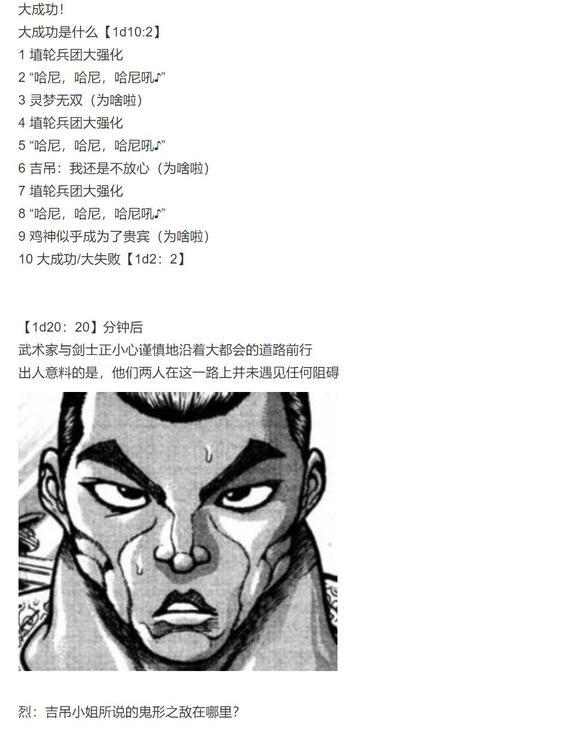

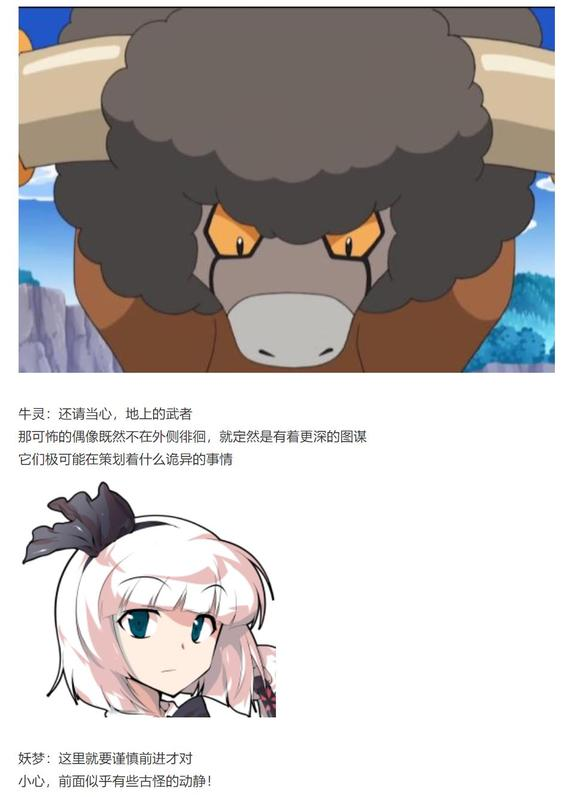

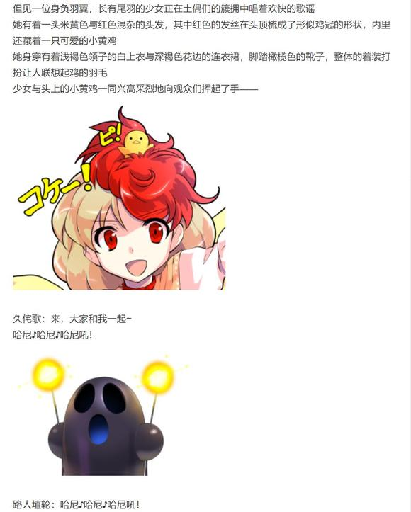

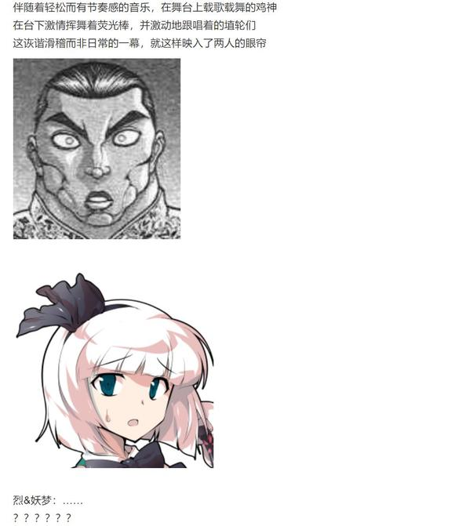

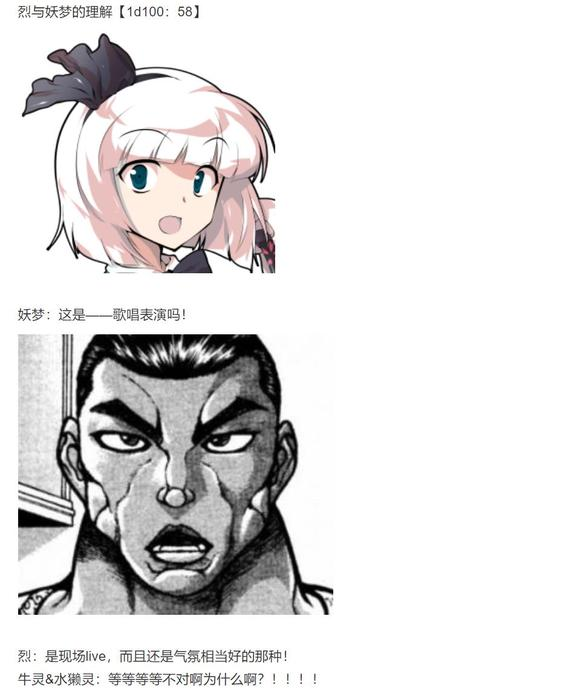

“你们是人类？

再不赶紧回灵长园里去

就要被饥饿的畜 生们捉走了”

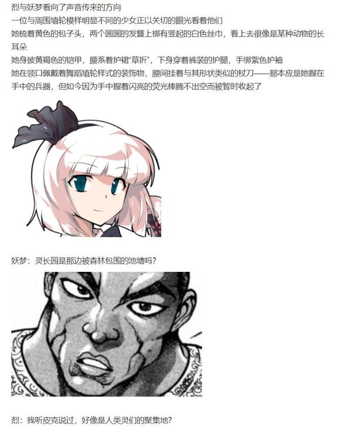

烈与妖梦的行动骰、偶磨弓的好感度骰：暂时隐藏，本小段剧情结束后放出

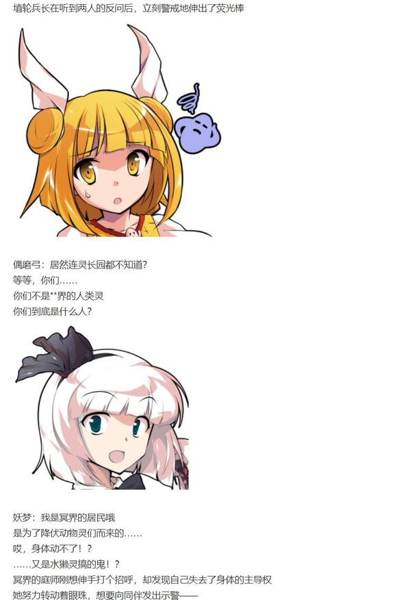

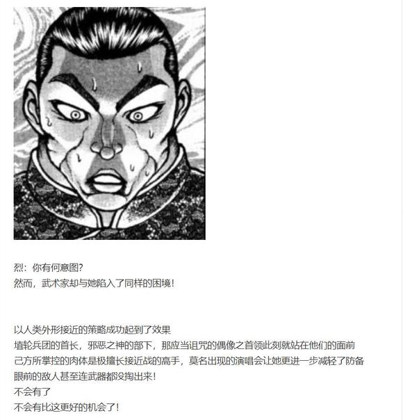

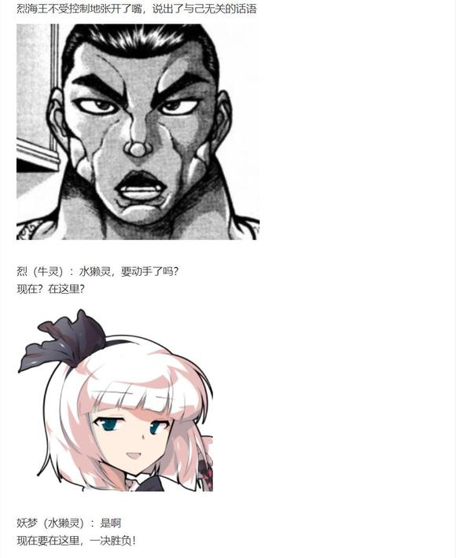

牛灵：得罪了，烈海王

我等死灵没有肉身，奈何不得这些泥塑之物

水獭灵：呵呵呵

因此我们特意带来了拥有肉身的人类！

磨弓：从你们身上感受到的灵气……

这样啊，是水獭灵与牛灵

你们是鬼杰组吉吊的手下啊！

刹那间，会场安静了

所有的观众在同一时间停下了手头的动作

它们整齐划一地回过了头

它们的眼中燃起了点点灵光

充满非人感的无机质声音响起

仿佛完成任务一般，不带一丝感情的

它们重复着，往复着，循环着那单调的词语

“畜 生”

“是 畜 生”

“两 只 畜 生”

“伤 人 的 畜 生”

烈（牛灵）：没错，我等正是畜 生

尝尝鬼杰组的必杀偷袭作战吧！

双刀出鞘，重拳挥出

在拥有了肉身之后，区区土偶根本不足为惧！

妖梦（水獭灵）：我要从你们这些被诅咒的偶像手中，解放人类灵！

觉悟吧！弱肉强食，才是——

“咚”

一声平平无奇的闷响打断了它那充满感情的宣告

水獭灵不敢置信地低下了头

透过半灵剑士的双眼，它清楚地看到了

埴轮兵长的铁拳，已经深深嵌入了自己的腹部

磨弓：畜 生 该 杀

无 慈 悲 ！

凌厉的拳风吹拂着她黄色的发丝

武者的正拳自背后袭来

她身体突得一矮，在最后一刻蹲下身躯，躲过了这几乎必中的突袭

右足踢向武者的脚踝以破坏平衡，右手则放在了腰间奇形的刀柄之上

她行云流水般扭转身躯，看向了位于自己身后的另一位人类

不出所料，刹那之前的反击令他微微停滞了一刻

这转瞬即逝的时机无法让她拔出杖中的利刃——

那便索性带着杖身一并挥出

埴轮形的杖刀借助回旋的力量抽打在了武者的心口

无需出鞘的居合，于此刻完成！

磨弓：给我从人类的身体里，滚出来！

行动骰：【1d10:10】

1 这里就靠我烈海王的口才

2 总之先和久侘歌搭话吧

3 水獭灵：“该行动了”（为啥啦）

4 这里就靠我烈海王的口才

5 总之先和久侘歌搭话吧

6 牛灵：“该行动了”（你这边得过个意志对抗）

7 这里就靠我烈海王的口才

8 总之先和久侘歌搭话吧

9 这里就靠我烈海王的歌！（为啥啦）

10 大成功/大失败【1d2：1】

大成功【1d10：3】

1 烈与妖梦堂堂参演！

2 靠久侘歌的介绍取得了信任

3 动物灵的凭依被埴轮兵长驱除了（为啥啦）

4 烈与妖梦堂堂参演！

5 靠久侘歌的介绍取得了信任

6 烈：吉吊小姐怕不是在利用我吧？（确实）

7 烈与妖梦堂堂参演！

8 靠久侘歌的介绍取得了信任

9 ？？？来了（为啥啦）

10 大成功/大失败【1d2：2】

磨弓的好感度【1d100：43=70】（大成功保底50，人类+20）

“嘭！”“嘭！”

两条颜色各异的虚影从烈与妖梦的身后飘起

凭依在两人身上的动物灵，被埴轮兵长所打入的魔力硬生生驱散了！

黄发的少女温和地拉起了一脸懵逼的两人

磨弓：人类啊，你们可能还没明白发生了什么

但是，无需担心

邪恶的灵魂已经被驱离

我杖刀偶磨弓，会从**的口中保护你们的！

【1d30：17】分钟后

被抓走的两只动物灵在特制的容器中挣扎着

被绑架来的鸡神则在舞台上继续着她的演出

而刚刚展现了不凡身手的埴轮小姐，则在一旁微笑着看着一脸懵逼的两人

磨弓：魂魄妖梦和烈海王，是吗？

现在问这个可能有些晚了

两位是因为什么才来到这种地方的？

畜 生 界可不是什么好去处，为了你们的安全着想，还是早些回去为妙啊

烈与妖梦要做什么【1d10：10】

1 总之先问问你们是谁吧

2 刚刚到底是在做什么

3 妖梦：要去打倒邪恶的灵魂才行！（你还记着啊）

4 总之先问问你们是谁吧

5 刚刚到底是在做什么

6 烈：快把动物灵们放了！（为啥啦）

7 总之先问问你们是谁吧

8 刚刚到底是在做什么

9 就在这时自机来了（为啥啦）

10 大成功/大失败【1d2：2】

这个时候的大失败是什么啊【1d10：2】

1 被强制带回灵长园了

2 妖梦：要去打倒邪恶的灵魂才行！

3 烈的完全错误推理（又来吗）

4 被强制带回灵长园了

5 妖梦：要去打倒邪恶的灵魂才行！

6 就在这时劲牙组突袭！（为啥啦）

7 被强制带回灵长园了

8 妖梦：要去打倒邪恶的灵魂才行！

9 就在这时被完全控制的自机突袭！（为啥啦）

10 大成功/大失败【1d2：1】

武术家正努力整理着这混乱的场面

烈：我——

就在此时，半人半灵的剑士一拍桌子站了起来

妖梦：我是来打倒敌人的

居住在**界中央的，打扰动物灵安宁生活的敌人

那就是你们吧！

水獭灵：您说的没错，妖梦小姐！

就是它们打破了我等的规则！

磨弓：妖梦小姐，你应该是误会了

我等埴轮兵团，是为了守护人类灵而组建的军队

主动发起侵略行为的并非是我方……

妖梦：那就把发起异变的犯人交出来！

磨弓的察觉【1d100：42】（50以上察觉妖梦中招）

磨弓：明明是地上的人类，却为了桂姬大人而来？

莫非你和那个史前生物一样，是畜 生们的帮凶吗！

那么哪怕用强制性的手段

我也要将你，拒之门外！

烈的理解【1d100：90】（90以上采取行动）

侦探先生终于理清楚了脑中混乱的思绪

烈：（埴轮兵团是什么？牛灵和水獭灵刚刚突兀的行动又是怎么回事？）

（我能够看出它们双方都抱有相当的敌意，但这与吉吊小姐与牛灵提供的情报似乎有些矛盾……它们根本就不是灵魂啊？）

烈海王要做什么【1d10：8】（由于先前的大失败选项，烈的行动无法阻止妖梦战）

1 在妖梦战斗时调查情报吧

2 这里就靠我烈海王的推理！

3 再问一次吉吊小姐吧（为啥啦）

4 在妖梦战斗时调查情报吧

5 这里就靠我烈海王的推理！

6 偷偷潜入灵长园（为啥啦）

7 在妖梦战斗时调查情报吧

8 这里就靠我烈海王的推理！

9 直接去和吉吊对质！（你别送了好吗）

10 大成功/大失败【1d2：2】

烈的推理【1d70：41+30=71】（50以上获得基本信息，75以上大概了解情况）

烈：（不对头

比起什么“打倒邪恶存在”的战斗，这更像是两个组织之间的势力争斗！）

等一下，妖梦小姐

我们手头的情报实在太少了，在此轻易开战绝非明智之举！

妖梦：想这么多干什么

斩断邪恶之后，我们就可以回幻想乡去了啊~

来吧，埴轮兵长

把你们统统干掉，这件事就结束了！

台下的观众们自动自觉地让出了一片空旷的区域

剑士与士兵间的战斗，于此刻开始！

。

。

。

久侘歌：（话说我明明是被绑架了吧？为什么没人来关心一下我啊？）

顺便一提，一直找不到插话机会的二羽渡大人被双方遗忘了

战斗！

BGM：陶瓷的杖刀人

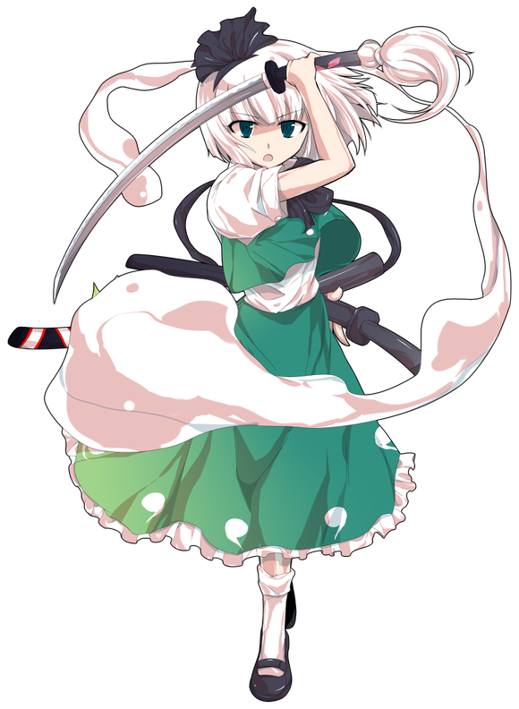

魂魄妖梦

Atk：265

Hp：16

技能

水獭灵凭依：Atk+20，Hp+2，自身所有必杀技倍率+50，一场战斗中仅限一次，Hp归零时抵消一次伤害。【由于水獭灵被驱除，此技能无法使用】

烈海王的支援：由于烈自身心存困惑，因此不会直接参与战斗。一场战斗中仅限一次，Hp归零时使用一次急救拳，Hp+3

半人半灵的庭师：不会陷入异常状态，拥有对时停等特殊攻击的耐性，普通攻击与弹幕系攻击所造成的伤害减半（仅对Atk240以下的对手起效）自身所受到的弹幕系伤害-2（仅对Atk241以上的对手起效）

生命的二刀流：剑术高超，自身技能的破解/防御/回避判定所需成功值+20，自身的攻击无视所有减伤效果（面对完全消力等针对白刃战特化的减伤时，仅使用剑气的攻击可适用本效果）

修罗剑【现世妄执】（CT3）：（近战系）短距离的直线超高速斩击，本回合回避概率X3，给予伤害+1，对对手造成【1d4】点伤害

断迷剑【迷津慈航斩】（CT4）：（近战系）往楼观剑内注入大量妖力，创造出巨大的光刀斩击本回合Atk+70，造成伤害+2

魂魄【幽明求闻持聪明之法】（CT5）：（近战系）： 令半身复制本体的行动进行追加攻击，本回合Atk+100，给予伤害X2，伤害判定结束后对对手进行一次【1d100】的追击判定，60以上成功，对手Hp-3

人神剑【俗谛常住】（CT6）（弹幕系）：放出红色中玉与蓝色米弹的前后夹击，对对手造成【1d5】的伤害，同时3T内对手受到的伤害+2

必杀技

天神剑【三魂七魄】（CT6）：彩色弹幕与红色大玉的连击，Atk+650，给予伤害X3，战斗成功后对对手进行一次特殊攻击【污秽】：进行一次【1d100】的污秽判定，60以上成功，成功后下回合对手无法行动（面对拥有特殊攻击耐性的对手时，成功标准提升至80）

六道剑【一念无量劫】（CT7）：无法回避/破解/防御，以超高速对自身以外的一切进行攻击，Atk+775，给予伤害X4

人鬼【未来永劫斩】（CT8）：无法回避/破解/防御，以神速冲向敌人斩下猛烈的一刀，后加以威力极高的连续追击。Atk+875，给予伤害X5，进行一次【1d100】的神速判定，30以上本回合自身受到的所有伤害-2，50以上本回合自身回避概率X4，75以上本回合自身无敌

【待宵反射卫星斩】：由于身处无月之地狱，无法使用，如果能提供月光的话......？

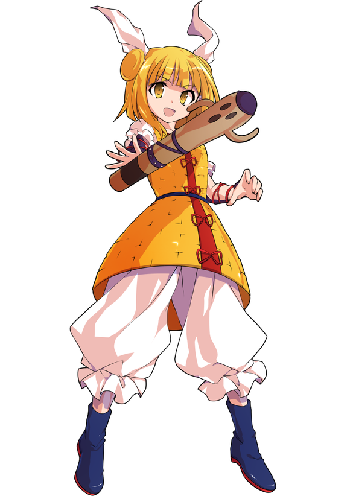

杖刀偶磨弓

Atk：285（0）

Hp：20

技能

永远忠诚：将对造型之神的忠诚心转化为自身的实力，Atk+265

集团作战：与埴轮兵团并肩作战，Atk+20

埴轮兵长：不会陷入异常状态，拥有对支配等“与灵魂有关”的特殊攻击耐性。当埴轮兵团的数量为三个以上时，自身普通攻击给予伤害+2，当埴轮兵团的数量为五个以上时，为自身提供3点护甲，护甲破碎前每次受伤固定造成1点伤害。一场战斗中仅限一次，当自身Hp为7以下时可消耗【1d4】个埴轮兵团并恢复相应数值的Hp

埴轮【熟练弓兵埴轮】（CT1）：（埴轮弹幕系）一场战斗中仅能使用一次，率领精锐弓兵埴轮攻击。本回合自身Atk+50，3T内每回合召唤一个埴轮兵团，并对对手造成无视减伤的【1d4】点伤害。对此技能的破解需要每回合各进行一次

埴轮【熟练剑士埴轮】（CT4）：（埴轮近战系）率领精锐剑士埴轮进行接近战。2T内每回合召唤【1d2】个埴轮兵团，自身攻击必中，Atk+60/70，给予伤害+2，对此技能的破解需要每回合各进行一次

必杀技

埴轮【熟练骑马兵埴轮】（CT6）：率领精锐骑马兵埴轮攻击，Atk+650，给予伤害X3，召唤一个埴轮兵团

埴轮【新型野人兵埴轮】（CT7）：率领埴轮兵团的新兵种：精锐原始人埴轮攻击，Atk+760，给予伤害X4，召唤一个埴轮兵团，本回合战斗成功的场合进行一次【1d100】的突击判定，60以上成功，对手Hp为1/4以下的场合宣告战斗结束，杖刀磨弓胜利

埴轮【不败的无尽兵团】（CT8）：埴轮兵团，永远忠诚！无法回避/破解/防御，Atk+860，给予伤害X5，召唤一个埴轮兵团，本回合自身败北且埴轮兵团数量为7个以上时，可通过消耗所有的埴轮兵团重新进行一次伤害判定

T1

磨弓：地上的人类是不应该来到这里的

快回你居住的地方去！

妖梦：我有一半是幽灵哦

原本居住的地方，就是死者聚集的冥界

黄发的埴轮面色纠结地思考了片刻

磨弓：那，那个……

这里也是死者的国度，所以……

额……

总之你先回去就是啦！

妖梦：所以说把异变的犯人交出来让我砍了，我就可以回去了啊

看招，樱花闪闪！

冥界的剑士持剑突进

樱色的华丽剑气刺向了为难的埴轮——

磨弓：啊啊不管了！跟我上！

埴轮【熟练弓兵埴轮】

埴轮兵团：1个

剑光一闪，飞射而来的箭矢被一分为二

妖梦：呵，区区弓箭怎么比得过我的楼观剑呢——

等等怎么这么多啊！

弓兵埴轮：弓兵部队，得令吼！

妖梦目瞪口呆地看着装备齐全的弓兵部队自兵长的身后走出

它们与首领一同弯弓搭箭，向着突进而来的半灵剑士射出了蓝红二色的箭雨！

妖梦的受伤【1d4：1】（弓兵埴轮无视减伤）

Hp：16-1=15

妖梦的攻击【265+1d100：85=350】

磨弓的攻击【285+1d100：28+40=353】

妖梦的受伤【1d10:9】

1 回避

2 小伤害

3 小伤害

4 中伤害

5 中伤害

6 大伤害

7 大伤害

8 特大伤害

9 特大伤害

10 大成功/大失败【1d2：2】

Hp：15-4=11

见势不妙的妖梦扯过半灵挡住了脑袋，而后带着被扎成千针鱼的半身跳出了包围圈

妖梦：你犯规啊！怎么还叫帮手？

磨弓：谁也没说过要和你单挑吧？

T2

埴轮兵团：2个

妖梦的受伤【1d4：2】（弓兵埴轮无视减伤）

Hp：11-2=9

妖梦：嘛，没关系

杂鱼的攻势算不得什么威胁

要斩的，只有你一个而已

妖梦的攻击【265+1d100：75=340】

磨弓的攻击【285+1d100：5=290】

半人半灵的少女无视了埴轮们射出的箭矢

她旁若无人地闭上了双眼，反手举起了长刀

下一个瞬间

魂魄妖梦消失了

磨弓：什——

埴轮兵长绝不是缺乏实战经验的样子货

狡诈的龙之子，凶狠的黑天马，傲慢的恶食兽

她率领着手下的兵团，凭借自身高超的武艺，将外道**一一讨伐，将非人之存在尽数驱逐

只不过，正因为太过具有经验

她才会在此时犯下错误

烈：她由于刚刚的战斗所出现了误解啊

被水獭灵所强制操控时妖梦小姐的速度，与她真正的神速相比

根本不值一提

银发的剑士刹那间出现在了士兵的身前

她面无表情地睁眼，迎头一刀斩下！

妖梦：人智剑

【天女返】

磨弓的受伤【1d10：5】

1 回避

2 小伤害

3 小伤害

4 中伤害

5 中伤害

6 大伤害

7 大伤害

8 特大伤害

9 特大伤害

10 大成功/大失败【1d2：1】

Hp：20-2=18

身经百战的埴轮兵长，在最后一刻用弓身挡在了剑刃之前

她由此而规避了最大的伤害——

“啪”

代价是，手中的武器被斩为了两段可笑的陶土

磨弓：这可真是……

回去又得拜托桂姬大人重做一套了

T3

埴轮兵团：3个

磨弓普通攻击所给予的伤害+2

妖梦：明明武器被斩断了，你却一点都不心疼？

黄发的少女从跟班手中接过了备用的弓箭

磨弓：跟不上战斗的兵器就要报废

这是理所应当的事情

妖梦：哇啊……

你对自己的兵器就没有一点感情吗

磨弓：为什么会有这样的想法？

难道你会很在意自己的剑？

妖梦：当然的吧，我可是剑士啊！

真是个不可理喻的家伙

符卡宣言 修罗剑【现世妄执】！

妖梦的受伤【1d4：1】

Hp：9-1=8

磨弓的受伤【1d4：3】

Hp：18-3=15

妖梦的攻击【265+1d100：35=300】

磨弓的攻击【285+1d100：39=324】

故技重施的妖梦再次冲向了被埴轮环绕的少女

但是这一次，她所看到的并不是对手那茫然无措的脸

而是未卜先知般握在她颜面之上的，属于埴轮兵长的铁爪！

烈：好眼力

她看出来了！

磨弓：你的速度的确很快

然而，这份神速是有条件的

你在全力奔驰前需要短暂的蓄力时间，并且，你只能沿着直线前进

了解了这些情报之后，你的攻击模式就不再是无法应对的了

她抬手一挥，将剑士扔向了高空之上——

磨弓：弓兵部队

一齐攻击！

妖梦的受伤【1d10：8】

1 回避

2 回避

3 回避

4 中伤害+2

5 中伤害+2

6 大伤害+2

7 大伤害+2

8 特大伤害+2

9 特大伤害+2

10 大成功/大失败【1d2：1】

Hp：8-4-2=2

“没事吧吼！”

“要不要带你去医院吼！”

“磨弓小姐你下手太重了吼！”

观众埴轮们手忙脚乱地抬起了坠落至地上的庭师

它们闹哄哄地拿来了黏土制的创可贴、绷带与听诊器——

妖梦：半灵它都被扎成筛子了啊！

这张符卡0分！

却只看到了毫发无伤的银发少女，与变成了刺猬的半灵

烈：……

妖梦小姐

为什么你的半身会变成那个样子？

妖梦：刚刚不是来不及拔刀嘛，所以我只能用它来挡箭了

还好我反应够快，要不然这次中箭的就要变成我了~

满脸扭曲的武术家终于忍不住将问题说出了口

烈：妖梦小姐，既然你有这么快的反射神经，能在这种情况下做出如此精密的动作

那你刚刚为何不直接跑路呢？？？

妖梦：…….

啊，我脑子没转过来

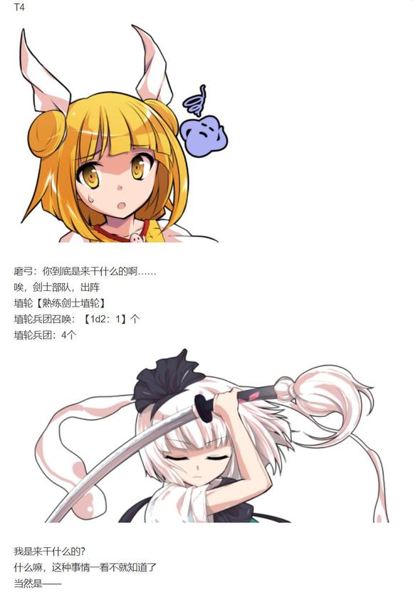

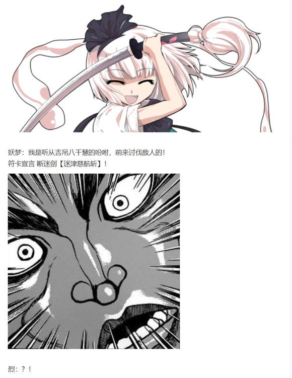

妖梦的攻击【265+70+1d100：31=361】

磨弓的攻击【285+60+1d100：71=416】

巨大的光刃将磨弓手下的兵团斩为了碎裂的陶土

而埴轮兵长本人，却对此毫无一丝感触

她只是像之前一样举起了手中未出鞘的杖刀——

磨弓：果然是被吉吊利用了啊

你给我冷静一下吧！

并对着莫名亢奋的少女，重重挥下

妖梦的受伤【1d10：7】

1 小伤害+2+2（无法回避）

2 小伤害+2+2

3 小伤害+2+2

4 中伤害+2+2

5 中伤害+2+2

6 大伤害+2+2

7 大伤害+2+2

8 特大伤害+2+2

9 特大伤害+2+2

10 大成功/大失败【1d2：1】

Hp：2-3-2-2=0

魂魄妖梦一头栽在了地上

她颤抖着举起了右手

妖梦：急救……

麻烦给我做下急救谢谢……

武术家走到了同伴的跟前

烈：在此之前

妖梦小姐，你是为了什么而来的？

妖梦：？当然是为了解决动物灵的异变啊

我从幽幽子大人那里得到了消息，然后立刻就马不停蹄地赶了过来——

啊咧？

冥界的庭师回想起了自己刚刚所说的话语

妖梦：我……刚刚为什么会说出那种话来？

不，不对

明明在刚开始的时候，我就已经对吉吊八千慧抱有疑心了！

烈：我之前以为你是被水獭灵所影响了

但在这场没有动物灵干扰的战斗中，你的状态也依旧不对劲

你平时的确有些脱线，但可绝对没到这个地步

烈海王使用了急救拳

Hp：0+3=3

武术家轻轻拍了下剑士的背部

他退到一旁，看着庭师晃着脑袋站了起来

妖梦：啊啊

终于，终于找回正常的感觉了

烈：抱歉，妖梦小姐

你之前所说的是对的

我在那时根本没能理解状况

我没想到她所谓的“自保”居然到了如此地步——

妖梦：没关系

说到底，是贸然中招的我不好

她走到埴轮兵长的面前，认认真真地行了一礼

妖梦：抱歉让你久等了

对着施以恩情之人刀剑相向，这是极其失礼的行为

请原谅我的无礼，杖刀偶磨弓小姐

磨弓：终于清醒过来了吗，人类

魂魄妖梦侧身举起了长刀

妖梦：那么，让我们继续吧

磨弓：你还要继续这毫无意义的争斗？

妖梦：呀，确实是很没意义的事情

莫名其妙发起了战斗，现在又莫名其妙地打算继续了

不过身为一个剑士，既然被如此盛情款待了——

怎么说都要让我做出些回礼才是！

磨弓：唉......

毕竟是人类的请求

那就陪你打到最后吧！

T5

埴轮兵团召唤【1d2：2】个

埴轮兵团：6个

磨弓得到3点护甲，护甲破碎前每次受伤固定造成1点伤害。（由于妖梦被动无视减伤，本战中无实质影响）

磨弓：现在的你和被吉吊影响时的你，在战斗能力上并没有任何差异

与此相反，我等埴轮兵团的战斗力却在混战中不断变强

妖梦小姐，仅剩一丝体力的你，就算身为人类也不可能战胜我们——

围绕在少女身旁的幽灵逐渐改变了它的形态

那如同麻薯般的圆球宛如幻影般淡去了

取而代之的，是浮现在少女身后的

另一个魂魄妖梦

半人与半灵同时侧身，将楼观归鞘，以白楼剑面对着手持刀兵的埴轮兵团

妖梦：符卡宣言

魂魄【幽明求闻持聪明之法】！

妖梦的攻击【265+100+1d100：81=446】

磨弓的攻击【285+70+1d100：68=423】

抛弃了一招制敌的爆发性冲刺，银发的剑士如同在庭中漫步般缓慢前行

自四面八方而来的斩击被她仅凭短刀便轻松挡下

敢于亲身阻挡的精锐剑士根本不是她的一合之敌！

数秒过后，魂魄妖梦便毫发无伤地越过了兵团的包围

轻松写意，如入无人之境

妖梦：上了，埴轮剑士

长刀出鞘

剑气纵横

磨弓的受伤【1d10：3】（妖梦攻击无视减伤效果）

1 回避

2 小伤害X2

3 小伤害X2

4 中伤害X2

5 中伤害X2

6 大伤害X2

7 大伤害X2

8 特大伤害X2

9 特大伤害X2

10 大成功/大失败【1d2：1】

Hp：15-1X2=13

妖梦：残念，初手被避过了

第二击又如何呢？

追击判定【1d100：73】成功

Hp：13-3=10

半灵化作的人形飘然而起，以完全相同的架势重现了妖梦方才的攻击

这一次，埴轮兵长无处可逃！

磨弓：为什么？

你的身体机能明明与之前完全相同

为什么战斗能力却有着如此之大的差别？

妖梦奇怪地歪了歪头

妖梦：嗯？

理所当然的吧

在我的面前用剑，怎么可能赢？

T6

妖梦：用枪的话说不定能行

像之前那样用弓箭也很难缠呢

还有未出鞘的杖刀，在你的手里也是相当危险的武器……

埴轮，困惑了

磨弓：我看不出你话语之中的逻辑关系

其他的兵器和剑有什么不同？

敌人的身份和武器的种类又有什么关系？

妖梦：你连这都不明白吗？

哎呀，说明起来感觉好麻烦

总之，想赢的话就让你的下属们换个武器吧

妖梦：不然的话

你就绝无可能在我面前，取得胜利了

磨弓：……看来你确实对于白刃战有着充分的信心

既然如此，我就用骑兵应敌

埴轮【熟练骑马兵埴轮】！

埴轮兵团：7个

黏土士兵们骑着陶制的战马结成了军阵

这滑稽而可笑的一幕却无法带来一丝轻松的空气

因为在场的每一个人都明白，它们的实力远胜于真正的骑兵！

妖梦：就是这样才对

我也要认真起来了哦

符卡宣言 修罗剑【现世妄执】

人神剑【俗谛常住】

天神剑【三魂七魄】！

磨弓的受伤

修罗剑【1d4：4】（妖梦无视减伤效果）

人神剑【1d5：3】

Hp：10-4-3=3

以人神之剑击溃军势

以修罗之剑开辟通路

以七彩汇聚的天神之剑，为无魂的非人宣告衰亡！

妖梦的攻击【265+650+1d100：1=916】

磨弓的攻击【285+650+1d100：24=959】

在极端的时间内突破了骑兵的军势，这毫无疑问是值得称赞的壮举

那直冲天际的剑气，甚至将磨弓的皮肤砍出了道道裂痕

然而，一人的力量终究有限

即使是稀世的剑客，也终有力尽之时

数量的优势在此展现，战马上的持刀人刺出了她的杖刀——

在最后夺得先机的，是埴轮兵团之长！

妖梦的受伤【1d10：3】

1 回避

2 回避

3 回避

4 中伤害X3+2

5 中伤害X3+2

6 大伤害X3+2

7 大伤害X3+2

8 特大伤害X3+2

9 特大伤害X3+2

10 大成功/大失败【1d2：1】

久侘歌：她输了——

烈：不要急着下结论

妖梦小姐可不是这般轻易就能战胜的对手

鸡神定睛看向了战场的中央

埴轮兵长的刺击停在了半空

因为妖怪所锻造的长刀，在同一时间架在了她的脖颈之上

妖梦：虽然你刚刚先一步出手

不过攻击的距离，似乎是我更长呢

T7

兵长与剑士默契地收回了双方的兵器

魂魄妖梦扫了眼被打得七零八落的骑兵部队，又看了看自己身前的黄发少女

妖梦：到此为止吧

你已经无法战斗了，杖刀偶磨弓

埴轮兵长身上的裂纹正以肉眼可见的速度蔓延

龟裂的破片从她的四肢落下，露出了内部那空无一物的空间

归根到底，她只是陶瓷所制的土偶

即使战斗能力再过强大，在受到重大伤害之时

也不可避免陷入如今这般困境

磨弓：啊呀......需要桂姬大人修补的东西又多了一份......

然而，黄发的少女对自己的伤势却没有表现出一丝一毫的关心

她只是习以为常地评论了一句，并再一次举起了手中的杖刀

仿佛发生破损的并非自己的身躯

而是如同弓箭一般，可以随时丢弃的道具

妖梦：别开玩笑了

现在的你连自由行动都无法做到

磨弓：在担心我的损伤吗？

你真体贴啊

埴轮兵长发动

消耗兵团数：【1d4：3=3】

Hp：3+3=6

陶瓷的杖刀人将布满裂纹的手臂抬起

在先前的抵抗中被打碎的兵器

在激烈的冲突中被斩裂的坐骑

在这场战斗中损坏的所有士兵

这些无智，无知，无魂之物所遗留的碎片听从着首领的指示，完成了自己的最后一项任务

它们从尘土中飘起，汇聚在了黄发少女的身旁

同出一源的陶土填补了埴轮表面的空洞

杖刀偶磨弓再次回到了战前那完好无缺的样子

她微笑着举起了双手

磨弓：但你无需担心，妖梦小姐

只要有祂的爱

我就是不灭的

