这持有人类之面貌的埴轮，以最为直观的方式展现了自己非人的一面

而面对这扭曲至极的场景，银发的剑士小姐——

妖梦：你能自我修复？

好方便啊，现在的土偶已经进化到这个地步了吗

什么感觉也没有

久侘歌：这个画面明明就很恐怖吧！

我听说过冥界的庭师是个缺根筋的家伙但这也太粗神经了吧？！

烈：？有吗？

我觉得比起蓬莱人干架，这还是挺容易接受的

磨弓：每经过一场战斗，我等埴轮就会变得更加强大

比起原地踏步的生灵，偶像的进化才是真正的永不停息

让你见识一下吧，最新型埴轮的力量！

埴轮【新型野人兵埴轮】！

围观的埴轮们呼啦一下让开了一条通路

一位身材异常高大的埴轮从中走了出来

它有着特意制作的黑色假发与威慑性的可怖五官，粗壮的四肢上被雕刻出了锐利的尖爪，厚实的身躯上配有极其坚固的肌肉型装甲

它如同某位真正的原始人一般趴伏在地，向着眼前的人类发出了震天咆哮

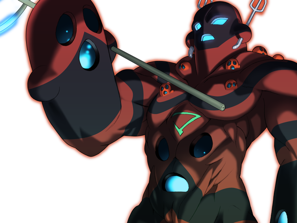

皮克埴轮（友情出演 哈尼魔人）：嗷嗷嗷嗷嗷嗷嗷哦啊嗷嗷嗷啊！

（接近战特化型，原始人埴轮在此吼！）

烈：皮克！这不是皮克吗！

妖梦：有趣，那就来看看吧

非人的士兵与半人的剑，究竟哪个更强！

她一板一眼地举起了双刀，向着直冲而来的人形兵器摆出了【架势】

妖梦：符卡宣言

六道剑【一念无量劫】

妖梦的攻击【265+775+1d100：93=1133】

磨弓的攻击【285+760+1d100：73=1118】

是置换空间的魔法吗？

是停止时间的能力吗？

是营造错觉的幻术吗？

若非如此——

又怎么可能在这转瞬即逝的须臾间，令剑气遍布在这战场上的每一寸空间之内？！

未曾见识过这般神技的埴轮们纷纷思索着可能的解释

而亲身经历过这一剑的武者，则说出了其后的原理

烈：不是什么能力或者秘法

只是单纯的速度

她只是快到了不可思议的地步，仅此而已

磨弓的受伤【1d10：2】

1 小伤害X2+2

2 小伤害X4+2

3 小伤害X4+2

4 中伤害X4+2

5 中伤害X4+2

6 大伤害X4+2

7 大伤害X4+2

8 特大伤害X4+2

9 特大伤害X4+2

10 大成功/大失败【1d2：1】

Hp：6-1X4-2=0

四肢断裂，头颅飞起，巨大的土偶轰然倒地

妖怪所锻造的长刀停在了兵长的脖颈前方

庭师顺手挥散尘土，收刀入鞘

妖梦：斩埴轮的话就不会在刀上沾血了

如此一看，你们可真是不错的对手

战斗结束

胜者 魂魄妖梦！

【1d30：4】分钟后

抱着原始人埴轮脑袋的黄发少女，正在一旁观察着烈海王对妖梦的急救

埴轮：才打了一会就要消耗大量时间治疗

肉体原来是这么不方便的东西啊

烈：——这样就差不多了

感觉如何？

妖梦：头疼胳膊疼腿疼腰疼请问有止疼药吗

烈：没有，只带了浓缩糖水

被打成那样了再爬起来奋战一场，现在居然也就是有点疼

妖梦小姐你的身体素质也是够好了

你们要糖水吗？我这还有几罐

烈的厨艺【1d45：22+55=77】

半灵剑士美滋滋地喝着糖水

妖梦：好甜，不过好好喝！

幽幽子大人一定会喜欢这个的

回去教我一下配方吧~

皮克埴轮：嗷嗷嗷嗷嗷嗷嗷啊

（从脖子里漏出来了吼！有人能帮我把身体接上吗吼！）

磨弓：是不是该建议桂姬大人做个厨师埴轮了呢……

烈：（现在终于有机会进行情报交流了）

（这次的异变实在是太过复杂，我们到底被卷入了什么事件当中？）

（现在需要解决的问题是——）

烈的察觉【1d70：31+30=61】（保底30询问鸡神，50以上询问吉吊的能力，60以上询问双方立场，75以上询问桂姬）

烈：（二羽渡神被绑架而来的理由）

（吉吊小姐所使用的能力）

（动物灵与埴轮兵团双方的立场）

（这三点是目前最需要解明的问题）

首先是【1d3：3】

1 鸡神

2 吉吊

3 动物灵与埴轮兵团

烈的口才【1d100：51】（磨弓好感度70,30以上成功）

烈海王举起了关押动物灵的特制容器

烈：杖刀偶磨弓小姐

先前我和妖梦小姐多有冒犯，再次说声抱歉

如果你不介意的话，可否告知我们一声

动物灵组织与埴轮兵团之间究竟发生了什么？

磨弓：就像你看到的那样

我们只是在守护

从凶狠的畜 生口中守护灵长园，这就是我等埴轮兵团的工作

水獭灵：把人类尽数纳入支配之下

这种事情才不是什么守护

你们甚至还跳出了灵长园，试图支配我们的世界！

牛灵：如果不是暴走的埴轮侵占了我等的都市，这次的事件根本就不会发生！

埴轮兵长抽刀指向了牢笼中的牲畜

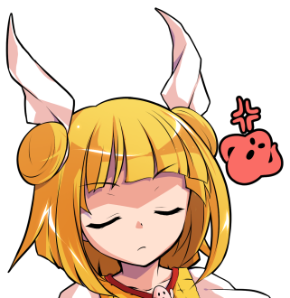

磨弓：“只要动物灵能够尊重人类灵，我们就可以共存下去”

桂姬大人一直都是这样想的

然而，事实是什么呢？

贪婪的动物们丝毫没有理解她的苦心

你们甚至将地上的人类欺瞒而来，只为再度将人类灵虐待为奴隶！

磨弓：那我们当然会主动出击

不败的无尽兵团将走出灵长园外

将畜 生界的动物灵尽数驱逐，一个不留！

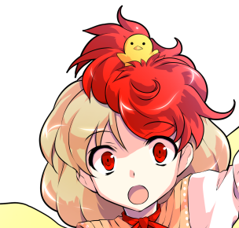

久侘歌：好可怕……

水獭灵：（吉吊大人——！

这和说好的不一样啊——！）

少，少在那里摆出一副大义凛然的样子了！

你们所支配的人类灵也依然是最底层的存在

那可怜的样子简直连奴隶都比不上！

半灵剑士咕嘟咕嘟地喝完了一罐糖水

妖梦：好像两边都说的很有道理哎

幽幽子大人——啊幽幽子大人不在

烈海王，我们该站哪边啊？

烈的理解【1d100：77】（50以下现在做出决定，51以上暂且搁置）

烈：动物灵们不怀好意，这是已经可以确定的事情

但“守护人类”的埴轮却也不见得一定是“正义”的组织

在亲眼确认之前，任何一方的言词都不足为信

这个问题的关键在于……

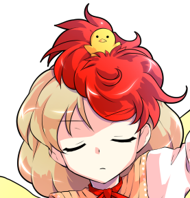

久侘歌：位于漩涡中心的“人类灵”究竟是什么情况？

磨弓：吉吊八千慧连这种最基本的情报都没有告知你们吗？

在我等埴轮兵团出现之前

人类灵，就是位于**界最底层的奴隶啊

妖梦：人类是动物的奴隶？！

路人埴轮：人类灵的力量太过微小，无法与动物灵抗衡吼

但是他们却拥有着动物们望尘莫及的灵巧双手，几乎可以做到一切事情吼

于是**们将这些万能的奴隶在“灵长园”之中圈养了起来吼

它们以观赏人类灵的姿态为乐，在这片区域中随心所欲地支配着没有抵抗手段的奴隶——这就是**界的真相吼

妖梦：等下，我好像听早苗说过类似的设施……

烈的震惊【1d100：90】

烈：这玩意在外界的名称是“动物园”！

何等荒谬！

自认万灵之长的人类，在这畜 生 界中居然被动物所支配了！

牛灵：地上的武者呦，莫要轻信她的一家之言

在这弱肉强食的世界，人类灵被支配是咎由自取

而被埴轮兵团所管理的人类灵

其下场只会更加悲哀

银发的少女困扰地挠了挠头

妖梦：感觉又回到刚刚的困境了

到底谁说的对啊？

第二个话题【1d2：2】

1 鸡神

2 吉吊

烈：人类灵被动物当做奴隶应该是事实

至于埴轮兵团的动向……就等我们之后自己确认

我现在更好奇另外一件事情

磨弓小姐，你是否知晓吉吊小姐的能力？

磨弓的了解【1d70：41+30=71】（老对手+30,50以上提供详细情报，75以上提供反制措施）

磨弓：吉吊八千慧可以让人失去反抗能力

即使知道她在说谎，却也会不由自主地按照她的吩咐行动

而在当事人反应过来的时候，一切往往都已经结束了

换而言之，“没有人能够违抗她”

烈：现在想想，我和她初次见面的时候也有种古怪的感觉……

啧，以吉吊小姐的口才，我甚至连是否中招都难以立刻分辨出来

妖梦：你们知道该如何抵抗她的能力吗？

路人埴轮：她的能力对于没有灵魂的我们而言不起效果吼

桂姬大人和她面对面交流的时候似乎也没受影响吼

但是你们该怎么办我不知道吼！

武术家遗憾地摇了摇头

烈：我想我还没有达到能够无视其能力的地步，而身为人类的我又是有灵魂的

真难办，这我以后找她聊天都得提心吊胆的……

烈：最后一个问题

这位久侘歌小姐又是怎么回事？

终于找到机会骰的久侘歌好感度【1d100：74】

久侘歌：咳咳，终于到我自我介绍的时候了

我的名字是庭渡久侘歌，看守着地狱的口岸

妖梦：自我介绍先放在一边

为什么你会在这里唱歌啊？

久侘歌：就算你这么说我也不知道啊！

今天早上刚刚打了卡准备上班就被这群埴轮莫名其妙地绑了过来本来以为要死了结果却要求我在这种诡异的地方唱歌尝试着唱了一阵之后发现反响意外好大家都很支持索性顺应气氛学着偶像一样“来大家一起唱~”这种事情我怎么会知道是为什么啊？！

烈：连说这么多都不带喘气的，久侘歌小姐你肺活量不错啊

久侘歌：毕竟***嘛

这是基本功啦，基本功

话说你到底是为什么才在这里开演唱会的啊【1d10:5】

1 被抓来当情报源的久侘歌急中生智

2 为了满足人类灵的精神需求

3 桂姬大人嗓子疼（为啥啦）

4 被抓来当情报源的久侘歌急中生智

5 为了满足人类灵的精神需求

6 埴轮觉醒了对音乐的渴求（为啥啦）

7 被抓来当情报源的久侘歌急中生智

8 为了满足人类灵的精神需求

9 “偶像当然是要会唱歌的！”桂姬大人如是说（为啥啦）

10 大成功/大失败【1d2：1】

磨弓：灵长园之中的人类灵们，在满足了基本生存需要后纷纷提出了精神上的需求——具体来说就是“想听可爱的女孩子唱歌”

但是桂姬大人暂时还没研究出歌手型埴轮

在调查之后得到了“二羽渡神有一副好嗓子”的情报，于是就把她带过来了

出于保险起见让她先试唱了一次，没想到远超想象呢~

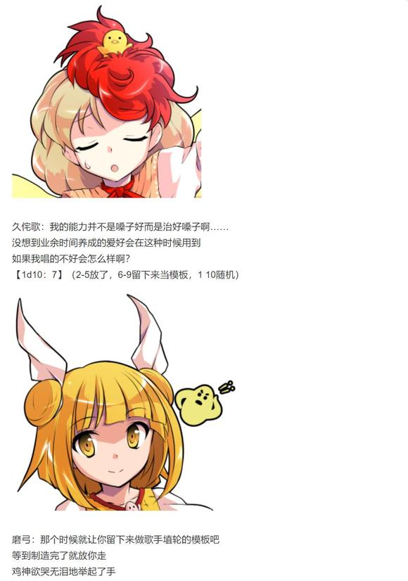

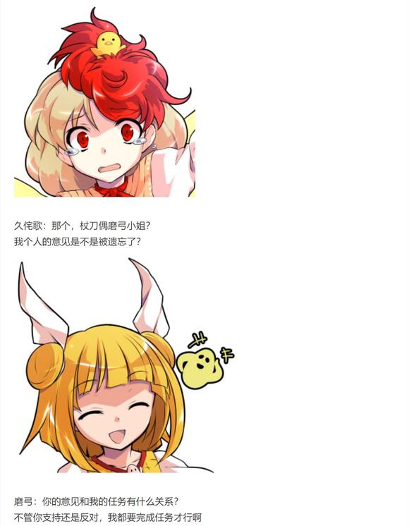

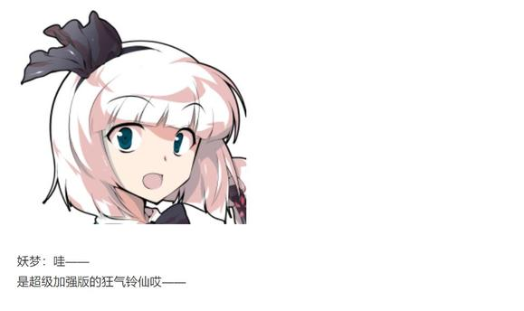

终于得到了一定程度的情报，烈与妖梦要做什么【1d10：8】

1 先去灵长园调查吧

2 就在此时灵梦魔理沙突击

3 ？？？来了（为啥啦）

4 先去灵长园调查吧

5 就在此时灵梦魔理沙突击

6 回头找吉吊去（为啥啦）

7 先去灵长园调查吧

8 就在此时灵梦魔理沙突击

9 回幻想乡吧（为啥啦）

10 大成功/大失败【1d2：2】

烈：（从刚刚战斗时的表现以及对待久侘歌的态度来看，埴轮兵团本身也充斥着难以理解的“非人感”）

（它们应当是为了人类灵而行动，但埴轮眼中的守护又会是什么样子？）

这可不是能用一句“无所谓”带过的问题

妖梦小姐，我们——

已经得到了相当充足的情报，陌生势力的领袖看上去也不是无法交流的人物

此时与同伴冷静地商量好接下来的行动计划后再进行稳妥的行动，就可在一定程度上把握住局势

烈海王的想法没有任何问题

然而，名侦探忽略了一件重要的事情

在大都会中的调查，与杖刀磨弓的见面，与埴轮兵团的战斗，以及刚刚所进行的情报交流

这一连串的突发事件已经消耗了数个小时的时间

而在动物灵入侵这种危害极大的异变发生时

他所熟知的人们，又怎么可能按地不动？

“**界中央的建筑物是指那个吗？”

“那边的古坟？

哈，那的确是个灵园啊”

少女们谈笑的声音从他的身后传来

武者立刻想到了一个糟糕的可能性

他与剑士一同扭头望去

不出所料，巫女与魔法使的身旁正环绕着异样的灵气

被动物灵所凭依的少女笑着向他们打了个招呼

魔理沙：呦，你们进度很快啊

灵梦：需要打倒的敌人，在哪里？

~**界外侧~

吉吊：追加战力，两人

畜 生的奇兵已尽数就位

孤立无援的造形神，你又该如何应对呢？

鬼杰组的组长站立在都市的阴影之中，不急不躁地等待着最终的结果

（本日的更新结束，下一次的更新在周三或周四）

（以下是我的废话）

心惊胆战的交流回与一点都不安定的五面战到此结束

这帮人交流真的好累啊！！！

这次真的是情况最复杂的一次了！！

每次写吉吊小姐的对话都让我绞尽脑汁尤其这次差点就要在四面翻车了啊！！！

已经做好开局撕破脸的准备结果有30加成的妖梦却拼点慢了实在是过草

面对如此异常的情况却依然一脸懵逼的烈海王你是昨晚喝多了吗（悲）

埴轮兵团 动物灵 自机三方的立场和情报都不相同，自机身上偏偏还带着动物灵附身与吉吊能力的双重枷锁，这么一来走向基本上都已经锁死了啊——

然后刚进门大纲就被两个大成功干翻了啊！！

磨弓小姐你好强大！

说真的把动物灵一棍子敲出来你是怎么做到的？你是哪来的静灵庭死神吗？

眼看又要速通了结果妖梦一个大失败又把五面战拉回来了怎么这次老是你整活啊妖梦小姐？？？？？

五面战打得很艰难那是理所当然的，因为磨弓的卡是以“有动物灵加成的自机”这个水准车的——

结果由于大成功中梗动物灵加成没了导致战斗力下降了，这我也没理由硬削磨弓的卡啊？

哎呦喂......按我估计没有加成的妖梦这回应该是在5T前差不多被打出急救，然后6~7T堂堂败北的

结果6T回避了

结果7T反杀了

说真的妖梦你这次是这么回事，怎么次次撕大纲都有你？

而且这是最近的第几次锁血反杀了？你们人均决斗王吗？不到3HP以下不会打架？？？

按道理说6T那里直接输掉才是正常的啊.......

70好感度的磨弓小姐没理由不提供情报，于是战后的情报交流环节写的很多

一直被无视的鸡神小姐......连好感度都找不到机会骰的鸡神小姐......突然开起演唱会的鸡神小姐......

你是搞笑角色吗（悲）

这一次基本找到了大部分的情报，不过某个核心情报还需要烈他们自己去看看

毕竟这里是畜 生 界，怎么可能会有常规意义上的好人呢（笑）

动物灵异变看情况大概还需要更新1~2次——一方面最近写作速度有所下降，另一方面写这帮家伙也着实费脑子

那么本次的更新到此结束，下一次的更新在周三或周四，骰子异变结束后一块发

～碎碎念环节～

睡前翻了下吧友们的评论把我吓一跳(笑)

首先今天的剧情是我到下午才刚刚骰完的，之后的剧情我都还没骰

因此会不会打起来得看骰子的——不一定会出现大家想象中的情况啊(之所以用不一定是因为我后面的剧情还一点都没骰呢)

毕竟大家看到这里也都明白，安科贴子就是这样的啦(笑)

其次，也是更重要的一点

“人类灵为何会出现在畜 生 界”这件事，和“月面战争具体的情况”，“摩多罗与秦河胜的关系”等诸多暧昧设定一样，是一设中【没有直接提及】的

在鬼形兽原作中，没有一个真正意义上的人类灵出现过，而六面道中的杂兵也只是“疑似人类灵”

我们无从得知具体的情况，也没有办法给出明确的结论

Q:换句话说?

A:一如既往，在需要用到的时候会用骰子决定

虽然大概率不会骰不过还是和吧友们说明一下 别把二设当真哦(

另外这次把“袿姬”错打成“桂姬”了，磨弓第一次出场那里还错打成了偶磨弓(悲)已经在被磨弓痛打了请原谅我吧(悲)

~彩蛋~

~动物灵们~

时间回到妖梦与磨弓战斗的时候

水獭灵与牛灵正苦思冥想着破局的对策

牛灵：连最为聪慧的我等都遭遇了意想不到的意外，劲牙组与刚欲同盟的成员恐怕更是希望渺茫

绝不能眼睁睁地看着** 界落入埴轮之手，但我实在想不出什么妙计了

水獭灵，我们现在该如何是好？

水獭灵：回去之后等待着我们的是什么呢

是降薪？处分？还是说，直接被扔到早鬼大人眼前？

牛灵：别放弃希望！

快用你最为擅长的计策想想办法啊！

水獭灵：有了！

我们想想遗书该怎么写吧

说不定吉吊大人看见我们言辞诚恳就放我们一马了，哈哈哈哈哈！

路人埴轮A：它们似乎还想着能回去吼

不如我们直接把这两只干掉吧吼

路人埴轮B：这种组织干部还是留下来吼

说不定袿姬大人能拿来当模板吼

~地狱某处~

动物灵们在人类的背后窃窃私语着

野狼灵：这次进展很顺利，除了吉吊大人的考验外甚至没经历过一场战斗

取得胜利的一定会是我劲牙组的野狼！

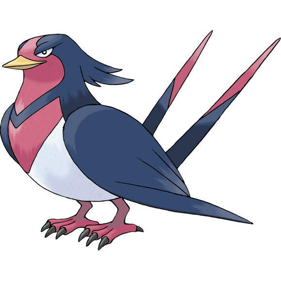

大鹫灵（友情出演 大王燕）：愚蠢的肌肉笨蛋，要不是形势紧急我才不想和你合作

话说为什么你会找上这个巫女啊

野狼灵：我也是红色的，不觉得颜色很相称吗

你找到的人类魔法使看上去和你一点都不搭

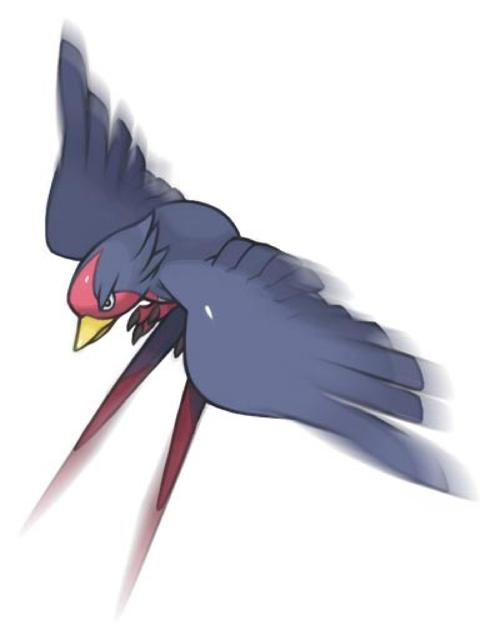

大鹫灵：战斗风格的搭配才是最重要的

谁会像你一样在意颜色啊！

（彩蛋环节结束）

由望远镜海皇 @望远镜300  制作的视频第二季第六集更新啦!

本期的内容是神秘珠异变的结局与彩蛋 大家感兴趣的话就去看看吧!

今天够呛能骰完 大概要等到明晚才能更新了，由于不知道具体情况如何因此时间待定

顺便一提明晚更新到一半大概得去跑步倒垃圾（悲）

由于想写的实在太多了，因此鬼形兽篇在今天的更新结束后大概还要更新一次半～两次才能结束（悲）

顺便一提由于下午得赶飞机回家，一折腾大半天时间就没了，因此今晚更新时间待定——大概7点半到8点半左右，具体取决于我什么时候吃完饭（笑）

大概七点半左右更新

前情提要

被动物灵凭依的灵梦魔理沙前来汇合啦！

~**界~

妖梦：灵梦，魔理沙，你们也来了啊~

单纯的庭师兴高采烈地向好友们挥着手

而埴轮兵长则警惕地举起了兵器

磨弓：这灵气，是愚蠢的野狼灵与傲慢的大鹫灵！

你们居然会求助于拥有肉身的人类？

灵梦&amp;魔理沙：？？？

什么情况？

两人的到来让盘面再次陷入了无法预测的未知状态

情报量的差异，立场的不同让在场的众人齐齐产生了混乱

现场诡异地安静了一瞬——

而后，所有人都在第一时间采取了行动！

水獭灵&amp;牛灵：计划暴露了，动手！

野狼灵&amp;大鹫灵：觉悟吧

被诅咒的偶像！

动物灵们立刻占据了人类的身体开始进攻

磨弓：又是吉吊的计策？！

可恶，全部队听令！

历经百战的埴轮兵长调动起了手下的部队

久侘歌：被动物灵强行控制了身躯吗

可恶，如果我能及时过去提醒的话！

妖梦：哎哎哎？

开打了？

怎么办？

该帮谁啊？

二羽渡神无力干涉战况，优柔寡断的庭师则陷入了犹豫之中

毫无意义的战斗马上就要重启——

烈的决心【1d60：38+40=78】（75以上用假腿确定成功，74以下开战）

而终于掌握了情况的武术家，决定直接将整个盘面掀翻

烈：【The World】，时间停止吧！

——【The World】——

武术家闪身飞到了少女们的身后

烈：真是讽刺

如果你们没被动物灵占据身躯，应该是能做出些应对的

首先是，动物灵的驱逐

武者回忆着埴轮兵长刚刚所使用的技巧

准确地分辨出动物灵的灵气，而后利用魔力的爆发将其瞬间分离——

烈的尝试【1d100：61】（75以上成功）

烈海王无奈地放下了跃跃欲试的拳头

烈：若能多尝试几次说不定能行

但只看了一次就完全重现还是太勉强了

现在就……

他放出花弹打乱了埴轮兵团所射出的利箭，将巫女的御币与魔法使的八卦炉拿到了一旁

最后，带着来自幻想乡的少女们走到了埴轮兵长面前

下一秒，时间开始流动

漫天的箭雨被鲜花阻拦

失去了武器的畜 生却突然出现在了死对头的身前

而唯一掌握了情况的武者，则向埴轮兵长提出了请求——

烈：拜托了，磨弓小姐！

请把她们身上的动物灵驱逐出去！

磨弓的行动【1d100：48】

灵梦的行动【1d100：75-20=65】（烈的妨碍-50，动物灵的强控+30，总计-20）

魔理沙的行动【1d100：53-20=33】（同上，总计-20）

磨弓：交给我吧！

畜 生 必 灭 ！

魔理沙：噗啊——！

紫色的大鹫灵被一棍打了出来

眼疾手快的妖梦立马接过容器，往上一盖

刚欲同盟的骑士就被牢牢关在了特制的囚笼内！

妖梦：好，收服一个~

然而，武者的行动毕竟太过仓促

在没有事先招呼的情况下，能够驱散一只已经是意外之喜

趁着魔理沙被压制时的片刻空隙，正面战斗能力最强的野狼灵操控着灵梦逃了出来！

野狼灵要做什么【1d10:4】

1 总之先干掉埴轮兵长再说（烈出战）

2 干脆直接突袭灵长园！

3 救命啊！！！（为啥啦）

4 总之先干掉埴轮兵长再说（烈出战）

5 干脆直接突袭灵长园！

6 魔理沙：我来助你（你也开始了吗）

7 总之先干掉埴轮兵长再说（烈出战）

8 干脆直接突袭灵长园！

9 现在就是动用伏兵之时（为啥啦）

10 大成功/大失败【1d2：2】

灵梦（野狼灵）：至少要在这里干掉你，被诅咒的偶像！

磨弓：没想到今天要打二连战

早知道就多带些备用武器了——

黄发少女刚准备出战，就被一旁的武术家拦了下来

烈：就算埴轮的修复相对简单，连续战斗对你的负荷也相当之大

妖梦小姐也才刚刚打完一场

这里就交给我吧

魔理沙的理解【1d100：92】（50以下协助灵梦）

金发小女孩头昏脑涨地观察着附近的情况

被关起来的大鹫灵，身形奇特的土偶，情况异常的灵梦

突然使用时停的烈，协助陌生人的妖梦，以及自己刚刚那一瞬间所体验到的“拘束感”——

经验丰富的魔法使立刻得出了结论

魔理沙：草，咱们这次又被当枪使了？！

（麻烦三行以内说明下情况）

烈：（动物灵和埴轮兵团为了抢人类灵而争斗）

（动物灵把人类灵当奴隶，埴轮兵团的目的似乎是保护人类灵）

（动物灵打不过埴轮于是吉吊小姐用能力把我们骗来了）

魔理沙：OK了解

总之我先给大鹫灵来发魔炮有什么事稍后再说

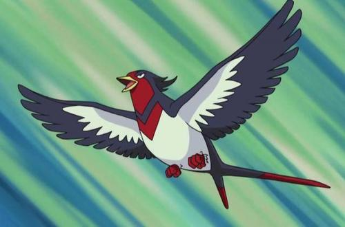

大鹫灵：冷静一下！冷静一下啊人类魔法使！！

烈的准备【1d10：10】（1-6单挑，7妖梦支援，8磨弓支援，9魔理沙支援，10随机）

这里随机是什么【1d10:4】

1 久侘歌：交给我吧！

2 皮克埴轮：嗷嗷嗷嗷嗷啊！

3 皮克本体来了（为啥啦）

4 久侘歌：交给我吧！

5 皮克埴轮：嗷嗷嗷嗷嗷啊！

6 悄悄过来观察情况的吉吊小姐（为啥啦）

7 久侘歌：交给我吧！

8 皮克埴轮：嗷嗷嗷嗷嗷啊！

9 ？？？来了（为啥啦）

10 大成功/大失败【1d2：2】

久侘歌：没想到居然会和幻想乡的巫女在这种情况下开始战斗……

嘛，不过这本来就是我今天的预订任务来着

决定了，就由我庭渡久侘歌祝你一臂之力！

妖梦：哦哦哦，开战了！

烈海王&amp;二羽渡神大战灵梦（非自愿）&amp;野狼灵！

魔理沙：加油啊灵梦！

让黑曜石脑袋看看你的厉害！

烈：这都什么乱七八糟的你俩还在旁边起哄？！

灵梦，虽然我不想和你战斗——

但形势所迫，不得不战了！

灵梦：哎？这啥啊？我不想和烈海王打架啊？

到底怎么回事啊？

野狼灵：拜托了，人类巫女

助我一臂之力吧！

武术家&amp;鸡神对巫女&amp;野狼灵

战斗开始！

烈要使用

【1d2：1】

1 巨阙

2 百辟

【1d2：2】

1 花弹

2 崩拳

【1d2：1】

1 老三样

2 弹幕地狱

战斗！

BGM：少女绮想曲　～ Dream Battle

烈海王

Atk：279（147）

Hp：25（23）

技能

烈 海 王：超越海皇，仍为海王。AtkX1.9，Hp+1。不会陷入异常状态，不会受到驻足，束缚等判定影响，面对所有技能都可以进行【1d100】的破解判定，55以上成功

完全消力：普通攻击以及近战系、弹幕系技能所造成的的最终伤害/2（仅对Atk260以下的对手起效）自身所收到的普通攻击伤害-1，近战系、弹幕系技能伤害-2（仅对Atk261以上的对手起效）

二羽渡神的协力：Hp+2，自身破解判定所需成功值-10，自身所受到的所有伤害-1，每次对对手造成伤害的场合，Atk上升【1d5】点，每次自身受到伤害的场合，Atk上升【1d3】点（最高提升至310点）

天符【伸手及月】（CT1）：一场战斗中只能使用一次，3T内自身每回合Hp+2，战斗骰变为【3d40】，并暂时获得对特殊攻击的耐性。

异红符【巨阙】（CT3）：（近战系）本回合Hp-1，Atk+80，给予伤害+4

魔崩拳（CT4）：（近战系）以魔代气，以武代力，堂堂正正而势不可挡的一击。Atk+90，给予伤害+3，本回合无视所有减伤效果，造成伤害后进行一次【1d100】的爆破判定，50以上对手Hp减少1/4,75以上对手Hp减少1/2。（对拥有特殊攻击耐性的对手，成功标准值变为65/90）

急救拳：一场战斗中只能使用一次，Hp归0后回复1点Hp

贫穷神的加护：自动发动，一天只能使用一次，令对手的大成功转变为大失败

必杀技

纯粹武道（CT5）：怀抱纯粹的武术，心存无色的执着。3T内Atk+70，对对手造成的伤害+3。3T内可对所有攻击进行【1d100】的破解判定，近战系、技巧系技能30以上成功，其余技能40以上成功，必杀技60以上成功

超人【烈海王】（CT6）： Atk+675，给予伤害X4，其后2T内Atk+25，回避概率翻倍

武符【梦幻斗舞】（CT7）：无法回避/破解/防御，本回合自身无敌，给予伤害X2，进行一次【1d100】的反击判定，30以上可对对手的攻击进行反击

秘术【天文密葬法】（CT8）：制造虚假的月亮，削弱妖怪的力量，3T内战斗环节中，妖怪对手的Atk变为与自身最终结算后相同，自身的战斗骰变为【2d100】但同时无法使用破解，无法回避/破解/防御，给予伤害X2/引导宇宙的力量，发出轨道诡异的大量弹幕轰击 无法回避/破解/防御 Atk+900，给予伤害X6

博丽灵梦

Atk：300（255）

Hp：19

技能

博丽的巫女：异变发生时Atk+20，不会陷入异常状态，不会受到驻足，束缚等判定影响，拥有对时停等特殊攻击的耐性，对所有技能均可进行【1d100】的回避判定，50以上成功。自身所受到的所有伤害-2。

野狼灵凭依：Atk+25，Hp+3，自身所给予的所有伤害+2

神技【天霸风神脚】（CT3）：（近战系）连续使出威力强大的倒挂金钩踢，Atk+75，给予伤害+2

宝具【阴阳鬼神玉】（CT4）：（弹幕系）投掷巨大的阴阳玉，对对手造成必中的【3d3】点伤害

神技【八方龙杀阵】（CT4）：（技巧系）以不可思议的力量束缚对手的行动，本回合自身无敌，给予伤害+3

回灵【梦想封印　侘】（CT5）：（弹幕系）放出大量灵符令其自动追击对手，3T内对手Atk-65，每回合受到3点伤害（被破解的场合仅给予伤害效果消失）

必杀技

大结界【博丽弹幕结界】（CT6）：制造没有境界的世界，营造二重的结界。Atk+750，造成伤害X4

神灵【梦想封印　瞬】（CT7）：博丽巫女的代名词，将对手封印在只属于灵梦的时空之中。无法回避/破解/防御，Atk+800，给予伤害X5，本回合自身无视所有特殊攻击/意志判定，并进行一次特殊攻击【封印】：进行一次【1d100】的封印判定，对妖怪成功值标准30，对妖怪以外的对手成功值标准为50，判定成功的场合，本回合对手无法进行普通攻击、无法造成任何伤害。（面对拥有特殊攻击抗性的对手时，成功值变为60/90）

【梦想天生】（CT8）：博丽灵梦的究极奥义，化作无法触及的存在，以阴阳玉自动攻击对手。无法回避/破解/防御，Atk+900，造成伤害X6，本回合无敌。

T1

烈：我可不敢对你手下留情

符卡宣言

天符【伸手及月】！

银白色的月亮浮现在了阴暗的天空之中

永远亭的武者一跃而起，攻向了对面无法自控的巫女！

磨弓：好美，这是什么？

他是地上的艺人吗？

魔理沙：对对对

这位是我们那边的知名艺术家

说学逗唱样样都会，风花雪月无所不通

打架的时候突出一个漂亮，要的就是观赏性！

烈：你可歇歇吧你！

烈的攻击【279+3d40：48=327】

灵梦的攻击【300+1d100：63=363】

灵梦（野狼灵）：嗷呜！

我可是最速最强的劲牙组尖兵

有了肉体的我可不会输给你！

磨弓：这不是完全不行吗？！

为什么你们会让艺人上前线啊？！

开场的强袭被轻巧避过

携带着可怖灵气的符咒在最近的距离下射向了武者的面门！

烈的受伤【1d10：10】（消力-1，二羽渡神协力-1，野狼灵+2抵消）

1 回避

2 小伤害

3 小伤害

4 中伤害

5 中伤害

6 大伤害

7 大伤害

8 特大伤害

9 特大伤害

10 大成功/大失败【1d2：1】

大成功！

烈的反击【1d10：9】

1 回避

2 小伤害-2

3 小伤害-2

4 中伤害-2

5 中伤害-2

6 大伤害-2

7 大伤害-2

8 特大伤害-2

9 特大伤害-2

10 大成功/大失败【1d2：2】

Hp：19-4+2=17

然而

飞射而来的符咒被牢牢夹在了武者的双指之间

烈海王抬手一抖，巫女的攻击便被其返还了回去！

烈：破！

Atk上升【1d5：4】点

现在的Atk：279+4=283

久侘歌：不愧是敢于前往地狱之人，果然实力了得

加油！加油！血战到底吧！

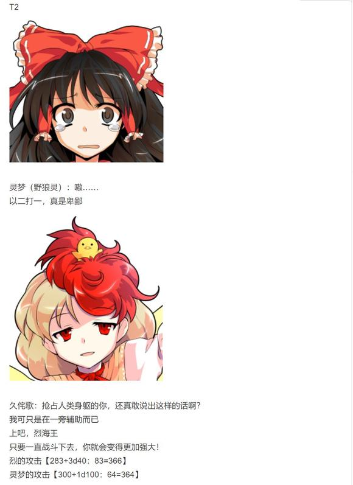

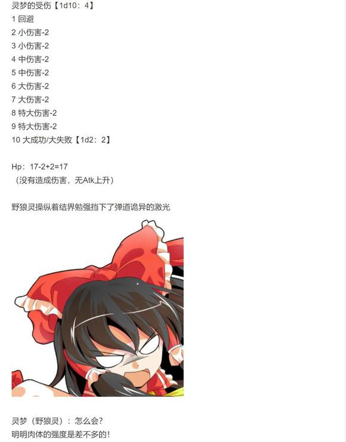

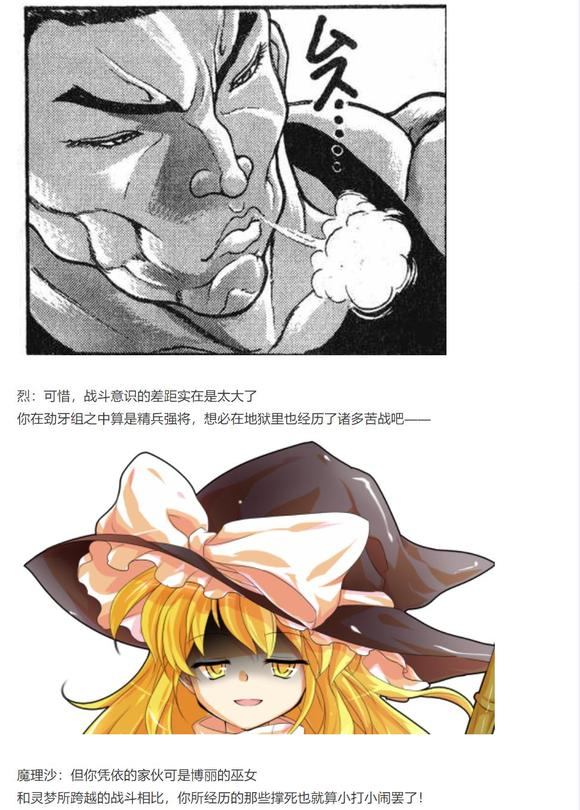

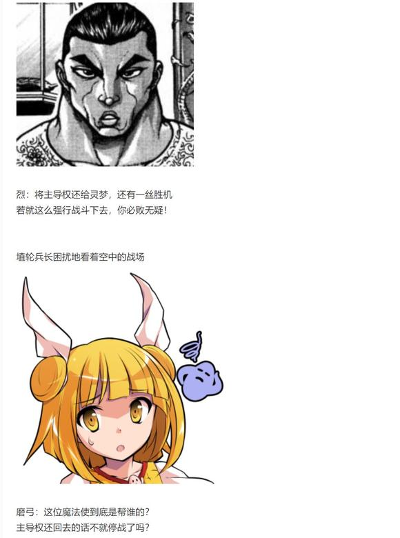

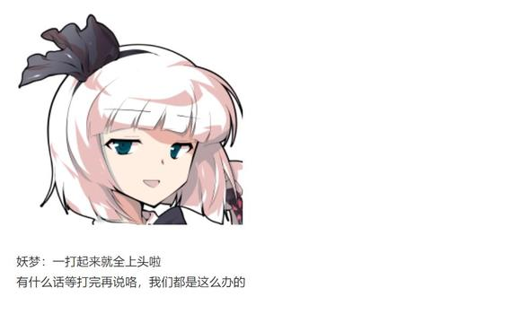

T3

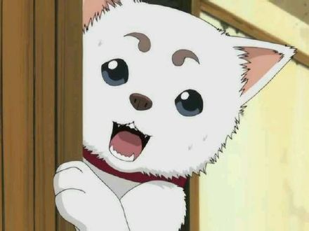

野狼灵：嗷呜……

拜托了，人类巫女！

请你帮我一把吧！

在两人一唱一和的忽悠之下，头脑简单的野狼灵立马败下阵来

灵梦：真没办法交给我吧——你以为我会这么说吗？！

第一个要退治的就是你这混账！

魔理沙：（上~钩~了~）

（剩下的交给你处理，我看戏去咯）

烈：（多谢配合，魔理沙）

先别着急，灵梦

战斗都开始了索性就打到底吧

灵梦：你要不要照照镜子看看自己现在笑的有多开心？

烈：毕竟平常实在是没理由跟你战斗

难得出现这么一次机会，我可一定得把握住才行

符卡宣言 异红符【巨阙】！

Hp：25-1=24

灵梦：真受不了你们这帮战斗狂

异变结束后请我吃饭啊！要正餐！

符卡宣言 神技【天霸风神脚】！

烈的破解【1d100：22】失败

灵梦的回避【1d100：77】成功！

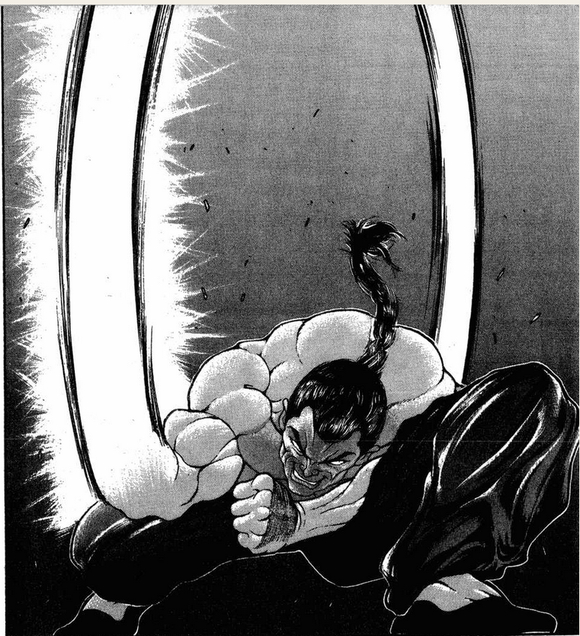

赤色的巨剑挥出，却只斩断了停留在原地的残影

武术家立刻抬手防御

因为他知道，自己已然失去了先机！

烈的攻击【283+3d40：52=335】

灵梦的攻击【300+75+1d100：82=457】

灵梦：错了，在下面

巫女所瞬移的方位并非是他所预料的背后，而是同样便于突袭的侧下方

清脆的破空声响起，一记漂亮的倒挂金钩刚好命中了烈海王的下巴

以此一击为开端，博丽巫女连续使出的升天脚将对手一口气踢向了灰暗的天空之上！

黑白色魔法使兴高采烈地拍着手

魔理沙：好！就该这么打！

这位埴轮小姐，一会打完之后给灵梦身上的野狼灵也来一棍子吧，拜托你了

磨弓：哦，啊，嗯？

好，好的

你到底是站那边的？

烈的受伤【1d10：8】（消力近战系-2替换普通攻击受伤-1，二羽渡神-1，野狼灵+2，总计-1）

1 回避

2 小伤害+2-1

3 小伤害+2-1

4 中伤害+2-1

5 中伤害+2-1

6 大伤害+2-1

7 大伤害+2-1

8 特大伤害+2-1

9 特大伤害+2-1

10 大成功/大失败【1d2：1】

Hp：24-4-2+1=19

Hp：19+2=21

Atk上升【1d3：3】点

现在的Atk：283+3=286点

博丽的巫女把御币扛在肩头，悠哉地注视着武者落地时所激起的大片尘土

灵梦：状态不怎么样嘛

你是不是也太久没打架了，烈海王？

烈：咳咳

速度太快，没能成功消力……

真是大意了！

T4

天符效果结束

灵梦：野狼灵的力量确实不差

当心被我一回合干掉咯！

符卡宣言 宝具【阴阳鬼神玉】

符卡宣言 神技【八方龙杀阵】！

烈：彼此彼此，我这边也有久侘歌小姐帮忙

接招 魔崩拳！

烈的破解

宝具【1d100：56】成功（标准值55-10=45）

神技【1d100：62】成功（标准值55-10=45）

灵梦的回避【1d100：44】失败！

烈的受伤：3+2-2-1=2（必中伤害3点）

Hp：21-2=19

巨大的阴阳玉被一拳击飞，束缚行动的结界却打在了空处

在二羽渡神的加护之下，武者瞬间便将巫女的招式悉数破解！

野狼灵：区区一只鸡竟然？！

久侘歌：就算是鸡，我也是二羽渡之神

大概，比起单单凭依在人类身上的野狼

我要厉害得多了！

烈的攻击【286+90+1d100：67=443】

差值大于100自动胜利

灵梦：糟，这招——

烈：你防不住！

一击堂堂正正的崩拳击出

用于防御的结界被轻易击溃！

灵梦的受伤【1d10：6】（魔崩拳无视减伤）

1 回避

2 小伤害+3

3 小伤害+3

4 中伤害+3

5 中伤害+3

6 大伤害+3

7 大伤害+3

8 特大伤害+3

9 特大伤害+3

10 大成功/大失败【1d2：1】

Hp：17-3-3=11

Atk上升【1d5：3】

Atk：286+3=289

爆破判定【1d100：15】失败

交叉双臂的巫女勉强接下了武者的重击

灵梦：你还真不知道手下留情哦

烈：你刚刚连环踢的时候也没放水啊

妖梦：精彩的反击

胜负难料啦！

T5

灵梦：很有兴致嘛

那我也认真上了

符卡宣言 回灵【梦想封印　侘】！

纯粹武道发动

烈：战斗时自然应当全力以赴，这是最基本的礼仪

让你见识一下，最为纯粹的【武】！

烈的破解【1d100：27】（成功值40-10=30）失败

烈的受伤：3+2-2-1=2

Hp：19-2=17

Atk上升【1d3：2】点

Atk：289+2=291

自信满满的烈海王却在此时遇到了意料之外的阻碍

那海量的灵符看似混乱，却暗藏玄机

以暴力击溃就会立刻被新增的灵符阻拦

用巧劲破解却看不出其运转活动的逻辑

武者被牢牢封印在了这方圆数寸的空间之内——

而无拘无束的巫女小姐，则坏笑着抽出了她的御币

灵梦：已经品鉴过足够多次了

接近战是你最为擅长的领域，超火力的大招对轰你也不差

但是难以应付高持续性的远程骚扰攻击，这就是你身为武术家的弱点所在

不巧的是，这可是我的长处哦！

烈的攻击【291+70-65+1d100：70=366】

灵梦的攻击【300+1d100：35=335】

烈：大意了，灵梦

武艺百般，此乃飞刀！

就在巫女洋洋得意的时候

烈海王已经发现了灵符运转之中的一道空隙

这刹那间的破绽无法令他突出重围——

但投掷一把飞刀却已经绰绰有余了

赤色的匕首撕裂了灰白的符纸，向着博丽的巫女刺去！

灵梦的受伤【1d10：1】

1 回避

2 小伤害-2+3

3 小伤害-2+3

4 中伤害-2+3

5 中伤害-2+3

6 大伤害-2+3

7 大伤害-2+3

8 特大伤害-2+3

9 特大伤害-2+3

10 大成功/大失败【1d2：1】

红白的巫女略一偏头，就躲过了飞射而来的匕首

灵梦：真遗憾，打空啦~

磨弓：她是你们的同伴吧？

就算是日常切磋，对同伴用兵器也太——

魔理沙：安心，我不用看都知道是钝刀子

八成没开刃，指不定还是圆头的

