T6

烈的受伤：3+2-2-1=2

Hp：17-2=15

Atk上升【1d3:2】

Atk：291+2=293

灵梦：要用白莲的超人术？

这招我可见过很多次了哦

烈：但我最为熟练的还是这招

在你面前用弹幕地狱，我可不会犯这种错误

符卡宣言 超人【烈海王】！

异红符【巨阙】发动

Hp：15-1=14

灵梦：果然还是近身战

符卡宣言 大结界【博丽弹幕结界】！

神技【天霸风神脚】发动

烈的破解

神技【1d100：34】成功

大结界【1d100：35】（成功值60-10=50）失败

灵梦的回避

异红符【1d100：40】失败

超人术【1d100：79】成功！

究极秘神的弹幕地狱，是武者至今为止所习得的最强杀招之一

但面对弹幕规则的制定者，采用她最为熟悉的攻击形式绝非明智之举

凭借大魔法所提供的超人之力拉近距离，在最大程度发挥武术的接近战在战术上才是正确的决定

若以常理而言，的确如此

只可惜，他所面对的对手是无法用“一般论”套用的——

不讲道理的天才

灵梦：都说了我跟白莲打过好几次了~

这种程度的超人术轻轻松松就能闪过去啦！

武者所化的流星没能取得任何成果

因为红白色的巫女早已预判到了他的轨迹

二色的札弹如花般盛开，弹幕所及的范围内出现了一条无形的界限

想要探身追逐，却发现巫女逐渐远去

想要抽身回避，却发现弹幕自截然相反的方向追来

结界内外的空间骤然反转——

无境界可言的二重世界，于此构建！

灵梦的攻击【300+750+1d100：49=1099】

差值大于100自动成功

烈的受伤【1d10：6】（消力-1，二羽渡神加护-1，野狼灵+2，神技被破解无加成）

1 回避

2 回避

3 小伤害X4

4 中伤害X4

5 中伤害X4

6 大伤害X4

7 大伤害X4

8 特大伤害X4

9 特大伤害X4

10 大成功/大失败【1d2：1】

Hp：14-3X4=2

七彩的光华照亮了黑暗之中的都市

随后，博丽的巫女飘然落地

妖梦：我从以前就很奇怪了

灵梦的结界术到底是怎么回事啊？

完全看不懂她做了什么

魔理沙：“结界就是事物的境界线，而其变成二重的意思就是和没有境界的世界一样了。如果能发现潜藏于各处的空间的缝隙的话，就能够张开结界。”

你去问也只能得到这种只有她和紫能听明白的讲述，我是放弃搞明白了

话说回来，好久没看烈海王这么吃瘪了

这次大概率是灵梦的胜利呢……

磨弓：他已经输了吧？

看不出他取得胜利的可能性

魔理沙：别急着下结论

不讲道理的招式，那家伙也会不少哦

烈海王自尘土中爬了起来

烈：完全被看破了

不愧是你，灵梦！

Atk上升【1d3：2】

Atk：293+2=295

久侘歌：不要在意这点小伤

既然还有力量，就要战斗到底！

T7

武术家摆出了久违的起手式

烈：你说的没错，灵梦

看来我真是懈怠了

怎能脱离武术的怀抱呢！

符卡宣言 武符【梦幻斗舞】！

烈的受伤：本回合无敌

灵梦：那就看看你能否脱离我的封印吧

符卡宣言

神灵【梦想封印　瞬】！

红白色的巫女以看似迅捷，实则缓慢的速度悠然前进

战场范围内的空间变为了无法理解的扭曲状态

明明方才还停留在原地，下一秒便出现在了武者的身后

明明只是笔直向前地飞行着，却在实际上达成了包围的效果

巫女甚至无需亲自出手

因为无视物理法则的光弹，已然飞向了那受困于结界之中的对手

妖梦：你看，又是这种莫名其妙的招式

她怎么做到的啊？

魔理沙：按我的理解就像身处两面镜子之间的无限轮回世界一样，不过谁知道她具体到底是怎么做的

在这里被封印的话就没有希望了……

封印判定【1d100：4】失败

灵梦的攻击【300+800+1d100：100=1200】

反击判定【1d100：81】成功！

在这无限往复的世界中，一切的行动都没有意义

无法判断对手的行动

无法捕捉对手的身形

无法躲避对手的攻击

既然如此——

烈：就将镜面本身打破吧！

他伸手探向了看似空无一物的方位，猛然发力一握！

一张破损的符咒不知何时出现在了他紧握的右拳之中

构成结界的术式遭到了预想之外的损毁，镜面之内的循环短暂消失了一瞬

武者立刻脱身而出

红白色的巫女此刻，就在他的面前！

魔理沙：成功了！

灵梦的受伤【1d10：9】

1 小伤害-2+3（无法回避）

2 小伤害X2-2+3

3 小伤害X2-2+3

4 中伤害X2-2+3

5 中伤害X2-2+3

6 大伤害X2-2+3

7 大伤害X2-2+3

8 特大伤害X2-2+3

9 特大伤害X2-2+3

10 大成功/大失败【1d2：1】

Hp：11-4X2-3+2=2

Atk上升【1d5：1】点

现在的Atk：295+1=296

博丽巫女倒飞而出，一路砸飞了无数手忙脚乱的埴轮

灵梦：厉害

发现弱点了吗

烈：寻找术式之中的“平衡点”，并在合适的时间将其击溃

对于我的武术而言,此事并不困难

久侘歌：你也是个毫不逊色于她的过分的家伙吧.......

T8

纯粹武道效果结束

梦想封印　侘 效果结束

烈：总算是战斗到这一步了

让我看看你的绝技吧，博丽灵梦！

灵梦：所以说你们这些筋肉脑啊......

博丽的巫女闭上双眼，缓缓舒了口气

下一个瞬间

博丽灵梦“消失”了

灵梦：上了

【梦想天生】

神技【八方龙杀阵】发动

空间的错位，境界的翻转，无限的结界

她此刻所展现的能力，与先前的诸多技巧相比，根本不是一个等级

尽管可以观察，却无法靠近

尽管存在于此，却无法触及

这甚至无法称之为符卡了——

因为这是在真正意义上立于不败之地的，只属于博丽灵梦的能力

烈：期待已久了

就是这个，我想战胜的就是这个！

符卡宣言 秘术【天文密葬法】！

魔崩拳发动

在场的全员于瞬间陷入了无光的黑暗

因为大都会全境都被笼罩在了武者构建的密室之中！

诡秘的宇宙之力迎向了蕴藏着可怖魔力的巨大阴阳玉

巫女与武者在这个瞬间，同时用出了自己的全力！

烈的破解 神技【1d100：48】成功

灵梦的回避 魔拳【1d100：43】失败

烈的攻击【296+25+90+900+1d100：57=1368】

灵梦的攻击【300+900+1d100：78=1278】

烈：就算在斗争中胜利了，却也依然无能为力

这可真是，如同字面意义一般的

无敌的能力啊

灵梦的受伤：本回合无敌（梦想天生效果）

武术家叹息着抽回了手

全力以赴的他的确突破了灵梦的攻击

但即使如此，他也无法取得胜利

正如他所说的一样

无法触及的对手，又该如何战胜呢？

灵梦：都说了是犯规符卡啦~

那么，趁着最后的一点时间

符卡宣言 宝具【阴阳鬼神玉】

巫女小姐狡黠地眨了眨眼

挂饰般的阴阳玉在她手中忽然放大，并从正面击中了无力回避的武术家！

烈的破解【1d100：37】（标准值55-10=45）失败

烈的受伤【3d3:7-2+2-1=6】

Hp：2-6=0

Atk上升【1d3：1】

Atk：296+1=297

烈海王使用了急救拳

Hp：0+1=1

魔理沙：哈哈哈哈哈哈哈哈！

你也有今天啊！

感觉如何啊？被弹幕补刀的滋味？

武术家苦笑着做完了急救

烈：呼

我下次还是提前放弹幕吧

灵梦：这样就把你最后的底牌打出来了

下回合一决胜负！

T9

正如红白色的巫女所说的一样

双方均已使出了自己的全力

双方都已被逼到了最后一步

大家都暂时无力用出那些奥秘的秘术了

于是，战斗进入了最为简单易懂的阶段

能够更先一步触及到对手的人，就能取得胜利

黑白色的魔法使看着同时出手的两人

不知为何，她想起了过去某日在山顶的神社所看到的游戏

似乎是叫做“网球”吧？

双方挥舞着怪异的拍子，相互击打着黄色的球体

那时，似乎发生了一件有趣的事情

魔理沙：啊……

弹起来了

妖梦：什么弹起来了？

金发小女孩喃喃自语着

她想起了那日所看到的景象

仅仅出于偶然，网球被打向了球网的边缘

它在场地的中央高高弹起——

魔理沙：因触网而弹起的网球

最终会落到哪一边呢？

灵梦：符卡宣言

神技 【天霸风神脚】！

烈的破解【1d100：22】失败

明明双方是在同一时间做出的行动

但夺得先机的，却是红白色的巫女

无可奈何

真是令人无奈的事

他不得不用出了自己的最后一份魔力——

烈：符卡宣言

异红符【巨阙】！

Hp：1-1=0

灵梦的回避【1d100：89】成功！

然而，武者早已错失了良机

炽热的血液在他手中形成了粗略的形状

与此同时，巫女已经来到了他的身前

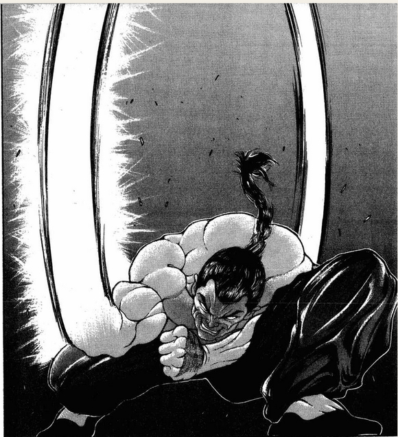

烈的攻击【297+1d100：99=398】

灵梦的攻击【300+75+1d100：86=461】

他立刻变招，以勉强成型的兵器直劈而下

但对手凌厉的踢击，却先一步击中了他的心口

烈的受伤【1d10：2】

1 回避

2 小伤害+2

3 小伤害+2

4 中伤害+2

5 中伤害+2

6 大伤害+2

7 大伤害+2

8 特大伤害+2

9 特大伤害+2

10 大成功/大失败【1d2：2】

Hp：0-1-2=0

真是无可奈何

真的，只差一点就能躲过去了

如果在同时出手的那一瞬间，是他夺得了先机……

战斗的结果，是否会不同呢？

脑中思考着刚刚的细节，武术家缓缓向后倒去——

但武者尚未跌倒在地，眼前的少女就及时伸手把他拉了起来

灵梦：“野狼灵的力量挺厉害的，放在平常的话我已经输了”

这种话，我是不会说的

这次的弹幕决斗是我赢了

异变结束后记得请我吃饭哦！

真是不服气啊

但是，看到少女那一如既往的笑容

却又觉得，纠结这些也已经没什么所谓了

烈海王叹了口气，并笑着点了点头

烈：这次是我输了

等回幻想乡之后请你吃大餐！

红白色的巫女飞向了旁观的埴轮兵长

黑白色的魔法使走到了武术家的身旁

魔理沙：结果谁都无法知道……

因触网而弹起的网球，究竟会落到谁的场地上

大概只有灵梦才知道

因为“幸运的女神”，永远都站在她那一边啊

烈：哪有这般复杂

不过是技量不足罢了

好友们看着野狼灵被一棍打飞的凄惨身姿，有一搭没一搭地聊着刚刚的战斗

魔理沙：你觉得是技量的问题？

烈：尚若技术已至巅峰

网球又怎会触网而起？

战斗结束

胜者 博丽灵梦！

例行跑步倒垃圾洗漱，十点左右继续

【1d30：22】分钟后

自机们要做什么【1d10:1】

1 先去灵长园看看吧

2 总之先开个会吧

3 灵梦：回幻想乡吧（为啥啦）

4 先去灵长园看看吧

5 总之先开个会吧

6 妖梦：总之先把吉吊揍一顿（为啥啦）

7 先去灵长园看看吧

8 总之先开个会吧

9 ？？？来了（为啥啦）

10 大成功/大失败【1d2：1】

修整完毕的自机们正讨论着接下来的行动

灵梦：累死我了，异变开始后的第一场是和队友打的这什么事啊

总之现在先去灵长园看看吧

妖梦：我们先去把吉吊八千慧打一顿不好吗？

烈：这个等正事办完再说

我们这次的目的是解决动物灵异变

而这异变出现的缘由，正是动物灵与埴轮兵团的斗争

唉，可就算搞明白到底发生了什么，动物灵也不会乖乖退去啊……

魔理沙：别想那么多

按我的经验来看，去灵长园逛一圈看看具体情况肯定是没错的

之后怎么做就随机应变，总之先前进再说！

灵梦：你只是单纯的好奇吧？

算了，我也赞同这个观点

有什么事到时候再说！

磨弓：几位如果想来灵长园参观，就跟我一起前行吧

与畜 生的都市不同，现在的灵长园可是真正意义上的乐园

黄发的少女与埴轮们带领着真正的人类走向了它们的家园

那是由一片锁孔形状的森林所围成的，宛如古坟般的区域

穿越郁郁葱葱的外景，走过长满草木的土地

真实的灵长园，终于出现在了他们的面前

~灵长园~

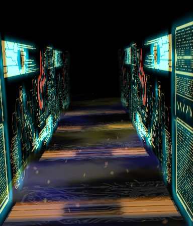

井然有序的电子线路构成了这城市的每一个角落

如同显示屏般的巨大构造物在街道上闪烁着荧光

淡蓝色的光辉在其上投射出了细致而规整的内容

但这些精美的图文却根本来不及让人细看，便被更加夺人眼球的画面在下一秒替换而过

来自地上的人们目瞪口呆地看着这充满科技感的城市

这一次，哪怕是烈海王也不由得露出了震惊的表情

因为埴轮们建造的灵长园已经远远超出了现代都会的范畴——

这是只存在于人类想象之中的，未来都市

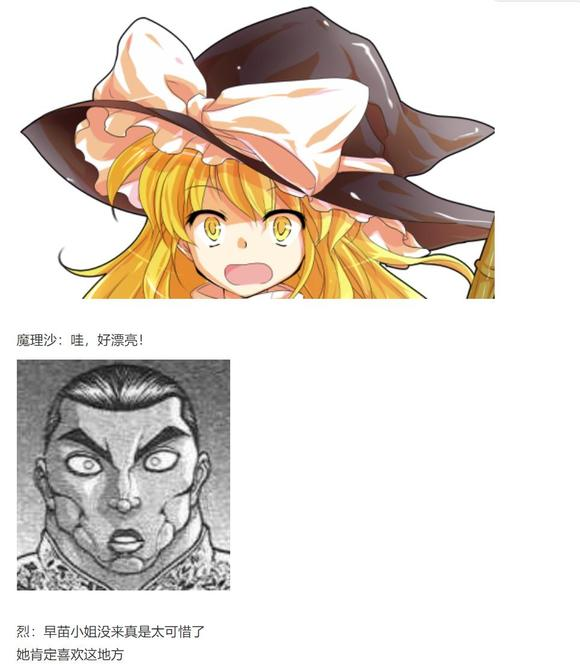

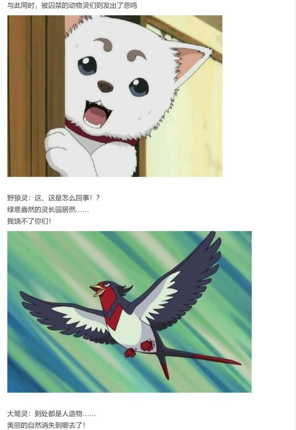

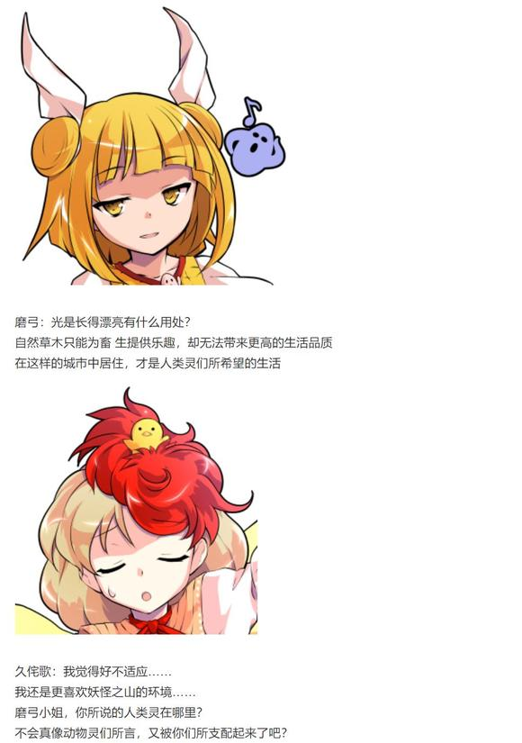

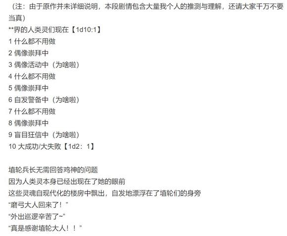

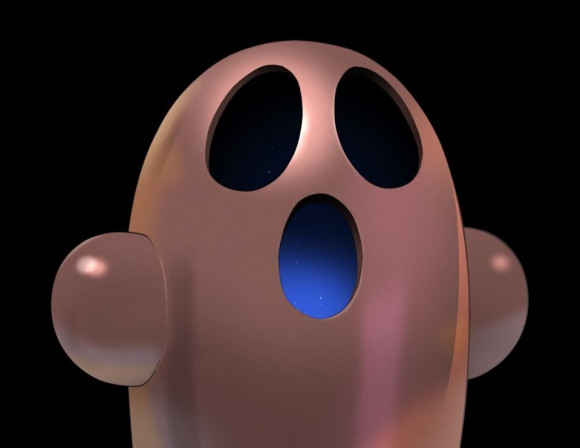

路人埴轮A：外界状况一切正常吼！

路人埴轮B：** 们策划了卑鄙的计策，但被磨弓大人瞬间就击溃了吼！

黄发少女微笑着拍了拍手

磨弓：我已经为大家寻来了擅长歌唱的少女

经过一段时间的筹备之后，灵长园的第一场演唱会就可以开始举办了

如果还有什么需求，只要向身边的埴轮诉说即可

埴轮兵团会永远帮助你们的！

“真不愧是磨弓大人！”

“哦哦，万分感谢！”

“万事就拜托你们了！”

“埴轮大人，我家的显示屏好像有点障碍……”

“埴轮大人，我想换个新的沙发……”

“埴轮大人，我想更换门口那片区域的颜色……”

“我该怎么办啊？”

灵魂们激动地对埴轮兵长表达了它们的感激之情

但转眼之间，它们又对身边的埴轮诉说起了最近遇到的困难

路人埴轮C：收到了吼！

大家没有必要亲自动手

我们会制定相应的计划

交给我们就可以了！

妖梦：和冥界悠闲的灵魂不太一样，这里的灵都很有种……“闲不下来”的感觉

磨弓：你看的很透彻，妖梦小姐

那是过去的经历所带来的后遗症

被畜 生视为奴隶的人类灵们，在这灵长园中无休止地重复着精细的工作

即使已经被我等解放，但这残酷的奴役依然在它们的灵魂中留下了痕迹

他们没法休息，换句话说就是勤劳

黄发少女遗憾地摇了摇头

磨弓：劳动已经成为了他们的本能

被“弱肉强食”的畜 生 思维所毒害的人类们，甚至将自己都看作了可以利用的资源的一种

将自己的存在投入名为“畜 生 界”的精密机械之中，为了其正常运作而献上一切——

这是多么悲哀，又多么残酷的事情啊

灵梦：但我现在倒是没看出他们多惨

这不是过得很幸福吗

磨弓：因为在我等埴轮出现之后

现在的他们，终于不需要再这样做了

埴轮兵长笑着告别了幸福的灵魂们，带着来自地上的人们逐渐深入了城市的中心

她抬手一一介绍着人类们所看到的一切——高效的设施，华美的建筑，舒适的居所，洁净的环境——介绍着这座不可思议的，如梦境般的都市

她带着人类们走进了大厦外侧的升降机

看着刚刚走过的街道在脚下逐渐缩小，变为模糊不清的黑影

磨弓：我们驱散了凶狠的动物

我们建造了高耸的楼房

我们修补了破损的道具

我们提供了生活所需的一切资源

不久的将来，我们也能满足人类的精神需要

在袿姬大人的带领之下，我等埴轮将草木丛生的囚笼改造为了名副其实的乐园！

机械的运转停止了

黄发的少女带着访客们来到了大厦的楼顶

于是，他们终于可以将这广阔的灵长园尽收眼底

她微笑着探出了双臂，仿佛在拥抱着这所属于人类的美丽城市

她骄傲地挺起了胸膛，居高临下地看着黑暗中闪烁的耀眼光芒

磨弓：袿姬大人创造了完美的世界

而我们将人类从一切无意义的劳役中解放而出——

让他们得到了，真正的自由！

烈的察觉【1d70：3+30=33】（原标准75，先前已经有所怀疑，成功标准值降至50）

你察觉了什么啊【1d10：10】

1 这很幸福啊，我们回去吧

2 埴轮兵团的生产力真高啊

3 袿姬大人是造物主吗（为啥啦）

4 这很幸福啊，我们回去吧

5 埴轮兵团的生产力真高啊

6 和埴轮兵团合作与畜 生战斗吧（为啥啦）

7 这很幸福啊，我们回去吧

8 埴轮兵团的生产力真高啊

9 你在说谎骗我（不对啦！）

10 大成功/大失败【1d2：2】

草，这里大失败是什么【1d10:2】

1 动物灵的绝地反击

2 你在说谎骗我

3 袿姬大人来啦（为啥啦）

4 动物灵的绝地反击

5 你在说谎骗我

6 吉吊小姐的突袭（为啥啦）

7 动物灵的绝地反击

8 你在说谎骗我

9 完全相信了埴轮兵团（为啥啦）

10 大成功/大失败【1d2：2】

烈：——磨弓小姐，你在骗我吧？

磨弓：？

烈：这里可是畜 生 界

你们怎会这般不计回报的帮助与己无关的人类灵？

难不成，我们所看到的一切只是那位袿姬大人故意设置的表演

人类灵事实上是处于你们的控制之下……？

磨弓的怒气【1d50：18+50=68】（大失败+50，高于好感度70开始敌对行动）

埴轮兵长很是无奈地叹了口气

磨弓：我们所做的只是听从袿姬大人的指示，并帮助孤立无援的人类灵

若想利用人类的话，直接以武力支配就好

我们为何还要为他们做这般多的事情？

你怎会想出这样的阴谋论……难道说，你也生活在相当可怕的环境中？

金发小女孩一把捂住了武术家的嘴

烈：呜呜呜呜呜呜呜呜呜呜——

（我还没说完我觉得很有可能是——）

魔理沙：啊哈哈哈他只是大脑一时石化了而已不要在意啊磨弓小姐！

（闭嘴啦虽然我也觉得有点说不上来的不对劲但你找的点明显就不对啊！！！）

灵梦的超直觉【1d50：27+50=77】（60以上察觉不对，75以上成功）

灵梦无视了一旁吵闹的友人们

她将半个身子倚在楼顶边缘的护栏上，静静地俯视着这座不可思议的城市

看着那些闪闪发光的建筑，与在街道上来来往往的埴轮们

高空中流动的空气形成了一阵劲风，将巫女黑色的长发吹起

她并未回头，就这样背对着众人缓缓张口

灵梦：真是个美丽的城市

只不过，我还有些想不通的地方

磨弓：你想知道什么？

打扮古朴的巫女在未来都市的楼顶上转过身来

她看着同样身穿古代铠甲的埴轮，提出了自己在刚刚所察觉的问题

灵梦：在你们所建造的这个完美无缺的世界里

人类，还需要做些什么呢？

磨弓的理解【1d100：42】

埴轮兵长有些困扰地歪了歪头

磨弓：不好意思

我没能理解你的意图

灵梦：我要维护幻想乡的稳定与解决异变

魔理沙平时会接委托帮大家解决困难，自己也会去研究新的魔法

妖梦需要管理白玉楼的庭院，帮幽幽子做饭，同时也是剑术教习

烈海王要负责永远亭的伙食，杂务，偶尔出来破案，并锻炼自己的武术

人里的居民们会务农、开店、编书，所有人都有着自己需要做的事情

而灵长园的人类们，到底需要做些什么？

磨弓：……

不知道，我从来没有考虑过这个问题

真要说的话，是贡献信仰吧

妖梦：你们也和神子白莲她们一样，在建立宗教吗？

磨弓：也不对

袿姬大人也没有强行要求人类灵的信仰，他们只是自发开始了崇拜

我想想——

啊，真是的，我差点就被你绕晕了

黄发少女一敲手掌，笑着给出了她的答复

磨弓：人类什么都不需要做

因为我们会完成一切的！

诡异的安静持续了【1d30：23】秒钟

在场的众人企图理解这句话背后的含义

最终他们发现了

没有任何深层次的寓意，埴轮只是说出了实情而已

魔理沙：喂喂，这也太古怪了吧

如果将一切都交给埴轮来完成......

烈：那灵长园的人类灵，究竟还有何存在意义？

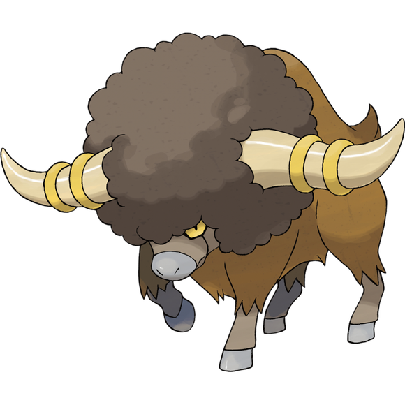

牛灵：地上的武者呦，现在你应当可以理解了

比起自己的意愿，更加信任埴轮的指挥

将自己手头的所有工作，全部交给道具完成

人类灵似乎觉得这样的生活很幸福

但在我们眼中，这无外乎将他们所制造的道具当做了神明一般崇拜

这正是埴轮对人类灵进行的最为可怕的支配

野狼灵：在我等的社会之中，实力弱小的人类灵的确是不自由的奴隶

但在埴轮管辖下的灵长园，这些丧失了所有存在意义，没有任何思想可言的人类灵

难道就不是奴隶了吗？！

自机们要做什么【1d10:3】

1 总之先开个会吧

2 先去拜访袿姬大人吧

3 申请场外援助吧（为啥啦）

4 总之先开个会吧

5 先去拜访袿姬大人吧

6 这事管不了了，打道回府吧（为啥啦）

7 总之先开个会吧

8 先去拜访袿姬大人吧

9 先听久侘歌的演唱会吧（不要放弃思考啊！！）

10 大成功/大失败【1d2：2】

金发小女孩眼疾手快地拦下了面色不善的埴轮兵长

魔理沙：别跟小动物一般计较嘛磨弓小姐

我们这些被动物灵利用的人类需要一点时间来理解现在的情况——

就拜托你稍等一下咯~

幻想乡的人类们在天台的角落中凑成了一团

妖梦：我完全没理解到底是怎么回事……

我们现在该去砍谁啊……

我什么时候才能回幻想乡啊……幽幽子大人这个点该吃饭了……

灵梦：嘶……我头都大了

灵长园的人类灵照这么下去迟早会变成行尸走肉，不，行魂走魄一样的东西

但如果打倒埴轮兵团的话，动物灵又会让它们变成永无宁日的苦劳役

到底怎么办啊这个情况？

说到底我们的目的是解决异变，如果直接调头回去的话动物灵异变没法解决

但在这里干耗着不动也照样没办法，啊啊烦死了！

烈：——这异变光靠咱们几个是解决不了了

我们现在甚至连完整理解状况都做不到

擅自行动的话，只怕又会在不知不觉中成为某人的棋子

说到底如果只是像之前那样打一架就能解决的话早就完事了

这种错综复杂的局势根本就不是我们能掌控的！

魔理沙：那你说怎么办？

放着不管然后回去和你徒弟一块跟动物灵打血战三途河吗？！

那不就成幻想乡畜 生 界全面开战了？！

武术家从兜里掏出了一个通讯器

烈：咱们这帮人光会打架，哪应付的来这种局势？！

我看直接联系幻想乡那边求援吧，至少找个经验丰富人的问问咱们接下来该怎么办

大家说找谁？

【1d10：2】（1-6永琳，7紫，8摩多罗，9幽幽子，10随机）

灵梦：紫说不定还在睡觉，华扇压根就不擅长这种事，幽幽子从来都不会自己出面的......摩多罗隐岐奈我不怎么熟......

这种时候就问永琳！

她这种老谋深算的资深黑幕最擅长这种算计人的事了！

~永远亭~

师匠：怎么了，烈？

“想要解决异变却被卷入了奇怪的争斗之中，现在不知该如何是好就来求助了”

嗯，嗯，稍等一下哦

公主大人很感兴趣的样子，我把声音调大一些你慢慢说

【1d15：11】分钟后，永远亭众人听完了烈海王的低配版故事会

师匠：原来如此

埴轮兵团和动物组织，不管哪一边都是彻头彻尾的地狱啊

铃仙：有吗？

衣来伸手饭来张口，所有的工作都让埴轮一手包办

在埴轮兵团手下混日子其实挺好的吧……

无论怎么想都比动物灵的支配强多了，酒饱饭足的废人总好过衣不遮体的奴隶啊

辉夜：因幡只看到了表面呢

那就举个例子吧

假设因幡丢掉了她所有的工资，目前的工作量暴增到十倍以上，同时还不得不在玻璃墙中生活以供人观赏——

皮克：嗷嗷嗷嗷嗷嗷啊……

（好可怜的铃仙……）

辉夜：彻头彻尾的地狱吧？

这时，因幡的面前出现了一位好心人

这位好心人提供了食宿，并她从繁重的劳逸中解脱了

现在的因幡，即使不需要工作也能享受到舒适的生活

兔耳少女高兴地点起了头

铃仙：这不是很好吗——

辉夜：然后，这位好心人的名字叫做纯狐

铃仙：呜 啊

帝：噗哈哈哈哈哈！

这不还是地狱嘛，铃仙只是被养了而已

她什么都做不了啊！

辉夜：没错，此时因幡的生死存亡完全掌控在纯狐手中

双方的关系并非是平等相处或是“好心人的资助”，而是一方对另一方的完全掌控

当然，好心的纯狐是不会抛弃因幡的，大概吧

于是，因幡也顺利成章地开始依赖起纯狐了

这份关系就这样一直，一直，一直维持了下去——

那么，因幡

你觉得自己在这种情况下，能得到心灵的安稳吗？

铃仙：不不不不绝对不可能的吧仔细想想真的好可怕啊！！！！

师匠：就是这样

这种情况下的优昙华什么都不用做，也什么都做不了

她所需要做的只是听从对方的话语

而在此基础上，如果优昙华还把纯狐视作为“神”的话

就是现在，灵长园的人类们所面临的处境了

烈：（我简直能想象出来铃仙前辈在医务室瑟瑟发抖的样子了……）

那师匠，我们现在该怎么办啊？

月之头脑【1d50：31+50=81】（保底50提出退兵建议，60以上就人类灵待遇提出建议，75以上交涉时提供加成）

月之头脑漫不经心地转着手中的签字笔

师匠：你们的最主要目的，是解决动物灵异变

那个动物灵想要利用你们达成的计划，也无外乎是让埴轮兵团从他们的城市中退去

这样一来就很简单了

和那位“袿姬”见一面，并向她说明如今地狱那秩序崩溃的混乱状况

只要她是个有理智可言的领导者，就不会再容许埴轮继续暴走下去了

烈：哦……哦

师匠：以你的性格，一定还想为这些人类灵出一份力吧？

那就在交涉时据此提出建议吧

“埴轮并非是绝对万能的，人类与你一样有着创造事物的能力”

抓住这一点具体进行论述，对方也有很大概率会考虑你们的看法

烈：嗯……嗯

师匠：可能会用上的技巧是……还有……具体来说……

好了，我知道你已经跟不上了，就尝试着去锻炼一下口才吧

即使如此对方还坚持己见就直接抽身离去，没必要非得插手这些与我们无关的事情

记住了吗？那就这样，一路顺风哦

月之贤者切断了通讯

烈：——总之按照师匠的指示，咱们先去和那位袿姬大人谈谈吧？

灵梦：我偶尔会这么想

如果紫她们能勤奋一些去亲自处理这些乱七八糟的事，我们是不是就能轻松好多了？

妖梦：实际上就是因为她们懒得直接插手我才会在这里奔波呢……

魔理沙：（永琳说的退兵建议倒是很有道理啦）

（但是，灵长园的这帮人类灵本身也有问题吧？）

（他们到底是怎么才会变成这番样子的......）

（而且，埴轮兵团看着也不像是纯狐那种不讲道理的偏执狂啊）

烈：（你说的没错，魔理沙）

（师匠所说的只是人类灵的现状）

（但是，它们为什么会对埴轮兵团产生信仰，以及，埴轮兵团与“袿姬大人”为何会出现在这个地方——）

（这就是我们接下来需要搞明白的问题了）

磨弓的警戒【1d60：47+40=87】（埴轮兵长+40，60以上让久侘歌与动物灵留下，75以上只允许去2人）

磨弓：袿姬大人想必是很乐意看到真正的人类来访的

但是，畜 生们与鸡神必须留下

在场的四人之中，我也仅能容许两人前去

你们的实力都相当强大，这是为了最基本的安全起见，还请各位谅解

同行人员【1d3：3】（有师匠建议的烈默认前去）

1 灵梦

2 魔理沙

3 妖梦

银发的剑士自信满满地举起了手

妖梦：交给我吧！

虽然不是很清楚到底发生了什么，但我会尽力去交涉的！

灵梦：哇咧……

由烈海王和妖梦负责交涉，这怕不是没几分钟就打起来了

魔理沙：怎么说呢

祝你们武运昌盛吧？

黄发的少女自大厦的顶端飞起

她引领着两人继续向前，飞向了这人造都市的最深处

飞向了那隐藏在黑暗之中的，创造者的居所

（本日的更新到此结束，下一次的更新在周一或周二，内容依然是异变回）

（顺便一提大家不必着急，鬼形兽的故事还没有讲完呢（笑））

（以下是我的废话）

那么本次的更新到此结束！

原本按照进度这里应该是打完六面战的没想到却又打了一次灵梦的五面战（笑）

灵梦战篇幅过长以及之后解说环节太长了其实才是这次我说的“内容过多”的原因

话说烈师傅这场的骰运真的好惨——不其实也不是很惨

第一回合大成功反击了，之后4T两个技能全破了，应该说前面两人的骰运都还算是有来有回的

但是几个关键骰子全败反而灵梦那边几个关键骰是全过了，该说真不愧是主人公吗

野狼灵的buff是对标水獭灵的，而久侘歌的buff则做成了比野狼灵稍强一些的感觉

应该说我觉得烈师傅这次赢面还更大一些，但到了最后一个回合就真的只是概率问题了

谁破解/回避成功了谁赢，这也是用出网球这个捏他的原因呢（笑）

后半段的剧情则全部拿来描写埴轮兵团与人类灵了

——但果然这段确实是好难写啊（震声）！

我知道肯定有很多吧友会有“这不是无病呻吟吗！”“怎么想都比动物灵好啦！”之类的想法

但其实不是这样，正如那个纯狐的例子所说的一样，埴轮兵团的管理同样也是一种地狱——一种人造的地狱

正如魔理沙所说的，【这并非是埴轮兵团和袿姬的“强制行为”】

但正因如此，它才显得可怕

在这一点上，它是绝不亚于动物灵的奴隶的（正色）

这一块的内容会在下次的剧情中提及，对此感兴趣的朋友也可以去看看东方外来韦编2019autumn中zun关于鬼形兽剧情的访谈哦

呜啊这块写的我真的好累——毕竟鬼形兽的剧情中实在是加入了太多太多的隐喻与元素，导致我不得不拆开好几次来分批讲解

而且到头来，我说的也只是自己的看法

想要更加详细了解这块的话，就还是去看zun的访谈和原作剧情比较好，真的（正色）

那么本次的更新到此结束，下一次的更新在周一或周二，明天把到目前为止的骰子发了不然实在是太多了

顺便一提

原作中并没有任何地方提到过“人类灵是逃犯”

正如我之前说过的，原作中也没有任何一处提到过“人类灵为何会出现在**界”，这一块是等待未来的剧情补全的（也或许不会补（笑））

请大家在进行剧情讨论时不要以二设作为前提，这样可能会造成一定程度的误解，谢谢配合！

（另外再次强调本贴中的剧情也全都是二次创作而已，也请大家别当真哦）

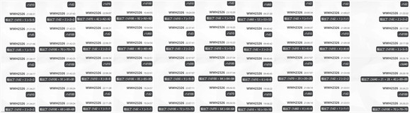

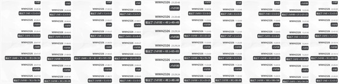

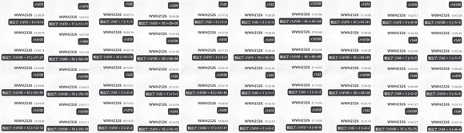

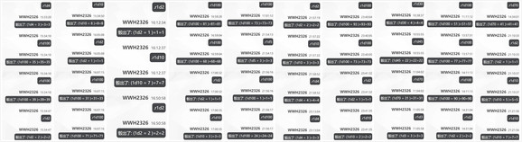

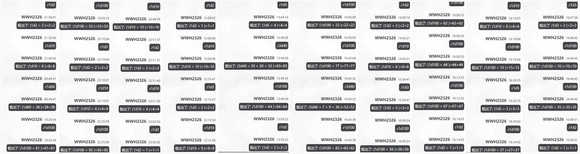

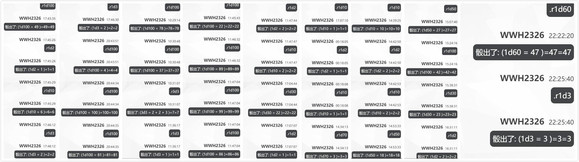

附上到目前为止的骰子

这次时间拉太长，有部分骰子被吞了（悲）毕竟最开始那块甚至是圣诞特别篇的时候骰的了（悲）

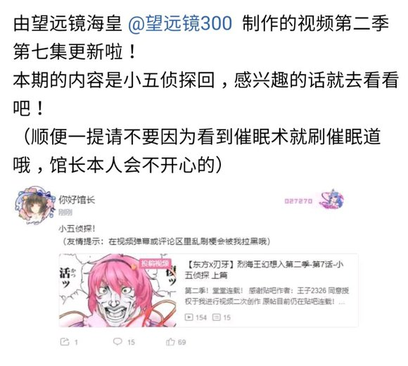

大概今晚七点半左右更新

前情提要

动物灵们的图谋已经败露，人类们踏入了埴轮的都市之中

完美的世界并不像想象中一样美好，眼前所见的甚至可称为另一个地狱

烈与妖梦前往了埴轮都市的最中心，在那里等待着他们的是......？

动物灵异变正篇 最终章连载中！

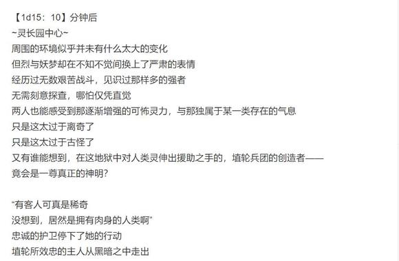

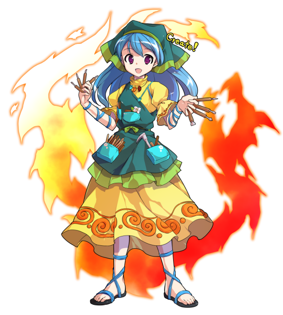

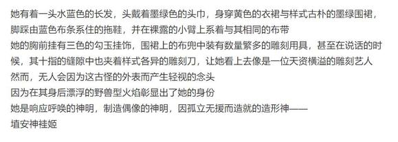

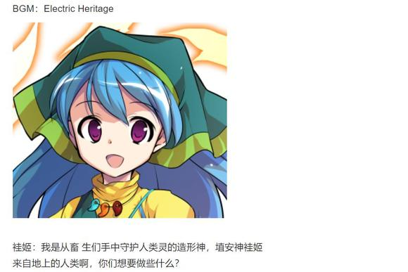

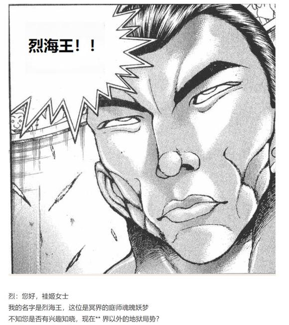

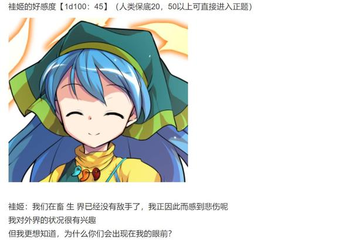

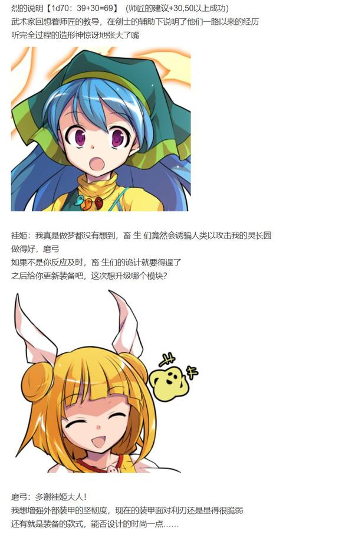

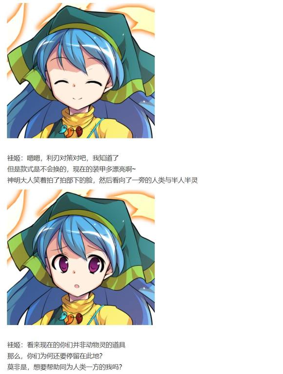

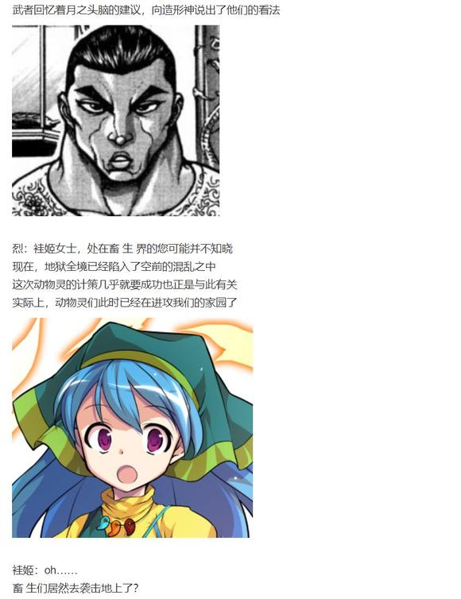

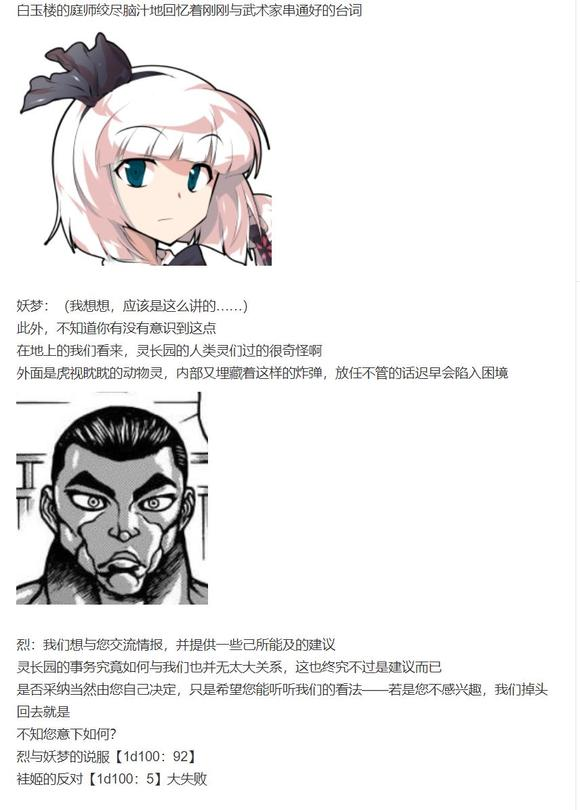

呜啊啊啊啊啊啊袿姬大失败是什么啊【1d10:9】

1 这是……动物灵的计策！

2 那就都听你们的吧！

3 埴轮兵团真暴走了（为啥啦）

4 这是……动物灵的计策！

5 那就都听你们的吧！

6 人类灵暴动（为啥啦）

7 这是……动物灵的计策！

8 那就都听你们的吧！

9 先展现实力再说！（为啥啦）

10 大成功/大失败【1d2：2】

灵长园的女神挥舞着手中的刻刀，像是习惯性一般地在虚空中勾画着什么

袿姬：呵呵呵，我所面临的困境吗……

你们的语气听上去都很有自信

想必是经过了深思熟虑，才打算向我建言的吧

烈：那就——

袿姬：但是，这没有任何意义

弱者眼中无法逾越的困难，在强者眼中也不过是不足一提的琐事

看看你们那赢弱的肉身吧，并不完美的你们却想要指导我的作为

由血与肉构成的可怜之人，是谁给了你们如此之大的勇气？

妖梦：哎……

又说我们说的有道理，又说你不相信我们

摆出这么一副优柔寡断的样子，那你到底想怎么办啊？

袿姬：真的，优柔寡断很讨厌呢

所以我现在有个很棒的解决方法

要不要听听看……？

神明手中的动作慢了下来

那并不存在的作品，似乎只差一点就能完成了

磨弓：（不愧是袿姬大人）

（造形术的准备已经完成了！）

烈：是说您手中刚刚【创造】完成的某样事物吗？

当然，我没所谓！

她笑着停下了手头的刻刀，完成了最后的一道工序

袿姬：来自地上的人类啊！

在我的造形术面前展现你们的实力，证明你们拥有对我提出建言的资格吧！

无需担心，即使失败你们也不会遭遇不幸

我会将你们这人类的肉体毁去，用土与水重塑两副美丽的身躯

做成共计一副半埴轮，一半幽灵所构成的，特立独行的偶像！

神明那扭曲的造物终于完成

打倒了无数动物灵的扭曲造物展现在了两人面前——

而武者与剑士则只是兴高采烈地摆出了架势

妖梦：太好了！

终于回到了我熟悉的节奏！

总之把你砍了之后这件事就结束了！

烈：好！

早该这样做了！

永远亭 烈海王，请指教！

与古老神明所进行的最终战，于超科技都市上演！

战斗！

BGM：寄世界于偶像　～ Idoratrize World

烈海王

Atk：279（147）

Hp：23

技能

烈 海 王：超越海皇，仍为海王。AtkX1.9，Hp+1。不会陷入异常状态，不会受到驻足，束缚等判定影响，面对所有技能都可以进行【1d100】的破解判定，55以上成功

完全消力：普通攻击以及近战系、弹幕系技能所造成的的最终伤害/2（仅对Atk260以下的对手起效）自身所收到的普通攻击伤害-1，近战系、弹幕系技能伤害-2（仅对Atk261以上的对手起效）

天符【伸手及月】（CT1）：一场战斗中只能使用一次，3T内自身每回合Hp+2，战斗骰变为【3d40】，并暂时获得对特殊攻击的耐性。

异红符【巨阙】（CT3）：（近战系）本回合Hp-1，Atk+80，给予伤害+4

Flower star（CT4）：（弹幕系）对对手放出带有神秘力量的星形花弹，造成必中的【2+1d6】点伤害

急救拳：一场战斗中只能使用一次，Hp归0后回复1点Hp

贫穷神的加护：自动发动，一天只能使用一次，令对手的大成功转变为大失败

必杀技

纯粹武道（CT5）：怀抱纯粹的武术，心存无色的执着。3T内Atk+70，对对手造成的伤害+3。3T内可对所有攻击进行【1d100】的破解判定，近战系、技巧系技能30以上成功，其余技能40以上成功，必杀技60以上成功

超人【烈海王】（CT6）： Atk+675，给予伤害X4，其后2T内Atk+25，回避概率翻倍

武符【梦幻斗舞】（CT7）：无法回避/破解/防御，本回合自身无敌，给予伤害X2，进行一次【1d100】的反击判定，30以上可对对手的攻击进行反击

秘术【天文密葬法】（CT8）：制造虚假的月亮，削弱妖怪的力量，3T内战斗环节中，妖怪对手的Atk变为与自身最终结算后相同，自身的战斗骰变为【2d100】但同时无法使用破解，无法回避/破解/防御，给予伤害X2/引导宇宙的力量，发出轨道诡异的大量弹幕轰击 无法回避/破解/防御 Atk+900，给予伤害X6

（注：异变最终战直接选择最合适的技能配置）

（袿姬与神话原型关联有些过于暧昧，此处判定神秘杀手未发动）

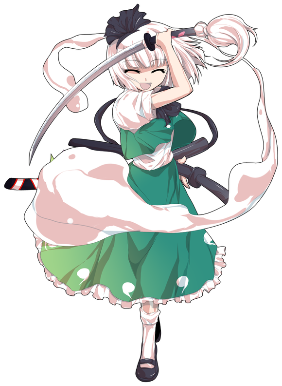

魂魄妖梦

Atk：265

Hp：16

技能

半人半灵的庭师：不会陷入异常状态，拥有对时停等特殊攻击的耐性，普通攻击与弹幕系攻击所造成的伤害减半（仅对Atk240以下的对手起效）自身所受到的弹幕系伤害-2（仅对Atk241以上的对手起效）

生命的二刀流：剑术高超，技能的破解/防御/回避判定所需成功值+20，自身的攻击无视所有减伤效果（面对完全消力等针对白刃战特化的减伤时，仅使用剑气的攻击可适用本效果）

修罗剑【现世妄执】（CT3）：（近战系）短距离的直线超高速斩击，本回合回避概率X3，给予伤害+1，对对手造成【1d4】点伤害

断迷剑【迷津慈航斩】（CT4）：（近战系）往楼观剑内注入大量妖力，创造出巨大的光刀斩击本回合Atk+70，造成伤害+2

魂魄【幽明求闻持聪明之法】（CT5）：（近战系）： 令半身复制本体的行动进行追加攻击，本回合Atk+100，给予伤害X2，伤害判定结束后对对手进行一次【1d100】的追击判定，60以上成功，对手Hp-3

人神剑【俗谛常住】（CT6）（弹幕系）：放出红色中玉与蓝色米弹的前后夹击，对对手造成【1d5】的伤害，同时3T内对手受到的伤害+2

必杀技

天神剑【三魂七魄】（CT6）：彩色弹幕与红色大玉的连击，Atk+650，给予伤害X3，战斗成功后对对手进行一次特殊攻击【污秽】：进行一次【1d100】的污秽判定，60以上成功，成功后下回合对手无法行动（面对拥有特殊攻击耐性的对手时，成功标准提升至80）

六道剑【一念无量劫】（CT7）：无法回避/破解/防御，以超高速对自身以外的一切进行攻击，Atk+775，给予伤害X4

人鬼【未来永劫斩】（CT8）：无法回避/破解/防御，以神速冲向敌人斩下猛烈的一刀，后加以威力极高的连续追击。Atk+875，给予伤害X5，进行一次【1d100】的神速判定，30以上本回合自身受到的所有伤害-2，50以上本回合自身回避概率X4，75以上本回合自身无敌

【待宵反射卫星斩】：由于身处无月之地狱，无法使用，如果有月光的话……？

共有支援

灵梦与魔理沙的支援：？？？

