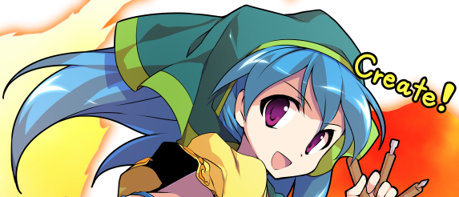
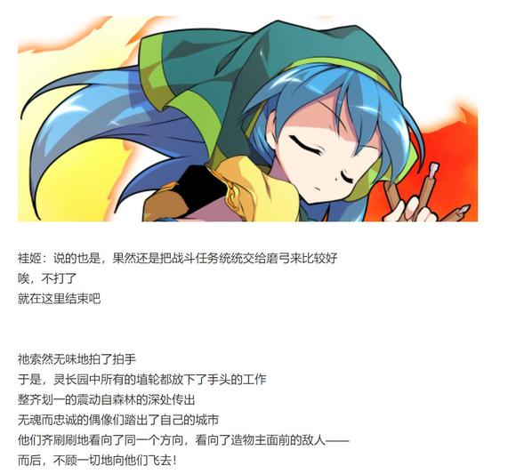
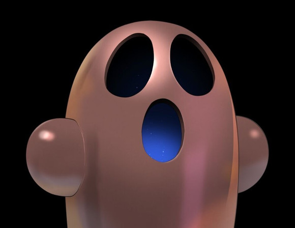
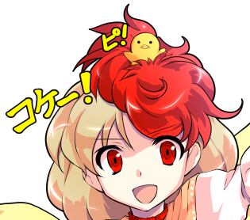

埴安神袿姬

Atk：300

Hp：24

技能

创造偶像的造形神：不会陷入异常状态，拥有对时停等特殊攻击的耐性。每回合开始时制造一个偶像。每次发动技能/必杀技的场合，制造1个偶像。（自身技能/必杀技被破解的场合，视为偶像制造失败）

偶像数目为3个以上时，自身发动技能/必杀技的场合给予对手无视减伤的【1d3】点伤害

偶像数目为6个以上时，为自身提供4点护甲

偶像数目为9个以上时，自身普通攻击所给予的小伤害/中伤害全部视为大伤害

偶像数目为12个以上时，每次自身普通攻击成功的场合，在伤害判定结束后令对手Hp减半

方形【SquareCreature】（CT2）：（弹幕系）一场战斗中仅能使用一次，制造作为身躯的方形。本回合制造偶像数目X2，Atk+50，给予伤害+2，战斗成功的场合令对手Atk下降【1d15】点。黄色的弹幕以神明为中心螺旋落下，请依靠动物灵的掩护自后方撤退。哎，没有动物灵？那希望你们拥有足够强大的身躯。

圆形【CircleCreature】（CT3）：（弹幕系）一场战斗中仅能使用一次，制造作为头颅的圆形。本回合制造偶像数目变为【1d3】，对对手造成必中的【1d10】点伤害。赤色的魔弹收缩后弹出，请在敌人身侧周旋以引开弹幕。

线形【Linear Creature】（CT4）：（弹幕系）一场战斗中仅能使用一次，勾勒填充细节的线条。本回合制造偶像数目X2，自身给予伤害X2，对手无法进行普通攻击。以触之即死的激光布下天罗地网，看准时机提前回避就可找到立足之地。

埴轮【IdolCreature】（CT5）：（弹幕系）一场战斗中仅能使用一次，这就是我所制造的完美偶像！ 本回合制造偶像数目变为【2d3】，3T内自身Atk+65，对对手给予伤害或自身受到伤害的场合，如结果不利于自身，可各进行一次重新判定。箭雨，冲锋，自爆式拦截，偶像埴轮的全体突击，现在是该用底牌的时候了。（被破解的场合仅重新判定效果消失）

必杀技

【鬼形造形术】（CT6）：Atk+725，给予伤害X4，红蓝二色的扭曲弹幕，其狂乱的姿态正符合“鬼形”之名。

【GeometricCreature】（CT7）：无法回避/破解/防御，本回合对手无法行动，在本回合开始的场合，消耗自身所制造的所有偶像与所残留的所有护甲，对对手造成其合计数目X2的伤害。固定成型的几何造物，在重塑后变为了无可理喻的形状。这里就要依靠动物灵们的伏兵——伏兵不在？那自求多福吧

【IdolaDiabolus】（CT8）：无法回避/破解/防御，本回合自身无敌，Atk+925，给予伤害X6，一切都被拆分为了最为原始的元素，自虚空中出现的四色之雨，是神明的恩赐还是恶魔的低语？

杖刀偶磨弓的支援：Hp减半后发动，？？？

T1

偶像：1个

袿姬：真是少见，你们对于争斗竟抱有如此之高的兴趣

莫非是畜 生凭依所残余的影响？

泥土与磐石自她的工坊之中飘起

本应坚固的材料在她的威力之下被轻而易举的扭曲，塑形，变为了如同花圈一般的美丽挂饰

她随手为造物们刷上了一层艳丽的色彩——

而后，毫不惋惜地将其作为兵器投掷向了眼前的人类

妖梦：比起叽里呱啦的争论当然还是战斗来的更开心啦

吃我一剑！

烈：这世上的确有不少寻求安宁生活的人类

但不巧的是

我等格斗家最为渴望的，就是令人心血澎湃的战斗！

符卡宣言 天符【伸手及月】！

烈的攻击【279+3d40：45=324】

妖梦的攻击【265+1d100：29=294】

袿姬的攻击【300+1d100：22=322】

庭师挥剑斩出，将造形神的弹幕切为了数段可笑的黏土

武者则迎着月光一跃而起，堂堂正正地击向了地狱之中的神明！

袿姬的受伤【1d10：8】

1 回避

2 小伤害

3 小伤害

4 中伤害

5 中伤害

6 大伤害

7 大伤害

8 特大伤害

9 特大伤害

10 大成功/大失败【1d2：1】

Hp：24-4=20

袿姬：这样……原来也有这样的人类存在啊

你们让我增长了新见识

那就，开始我们的战斗吧

她笑着举起了紧握工具的双手

被刻意压制的伟力骤然爆发

下一个瞬间，武者与剑士倒飞而出！

T3

埴安神袿姬终于停下了她的驱逐行动

转眼间，三人已经飞出了灵长园的范围，来到了那锁孔状森林的外侧

偶像：3个

袿姬发动技能/必杀技的场合，给予对手无视减伤的【1d3】点伤害

妖梦：你这灵气怎么还咬人的？！

袿姬：你们不是想要战斗技巧吗？这就是最原始的那种

来，我们继续

圆形【Circle Creature】

烈的受伤【1d3：1】

Hp:24-1=23

妖梦的受伤【1d3：1】

Hp:13-1=12

这次，她所释放而出的是出奇圆滑的魔弹

这些赤色的弹幕以袿姬为中心聚集为了一个完美无缺的“圆”

它们随机四散而开，凭借那独特外形滑过了两人所使用的所有攻击，并轻巧而坚定地围向了造物主的敌人

烈的破解【1d100：68】成功！

身经百战的武者立刻看破了魔弹运行的轨迹

他与庭师果断分头，各自引开了一半机械性运作的弹幕

造形神的包围圈甚至还未来得及成型就被两人轻易破解了

烈：您这打法欺负欺负动物灵还行，真拿来战斗还是算了吧

魔弹本身是很强大，但打不到人就没有意义啊

唉，这缝大的连琪露诺八成都能钻过去

妖梦：还不如放你身后那玩意咬人呢，起码那个看上去可怕点！

袿姬：呜呜……

就该直接把你们吃下去的！

烈：说的没错，可惜晚了

符卡宣言 异红符【巨阙】！

Hp：23-1=22

Hp：22+2=24

妖梦：可不会再给你那么好的机会了

符卡宣言 修罗剑【现世妄执】！

袿姬的受伤【1d4：4】

Hp：20-4=16

两位手持利刃的暴徒一脸恶相地逼近了灵长园的神明

袿姬：呐

总之

先冷静一下？

妖梦：不要

这不是你开启的战斗吗！

烈的攻击【279+80+3d40：52=411】

妖梦的攻击【265+1d100：17=282】

袿姬的攻击【300+1d100：18=318】

袿姬的受伤【1d10:2】

1 回避

2 小伤害+4

3 小伤害+4

4 中伤害+4

5 中伤害+4

6 大伤害+4

7 大伤害+4

8 特大伤害+4

9 特大伤害+4

10 大成功/大失败【1d2：1】

Hp：16-1-4=11

磨弓：袿姬大人啊！！！！

都说了您至少该跟我学学基本护身术的啊！！！！！

造形神“咣当咣当”地敲着手中的工具

袿姬：二对一怎么讲都太不公平了

我这边要让磨弓上场！

武术家散去了手中的巨剑

烈：您想找帮手？

无所谓！

杖刀偶磨弓的支援：Hp减半后发动，增加【1d3】个偶像（剧情上视为磨弓加入战斗）

增加【1d3：3】个偶像

偶像：3+3=6个

为袿姬提供4点护甲

忠诚的偶像举起了她的杖刀

磨弓：袿姬大人请尽管放手战斗就好

我会将所有的攻击都一一拦下的！

水獭灵：简直是像梦一般的现实

那个邪神居然会被人类逼到这个地步

吉吊大人果然神机妙算！

野狼灵：你可拉倒吧，鬼杰组组长要真能算出这场面咱们也不用在笼子里待着了

T4

偶像：7个

袿姬：按理来说你们早就该动弹不得了

用这么可怜的身躯居然能发挥出强大的力量，到底是为什么呢……

妖梦：神明大人突然说着“要把你的肉体用泥土重塑”这种可怕的话就冲上来了

输掉了就会变成土偶，这绝对要全力以赴的吧！

符卡宣言 断迷剑【迷津慈航斩】！

袿姬：这是为了你们好啊

做成偶像的话，就不会受伤了——

神明大人坏笑着挥动了手中的画笔

凭空出现的激光构成了天罗地网，就这样罩向了毫无察觉的两人

袿姬：而如果拥有埴轮的身躯，也就不会陷入这种动弹不得的境地了

线形【Linear Creature】！

烈的受伤【1d3:1】

Hp：24-1=23

妖梦的受伤【1d3:1】

Hp：12-1=11

烈的破解【1d100：35】失败！

偶像：7+1X2=9

袿姬所给予的小伤害/中伤害全部视为大伤害

一路顺风顺水的二人组终于在此刻遇到了阻碍

他们太过于轻视眼前的对手了

对方的确不是热爱争斗的强者

尚若以近身战斗分胜负，那袿姬的败北恐怕就是板上钉钉

但在有了埴轮兵长的掩护之后，造形神终于将两人拖入了她最为得心应手的——

“创造”的领域

Flower star 发动

护甲：4-1=3

烈：无法自由行动不提，甚至连花弹都被拦下了

简直是处处受限……

袿姬：很不适应吧？

因为这是我为你们特意打造的，仅此一次的囚笼啊

磨弓，现在是你的工作了

烈与妖梦本回合无法进行普通攻击，战斗自动失败

磨弓：交给我吧，袿姬大人

黄发的少女完全无视了造形神所释放的激光

因为无魂的埴轮根本就不会畏惧所谓的“危险”

她毫不在乎身上那被己方造成的可怕伤势，硬生生顶着伤势冲到了两人身前——

烈的受伤【1d10:9】

1 回避

2 大伤害X2-1

3 大伤害X2-1

4 大伤害X2-1

5 大伤害X2-1

6 大伤害X2-1

7 大伤害X2-1

8 特大伤害X2-1

9 特大伤害X2-1

10 大成功/大失败【1d2：1】

Hp：23-4X2+1=16

陶瓷的杖刀以急速刺向了武者的心口

他甚至没来得及发出一丝声响，就被耀眼的激光所吞没！

埴轮兵长向剑士伸出了拳头

磨弓：来，该你了

“咚！”

一击丝毫不亚于钝器殴打的重拳，将半灵剑士痛打向了与武者相反的方向！

妖梦的受伤【1d10:9】

1 回避

2 大伤害X2

3 大伤害X2

4 大伤害X2

5 大伤害X2

6 大伤害X2

7 大伤害X2

8 特大伤害X2

9 特大伤害X2

10 大成功/大失败【1d2：2】

Hp：11-2X4=3

妖梦痛苦地捂着肚子在地上滚了几圈

妖梦：你居然把部下派来打自杀式袭击？！

你那还算是——

磨弓：多谢你的关心，妖梦小姐

但你似乎忘记了

这些所谓的“损害”对我而言，本就没有任何意义

“大受损伤”的埴轮兵长飞回了她的主人身前

水蓝色的神明笑着为她填补了些许陶土

于是，士兵又一次找回了她那完美的姿态

烈：一瞬间就修好了……

袿姬充满慈爱地抚摸着埴轮的脸颊

袿姬：你们的肉体会受伤，会痛苦，会生病，会死亡

脆弱，可怜，落后，而又毫无意义

但我所制造的偶像，在先天上就有着比肉身强大太多的力量

即使遭到了再大的损伤，也能经我之手而得到修补

她笑着看向了勉强起身的两人，向着他们温和地伸出了手

袿姬：怎么样？让我为你们重塑身躯吧

成为偶像以后，就不用再担心衰老或者死亡了

不用担心

这只是我为了你们着想而采取的行动罢了

我不会向你们索取代价的！

这个时候

无论是生者还是灵魂，无论是外来者还是原本的居民

在场的全员都意识到了，埴安神袿姬是认真的

这位神明的言语与行动之中，【没有丝毫恶意】

正因如此

才会令人发自内心的，感到恐惧

T5

偶像：10个

烈：恕我谢绝你的好意

这种“不老不死”对我而言，还不如直接死了好些

袿姬：嗯嗯……难以理解

不过，我也不想逼迫你们

即使不能相互理解，能够相互尊重也是可以的

妖梦：哎？

刚刚才说了那么可怕的话现在却又让步了

你其实，是个意外讲道理的邪神？

磨弓：你怎能称袿姬大人为邪神？！

就算是对于那些动物灵，袿姬大人也是想过要和谐共处的

我们从来都不是强硬的一方！

烈的察觉【1d70：22+30=52】（50以上成功）

武术家在心中梳理着他进入地狱以来的所见所闻

在见到这位埴安神袿姬之前，他已经对于此处发生的一切有了自己的看法

但在亲眼见过这位神明，在亲自与造形神交谈之后

过去被他所忽略的某个细节，终于浮出了水面

烈：虽说你的善意极其偏激，但你也并非强迫他人的暴徒

那么人类灵的现状莫非是……

袿姬：你到现在才发现吗？

没错，正如你想象的一样

你看到的一切，都是他们自己所选择的道路

魔理沙：等会等会

你的意思是说，这帮混吃等死的人类灵是自己想变成这样的？

不对吧，你的部下亲口说过他们【勤劳过头】了啊！

袿姬：那就用你们聪明的脑袋思考一下吧

如果，你们能从我的埴轮手下生还的话！

前置的工序终于结束了

见识一下吧，这就是真正的造形术！

埴轮【Idol Creature】！

烈的受伤【1d3:2】

Hp：16-2=14

妖梦的受伤【1d3:1】

Hp：3-1=2

制造方正的身躯

安置圆滑的头颅

以线条勾画出区分于土偶的特征

最后，以神明之手给予其存在的意义

于是，陶瓷的造物开始活动

它们骑着高大的战马，它们手持锋利的武器

它们的装备看似古朴，却有着现代兵器难以触及的实力

它们是造形神所自傲的作品——是在这畜 生 界中无灵能敌的，名为埴轮的最终兵器！

纯粹武道发动

烈的破解【1d100：85】成功！

然而，这些最为精锐的埴轮人马兵却未能像过去一样所向披靡

因为它们的对手并非是只有灵体的动物

而是拥有肉体的，活生生的人类

魂魄【幽明求闻持聪明之法】发动

剑士与半灵一同举起了双刀

妖梦：实在是太吵了，就请你们安静一些吧

空观剑【六根清净斩】

刀光如闪电般闪过

有樱色的花朵自战阵中盛开

喧嚣的战场上突然寂静了一瞬

紧接着，陶偶的阵势被撕出了一个巨大的破口!

烈：这就方便多了

妖梦小姐，随我来！

陶瓷的箭矢难伤武者分毫，人马的冲锋被其轻巧避过

武术家趁机冲出了一条笔直的通路

埴轮兵团的战阵，竟被这不讲道理的两人生生打破了！

烈的攻击【279+70+1d100：74=423】

妖梦的攻击【265+100+1d100：37=402】

袿姬的攻击【300+65+1d100：50=415】

护甲：3-1=2

磨弓：袿姬大人，快退到我身后！

已经有过一次战斗经验的埴轮兵长及时挥刀拦住了破坏力最强的银发少女

而武者的突袭则再次打在了神明临时制造的偶像身上

妖梦：可惜

如果我能再快一些的话——

袿姬：再快一些也没有用处

你的刀剑，根本就难以真正伤到我的精细陶瓷

T6

偶像：11个

烈：我并不这样想

如果刚刚磨弓小姐的行动再慢一些

你就已经陷入危机了

袿姬：真有趣

在仔细观察周围的环境之后

不知你是否还能如此自信地说出这番话语？

武者与剑士疑惑地转头看去

起初，他们并未发现任何显眼的东西

于是他们更加仔细的观察着，寻找着——

妖梦：我不知道是不是我眼花了

灵长园的边界什么时候变成红色的了？

烈：你没看清楚吧妖梦小姐，明明就是蓝色的……

身经百战的两人面色不妙地停下了口中的话语

那刚刚还遥不可及的二色边界，此刻正以肉眼可见的速度在他们的视野中不断变大

数秒之后，即使是毫无能力的普通人也能看清楚这怪异事物的每一个细节

那只是单纯的魔力造物

那只是最为普通的魔弹

只不过，它们的数目似乎有些多的过分

以至于占据了这巨型都市的之上的，所有天空！

袿姬：陷阱做的太小了就很容易被躲开

所以我这次特意做的大了一些

灵长园等级的捕兽夹，不知二位观感如何？

【鬼形造形术】！

红与蓝的天穹轰然坍塌

烈与妖梦此刻需要面对的已经不是常规意义上的敌人

而是宛如天崩地裂的人造天灾！

烈的受伤【1d3：1】

Hp：14-1=13

妖梦的受伤【1d3：3】

Hp：3-3=0

烈海王使用了急救拳

Hp：0+3=3

烈：这么短的时间内就强行战斗了两次

你回去八成是要躺一阵了

妖梦：正好光明正大地休几天假！

上了，这个有办法破解吗？

烈的破解【1d100：75】成功！

烈：一座城市的天空，的确很是震撼

但与仙灵和秘神的弹幕地狱相比，也就不过如此了！

符卡宣言 异红符【巨阙】

符卡宣言 超人【烈海王】！

武者曾经见过比这更加可怖的景象

因此这次，他甚至没有做出任何躲避的动作

他只是化作了一颗赤色的流星冲天而起

凭借超人之力冲向了造形的神域，击破虚假的天空！

袿姬：oh——

妖梦：久等了，埴安神袿姬

那就，到此为止吧

符卡宣言

修罗剑【现世妄执】

人神剑【俗谛常住】

天神剑【三魂七魄】！

袿姬的受伤

修罗剑【1d4：1】

人神剑【1d5：1】

Hp：11-1-1=9

烈的攻击【279+70+80+675+1d100：78=1182】

妖梦的攻击【265+650+1d100：44=959】

袿姬的攻击【300+65+1d100：41=406=406】

护甲：2-1=1

袿姬的受伤【1d10：2】（妖梦的攻击无视减伤）

1 回避

2 小伤害X3+2

3 小伤害X3+2

4 中伤害X3+2

5 中伤害X3+2

6 大伤害X3+2

7 大伤害X3+2

8 特大伤害X3+2

9 特大伤害X3+2

10 大成功/大失败【1d2：1】

Hp：9-1X3-2=4

污秽判定【1d100:35】失败

神明大人悄悄把手藏到了身后

袿姬：呵，我就稍微夸赞你们几句吧……

磨弓：袿姬大人您没事吧？

我看您手抖的好厉害是不是刚刚麻——

袿姬（超大声）：然后让你们看看我真正的力量！！！

烈：......您要是累了歇会再继续也行

我反正是没所谓的

T8

袿姬：这是你们的自由，地上的人类

单挑也好，围攻也罢，向我展现你们的力量吧——

在这充满绝望的地狱之中，这就是唯一通用的真理！

埴安神袿姬如同艺术家般挥舞着双手

她将难以想象的神力化作了四色的光雨

造形神的力量自灵长园的上空而起

它遮盖了暗淡无光的天空，使其变为了艳丽的画布

它掠过了红黑二色的都市，令其染上了文明的色彩

它以无可阻挡的势头增长着，膨胀着，扩散着自己的存在——

直到畜 生 界全境的每一个角落，都可看到这属于神明的威光！

袿姬：我是守护人类之理的Idola Deus

我是毁灭原始法则的Idola Diabolus

而在你们的眼中，我又是什么样子？

是神？还是，恶魔？

剑士并未作出回应

她只是反射性地做出了蓄力的动作

而后有些呆呆地看向了头顶那色彩斑斓的天空

妖梦：被遮挡住了就没有月光了……

不，地狱本来就没有月光啊

该怎么办啊，这个？

灵梦有办法吗？

灵梦：别问我，我没力气了

刚刚的犯规结界已经快让我累垮了

而武者一反常态地没做出什么尖锐的回应

他只是运作着自身所学的最为强大的秘术

让畜 生界的大地染上了银白色的月光

秘术【天文密葬法】发动

烈：她的力量太强了

在这片天穹之下，我恐怕只能坚持数秒

妖梦：已经足够了——

长久的蓄力早已完成

此刻所缺的，不过是一抹摇曳的月光

待宵的月光中一定含有什么东西吧

不然的话，为何只是在刀尖上沾染了一点

就会有无数刀痕，劈斩在大地之上？

妖梦：【待宵反射卫星斩】

【待宵反射卫星斩】：仅在拥有月光时可以使用，无法回避/破解/防御，Atk+925，给予伤害X6，本回合战斗开始前可进行一次【1d100】的神速判定，30以上成功。成功时可无视任何耐性与无敌，给予对手真实伤害。并非是以力量破除了一切神秘——只是在一切发生之前，将剑斩出而已。

断迷剑【迷津慈航斩】发动

神速判定【1d100:85】成功

烈的攻击【279+1d100：91=370】

妖梦的攻击【265+925+70+1d100：49=1309】

袿姬的攻击【300+925+1d100：21=1246】

覆盖异界全境的力量是绝无可能战胜的吧

因此，只能在此之前就将剑挥出

冰冷耀眼的光芒闪过

让祂觉得有些眩目

袿姬的受伤【1d10：7】

1 小伤害X3+2（无法回避）

2 小伤害X6+2

3 小伤害X6+2

4 中伤害X6+2

5 中伤害X6+2

6 大伤害X6+2

7 大伤害X6+2

8 特大伤害X6+2

9 特大伤害X6+2

10 大成功/大失败【1d2：2】

Hp：4-3X6-2=0

绚丽的色彩与无色的剑气一同淡去

半人半灵的庭师站在造形神身后，缓缓将双刀归鞘

妖梦：神，恶魔，都是人类无法理解的家伙吧

我不知道你算哪边的

不过我想

愿意与人交流的你，总归不会是最差的那种

灵长园的神明看向了自后方走来的武者

袿姬：你又怎么想呢？

烈：尽管不擅长争斗，但您的确是位强者

至于除此之外的事情，我一向是没所谓的！

袿姬：是这样吗……

看来这次，是我输了

战斗结束

胜者 烈海王&amp;妖梦！

【1d30：4】分钟后

~灵长园外侧~

两位猛士在战斗结束后立马半死不活地倒在了地上

现在的他们正龇牙咧嘴地接收着埴轮们的治疗

路人埴轮A：小心包扎吼！

虽然是陶土做的医疗设施但也很管用的吼！

妖梦：谢谢，谢谢

不好意思啊，刚刚战斗的时候明明就砍了很多你们的同伴……

路人埴轮B：无需在意吼！

你们砍得基本上都是没有智慧的最次等埴轮吼！

像我们一样有智慧的埴轮一般都会被袿姬大人很快修好的吼！

烈：（我感觉外表看上去都差不多……）

总之，真是谢谢你们了

袿姬女士，不知您现在能否认可我们的实力了？

身穿围裙的神明大人正细心修补着部下身上的细小裂纹

袿姬：嗯？哦哦认可了

稍等一下哦，我现在在工作中，等修完磨弓再和你们说话

这种修起来很麻烦的……

磨弓：袿姬大人，我们回去再维修好不好？

总感觉这样好尴尬啊

魔理沙：你们畜 生 界这地方难道就没一个正常人吗？

（例行跑步倒垃圾洗漱，大概十点十五左右继续）

【1d15：14】分钟后

造形神满意地收回了她的工具

袿姬：好，修理完毕~

你们想说什么啊？

烈的好奇心【1d70：46+30=76】（战斗时的交谈+30,50以上先询问具体细节）

烈：就像您刚刚所说的一样，我们对于灵长园与人类灵的确还称不上了解

说到底，为何您这样的神明会出现在这种地方？

（注：以下剧情含有大量我个人的理解，还请大家千万不要当真）

袿姬：这个？

很简单啊

因为我是神明

妖梦：？？？

袿姬：在过去那段被当成奴隶的时间里

灵长园的人类灵们，已经几乎要崩溃了

力量薄弱的他们绞尽脑汁也无力反抗动物灵的统治

而畜 生们的智谋也丝毫不逊色于人类，在阴谋诡计方面，恐怕还更胜一筹吧

袿姬：能够想到的办法全都被证明无用了，甚至自己也早已适应了这机械而无意义的劳作

畜 生 界的人类灵们，彻底陷入真正的绝望

于是，它们采取了最后的行动

它们开始祈祷

身穿围裙的神明举起了一个粗糙的土偶

它看上去既不实用，也不美丽，只能依稀看出似乎是个人形

袿姬：孤立无援的人类们在那仅剩的一点休息时间中聚在了一起

它们绝望地崇拜着自己捏造而出的偶像，向着不知何方的存在漫无目的地祈祷着——

“谁都好，无论谁都好，救救我吧”

灵梦：不会吧

你听到了？

你听到了这种，这种连仪式都算不上的祈祷？

造形神笑着点了点头

袿姬：我听到了

我知道了原来地狱的某个角落，还有着这么一群可怜的灵魂

它们甚至找不到献上信仰的对象，只能盲目崇拜着粗制滥造的偶像

既然没人愿意帮助它们，既然没人愿意拯救它们——

那就由我来吧

于是我降临了这属于畜 生的世界

将人类从这悲哀的地狱中，拯救而出！

烈的震惊【1d100：61】

烈：（单凭众人的祈祷就能让神明降临，怎么可能会有这种事情！？）

魔理沙：（你也不想想自己怎么来幻想乡的？林子大了什么鸟都有）

啧，本来还想损你几句的……

虽然观念扭曲了点，你这不还是个好家伙吗

那为什么人类灵会变成这样？

袿姬：你指的是让埴轮代替他们工作？

那是它们自己选择的道路啊

这又有什么不好？

它们已经劳累了无数岁月，它们该从劳役中解脱了

它们该休息了

妖梦：我奇怪的不是这个

之前我亲眼看过那些灵魂，明明每一个都是很闲不下来的性格

为什么这样的他们会主动放弃工作，这才是我想不通的地方

造形神抬手一招，一位生活在都市边缘的灵魂就被魔力牵引到了众人的身前

路人灵（友情出演 麻薯）：哦哦，袿姬大人，磨弓大人！

袿姬：这些真正的人类想问你们一些事情

无需顾虑，直白地说出自己的想法吧

妖梦：你，为什么会选择现在的生活啊？

把全部工作都交给埴轮，不觉得很没意义吗？

原因是【1d10:4】（注：同样由于原作描述较暧昧不明因此这里直接骰了）

1 开始只是想休息一阵……

2 其实有想复工，但是埴轮说全都交给它们就好

3 沉迷虚拟世界的劳动中（这啥啊）

4 开始只是想休息一阵……

5 其实有想复工，但是埴轮说全都交给它们就好

6 沉迷偶像live的人类灵（为啥啦）

7 开始只是想休息一阵……

8 其实有想复工，但是埴轮说全都交给它们就好

9 全员重度宗教狂热（你们之前不是啥都没干吗？！）

10 大成功/大失败【1d2：1】

埴轮兵长派部下护送灵魂回到了家园

她转头看向了无言以对的人类们

磨弓：它并没有恶意，只是刚刚有点太激动了

灵长园的大家基本上都是这个想法

地上的你们也许觉得不对劲，但我觉得现在的生活挺好的

那么，你们到底想找袿姬大人说什么呢？

大家你看看我，我看看你

最后，把唯一面色如常的巫女小姐推了出来

灵梦：你们总算讲完了？那赶紧办正事吧

袿姬，你的埴轮兵团大暴走把动物灵全赶出去了，结果它们跑来袭击幻想乡了

你要是讲道理的话就让埴轮们退回灵长园，或者干脆把动物灵们全干掉也行

总之想个办法把烂摊子收拾一下，没理由让你们畜 生界的争斗波及到幻想乡吧？

袿姬：你——

烈的建言【1d70：39+30=69】（师匠的建议+30,已经打过一场因此50以上直接成功）

烈：（她还真能这么面不改色地说出来啊？！！！）

袿姬女士，还请考虑一下地狱整体的混乱情况再下结论

放任埴轮兵团这么暴走下去，很可能还会为灵长园招来外部的敌人

这也不是您想看到的吧！

袿姬：嗯……说的也是

说实话，你们几个真想作对到底也很难办了

我也不想再做太多无意义的斗争

那就姑且先收缩战线吧，我也想趁此机会去地上看看呢

魔理沙：（干得好这样就解决了！）

没问题，到时候你直接去神社找灵梦就行！

然后就是人类灵们的状况——

事到如今我们也没权利指手画脚，因此只是说点自己的看法罢了

妖梦：至少让他们干点工作吧？唱歌跳舞之类的娱乐活动也没问题啊

就连想看演唱会都得绑架二羽渡神过来，这怎么想都太怪了吧？

你看，久侘歌现在还在那边看管动物灵呢

久侘歌：（真亏你们还记得我哦？！）

袿姬的看法【1d10：9】

1 那就制造虚拟劳动机器吧（过一个说服）

2 先把演唱会开了再说

3 袿姬：不需要（为啥啦）

4 那就制造虚拟劳动机器吧（过一个说服）

5 先把演唱会开了再说

6 磨弓：我不要！（为啥啦）

7 那就制造虚拟劳动机器吧（过一个说服）

8 先把演唱会开了再说

9 人类灵们同意就没问题（你是不是太好说话了？）

10 大成功/大失败【1d2：2】

袿姬：oh！创作吗？

我不觉得它们拥有我这样超前的审美

它们可绝对做不出磨弓身上这身漂亮的铠甲

磨弓：（求求您别提了这套真的很土……）

（您自己身上那套也半斤八两……）

袿姬：不过，如果人类灵们真想要劳作的话，也没有问题

我不介意这些小事

烈：我还以为您会反对的

袿姬：我一直都提倡相互理解哦~

但是畜 生们无论如何都不想和谐相处

果然它们还是灭绝了比较好

【1d30：30】分钟后

~灵长园~

参与战斗的众人在折腾了大半天之后早已筋疲力尽

于是体力留存最多的鸡神与魔法使担当起了发言人的角色

魔理沙：埴轮也不是万能的……

……这样下去心灵也难以安稳吧？

久侘歌：在有关创造的工作方面，你们也能做到比埴轮更强大……

……也为你们的埴轮大人出一份力吧！

受到触动的人类灵【1d100：70】（魔理沙与鸡神的宣传+50，长久的惰性-30，总保底20）

“这样一来是不是可以搞点创作……我听新来的伙计说有个叫动画的玩意好像挺不错……”

“那个头上顶着鸡的女孩子好可爱哎……”

“我们是不是也能去帮埴轮大人们设计造型了？！要我说现在这套铠甲早该换了！”

不知为何，大概70%左右的人类灵居然重燃起了工作的热情！

磨弓：骗人的吧？！

为什么这都会成功的，没道理啊？！

烈：大概是因为它们本就有相关的想法吧

我之前过来的时候就注意到了，人类灵们在汇报完近况之后还特意询问了一句

“我们该怎么办”

如果只是一心想要混吃等死，直接拜托埴轮帮忙就好，何必多此一举？

也许它们也在心中期盼着，你们会提出“自己去想办法”的指示

妖梦：还有那个“想看漂亮的女孩子唱歌跳舞”的要求也很离谱啊

这很明显就在埴轮的能力范围外了

或许，这是它们在某种程度上的暗示也说不定？

“你们也有做不到的工作”，这种感觉

灵梦：我觉得你想多了

你看看那帮灵魂激动地扭来扭去的样子，这明显就是它们自己私心作祟吧

黄发少女有些困扰地看着出奇活跃的人类灵们

磨弓：我也只是按照命令帮助大家而已

结果，是我做错了吗？

武术家坚决地摇了摇头

烈：不，磨弓小姐

神明也好，人类也罢，在这件事上或许都有招致指责的地方

但是你没做错任何事情......

埴轮们，是没有过错的

妖梦的情商【1d100:47】

银发少女笑着拉起了埴轮兵长的手

妖梦：倒不如说你帮了我们大忙呢！

要不是你那两棍子 恐怕我们现在还傻乎乎地被动物灵所利用着

谢谢你啦，磨弓

我刚刚那场也打的很开心哦！

磨弓：你还好意思说？！

明明是我帮了你结果还非要跟我打一场你还好意思说哦？！

袿姬：磨弓也交到朋友了呢

不愧是我的得意之作~

于是，现在是处理畜 生的时间了

造形神和善地看向了笼子里的动物灵们

小动物四人组的处理【1d10：9】（1放了，2-5留下来当模板，6-9换赎金，10随机）

袿姬：居然有三个干部，这回真是大丰收

你们觉得自己的组长会出多少资源来交换啊？

水獭灵：求求你干掉我吧！

回去之后怕是还不如待在这呢！！

野狼灵：呵，看看你那没出息的样子

只要没死就有希望！

大鹫灵：你夹着尾巴放狠话的样子真的很帅气

牛灵面无表情地扫了眼身旁的动物灵们

牛灵：有如此同伴，又该如何胜利啊......

来自地上的人类们对着神明与埴轮们挥了挥手，就此告别了这诡异的都市

而后，转身飞向了自己的家园

师匠：开始劳作的灵魂们大概会有所变化吧

或者，过不了多久就又回到之前那样了也说不定

烈，这次你们做的不错

与己无关的事物也无需多言，解决手头的问题就已经足够了

这次感受到了吗？

地狱究竟是一个怎样的烂摊子

武术家沉默了片刻，然后若有所思地说出了自己的看法

烈：我也说不出什么有理有据的评论

只能说，没想到世界上还有这样的地方啊……

医务室中的众人谈论着今日的异变，就此结束了这充实至极的一天

尽管已经见过很多地方了，但武者却依然觉得

世界比他想象中要宽广的多

今后他还会见到怎样古怪的地方？

今后他还会遇到其他不同的强者吗？

脑中发散着思维，他看向了熟悉的房间，看向了周围的人们

他重新找回了那在地狱无法察觉到一丝一毫的，温暖的氛围

于是，他终于可以沉下心来——

于是

烈海王再次回到了他的日常之中

吉吊的惊讶【1d100：80】

吉吊：哈？

事到如今说这个还……

烈：动物灵与埴轮兵团胜负如何，我不关心

你是否达到了自己最终的目的，我也没所谓

但是——

烈：仅是畜 生界的争执，却牵扯到了地上的人们

我们已经认识如此之久了，你却用那般暧昧不明的话语蒙混过关

明明有那么多友好交流的机会，你却总是使用能力强迫他人的行为

你的所作所为，真的很卑鄙！

黑帮老大被这荒谬过头的话语逗的笑了起来

吉吊：哈哈哈！

所以呢？

所以你打算像个孩童一般来和我打上一场？

烈：我们格斗家在这方面的确与幼童相差不多

再多的争执，也不过一架了结！

鬼杰组组长无可奈何地用指关节敲着办公桌

吉吊：真是令我哑口无言……我很少会有这般想不出话的时候了

您还欠我个人情呢，是吧？

烈：你想怎么用？

除了回绝约战以外，只要在我能力范围内就没有问题！

（以下是我的废话）

哎呦喂，那么这个拖了超级超级超级长的鬼形兽正篇终于完结了！

没想到居然打完了六面！我还以为这回真要提前打吉吊小姐了！

袿姬大人的卡这回没做成多血条是因为我寻思她大概没那两位厉害，同时也是因为高魄力boss写多了想玩点花的

于是这回是常见的单血条boss，作为补偿（同时也是主场优势）给了她丧心病狂的机制与堪称莫名其妙的符卡配置——

结果为啥打着打着就成谐星了啊？！！

不是我一开始不是这样想的啊？！！！

能破解的符卡除了T4外全破了这也太离谱了吧真的**抬不上去啊！！！

反倒是磨弓小姐抓住了所有出场戏份大放光彩，一口气两个特大伤害你真的好强

烈的符卡方面这回为了卫星斩特意选了老三样（同时T7犯规T8无敌弹幕地狱也没法子用）

T4符卡说实话用啥都行，考虑到对面T4有无法攻击因此还是选了花弹

T3感觉还是简单粗暴的巨阙考虑，百辟大概也差不多？总之这次选了默认配置感觉还是挺好的

哎哎，T7的作弊符按照原剧情应该是由动物灵伏兵出场的不过这次没了因此让主角组代替了

好好打架的时候整这一出果然很屑吧（笑）

不过这也是我一直想写的，毕竟人家在地狱没理由跟自机们打公平对决嘛（

袿姬太好说话导致后面的剧情突飞猛进了，本来应该是再多点观念冲突的——不过写完一看感觉这样也不错

原计划是在和吉吊小姐的电话煲中揭露人类灵的真相并借她之口说出评论，不过由于袿姬大人实在过于和善因此没这出了（笑）

魔理沙和鸡神打动了70%的人类灵实在是过草，其实这里不应该放一个这么宽松的骰子的

不过我觉得袿姬大人都和善到这个地步了索性就让故事光明一些吧（笑）毕竟我也实在不喜欢太悲哀的故事

那么鬼形兽正篇的剧情到此结束，下一次是EX面大概一回就能搞定咯！

实在是拖得最久的一次异变了，没速通好痛苦不如下次还是速通吧（错乱）

那么下一次的更新在周四或周五，骰子下次一块发

~彩蛋~

~保卫三途河~

在本次的三途河对抗战中，战果最大的成员是【1d10：10】

1 莉格露

2 橙

3 戎璎花（真的假的）

4 琪露诺

5 忍不住下场的早苗

6 若鹭姬（为啥啦）

7 魔理沙路过的时候顺手来了一发魔炮

8 过来看比赛的一轮师傅

9 跑来看比赛的二神（为啥啦）

10 大成功/大失败【1d2：2】

噗，这里大失败是啥啊【1d10:1】

1 骊驹早鬼三途河无双！

2 被动物灵凭依后开始内斗

3 早鬼：你们要不要也来劲牙组打工啊（为啥啦）

4 骊驹早鬼三途河无双！

5 被动物灵凭依后开始内斗

6 4+上了新闻头条（为啥啦）

7 骊驹早鬼三途河无双！

8 被动物灵凭依后开始内斗

9 皮克：嗷嗷嗷嗷嗷嗷嗷啊！（为啥啦）

10 大成功/大失败【1d2：1】

~三途河~

早鬼：怎么了？！怎么了？！

和杂鱼们干架的时候很有气势，一旦动起真格的就露怯了！

琪露诺：可恶！

这鸟怎么这么厉害？！

若鹭姬：和之前那些根本就不是一个等级的……

早鬼：我是畜 生 界最强的动物灵

劲牙组组长 骊驹早鬼

橙：组长？

是大人物哦？

黑天马向着小妖怪们举起了枪口

早鬼：没错，是BOSS哦

虽说只是一场戏剧

但真把地上夺下来了，不是比原计划还更好吗！

莉格露：？！

你就是这次异变的黑幕吗？！

那就在这里打倒你！

早鬼：喊声很有气势嘛

好啊，就当做正式开战前的消遣

尽全力来挑战我吧，弱小的妖怪们！

早苗：三途河畔的激斗突入新篇章！

妖怪武者大战西部快枪手！

这场战斗最终会步入怎样的结局呢……？！

戎璎花：我觉得大家赢不了吧……

她实在太强了……

顺便一提最终的结局是【1d10:3】

1 早苗来救场子了

2 坚持到了最后一刻的弟子们

3 嗷嗷嗷嗷嗷嗷嗷啊！（为啥啦）

4 早苗来救场子了

5 坚持到了最后一刻的弟子们

6 看热闹的二神（为啥啦）

7 早苗来救场子了

8 坚持到了最后一刻的弟子们

9 灵梦路过时梦想封印（为啥啦）

10 大成功/大失败【1d2：1】

【1d60：23】分钟后，小妖怪们纷纷再起不能

早鬼：呵，也就这样了

笨蛋们，跟我上！

宽广的地上世界就在前方！

“嗷嗷嗷嗷嗷嗷嗷嗷啊”

（早鬼老大，你怎么来了？）

就在这时

看热闹的原始人正好走了过来

早鬼：哟

一天不见了，皮克

如你所见，我正对地上发起进攻

如何，要加入我的部队吗？

皮克看向了齐刷刷趴了一地的小妖怪们

皮克的怒气【1d100：62】

原始人那聪慧的头脑立马理解了刚刚的发展

他若有所思地点了点头

下一秒，原始人摆出了战斗姿态

皮克：嗷嗷嗷嗷哦啊哦啊啊

（你先跟我打一场吧！）

早鬼：***居然敢打老板？！

皮克：嗷嗷嗷嗷嗷嗷嗷啊！

（凯风快晴飞翔蹴！）

战斗的结果是【1d10：2】（2-5皮克胜，6-9平局，1 10随机）

【1d3：1】小时后

早鬼：好，到此为止

这次就算你赢了

下周记得按时来上班啊

皮克：嗷嗷嗷嗷哦啊嗷嗷啊

（没问题，老大再见）

嗷嗷嗷嗷哦啊哦啊哦嗷嗷

（欢迎下次再来地上做客啊！）

原始人挥手送别了黑帮老大，转头看向了小妖怪们——

琪露诺：皮克！好强！

橙：超有魄力哦，皮克！

莉格露：不愧是我们的原始人！！

这天之后，皮克在小妖怪们心中的威望再次提升了

真是可喜可贺，可喜可贺

（彩蛋环节结束）

由望远镜海皇 @望远镜300  制作的视频第二季第8集更新啦！

本期的内容是小五侦探回下篇，感兴趣的话就去看看吧！

