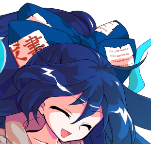
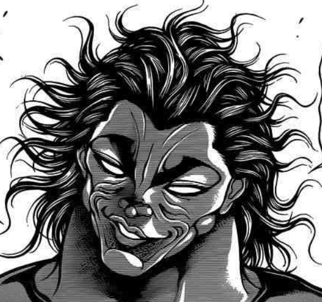

【1d15：12】分钟后

鬼杰组组长正坐在巨石旁生着闷气

吉吊：“我身上还有一位贫穷神的加护”

这东西一旦爆发，怕是倾家荡产都是最好的结局

您竟然可以放心把这种不定时炸弹带在身上，我简直难以想象您究竟过着怎样可怕的生活！

烈：没啥事啊？

紫苑小姐人很好的

吉吊：和您这种人讲常识是我的错

武术家不以为意地笑了起来

烈：我倒觉得没常识的是你那一边

谁会在那种场合分心去偷袭？

要是你全力操控那条巨龙，说不定输的就是我了

吉吊：——我不想花费多余的力气在无关紧要的争辩上

你赢了，烈海王

但是，我依然不想理解你那天真的处事方式

烈：我也不想理解你所纠结的那些事物

但这没所谓

尽管不能相互理解，我们依旧可以相互尊重

烈：这次的事件到此结束

我们下次再聊

吉吊：？？？

你不会还——

烈：我不知道你如何做想

但对我而言，偶尔交个你这样的朋友倒也不错

再见，吉吊小姐

他向黑帮老大挥了挥手，转身走向了地上的方向

金发女子愣了片刻

她无可奈何地叹了口气，最终象征性地向武术家的背影挥了下手

吉吊：再见，“我的朋友”

于是

他们背对着彼此，走向了相反的方向

~夜晚~

~永远亭~

今天的烈海王故事会开始了

烈的说明【1d100：34】

烈：噗噗噗噗噗噗噗噗吉吊小姐真挺强的噗噗噗噗噗

师匠：是啦是啦，从你这重伤的样子就能看出来了

独自一人跑去地狱跟黑帮老大约架，也真亏你做得出来

皮克：你那还算是人？

（但师匠你也没拦啊？）

辉夜：就他现在这战斗力还用担心？

随便扔什么地方都能活的挺好

铃仙：这位吉吊小姐……

怎么说呢，感觉真是难以理解的复杂人物

帝：有闪光点的屑人也是屑人哦

这女人这次偏偏遇上了黑曜石脑袋，也真是算她倒霉~

听完了烈海王的故事后，众人散去了

师匠：于是，这次决斗感想如何？

烈：久违的在战斗中用上了时停，她也的确是个需要全力以赴的对手

真要说现在最大的感想……

他握住了银发女子的手

烈：永琳

能和你相互理解，真是太好了

师匠：我知道这是你有感而发但这也太突兀了吧？！

你给我学习一下委婉的说法啦！

“一段时间内应当不会再去地狱了吧”

武术家这般想着

他将那广阔异界的故事抛在了脑后，与永琳继续着没有营养的闲聊

而有关畜 生界的异变，到此彻底结束

（本日的更新结束，下次的更新在明晚七点半，内容为很短的小剧情与完结感言，骰子明天发）

（以下是我的废话）

于是鬼形兽全剧情到此完结

真的真的是目前为止最为漫长的一次异变，有好几次我自己思路都混乱了，还好最后收尾回到了熟悉的风格上

话说本贴的吉吊小姐为什么走向了奇怪的方向啊？？？？？

本来她出场的时候我是打算把她塑造成一个彻头彻尾的屑人的结果由于梗选项中的太多的缘故最后居然成了一个很正派的屑人是怎么回事？？？

约架我来！地点你选！我吉吊八千慧不用伏兵照样能和你堂堂正正干一架！说真的我差点以为自己在写花山哎？？

还有恋恋那个骰子虽说我选项给的是比较柔和的但你中了其中最温柔的那个是闹哪样？？？您真就和蔼可亲大姐姐了吗？？？？

顺便一提吉吊小姐的卡是我在骰EX面剧情之前就已经车好了的，因此并没有临时增强或是临时削弱

这卡按理来说是挺怕正面强攻类型的偏偏对着最猛爆发技能组的烈能打出这战绩你也真的是好厉害

另一边早鬼小姐由于只出了40+的忠诚心所以用词用语方面有特别注意，“挺喜欢神子但不打算接着跟她混”大概是这种感觉

结果写到最后不知为何变成两个帅气系女子互撩了也真是很搞笑说真的为啥啦

如果早鬼野心过了大概会让皮克/神子过个劝说不行就开打，那样的话大概就要打两场了

最后这场战斗由于是最终战因此骰了用不用时停，对着吉吊小姐用时停攻击感觉真是没啥压力因此直接用了

7T感觉斗舞收尾不够过瘾因此直接进T8拼大招

结果最后那个大成功触发加护可真是绝了

我真的真的真的做梦都没想到偏偏最后一个回合最后一个骰子能出这种剧情！！！

我说真的我当时还在头疼怎么凸显“幸运与不幸”这个元素结果真的就送上门来了

斯巴拉西，斯巴拉西

各种意义上都是非常心满意足的最终战真是太好了

那么明天的更新是一小段收尾剧情以及完结感言（反思总结感谢之类的），时间还是七点半

骰子明天发

顺便一提小剧情的内容是和高好感度的大家聊聊天，一人两三句话这样（

——动物灵异变彻底结束——

成就：孤立无援造就的造形神 达成！

与魂魄妖梦携手战胜了灵长园的造形之神 埴安神袿姬

今后可自由来往灵长园，并参与相关剧情

成就：鬼杰组组长 达成！

与鬼杰组组长 吉吊八千慧了结恩怨

凭借自身实力得到了对方的认可，在战斗以外的地方获得了成长

察觉/推理判定的基础值变为40

口才基础值本应有所上升，但由于自身太过顽固因此依旧为0

附上本次的骰子

由于下午睡过头了还没赶完因此小剧情延迟到八点更新（悲）

~这件事发生在烈海王来到幻想乡的第【839+1d7：3=842】天~

~博丽神社~

BGM：众神眷恋的幻想乡

今日，神社的庭院中坐满了受到邀请的或是不请自来的人与非人

他们吵吵闹闹地三五围成一团，等待着某位红白色巫女正式宣告开始

没错，无需多言就能明白

平日一贯冷清的神社会变成这样只有一个原因——

灵梦：今天是庆祝动物灵异变顺利解决的庆祝大会——！

都给我喝！！

“哈哈哈哈哈哈哈哈！”

于是，在众人的欢声笑语之中

博丽神社的宴会开始了

袿姬：这就是地上的庆祝方式吗

哦哦，真有意思！

早鬼：居然把我们也邀请过来，你们也真是不得了的笨蛋

不过开宴会就要开开心心玩才对！

呀呼！我去找太子殿下她们咯！

烈：幻想乡这地方就这样，大家打完架之后就坐下一块喝酒了

吉吊小姐，你要来一杯吗？

吉吊：多谢您的好意

我就先去和大家随便聊两句——

埴轮兵长微笑着把手搭在了黑帮老大的肩膀上

磨弓：吉吊，现在是在外面所以我们暂且停战

但我会牢牢看住你的

如果让我发现你用了哪怕一次能力

我就把杖刀塞进你的嗓子眼里

忠诚的偶像与黑着脸的鬼杰组组长一同走开了

烈的厨艺【1d25：21+75=96】大成功！（基础值55，先前的承诺+20）

（大成功奖励：本回多加一小段剧情）

灵梦：平和的日常真好啊

让我尝尝今天的料理味道如何——

哦哦这个味道！

拿出真本事了啊！

烈：那是当然

说好了请你吃大餐，就让你看看我烈海王的厨艺！

灵梦：这可真棒~

介意帮我分发一下料理吗？

烈：交给我吧

烈海王领着一大堆便当盒走进了人群中

首先是

【1d12:6】

1 红魔馆

2 白玉楼与紫

3 守矢神社 妖怪之山

4 阎魔 地灵殿

5 鬼

6 命莲寺

7 神灵庙

8 辉针城

9 女神与仙灵

10 秘神

11 小妖怪们

12 败者复活组

烈：白莲师傅，您也来了

还请吃些素斋吧

白莲：那就多谢了

看起来烈先生仍然努力修行

要保持现在的这份精进之心哦

烈：说起这个，我就觉得有些惭愧

您传授的超人法是我的立身之本

但我却一直没能给您什么拿得出手的回报

白莲：南无三，这是没有必要的

我所做的不过是顺应缘分

看到你有好好修习，我就已经十分满意

心灵，是否已经得到了安稳？

烈：啊啊

已经再无一丝不安了

——但还是别念佛经了吧？

白莲：那么，下次就还是去骑摩托车吧~

下一位【1d11：10】

1 红魔馆

2 白玉楼与紫

3 守矢神社 妖怪之山

4 阎魔 地灵殿

5 鬼

6 神灵庙

7 辉针城

8 女神与仙灵

9 秘神

10 小妖怪们

11 败者复活组

烈：给你们特意做的低脂营养餐，快来吃吧！

琪露诺：大家都在喝酒吃肉的时候你给我们送沙拉？！

橙：是三文鱼粗粮饭啦~

真好吃~

若鹭姬：真可怕

我还是吃这份鸡胸肉吧

戎璎花：（在宴会上堆石头会不会有点奇怪？）

莉格露：大哥

我这次输给天马了……

烈海王拍了拍徒弟的肩膀

烈：那可是劲牙组的组长

你们竟然能在她面前支撑那么久

干得好

我为你们而感到自豪！

小小的虫妖怪惊讶地张大了嘴

莉格露：——

烈：但是输了就是输了

明天开始加强训练

下次战斗的时候，要堂堂正正地胜过她！

莉格露：交给我吧，大哥！

这次已经充分吸取了经验

必可活用于下一次！

下一位【1d10：9】

1 红魔馆

2 白玉楼与紫

3 守矢神社 妖怪之山

4 阎魔 地灵殿

5 鬼

6 神灵庙

7 辉针城

8 女神与仙灵

9 秘神

10 败者复活组

舞：地狱的灵魂们也会跳舞吗？

里乃：地狱的灵魂们也有信仰吗？

烈：虽说对象很古怪，不过它们也是有信仰的

至于跳舞……某些灵魂大概会跳？

来，这是你们二位的冰激凌

摩多罗女士，您要吗？

武术家坐到了神明的身边

摩多罗：我要上次那个混合口味的

地狱啊……

你以后大概还会遇到与此相关的事件吧

烈：？

为啥啊？

秘神大人伸手抚摸着他的头发

摩多罗：光是看看灵长园的外形就能明白，那里面一定还隐藏着什么古怪的东西

地狱的局势依然晦暗难明，地底之下似乎又有些异动……

猜猜看，之后还会发生些什么？

烈：我真猜不出来

说实话我感觉被摸头有点尴尬……

摩多罗：啊~哈~哈~

你的口头禅是什么来着？

武术家无奈地揉了揉脸

烈：我无所谓！

摩多罗：顺便，我有件好奇的事情

“把你治好之后丢在外界的某个角落，继续过着之前那般的人生”

如果当初是这样的发展

那时的你会怎么想？

烈：如果仅仅站在那时的我的角度

恐怕那样一来，我无论如何都不会知道，是谁帮助了烈海王

我甚至连祂相貌如何都无从知晓——

我会十分遗憾，甚至抱憾终生

摩多罗：你啊

从过去到现在，一直都没变呢

果然，我的选择是正确的~

烈：您说的没错

我能来到这里

真是太好了

下一位【1d10：5】

1 红魔馆

2 白玉楼与紫

3 守矢神社 妖怪之山

4 阎魔 地灵殿

5 鬼

6 神灵庙

7 辉针城

8 女神与仙灵

9 皮克阿求小铃

10 败者复活组

烈：白酒红酒啤酒？

勇仪：不要啤的，其他随便

话说你最近酒量见长啊

多久没醉了？

烈：还真记不得了

隔三差五跑去和你喝酒，结果慢慢就把酒量练上来了

勇仪：嘿？

很有自信啊，来比比？

烈：饶了我吧

我可不想在这出洋相

勇仪：没意思，怂了，就这？

行，不提了，说其他的

下次你喝牛奶还是果汁？

烈：——下周我也不带什么下酒菜了

就硬喝看看谁先倒！

勇仪：哈哈哈哈哈哈哈哈！

说好了啊！一言为定啊！

萃香：谁想拼酒？

我这管够！

华扇：唉，自寻死路……

下一位【1d9：1】

1 红魔馆

2 白玉楼与紫

3 守矢神社 妖怪之山

4 阎魔 地灵殿

5 神灵庙

6 辉针城

7 女神与仙灵

8 皮克阿求小铃

9 败者复活组

咲夜：是中华料理啊

这是什么菜系？

烈：今天做的是川菜

咲夜小姐，这次异变又是多亏了你的假腿

不知道你跟红海皇进展——

红美铃：工作上的进展相当顺利！

眼疾手快的门番一把按下了准备投掷小刀的女仆长，并扭着武术家走到了一旁

红美铃：烈啊

你这武术是进步了不少

怎么社交就一点没上去呢？

烈：？？？

不是，红海皇

我刚刚说的有啥问题？

芙兰朵露：没有任何问题！

就是要以最短距离直球出击才能取得成功

咲夜就是缺了这股精神，才会在那磨蹭这么久！

烈：芙兰老师

我觉得最重要的果然还是勇往直前的心！

芙兰朵露：说的没错

恋爱，战斗，交友，只要有这个就能通通搞定！

红美铃：二小姐哎~

不是人人都能适用你们那套直线猛攻法的~

下一位【1d8：1】

1 白玉楼与紫

2 守矢神社 妖怪之山

3 阎魔 地灵殿

4 神灵庙

5 辉针城

6 女神与仙灵

7 皮克阿求小铃

8 败者复活组

幽幽子：今天的料理非常优秀

可以给96分了

妖梦：一口气休了一个星期的病假真好~

烈：......八云女士，说起来雀食堂上个星期好像一直都没开业

紫：为什么要看我？

米斯提亚想休个假而已，和我有什么关系？

烈：可怜的老板娘

紫：我有提前付报酬哦，差不多是她【1d30：16】天的营业额

因此是公平交易啦~

下一位【1d7：5】

1 守矢神社 妖怪之山

2 阎魔 地灵殿

3 神灵庙

4 辉针城

5 女神与仙灵

6 皮克阿求小铃

7 败者复活组

克劳恩皮丝：哦哦，是炸鸡和薯条！

纯狐：纯 度 太 低 了

烈：纯狐女士您别急，这边还有鲁菜！！！

异界身躯的地狱女神笑着拦住了挚友

赫卡提亚：管它有没有纯度，好吃就行~

你这次似乎用上小紫苑的力量了

看来是在地狱尝到苦头了吧！

烈：地狱的环境确实与地上相差太远了

真是，见识的越多就越觉得你了不起啊

埋头苦吃的贫穷神抬起了头

紫苑：？

吧唧吧唧，怎么了？

刚刚有人提到我吗？

烈：紫苑小姐

你送我的加护这次真是帮大忙了

谢谢你！

紫发少女羞涩地挠了挠头，又带着有点自满的表情笑了起来

紫苑：哎，真的用上了啊？！

太好了！

果然，紫苑小姐我很厉害的！

下一位【1d6：4】

1 守矢神社 妖怪之山

2 阎魔 地灵殿

3 神灵庙

4 辉针城

5 皮克阿求小铃

6 败者复活组

针妙丸：我还是喜欢传统的和食~

天子：味道重些的也不错

下一次做铁板烧吧！

正邪：你俩能不能考虑一下爷这个负责做饭的人的感受？！

不能再这么下去了……本大爷是反逆的天邪鬼！

烈：同时也是辉针城的主厨以及知名漫才演员鬼人正邪小姐

正邪：不行啊这个

再不找个机会打几场，爷怕是都要被小妖怪们看圆了

烈：这么想打架？

要不之后来武术班跟我打个表演赛？

天邪鬼“啪”得一声打了个响指

正邪（正话）：好主意

那爷稍微认真点把你打趴了应该也没问题吧？

烈：你先考虑考虑能撑到几回合吧！

下一位【1d5：4】

1 守矢神社 妖怪之山

2 阎魔 地灵殿

3 神灵庙

4 皮克阿求小铃

5 败者复活组

皮克：嗷嗷嗷嗷嗷嗷嗷啊

（畜 生 界的楼都很高）

嗷嗷嗷嗷嗷嗷嗷嗷嗷啊

（小动物们在街道上打来打去）

小铃：那皮克的工作是殴打小动物？！

阿求：听上去连我都能完成

皮克：你那还算是人……

（不是，里面相当一部分都挺难缠的……）

烈：那是相当难缠

皮克，今天要什么肉？

还是恐龙？

皮克：嗷嗷嗷嗷嗷嗷啊

（我还是好这一口）

嗷嗷嗷嗷嗷嗷嗷啊

（阿求要试试吗？）

阿求：没问题啊~

如果皮克君喂我的话

小铃：（哦哦，好大胆的突袭！）

（加油啊阿求！）

皮克：嗷嗷嗷嗷嗷嗷嗷啊！

（烈海王，救命啊！）

嗷嗷嗷嗷嗷啊？！！！

（你怎么跑了？！！！）

武者坏笑着远离了手忙脚乱的原始人，走向了下一桌的人们

下一位【1d4：3】

1 守矢神社 妖怪之山

2 阎魔 地灵殿

3 神灵庙

4 败者复活组

烈：牛舌饭，煎鹅肝和清茶

您请

神子：味道比起你刚开始做的要更好

不知不觉，你的厨艺也进步了许多啊

烈：毕竟这在另一种意义上也算是我所自傲的“技巧”了

还有一个原因是——

神子：食客们的嘴都很挑剔是吧？

那是当然，也不看看你整天都给谁做饭

话说神子的耳机【1d2：1】

1 能听歌

2 不能听歌

烈：话说回来

我真没想到您这耳机还能听音乐啊

神子：我直接把歌单给你拷了一份

曲子不错吧？

烈：很有品味

就是我有点好奇，该不会您平时办公的时候……

太子殿下做了个安静的手势

神子：我圣德太子一心向道自然是没有一丝杂念

懂吗？

烈：明白

您平常在大部分的办公时间中都是心无旁骛的！

下一位【1d4：1】

1 守矢神社 妖怪之山

2 阎魔 地灵殿

3 永远亭

4 败者复活组

果：《花果子念报》明天的头条就决定是这场宴会啦！

文文：成天报道这些没人关心的故事，你的报纸当然没人看啦

早苗：竞技场的热度逐渐上去了，现在可以准备开场大会了！

神奈子大人、诹访子大人、还有我是肯定会参战的

我想想还有谁比较合适

烈：不限定空手只要求近战的话

请妖梦小姐和一轮师傅来？

早苗：如果还能请到圣白莲就更好了

嗯嗯，这样一来剑术和拳击也都有了

然后是你那边的中华武术，灵梦小姐给多点出场费应该也能来

不过我总觉得还差了点什么……

烈：“魔法”？

早苗：对，怎么能不请那两位魔法使小姐呢

这场格斗赛一定会很精彩的！

烈：我觉得最后肯定会变成与格斗没什么关系的大混战

早苗：管他呢，弹幕格斗也是格斗！

下一位【1d3：2】

1 阎魔 地灵殿

2 永远亭

3 败者复活组

烈：（差不多快要分完了，现在就……）

武术家发现银发女子似乎不在

于是他走向了他最为熟悉的人们

烈：帝小姐，这是给你做的萝卜糕

帝：还特意切成花朵的形状？

过于恶趣味了哦

烈：哪能呢，这是感谢！

还有个兔子形状的你要吗？

地上的兔子做了个鬼脸

帝：我才不要这个！

探女（手写）：( ﾟ∀ﾟ)那给我来一份吧~

(ﾟдﾟ)味道居然是咸的，为什么？

烈：只是听着像甜品而已，其实不是的

烈：辉夜小姐，我实在不知道给你做什么比较合适

所以干脆做了些广式茶点放在了不同的盒子里

要尝尝看吗？

辉夜：马马虎虎吧，比平时的稍微好上那么一点

妹红：（这不是很精致吗！）

烈：原本想着做些更加“高贵”的料理

但我琢磨了半天发现自己好像没学过那种

辉夜：料理哪有什么高低贵贱之分

真要说的话，或许月球上的料理要比地上高贵些

不过，我也已经不是月之都的居民了

烈：但辉夜小姐依然是公主啊

是永远亭的公主殿下

辉夜：难得说了句正经话嘛

真是不错的临场发挥

烈：并非临时起意

我一直都是这么想的

武术家四处看了看，发现月之头脑似乎还没来到现场

于是他走向了一旁的兔耳少女

烈：铃仙姐

吃乌冬面吗？

铃仙：麻烦给我来一碗吧~

最近整理房间的时候才感觉到，最近我的私人时间多了不少

烈：为什么会在整理房间的时候有这种感想？

铃仙：因为我发现自己不知不觉中就买了很多新的东西啊

像是我最近新买的冲锋枪！

还有那把粉红色的匕首也不错！

阿烈，这样一来果然个人魅力也会上升吧？

烈：我觉得魅力大概不能靠这种装备来提升

铃仙：哎……

烈：不过，说真的

铃仙姐，你现在的确比以前可爱多了

紫发少女的耳朵开心地竖了起来

铃仙：果然还是有成果的嘛！

下一位【1d2：1】

1 阎魔 地灵殿

2 败者复活组

阿空：丑人来了！！吃我一炮！

恋恋：丑人在哪？丑人在哪？

火车妖怪拼死拦住了她的好同事

阿燐：我求求你们可讲点礼貌吧......

烈：唉，我已经习惯了

四季小姐也在啊？

四季：最近的工作压力真的好大

隐隐约约感觉又要犯胃病了……

觉：要我帮你做心理辅导吗？

看在上次你帮助恋恋的份上，这次免费哦

最后的败者复活组

犬走椛：我觉得战斗的要点还是合理运用武器

手持武器的弱者，先天就强过空手的强者

女苑：所谓的“专业人士”不过是一句空谈

我用手提包也照样能打倒他们！

秦心：舞蹈，绝没有胜不过刀剑的道理

鵺：一门心思想着靠你们那些娱乐技巧战斗肯定不靠谱啦

向我一样运用自身的能力才是正道

堇子：不能拘泥于所谓的能力或是技巧

最重要的是实用性！

将手头的一切全部综合起来，这样才能得到胜利！

一轮：不

我认为最重要的，是寻求真实的意志

只要心中仍有求胜的念头，就能再次从地上站起

只要心中存留着永不放弃的执念，就没有任何人能彻底将我打倒！！

“说得好！！”

“对极了！！”

“一轮师傅好口才！！”

烈：这几位怎么了这是？

我还特意带了料理，怎么一个个看上去都不大对头？

雷鼓：有一个算一个，全喝高啦

（以下是大成功附赠剧情）

堇子：哪有，我头脑清醒的狠

这边这几盒是给我的？

那我一块带回去当便当了

影狼：堇子小姐，你要回外界吗？

那顺便帮我送封信吧，谢谢你了

烈：那是我做多的那份

你想拿没问题，就是量可能有点——

话音未落，提着一大袋子料理和一封信的堇子就消失在了众人面前

烈：——可能有点多

~第二天~

~外界~

堇子：昨晚喝多了从幻想乡带了一大堆菜过来

我一个人也吃不完

那正好热热大家一块分了吧！

独步：居然是中华料理

看上去不错啊

勇次郎：日料也要吃，中华料理也要吃

这才称得上是健全

克巳：（怎么这还有封信……）

（收件人是郭海皇？等明天给他寄过去吧）

~时间回到现在~

~幻想乡~

BGM：紅楼　～ Eastern Dream...

烈：原本只是想着给大家分些料理，没想到居然过了这么久的时间——

慧音：之前还好好的怎么突然就打起来了？！

霖之助：谁来救救魔理沙！

爱丽丝：魔符【疯狂的电锯】！

帕秋莉：金符【超合金重锤】！

他突然听到了一阵熟悉的喧嚣

武术家无可奈何地叹了口气

他甚至不用思考就知道究竟发生了什么事情

烈：我就知道

【The World】！

下个瞬间，他抱着惊魂未定的金发小女孩出现在了神社的角落

魔理沙：我的妈啊

差点就没命了

烈：怎么这次我看她们还用上电锯了？

魔理沙：我哪知道她们两个看着空手不行就上武器了？！

我这护身魔法练了还不如不练呢？！

烈：我看你下次还是练急救吧

黑白色的魔法使从武者的怀中跳了下来

魔理沙：（有你帮忙我还练什么急救？）

多谢救命啊，下次请你吃……

烈：（合着我成免费急救箱了？）

别请吃饭了，我害怕！

她笑着拍了拍损友的胳膊

魔理沙：行，那换一个

我符卡战大师雾雨魔理沙，下次就教你创造新符卡吧！

烈：不要观赏性的啊，要可以实战的那种！

他摇了摇头，看着魔法使鬼鬼祟祟地藏进了人群之中

武术家走向了神社的另一个角落

某位绿发红瞳的少女，正在此处独自一人看着场中的喧嚣

烈：又一个人待在这里？

幽香：我不喜欢太热闹的地方

烈：即使如此，还是要来参加宴会

幽香：即使如此，也没有不来参加的道理

武术家给恋人倒了杯酒

他们像过去的某次宴会一般碰了碰杯

烈：幽香，我有句话早就想说了

你的很多行动其实也挺难搞懂的

幽香：哼哼~

让人轻易搞懂的话，就不能算是大妖怪了

而且——

烈：正因如此，我才会爱上你

但话又说回来，我的行动在他人看来似乎也很是古怪？

幽香：我也一样哦❤

正因如此，我才会爱上你啊

这时，参加宴会的人们不知为何开始吵闹了起来

他们抬头看向了神社的入口

某位银发的女子，正一步步走上那长长的阶梯

永琳：想着把手头的事情忙完再过来，结果居然迟到了

我该不会是最后一个……吧？

灵梦：说的没错，永琳

按照最近几周的规则，最后一个到场的人

要来打上一场符卡决斗才行！

永琳：最近的宴会还多了这么一条新规定吗？

真麻烦，那我就先回去了

“别着急嘛”

宴会的参与者们自动自觉地让出了一片空地

某位好狠斗勇的武术家从中走了出来

烈：难得的宴会，不如就玩的开心一些吧？

永琳：哎呀

看来某人今日很有自信啊？

烈：只是想看看现在的自己，与你还有多大差距而已

要来吗？师匠？

不——

要来吗，永琳？

月之头脑笑着举起了弓箭

永琳：既然你都这么说了

那我也只得满足恋人的请求了

有言在先，这次我可不会放水了

烈：那可真是再好不过！

