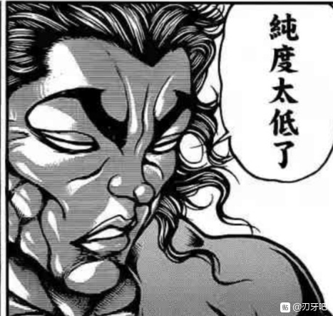
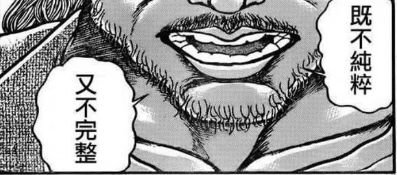
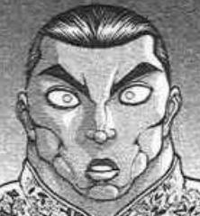

在明亮的月光之下，在众人的欢笑当中

既是师徒又是恋人的两者相对而立，同时摆出了一模一样的架势

烈：永远亭 烈海王

永琳：永远亭 八意永琳

烈&amp;永琳：堂堂正正，一决胜负！

《烈海王似乎打算在幻想乡挑战强者们的样子》

暂时

堂 堂 完 结 ！

以下分别是反思 完结感言以及碎碎念——

我很想这么说但是我得先去洗漱一下所以这些等一个小时之后再发!

以下内容为

反思（贴内系统与剧情节奏）

碎碎念（个人创作中的状态以及一些感想）

完结感言

剧情节奏方面

·实力增长·

这一块是我把控严重不足的地方

烈海王的实力膨胀，太快了

而这真的是我的原因，因为他这一身的通用超模技能——

全是我车的！！！

呜呜呜呜呜呜呜呜呜呜

花弹血剑这俩哪怕不用一点增强到大后期也依然能用因为数据给太高了

百辟崩拳虽然用了机制但实际上一点没弱反而更加通用了

梦幻斗舞这个无敌我是怎么想出来的居然直接把T7确杀了我疯了吗？？？

天文密葬法明明设定上是TOP技能结果由于白值不够前期老是吃瘪为啥啊？？？

无敌的超人术到后期明显能看出基础倍率低了但是没法增强因为再强战斗没悬念了我该怎么办？？？

说一千道一万其实就是一个问题

太急了

我总想着一步到位，但其实大可不必如此

小技能前期可以做的弱一些，之后一步步慢慢升级

符卡可以学的多一些，自己想不出来就安价，这样一来技能组会变得十分丰富多彩打起来也好看

但还是那句话

等我意识到的时候，已经太晚了

剧情已经进展到了大后期

这时候突然改主人公的技能配置是绝对不行的，甚至新学的技能弱了也会影响平衡性

于是换了新技能的结果是学了几个某种程度上更强的技能和必杀技，其实也没太大用处

唉……

如果有下次的话真的是不能太过着急

给自己留下充足的余地，在各种意义上都是些好事

大家试想一下，如果技能安价/新技能学习隔三差五就来一个，风格与效果各不相同的小技能可以随意搭配的话，战斗是否会好看很多？

我觉得会比现在好，真的

·感情线·

最大的问题来源于前期操之过急

这句话我已经说了不知道多少次了但真的就是这样

前期高好感角色倾向是由我直接定的这真的很糟糕

这导致永琳她看上去就像是我强行指定的女一号一样——

但是说真的大家想想，开场双重大成功的她即使没有那么高的保底即使没有我直接指定的倾向——

也是当之无愧的第一女主角啊！（震声）

可以说我在开头的失误直接导致了之后一连串的暴走

首先幽香直球进攻那次我【居然没骰永琳的反应】而是直接为她写了段剧情这直接导致了前期师匠人设极大的风评被害直到二连战后才修复回来这不得不说是我的问题

其次，最重要的一点是

根本就不该出现这种脚踏两条船的情况

因为在有一条稳定感情线之后其他角色应该是默认不会恋慕的！！！！

我一开始真的没想变成这样，真的（悲）

所以这也是系统问题

但话又说回来了

我自认已经封锁的很严格了吧？

在这种情况下硬生生活撕出一条血路的幽香小姐和靠大失败一路直奔终点的魔理沙小姐

你们两个也有问题吧？！

需要反思的事情还有很多比如说异常状态这个本来应该是前期重点的玩意被烈的被动废了直接导致战斗力膨胀加速等等但由于时间关系我写不动了因此接下来进入碎碎念环节

（我现场打的字因此很慢大家可以先睡觉明天再看，如果感兴趣的话）

~碎碎念~

这个环节主要和大家说一说我创作时的状态

在刚开始的时候，我的大脑中充满着几乎要满溢而出的灵感或者说好点子

我的创作欲望高涨到我即使在晚上做梦的时候都在骰剧情

于是那段时间是这样的

我早上5:30~6:00左右就被头脑中的点子硬锤着脑壳子叫起来了

它们疯狂地向我咆哮着“我要出去！”“给爷写！！”

然后我说“混账玩意们给我排队站好了看老子把你们一个个摁倒电脑屏幕上发出去”就起床开干！

一口气写到中午12点，吃饭十分钟，然后继续到晚上6点，吃饭十分钟，继续到晚上十二点，睡觉

不开玩笑，真的

在最开始的时候我甚至没有固定的更新时间段，我都是早上一起来感觉时间差不多了就开始更新

那时候我还有存稿因此相当轻松愉快

那时候也没啥默认的“篇幅要求”因此我想更多少更多少

直到某天我想着“今天难得摸一下吧”结果发现大家在问“你怎么今天不更新啊”

我才反应过来，我应该约个时间的

于是才有了现在这种按照时间准时来的更新，因为我不想让大家白等——哪怕有一个人因此浪费时间，都会让我感到很是内疚

说回创作状态

我刚刚所提到的那种“我能写上一整天的状态”，持续到了二连战结束

在那个时间点，在那天更新完毕的瞬间，我清楚的感受到了

“结束了”

就是这样的一种感觉

无论是这种病态的状态，本贴的剧情，还是我脑中的灵感或者吧友们的回复等等

“一切都可以结束了”

我觉得我已经做到了自己可以做到的最好

无论作为一个读者还是一个作者，我都觉得这个贴子已经达到了事实上的剧情最高潮——以后不会有任何一个，不会有任何一个剧情会比它更好看了！！！因为我写不出来了！！！！

我在此后的第二天坐在电脑前看着空白的屏幕这样想着

但是剧情没能结束

但是剧情不能结束

我还有很多想写的，我真的还有很多想写的，还有摩多罗，还有恶魔日记，还有他们之后的故事，还有我心心念念的格斗作，还有鬼形兽——

但是我的灵感消失了

但是我的动力消失了

我开始很难集中注意力

我开始编不出好点子了

我从未像当时那样理解过板垣老师

尽管他是我远远不能及的伟大创作者

但我想，画完范马刃牙之后的他，在画刃牙道时的他

或多或少，也一定有着这样的感受

我越来越纠结于贴子中一些细枝末节的描写，哪怕它们其实无人在意（比如越来越杂乱无章的战斗描写）

我越来越想不出有趣的选项，因为很多东西在大后期是无法放进去的

我在一个骰子骰出结果后的思考时间大大加长

因为很多剧情牵扯到了前面太多的设定导致我无法像刚开始的时候那样随心所欲地敲下键盘，写出那些“自由”的故事，写出那些放飞自我的情节

这和我后面开学之后生活上的压力增大有很大关系，但更重要的一点是——

我累了

而到了最后的一段时期

我开始不想写东西

我开始去疯狂摸鱼，去玩游戏，去抱着手机看一天都不想写下零星半语

我知道，我的热情没有消失

但我的灵感已经几乎没有了

于是大家看到了鬼形兽剧情中一些十分纠结的“扣设定”和“理念斗争”

这就是我在没啥灵感之后写出来的东西，说实在的真的不咋地（悲）

最后，带着这种堪称“自暴自弃”的观念，我开始骰本贴的最后一场战斗

我越写越顺手

我写的眼睛发光

到了最后那个突兀的大成功之后，我发现那些曾经快把我大脑撑爆的灵感全都回来了

我终于可以再次说，“我可以写上一整天”，我做得到！

因为这个贴子诞生的很大的一个原因就是

我玩完鬼形兽之后很憋屈

我想让吉吊八千慧吃瘪，我看不下去这种剧情，我想找个人打她一顿！

结果到了这么久之后

甚至到了吉吊小姐已经成为了我最喜欢写的人物之一，同时也是我最喜欢的角色之一的时候

我才终于想起，原来我一开始曾经这么想过

在最后的最后，我居然找回了自己的初心

我发现自己还能继续写，我发现我只是需要一段时间去休息

我很开心

·关于原作·

为了尽量符合原作设定，我确实是天天开着thbwiki去翻阅人物简介，设定文本与原作台词——到了后期0设考证与访谈也加入了这个范围内

为了寻找战斗回的描写灵感，让刃牙梗玩的有趣，同时也是为了把握人物性格，刃牙本篇之中的一些经典战斗与台词我也是真的翻了很多次

在这个过程中，我对两位原作者，对板垣老师和zun老师（这里用老师并不很恰当，但我只是想要表达敬意）

感受到了深深的叹服与崇拜

我难以想象，板垣老师究竟是怎么想出那些富有魄力的动作，究竟是怎么想出那些经典至极的场面，究竟是怎么想出的那些令人过目难忘的台词

我难以想象，zun老师究竟是怎么构思出的这些美丽而有趣的符卡，究竟是怎么创作出了这些富含深度却又平易近人的剧情，究竟是怎么创作出了这些备受大家喜爱的角色

我难以想象，我无法理解

因为他们太厉害了！

因为他们太强了！！

每当我尝试着还原他们的语句却无法得其神髓时，我都会感到深深的挫败感

但在这个过程中，我也不断地向他们学习着

尽管依旧是远远不及他们的水平，但我认为自己也或多或少有了一些进步

这令我十分满足

还有一位必须要提的，是写DGO的孔明老师

每当我在一个骰子面前苦思冥想的时候，我都会想

孔明老师需要在十几分钟内给出解答

他又是如何做到的？

孔明老师可以靠寥寥数语的临场发挥就写出一个令人无法忘怀的角色

我又能做到吗？

我看着他的作品，看着爆弹岩的，男爵的，野田神的贴子，看着他们依靠临场发挥在短时间内做出的成品

我感到了深深的叹服

他们实在是太厉害……实在是太厉害了

我在这些前辈们的贴子中学到了很多很多

就像之前所提到的一样，我很满足

是两位原作者也好，还是写安科安价贴的老师们也好

我对他们充满敬意

~完结感言~

正如大家所见，这个贴子在一开始的时候实在是太过于不成熟（笑）

一开始的时候我完全是抱着“随便写写幻想乡的日常”这种念头写下去的，没有想过最终会变成这个样子

首先和大家说说我写本贴的理由吧

·DGO追上进度了没有贴子看了·

·受到刃牙吧鼓励创作的风气激励·

·看到鬼形兽剧情很难受·

·看到烈海王死了更难受·

·刚刚入坑东方四处找二次创作看·

·找完一通不过瘾于是决定自己写·

·在这个过程中发现涉及地灵殿之后剧情与人物的知名二创很少·

·于是“那就由我来做一个！”·

·看到大家感叹东方过气了没人拉新人入坑·

·于是“那就由我来拉一个！”·

·看到刃牙吧内似乎因连载剧情而感到不太开心·

·于是“那我来给大家整点好活！”·

就这样

带着这些乱七八糟的杂七杂八的想法和不知由何而来的自信，我开始了本贴的更新

而直到开始连载后的很久之后我和友人聊天的时候

友人：DGO赶上进度了你没有贴子看了？

我：对，所以我开始自己写了

友人：你知道DMZJ有个AA分区吗？

那里还有很多优质的安科安价作品你为啥不看呢？

我：………

………

哎

哎哎

哎哎哎哎哎哎哎哎哎哎哎哎？！！！！！！！！！

之后开始疯狂补其他贴子

我脑子指定是有点问题的

本贴的长线剧情基本上是在我跑步的时候——就是大家经常能看到的倒垃圾跑步环节——中构思的

是个我个人很喜欢的整理思路的技巧

在一开始连载的时候，我其实已经定下了本贴的结局

它是这样的

在烈成长到了很强的地步之后，师匠决定给他来一场结业考试

于是，永夜异变再度开始了，烈海王需要在天亮之前结束所有的战斗

一面：武术的怀抱 莉格露海王+橙海王双打

二面：弱者的反逆 万宝槌之力超强化米斯提亚

三面：职场前辈来了 铃仙与因幡帝的双打

四面：不死的蓬莱人 被拉来当外援的藤原妹红！

五面：战胜过去的恐惧  原始人皮克来袭！

六面：无法解决的五个难题 永远亭的公主大人！

六连战之后——

EX面：遥不可及的月之头脑 八意永琳

这样子，双方在满月之下拼尽全力，来上一场痛快的胜负收尾！

虽说由于中间剧情大暴走导致一大堆东西提前了甚至最重要的师匠战都提前了但其实最后还是按照这个来写的啦！哈哈哈哈哈哈哈！

之后我或许会歇一段时间，偶尔可能更个日常或是其他的

新作应该会有，但得等我的休息结束之后再说（笑）

那么，下一层彻底结束

由望远镜海皇 @望远镜300  制作的视频第二季第九集更新啦！

本期的内容是花田音乐会前篇，感兴趣的话就去看看吧！

由望远镜海皇 @望远镜300  制作的视频第二季第十集更新啦！本期的内容是音乐会下篇，感兴趣的话就去看看吧！

望远镜海皇 @望远镜300  更新了上期视频的2p，感兴趣的话可以去看一下哦

～碎碎念～

摸鱼真爽，啊，摸鱼真爽

原本想着“我摸两个星期就开始干活”结果摸完之后脑子里想的只剩下继续摸鱼了(悲)

然后现在终于打起精神了却发现已经到了过年的时候了，大过年的也压根没法开始嘛(笑)

于是新贴子的事等年后再说，不过毕竟大过年的，还是更个特别篇庆祝一下吧？

于是大概明天或者后天或者大后天(具体看我哪天晚上有空)会更个类似于上次圣诞的即时安价回

这一次的即时安价回我会吸取上一次的教训，提前给大家留足思考的时间的，具体是安价什么由于我手头有点事因此等之后办完再说

那么碎碎念环节到此结束，等办完事下午回家了我单开一层说明本次的安价回(

那么这次的新年特别篇也依然是类似于上次圣诞活动的，现场更新的即时安价回

上次圣诞回的时候是玩了送礼物的剧情，这次再整个塞红包之类的感觉有点重复了

所以这次我们来做年夜饭吧（

“在新年前的某次宴会中，烈大厨决定让参与宴会的大家决定本次晚餐的菜单，事先没有任何准备的他该如何应对参加者们的点餐呢——”

大概就是这么个剧情了（笑），和上次一样由于是即时更新我写不了多少，所以更新速度依旧会非常慢哦，剧情量也应该和上次差不多的

并且依旧是【与正篇剧情没有任何关系的特别篇】，图一乐的安价回而已千万别当真

上次把人物和礼物分开安价了导致效果不太好，那么这次就把人物和料理一块安价吧

格式是【某人】提出了【某样料理】，这样一来想参与的大家也可以提前准备下有趣的组合了（

目前预定是用前菜 主菜 主食 餐后甜品/饮品这种顺序来一层层安价，具体多少个等到时候再说

顺便一提，这次我细化一下安价采用的标准

·吃顿饭而已就别想着搞事赛道S E X这些了·

·完全不符合本贴气氛的糟糕黑深残选项，我看到之后真的会很生气的·

·虽然在搞笑剧情中迫害某几位角色很有趣，但请别安价“小碎骨料理”这种选项·

·安价选项请尽量适合本贴世界观，像是上次那种考研复习材料或者与本贴无关作品的neta话，选中了也基本没法写的有趣·

包括但不限于以上这些，总之还是和上次一样适度就好，大过年的别让我看了选项之后血压up了谢谢大家

顺便一提不准蘑菇火锅（笑）

还是那句老话，有趣的整活安价十分欢迎

请大家在【适度】的范围内尽情发挥想象力吧！令我大吃一惊的选项越多越好哦！

安价环节会【在当天开始时】的【安价层的楼中楼】进行，在这层回复或者直接回复的话不会有任何效果且会妨碍大家观看的

那么就这样，明晚或者后天晚上或者大后天晚上（具体看我哪天有空）开始这个安价短篇，具体时间我会提前说明的

由望远镜海皇 @望远镜300  制作的视频第二季第11回更新啦！

本期的内容是探女交流回的上回，感兴趣的话就去看看吧！

望远镜海皇更新了一个小番外篇，感兴趣的话可以看一下(

于是今晚九点左右开始这个安价回

和上次一样是即时安价现场写所以内容不会多哦(

~开始前的废话~

本次的特别篇与本贴的正篇内容没有任何关系，不会对之后的剧情产生任何影响，只是年前图一乐的特别篇而已，千万别当真哦

因此也请在之后别拿这个特别篇的内容说事

当做BD动画附赠的副音轨来享受吧

顺便一提因为是现场看着安价结果写的因此基本上不会有多少篇幅，一个安价写个两三句话就是极限了，因此量不会多（

~注意事项~

选项方面之前已经说过一次了这里就不再重复，还请适度就好

感觉没有有趣的选项的话，就写普普通通的选项也很好啊~

如果我看到拿角色或者肢体部位当料理的烂选项，就赠送独属的本贴禁言套餐（无慈悲）

希望大家别让我大过年的高血压了

由于是即时安价没法提前准备素材，因此请不要提供在本贴中未出现的人物的选项

那么，新年前的一小时创意料理安价回开始了！

~新年特别篇~

摩多罗：于是本次年前聚餐的主厨就决定是你了！

烈：哦

摩多罗女士您想吃什么？

摩多罗：这次我想尝试一些富有趣味性的创意料理

烈：（为什么要在点菜的时候露出这种黑幕一样的笑容……）

摩多罗：所以就听听其他人的意见吧

事先没有没有任何准备，完全听取参加者们的要求现点现做！

烈：不不不这就算对于我来说这也太过高难度了吧！

我哪能想到他们会提出什么点子啊？！

摩多罗：于是这个有趣的任务就交给你了，邀请一位助手一同准备这次的晚餐吧！

接好了，这是厨神权能，有了它你就能快速做出大多数的料理来

加油吧，烈海王！

烈：这都什么莫名其妙的

算了，我无所谓

让我想想这次的助手该找谁……

——————

安价搭档（助手），下20

请在本层回复

再次重复，由于来不及找素材，请不要提供在本贴中未出现的人物的选项

【1d20:14】鬼人正邪

~辉针城~

烈：——就是这样，帮把手吧正邪！

正邪：去找月兔或者庭师啊你！！

爷这手艺做点家常便饭都够呛了你让本大爷帮着准备宴会？

说了多少次了本大爷是天邪鬼！

烈：没关系，相信自己，你一定行的！

而且我觉得你手艺不错的

正邪：成成成，做好了别怪爷厨艺好嗷

烈：那么准备工作到此结束

大家伙想吃啥跟我说一声就行，我会和辉针城的大厨一块努力完成的！

首先是前菜【1d3：3】道

————————

安价前菜 第一道 下20

【角色】提出了【料理】

【1d20:17】

【依神紫苑】【满汉全席】

紫发的贫穷神小姐高高举起了手

紫苑：前菜就吃满汉全席吧！

正邪（正话）：你才是真正的天邪鬼吧！！！！

这是前菜啊！！！！

你家前菜吃满汉全席啊这玩意量已经比整场宴会的料理都多了！！！！

紫苑：紫苑小姐我，想要久违地挑战一下自己！

正邪（正话）：但是爷不想！

喂烈海王你想想办法——

烈：多亏了摩多罗女士赠送的权能

食材的储备还足够

上了，鬼人副手！

正邪：然后这里有个真的打算开始做的大智者我该怎么办啊？！

快用你的假腿！总之你先把你假腿给我交了！！

~由于厨神权能与超常发挥的假腿这次仅用了【1d60：45】分钟就完成了~

紫苑：真棒~

啊啊，这就是幸福吗......

正邪：前菜是不是，还有两道？

烈：——希望接下来的前菜别这么重量级

————————

安价前菜 第二道 下20

【角色】提出了【料理】

【1d20:6】

【射命丸文】【煎来源奇怪的蛋】

文文：毕竟是前菜就来个简单点的

吃煎鸡蛋吧！

烈：哦，这个确实简单

稍等片刻马上就好——

文文：不过这次不想吃鸡蛋

就用我带过来的这个吧~

天狗记者从包里掏出了一个蛋

烈：......射命丸小姐？

能否请你说明一下这是什么蛋？

天狗记者转头哼起了歌

文文：♪~

烈：别哼歌啊！我记得天狗是卵生的吧你不说清楚我不敢做啊！

天邪鬼转头看向了一旁看戏的另一位记者

正邪：所以这是什么蛋？

果：是笨蛋从竹林的兔妖哪里买的恐龙蛋啦

黑发少女看着一脸慌张的武术家和坏笑的天狗耸了耸肩，而后转头煎起恐龙蛋了

————————

安价前菜 第三道 下20

【角色】提出了【料理】

【1d20:8】

【云居一轮】【云朵面包】

一轮：我点个简单点的

哎呀，毕竟我们出家人不沾荤腥

就来个现烤的面包吧，要云山形状的云朵面包

烈：一轮师傅真是太体谅人了

揉面比起打岩可简单多了

再用上摩多罗女士的权能加个速......

正邪：爷寻思这家伙不是那个意思

嘿，等我捏个胡子出来啊......再加点草莓汁染色......

在某位僧侣目瞪口呆的眼神中，等比例云山形云朵面包出炉了！

一轮：不是

为什么？

这么快也就算了为什么还一模一样——

蓝发的少女咬了一口面包

一轮：而且还这么好吃？！

我居然在厨艺上都输掉了？！

正邪：想在厨艺上赢过这位比在格斗术上赢还简单吧？

烈：一轮师傅慢慢品尝啊，想吃随时来！

接下来总算该主菜了，就做两道吧

————————

安价主菜 第一道 下20

【角色】提出了【料理】

【1d20:19】

【摩多罗】【烈自己喜欢吃的东西】

摩多罗：看样子大家都在应付第一道前菜

那就让我来点餐吧

烈：摩多罗女士您想吃啥？

秘神大人伸手摸了摸下巴

摩多罗：啊~哈~哈~

一时之间也想不到什么好主意

不如这样

来做一道你自己喜欢吃的菜吧？

烈：......？！

武术家与天邪鬼一同陷入了短暂的迷惑之中

正邪：（......烈海王喜欢吃的料理

对哦，说起来烈海王喜欢吃什么啊？）

——————

安价 下20

烈海王喜欢吃的主菜是？

