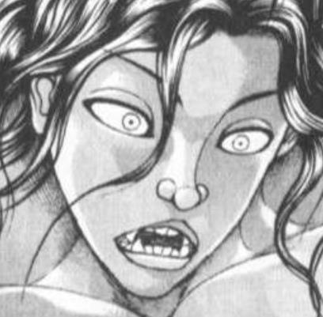

那一天

妖怪终于回想起了，曾一度被它们所支配的恐惧

以及，被囚禁于幻想乡中的那份屈辱

华扇：来了！

它们来了！

紫：怎么会……

我们的幻想乡，终于没能撑到最后吗！

博丽大结界被凝为形状的暴力所撕碎了

从结界的另一侧踏入的，是千百年来非人存在们最为恐惧的生物——

“轰！”

力士！

看啊！超大型力士那强而有力的四股！

隔绝内外的博丽大结界，在这一震之下彻底变为了破片！

一眼望不到尽头的小型无垢力士一步步以四股行来

走在他们最前方的，是身披铠甲的铠之力士！

铠之力士：这就是，大相扑啊啊啊啊啊啊啊啊啊！！

博丽神社的鸟居，粉碎！

守矢神社的鸟居，粉碎！

雾雨魔法店的门，粉碎！

后户之国所有的门扉，在铠之力士一撞之下统统变为了垃圾！

摩多罗：他将所有的门都摧毁了

烈……我已经，没有力量了

快跑，力士要来了

快跑啊！！

烈：——我不会跑的！

区区力士，就由我的中华武士来打倒！

武术家手持着鲜血化作的奇怪刀片，飞向了眼前的巨大四股！

烈：我要把所有的力士驱逐出去，一个不留！！！

震撼世界的英雄物语就此开始！

烈海王与幻想乡的居民们组成了第五期团，被授予大型力士调查Lv10卷的英勇猎人们向着未知的黑暗进军！

拥有智慧的力士在他们面前一个接一个的出现，而致命的刀刃居然来自自己的身后——

红美铃：我是铠之力士

这家伙是超大型力士

我们是为了回收你……武术力士而来到幻想乡的

早苗：要做吗，美铃？现在，在这里？！

为了夺回与力士战斗的希望，传说中的猎人雾雨魔理沙带头发起了冲锋！

魔理沙：猎人们，愤怒吧！

猎人们，高呼吧！

猎人们，战斗吧！

向我献出你们的钱包！！！！！！！

在玄武之泽开始的最终战！

正邪：别小看我们量产机的力量啊！！！！

人锤一体！上了！我的万宝槌，是可以粉碎天穹的锤子啊！！！

针妙丸：那是我的！！！

突然出现的野兽巨人令局势更加扑朔迷离！

影狼：嗷呜~

最终，尘埃落定

武术家与同伴们看着幻想乡从未有过的大海，陷入了沉思

烈：海的那边，是自由吗？

不，海的那边，是力士

我——

灵梦：就这么办吧！

把海那边的力士统统干掉，一个不留！

咲夜：好耶！！！

幻想乡的居民们将去往何方？烈之一族的血统究竟是？！力士之力的真相是什么？！

饱受好评的话题作，《进击的力士》第53季

——不会连载！

（愚人节玩笑结束）

~命莲寺篇~

一轮：你有何贵干啊？

正在打扫寺内的入道使警惕地握紧了扫把，看向了眼前的不速之客

烈：（今天已经说过多少次这句话了……）

今天不是过节嘛

为了表达平日的感激之情，我来给寺里的大家送礼物了

白莲师傅在吗？

白莲：我在这里~

你好，烈先生

我不太了解西洋的节日呢……这和上个月的“情人节”有什么不一样吗？

武术家耸了耸肩

烈：要我说其实都差不多，无非是大家找个由头给关心的人送礼物罢了

平日里我真是受了大家很多关照，这样的日子可不能什么都不做啊

并非什么值钱的物品，只是略表心意的小礼物

不介意的话，还请您收下吧？

顺便一提，我给一轮师傅也准备了一份

蓝发的僧侣反射性地摆出了战斗架势

一轮：什么？！

你这人又有什么阴谋诡计——啊好疼

命莲寺的圣僧轻轻敲了下弟子的脑袋

白莲：一轮，面对他人的善意，可不能这样失礼呦

来看看烈先生送了什么吧~

烈的礼物【1d10:9】

1 佛珠

2 一套摩托车改装配件

3 纯米大吟酿（为啥啦）

4 坐垫

5 一套健身器材

6 《禅与摩托车维修技术》（这书不是字面意思哦）

7 白林寺佛学研讨会笔录

8 果然还是送斋饭吧

9 超人漫画（为啥啦）

10 大成功/大失败【1d2：1】

云居一轮小心翼翼地打开了袋子

一轮：这是漫画书？

身穿紧身衣的肌肉男……？

这什么鬼漫画啊？！

烈：这是在外界最为著名的漫画之一

名字叫做《超人》！

白莲：打扮成这个样子的超人？！

烈：这是西洋那边属于“英雄”的特色装扮

——说实话我看的时候也觉得不太得劲，但这漫画本身还是很不错的

这位“超人”有着无数超脱常人的力量，他力大无穷，头脑灵敏，可眼观六路耳听八方，还能从眼中放出激光战斗

一轮：这连云山也做得到啊

烈：不过，他最受欢迎的原因并非是这些超能力，而是他的正义感与同理心

他知晓人心并非完美，却仍相信人性本善，并无私地运用自己的能力去帮助那些无助的人

我想，这也是“超人”的共同点吧

圣白莲看上去有点不好意思

白莲：哎呀……我只是个追求长生的僧侣而已

可不能和这样伟大的人物相提并论呢

一轮：哪有，圣大人就是超人哦！

是我们的超人！

烈：这套漫画画了几十年了，我不太了解该从哪看起，索性就买了其中比较知名的几篇

感兴趣的话，不妨就看看吧？

命莲寺的圣僧温和地笑了起来

白莲：寺里的大家也许会喜欢这个

有空闲的时候，我也尝试着看看吧

谢谢你，烈先生

祝你节日快乐！

入道使有点尴尬地挠了挠脸

一轮：总之谢谢了

节日快乐啊，烈海王

~送给了命莲寺的大家一件礼物~

【超人漫画】

那是只鸟？那是飞机？那是——超人！

习得了超人术的武术家想要送命莲寺的超人一件礼物

他感觉送佛教相关的物品会显得太过严肃，并在经过了一系列常人难以理解的思考后产生了“不妨给超人送《超人》吧！”这样古怪的想法——不过说实话，实在是奇怪过头了

话虽如此，武术家还是有好好做准备的

在询问了永远亭的某位大小姐后，对方以极其热情的态度一口气说下了诸多名篇，头昏脑涨的武者索性列了个表将上面提到的故事全部买了下来，最终得到的就是足够送给命莲寺全员当礼物还绰绰有余的大量漫画书

据寺庙的住持所言，原本只是抱着尝试一下的态度去看了几页，没想到故事意外很精彩……于是，这段时间在寺里常常能看到妖怪们看漫画的身影

“圣大人，我们命莲寺也去定制一套战服吧！”

“圣大人，试着起一个帅气的外文名怎么样？”

“大家想要维护正义的心我已经感受到了……不过，总纠结于这些外物可不好，提升心的境界才是正道哦。来，跟我一起做今日的修行吧~”

圣僧面对着因漫画而兴奋的弟子们，以巧妙的言行引导着她们的行动

最终回过神来的时候不知为何已经开始全寺苦修了

某位路过的武术家如此感叹：不愧是白莲师傅

（白情小对话到此结束）

由望远镜海皇 @望远镜300   制作的视频第二季16集更新啦！

本期的内容是日常回的下篇 感兴趣的话就去看看吧！

由望远镜海皇 @望远镜300  制作的视频第二季第17话更新啦！

本期的内容是绀珠传篇的p1，大家感兴趣的话就去看看吧！

武藏下总国篇完结了，虹龙洞篇要等到6月份以后才开始更新

而我这段时间比较忙，正经的贴子肯定是做不了了……不过话虽如此，不怎么正经的贴子还是能做一个的

于是我打算做一个宝可梦安价贴

和以前的贴子不同之处在于这个是纯粹的搞笑贴子，什么人物塑造战斗描述详细描写等等统统都不存在，只有便宜对话和乱七八糟的故事

就是这样！请把它当做“放到贴吧的聊天记录”这种随便的东西吧！

更新时间随缘！内容多少不知道！随随便便的搞笑贴子，大家图一乐参与安价就好！

第一次更新的内容是我在群里骰的因此刚开贴的内容没有即时安价，等到第二次更新才有

那么今晚八点左右我去开这个新贴子，到时候会在这边放链接的（

新的宝可梦安价贴（图一乐）

http s://tie ba.bai du .com /p/ 7 3 20903 9 87

昨晚打了虹龙洞初见，这次的th18总体而言应该是相对轻松的剧情

顺便一提，虽然正作已经出了，不过就像我之前所说的一样

考虑到翻译和立绘等问题(以及我个人现实中的时间安排)，虹龙洞篇怎么说都得等到六月份之后了，因此这个贴子的更新还要等一阵呢(

由望远镜海皇 @望远镜300   制作的视频第二季第18集更新啦！

本期的内容是绀珠传篇的皮丝战，感兴趣的话就去看看吧！

说起来还有两天就到了5月28号，这个贴子就开贴一周年了

好像该说点感慨之类的不过我感觉在之前完结感言那段都说完了

于是周五晚上七点半左右更一个日常回吧(

于是在本次的更新前

由望远镜海皇 @望远镜300  制作的视频第一集+第二集的重制版更新啦！

本期是一周年的特别篇，我有重新修过文本，大家感兴趣的话就去看看吧！

感谢馆长～

~开始之前的时间轴调整~

上次头脑一热就写了情人节特别篇，但回头看下时间才发现

鬼形兽的剧情是在夏初的时候开始的，其后才过了区区十几天居然会过春季的情人节这无论怎么想都过于离谱了——整整一年的时间居然就这样消失了（悲）

于是做出调整如下

上次情人节篇的时间调整为烈海王来到幻想乡的第【847+330=1177】天

也就是说，那是动物灵异变后又过了将近一年的事情了（

突然跳过了将近一年会有些奇怪，不过毕竟幻想乡在大多数时间也是平淡无奇的日常

就当做烈师傅普普通通地过了一年吧（

顺便一提，这也是为了给刚欲异闻的故事在时间轴上留足空位

如果刚欲异闻发售后发现是【鬼形兽之后、虹龙洞之前】的故事，那到时候就会以倒叙的形式安插在这一年间

反之，如果刚欲异闻的故事在虹龙洞之后，那我们就按照正常的顺序来吧（

那么无关紧要的碎碎念到此结束，下一层开始更新

~这件事发生在烈海王来到幻想乡的第【1207+1d20:14=1230】天~

名为“情人节”的地狱已经过去了一段时间

从做巧克力，吃巧克力发展到普通的送礼，再到莫名其妙的礼物，最后变为一如既往的弹幕战……到底为什么会变成这样？

“大多数妖怪只是想找个由头尽情玩乐而已”，博丽的巫女小姐如此解释道，而某些因个人原因在地狱中挣扎求生的人，则在心中暗自祈祷着“明年可别再来了”

无论如何，混乱的巧克力骚动终于结束了，烈海王再次回到了他平淡无奇的生活之中

这是，某次日常上课时所发生的故事

~赛之河原~

今日是武术班难得的理论课程，只可惜主讲人并不太擅长用流利的言辞表达想法

于是台下的几位小妖怪要么装作认真听讲的样子发呆，要么直接呼呼大睡，还有位干脆直接蹭到了河边开始摸鱼

烈：……面对密集弹幕的时候主要就是这几种破解思路

咳咳，认真听课

还有几分钟就下课了！

学生们的专注【1d100：20】（50以上装下样子）

莉格露：（下次问问大哥崩拳的诀窍吧……）

虫妖，目光呆滞地坐在小课桌前神游天外

琪露诺：ZZZ~ZZZ~

呼噜噜噜~休！

妖精，以千回百转的呼噜声奏起了咏叹调

橙：（好耶！我摸到了！）

猫妖，用网子从三途河里捞出了一只怪鱼

若鹭姬：大家还是注意一下吧？

烈老师的脸色看上去不太好……

哦呀，掏出花弹了

烈的目标【1d4：3】

1 莉格露

2 琪露诺

3 橙

4 三个一块

忍无可忍的武术家猛地丢出了花弹

烈：不好好听课也就算了，其他两个好歹还在座位上待着

但橙海王！你已经跑到河边去了！！

橙的回避【1d100：3】大失败

草草草草，回避大失败是什么啊【1d10:2】

1 橙海王落水啦！

2 打中了河里的原始鱼，三途河生物大暴动

3 急于逃脱的橙海王一爪子拍在了润美脸上（为啥啦）

4 橙海王落水啦！

5 打中了河里的原始鱼，三途河生物大暴动

6 橙海王不会游泳（为啥啦！）

7 橙海王落水啦！

8 打中了河里的原始鱼，三途河生物大暴动

9 蓝：校园暴力！？（为啥啦）

10 大成功/大失败【1d2：2】

猫妖以一个灵活的后空翻躲过了放水花弹

她游刃有余地提起了那条可怜的鱼，转身看向了烈海王

橙：喵哈哈！

余裕余裕，烈老师是打不中我的~

出乎她的意料

武术家并未对此作出评价，只是似笑非笑地注视着她的身后

烈：这可不一定啊

橙海王，这么有余力就回头看看吧？

“咕嘟咕嘟”

猫妖抖了抖耳朵，听到身后传来了一阵古怪的气泡声

橙：小鱼你在吐泡泡……吗？

人鱼摇了摇头

若鹭姬：没 有 呢

橙海王以僵硬的动作一格格回过了头——

“轰！”

一只巨大而凶猛的鱼类从三途河中猛地探出头来！

它那本应可怖的头颅正中如今出现了一个搞笑的肿块，一团花弹从红肿处滑落，掉到了猫妖的身前

橙海王与这古鱼类恰好对上了视线

橙：那个，冷静点，呐？

这个，不是，我做的，哦？

大鱼缓缓裂开大嘴，露出其中反射着寒光的森森獠牙

冰冷的河水如潮般涌来，让猫耳少女瞬间变成了一只落汤鸡

下一个瞬间，无名的古鱼猛地扑向了眼前的妖怪！

戎璎花：什么？！

居然是近河之王？！

莉格露：这什么啊？

三途川还有这样厉害的妖怪吗？！

戎璎花：全称是三途川近赛之河原处三百米范围河道之王

莉格露：这不就只是条大鱼而已吗不要叫“王”啊！

喂橙，你在干什么？

快点解决掉它啦

浑身湿透的猫妖一边惨叫一边躲避着大鱼的追咬

橙：救命啊喵！

蓝大人的式神术被水解除了我没有力量啦！！！

被身旁的喧闹声吵醒的冰之妖精揉了揉惺忪的睡眼，看着眼前奇妙的景象发起了呆

琪露诺：老娘这是还在做梦？

烈：橙海王，要相信武术

即使没有了式神的力量，武术也会守护你

来，将身体交给武术！

橙的直觉【1d100：8】（75以上说不定真行）

橙：不行不行它追上来了！！！

小虫救——

莉格露：啊，橙海王被秒了

冰之妖精兴高采烈地拍起了手

琪露诺：大鱼一口吃了橙！

最终收拾烂摊子的是【1d10：7】（1-5烈，6-7学员们，8-9路过的正邪，10随机）

【1d15：13】秒后，莉格露海王以一记潇洒的飞踢将大鱼踹回了河中，顺带救出了差点掉进巨口的橙海王

【1d15：9】分钟后

棕发的猫妖气鼓鼓地用毛巾擦着自己湿漉漉的头发

橙：我讨厌水

烈老师太过分了

烈：一上岸就劈头盖脸甩了大家一脸水的究竟是谁啊？

橙海王笑嘻嘻地指向了正在她身旁擦脸的同学

橙：是小虫干的

莉格露：我太孩子气了真是不好意思真是这样就有鬼了哦！！

是你啊！是你干的！！

武术家无视了一旁厮打的两位海王，头疼地揉着自己的太阳穴

烈：理论课一个月也就这么几节

就这么几节课你们也不好好听，怎么一个两个都这么不爱学习？

琪露诺：谁要听你一边在黑板上鬼画符一边碎碎念啊

辫子妖怪，你的理论课无聊到爆了！

烈的内心受伤【1d100：50】

烈：虽说不该和妖精一般计较，但听到学生这样的暴言还是让我有些受伤

璎花，你上课听得最认真，你是怎么想的？

河原的偶像弱弱地举起了手

戎璎花：烈老师讲的话我都有听

但是黑板上画的我看不懂……

烈：怎么可能？！我的画技可是郭老师亲手教的！

莉格露：大哥，我觉得画人和画符卡还是不一样的吧

小玉是一个小点，大玉就画两个圈，活动轨迹干脆直接用彩色粉笔划一道了事

你刚刚画的这张卡……我看看……是【完美冻结】？

看上去更像是橙海王吃饼干时撒在桌上的渣哎

武术家望着黑板上的图像陷入了沉思

烈：（光用黑板可能是不太直观，看不懂图像也难以进行教学）

（这样的话……）

烈海王要做什么？【1d10:3】

1 作本图文并茂的弹幕集吧

2 上次射命丸送的相机还在……

3 用想象力去克服它！（为啥啦）

4 作本图文并茂的弹幕集吧

5 听听学生们怎么想

6 需要高科技支援（为啥啦）

7 作本图文并茂的弹幕集吧

8 上次射命丸送的相机还在……

9 “有人要买卡片吗~”（为啥啦）

10 大成功/大失败【1d2：1】

烈：会出现这种情况，说明你们的实战经验还是不足，因此无法在脑中还原准确的图像

要尝试利用你们的大脑……用想象力去克服它！

橙：这不是能想象出来的事情吧！

烈老师你看看这个黑板！

靠想象力要怎么样才能从这些粉笔点里脑补出琪露诺的符卡啊？

烈：这点程度就难倒你们了吗？

我的一位友人曾经只靠我区区几场放水的战斗，就靠想象力模拟出了我那时大部分的招式

他的想象力之强，甚至能影响自己的肉体……

那可是位还未成年的少年啊

莉格露：大哥，那绝对不是人吧

你确定那不是像堇子小姐一样的什么超能力者吗

烈：大脑的潜力是无限的！

来，尝试调动你们的想象力

不需要做到影响肉身，只要能初步还原弹幕即可

武术家回头在黑板上画了个大拳头和一些散落的点，又补了一个简笔画版的入道

烈：一轮师傅的 铁拳【问答无用妖怪拳】这张符卡你们应该都见过

就用它来当最开始的目标

小妖怪们的想象训练【1d100：95】（90以上起效）

莉格露愁眉苦脸地闭上了眼，努力依靠这简陋的粉笔画在心中重现真实的弹幕

莉格露：……咦？

眼前漆黑一片的世界中，好像出现了什么

有着特定形态的某物

在运动着……在活动着

它所发出的声响……能够听到

它所带起的微风……吹拂在了面庞之上

是朝向什么方向呢……

莉格露：方向是……我

是我？

“那东西”正直直打向她的面门

是什么？答案是什么？

勾勒出形体

填充上颜色

她一点点将“那东西”的细节填补，于是她终于成功将其捕捉

突然出现在她眼前的事物是……

粉色的

巨 拳

莉格露：！

虫妖将双眼睁开

眼前的黑暗被赛之河原的风景所替换，但入道的铁拳却没有消失

击打过来了！直直的！

向着自己的脸！怎么会这样？

为什么？明明云山不在这里？！

来不及考虑这么许多，再迟疑一瞬间自己就将受到重伤——她立即摆出了战斗架势，侧身躲过铁拳直击，向着未知的攻击者一脚踢去！

莉格露：破！

——哎？

直到此时，她才意识到自己的眼前没有任何敌人

而在同一时间，小妖怪们纷纷以自己惯用的手段做出了反击——冰之妖精除外，因为她被自己想象中的拳头击倒了

琪露诺：谁打了老娘？！

烈：看，这效果不是很好吗

我就说你们做得到吧

若鹭姬：想象成真了……

这么不可思议的事情居然真能做到？

烈：并非是凭空想象

曾经见过这个招式的你们，在脑中早已记录下了相关的信息与情报

没有经过训练的常人无法意识到这些，但有着武术经验的你们却不一样

只要充分活用想象力，就算不能像刃牙那般模拟出“未曾见过”的招式，但想象出“已经见过”的招式却是很简单的

烈：如何

想象力，很奇妙吧？

橙：那我们没见过的招式该怎么办哇？

烈的建议【1d10：3】

1 触类旁通，在脑中记录些经典的符卡吧

2 果然还是需要照片

3 从最难的符卡记起（为啥啦）

4 触类旁通，在脑中记录些经典的符卡吧

5 靠我烈海王的画力！

6 亲身体验强者们的战斗（这是理论教学喂）

7 触类旁通，在脑中记录些经典的符卡吧

8 听说最近有些实用的卡片

9 继续依靠想象力（做不到的！）

10 大成功/大失败【1d2：2】

烈：你们需要的是扩宽眼界

记住了强大的招式后，在脑中模拟普通的符卡就会变得简单

戎璎花：但我不想和厉害的妖怪们打架哎

我感觉自己打不过……

烈：这也是个问题

那就交给我来解决吧，我去找找有哪些强者愿意给你们演示符卡

不过这毕竟是你们的教材——就当作今日的课余活动，有谁要跟着来？

小妖怪们的热情【1d100：18=30】（保底30莉格露，31~60莉格露和橙，61~74再来一位，75以上有场外援助）

“下课啦我去找蓝大人炖鱼啦!”

“我才不和辫子妖怪一起出门！”

“老师，我先回湖里歇了”

“烈老师我想去看竞技场下午的比赛~

话音未落，听闻下课的学员们以或直接或委婉的语气表达了“我不想去”的意图，随后跑的跑飞的飞，当场就不见踪影了

只剩下本来就不需要离场的水子之灵，和还没反应过来的虫妖

莉格露：我要去——就我一个想去的吗？！

烈：唉……

怎么一个两个对课外活动都这么缺乏积极性

走吧莉格露，办完一块请你吃晚饭

莉格露：谢啦大哥

你准备去找谁啊？

烈的目标【1d10:3】

1 果然还是去找恋人们吧

2 说到实用主义就是自机们的符卡

3 摩多罗（一开始就这位吗）

4 去辉针城吧

5 去红魔馆吧

6 纯狐（不管怎么说都超规格了）

7 去旧地狱吧

8 你想看谁的？

9 赫卡提亚（你在想什么啊——）

10 大成功/大失败【1d2：2】

烈：说到和我关系好又平易近人的强者……

莉格露：（你身边符合这个标准的人太多了我根本猜不出来……）

烈：果然还是摩多罗女士吧

莉格露：第一时间想到的居然是这位吗？！

平易近人的要素到底在哪里啊

那可是能影响整个幻想乡的秘神大人哎？！

烈：？

你怎么会这样想，摩多罗女士平常多和善

她连日常聊天时都带着温柔的笑容

莉格露：（你管那叫“温柔”吗？我参加宴会时远远见过一面感觉她笑的和八云紫有的一拼！你到底在心里给她加了多少层滤镜啊？！）

大哥，你对她的印象和其他人是不是有那么一点点点点微妙的差异……？

武术家满不在乎地笑了起来

烈：哪能呢

而这也不单单是私人关系好的原因……就在上次异变的时候，我从位朋友身上学到了一个教训

找人帮忙是往往要付出代价的，而这代价对于不同人而言并不相同

要珍惜那些会不计得失帮你的人啊，莉格露

莉格露：整天不计较利益帮人忙的明明就是大哥你吧

连魔理沙接委托都会收费的

求秘神大人用一张符卡也是要付出代价的……吧？

烈：当然，空手过去拜托人家可太失礼了

你说咱们是买点水果还是带些料理过去？或者买些小礼品？

虫妖怪默默捂住了脸

莉格露：（大哥！我们是去拜访神明大人不是去找隔壁街的婆婆借工具箱啊！！为什么要露出这种日常拜访一样的表情？！）

我真的没这方面经验大哥你来处理可以吗

【1d30：23】分钟后

~后户之国~

烈：摩多罗女士，下午好

我给您带了些应季的青团，您试试怎么样？

摩多罗：哦，是豆沙馅和莲蓉馅的糯米点心

味道还不错

那么……今天怎么把你的小徒弟也带过来了？

武术家拍了拍徒弟的肩膀，示意其上前打个招呼

莉格露的紧张感【1d100：17】

莉格露：您好，我是迷途竹林的莉格露~

是萤火虫的妖怪，现在跟随烈大哥学武术

摩多罗：啊~哈~哈~

我记得你

你在永夜异变的时候以一副很嚣张的口气跳到了紫和巫女的面前

结果，完全跟不上她们两人的电波对话，而后被瞬间秒杀了

莉格露：还请您别再说了……

我至今想起来都觉得很后悔……

烈：因为被秒杀了？

莉格露：因为跟不上电波对话

烈：这有什么好后悔的

好好说话是好事，跟不上才是对的

莉格露：大哥你不明白，那是那段时间的时尚啦

电波对话是一种很难掌控的技巧，能够熟练运用禅问答被认为是身为强者的证明！

摩多罗：那几年确实很流行那样的说话方式

在表面上若无其事地应对对方抛出的电波语，在心中经过高速思考后以意想不到的方式给予回击，是种很有趣的言语交锋

烈的察觉【1d60：57+40=97】大成功（50以上察觉永远亭的大家也说过）

噗，这里大成功是什么啊【1d10:1】

1 师匠名言精选集

2 摩多罗提供了奇怪的提示

3 学会了禅问答（这啥啊）

4 辉夜名言精选集

5 摩多罗提供了奇怪的提示

6 新符卡的灵感（这啥啊）

7 铃仙名言精选集

8 摩多罗提供了奇怪的提示

9 永夜异变参与者们的黑历史大合集（这啥啊）

10 大成功/大失败【1d2：1】

烈：那几年很流行……

也就是说，永琳她们也说过？

摩多罗：有的有的，我听紫给我模仿过

相当有魄力的话语呢

像这样……

椅子上的神明大人轻轻拍着手边的小鼓，以艺人表演时那装腔作势的，犹如戏剧般的夸张语调说到

摩多罗：“啊哈哈哈哈，你们真愚蠢呢”

烈：这什么笑法？！

摩多罗：“很快就要到清晨了

到时候，自然会把满月还给你们

法术已经完成

谁都没法把公主带走了”

烈：有她在的话本来也没人有胆子过来抢辉夜小姐吧

摩多罗：“你们现在所在的地方，知道是在哪里么？”

“这里是虚伪之月和地上之间

刚才那个永远的走廊，就是连接虚伪之月和地上的，虚假的道路

你们是被虚伪的满月所生出的幻象给骗到这里来的哦”

莉格露：当时是永琳小姐在她们注意不到的地方设下了可怕的陷阱，要把她们永远困在这虚假的道路里？

摩多罗：合理的推断

不过博丽的巫女认为“总之把她干掉事情就解决了”

于是大家玩起了弹幕游戏

烈：结果还是在打弹幕战啊！

秘神大人张开双手，说出了月之头脑的经典台词

摩多罗：“看吧，幻想乡的光明就在眼前！”

烈：永琳那时候真活泼……

摩多罗：紫和巫女之间的对话才是真正意义上的意义不明呢

几年之后，电波对话也逐渐在幻想乡中消失了

在幻想乡中被遗忘的事物，又会到哪里去？

烈：说不定会回到外界

突然的复古风潮让数年前、数十年前的事物再次流行起来

这种事情偶尔也会有

摩多罗：哼~

你总抱着这种积极的想法

神明大人望着眼前的武术家，似笑非笑

烈：（这个表情是……闲聊的时间结束，我该说正经事了）

烈的说明【1d100：23】

烈海王在心中酝酿了一番话语

烈：哦哦哦哦哦哦哦！

然后打起了车轮拳

摩多罗：他平常给你们上课时也这样？

莉格露：偶尔紧张的时候会

大家都已经习惯了，反正大哥平常说话也没几个人能听懂

【1d15：13】分钟后

摩多罗：为小妖怪们收集想象力训练素材，真亏你想得出来

这样的话……

摩多罗要用【1d10：2】

1 两个笨蛋出来演示下符卡吧

2 【背叛的后方射击】

3 帮我跑个腿（要做什么啊）

4 两个笨蛋出来演示下符卡吧

5 【Reverse Invoker】

6 要贡品（是什么啊）

7 两个笨蛋出来演示下符卡吧

8 【后户的狂言】

9 无秩序弹幕地狱（救命啊）

10 大成功/大失败【1d2：1】

摩多罗：有了有了

上次玩弹幕游戏的时候，你是用了月之民的科技产物才撑过这招

不知道现在又如何了？

秘仪【背叛的后方射击】！

隐岐奈轻轻一敲扶手

未见任何征兆，却有无数红蓝二色弹幕瞬间出现，化作尖刀刺向了武术家的背部！

莉格露：什么时候？！

简直就像停止了时间一样——

烈的破解【1d100：90】成功

烈：在应付偷袭这方面，我多少还是有些进步的

莉格露，拍几张照片

烈海王将天狗赠与的玩具相机扔给了弟子

他面不改色地将手背向身后，夹住一道离己身最近的刀锋，反手掷向相反的方向

仿佛有双无形的手在暗中操控，光刃在弹幕间弹跳着，反射着，以虫妖难以捕捉的速度化作弹射的光线——而当其停滞之时，围向武者的攻势却早已被击破的七七八八了！

摩多罗：漂亮

看来当时的出力已经不够了

嗯，有点想玩弹幕游戏了~

烈：乐意奉陪

请，摩多罗女士！

究极的绝对秘神从椅子上站了起来

摩多罗：别被打得太惨呦

符卡宣言 秘仪【秽那之火】！

虫妖呆呆地看着突然开打的两人，手指无意识按下了快门

莉格露：怎么突然又开始弹幕决斗了——啊得快点找个安全位置仔细观摩才行！

即兴弹幕战的结局【1d10：9】

1 享受乐趣后的平局

2 秘神大人的大获全胜

3 放海了（即兴游戏还要放水吗）

4 享受乐趣后的平局

5 秘神大人的大获全胜

6 乐大了（烈——）

7 享受乐趣后的平局

8 秘神大人的大获全胜

9 轮椅漂移赛再开（注意下形象可以吗）

10 大成功/大失败【1d2：1】

【1d3：2】小时后

比赛已经进入到了白热化的阶段！

现在是最后冲锋了！

里乃即将推着轮椅上的舞冲破终点线！

里乃：由我和舞双人齐心协力，这次的比赛绝不会输！

后户之国第一届双人轮椅漂移竞技赛的冠军，就由我们拿下了！！

但，就在这时！

烈：太天真了

不到最后一刻，是无法断言胜利的

舞：什么——

居然是，变形弹幕加速式跑法？！

不可思议，何等华丽的急速转向加速！

在比赛结束的前一秒钟，武术家与秘神居然反超了他们的对手！

摩多罗：啊~哈~哈~

第791届轮椅漂移赛的冠军依然是我！

虫妖往嘴里塞了个点心

莉格露：（一开始好像是弹幕战来着，什么时候发展成这样的）

（感觉再想下去对大脑不太好还是算了吧，不如说还在思考的我才是笨蛋吧）

（琪露诺在这里的话应该就能很快适应的，真好啊，真羡慕啊，什么时候我才能变成他们那样呢——）

不对啊我不想变成那样啊！！！

烈：莉格露，弹幕素材积累够了吗？照片也有拍好吧

莉格露：倒不如说莫名其妙的素材积累太多了啊！！

武术家放开轮椅，舒了口气

烈：您这活动还锻炼人的

那我先和莉格露出门吃晚饭去了

您要一起来么？

摩多罗想去吗【1d100：38】（75以上跟着去）

摩多罗：免了

对了，说到这个……

“出门”的时候要带什么，你知道吗？

莉格露：（脑子？）

烈：通讯器、钱包和钥匙？

隐岐奈打了个响指

摩多罗：算你答对了

用通讯器联络他人，用钥匙打开回家的门，而钱也是很重要的

金钱买不到所有的东西

但有些小玩具也只能用钱才能买到哦

神明大人挥手将他们送入了无数门扉中的一扇

下一个瞬间，两人又回到了三途河的岸边

莉格露：？？？

摩多罗大人刚刚说的是什么意思？

烈：是她偶尔会赠与的小提示

有时候会和之后将发生的某事有关，但大多数时候就是她的一时兴起

以我的经验来看，照着做一般是没错的

说好的晚饭是【1d10:10】

1 去人里的酒馆吧

2 去旧地狱蹭饭吧

3 还是雀食堂（老板娘烦死了）

4 去人里的酒馆吧

5 去辉针城蹭饭吧

6 去地狱蹭饭吧（能蹭到什么啊）

7 去人里的酒馆吧

8 还是烈师傅做吧

9 去魔法森林蹭饭吧（命不要了吗）

10 大成功/大失败【1d2：2】

怎么吃个晚饭还能大失败啊【1d10：3】

1 卷入了小酒馆的争斗！

2 皮克在阿求的激励下成为了主厨（自封）

3 今日的主厨是……辉夜大小姐！（什么？！）

4 莉格露：谁，谁喷了杀虫剂！

5 皮克在恋人的激励下成为了主厨（自封）

6 今日的主厨是……天子大人！（什么？！）

7 食物中毒了

8 皮克在阿求的激励下成为了主厨（自封）

9 今日的主厨是……雾雨魔理沙（救命啊）

10 大成功/大失败【1d2:2】

烈：正好到点了我也该回去做饭了

一块来永远亭吃吧？

或者你等我做完再去外面吃也行

莉格露：大哥请吃饭我哪还好意思厚脸皮提那么多要求~

那我就打扰了~

【1d60：12】分钟后

~永远亭~

烈：我回来了——怎么了这是？！

带着徒弟回家的武术家发出了惊愕的呼声

因为原本平和的永远亭，此时却散发着惨淡而绝望的气息

因幡帝：烈海王，你回来得太晚了

已经太迟了……没有人能阻挡辉夜大人了！呜撒！！

地上的因幡正两眼无神地看着手中的胡萝卜

铃仙：救命啊，阿烈

为什么我要承受如此可悲的命运……

兔耳少女呆呆地望着天空，似乎想要就此一飞冲天，直上云霄

莉格露：所以说到底出什么事了啊？！

皮克：……

原始人手捧一抔黄土，其神情严肃而又庄重，像是准备尝遍百草的神农

皮克：嗷嗷嗷嗷嗷嗷嗷啊

（今天晚上的晚餐）

嗷嗷嗷嗷嗷嗷嗷嗷嗷

（由辉夜小姐来做）

你那还算是人

（我正准备绝食）

烈：辉夜小姐前两天做的那个巧克力不挺好的——

因幡帝：用巧克力当材料拼高达和正经做料理的差别就像你的打岩和真正的雕塑之间的差别一样大

烈：我完全理解了

不是，她怎么就突然兴起这个念头了？

原因是【1d10:10】

1 最近美食漫画看多了

2 妹红的无心之言

3 黑暗料理大赛（为啥啊）

4 最近美食漫画看多了

5 妹红的无心之言

6 今天辉夜特别饿（为啥啊）

7 最近美食漫画看多了

8 妹红的无心之言

9 为永琳准备的一对一女子力教学（这啥啊）

10 大成功/大失败【1d2：1】

草，这里原因大成功是啥啊【1d10:5】

1 为永琳准备的一对一女子力教学

2 紧急请来了指导老师

3 真的通过看漫画自学成才了（什么——）

4 为永琳准备的一对一女子力教学

5 紧急请来了指导老师

6 烈与铃仙的拼死抢救（为啥啊）

7 为永琳准备的一对一女子力教学

8 紧急请来了指导老师

9 妹红站了出来！（为啥啊）

10 大成功/大失败【1d2：2】

一脸疲惫的月之头脑从屋中走了出来

师匠：公主大人她这两天一直在看奇怪的美食漫画

似乎是从漫画中汲取了灵感，她今天下午突然说要做“创意料理”了

可是……

烈，优昙华，你们平时做鸡蛋料理的时候会直接把带着壳的蛋扔进锅里吗？

烈：嘶——

何等可怕！

光这一句无意间的描述，就足以让这位大厨血压飙升了

他甚至不敢想象，现在的厨房该是一副多么恐怖的地狱绘图！

师匠：你们先别着急

虽说没能劝阻公主大人的行动

但我总算还是说服她在料理创新的过程中接受专业人士的指导了

铃仙闻言激动地差点哭了出来

铃仙：师匠！

我还以为*****们吃完的！

银发女子严肃地摇了摇头

师匠：我也是想正常享用晚餐的

快行动起来

在公主大人失去耐心之前，总之先随便找个人顶上去！

指导老师的人选【1d10:9】

1 烈和铃仙冲了过去！

2 皮克：嗷嗷嗷嗷嗷啊（我推荐阿求）

3 莉格露！（什么？！）

4 烈和铃仙冲了过去！

5 刚好过来的妹红

6 跑去雀食堂随便拉个苦役过来（为啥啊）

7 烈和铃仙冲了过去！

8 皮克：嗷嗷嗷嗷嗷啊（我推荐小铃）

9 永琳：我亲自上阵（为啥啊）

10 大成功/大失败【1d2：1】

“永琳~你找好了吗~”

但公主大人却比他们想象地要更加没有耐心

永琳才刚刚出来不到半分钟，她的催促声就已经传来了！

烈：根本就来不及

让我去吧！

永琳：不行，公主大人不会听从你和优昙华的意见

没办法了

这里就由我亲自上阵！

话说师匠的厨艺水平【1d100：53】（50以上普普通通，75以上阿燐水平，80以上铃仙水准，90以上烈水准，大成功妖梦水准）

莉格露：哦哦！永琳小姐出马问题肯定就解决了

——额，大哥你和铃仙的表情怎么这么绝望啊？

铃仙：你不明白，莉格露

师匠的厨艺是靠着高科技厨具才能称之为“平均”的水准啊！

用机器合成食材，调色器上色，放进自动烹饪机器后做成的食物真的能称之为料理吗？！

武术家想起了某块情人节巧克力的口感

他咬了咬牙，大声说出了自己的口头禅

烈：无所谓

只要倾注了爱就是完美的料理！

因幡帝：但这次做菜的是公主大人

她会往里面塞各种各样我们想不到的东西，但那些调味料里面绝对连0.1%的爱也不含

原始人发出了低沉的吼声

皮克：嗷嗷嗷嗷嗷嗷啊

（莉格露，现在还来得及）

嗷嗷嗷——

（快跑——）

辉夜：呀，今天虫妖怪也在啊

来都来了就进来一块吃吧，这是我和永琳共同完成的高科技分子创新料理！

莉格露远远嗅了下自厨房中传来的味道

用不了0.1秒她就得出了结论

今天的晚餐完蛋了

