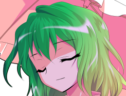
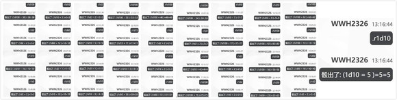
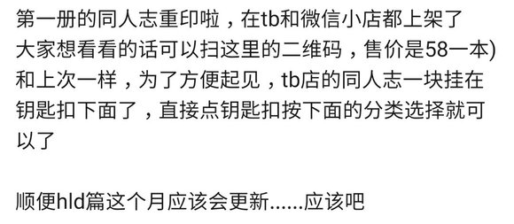

【1d15：11】分钟后

多亏了月之头脑在最后关头的拼死抢救

永远亭今日的晚餐至少在外表上维持了“料理”的水准

辉夜：这是宇宙大烧卖

以冷却后的小型黑洞为原材料制成

皮克此时像看仇人一样看着盘里这坨东西，恨不得一拳轰爆它

辉夜：黯然销魂饭

我找觉老师邮购了石樱粉末，配合完整的鸡蛋炒制而成！

烈海王看着这盘盖饭正中屹立不倒的带壳鸡蛋，感觉自己头上的血管快爆了

辉夜：黄金开口笑

这是最简单的一道菜，只要让黄金长嘴就可以了~

月兔和咧嘴大笑的黄金团子对视了半天，愣是笑不出来

辉夜：还有佛跳墙、凤凰水晶、皇帝炒饭……

怎么了？不试试吗？

放心，永琳保证这些都是能吃的美味食物哦

死一般的寂静降临在了餐桌上

而平静无法永远持续下去

总会有人去打破它

是谁？

第一个动筷子的人……是谁？！

【1d10：3】

1 烈

2 烈

3 烈

4 烈

5 烈

6 铃仙

7 帝

8 皮克

9 永琳

10 辉夜！

是烈海王！

无敌的拳雄烈海王开始行动了！

他第一个拿起了筷子！

（连永远亭的厨师都在这时退缩的话，其他人该怎么办！

我要守护我的餐桌……我要，守护大家！！）

“我无所谓！”

以标志性的言论代替了“我开动了”，武术家用筷子夹取食物，放入口中，如同平常进食一样咀嚼甚至连表情都未曾出现过一丝变化——完美的流程！

其余的食客们表面上没有发声，但却在心中对这份勇气表示了敬意！

而这些料理的味道是【1d50：39】（师匠的抢救让它有了骰数的可能性）

武术家不动声色地比了个大拇指

烈：（做得好，永琳！这是可以吃的！）

这些菜式中蕴含的创新精神实在是大大出乎了我的意料

但对于一个初学者而言，能做出可以入口的食物就很好了

从这个角度而言，辉夜小姐已经尽了力了……

辉夜：你嫌难吃直说啊

超乎想象的直球

烈海王要如何回应！

烈的情商【1d100：46】（保底20，30以下辉夜生气了）

烈：辉夜小姐

我总不能昧着良心说这料理美味啊！

永琳：就公主大人的标准而言已经很棒了

之后要不要尝试些普通的料理啊？

辉夜：算了，普通的料理也太过无聊了

下次还是先拿妹红做下实验吧

紧急状态解除了，逃过一劫！

咀嚼着这卖相奇特味道一般的食物，永远亭的大家终于松了口气

莉格露：（没难吃到我想象中的地步但也没好吃到哪去）

（能用这些食材做成这味道，月之都的科技真是了不起）

（但一想到这食材就……我今天还是减肥吧……）

晚餐之后【1d10:3】

1 听说最近有妖怪酒馆……

2 继续原计划的想象力训练！

3 果然还是雀食堂吧（还去啊）

4 听说最近有妖怪酒馆……

5 随便找个地方蹭点吃的

6 果然还是旧地狱吧（为啥啊）

7 听说最近有妖怪酒馆……

8 继续原计划的想象力训练！

9 永琳的电波对话（这么快吗）

10 大成功/大失败【1d2：2】

【1d60：51】分钟后

解决了这顿不好不坏的晚餐，收拾完了剩下的碗筷，武术家总算有空去照看他的徒弟了

烈：莉格露海王，真是委屈你了

什么也别说了，咱们去老板娘那喝两杯吧，我请客

莉格露：大哥！

有人要跟着来吗【1d100：24】（50以上有）

除了压根没吃几口的虫妖外，其余众人看上去对于夜宵没有一点胃口了

于是，烈海王与莉格露前往雀食堂了

BGM：夜雀的歌声　～ NightBird

~深夜雀食堂~

今夜的雀食堂【1d10:4】

1 慧音、灵梦、妹红

2 慧音、魔理沙

3 紫和灵梦（为啥啊）

4 灵梦、魔理沙

5 咲夜、妖梦

6 妖梦和幽幽子（为啥啊）

7 魔理沙、爱丽丝

8 慧音、妹红

9 咲夜和蕾米莉亚（为啥啊）

10 大成功/大失败【1d2：2】

“让歌声随风飞翔吧♪”

“载着幸福四处穿梭♪”

“穿过永恒之黑夜♪”

“迎向未知的明天♪”

尚未踏入夜雀的小摊，就已能听见少女的歌声

两道影子斜斜投射在灯笼的光芒下，今夜已有客人先到一步了

莉格露：晚上好，老板娘~

最近怎么不唱摇滚了？

我要两个可乐饼和一杯冰啤

米斯蒂娅：晚上好，莉格露~

切，还有黑曜石妖怪啊

这段时间的幻想乡很平稳呢

别说异变，就连大点的事件都没有

平平淡淡的日常中积攒不下唱摇滚的压力啊~

烈：晚上好，老板娘

给我来杯冰啤，再来两串烤鸡爪

米斯蒂亚：刚刚才说最近清闲就有人来给我提供压力了！

没有烤鸡爪那种恐怖的东西，也没有烤鸡心和鸡肾！只有烤八目鳗！

巫女小姐懒洋洋地点了点头，算是打了个招呼

灵梦：没有事件就是好事

去年害得我大老远跑去畜 生 界 一趟，最近的异变黑幕真是不懂规矩

跑这么远干什么，直接来神社让我退治后就结束啊

去找魔理沙或者烈海王也行

魔理沙：我倒是希望幻想乡之外的异变能再多来点，有趣的事件当然是越多越好啊！

对了，我记得你最后是去跟吉吊八千慧单挑来着

狠狠把她教训了一顿？

黑白色的魔法使举起了酒杯

武术家给自己倒了杯啤酒，和友人碰了碰杯

烈：过程一言难尽，最后以她意想不到的方式赢了

没想到会在这里遇见你们两个

灵梦：我偶尔有闲钱也会来啊

这家店味道不错的，这家伙唱歌也好听

——异变的时候除外

莉格露：我想起来了！

永夜异变的时候，老板娘超自信地说“我要让那些人类得夜盲症”就飞过去了

结果~

金发小女孩清了清嗓子

魔理沙：我想想米斯蒂娅当时是怎么说的来着~

咳咳

“没有走夜路不怕我的人类

要是我有意，能叫来多得把 全 人 类 都灭绝的妖怪哟”

米斯蒂娅：不要再说了啊啊啊啊啊啊啊啊！

那是，那是，被奇怪的月光影响到神志不清的结果！

烈的情商【1d100：75】（保底20,50以下笑出声）

虽然很想笑，但武术家凭着自己的毅力硬生生忍住了！

烈：（快说点别的我快笑出声了这很不礼貌的！！）

魔理沙：（哇你这屑人又把锅扔给我？）

魔理沙的话题转移【1d10：7】（1~6永夜异变，7~9花之异变，10随机）

魔理沙：不过也是，米斯蒂亚在之后六十年周期性的大结界异变——就是花之异变的时候就没再这样口出狂言了

灵梦：取而代之的是不停地唱歌

无论见到谁都要唱上两句，和笨蛋一样

歌词的内容也很无聊呐

“让开路～让开路～给强大的鸟儿让开路～♪”

魔理沙：“吵啊，吵啊，我想要个安静的家～”

烈：噗嗤

武术家到底还是没绷住笑出了声

米斯蒂亚：啊~~~啊？

我唱过吗？那样的歌

莉格露：有的有的，只是你这鸟脑袋全忘记了而已

花之异变的时候你一边唱着歌一边玩弹幕游戏，只要见到人就上去开战

我记得那时的老板娘胆子超大，听说最后甚至主动去招惹幽香大人了

烈：——老板娘没住院吗？

幽香当时的出力【1d100：17】

米斯蒂亚：人家只是开心地唱着歌飞过去而已～

向日葵“咕噜咕噜”地突然出现在我身边的时候吓了一跳，然后花弹“搜！”一下就打过来了！好疼的！

之后那个妖怪说了些奇怪的话就放我走了，灵魂和歌声之类的……但我忘光了

烈：哈

结果，她在以前也一样温柔啊

“噫！”

巫女小姐感觉自己胳膊上起了一层鸡皮疙瘩

灵梦：麻烦把你眼里那层滤镜拿掉再发表评论

花之异变的时候那家伙全程都在毫无理由地欺负人，说着说着就袭击过来了！

武术家耸了耸肩

烈：真要说的话，其他的参与者们不也毫无理由地战斗着吗

花之异变啊……听说是参与成员很多的大规模异变

没能亲身经历真是可惜

莉格露：说是异变，但我觉得叫做大祭典更合适呢

整个幻想乡全都开满了花！所有人都变得兴奋起来，在鲜花的簇拥下打着弹幕对决！

真是段愉快的时光，到最后的时候——

不知是想到了什么，莉格露的脸色迅速垮了下来

莉格露：——到最后的时候阎魔大人就来幻想乡说教了

我就打了几场也被她说了【1d3：2】小时

烈：四季小姐就是这样的性格，她觉得这是为了大家好吧

这样说来，那次的异变就在四季小姐的说教声中结束了？

花之异变的结局【1d10：？】：暂且隐藏，稍后放出

“不不~”

将八目鳗与可乐饼放在盘中一并端上，结束了工作的夜雀妖怪兴致勃勃地加入了话题

米斯蒂亚：标志着那场异变结束的事件，是一场惊天动地的大决斗！

莉格露：一路认真说教着的四季映姬、与一边欺负人一边赏花的风见幽香

两人在无缘冢相遇之时，战斗就开始了——喂魔理沙不许偷我的可乐饼！

雾雨魔理沙只用了两口就把顺手拿来的炸货吃完了

魔理沙：吧唧吧唧，这不是偷是借，下次遇见的时候我再还你

我应该就是那场战斗的第一位目击者

我当时正好在无缘冢寻宝，因此目睹了全过程

灵梦：咦？说来她们两个当时到底是怎么打起来的

四季映姬的说教过头了？

金发小女孩在脑中挖掘着几年前的记忆，向众人慢慢说起了当时的故事

——————

~几年前~

~再思之道~

再思之道是一条位于森林深处的小道

秋天时，道路的两旁会开满彼岸花，将这里染成一片绯红

现在的再思之道已经被彼岸花的毒气所笼罩了，在春天却变成这副样子的原因，当然是最近发生的花之异变——六十年一度的异变

彼岸的地藏向她说明了这异变的起因

只要摆渡人不再偷懒，勤恳干活，幻想乡就会很快恢复平常

在恍然大悟的同时，她也对庆典将要结束感到了一丝遗憾

将阎魔大人的说教当成了耳边风，雾雨魔理沙像过去一样四处寻找着宝物

今日她的目标是无缘冢，因为在寻宝时可以一并赏花

与别处不同的，紫色的樱花

~无缘冢~

通过再思之道继续深入，其尽头就是无缘冢

无人祭拜的死者、身份不明的遗体，这样的无名者们会被埋葬在这个被樱花树包围的小地方

冥界的樱花是粉色的，而无缘冢的樱花却是紫色的

是不同的灵魂早就了这别具幽玄之美的紫之樱吗？

她远远地在樱花树前看到了一个眼熟的家伙

这预料之外的遭遇打断了魔法使脑中关于樱花的猜想

绿色的头发与红白格子马甲，手中还拎着一把阳伞

找遍整个幻想乡，也只有风见幽香会做这样的打扮

幽香：说理所当然也没错吧……彼岸樱也盛开了呢

这么难得，再回去之前就再享受一番吧

她看着樱花片片飘落，享受着这静寂的美景

“紫色的樱，让忧郁之花盛开、追忆之花凋零”

“散落的花，经过很久后又会返回大地、然后将再次使花盛开吧”

刚想上去搭话的魔法使没再前进

似乎是结束了说教之旅，手持悔悟之棒的阎魔走来了

同样有着绿色的头发，两人给人的感觉却截然不同

四季：这就是罪的轮回

六十年轮回一次的命运

彼岸樱的盛开，是有许多人死了的缘故

如今的外界变成什么样了呢

幽香：不管怎样都好，我不关心

四季：六十年一度的异变，说到底是世界的轮回

三精的日、四季的春、五行的土，其结合代表着万物的再生

幻想乡会开满鲜花，也是自然轮回的结果

将其称之为转生，也未尝不可

风停了

现在是无风是也不会感到炎热的季节，应该为此而感到庆幸吧

幽香：我不是没有记忆的人类，不至于忘记六十年前的幻想乡

我只是想在这彼岸樱下面稍微回忆些往事

休息一下而已

风是停止了，但樱花的散落却还在继续

紫色的花瓣这样快的散落，是急着要散去什么东西吗

四季：在这种地方休息，会让你变得奇怪

不，或许你本身就有点奇怪也说不定

人类也好妖怪也好、幽灵也好妖精也好

没有什么重大理由，就对其全部发起攻击

大妖怪眯着眼睛笑了起来

幽香：只是欺负她们而已哦

这是每日的必修课嘛

四季：在我看来就是无意义的行动

轻飘飘地扔几个弹幕，说些暧昧不明的话语，象征性“欺负“一下就放人离去了

别说妖怪，连人类也不会恐惧这样的你

啊……好像是这样

躲在树后偷听的魔理沙想

幽香是个麻烦的家伙，但我不会害怕她吧

灵梦应该也不会

真要说令人后背发凉的妖怪会想到谁呢……紫？

应当是紫吧，连香霖都说她给人不详的感觉

绿发的少女顿了下阳伞

幽香：哎呀……我没兴致对着可怜的家伙们动真格

吓人的工作就留给有兴趣的人去做吧

唐伞的付丧神之类的

阎魔大人依然一板一眼地说教着

四季：妖怪是依托于人的恐惧与迷信而存在的

风见幽香，你是强大的妖怪

更多地给与人类以恐怖，这才是现在的你要积累的善行

幽香：“应当做与身份符合的行动”，说来说去也还是老一套

知道吗，地藏

这也不过是你的标准而已

四季：我还没有说完

对你而言，活着本身就已经是一种罪孽了

没错，你活得太长了一些

幽香：……

不妙啊

雾雨魔理沙悄悄咂舌

这完全就是在找茬了

听了这话连我也会生气的，换谁都会生气的

四季：不去为人类带来恐惧，就在这幻想乡发动异变吧

并不缺乏畏惧与尊重的你，也可以此彰显自身的存在

但你也没有这样……

你什么都没有做

四季映姬看着一言不发的妖怪，眼中似乎带着一丝怜悯

四季：你不是弱小的存在，你不会因此而消失

你还会继续存在许久吧……

但是，什么也不做，只是存在于此的你，也什么都得不到

你明白吗？

四季：这样继续活下去

【也不会有什么好事发生】

“——”

风见幽香抬起了阳伞

她以那赤色的双瞳直视着眼前的阎魔

幽香：刚刚一直沉默着听到现在

发现都是些无稽之谈啊

因为自己没有被欺负过

就自以为高高在上了吗

四季映姬寸步不让

四季：无论幻想乡还是彼岸

审判就是从上到下，从那边到这边

从来都必须如此单方面实施

幽香：少在这里绕圈子，直接说你的结论吧

你说我是黑还是白啊？

阎魔将悔悟之棒竖在胸前

她轻轻侧头，淡然笑着

四季：不管是黑还是白

最后受影响的都只是你而已

樱花的散落停息了

紫色的花瓣以相反的方向，朝着天空飘去

无形的压力笼罩了这片小小的地区，让偷听的魔理沙不敢发出一点动静

她偷偷瞄了眼此刻的大妖怪

“既然你得不出结论”

“就由我自己来”

她那齐肩的短发变为了秀丽的长发

她那血一般的双瞳化作了植物一样的碧绿

整个幻想乡所有的强者，都察觉到了这急速膨胀的可怖气息！

全力全开的大妖怪抬起了手中的阳伞，发出了开战的宣告

幽香：幻想乡里究竟谁最强

就让我们好好来分个黑白吧！

——————

~开示方才的暗骰~

花之异变的结局【1d10:9】

1 幽香大战四季，未分胜负

2 平稳结束了

3 小町：救命啊（为啥啊）

4 幽香大战四季，未分胜负

5 平稳结束了

6 四季全力以赴（是你吗）

7 幽香大战四季，未分胜负

8 平稳结束了

9 幽香被惹毛了（是你吗）

10 大成功/大失败【1d2：2】

“轰！”

金发小女孩将紧握的双拳猛地张开

魔理沙：就像这样，“轰！”得一下，她们两个就开始动真格的了

幸亏她们及时换了个战场，不然无缘冢这地方以后怕要没了

米斯蒂亚：真的超恐怖！

那已经完全不是弹幕战了吧！

烈：最后的结果是……？

灵梦：那还用说？

就算是我和魔理沙刚见到她那次，我们两个联手也才刚和她打平

虽说有我们两个那时都还不强的缘故啦，不过——

从以前到现在，我就只知道她输过一次~

在场的众人同时露出了坏笑

莉格露：是输给你哦，大哥

烈的厚脸皮【1d100：92】

武术家面不改色心不跳

烈：不知不觉，我的实力竟已超越四季小姐了

回想起刚刚来到幻想乡的时候，真是令人感慨万千

魔理沙：（呕！）

呕！

不行，我再待下去迟早得被这人恶心得把饭吐出来

走了走了！老板娘买单！

灵梦：说好的今天你请客啊~

巫女与魔法使离去了，武术家与虫妖怪也一并起身离场

不久后，小摊门口的灯笼熄灭了，今夜的雀食堂也就此打烊了

~竹林间的小道~

虫妖怪抓耳挠腮，想委婉地表达自己的看法

结果最后也依然没委婉到哪去

莉格露：大哥，你知道我一向很敬重你的

但我还是觉得你没强到那地步

烈：我知道

今天本来想带着你去见识下其他强者的招数，结果不知不觉间就变成这样了

有没有感觉失望啊

莉格露模仿着某人的口头禅

莉格露：我一向是没所谓的！

武术家摸了摸弟子的头

烈：早点回去休息吧

今天记忆的招式回去记得练习啊！不然就白跑一趟了

告别了弟子后，烈海王走向了永远亭

烈的情商【1d100：56】（30以上成功）

他从兜里掏出了自己的通讯器

对于情报渠道众多的她而言，这玩意更像个象征性的东西吧？

正是因为知道这一点，武术家才从来不用这个与她联系

不过，今日的烈海王还是将魔力调整到了那个几乎没用过的频率

他静静等待着，直到通讯器中传来了声音

幽香：这么晚还用这个来找我，真少见啊

烈：偶尔用下通讯器也不错

明天下午想吃什么？

幽香：水果类的甜品吧，加上果茶

烈：那我明早得去买些水果了

题外话，虽说四季小姐是位总为他人着想的老好人……

幽香：那都只是按照她的标准说教而已

我与那个地藏实在是合不来

紫和幽幽子次次都避着她走，不得不说是个明智的决定

烈：但我想，她偶尔也会说错话

武术家回想着自己的经历

在外界也好，在幻想乡也罢，事件与战斗只是其中的一小部分

在除此以外的大部分时间中，他所度过的都是平淡无奇的日常

但这些琐事在心中却从未褪色，而是随着时间的冲刷越显清晰

烈海王得出了自己的结论

过去的他或许不会说出这样的话

但现在，他的确是这样想的

他对此深信不疑

烈：——只要活下去，就总会有好事发生的

他听见通讯器中传来了轻微的声响，想象着她捂着嘴微笑的样子

幽香：真巧

我也是这样想的

心情变得格外轻快起来

结束了临时起意的通话，他向着竹林中的庭院迈步走去

【1d30:23】分钟后

~永远亭~

~医务室~

武术家举起了手中的纸袋

烈：我打包了几串烤八目鳗

要来一串吗？

永琳：谢谢~

给我一串吧

他静静观赏着银发女子吃夜宵的样子，顺口说起了刚刚的见闻

烈的说明【1d100：62】

烈：我刚刚在雀食堂和大家聊天的时候，听到了些关于花的异变的传闻

大家在盛开着花朵的幻想乡中随意战斗着，最终以幽香和四季小姐的战斗结束

永琳：那次连帝和优昙华都去参加了哦

帝中了铃兰的毒，回来之后老老实实地躺了一天

我和优昙华之后去山丘上摘了铃兰……

烈：因为铃兰的毒也是能入药的

永琳：就是这样

山丘上还有个有趣的毒人偶，不知道现在是否还在那里

烈：我想象了一下那时的场景，感觉就像祭典一样

享用完夜宵之后，银发女子将木签放回了袋中

永琳：刚开始的时候的确如此

但在四季映姬出现后，她的说教就将快活的气息带走了

那份直刺心底的言语，甚至让帝也生了“心之毒”呢

在此之后，帝的恶作剧就不再像之前那样过分了

让她吃点苦头也是件好事啊~

烈：？

不至于吧，换成铃仙……前辈我还能理解

帝也会被说教影响？

~几分钟后~

总算从铁爪下逃出生天的武术家，和恋人一同走向了他们的房间

烈的察觉【1d60：40+40=80】（50以上成功）

烈：（永琳和辉夜小姐的确都是月之都的罪人……这样一来……）

以前的永夜异变，就是因为这个原因而发动的？

永琳：怎么突然说起这个了？

那时地上人又一次向月球发起了探索

地月之间的战争再度爆发，或是月之使者再次前来地上……都是有可能出现的发展

我不想让这些麻烦的事情打扰公主大人的生活

于是，我索性直接用虚假的月亮替代了真实的月亮

永琳：这样一来，地与月之间的联系就被隔绝了

地球变成了一个大密室，无人能在地月之间来往

是个一劳永逸的好点子吧？

她把护士帽摘下，换起了睡衣

武术家自动自觉地回过头去

他有时候也觉得这或许是多此一举，但他们两个总习惯这样

或许是因为他们在旁人眼中都一样奇怪吧

烈：不考虑其他人的话的确是这样

但虚假的月亮可不会为妖怪们提供力量啊

永琳：那就只能让妖怪们自己想想办法了~

衣物摩擦的声音停下了

他回过头去，看着恋人钻进被子里，自己也一并躺下

烈：那当然会打起来……

最后是如何改变主意的？

永夜异变的结局【1d10:5】

1 紫的口才

2 辉夜改变了主意

3 魔女们的口才（为啥啊）

4 紫的口才

5 辉夜改变了主意

6 幽幽子的口才（为啥啊）

7 紫的口才

8 辉夜改变了主意

9 大小姐的口才（为啥啊）

10 大成功/大失败【1d2：2】

永琳：优昙华和帝在无限的回廊中里拦住了红魔馆的主仆

冥界的二人组找到了入口后，就在一旁观战了

魔法使们和公主大人玩起了弹幕游戏

而隙间妖怪与巫女立刻就来找我了……

“怎么回事”

“原来，停止夜晚的人……就是你们啊！”

突如其来的爆炸声吸引了她的注意

在星光照耀下的彼端，骑着扫帚的魔法使们正狼狈飞来

魔理沙：喂喂，这位公主大人！

说好了一共五个难题怎么解完之后还有啊？！

爱丽丝：笨蛋魔理沙！敌人说的话你都信吗！！

辉夜：你们所做出的这种简单的永远之夜

我就用操纵永远的力量来打破给你们看

永远亭的公主大人紧紧跟在她们的后方

她运用着自己独一无二的能力，为这片永远静止的夜空带来了光芒

她肆无忌惮地挥洒着自己的力量，发出了清脆而又美妙的笑声，像是一个见到有趣玩具的孩子，又像是个第一次见到家门以外世界的幼童

辉夜：看吧，夜晚就要迎来光明了

【永夜返-黎明】！

紫：真开心啊，你的公主大人

永琳：永远的回廊中过于无趣了吧

没有人会到来的地方，让公主大人觉得很无聊

……地上人所看到的，已经是真正的月亮了

永恒的术式被永远之人打破

隔绝内外的秘术被施术者亲手解除

停滞的时间开始流动

幻想乡即将迎来光明

紫：真意外

这就放弃了吗

永琳：公主大人更喜欢玩游戏

如果她感受不到快乐

即使身在安全的密室中，也没有任何意义啊

——————

永琳：永夜异变就这样结束了

因为我这个黑幕自己放弃了

烈：白忙一场？

永琳：白忙一场

武术家感觉气氛有些沉闷

这个时候

他想起了自己在后户之国听闻的，关于某人在异变时的言行

烈：说起来，永琳

我今天才知道，原来你以前会“啊哈哈哈哈”这样笑啊

银发女子的表情瞬间僵在了脸上

永琳：……你从哪里听说的？

烈：八云女士在异变后讲给了摩多罗女士，然后摩多罗女士今天聊天时讲给我听来着

“看吧，幻想乡的光明就在眼前！”

没想到你以前这么“活泼”啊

“呜啊”

月之头脑发出了一声小小的悲鸣

永琳：这是那段时间流行的说话方式啦！

武术家陷入了空前的窘境中

如果说出此刻心中所想，他一定会遭受到暴力对待

但他一向是个憋不住话的人

于是——

烈：我觉得你刚刚非常可爱

永琳：你给我忘掉，连带着前面的发言一起！！

短暂的打闹之后，两人再次躺回了床上

烈海王注视着枕边人的侧脸

烈：我想，永夜异变那时你的选择是正确的

与外隔绝的安全屋不会让辉夜小姐感到快乐

对你来讲，也是一样吧？

永琳：和公主大人不同

我并不在乎这些

武术家伸出手臂，将恋人轻轻拥入怀中

烈：但我还是想知道你的感受

她用手指点了点对方粗糙的脸

永琳：现在的生活对我来说……还不坏

你呢？

烈：我很幸福

他笑着与恋人互道晚安

他想象着过去的故事，思索着自己的经历

感受着心中这毋庸置疑的幸福感

他觉得这很好，没有比这更好的了

烈海王闭上双眼，沉入梦境

就此，结束了这平淡无奇的一天

~第1230天结束~

~本日的更新结束~

附上本次的骰子，废话环节在下一层

（以下是我的废话）

于是久违的更新结束了！

好久没写本贴了我不得不回头看了半天前面的更新才逐渐找到点感觉

结果开始写了之后骰子疯狂中梗想好的发展被全部撕光了以至于我都不知道该写啥了啊啊啊啊！

讲道理啊！本来这次我打算写的是“烈海王的弹幕收集册”这样的纪念回，回顾一下本贴几场让我印象深刻的战斗顺便写点搞笑对话这样

谁知道从最开始的时候就出师不利啊！想象力训练居然还过了！总之编个理由让莉格露继续也行然后到了后户之国又接着整活，那这个计划撕了咱们不要了吧

之后我想着不如做个醉蝶华剧情导入或者虹龙洞小前置剧情吧，结果又绕回永远亭了

大失败之后本来想着转搞笑活动结果是师匠自己上了这都啥呀啊啊啊啊啊

最后晚上的夜宵环节我寻思改整永夜异变特别篇参与者们的回忆录吧，结果一转花之异变了

于是最后后半段就成了我自己写的过去篇了草

回过头来一看这都啥啊

哎呦喂，其实这次题材上有些限制，毕竟咱们这是一周年纪念，总得写些纪念意义的剧情吧？

我想着老是两位女主角的剧情大伙估计也会感到无趣所以前面特意岔开了结果最后还是回来了（悲）算了，这个贴子一直都是这样的，我也习惯了

于是说回纪念意义，这个一周年到底是要纪念什么呢

是烈师傅变强了吗……是他的情感问题吗……

我想着，这个贴子的初衷一直是让烈海王能够过得不错，让他能够过得好些

于是这个纪念回的最后写的都是些平平淡淡的日常剧情

现在的烈海王很幸福，我觉得这就是最好的了（

其他的感慨都在完结感言时说完了，不过还是要再次感谢大家一如既往的支持

那么，最后还是用这句话来收尾吧

本日的更新到此结束

~关于第三本同人志~

以下，放一些本次同人志的预览和钥匙扣的图

～关于同人志 网 售 ～

由于拼摊的缘故，今天的摊位是在b130

欢迎大家来找我聊天

cp28的两天结束啦，感谢大家的支持～

由望远镜海皇 @望远镜300  制作的视频第二季第19集更新啦！

本期的内容是纯狐战!感兴趣的话就去看看吧！

～第一册重印～

刃牙道二100话图透出了之后贴子里蛮多吧友讨论这次的剧情，我直播的时候也有不少朋友问，说以后贴子里出现的勇次郎会不会形象大变啊

啊，这个是不会的，毕竟这个贴子里的角色们形象和原作基本上都有着挺大差距，无论是刃牙侧的格斗家们还是东方的少女们在这方面都一样

再说就算大家想看我也写不来啊（悲）因此这个贴子里的勇伯还是那样，还请放心

（而且他本来也不会参与这边的主线啦）

那么我再歇几天再开始骰虹龙洞）

于是，那么，虽然突然说这个有点突兀，不如说是太突兀了，不过明晚8点开一个安价

安价的内容是【一张卡牌】

已经接触过虹龙洞剧情的吧友应该能理解我在说什么，没有接触过的吧友们大概会一头雾水

不过这是下次异变的核心设定因此具体解说留到剧情里！这里就只做简单说明！

这是一张“能力卡牌”，通过它可以在一定程度上使用幻想乡中某人的能力

其卡名与内容即是这张卡的效果

需要说明的一点是，卡牌的内容并不止局限于能力

某个人常常使用的道具，某个人所代表的概念，某个人给人留下的印象甚至是某人的口头禅……只要是与某人有关的“要素”，就可以作为能力卡牌的内容

本次安价的这张能力卡牌会在下次更新的剧情中由烈师傅入手，需要注意的是，【这张卡牌不会影响下次更新的剧情走向】，理由大家到时候就知道了）

说回安价 格式如下

【人物名】+【卡牌名】

范围是在幻想乡内的人物

举例

【雾雨魔理沙】【迷你八卦炉】

得到的就是魔理沙的能力卡牌，迷你八卦炉

顺便一提，卡牌效果还是和以前一样是由我来搓的，具体想要什么方向的效果可以在后面标注，我会参考，非战斗的效果也没问题哦）

当然和以前一样，糟糕要素/引人不适的要素/过分的要素，含有这些的选项我是会筛去的

欢迎大家在合理范围内踊跃发挥想象力）

那么碎碎念环节到此结束，明晚八点单开一层安价

由于突然有点事因此安价时间推迟到晚上九点(悲)

~安价~

烈师傅得到了什么卡牌？

请在本层回复

格式为

【角色名】+【卡牌内容】

举例

【雾雨魔理沙】【迷你八卦炉】

安价范围为幻想乡中存在的角色（也就是说外界格斗家们这次不行）

以及，卡牌名请放上与角色有关的要素哦

糟糕的选项，与角色无关的选项，剧情意义上做不到的选项都会被我筛去，还请理解

