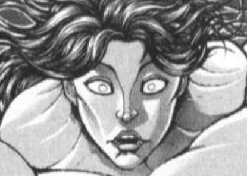
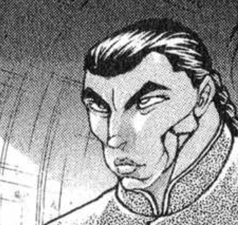

附上上一层忘记放的骰子以及小吐槽

由望远镜海皇 @望远镜300  制作的视频第二季第20集更新啦！

本期的内容是纯狐战后的余波(?)，感兴趣的话就去看看吧！

大概周三晚上七点半左右更新

~更新前的说明~

由于像之前那样完成写一轮下来再在最后写异变回会变得十分拖沓，因此这次我们先把异变回更完再看情况更其他的）

反正本来也没什么硬性规定我就随便来啦！

于是本次的更新内容是异变前置回，下一层开始更新

~？？？~

向上攀登吧

穿过幽寂的黑暗，将雾与石抛在身后

横渡青绿与白霜，跨越夜空下的天棚

向上飞翔吧

岩壁耀耀生辉，接应着垂下的星光

山峰高耸入空，勾连着无主的苍穹

终于停步，凝望着眼前所见之物

山的顶端是有月的天空

七色的虹桥架于清光之上

仿佛抵达了世界的最高处，只要向前伸手，就能将一切握于掌中

“……”

自空中传来了声音

呼唤者从彩虹走下

一瞬之间，光芒变得更加绚丽

映照在眼中，模糊了她的容颜

“特别的时刻……”

辉光淡去，眼前所见再度回归平常

她默默聆听着对方的话语，心中思索的却是与此无关的问题

为何此夜风景，如斯美丽？

“我所创造的……”

“值得纪念……第一次……”

又有两人来到了山顶

三道不同的声音说着不同的话题

但这些与她却并无关系，她又为什么会在这里？

随手摇晃着饱满的布袋，钱币相撞的轻响像极了山洞之中的水滴

声音将思绪唤回，声音令交谈停歇

大家不约而同地笑着，开始了今夜的正题

啊，原来如此

她恍惚地想着

山顶之上是月与虹架构的市场

不属于任何人的天空之下，却是交换所有权的场地

今夜的来意并非赏景，而是交易

于是正如每个市场中都能见到的一般，她们付出钱财，得到物品

“以140资金买入标本瓶”

“用280资金购买麦饭”

“300资金，卖出蜈蚣”

交出自己所持有的商品，购买自己想得到的能力

还有最后一个

“——资金，购买——”

所有的步骤都完成了

通过交易得到的商品在她们的手中散发着淡淡的微光

第一次尝试成功了，这令大家都很兴奋，她也一样如此

她们将测试用的物品各自收回，在道别后飞往不同的方向

离去之前，她再次深深凝望着，凝望着这月与虹的星空

比起方才结束的秘仪，这夜晚却更加令她触动

或许是因为由得到而感受的触动总会消退

而因感受而得到的触动，则会永远留在心里

~这件事发生在烈海王来到幻想乡的第【1230+1d30:22=1252】天~

~永远亭~

BGM：热き决闘者たち

“——我发动第二张龙之镜，将墓地的三只青眼亚白龙除外，出来吧，青眼究极亚龙！”

白发少女以几乎要将卡牌拍烂的气势将手中的怪兽卡甩在了决斗盘上，银白色的巨龙投影在场中，与另外两体巨龙一同向着它的对手发出了惊天的咆哮

妹红：盖伏一张卡，回合结束。

现在我的场上有着青眼究极龙，真青眼究极龙和青眼究极亚龙！

下个回合，就是我的胜利！

辉夜：哦，这可不一定啊

我从手牌特殊召唤抒情歌鸲-绿松石莺

蓬莱人掀开了埋伏卡，其表情之自信足以令旁观者坚信这张卡可以毁天灭地

妹红：这个瞬间，我发动陷阱卡：强韧！无敌！最强！

指定场上的青眼究极亚龙，让它不受自身以外的卡的效果影响，不会被战斗破坏，和那只怪兽进行战斗的怪兽在伤害步骤结束时破坏。

青眼究极亚龙本身不会成为对方的效果的对象，不会被对方的效果破坏，这样一来就集齐全抗性了！

游戏结束了，辉↗夜↘！

辉夜：哦，结束了？那我发动绿松石莺的效果，这张卡从手卡的特殊召唤成功的场合才能发动，从自己的手卡·墓地选1只「抒情歌鸲」怪兽特殊召唤，我从手卡中召唤钴尖晶雀，这张卡特殊召唤成功的场合可以从卡组将一只鸟兽族的1星怪兽加入手卡，我选择的卡片是青玉燕。然后以绿松石莺与钴尖晶雀作为素材，XYZ召唤抒情歌鸲-吟诵椋鸟。发动吟诵椋鸟的效果，将一个XYZ素材取除后从卡组将一只鸟兽族的1星怪兽加入手卡，我取除作为素材的钴尖晶雀将天青石鹡鸰加入手卡。发动青玉燕的效果，自己场上有鸟兽族怪兽存在的场合才能发动，这张卡和1只鸟兽族·1星怪兽从手卡特殊召唤——于是天青石和青玉都被召唤到了场地上，发动天青石的效果，将抒情歌鸲-护鸟圣域加入手卡。接下来是第二次XYZ召唤，将天青石和青玉重叠召唤第二只抒情歌鸲-吟诵椋鸟。发动第二只吟诵椋鸟的效果，取除作为XYZ素材的天青石，将绿柱石金丝雀加入手卡。而后以两只吟诵椋鸟设置箭头，Link召唤，Link2同盟运输车！发动绿柱石金丝雀的效果，将手卡中的绿柱石与墓地里的青玉特殊召唤，将这两只怪兽重叠，XYZ召唤抒情歌鸲-聚集夜莺。当青玉被作为XYZ素材召唤风属性怪兽时，可选取墓地中的一只「抒情歌鸲」怪兽重叠在下方作为XYZ素材，我选择墓地中的吟诵椋鸟，再发动墓地中天青石鹡鸰的效果，将其重叠在聚集夜莺下作为素材。

发动同盟运输车的效果，从手卡·卡组中选择一张原本种族·原本属性与场上怪兽相同的怪兽当做攻击力上升1000的装备卡给其装备，我从卡组中选择风属性的怪兽卡：女武神的战车，这张卡在给怪兽的装备的场合，每次攻击宣言时都可以令怪兽的攻击力上升500点！

最后再发动手卡中的永续魔法：抒情歌鸲-护鸟圣域，虽然已经没有意义了但还是用一下吧，一回合一次当有持有超量素材3个以上的超量怪兽在自己场上存在的场合可以从卡组抽一张卡——嗯，这样就结束了。

妹红：额，啊，所以你做出了一个四素材的攻击力0的怪兽，算上同盟车与女武神的加成是攻击力1500点……

这在我的全抗性青眼面前不是毫无意义吗

辉夜：再仔细看看吧~

聚集夜莺的攻击力数值为其XYZ素材的数目X200，而以绿柱石为素材召唤的风属性超量怪兽的攻击力会上升200，也就是说聚集夜莺在第一次攻击宣言场合的攻击力为2500点。然后聚集夜莺可以对对手直接攻击，其攻击次数为XYZ素材的数目，也就是说蘑菇碳这个回合要受到4次直接攻击

妹红：哎，哎哎？

等会！我场上这么大一条究极龙——！！

辉夜：对藤原妹红进行四次直☆接☆攻☆击

每一次攻击宣言都会让聚集夜莺的攻击力上升500，你所收到的伤害依次是——

2500点！3000点！！3500点！！！4000点！！！！

Lp：8000-2500-3000-3500-4000=0

赢了，真是一次有趣的决斗啊！

妹红将手卡一摔，大声哀嚎

妹红：有趣个鬼啊！

这样的游戏是无法带来笑容的！！

我不玩了！！

“嘎吱~”

游戏室的门被人推开了，武术家与月兔端着盘子走了进来

烈：下午刚做的冰粉我给你们放桌上了……

这是在干什么？

月兔少女扫了眼屋中的惨状与自家大小姐那得意洋洋的笑容，了然答道

铃仙：辉夜大人在和妹红玩卡牌游戏呢

他们眼睁睁地看着一败涂地的少女身上燃起了熊熊烈火

游戏室中出现了一只翱翔的凤凰

这场两回合结束的卡牌游戏在5秒钟后就发展为了一种大家更熟悉的游戏形式：弹幕决斗

~【1d60：51】分钟后~

~医务室~

师匠：你们有什么想说的？

妹红：我以后再也不玩卡牌游戏了

辉夜：输不起的蘑菇碳~

月之头脑随和地笑着

师匠：这已经是这周你们因为这个游戏开始的第【1+1d6：2=3】次大规模损害事件了

总之你们的卡组这个月我就先没收了

妹红如释重负般交出了卡牌

妹红：我已经彻底不想玩这个了……

公主大人磨磨蹭蹭找借口推脱，但卡组还是被强制没收了

辉夜：哎~~

永琳~~我还没玩够卡牌游戏呢！

师匠：那就找点其他卡牌游戏玩

游戏王以外的

旁观的众人悄悄松了口气

烈：（干得好，永琳！）

（这样一来终于能过上安生日子了！）

黑发少女阴恻恻地看了过来

辉夜：但是其他的卡牌游戏我也玩腻了，怎么办呢~

啊，有了有了

你们看上去很闲的样子啊？

“我想起来今天还有点事——”

“辉夜大人我该去买菜了！”

“兔子们说竹林里有事发生了我去看看呜撒！”

“嗷嗷嗷嗷嗷嗷嗷嗷嗷啊！”

全力开动脑筋的众人在瞬间找好了借口，可对于不讲道理的大小姐而言这一切都是无效！

绝望！绝望！何等绝望！但该发生的事情总会发生，他们已经料想到了接下来会发生什么——

辉夜：那就去帮我找个新的卡牌游戏玩吧~

这个夏天，永远亭众人接到的第一件任务是寻找卡牌游戏

【1d15：15】分钟后

~庭院~

皮克：嗷嗷嗷嗷嗷嗷啊？

（卡牌游戏是什么啊？）

烈对卡牌游戏的了解【1d100：78】

烈：卡牌游戏是桌上游戏的一种，其历史最早可追溯到我们中华楚汉争霸时期所发明的“叶子牌”，其传自西方后演变为了桥牌与扑克牌等等你们熟知的纸牌。

辉夜小姐所说的卡牌游戏指的应当是“集换式卡牌游戏”，万智牌、宝可梦卡牌以及她这几天在玩的游戏王都属于此类型。近年来也有在手机/电脑平台上运营的卡牌游戏，不过这我就不是很清楚了

因幡帝：不是，烈海王

你一个武术家为什么会对这个这么了解啊？

原因是【1d10：10】

1 武术班的学员们

2 白林寺的小卖部

3 刃牙（喂！）

4 其实是卡牌游戏爱好者

5 芙兰朵露的游戏

6 前段时间被辉夜抓去打牌了（为啥啊）

7 关系很好的朋友们中有牌佬

8 赫卡提亚的游戏

9 勇次郎（喂！）

10 大成功/大失败【1d2：1】

草草草草，大成功是什么【1d10:9】

1 拥有自己卡组的决斗者！这方面的情报还挺多的

2 “来打牌吧~”有牌友来了

3 前段时间找到的零工是卡牌设计（为啥啦）

4 拥有自己卡组的决斗者！这方面的情报还挺多的

5 “来打牌吧~”有牌友来了

6 经常一起打牌的格斗家们（为啥啦）

7 拥有自己卡组的决斗者！这方面的情报还挺多的

8 “来打牌吧~”有牌友来了

9 前段时间认识了业界相关人士（不要啊）

10 大成功/大失败【1d2：1】

烈：我本来也只知道“叶子牌”的历史

是前段时间偶然结识了业界相关的人士，才扩展了这么多知识

铃仙：在我不知道的时候阿烈又扩展了莫名其妙的人脉？！

烈：没，我记得我跟大家说过来着

大概是【1d6：1】

1 情人节前

2 情人节前

3 上个月

4 这个月

5 半年前

6 动物灵异变后（开什么玩笑）

烈：差不多就在情人节前几个周的时候……算起来也是上个季度的事了啊

武术家用手捏着下巴，回忆起了前些天发生的事情

所以你们到底是怎么遇见的啊【1d10:5】

1 幻想入不久遇到了亲切的武术家

2 在街头徘徊寻找商业灵感的时候

3 雀食堂的饭友（为啥啊）

4 幻想入不久遇到了亲切的武术家

5 遇到了在竹林中迷路的可怜人

6 一饭之恩（为啥啊）

7 幻想入不久遇到了亲切的武术家

8 某位贤者的侦探委托

9 穷困潦倒时提供了启动资金（为啥啊）

10 大成功/大失败【1d2：2】

~几个月前~

~迷途竹林~

新年刚过，初雪消融，这是冬末春初的某一天

武术家提着一袋子菜走在小路上

一只毛茸茸的兔子从竹林深处跑来，戳了戳他的假腿

烈：？

怎么了？

烈海王跟着兔妖怪走去

几分钟后，一个陌生人的声音传入了他的耳中

“有人吗~请问有人在吗~”

“我到底跑到什么地方了……”

武术家了然点头

是常有的事，又有人在竹林里迷路了

平常这些迷路的人会被妹红指引着出去，运气好的时候也会被兔子们引导向正确的道路

今天八成是兔子正巧遇见了自己，就索性将这麻烦事一并交来

烈：这里是迷途竹林，是很容易迷路的竹林

我是永远亭的武术家，烈海王

你是来找医生看病的吗？

？？？：太好了，终于见到能正常交流的人了

我不需要看病

实际上，我……迷路了

武术家又一次点起了头

烈：看得出来

？？？：不，不是你以为的那种迷路

虽说我现在的确也在这里迷路了但这和我想表达的意思是不一样的

武术家第三次点头，以温和的眼神鼓励这位陌生人继续说下去

？？？：总而言之我想说的是……

联系上了相关人员后总算进入了结界，结果回过神来的时候居然就被不负责任地扔在这种连个人影都见不到的地方这样的服务态度也实在是太恶劣了！

请问一下，我现在应该已经到了幻想乡了……吧？

烈的说明【1d100：40】（50以上理解）

烈：你这身打扮出现在人里大概会引起骚动，直接送进山里可能会被判定为入侵者，灵梦应该也不管这事

难不成是懒得说明情况就投放到这里了？那去森林找魔理沙也可以啊……

在一头雾水的陌生人面前，烈海王喃喃自语起来

？？？：可以拜托您说日语吗

烈：不好意思，我平常也兼职当侦探，刚刚是职业病犯了

你没找错地方

这里就是幻想乡

~【1d30：22】分钟后~

武术家亲切地说明了初来者在此地的注意事项

尽管他手舞足蹈的说明略微有些扣分，但其丰富的经验确立了自己在对方心中“资深者”的形象

烈：——差不多就这些

这些地方以你的实力还是尽可能绕着走，之后就想办法找个地区站稳脚跟吧

？？？：咳咳

首先，非常感谢你的说明——虽说其中有些难以理解的地方，但对我而言确实是十分有用处的，在这里正式表示谢意

然后……我之前被你的气息干扰了没敢确定，但你应该是人类啊

“以你的实力”之类的，人类用这种口气和我说话也未免太失礼了！

烈的察觉【1d60：32+40=72】（75以上察觉身份，90以上察觉背景）

身材健壮的男人一板一眼地说着

烈：（看这打扮某非是彩虹的妖怪？或者帕秋莉小姐那样的魔法使也有可能啊……）

我是不清楚你的身份，但这与你的实力没有关系

现在的你很弱小，这是毋庸置疑的事实

在实力变强之前，还是谨慎行事吧

陌生人的表情相当尴尬

？？？：您讲话可真是直白……

唉，事到如今居然落魄成这样……

烈：你大可想开点

倒霉的不光你一个

这幻想乡里最不缺的就是在外面混不下去的人，从这个角度来说大家都挺惨的

陌生人看上去就像是喝奶茶时珍珠卡在了嗓子眼里一样

？？？：谢，谢谢安慰

呼……不能再这样颓废下去了，到了新的地方就要打起精神从头开始才行！

请问你知道幻想乡中哪里适合开办集市吗？

烈的理解【1d100：8】

武术家沉思片刻

烈：你是想干菜市场？

那我建议你换身朴素点的衣服跑人里那边租个摊，想进新鲜蔬果可以联系妖怪之山那边的秋姐妹，进鱼类就去找三途河畔的润美小姐……

？？？：不是这种集市啊！！

不，其实也算是这种！！但我不是来卖菜的！！！

烈：那你是想开小卖部？

就一个玻璃柜台后面一排子小商品单价100元那种杂货店？

？？？：我喜欢实体经济但这种还是算了吧我想做的是支付金钱得到货物有批次有秩序大规模进行所有权的转让活动！

烈：哦哦哦，懂了，你是想找人合伙创业是吧

那我建议你去妖怪之山看看

那边的居民都相当热衷于“赚钱”，像是河童、天狗、还有守矢神社的神明们

如果你已经有主意了，不妨试试和他们合作

在武术家眼中打扮相当怪异的陌生人闻言沉思起来

？？？：妖怪之山……坦白来说我现在还没想到什么好点子……但之后还是去看看吧

虽然你说话不太好听，但还是再次向你表示感谢

谢谢！

烈：无所谓，大家都这样说

祝你成功

以及那边是去永远亭的路，出竹林得往这边走

~时间回到现在~

因幡帝：我想起来了

是三个月前兔子们汇报的那家伙啊，打扮花里胡哨的迷路者

皮克：嗷嗷嗷嗷嗷嗷啊？

（那人的实力如何？）

烈：在那时差不多是没学武术时的莉格露海王的水平

在刚见面的那个时候

铃仙：那不就是个小妖怪嘛

阿烈你说的一点没错哦，这样的实力还是要小心些的

烈：之后一段时间又遇见了她几次，听说目前在和人合作搞集换式卡牌游戏，说是项目潜力很大

看来她的买卖做得还挺好的

月兔的耳朵耷拉了下来，本就皱皱巴巴的兔耳显得更加无精打采了

铃仙：又绕回集换式卡牌游戏了

结果该去哪帮辉夜大人找新卡牌游戏啊……

烈海王要做什么【1d10：3】

1 这里就靠我烈海王的情报收集

2 自己来做一套！

3 铃仙：去问问新认识的这人（你知道人家住哪吗）

4 这里就靠我烈海王的情报收集

5 这里就靠我烈海王的人脉

6 皮克：小铃和阿求最近好像在玩类似的游戏（真的吗）

7 这里就靠我烈海王的情报收集

8 提出委托吧

9 因幡帝久违的亲切欺诈术（为啥啊）

10 大成功/大失败【1d2：1】

“有了！”

像是想到了什么好主意一样，紫发少女的兔耳朵“蹭”得立了起来

铃仙：阿烈你新认识的这人就是在做卡牌游戏的吧

那直接让辉夜大人玩她做的卡牌不就行了？

皮克：嗷嗷嗷嗷嗷嗷啊

（好主意）

嗷嗷嗷嗷嗷嗷嗷嗷啊

（省得大家大热天再跑一趟）

帝：你有那人的住址或者联系方式吗？

？？？的社交力【1d100：32】（非好感度，50以上有联系方式，75以上知道住址）

武术家耸了耸肩

烈：没有

虽然会一块聊天，但我们没交换过联系方式，也并不知晓对方私下的生活细节

帝：其实关系不怎么好吧你们

烈：倒也不是

有意或是无意的，定期或是不定期的，遇上了之后就会一起聊聊……

皮克应该就很容易就能理解

皮克：嗷嗷嗷嗷哦啊哦啊

（就像外界的朋友们那样）

烈：对，有点像这种感觉

不过皮克刚出现的时候情况是相反的，大家都迫不及待地第一时间找上门了

藏在玩具里的独步、藏在水池里的杰克、藏在床底下的涉川……

铃仙：听上去完全就是一群变态跟踪狂啊皮克没事吧？！

皮克：嗷嗷嗷嗷嗷嗷嗷嗷嗷嗷啊

（你和克巳当时站在玻璃外）

嗷嗷嗷嗷嗷嗷嗷嗷嗷嗷嗷啊

（克巳被范马勇次郎嘲笑了）

烈：那时的他还未成熟……我也一样

现在想想，真是段令人怀念的时光

接下来烈海王要做什么【1d10：6】

1 这里就靠我烈海王的情报收集

2 自己来做一套！

3 铃仙：想办法找到她！（抓住不放了吗）

4 这里就靠我烈海王的情报收集

5 这里就靠我烈海王的人脉

6 皮克：小铃和阿求最近好像在玩类似的游戏（真的吗）

7 这里就靠我烈海王的情报收集

8 提出委托吧

9 因幡帝久违的亲切欺诈术（为啥啊）

10 大成功/大失败【1d2：2】

帝：在旁人听来完全就是非常识者们的变态日常嘛

所以这段回忆与解决我们目前面对的问题有关吗

烈：没有吧

铃仙：是哦！果然没关系哦！

作战会议已经开了将近半小时了进度依然为0啊！

说到底我在现实生活中就没看到过几个玩卡牌游戏的人啦！！

皮克：嗷嗷嗷嗷嗷嗷嗷啊

（我就有看到过啊）

嗷嗷嗷嗷嗷嗷嗷嗷嗷嗷啊

（阿求和小铃这两天就在玩奇怪的牌）

嗷嗷嗷嗷嗷嗷嗷嗷嗷嗷嗷啊？

（大家都看着我干吗？）

武术家将手抬高，拍了拍友人的肩膀

烈：你要是早想起来这事大家就不用在这讨论了

那皮克去铃奈庵问问……算了皮克对这个不大了解，如果是辉夜小姐已经玩过的卡牌就又白跑一趟了

我跟皮克一块去铃奈庵看看吧

铃仙&amp;帝&amp;皮克：……

地上兔、月兔和原始人以一种令人发毛的眼神看着烈海王

铃仙：阿烈 和 皮克 去 铃奈庵

帝：简直就是开启灾厄之门的钥匙……

皮克：你那还算是人……

（火山爆发前的地震……）

烈：怎么了这是？！

铃奈庵是什么魔窟吗？！

铃仙：阿烈，你冷静下好好想想

上次你和皮克两个人去铃奈庵是调查本居小铃失踪案的时候

在那之后发生了什么你比我们更加清楚，吧

某人的额头上瞬间冒出了大量冷汗

烈：那种事不可能发生第二次的……

皮克：嗷嗷嗷嗷嗷嗷嗷嗷啊

（完全就没有再发生一次的条件啊）

铃仙：说得也是~

三人微笑着点头，难以言喻的噩梦已经过去，如今早就是翻篇不知多久之后的故事了

帝：“烈海王被之前关系很好的某位女性友人带进家里然后哔——”这种事再发生一次的可能性……

烈：结果你还是说出来了我不想去了！

于是过一个烈的同行【1d100：36】（皮克默认跟着，50以上有其他人一起）

皮克：嗷嗷嗷嗷嗷嗷嗷嗷嗷嗷啊！

（放心吧，这次我会看好烈海王的）

铃仙：交给你了，皮克……！

烈：只是去看下卡牌而已为什么会变成这种莫名其妙的氛围？！

在两位同僚充满关怀的注视下，武术家与原始人踏上了前往铃奈庵的道路

这仅仅是追寻卡牌游戏的开始，居然就已经艰难到了如此的地步……！

路上有事发生吗【1d100：33】（50以上有事发生）

一路平安无事

【1d60：5】分钟后，越想越觉得背后发毛的烈海王与皮克以最快速度飞到了人里

~铃奈庵~

现在已经过了午饭时间了，借书屋中一片安静，似乎没什么客人

身材高大的原始人矮下身子，穿过门帘，向着书桌兼办公桌的方向举起了手写板

现在的铃奈庵【1d10：2】

1 正常营业中，阿求在做客

2 卡牌游戏！

3 用这个卡牌去触发妖魔书的话……（为啥啊）

4 正常营业中，阿求在做客

5 卡牌游戏！

6 用这个卡牌去增强战斗能力的话……（为啥啊）

7 正常营业中，阿求在做客

8 卡牌游戏！

9 卡牌贩售中（改卡店了吗）

10 大成功/大失败【1d2:1】

小铃与阿求的牌库充裕度【1d100：38】（初期卡牌数量较少，50以下默认一人一张，51~75其中一人有两张，76以上其中一人三张）

小铃持有的卡牌是【1d10:6】

1 可靠的弟子狸

2 铃瑚团子（有她的魔力吗）

3 小石子帽子（为啥啊）

4 可靠的弟子狸

5 疾风木屐

6 皮克卡牌 能力类（是什么啊）

7 可靠的弟子狸

8 河童的泡泡枪

9 皮克卡牌 装备类（是什么啊）

10 大成功/大失败【1d2：1】

皮克（手写）：下午好，小铃

我来还上次的书，顺便问问你们最近在玩的那个游戏

皮克：嗷嗷嗷嗷嗷啊？

（小铃？）

在没有客人的时候，借书屋的看板娘兼店员兼老板的女儿大部分时间都在那张显眼的桌前戴着眼镜看书，少数时候也会和友人坐在小沙发上喝茶聊天

但今日，两人没有在铃奈庵的店面处看见橙发少女的身影

烈：阁楼的方向有人的气息

那应当是小铃小姐，但还有些若有若无的魔力……

（注：原作漫画中未明确说明小铃的阁楼是在铃奈庵中还是另外的建筑里，本贴中为了方便起见而设定在了铃奈庵里，仅供参考）

两人侧头对视

在铃奈庵，小铃身旁感受到了魔力反应，那十有八九就是……

越想越不对劲的烈与皮克立即展开行动

他们三两步跨上台阶，登上阁楼

普通的木门在格斗家面前与纸片没有本质区别，更何况这里的门本就没有上锁而是虚掩着

过低的天花板让原始人只能以弯腰屈膝的姿势半蹲着，他一把将门推开，将头探入

皮克：嗷嗷嗷嗷嗷嗷啊——

（小铃，你又在看什么古怪的妖魔书——）

皮克脱口而出的叫声才到一半就恰在了嗓子眼里

他看到某位紫色头发的文学少女坐在角落，手中用以表示赞叹的扇子才挥到一半就停在了半空；而用着铃铛发饰的橙发双马尾少女此时此刻就在阁楼的中央，她将两手高举过头，身体前倾，张牙舞爪，怒目圆睁，看上去像极了一只炸毛的小动物

“小动物”缓慢扭过头来，恰似被半速播放而又掉帧的视屏影像，她转了转眼珠，尴尬地开口

小铃：嗷嗷嗷嗷嗷嗷嗷啊

（皮克你怎么上来了？）

阁楼上本就高得不可思议的尴尬氛围随着这句嚎叫而达到了巅峰，几近液化

烈的情商【1d100：29】（保底20）

武术家依靠他丰富的经验快速做出了判断

烈：原来如此，小铃小姐在练习皮克拳

小铃：嗷嗷嗷嗷嗷嗷啊！

（这是卡牌的效果！）

阿求：皮 克 君

带着朋友闯进小铃的房间可不是什么有礼貌的行为啊

皮克老老实实地举起了写字板

皮克（手写）：我以为又是妖魔书事件

小铃到底在干什么呢？

【1d15：3】分钟后

小铃与阿求的说明【1d60：33+40=73】（幻想乡的记忆+40,50以上理解）

铃奈庵的看板娘正给来访者们沏茶，紫发的史官则将方才的事件徐徐道来

阿求：刚刚你们所看到的既不是妖魔书，也不是妖怪们的法术或能力引起的异状

那是“卡牌”的效果

烈：阿求小姐指的是语言功能退化？

橙发少女咬牙启齿地放下了两个茶杯

小铃：不是啦！

那张皮克卡的效果是“进入战斗模式”，只会嗷嗷叫是意想不到的负面作用！

皮克：嗷嗷啊？

（我的卡？）

烈：皮克的卡？

阿求：单凭语言说明就让没有接触过这个的你们两人理解应当是比较困难的，那就直接来看下吧

看，这就是小铃刚刚所用的“卡牌”

“我的卡牌啊啊啊~”

紫发少女用力从依依不舍的友人手中抽出了一张纸质卡牌，将其置于桌上，用两根手指轻推到两人面前

烈与皮克将卡牌拿起，仔细观察

卡牌的正面是由黑框包裹着的简易图像，其上所画的是个披头散发的男性侧脸，其嘴角咧开，露出口中狰狞的獠牙

卡牌的背面则是细小的说明文字，与略大一号的名称

【原始人的霸气】

皮克的能力，可以大幅度提高肉体强度与环境适应性，但使用时会暂时失去大部分语言功能

一旦被击中就会失去战斗能力，所谓的人类就是这样脆弱的生物

但太古的来客不会畏惧区区弹幕

承受多次射击后将敌人撕碎，这才是原始人的作风

同时不能讲现代的语言了，因为是原始人

皮克：嗷嗷嗷嗷嗷啊？

（这画的是我？）

小铃：是的，是皮克的卡~

我刚刚试着用了一下，感觉身体里充满了力量呢

这样一来我也能参加妖怪退治了！

烈：做不到的

就算暂时增强了力量，你也没有皮克的技术与战斗经验，靠着一腔蛮勇去找妖怪们对决也只会落得惨败的下场——我说错什么了吗？

借书屋的女儿气鼓鼓地盯着武术家

阿求：没说错什么，但也没考虑到他人的想法呢

就算是我也有过退职妖怪的梦想，这就是所谓的“少女心”啊

皮克：你那还算是人

（好强健的少女心）

幻想乡的史官重拳出击，一击上勾拳打在了皮克的腹部

但是什么都没有发生

阿求：疼疼疼你给我把腹肌收起来！

就是这么回事，我和小铃在玩的是最近在部分人中传开的“能力卡牌”

这里过一个烈的察觉【1d60：13+40=53】（逆转的名侦探+40,75以上成功）

黑曜石侦探挠了挠头

烈：（感觉有点奇怪……是我的错觉吗）

（这卡牌的魔力反应比起小铃小姐书架上的一些妖魔书都低，应该挺安全吧……）

“能力卡牌”，听上去是辉夜小姐会喜欢的类型

皮克：嗷嗷嗷嗷嗷啊？

（阿求也有卡牌吗？）

（休息二十分钟左右我先去洗个碗，大概20:40左右继续）

阿求持有的卡牌是【1d10：10】

1 云入道之拳

2 阴阳玉

3 不死鸟之尾（为啥啊）

4 云入道之拳

5 疾风木屐

6 有钱能使鬼推磨（为啥啦）

7 云入道之拳

8 迷你八卦炉

9 皮克卡牌 装备类（又是皮克吗）

10 大成功/大失败【1d2：1】

阿求的卡牌大成功！

大成功是什么【1d10:4】

1 云入道的连打！

2 阴阳鬼神玉

3 真·万宝槌（为啥啦）

4 云入道的连打！

5 迷你魔炮

6 地 底 太 阳（为啥啦）

7 云入道的连打！

8 辉夜姬的秘密宝箱……中的秘宝

9 大天狗的麦饭（为啥啦）

10 大成功/大失败【1d2：2】

阿求：我的卡牌是这张

——【云入道的连打】！

紫发少女拿出了一张画有粉色巨拳的卡牌

在念出卡牌的名称之后，粉色的云雾凭空浮现在她的双手周边——紧接着，云雾凝结为十分眼熟的巨拳，稗田阿求以她平时望尘莫及的速度开始了连打！

阿求：欧拉欧拉欧拉欧拉欧拉！

皮克：~

原始人在心中想着，这简直就是雌性……但阿求本来就是雌性，因此皮克无话可说

他不闪不避地站在原地，当这轮连打结束时，皮克已经被打退了几步

烈：是一轮师傅的卡牌啊

阿求小姐这样手无缚鸡之力的女子使用后都能让皮克后退，这可真厉害

史官气喘吁吁地甩着胳膊

阿求：皮克君……这个人……说话……一直都……这样吗……

皮克：嗷嗷嗷嗷嗷嗷嗷嗷啊

（他一牵扯到战斗就会变成这样）

嗷嗷嗷嗷嗷嗷嗷嗷嗷嗷啊

（这个卡牌还挺有意思的，辉夜小姐肯定喜欢）

嗷嗷嗷嗷嗷嗷嗷嗷嗷嗷啊

（这是在哪买的啊？）

阿求与小铃的卡牌来源【1d10:9】

1 登山训练时遇到了山童

2 天狗的推销

3 奇装异服的人（为啥啦）

4 登山训练时遇到了山童

5 河童的生意

6 笑容邪恶的人（为啥啊）

7 登山训练时遇到了山童

8 推销卡牌的猫猫

9 其实偷偷去了大夫的……（为啥啊！）

10 大成功/大失败【1d2：1】

不知为何，一向冷静而自信的少女此时却支支吾吾，眼神游离

阿求：嘛，这个卡牌是，那个……

通过我私人的渠道……怎么说呢，是皮克君不太能理解的那种……

小铃：虽然象征性地花了点钱，但其实是我和阿求在妖怪的赌场里赢来的！

阿求超厉害！“showhand！”“梭哈！”这样说着把筹码全~部扫过来大赢特赢了一场！唔啊啊啊啊啊啊……

稗田阿求用两根纤长的手指使劲戳着友人的额头

阿求：你给我注意下气氛啊别在他们面前说这个！

皮克：嗷嗷嗷嗷嗷嗷嗷嗷啊

（烈海王，赌场是什么地方？）

烈：无论是孩子还是成年人还是妖怪还是神明还是其他的物种都不应该去的地方

记得我们偶尔会玩的“打赌”吗？把赌注换成金钱或等值的高价值物品，把游戏规则设置得更具有风险性，吸引客人来挥霍金钱，就是这样的场所了

在外界的一些地区这也算是合法的，花山手下应该就有类似的产业，我在拉斯维加斯也见过不少

说到这里，看了这么多书的你应该能理解吧

原始人慈眉善目地看向了两个小女孩，其表情之和善足以让哭泣的孩子擦干眼泪闭上嘴顺道去厨房做个三菜一汤

皮克：嗷嗷嗷嗷嗷嗷嗷啊

（为什么要去这种地方？）

史官毫不犹豫地出卖了朋友

阿求：带小铃去爬山时恰巧路过她说着“哇哇哇是妖怪们的游戏我想去看看！”实在是拗不过于是就进去玩了一两把顺便赢了两张牌回来

小铃：全部推到我头上了明明阿求你也很有兴趣的？！“这可是难得的了解妖怪的机会”这样说着就把妖怪们的钱全都赢走了！

烈的好奇心【1d100：3】大失败（50以上询问详细情况）

草，这里大失败是什么啊【1d10:5】

1 名侦探推理出了全过程……但是被少女们讨厌了

2 赌场中一败涂地的某人来再战了！

3 某本妖魔书暴走了（为啥啊）

4 名侦探推理出了全过程……但是被少女们讨厌了

5 赌场中一败涂地的某人来再战了！

6 不小心弄坏了一张卡牌（为啥啊）

7 名侦探推理出了全过程……但是被少女们讨厌了

8 赌场中一败涂地的某人来再战了！

9 神明大人的嘱咐被忘在了脑后，今天身上没带钱（为啥啊）

10 大成功/大失败【1d2：1】

是谁啊【1d10:3】

1 秋静叶与秋穰子

2 键山雏

3 诹访子（为啥啦）

4 犬走椛

5 坂田合欢

6 山如（你搞笑吗）

7 庭渡久侘歌

8 山城高岭

9 邪恶的白狐（你搞笑吗）

10 大成功/大失败【1d2：2】

烈：（阿求小姐居然能自己爬山了，应当是这段时间持续每日训练的结果）

（皮克的严肃说教应该会起到效果，之后就去一趟山上的赌场看看情况吧……）

嗯？

“打搅了~请问这里是铃奈庵吗~”

稚嫩的童音传来，矮小的顾客穿过门帘，踏入店内

武术家看着那顶别具特色的帽子，发出了疑惑的声音

小铃：（好机会！）

是的请问您是要借书吗~

看板娘趁机摆脱了友人的说教，将脸上写着“你这叛徒”的阿求留下并手忙脚乱地跑到了桌前迎客

“来借书店的不光是客人，也有其他的人哦”

诹访子：比如，仍未尽兴的玩家

小铃：你是，前两天输得精光的那位——！

诹访子：啊-呜-

找到你们了

让我们再来一局游戏吧？赌上这张新的卡牌~！

守矢神社的三柱神明之一，统领祟神的土著神，掌握坤之力的洩矢诹访子亮出了一张崭新的卡牌，向两位人类少女发出了赌局再开的邀请！

阿求：别这样看着我啊我也没想到神明大人的赌术会这么糟糕啊……

武术家一脸无奈地揉着太阳穴

烈：诹访子女士，我确认一下

你在妖怪开设的赌局里输给了阿求小姐和小铃小姐，然后现在又带着新的赌注过来准备再开赌局？

诹访子：幻想乡的人类头脑都很聪明，以前是听过这种说法，但稗田阿求在这些人类里面也是头脑最好用的那种呐

没想到，真的没想到，我居然会在这种游戏里输掉

武者抬手，表示自己已经完全理解了状况

烈：稍等一下我给早苗小姐发个通讯……

诹访子：别跟她说呀早苗会变成恶鬼的！

小小的神明大人立即抢夺起了通讯器，其跳跃的身姿令人联想起了湖畔的青蛙

烈：早苗小姐说得完全没错吧！

诹访子：我也不做以大欺小的事情……

我会把力量限制在普通人的水平，除了合气道以外什么都不用

你们可以尝试用卡牌强化自己再来挑战呦

一人一次机会，有一个人获胜就算你们赢~

皮克：嗷嗷嗷嗷嗷嗷嗷嗷嗷啊

（从你过来这边找场子的时点就已经是以大欺小了）

诹访子：我获胜的话就将之前输掉的钱还给我

反之，这次再输就卖一张新的卡牌给你们

要来玩吗？

烈的察觉【1d60：53+40=93】（75以上成功）

武术家暂时放下了吐槽役的责任，因为对方的说法让他有些在意

烈：稍等一下，诹访子女士

输掉之后并不是“赠送”卡牌，而是“售卖”卡牌？

我想您不至于这么……

小铃：不是这样的，你不了解情况

诹访子小姐不能直接把卡牌送给我们

阿求：因为这种卡牌只能通过“交易”来入手，且一次只能交易一张

如果用“赠送”或者“抢夺”之类的，交易以外的方法拿到卡牌，就会令其失去力量

诹访子：那样的话，卡牌就会变成毫无用处的废纸片了~

虽说原本也是没什么用处的娱乐品呢

土著神在沙发上“kerokero”地笑着

她从衣兜里掏出张新的卡牌，在众人眼前一晃，又将其收了起来

开启赌局的邀请已经发出了，是否接受的权利掌握在少女们的手中

而旁观者们早已知晓此事的结局，热爱冒险、向往神秘的看板娘会拒绝神明大人的赌局吗？

小铃：这可是和神明大人掰手腕的机会，我接受

既然只是技术的比拼，那用这张皮克卡的话说不定就有胜机！

阿求：在皮克君面前用皮克君的卡牌好尴尬啊……

皮克：嗷嗷嗷嗷嗷嗷嗷啊

（发力时要大声喊出来）

嗷嗷嗷嗷嗷嗷嗷啊

（要想象自己在猎杀）

嗷嗷嗷嗷嗷嗷啊！

（一口咬下去！）

原始人无私地分享着他的经验，使用了皮克牌的小铃口中嗷嗷叫着表示答应

伴随着可爱的吼声与可爱的坏笑声，少女们的右手牢牢握在了一起！

诹访子的合气【1d100：6+50=56】（守矢流综合格斗术+50）

小铃的暴力【1d100：45+15=60】（简易皮克卡牌+20，普普通通的少女-5）

（开个小玩笑就放手……）

抱着这样的想法，她伸出了右手

出力比起与武术家初遇时相差甚远……甚至比不上和风祝日常试手的时候……

要打比方的话，该怎么说呢？

“举起一双筷子”，大概是这种程度的力量吧

这就够了

对于守矢流综合格斗术的大师，精通合气道的诹访子而言，这点微不足道的力气已经绰绰有余

扳倒壮汉？扳倒动物？扳倒妖怪？

全部不在话下！

诹访子：哦哦，这是……

合气道能够战胜壮汉，战胜动物，战胜妖怪……

但是

合气道能够战胜原始人吗？

说到原始人……

我们不妨以科学的视角来看看这独一无二的生物

21世纪初期，知名生物学家八意永琳曾经这样说过

“把自然界中诞生的所有非神秘生物和自史前复苏的原始人关在一个足够大的笼子里，结果会怎么样？”

“原始人会将除了自己以外的生物统统捕食”

“不仅如此，他还会将这笼子撕裂，向敢于囚禁他的狂妄者露出獠牙吧”

“这就是皮克在2.5亿年前的世界所面临的的困境”

“而事实上，他的确凭借自己的肉体将其跨越了”

太古的生物，比起现代的动物要可怕的多吧……

而正是战胜了那些古老的存在，皮克才能够出现在我们的面前

用最通俗易懂的话来说……

原始人……很强大！

原始人……很厉害！

原始人……令人敬畏！

小铃：嗷嗷嗷嗷嗷啊！

尽管只是用卡牌进行的拙劣模仿，尽管只是相比本体微不足道的分量……但少女依然得到了那属于原始人的力量

而在对方自持技术对其轻慢的时点

这场游戏的胜负，就已经决定了！

诹访子：！

合气道大师被压制回了沙发上！而书店的看板娘立即松手，兴高采烈地欢呼起来

小铃：嗷嗷嗷嗷嗷啊！

（居然是我赢啦！）

皮克：嗷嗷嗷嗷嗷嗷啊

（其实不困难，对吧）

阿求：双倍的嗷嗷乱叫听上去好乱……

你给我把卡牌解除掉啦，真是的

武术家在一旁拍了拍手

烈：这样就是二连败

您感觉如何？

两眼无神的神明大人呆呆地晃着脑袋

诹访子：从刚刚开始，就只能看到狂暴的绿头发巫女……

于是这里过个少女们的同情心【1d70：66+30=96】大成功（50以上就把钱还回去，基础的同理心+30）

大成功是什么【1d10:2】

1 诹访子：来当我的学员吧！

2 其实带了两张卡牌

3 就在这时早苗推门而入（诹访子——）

4 诹访子：来当我的学员吧！

5 其实带了两张卡牌

6 就在这时神奈子推门而入（诹访子——）

7 诹访子：来当我的学员吧！

8 其实带了两张卡牌

9 就在这时神奈子和早苗推门而入（诹访子——）

10 大成功/大失败【1d2：1】

小铃（小声）：她看上去好可怜，我刚刚是不是该输掉的啊……

阿求：不关你的事哦小铃，这就是自业自得了

好好，不管怎么说，让这样的诹访子小姐两手空空地回到山上也真是太过分了

你看，这里是之前赢来的所有财物

就当做是我们两人的供奉，请神明大人收下吧？

阿求将一个鼓鼓囊囊的钱包递了过去

诹访子的表情像是下一秒就要哭出来了

诹访子：谢谢你，阿求……

那作为回报，这两张卡牌就一块给你们了！

皮克：嗷嗷嗷嗷嗷嗷嗷啊？

（只是把诹访子的钱还给她而已为什么会像是做了大好事一样？）

烈海王双手抱胸，叹了口气

烈：为什么要远离赌场，想必现在的你已经完全理解了

烈：说来您居然还有卡牌？

您到底有几张这种卡牌啊？

诹访子：守矢神社和这个卡牌的制造者们本来就是合作关系嘛~

这次带过来的是这两张

第一张卡牌【1d10：5】

1 爆裂赤蛙

2 放入蛇蜕的护身符

3 洩矢的铁轮（为啥啊）

4 爆裂赤蛙

5 平安归来蛙护身符

6 有钱能使鬼推磨（为啥啊）

7 爆裂赤蛙

8 向神山的贡品

9 赤口大人（为啥啊）

10 大成功/大失败【1d2：1】

第二张卡牌【1d10：2】

1 爆裂赤蛙

2 放入蛇蜕的护身符

3 洩矢的铁轮（为啥啊）

4 爆裂赤蛙

5 疾风木屐

6 有钱能使鬼推磨（为啥啊）

7 爆裂赤蛙

8 向神山的贡品

9 赤口大人（为啥啊）

10 大成功/大失败【1d2：1】

神明大人拿出了两张画着护身符的卡牌

诹访子：平安归来蛙护身符，使用这张卡牌就能射出早苗惯用的爆炸青蛙弹幕，附赠平安归家效果

放入蛇蜕的护身符，使用这张卡牌就能射出早苗惯用的追踪长蛇弹幕，附赠身体强壮效果

是作为预计中的大热门卡牌而设计的早苗套装~

烈：早苗小姐本人知道这事吗？

诹访子：没关系没关系，早苗用的这两种能力本来就是我和神奈子给的嘛

结果这次居然又输了

之后还是玩概率游戏的赌局吧……

小铃：诹访子小姐，之后就还是别去赌场了吧

早苗小姐绝对会生气的

收回了赌本的诹访子远去了，只在众人的目中留下了一个萧条的背影

烈与皮克要做什么【1d10：6】

1 找阿求与小铃买一张卡回去吧

2 这里就通过诹访子的渠道买卡牌吧

3 就这样回去向辉夜汇报吧（为啥啦）

4 找阿求与小铃买一张卡回去吧

5 这里就通过诹访子的渠道买卡牌吧

6 去赌场看看吧（为啥啦）

7 找阿求与小铃买一张卡回去吧

8 这里就通过诹访子的渠道买卡牌吧

9 新的卡牌贩子来了（为啥啦）

10 大成功/大失败【1d2：2】

阿求：没想到又多了两张卡牌

多收集几张卡牌，我肯定也能够退治妖怪了~

少女们正兴致勃勃地测试着新卡牌的效果

武术家和原始人默默旁观着这一幕

烈（小声）：找她们两个买张卡牌带给辉夜小姐

这法子行不通吧

皮克（手写）：肯定行不通

我上次看阿求这么有兴致是在她写新小说的时候

烈：诹访子女士那边……估计她回神社之后也有的忙活，还是不给她添麻烦了

没办法，我去一趟妖怪之山的赌场吧

你要一块去看看吗？

皮克的兴趣【1d100：48】（50以上跟随）

皮克：嗷嗷嗷嗷嗷嗷啊

（我刚刚才和她们说完不能去赌场的）

嗷嗷嗷嗷嗷嗷啊！

（我得以身作则！）

烈：好嘛，我成反面教材了

阿求小姐，能问下那个赌场的具体位置吗？

我去给辉夜小姐买张卡牌

阿求：妖怪的赌场位于妖怪之山上的伪天棚

穿过那片偏僻的树林，再从山童集聚的秘天涯攀登而上，就能抵达那片夹杂着积雪的草原

单在口头说明的话有些麻烦，我在地图上标注给你吧

烈：悬崖之上的草原？

你带着小铃小姐独自跑去了这种地方？！

阿求：我在和皮克君的每日训练中掌握了高超的登山技巧，这种程度没问题！（注：见皮克追加日常回后的彩蛋）

能办到这些也多亏了你提供的训练计划，谢谢了

说到这里，紫发少女拘谨地表达了谢意

武术家点了点头，记下了地图上的大概方位

“像皮可一样带着女孩子去爬山会不会才是正常的约会？”他在脑中想着与卡牌无关的话题，将皮克留在铃奈庵，独自登山去了

烈海王前往妖怪之山了

路上有事发生吗【1d100：35】（50以上发生事件）

一路平安无事

【1d60：20】分钟后，没有迷路的武术家飞越了茂密的森林，开始沿悬崖向上攀登

~伪天棚~

不知今日的山童们在忙些什么，烈海王在路上并没有看到那些身穿迷彩服的小小少女

没受到任何阻拦的他很快就登上了陡峭的山壁，抵达了这片位于高山上的草原

BGM：驹草盛开的万年积雪

一望无际的青翠宛如一幅美丽的画卷在武者面前伸展开来

彩色的花朵是恰到好处的点缀，片片积雪仿佛饶有深意的留白，无处不在的妖精们自然也没有缺席的理由，她们捧着雪球或是花朵在草原上空自由地飞翔着，嬉戏打闹的身影为这风景画增添了另一抹亮色

烈：这样漂亮的地方居然开设着赌场，真不知妖怪们是如何想的

欣赏着这难得一见的风景，武术家在草原上空缓慢飞行

他尚未找到先前所听闻的赌场，一道略显不善的声音却穿入了他的耳中

“是个陌生的面孔啊”

“你来这深山上有什么事？”

自草原深处飞来的，是位粉紫色头发的赤瞳女性

她用黄色发带扎起了单马尾，上着右衽的红色上衣与红外套，下着多层的紫裙，双足未着鞋袜，只踩着一双木屐

她左手拿着一把金色折扇，右手持着龙形的烟管，在问完话后就将烟嘴伸到嘴边，轻吸一口，缓缓吐出缕缕白烟

烈：我的名字是烈海王，是一名武术家

我听说赌场有能力卡牌贩卖，这次想来购买一张

？？？的好感度【1d100：52】（75以上直接同意）

山如：这才多久就有人冲着卡牌过来了

是因为前几天那两个小女孩吗

我名叫山如，不过大家都叫我驹草太夫

也就是你在寻找的赌场老板了

驹草山如抬起烟管，指向武术家的后方

山如：我这里是赌场，不是杂货店

想要卡牌就从山脚的贩子那里买！

现在赶紧滚蛋

你要是不走，我就动手赶人了

烈海王要做什么【1d10：2】

1 那就来赌一把吧

2 这里就靠我烈海王的人脉

3 这里就靠我烈海王的口才（为啥啦）

4 那就来赌一把吧

5 这里就靠我烈海王的推理（你能推出什么啊）

6 你大可试试看！（为啥啊！）

7 那就来赌一把吧

8 这里就靠我烈海王的人脉

9 请问能介绍下山脚的贩子吗（为啥啊）

10 大成功/大失败【1d2：2】

烈的人脉【1d70：43+30=73】（大家的老熟人烈海王+30,75以上起效）

烈：（看来她的脾气算不上好）

我对和你战斗没有兴趣

我在山上也有些朋友，比如守矢神社的早苗小姐

看在她的面子上，就别这么不通情理了吧

驹草大夫撇了撇嘴，光看这表情武术家就知道他失败了

山如：你啊，难不成以为守矢神社是山上的老大吗？

不是啊，不是

这座山的老大是天狗，在那之前是鬼族，再怎么说也轮不到才搬来区区几年的神社做主

烈：是吗

才搬来几年就已经在山上有这样大的影响力了

看来守矢神社的确很有能力

赌场老板面色不善地吐了个烟圈

山如：我再说一次，想买卡牌就去找山脚的贩子

不然我就动手赶人了

烈海王要做什么【1d10：7】（这次失败就开战）

1 那就来赌一把吧

2 这么不想做生意就去找山脚的贩子吧

3 这里就靠我烈海王的口才（为啥啦）

4 那就来赌一把吧

5 这里就靠我烈海王的推理（你能推出什么啊）

6 你大可试试看！（为啥啊！）

7 那就来赌一把吧

8 这么不想做生意就去找山脚的贩子吧

9 靠我烈海王的财力！（为啥啊）

10 大成功/大失败【1d2：2】

烈：（看样子直接购买行不通，那么……）

妖怪的赌场，还不至于封闭到连人类客人都不接待吧？

山如：怎么，想来玩一把？

那倒是随时欢迎

你想要的卡牌也能作为游戏的彩头附上哦

山女郎立即收起了脸上的敌意，并换上了一副熟络的营业性笑容

烈：直接卖卡牌不做，当做赌局的彩头反而就行

这未免也太奇怪了

山如：我们这可是赌场呐

一点风险都不想冒就想从赌场拿到东西，会这样想的是什么样的人啊？

烈：不想参与这种活动的人

山如：这种人从最开始就不该来呐

抬手招呼着新的客人，驹草大夫领着武术家前去赌场了

