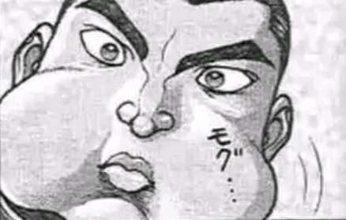

赌场今日的人气【1d100：28】

“下注了下注了……”

少女模样的荷官懒洋洋地吆喝着，换来了客人们零星的应和

骰子有气无力地滚着，像是酩酊大醉的酒客般在桌上摇摇滚滚，终于支撑不住，缓慢倒下

结果已经揭晓，赢了钱的顾客象征性地欢呼两声，赌输了的妖怪也并不多么在意，只有寥寥数人押了大注却大输一场，神情苦闷又躁动

若将氛围的热烈程度比作温度，那这时的赌场就像是炎天下的无风的室中，浮躁却不激烈，闷热却不沸腾

“呼~”

单马尾的山女郎肆无忌惮地吞云吐雾，让白色的烟雾拂过赌客们的面庞，飘上建筑物的穹顶，渗入这场所之中的每一个角落

似乎是被这烟草的味道所抚慰了，那少数赌客又变得安宁起来，他们将注意力投向了另一桌赌局，看上去是那样惬意，仿佛融化在了这闲适的氛围之中

武术家抬手挥散了飘至面前的烟雾

烈：你用烟草影响他们的情绪

山如：只是调整氛围的小技巧

这里是绅士们的社交场所，因为区区游戏而引发狂暴事件可得不偿失

说回正题——你想玩什么？

烈：无所谓

我不了解这些，你来决定就好

驹草大夫皱起了眉头

山如：哦，哦，原来是位初心者

你啊，不会连钱都没带吧？

烈：由于不时要帮人跑腿，我身上常备着些钱财

数目算不上多，但参加一场总还是够的

赌场老板看着武术家拿出的一叠纸钞，眉头反而皱得更深了

山如：这位小哥

你可真是彻头彻尾的外行人呐

人类的纸币在妖怪这里，能有什么价值啊？

烈：哦？愿闻其详

我在人里采购时一向都用的这些，在半妖的杂货店、河童的商人那边也能正常使用，怎么在你这里就用不了了？

山如的说明【1d70：34+30=64】（驹草大夫+30，50以上理解）

山如：能用是能用，确实是可以用

唉，该怎么和你说明呢……幻想乡最盛行的交易方式还是以物易物，这个你清楚吧？

人类的纸钞也不过是便于携带的交换用具而已，其价值和上面所写的面额可不是一回事啊

烈：我理解了

妖怪们只把纸钞看做“画着图像与数字的纸”，其本质与“少见的石头”或是“漂亮的贝壳”并无差别

你们并不承认其中蕴含着固定的价值

山如：在村落生活的人类们说不定会认同这些，但山上的妖怪们可不讲这套

你平常也用这些在妖怪的店里消费？

那八成是店主估计好了这些纸片“对她而言的价值”后，再算成对应的数额告诉你的

这样说来，老板娘、河童以及霖之助先生的心算还挺好的

不愧是独自开店的人

不知道在妖怪之山经商的那位数学又怎么样？

武术家的思绪再次飘散开来——他总习惯于同时想着好几件事情，这甚至令读心能力者也感到头疼——并将纸钞放在了赌桌上

烈：那么，这些对你而言能算多少？

资金力判定【1d10：1X100=100】

赌场老板不屑地笑了

山如：就这点啊？

用山上最近推行起的体系，给你算100资金力吧

小哥，你可得赢把大的才行

不然就凭这点资金，可什么都买不到

烈：好，那赔率也由你决定吧

武术家维持着那副死板的表情，丝毫不为对方的话语所动

那模样透露出来自骨子里的自信，活像是坚信自己一定会赢

山如：呵

你啊，是第一次参加赌局吧

刚来这里的新人都像你一样啊，尽管自己什么都不懂却还是莫名其妙地自信，直到自己连本钱都赔得精光，才摆着一副可笑的表情装作恍然大悟

赔率【1d5：2】（好感度50，不会定过高的赔率）

山如：行啊，既然你这么自信

赔率定为1:2，游戏是最简单的骰骰子，由我这个庄家来和你玩一把

你要是能赢就能从我这买一张200资金以内的卡牌，输了就留钱走人

烈：比我想象的要好很多

你很和善啊

山如：新人往往是最容易惹是生非的，烟草可不是万能的呐

游戏开始了，小哥

一共六个骰子，【共计得点最小】的就算赢！

山女郎将六个小骰子在桌面上一字排开，她随手抄起一个精巧的杯子，将印着点数的小方块们尽数捞起

木杯在她的手中飞速摇动，骰子们相互碰撞着发出清脆的响声，赌客们被这行云流水的动作吸引着目光，不由自主地注视着庄家那毫不停歇的手，直到她将木杯在桌上一扣，围观者们才终于与这清脆的敲击声一同发出赞赏的叹息

山如锁定了【3+1d3：1=4】个1面

其余二个骰子为【2d6：5 6】

山女郎抬起木杯，骰子乖巧地立成一串，最上面的四颗齐齐整整，均是一面向上，仅有余下两颗翻着五点与六点的面，像是藏在天鹅群中的两只公鸡

山如：合计15点

来，该你了

武术家拾起一颗骰子，仔细观察着

烈：留了两颗，还是这样大的面数……

你为何不将所有的骰子都骰成一面？

山如：结局已定的不是游戏，只是单纯用来宰人的局

让新人长个教训，这种程度就刚刚好

能赢就活该他走运，输了也不过是点不值一提的本金

拿捏好这其中的度，才是让这地方开得久的秘诀

烈：很有见地

虽然我并不了解这行业，但我想你是个优秀的庄家

该我了

他把骰子一个个捡起来，认认真真地放入木杯中，那动作别说初心者，简直就是个彻头彻尾的外行人，让不少赌客暗自发笑

烈海王没将木杯抬起，而是就这样在桌上摇晃起来

骰子与杯壁碰撞，发出沉闷的响声

旁观者们到此时终于忍不住了，半是善意半是戏谑的笑声游荡在空气中，为这人气不高的上午平添了半分快活的气息

烈的操控【1d50：27+50=77】（烈海王+50,60以上起效，75以上赢得漂亮）

沉闷的碰撞声停歇，武术家将木杯抬起

六个骰子整齐地立在中央，他将其一颗颗拿起

最上面的三颗是三面，摆在后方

其下两颗是二面，置于中间

最后剩的一颗是一面，立在最前，构成了这个小三角的尖顶

不知不觉，赌客们的笑声停下了

武术家缓缓开口，脸上的表情依然像刚开始时一样，没有丝毫变化

烈：共计14点

恰巧赢一点，承让了

驹草山如鼓起了掌

山如：佩服，是我看走眼了

小哥干这行多久了？

烈：我过去未曾参与过赌局

今天这是第一次

妖怪们终于回过神来，大声高呼，他们这时的样子令武者想起了他在拉斯维加斯见过的那些赌徒，以及拳击场下的看客

山如本次售卖的卡牌【1d3：1】

1 原作卡牌

2 原作卡牌

3 原创卡牌

山女郎勾了勾手指，一旁的工作人员走来，将骰子与木杯收起，又将几张卡牌放在了原先它们所在的位置上

山如：价位合适的卡牌就这些，选一张你想要的买走吧

烈海王要买哪张卡【1d10：7】

1 龙之烟管

2 恼人的UFO

3 鬼杰组长的恐吓（为啥啦）

4 龙之烟管

5 向神山的贡品

6 万宝槌（为啥啦）

7 龙之烟管

8 幸运兔脚

9 道具的季节（为啥啦）

10 大成功/大失败【1d2：2】

没怎么犹豫，烈海王拿起了放在正中央的卡牌

灰色的龙头在卡面上吐着烟雾，图像背景中有着若隐若现的粉色身影

他将卡牌翻到背面，查看着附赠的说明文字

【Dragon Khsier（龙之烟管）】

驹草山如的能力，可以让生命徐徐增加

成功收取符卡时令生命力增强

状态良好时生命也会增加，高歌猛进的能力

“工作做得好，烟草抽得饱”

烈：（辉夜小姐应该会喜欢这张卡吧）

这样一来要做的事就完成了

请给我这张卡牌吧

驹草山如将武者付出的纸币推到他面前，又丢过去几块不知年代几何的古钱币

山如：这是你赢来的钱，合计200资金

原本定价是280的，今天就便宜卖你了

感谢惠顾

武术家将这些钱又推了回去，这才将卡牌放回自己的衣兜

烈：我还是没搞明白，为何要这样大费周章

一定要以“交易”的形式入手才行吗？

山如：无论是抢夺还是赠与，亦或是无意间捡到，只要是以交易以外的方式入手，这种卡牌就会立刻失去能力，变成不值一提的废纸

谁知道老大们是怎么想的？我也觉得很麻烦呐

有兴趣的话欢迎再来~

这里过一个烈的察觉【1d60：17+40=57】（60以上成功）

武术家自赌场走出，那不带烟草味道的清新空气令他倍感心旷神怡

他享受着草原上舒适的风，习惯性地观察着周围的环境

赌场所在已经是伪天棚的深处，他再度向更深处看去，隐约瞧见了一个空洞洞的轮廓，像是山洞的入口

那会是什么地方？妖怪们的藏宝库？或是山里的又一个秘密项目？

武术家并未开口询问，他今日只是来买张卡牌，并无意图深究这些与他无关的东西

烈：多谢好意，之后应当不会来赌场了

山如小姐，也谢谢你愿意卖我卡牌

烈海王在此告辞

告别了赌场的山女郎，烈海王前往永远亭了

路上有事发生吗【1d100：46】（30以上触发事件）

~固定事件发生~

横越草原，飞下峭壁，穿过森林，才终于算是离开了这座大山的范围

离这里不远处就是迷茫着雾气的湖，换个方向也能走去魔法使居住的森林

是否要顺带绕个路呢……

“是你啊”

“好久不见啦，烈海王”

似曾相识的声音自前方传来

武者抬眼瞧去，远远向他走来的正是那位打扮怪异的少女

烈：下午好

你的力量，比起上次见面时又要强得多了

少女骄傲地挺起了胸膛

？？？：先前那都是意外的状况

现在的我与先前已经完全不同了！

说来听听吧，现在的你又有何感想？

烈海王上下打量了一番，严肃地开口

烈：看来我不必担心你在山中殒命了

？？？：我真是谢谢你的担心哦

一直以来我在你心里到底是什么样的形象啊？！

烈：该怎么说呢

明明实力不强，却总有种莫名其妙的自信

那副没有社会经验的样子看着真是相当令人担忧

少女一手捂脸，一手有气无力地向武术家挥了挥

？？？：过分高估了你的口才与情商是我的错

烈：你不必介意

？？？：就是这个若无其事的严肃脸尤为令人恼火

烈：说起来，我在你眼里又是什么样的形象？

？？？的好感度【1d100：83】（大成功+50，引路人+20，合计保底70）

“嗖！”

一张卡牌打着旋儿飞来，被武术家以两指接下

卡牌的背景是相互交错的黑白二色箭头，卡图的正中央是个倒置的问号

烈：？

这是？

？？？：这是送给天邪鬼的，天邪鬼的卡牌

烈：我是人类，不是天邪鬼

？？？：总爱和人唱反调，思维方式与常人完全不同，说话做事完全不看场合，而且对尊贵的存在毫无尊重，这样的人一般会被称为什么？

武术家毫不犹豫地答道

烈：雾雨魔理沙

？？？：那是谁啊？！答案是天邪鬼！

烈：是我的朋友，除了看气氛这方面比我好些外完美符合你所说的其余数条

另外你的说法充满了偏见

重情重义，喜欢讲漫才，擅长家务，次次恶作剧都吃瘪，这才是现实中的天邪鬼

少女极缓慢地握紧拳头又极缓慢地将其松开，武术家深深怀疑起她会不会冲上来手撕了自己

？？？：那你比天邪鬼还要天邪鬼

我宣布你就是幻想乡第一天邪鬼

烈：我无所谓

这是能力卡牌？

？？？：你也见过了啊，省得我解说了

是个很有趣的商品吧？

难得遇到了就破例送你一张，心怀感激地收下吧

烈的察觉【1d60：42+40=82】（75以上成功）

武者十分疑惑

这张印着问号的卡牌中蕴含着充足的魔力，将其正常使用肯定没有问题，可是……

烈：这种卡牌要通过“交易”才能正常使用，我一直是这样听说的

可为什么这次你直接将卡牌送给我了，它看上去却也能使用？

？？？的守口如瓶【1d65:5+35=40】（？？？+35，虽然没什么意义，但50以上不说漏嘴）

哈哈哈哈哈哈哈这么低出目你说了什么啊【1d10:9】

1 隐藏至今的身份！

2 没什么好隐藏的但还是藏起来的能力！

3 名字（到现在都没说名字吗？！）

4 隐藏至今的身份！

5 没什么好隐藏的但还是藏起来的能力！

6 这段时间的苦恼（你在发牢骚吗）

7 隐藏至今的身份！

8 没什么好隐藏的但还是藏起来的能力！

9 商业计划（你搞笑吧）

10 大成功/大失败【1d2：1】

？？？：副职业是侦探~

我记得你曾经这样自称过，怎么事到如今却问出了这样没品的问题？

烈：我有说错什么吗？

天弓千亦小姐

少女潇洒地甩了下披风，如残月版的淡黄色灵气自其身后隐约浮现，又逐渐消失不见

她留着清爽的短发，头戴彩虹色的发箍，深蓝的发丝见隐藏着几缕银白，像是晴天当空的雾状云朵

她的衣衫是七色的连衣裙，异色的布块间有黄色的布条链接，又以拉链缝合

她的披风映照出湛蓝的天空，其外侧却是洁白的布匹，如肩领般盖住了少女的肩膀

她脚踩一双紫色靴子，腰间系着黄色的布袋，那打扮看上去像是位行商，又像是横跨空中的一道彩虹

千亦：忘记了吗？我这段时间投资的项目，就是“集换式卡牌游戏”

这个交易系统本来就是以我的力量为基础设计的，我本人想绕过它还不是轻而易举！

烈：原来这是你的作品啊？！

千亦：严格来说是我与天狗她们合作的成果

不过其中起了最关键作用的还是我，说这个卡牌是我天弓千亦所制造的商品也没错~

烈：就这样送我没问题吗？

这是你拿来赚钱的商品吧

千亦：都说了我的目的是开设集市而不是赚钱

虽说是会受到点“影响”，不过一张卡牌的程度无所谓啦

你当时的建议让我少走了很多弯路哦，这个就算是一点谢礼

再说我也没什么好送礼物的朋友，白狐又不需要这个……

烈：（白狐是谁啊？）

那我就不客气地收下了

我也能理解，你的社交力的确是到了可称之为灾难的级别

千亦：闭嘴你这天邪鬼

武术家耸了耸肩

烈：但说“没朋友”也太自谦了

你不是还有一起做生意的伙伴吗？比如妖怪之山的天狗，你前段时间还跟我提过这个来着

你能这么快变强也是多亏了她们的帮助吧——

听闻此话的千亦变得无精打采起来

千亦：你要是以后想做生意的话就记住我这句话

商业合作伙伴和朋友是不一样的，其本质差异就在于利益分配的影响

谁也不知道表面上和和气气的家伙什么时候就会因此而翻脸啊

再说那家伙本来就……还以为我不知道吗……

她嘟囔了两句，摆了摆手，与武术家擦身而过

千亦：再见了，我要接着去忙了

下次有空一起喝酒吧，我请客

~烈海王得到了新卡牌~

【？吗理合这】

牌卡买购品物的理常合不用可时足不金资在，力能的邪正人鬼

转逆位十与位个的中目出子骰的手对或身自将，次一用使能仅中斗战场一

法看套一有自物万间世对鬼邪天

吧来过倒颠都切一将性索就，突冲了生发观值价的身自与事之见所

”？吗理合这，钱价的贵么这卖片纸区区“

——————

（正序版）

【这合理吗？】

鬼人正邪的能力，在资金不足时可用不合常理的物品购买卡牌

一场战斗中仅能使用一次，将自身或对手的骰子出目中的个位与十位逆转

天邪鬼对世间万物自有一套看法

所见之事与自身的价值观发生了冲突，就索性将一切都颠倒过来吧

“区区纸片卖这么贵的价钱，这合理吗？”

——————

烈的情商【1d100：80】

（等你变得更强之后记得跟我说一声，咱们来好好打一场）

他本想这么说的

不过，武者难得想起了某位友人教授他的实用交流小技巧

“发觉对方状态不太好，又感觉自己不好过问细节，这样的场合该怎么办？”

“用你最稳重的语气告诉她有问题随时找我帮忙，就这样”

“女孩子摆出这种架势的时候基本上都是些人际关系上的小事，用不着你插手就会解决，一句空话换点好感度多赚！”

“真遇到大麻烦的时候？那本来也得去帮忙，说不说不都一样？这就是稳赚不亏的实用技术da☆ze”

烈：我这边什么样的委托都接

需要帮忙的时候可以来找我

彩虹色的少女哈哈大笑

千亦：啊哈哈！我知道你有点实力，但武术在这事上可没作用呢

多谢你的好意啦，再见~

天弓千亦飞向了妖怪之山

一句话就能改善心情，不愧是魔理沙

烈海王在心中这般感叹着，再度走向了永远亭的方向

【1d60：60】分钟后

~永远亭~

武术家刚好在晚餐时间前踩着点回家

今天的故事会开始了

烈的说明【1d100：43】（50以上理解）

烈：小铃小姐和阿求小姐从诹访子女士那赢来了两张卡牌，之后诹访子女士前来打二番战反而又输掉了两张卡牌

和皮克分别后，为了帮辉夜小姐买卡牌我去了趟赌场，赢得赌局后买了这张烟管卡牌

虽然赢了赌局但还是要花钱买，这是因为能力卡牌必须要通过交易入手才能起效

之后我在回来的路上遇到了天弓千亦，送了我一张天邪鬼卡牌……

习以为常的众人压根一句没听，而是选择等待着月之贤者的翻译

师匠：跑去铃奈庵后又上了趟妖怪之山，最后才飞回来，你这一天还真充实

天弓千亦……我想起来了，是你前几天在竹林遇到的迷路者啊

这个暂且不提

为什么你会去赌场啊，烈？

皮克：嗷嗷嗷嗷嗷嗷嗷嗷啊

（我已经劝过了是他自己去的）

烈：一时间找不到卡牌贩子，不得已才去参加了一次赌局

永琳，你知道我是不喜欢这种场合的

帝：连烈海王这外行都赌不赢，那赌场的老板是有多菜啊

铃仙：是那位庄家特意放水了吧~

为了一点小钱引发矛盾可不值当

虽说烈先生不会这样做，但万一遇上那种蛮不讲理又实力强大的家伙，单靠烟草可就平息不了咯

辉夜：这就是能力卡牌吗？

给我看看——哦，这要用买的才行

公主大人从烈海王的钱包里抽了张纸币

辉夜：就用这个买你的卡牌

烈：这种强买强卖真能起效果吗……

辉夜手中的卡牌依然有着魔力波动

事实证明，强买强卖起效了

辉夜的兴趣【1d70：49+30=79】（60以上打算收集卡牌）

辉夜：【龙之烟管】，效果是收取符卡后增强生命力

这就是那个山女郎的卡牌啊

其他的卡牌是什么效果？

烈：在铃奈庵见到的其他卡牌中

一轮师傅的卡牌效果是召唤出云山的拳头进行连打，皮克的卡牌效果是以丧失语言能力为代价极大增强体能

早苗小姐的卡牌效果则是射出她平时惯用的弹幕

正邪的卡牌是……嗯，意义不明的效果，似乎是可以用莫名其妙的东西购买卡牌

辉夜：嘿~

辉夜大小姐用手指转着卡牌，经验丰富的众人们恨不得捂住耳朵，当做自己没听见这笑声

师匠：你很喜欢这个卡牌啊

辉夜：你知道所有卡牌游戏玩家的梦想是什么吗，永琳？

师匠：我不懂游戏的事情呢，是什么？

辉夜：在现实中使用卡牌的能力，在现实中召唤出卡牌里的怪兽，这就是所有卡牌游戏玩家都想过的事情

这些卡牌的做工不算精致，卡面也比不上外界的专业人士出品，效果描述文本也很含糊

不过……

月之头脑一唱一和

师匠：不过？

辉夜：这些全部都是可以在现实中使用的！

而且还选择了幻想乡的人物作为主题，真是个好主意

我身为资深玩家的收集之魂高涨起来了！

铃仙：（不要啊不要啊不要啊）

烈：（别吧别吧别吧）

苦劳役们在心中疯狂祈祷着，他们将所有的希望都寄托在了师匠身上——

师匠：既然公主大人这么说

烈，优昙华，你们两个就去帮忙收集这些卡牌吧~

武术家在同僚的眼神示意下做出了最后的反抗

烈：永琳，全部收集我觉得是做不到的

已经有一些卡牌在其他玩家手里了

我手里这张也不想给其他人，因为是朋友送的礼物

辉夜：真是无谓的担心，独一无二的卡牌只会存在于动画里，现实中的卡牌厂商最多做些高罕度限定版，可不会将普通卡牌做成“只有一张”的东西

举个例子来说，你那张天邪鬼卡牌的字是反着的，我估计这就相当于某种“罕贵度”的区分——普通的卡牌字肯定是正序的

辉夜：也就是说，同样的卡牌肯定是有很多张的，不用担心哟~

目标是能力卡牌全收集，从明天开始努力吧！

烈：好……

铃仙：明白了……

武术家与月兔一边有气无力地答着，一边走去厨房端菜了

春季早已被人们抛在了后头，现在是夏季的第一个月

这在往年便意味着夜晚就餐时的冰啤酒，销量陡增的西瓜，打扮越加清凉的少女们，以及烈日下翅膀滴滴答答着的某位冰精那有气无力的抱怨与哀嚎

相信科学的人们使用机械调整温度，相信魔法的人们则用术式驱逐炎热，而无此条件者则只能轻挥圆扇，指望以这微风带来片刻的清凉

武术家在餐厅中享受着充足的冷风，觉得这个夏天看上去与往日没有什么不同

新出现的能力卡牌只是友人开发的商品，并非什么异常现象的先兆

可在这一成不变的幻想乡中，新事物总意味着骚动

在他所不知晓的地方，这些轻巧又便宜的能力卡牌以超乎想象的速度开始在幻想乡的居民之间流通

大家纷纷猜测着，这是某位大妖怪心血来潮的恶作剧？是又一种被外界遗忘之物？而不管原因如何，此地的住民们总习惯对这些新奇的事件冠以统一的称呼

于是，就在这个夏天的开头

有关于金钱、交易与卡牌的异变开始了

~第1252天结束~

~卡牌异变开始了~

~博丽的巫女将在【1d30：20】天后解决异变~

自机介绍

无所谓的武术家

烈海王

种族：人类/魔法使

能力：使用武术程度的能力

大家熟悉的武术家，永远亭的武术家

种类多样的卡牌激起了蓬莱山辉夜的热情

以全部收集卡牌为目的，武术家开始了奔波

他并不怎么关心能力卡牌的原理

因为武术家知晓，这只是他的友人做出的商品

——————

目前已知的情报

卡牌中有着幻想乡居民们的能力

只有通过交易入手的卡牌才能发挥力量

能力卡牌是天弓千亦与天狗合作制成的商品

天弓千亦的力量似乎在不断变强

——————

（本日的更新结束，下一次的更新在周六或周日，骰子明天发）

（以下是我的废话）

于是虹龙洞前置回到此结束

我本来特意设置了这个预计与异变主线无关的时间线在异变之前的前置回就是为了多铺垫点剧情让之后的异变回尽可能合理些展开，毕竟这次不像之前那些异变一样可以提前铺线，直接突兀冲入主线会让大家很懵逼的

啊现在看来这就是自作自受，老老实实直接开异变不好吗，这还铺垫个屁啊异变大半的主线都快要全揭开了！！

我说真的我就是抱着骰个理由增加点合理性的念头过了一开始那个原因骰谁知道千亦会直接蹦出来啊？！

由于出了这个前置因此才考虑了之前的安价卡牌（顺便给了烈师傅一张初始卡牌）结果又因为骰子事故把商业计划也泄露了你搞什么啊？！这嘴跟个漏勺一样32社交力还真不是盖得哦！！

前面绕了一大圈最后还是去了铃奈庵，结果又中梗去接了赌场线，然后是不服输的诹访子第二次失败

你的形象啊诹访子小姐……求求你注意下形象吧……

烈师傅在赌场那段大家应该能看出来，是用了赌神开头的那个段子

毕竟我也实在是不懂这些，复杂的规则整不来，这个用起来相对简单而且很容易有画面感嘛）

于是下一次就是异变回正篇了，这说真的比辉针城那次还离谱了（悲）

但故事还是要讲下去！卡牌也要接着做！！

那么本日的更新到此结束，下一次的更新在周六或周日或周一，骰子明天发

~彩蛋~

~加油吧，千亦~

~一段时间之前~

~深夜雀食堂~

交友广泛也好，为人孤僻也罢，无论日常社交情况如何，人总会有想要一个人喝酒，想要一个人进食的时候

这并非是遇到挫折后的某种逃避，而是在平淡生活中所寻求的静寂

尽管与友人们的交流无须顾忌太多，但偶尔也会有不想开口的时候

尽管与熟人们的酒宴总是那样快活，但一人独酌也有不一样的淡雅

享受属于自己的时间

体验久违的孤独

为此，他特意选择了下午时分前往竹林深处的铺子

熟客们几乎都不会在这时间点前来，偶尔想喝点的妖怪们也往往会选择半夜无人的时候，关系糟糕的老板娘更不会主动和他搭话了

点一个小菜要一杯酒，之后便坐在角落享受时间流逝的感觉吧

这样想着，武术家掀开了雀食堂的门帘——

“呼噜呼噜呼噜”

某位埋头大吃的蓝发少女，恰好抬头与他打了个照面

千亦今天吃什么【1d10:7】

1 便宜大碗拉面

2 便宜牛丼加泡菜

3 豆芽菜盖饭（千亦——）

4 便宜大碗拉面

5 便宜牛丼加泡菜

6 自带便当过来要杯酒（千亦——）

7 便宜大碗拉面

8 便宜牛丼加泡菜

9 寿司饭（意外不错啊）

10 大成功/大失败【1d2：2】

烈：……

千亦：……

米斯蒂亚：欢迎光临~

切，是你啊

这位是来自妖怪之山的天弓千亦小姐~

出于职业道德帮忙介绍了一句后，老板娘奇怪地歪了歪头

米斯蒂亚：你们以前见过吗？

彩虹色的少女以迅雷不及掩耳之势抄起纸巾抹了把嘴，嘴角的油光瞬间消失不见，紧接着又将餐具摆为了优雅而得体的样子，最后展现出一幅从容而合乎礼节的营业性笑容——整套动作行云流水，用时甚至不到0.5秒，达人！

千亦：下午好，没想到会在这里见到你

咳咳，我今日心血来潮，想体验下一般居民的日常生活……

烈：下午好，千亦小姐

我刚刚差点以为我见到了用餐时的紫苑小姐

千亦：请问那是谁啊

十分有职业道德的夜雀妖怪赶紧捂住了嘴，身后的翅膀以小幅度扇动了起来，吹出一阵舒适的风

米斯蒂亚将手拿开，维持着一如既往的表情给出了答复

米斯蒂亚：紫苑小姐是贫穷神

千亦：这也太过分了吧我有穷酸到那个地步吗？！

武术家严肃地思考了一阵

烈：我觉得你的衣服比紫苑小姐要有特色一些

米斯提亚赶紧又捂住了嘴，小翅膀几乎扇出了残影

强风将天弓的短发末梢吹起，她以称得上自暴自弃的神态再度端起大碗开始吃面

千亦：我承认自己现在手头不算充裕

没办法吧，从头开始白手起家做生意现在能吃上这样的拉面已经很满足了

老板娘您想笑就笑吧，我不在意的！

米斯蒂娅：哈哈哈哈哈哈哈！

对不起千亦小姐，我真的不是故意的

本来就不是什么可笑的事情，都怪他说怪话

烈：是我的错吗？

千亦：就是你的错！

武术家隔开一段距离，选了个位置坐下

他点了串鸡提灯——没有，换成了牛舌——又要了杯啤酒

温凉的啤酒先端上桌，他抿了口啤酒，扫了眼天弓千亦的午餐：那是店里最便宜的拉面，碗里的面条已经空了大半，只剩下寥寥数根和寡淡的汤汁

铁网上的肉串渗出油脂的香气

侦探凭借他那大部分时间都算得上优秀的洞察力，留意到几个座位之外的蓝发少女移开了目光，似乎咽了下口水

方前并不是恶意的玩笑，只是习惯性的实话实说，那模样与饿肚子时的贫穷神可真有几分神似

老好人厨师最看不得这种表情

武术家没怎么犹豫就做出了决定，他打算请这位囊中羞涩的朋友吃点东西

烈的情商【1d100：84】

烈：……

老板娘，我看你前几天过节分时炒了好多黄豆

这个月的小菜是不是换成豆子了？

“啊……对啊，不过这个要放锅里热一下才好吃哦”

烈：那不错啊

麻烦给我来点

老板娘顺手盛了一小碟黄豆递过去

千亦：我没看见菜单上有这个啊？

烈：这家店会做些免费的小菜，但你不主动提的话老板娘就不送

算是给熟客的优惠

米斯蒂娅：这是老店的坚持啦！

天弓小姐要来一份吗？

千亦：可以吗？那太好了

麻烦给我也来一碟~

又一小碟豆子端上了桌，这时武术家点的肉串也烤好了

他慢条斯理地咀嚼着牛肉，将食物尽数咽下了，才再度开口

烈：你变强的速度很快啊

才几天不见就已经有了这么大的提升，现在连我最优秀的徒弟也不一定能战胜你了

天弓千亦用筷子往嘴里送着豆子，听闻此言的她看上去很是得意

千亦：这是因为这几天我参与了山童们所开办的集市

外界几乎已经见不到的市场，在这幻想乡中却依然存在，来这里真是正确的决定

说来你才是，刚见面的时候端着一副了不起的样子还真唬到我了

现在仔细看看，气息也只是下级天狗的水平嘛

老板娘赶紧背过身去，这次她差点没憋住

蓝发少女没注意到夜雀身后颤动的翅膀，依旧得意洋洋地说着

千亦：烈海王，我好心劝你一句，以后说话时可别像那天那样目中无人

人类的力量终究有限，并不是人人都和我一样宽宏大量的

要是因口舌之快而招惹麻烦，可就得不偿失了

武术家咽下第二块牛舌

烈：嗯……

这里的很多强者都习惯于收敛自己的气息，因此你这判断方法并不能称得上是稳妥

若是在人里肆无忌惮地展现自己，像勇次郎那样令见到他的每个人都心神畏惧，可是会招来灵梦退治的，这点我想你也需注意

千亦：……哎？

是这样吗……谢谢你的提醒，山童们没和我说这事……

等会，你的意思是自己其实很强？

天弓千亦狐疑地看着这个扎鞭子的奇怪男人

烈：这个暂且不提

我没想到你会来这边的居酒屋，这里离妖怪之山还是有些距离的

妖怪之山料理店的黑心度【1d100：90】（51以上是为了便宜，50以下是为了工作）

少女的眼中失去了高光

千亦：你知道那一带的料理店定价有多昂贵吗

无论天狗河童还是山童开的店在这方面都一样，我光是看着菜单上的数字就已经丧失进门的勇气了

这样恶劣的黑店在山上居然还能开下去，又不是东京市区……

米斯蒂娅：听上去好可怕

千亦：未经加工的食材倒是很便宜……蔬菜瓜果之类的……但我不想整天吃那些……我想吃点文明的食物……但买得起的只有穰子的便宜烤红薯……

已经吃了好几天的红薯了，今天无论如何也想换换口味了，于是才来了秋姐妹推荐的这家店

看到菜单上正常的数字真的十分感动

烈：一个人在外打拼真不容易

旧地狱的店性价比也挺高的，你之后有空可以去那边看看

我有时会去的一家就在旧都街道上……招牌是……

武术家随口介绍着他偶尔会去的酒馆

千亦：从幻想风穴进入的旧都啊……

离我那边的距离也不远

感谢你的建议！我下次有空的时候去试试

天弓千亦喝干了面碗中的汤汁，夹起了小碟里的最后一粒豆子

千亦：多谢款待~

肚子填饱了，也该鼓起劲来了

费尽周折总算打入了山里的上层圈子，今晚我可还有个大项目要谈呢！

“一路顺风~”

“祝你成功”

老板娘与酒客各自作出回应，看着她从小店中远去

米斯蒂娅：我刚想说要不要给她免单，她就走了

虽然不至于到紫苑小姐那样子……但她也蛮不容易的呢

倒是你，居然不请她吃点东西吗？我还以为你会给她点份一模一样的

烈海王摇了摇头

烈：你看，她极注意自己在他人面前的形象，哪怕只是听我说些口头建议，也都要很正式地做出道谢

她特意避开中午时的用餐高峰期来这，一方面是不愿与陌生人产生交集，一方面想必也是不愿让他人看见自己私下里这幅穷酸样子

只是她最开始进入幻想乡时遇见的就是我，最落魄的样子都被我见过，因此方才谈吐才显得随意些

虽说她实力不强，也不是什么势力的成员，但心里那股子傲气却没有低到哪里去

烈：这样的人心里想得是很多的

你想着相逢是缘请她吃些东西，在她看来怕是与施舍无异，简直称得上是种侮辱

便请她吃些“免费”的豆子吧……多少钱？

米斯蒂娅：随便给两个硬币就行了，又不是什么好东西

这个月的小菜明明是豆芽菜，你刚刚说的时候吓我一跳

哎呀……她这样别扭的性格，交起朋友来会很难吧……

烈：难说，谁还没些怪癖呢？

我也差不多该走了

老板娘，你这什么时候才有烧鸟卖啊？

米斯蒂娅：我认真地说最后一遍

下次再来点鸟肉你就***出去

（彩蛋环节结束）

~彩蛋~

~安全登山~

~铃奈庵~

皮克：嗷嗷嗷嗷嗷嗷嗷啊

（以后还是不要自己上山了）

嗷嗷嗷嗷嗷嗷嗷嗷嗷嗷啊

（万一遇到了妖怪可是很危险的）

小铃：其实这次遇到了巡山的天狗

但被阿求一句话就解决了呢，噗呼呼呼呼

阿求：……

史官在坏笑声中把头扭到一边，躲闪着皮克的目光

皮克：嗷嗷嗷嗷嗷嗷嗷啊？

（阿求说什么啦？）

小铃：♪~

看板娘装作没听见一样翻着旧书，在原始人的反复追问下，紫发少女终于顶不住招了

阿求：我说我是皮克的女朋友天狗们就让我上去了，皮克君有什么意见吗！

皮克：嗷嗷嗷

（嗷嗷嗷）

嗷嗷嗷嗷

（嗷嗷嗷嗷）

瞬间变得手足无措起来的皮克，求助似看向了正在翻书的朋友

小铃：♪~

无视了！

简直像是什么都没发生一样，自然地翻着书页

完全无视了！

皮克：你哪还算是人？！

（居然见死不救？！）

阿求：虽说我会耐心等你的回复啦，但离那天都过了快两年多了

爱情长跑已经变成爱情马拉松了

差不多也该朝终点冲刺了吧！

原始人此时对自己没和朋友一块去赌场而感到深深后悔

不过，这就是后话了

（彩蛋环节结束）

如果没有意外的话今晚七点半左右应该可以更新

距离辉夜下达收集卡牌的命令已经过了【1d7：1】天

永远亭众人收集卡牌的行动才刚刚开始

~第1253天~

烈海王今天要做什么【1d10:7】

1 给正邪看看她的卡吧

2 去寻找卡牌贩子吧

3 直接找天弓问问能不能大批量购买（别给人家添麻烦好吗）

4 给正邪看看她的卡吧

5 去寻找卡牌贩子吧

6 这里就把任务承包出去（为啥啦）

7 给正邪看看她的卡吧

8 去寻找卡牌贩子吧

9 寻找其他拥有卡牌的玩家进行交易（为啥啊）

10 大成功/大失败【1d2：2】

早饭时间结束后，烈海王思索着今日的行程

烈：辉夜小姐的卡牌收集先不着急

我挺想看看正邪看到这张卡后会有什么反应，就先去趟辉针城吧

~烈海王前往辉针城了~

有人一起去吗【1d100：36】（50以上有）

孤独传说继续

路上有事发生吗【1d100：1】大失败（30以下坏事，70以上好事）

烈海王大失败！

出门大失败是什么【1d10:9】

1 被自机误认成卡牌贩子了

2 今天出门真的没带钱

3 正邪愤怒了（为啥啊）

4 卷入了自机与卡牌贩子间的争斗

5 遇到了抱有同样目的的卡牌猎手！

6 接到了来自白狐的委托（为啥啊）

7 久违的假腿暴走

8 被卷入了卡牌交易带来的争执

9 天弓决定寻找战力（为啥啦）

10 大成功/大失败【1d2：1】

【1d30：7】分钟后

~幻想乡上空~

武术家寻找着那座在悬浮于空中的倒转城池

在云中飞行着的他正享受着难得的寂静……

而就在这时，他听到了某人那耳熟的声音

“为什么我总能在奇怪的地方遇到你呢，烈海王？”

彩虹般的短发少女自云间冒出了头，讶异地向他挥了挥手

烈：不如说是你总去莫名其妙的地方吧

你……

武术家眯起了眼睛

距离上次见面才过去了不到一天，对方的气息居然又有增强

他知晓这位少女有着他所未知的实力增长方式，但如此短的时间内居然将力量提升到了这等地步，实在令他心生疑虑

烈：（强大的力量会对性格造成影响）

（如此短的时间内变强了这样多……）

那么现在的她，是否还是自己先前所认识的那个人呢？

武术家一向藏不住心思，他立即决定做出试探

烈：……前不久推荐你去的酒馆

感觉怎样？

天弓的意志力【1d100：97】大成功（保底40，越低越被信仰带来的强大力量影响，越高越和之前一样）

大成功是什么啊【1d10：10】

1 与辉针城搭上线了

2 通过早苗和守矢神社搭上线了

3 和白狐变成了真朋友（为啥啦）

4 喝酒时和旧地狱搭上线了

5 通过咲夜和红魔馆搭上线了

6 在妖怪之山聚集了相当程度的人气（为啥啦）

7 与辉针城搭上线了

8 得到了灵梦魔理沙的友谊

9 和大蜈蚣成为了真朋友（为啥啊）

10 大成功/大失败【1d2：1】

双重大成功！

双层大成功是什么【1d10：6】

1 找到了两条今后的线路

2 找到了一条今后的线路+进军餐饮业

3 被其感化的白狐 真的 跳反了（为啥啦）

4 找到了两条今后的线路

5 找到了一条今后的线路+战斗力强化

6 建立了自己的势力（怎么做到的）

7 找到了两条今后的线路

8 找到了一条今后的线路+掌握了大天狗的把柄

9 通过大蜈蚣掌握了虹龙洞（求求你不要啊）

10 大成功/大失败【1d2：1】

千亦：那家店性价比真的很高！

料理的精致程度比起地上略显逊色，分量却是一目了然的十足，定价也在可以接受的范围内，最重要的是离我的工作区域要近得多了~

不过环境过于嘈杂是扣分点，综合来看的话那正是一般上班族需要的店呢

……你笑什么？我有说什么奇怪的话吗？

天弓千亦皱起了眉头

烈：不，没什么

你在这么短的时间内实力就膨胀到了这样的地步，我担心你会因此性情大变

现在看来是我多虑了

千亦：我真是不该指望人类的理解力

并不是“力量变强了”，而是“把力量取回来”，这才是我本来的姿态

言归正传，你之前提到过自己是接受委托的吧

烈：的确如此

在我能够接受的范围内，什么样的委托我都能接

这位委托人有什么需求？

千亦：你平时表现得这么自信……应当是比看上去要强些的……？

我最近在寻找合适的战斗力，用通俗易懂的话来说，就是保镖

长话短说，我最近在山上建立了属于自己的势力——

烈：你？势力领袖？

就凭你的社交能力？！你去外面吃饭都要专门找个没人的时候！

千亦：你礼貌吗？

社交能力和领导力是毫不相干的两回事！

烈：怎么想关联程度都很大吧

等会啊，我还没理解过来

你前段时间不还在跟天狗们合作吗？怎么转头又组建起势力了？

天弓为什么会变成boss啊【1d10:7】

1 在旧地狱遇到的和善酒客的建议

2 与秋姐妹等人闲聊时想起的念头

3 我天弓千亦便是天生王者口牙（为啥啊）

4 在旧地狱遇到的和善酒客的建议

5 与秋姐妹等人闲聊时想起的念头

6 白狐的低语（为啥啊）

7 在旧地狱遇到的和善酒客的建议

8 与秋姐妹等人闲聊时想起的念头

9 在妖怪sns上求助了（这是什么玩意）

10 大成功/大失败【1d2：2】

天弓：这其实不是我自己想出来的点子……

——————

~一段时间前~

~旧地狱~

午间三点，天弓千亦迈着轻快的步子走入了旧地狱的一家酒馆

不愿与他人进行无谓交流的她在用餐时总是避开高峰期，为的就是图一时的安静

对于她而言，食物并不是如人类一般的“生存必需品”，但进食所带来的精神满足却不会因此而褪色半分

旧都的酒馆生意看样子比竹林的小店要红火许多，即使是在这特意选择的时点也仍能看到零星的几桌顾客

头顶独角的鬼，头生双角的鬼，身着华服的鬼，三只鬼比划着杯子，似乎在拼酒

打扮土气的黄发姑娘正乐呵呵地说着什么，坐在她对面的是位尖耳朵的绿瞳少女，脸上的表情阴沉又不耐，两人形成了鲜明的对比

靠近门口的一桌，粉色短发的少女正看着菜单，与她同桌的绿发食客像是在阅读天狗的报纸，不时抬起手中奇怪的木棒，对着报纸上的新闻指指点点

小酒馆的另一端，位于拐角处的桌前，有位头生龙角的黄发女子背对着她。天弓没能看到这桌对面的食客，因为这女子背后的龟壳恰好挡住了她投去的视线

（这四桌都有多少稀奇古怪的物种了……旧地狱的生物多样性居然这么丰富）

她招呼着长相极有特点的服务生——和这几桌食客对比起来就像是位闯入幼女动画中的基因突变版世界末拳王——点了一份最便宜的套餐

“猪排饭套餐一份！！！你给我等着！！”

服务生的超大嗓门差点让她以为对方用出了某种音波攻击

点个单都像斗殴时放狠话一样，真不愧是鬼……

感觉到隔壁桌投来了几道视线

一定是大嗓门服务员的缘故

“你的饭来了！”

她没等待太久，世纪末拳王服务员一股脑地将食物端上了桌

好大一碗！

比想象更大的碗中装着的是被豪迈切成数段的炸猪扒，厚厚的切面上猪肉的纹理清晰可见，她拿起调料瓶，将黑色的酱汁淋上炸物，烧汁混合着油脂渗入米饭时所发出的香气令她食指大动

最便宜的套餐里只有一份盖饭和一碗汤，但这对她来说已经足够

旁边还有着其他几桌客人，尽管店里足够宽敞，也没人会特意注意隔壁桌食客的吃相，但上次在竹林小摊的遭遇还是令她心生警惕，谁知道会不会又有认识的人在意想不到的时候与你遭遇？她用筷子划下一小块猪肉，与米饭一同放在勺中，送入嘴中咀嚼

油用的实在是过头了，肉的切块也未免大了些，酱汁味道有点重了，论精细程度这里可比不上夜雀老板娘的料理……可炸物独有的香味，饱含汁液的猪肉，渗入酱汁的米饭，一口吃下时所体会到的又与先前完全不同……那是高热量食品独有的魅力，那正是她所寻求的满足感

要是能再来杯啤酒就更好了，可惜钱袋实在是……她默默感慨着，将手伸向了一旁的汤碗

原本放着味增汤的地方现在摆着一瓶草莓可尔必思，喝汤的勺子被倒扣在了瓶盖上

千亦：?

她疑惑地抬起头

一名带着奇怪帽子的绿发少女正坐在桌对面，用细长的塑料吸管吸着她的味增汤

天弓千亦差点被吓飞起来

千亦：……

那是我的味增汤

帽子女：嗯

那是我的可尔必思

她一下子不知道该说什么

意义不明，莫名其妙，这算什么啊，地底流行的恶作剧吗？为什么会找到我的头上？太没礼貌了吧？

她无意识地看了看周围，想看看本地人对此有什么反应

什么反应都没有，其他几桌的客人们就跟什么都没发生过一样，唯一做出行动的只有靠门口那桌的粉发少女——什么都没吃的她不知为何拿纸巾擦了擦嘴，并招呼服务员过去点单

世纪末基因变异版拳王服务生不情不愿地走了过去，他满脸都写着委屈，像是遭受了什么无形的欺凌

“猪排饭套餐一份，冰啤酒一杯……少油少盐，没问题……请您稍等……”

什么啊你那不情不愿的样子，那孩子长得挺可爱的吧，帮她点个单而已为什么露出那种表情

不是，稍等一下，就没人觉得我这桌需要帮忙吗？你们都习以为常了吗？这是对外地人的空气欺凌？虽说食物味道是不错但那家伙为什么要推荐我来这种可怕的地方吗？！

她一边暗自腹诽着，一边倒了一小勺可尔必思

用喝汤的勺子喝乳酸菌饮料，这真的太傻了……但还是要喝点东西……

千亦：……

饮料是冰的

好喝耶

吃了炸物后来一口这个真是相当解腻

这个，比味增汤要好

没在地上看见过这个品牌，是旧地狱的本地牌子吗

蓝发少女望着玻璃瓶上的卡通logo陷入了沉思，那是一只推着车子，头上顶着只胖鸟的小猫

帽子女：我以前没见过你呢

你是新来的吗？

千亦：……嗯

帽子女：哎~有段时间没见过新人了

你是什么妖怪啊？还是说是魔法使？或者神？

千亦：……

关你什么事啊

她打定主意不再和这孩子讲话，低头专心对付起了猪扒饭

“加两瓶可尔必思……好的……请您稍等……”

服务员不情不愿的声音又一次响了起来，听上去那桌人的胃口不错

帽子女并未因为千亦的沉默而气馁，她旁若无人地吸溜着汤，又抛出了下一个问题

帽子女：你平时住在哪里呀？

你是做什么的？

千亦长长地叹了口气，她知道自己若再不回应，就别想安稳吃完这顿饭了

千亦：我在妖怪之山居住，现在正和天狗做生意……

帽子女：啊这汤好烫

奇怪的帽子女对着汤碗吹起了气

……

不是

这孩子脑子里是不是有哪根弦搭错了

而且那是我的汤！

她几乎忍不住自己吐槽的欲望了，而这时隔壁桌那只醉醺醺的鬼却站起身子，摇摇摆摆地走了过来

头顶双角的鬼以诧异的眼神扫了眼千亦——那表情古怪的像是遇见了个自言自语的精神病人——随后又瞅了眼汤碗，像是一下子想通了什么，就毫不客气地坐在了蓝发少女身旁的空位上

头顶双角的鬼：和天狗合作啊

挺不容易的吧，你？

那些家伙总是在强者面前故作卑微，而在弱者面前却专横起来~

千亦：……没这回事

大天狗为人是很好的

除了山上的物价太过高昂外，我对现状并没有什么不满足

“真的吗？”

隔壁桌的尖耳朵少女也加入了对话，她这时看上去却不像先前那样不耐了，而是换上了一幅令人不快的讥讽笑容

尖耳朵少女：在提起天狗的时候，你身上的妒意一下就浓郁起来了

嘴上这样说着，其实心里很嫉妒吧

嫉妒着对方的力量，嫉妒着对方的地位，嫉妒着对方的主导权……而再想想相比之下碌碌无为的自己，妒意简直就要从心里焚烧起来了……!

千亦：说什么呢这也太可怕了吧？！

我承认我心里是有些不太平衡，但说是嫉妒也太过分了

帽子女：还是不平衡呀

那就依然是不开心咯，因为天狗的缘故？

有什么不开心的说出来嘛，我们帮你想想办法~

所以说到底关你什么事啊！！！！

千亦气得一口气吃了两块猪扒

她又喝了一勺饮料，心想在地底下随便说点也不会影响什么大事，便索性语焉不详地说了起来

千亦：……是理念的冲突

我们双方对于现在手头的项目看法不同

对方想的是，只要赚够钱就可以了

赚够了钱就适可而止，之后的事情就等到之后再说

红色独角的鬼：这想法没错吧

做生意不就是赚够钱就行了？

千亦：但我想要的不是没有价值的货币

我所真正需要的是它所带来的【力量】

她明明知道这点……！

尖耳朵少女再次发笑

讥讽的，刻薄的，恶毒的笑声传来，令她分外不快

尖耳朵少女：这样说来，天狗什么都没做错呀

只是想赚上一笔的她，又为何一定要配合你的企图？

啊啊，真美妙！

一味怪罪着对方却不知自省，这就是我最喜爱的嫉妒心！

另一桌的绿发少女放下了报纸

绿发少女：不必在意妖怪的言语，你的所思所想并无错处

举行祭礼以恢复力量，这就是现在的你要积累的善行

尽管对方的口气听上去很是奇怪，但得到了支持者的天弓还是不由得欣喜

千亦：是啊

想要变强有什么错处！

身穿华服的鬼：可当你拥有了比现在强大的多的力量之后，你又会做出什么举动？

天狗会有顾虑也是在所难免，谁也不愿见到自己的屋前多出了一个强大无比的邻居

扪心自问，到了那时，你会和现在的商业伙伴继续合作，还是反过来占据主导的地位？

千亦：——

无法否定对方的话语

等卡牌交易推行开来，这门生意成功之时，区区大天狗根本就不足为惧……

她有过这样的想法

不，就老老实实承认吧

天弓千亦，正是这样想的

千亦：我无话可说

我对于她利用我的想法心知肚明，却还答应了这门生意，也是因为有这样的念头才能坚持下来

只是……

她刚想再多说些，又闭上了嘴巴

外行人们所指出的问题的确存在，但也并非事情的全貌

可在此与陌生人们大费口舌又有何益处？

因不相干者们的言论而为自己辩解，岂不是成了引人发笑的道化师？

若有这多余的精力还不如专心对付眼前的食物，推进计划，恢复力量，达成目标，这才是自己应当做的事情……

正如那不知名的绿发少女所言，这才是现在的她应当积累的善行

帽子女：你看上去好辛苦啊~

千亦吃完了最后一口饭，开始用勺子对付起剩下的汽水

千亦：还好，还好……哎？

说话间的功夫，坐在她对面的那孩子已经不见了

“吉吊小姐，这种时候你会怎么做呢？”

紧接着，帽子女的声音从酒馆的角落处传来

那是自始至终都无人发声的，店中最为安静的角落

她突然感到毛骨悚然

最开始时就没看到的最后一位客人……突然出现在桌前的诡异少女……鬼族过来时莫名其妙的眼神……而现在，那闭口不言的食客对面传来了方前一直与自己交谈着的声音……

她到底遇见了什么？

粉发少女：噗……咳咳！咳咳咳！

靠门口那桌的粉发少女似乎是被饮料呛着了，这声音再次让千亦恢复了平静

果然是最近压力太大了

仔细想想不过是瞒过了现在的自己的感知而已，能做到这点的法术或能力多了去了

习惯性还用站在过去的角度思考可不行，以后可要注意才是

“我不应当对此发表见解，因为凭借并不全面的情报而对与己无关之事做出判断，是件无礼且无意义的事情。我想您在此方面或许也应注意，以免招致旁者的恶意”

蓝发少女简直想为这句话鼓掌喝彩

何等的正论！这一屋子里难道就“吉吊小姐”这一位明白人吗！

帽子女：但我想听吉吊小姐的建议嘛~

然后我再转述给她，这样就能帮上她的忙了！

算我谢谢你了别管我行吗

“这样啊……那么，仅仅作为参考，我就说说自己在这种场合下，会如何处理吧”

那女子此时背对着千亦，但不可思议的是，她却隐约觉得那人在看着自己

“理念的不同，地位的差异，观点的冲突，方向的偏移……不合的原因似有千百之数，但归根到底，不过是利益分配的不均”

“上自天人，下至魂灵，世间众生奔波劳碌，所思所想，所求所得，无非是掌握权与力”

“那是一切合作的开端，更是所有分离的起点”

“双方早已貌合神离，携手的初始便定下了冲突的根基，既然彼此都有着无法放弃的理由，那么分道扬镳就早已命中注定”

天弓千亦一时心中暗惊

对方所言恰是她心中所想，那理性的逻辑和优美的语调令她心生好意

帽子女：那该怎么办呢？

“您知道我会如何回答，要考虑的仅是自身的利益：率先退出损失根基，落下话柄，有百害而无一利；一味容忍错失机会，白费心力，只是拱手献出胜利”

“那就为自己寻条后路吧！力量的不足就靠智谋弥补，质量的底下就凭数目应对，表面和气相迎，暗地积蓄实力，维持大体局势平静，静待局面发展清晰，若做好对策，准备完全，纵使对方抢先发难，又有何惧？”

千亦：您，您的意思是我现在应当自主创业吗？

龟背龙尾的女子微微侧头，蓝发少女得以见到她的侧脸

那猩红色的眼眸中仿佛有着某种莫名的魔力，让少女不由得屏住呼吸，专心聆听

“若能在维持合作关系的同时建立属于自己势力，这倒的确算得上是个好主意”

“没有对等的存在就无需担心意见分歧，组建势力后的利益分配更是均由您来决定，只是不知，您是否又有能做到这点的能力？”

千亦：——不过是抽出空余时间组建公司而已，对我而言简直轻而易举

多谢你的建议，我会认真考虑

老板，结账！

她气势汹汹地走到前台买单，恰好经过了靠近门口的座位

粉发少女手里拿着一双木筷，正对付着刚刚端上的大份猪排饭

粉发少女：那个……

不好意思，我的妹妹给您添麻烦了

千亦：？

啊，不，没关系……

她习惯性说了声没关系——尽管她没理解对方的话语——而后冲天而起，飞向连接山脉的风穴

那人说得对，她在心中想着，若想将力量握在手中，就只能依靠自己！

——————

~时间回到现在~

千亦：我越想越觉得她说的有道理，于是利用空闲时间拉拢了一大批山上的员工入伙

上次见面的时候没来得及说明，现在的我在山上也算是天弓派阀的boss了！

武术家呲牙咧嘴地揉着太阳穴

烈：……你可真会找时间吃饭

千亦：?

烈：你这感知能力真该练练了，等下次我再和你介绍些这地方的常见人物……

我能听懂的是你和天狗似乎有些分歧，而吉吊小姐则建议你提前做好准备，组建自己的势力以应对可能到来的冲突

但这些和委托又有什么关系？

蓝发少女这时又显得有些局促不安了，一点都看不出个实力者的样子

千亦：这段时间的冲突已经逐渐浮现于表面了……

再过几天就是“特殊的时刻”了，只要再开办一次集市，我的力量在那时一定会恢复至巅峰，可我所顾虑的是在那之前的事情

就当做是我以小人之心度君子之腹吧，我担心大天狗会付诸于武力

千亦：这件事归根到底是我与大天狗之间两人的冲突，我不想将员工们一同拉下水……

就当做我神经过敏时下的保险吧，你可以接受这个委托吗？

烈海王接下来要做什么【1d10：7】

1 不急于一时就先按照原计划去辉针城

2 先谈好报酬再说

3 两件事一块办了，拉正邪入伙吧（为啥啦）

4 不急于一时就先按照原计划去辉针城

5 先谈好报酬再说

6 介绍针妙丸当客户吧（为啥啦）

7 不急于一时就先按照原计划去辉针城

8 先谈好报酬再说

9 就在这时白狐来袭（为啥啦）

10 大成功/大失败【1d2：1】

烈：原来如此，因此才想找保镖啊

你着急吗？

千亦：哎？

烈：你着急吗？

现在已经有追兵来袭了？还是触发了什么隐藏的诅咒或陷阱？

千亦：这种事情不可能有吧！

说到底我也只是找个保险而已，如果这几天都无事发生那就万事大吉

烈：不着急就好

那就先跟我去趟辉针城吧，我给正邪看完卡牌再说之后的事情

千亦的懵逼【1d100：24】

千亦：你想找朋友炫耀卡牌我是不在意

我在外面等着行吗？我不是很想和陌生人交流

烈：辉针城的城主少名针妙丸小姐是位历史悠久的大家族千金

她乐善好施，出手阔绰，和不少势力都有合作关系

千亦拍了拍自己的脸，用力摆出营业性微笑

千亦：……硬着，头皮，上了！

烈海王与千亦前往辉针城了

（例行跑步倒垃圾，大概9点十分左右继续）

