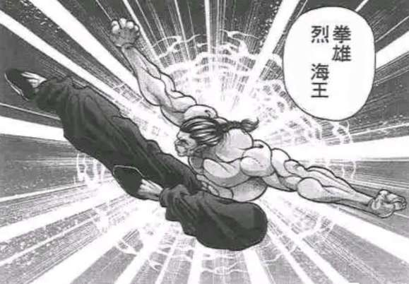

本次开场前让我们先过个对抗骰

速度对抗，？？？成功则在两人行动前做出对策

烈与千亦【1d100：64】

？？？【1d100：47】

~妖怪之山~

？？？：（接下来就先……）

“典，这是今天的稿子，先帮我校对一遍”

白衣侍从看着那沓充满存在感的稿纸，眨了眨眼睛

？？？：饭纲丸大人~

这不如交给负责印刷的山伏天狗们~

“不，你来的话我才能放心”

“今年的办报竞赛就快开始了，如果又把第一名让给鞍马那无趣的报纸，那我可忍不下这口气”

“越是这种时候，细节就越是要检查好才行”

哎呀呀，使魔无可奈何地笑着，细细检查着大天狗的稿子

这事其实没什么意义……

？？？：饭纲丸大人，评委们喜欢的就是那样的报纸呀

您要是听听我的建议，适当夸大内容，报道些吸引眼球的事件，走以量取胜的风格……

“那样的不是报纸，把胡编乱造的故事堆在一起，就称得上充实吗？错了，那样做出来的只是个高高的垃圾堆，就让喜欢看垃圾的人去看那些吧”

“知道吗，射命丸前段时间做的春季特刊”

？？？：啊啊，听说还没正式出版就废弃了呢

“她可真是做了个正确的决定，那破玩意已经很有些垃圾堆的模样了，甚至比不上她自己从前写的东西。那样的报纸出版出来要做什么？给天狗丢人吗？姬海棠用手机写的那些个过季美食专栏都比那像样！”

又开始了又开始了~

她想象着某位鸦天狗被痛批一顿的场景——不管那是否发生过，都会让她感觉非常愉悦——并随口应和着上司的话语，尽管她其实一点都不关心这些报纸的内容

？？？：她不是也做出了反省嘛~

听说之后又在做“尽量客观”的报道了~

报纸的话题一说起来就没完没了，看来生意的事只能先放一放

这可是给天弓大人白白送机会哦~

白狐并未出言提醒，反正说了对方也不会听

就这样言听计从地作着事，而后再看看之后的局势如何吧~

天子的杂学【1d70：62+30=92】（有顶天的大小姐+40，不良天人-10,75以上成功）

针妙丸：“龙珠”？

我怎么感觉有点耳熟……好像在哪里听过这名字……

有顶天的大小姐抓起石头，将其在手中抛了一抛

天子：这不是“伊奘诺物质”吗

原材料原来是这个，这就说得通了

但将其做成这种卡牌可不容易……

你们找了专业的“匠人”指导？

千亦：没有哦，这方面是由本人负责的~

只是劣化版的勾玉而已，凭借我的力量做起来并不算困难

天人将矿石丢了回去，得到了巫女的一个白眼

不知想到了什么，她意味不明地笑了起来

天子：自己做的啊……呵呵

倒要高看你一分了

灵梦，安心喝茶吧

这次就算你在神社躺一个月也没关系，会有人出来解决这事的

博丽的巫女喜出望外

灵梦：真的？天人可不能说谎哦！

烈：天子小姐

“伊奘诺物质”是什么？

天子：好问则裕，自用则小

此言虽是正理，但勤学好问也要看对象与时机

本小姐没兴趣解释这种常识，回去问你的老师吧

在天子的背后，正邪吐出舌头做了个不屑一顾的鬼脸，让众人差点笑出声来

烈：咳咳……那我就晚上回去问永琳吧

本来就是想给正邪看看卡牌，现在目的已经达成了，我就先告辞了

正邪：大老远过来一趟就是为了给爷看个纸片，你可真太忙了

烈：很想看看你的反应而已，虽说和我想象的不太一样

正邪：你是拿到新玩具的小孩吗

千亦：十分感谢今天中午的招待，之后有空余的时候我会带着礼品前来拜访的

如果各位之中有人想做交易，也请考虑下我的市集

那就，在此告辞了

烈海王与千亦离去了

针妙丸：……？

她好像没留联系方式……？

这样的话以后该怎么找到她啊？

灵梦：随缘咯，缘分到了总会有钱的

天邪鬼一把抓起了桌面上的茶壶

正邪：都蹭完午饭了，你准备在这里坐到什么时候啊？！

灵梦：天邪鬼说这话的意思是邀请我再留一会吧

那我就恭敬不如从命了~

正邪：爷是让你回去啊！回你的神社去！

烈与千亦接下来要做什么【1d10:7】

1 晚上要回永远亭于是就先找人顶夜班吧

2 既然有了强力保镖就去和天狗谈判吧

3 对龙珠很有兴趣，去虹龙洞看看吧（为啥啦）

4 晚上要回永远亭于是就先找人顶夜班吧

5 既然有了强力保镖就去和天狗谈判吧

6 这时候该谈谈报酬了（为啥啦）

7 晚上要回永远亭于是就先找人顶夜班吧

8 既然有了强力保镖就去和天狗谈判吧

9 意料之外的白狐陷阱（为啥啦）

10 大成功/大失败【1d2：2】

~辉针城外~

烈：我记得之前你说过还有几天就可以让力量恢复了

那具体而言还有多久？

下一次月虹在【1d7：4】天后出现

（注：以下内容含有大量我自身对设定的理解，还请大家千万千万不要当真）

千亦：还有四天

四天后的夜晚，特别的时刻就将出现

以“卡牌交易”的形式在幻想乡中举办着的这些小型的祭礼，已经为我提供了充足的信仰之力

只要在那时在举办一次真正的集市，我就能够取回自己身为神的力量！

烈：说来你也是神啊

那看来我先前的担心是多虑了

获得信仰后也只是取回先前的力量而已，你当然不会因此而改变

“嗯……那当然……我全盛时期可比这要强得多了……”

蓝发少女有些尴尬地说着

烈：……其实是会有影响？

千亦：说不定啦，说不定，只是一种可能性

因为我并不是那种由人或是其他的什么东西变来的“坚定”的神，而是从“无”中得到名字的神呢

因信仰而受到的影响会相对大一些

烈的推理【1d60：11+40=51】（接触过很多神了因此成功标准降低为60）

烈：也就是说你的本体其实是某种无定型的奇妙物质……

千亦：要是再说这样失礼的话我就拼着生意不做跟你同归于尽

烈：不好意思我不是故意的，还请说明

千亦：这个说起来可是相当麻烦

所谓的神，其实是有着区别的

一种是，由人，物，或是不知道什么莫名其妙的东西所成为的神

另一种是，从“无”中诞生的，因为得到了名字而出现的神

要说前者的代表，就是大多数高天原的住民们，也就是天津神

像是保佑航行平安的住吉三神，战胜了建御名方神的建御雷神，设计让天照大神从天岩户中出来的八意思兼神……这些名字你应该有听过吧？

烈：怎么说呢

最后一位我自认还是挺了解的

没注意到武术家那古怪的表情，天弓千亦继续兴致勃勃地说着

千亦：在被称呼为神之前，他们本来就是“某种存在”了

因此力量的多与寡很难影响到他们的本体，如果用仪式请动了他们的神灵，他们自身也会很快察觉到这点

而从“无”中诞生的神是不一样的，由名字获得了自我，但无名时的能力也会被其限制；由信仰带来了力量，可失去信仰后就会变得和妖怪差不多……对于我这样的存在而言，信仰所带来的影响其实并不小

卖红薯的秋姐妹与守矢神社的诹访子小姐就属于这样的神——也就是俗称的八百万神，而同为守矢神社的神奈子小姐则属于前一种了

烈：这么说

信仰数量的多少，与信仰类型的差异，都可能会让后一种神的形态、性格等都发生改变？

千亦：理论上是这样的

武术家上上下下打量了一番这位神明

烈：但我看你除了力量变强外其他方面和之前也没什么区别啊？

蓝发少女一脸得意

千亦：区区这种程度的信仰，就算祭祀方式发生了改变，也不可能影响到我的存在

连特殊的仪式都用不着，只要靠意志力就好了~

烈：真神奇啊，神

那说回正题，看来只要到了四天后的晚上这份委托就算结束了

但我没法一直跟着你，因为晚上我是要回永远亭的

千亦：事到如今却说最可能发生冲突的夜晚你要撤退？！

烈：所以我在想该找谁顶夜班

烈的选择【1d10：10】（2~9找魔理沙，1 10随机）

随机是什么啊【1d10：8】

1 我们永远亭床位还挺多的……

2 太阳花田露营……

3 旧地狱……（为啥啊）

4 我们永远亭床位还挺多的……

5 拜托慈悲为怀的白莲师傅吧

6 地狱……（为啥啊！）

7 我们永远亭床位还挺多的……

8 辉针城挺大的

9 这时候魔理沙与白狐突入（你搞笑吧！）

10 大成功/大失败【1d2：2】

烈：辉针城还挺大的，要不你问问能不能在这借宿几晚？

千亦：谁会同意让初次见面的陌生人在自己家住三个晚上啊？！

千亦的请求【1d100：49】（由于和天子成了朋友因此50以上就能成功）

——————

千亦：由于商业冲突，这几天可能会有大天狗带着打手过来截杀我

一个人在山上住的话感觉不太安全，不知是否能在您这里借宿三晚？

天子：没——

辉针城的城主飞起来捂住了天人的嘴

针妙丸：这个有点不太好办呢~

——————

千亦：我只说了一句话就失败了

烈：你用这样的开场白会成功才是稀罕事

~时间回到现在~

千亦：我就说你提出的主意根本就没有一点可行性——

嗯？

“——”

熟悉的破空声自天空的彼端传来，经验丰富的武术家立即摆好了架势

烈：破！

超音速的报纸卷将云层撕裂出一道惊心动魄的裂口，武者劈手夺去，恰好将其握在了手中

“碰巧路过了就送你一份今天的报纸~那我去取材了~”

千亦：天狗的突袭这就来了？！

烈：不，这是射命丸小姐顺手送的报纸

——看来她不止留下了这个

请问你是？

他所见到的是个长着蓬松尾巴的白色球体

这奇妙的球体轻盈地在蓬松的云团上弹了几下，这才终于现出真身——那是位身穿白色连体装束的，有着狐耳与狐尾的黄发少女

她的袖口与裤腿均用绿色的布带收紧，似乎是为了便于行动，同样的布条也装饰在她的胸口正中

她脚踩一双白色的两指袜，左手拿着一根试管，在站起身体的同时，少女将右手的食指与小拇指翘起，其余手指向前并拢，摆出了一个令人联想起狐狸的手势——那被称为狐之窗

这看似狐妖的来者笑着看向了集市之神，向她打了个招呼

？？？：下午好，千亦阁下~

千亦：是典啊！

你怎么来这里了？

？？？：我见山上寻不到您的踪影，便拜托鸦天狗带我出来找找

运气很好呢，刚出门没多久就遇见您了

这位阁下是……

她的眼珠转了转，瞧向了千亦身边的这位健壮男子

千亦：我来介绍一下

这是大天狗的宠物，我的朋友菅牧典

烈：啊？

她是大天狗的手下？

那你们不该是敌人吗？

典：饭纲丸大人是我独一无二至高无上的主君

这位千亦阁下乃是吾主珍视的友人

我为确保双方合作顺利，在此通达情报

菅牧典的好感度【1d100：9】

白狐细细眯起眼睛

无需以言语试探，光是看上一眼就能明白，这男人的心灵上并不存在弱点

这不意味着他是没有缺陷的完人，只是那灵魂中的缝隙没有大到能令她趁虚而入的地步

以妄语勾动情绪，以话术诱导行动，纵使能在一时成功，也必将招来其后的灾祸……就像那些听从她话语的愚氓一般

这是她最为厌恶的那种类型

（看来要将心思用在千亦大人身上了……）

一边观察着这健壮的男人，一边维持着那没有丝毫变化的友善的笑容，她轻柔地继续着自我介绍

典：这位先生，您可能有所不知

在您身边的这位可是高贵的存在

最好是要谨言慎行，可不要激怒她呀

千亦笑着摆了摆手

千亦：真是温柔呢~你多虑了

他是我的朋友，住在竹林的武术家，名字叫做烈海王

白狐闻言惊讶地捂住了嘴

她左右看了看，确定当下无人，才小心翼翼地悄声开口

典：这可真是……抱歉，抱歉……

这是您的私生活呢，我不该干涉的……

方才失态了还请您原谅，就当做我什么都没说过吧——

千亦：怎么可能啊！

怎么了？我做了什么奇怪的事吗？！

典的挑拨离间【1d50：18+50=68】（大成功+50）

典：……您不会不知道吧

这位烈海王，乃是幻想乡鼎鼎有名的情感骗子

我听人说，他最擅长的就是用那副忠厚老实的面相接近女性，再以花言巧语蒙骗，光是明面上的女朋友都有两位了，至于关系暧昧的那些……我都不敢提及……

千亦：啊？？？？

你？？？？？

白狐握紧了拳头，像是终于鼓起勇气，做出了决定

典：千亦阁下，您在这方面可能没有没有经验，而太过缺乏防备了！

请您回想一下，他是否平白无故地承诺过对您的帮助？是否以莫名热情地态度接近过您？亦或是总在意想不到的时候与您遭遇？

如果曾有类似的事件发生，还请您及时警惕……您很可能已经中了他的圈套了！

无主物之神面色古怪地看着这位武术家

此前他的行径怎么看都是热心和善的老好人，但听闻白狐的话语之后，她越是回想就越觉得心里发毛……

烈的辩解【1d100：77】

烈海王点了点头

烈：我的确有两位女朋友

千亦：直接承认了？！

烈：这是大家都知道的事情，我为何要特意隐瞒？

至于其他种种，是否相信，就全凭你自己决定

千亦：完全不辩解啊……

烈：我一向认为，与人交际只看对方言行便已经足够

如果自身问心无愧，也无需因他人的看法而大费口舌

你如何看待我是你自己的事情

我一向是无所谓的

千亦：……你是完全不在意他人的言语吗？

武术家摇了摇头

烈：并非如此

若有人造谣诋毁中华武术

那我定然将其找出，以令人信服的手段，请他做出公正的评价

他淡然看着狐妖，不急不慢地说着

烈：若有人诋毁我所在意的人与物，我当然也会感到愤怒

至于我自己的事情，我是无权决定他人对我的看法的

那就无所谓了

她想起了前些日子在酒馆中遇到的那些看客，以及自己当时的想法

与陌生人们大费口舌又有何益处？

因不相干者们的言论而为自己辩解，岂不是成了引人发笑的道化师？

凭对眼前这人的了解，她知道对方关注的并非是他人之言亦或自身形象，他所想的与自身并不相同——这男人只是完全不在意这些流言，仅此而已

蓝发少女摇了摇手指

千亦：多谢关心啦，典

我对这男人还是有些了解的

他并不是你所认为的那种人

“这样吗~既然千亦大人这样说的话，我就不再多说了~”

“我不会到处乱说的哦，请您放心~”

白狐犹豫地点了点头，随即又换上了如开始时那样的笑容

这可真是，从以往的情报来看，这人可一直是不善言辞的

莫非那都是他的伪装吗？只在这样关键的时候，才展现出自己真正的实力？

令人不快

力量与心灵都没有明显的弱点，这样的对手是无法以言语战胜的——那或许能图一时之利，却终将会招来可怕的报复

战胜这样的对手只能用比他更加强大的力量，可那绝不是她所擅长之事

典：比起这个，我有要事向您报告

还请附耳过来……

这武术家想必是能听到的，但这不要紧

态度比实际的效果更加重要

即兴的言语未能让这两人间的关系分崩离析，那就继续原本的计划吧

她在神明的耳旁悄声说道

典：——饭纲丸大人叛变了！

千亦的震惊【1d100：21】

她并不怎么震惊

是的，虽然打着合作伙伴的名号，但她们两人之间本就是相互利用的关系

当利益冲突终于浮于表面的时候，决裂的时刻就已经注定

千亦：啊哈哈

事到如今终于做出决定了吗，这愚蠢的天狗

白狐惊讶地捂住了嘴

典：此话怎讲？

千亦：她打算用我捞一笔就撤的那点小算盘，我从一开始就已经心知肚明了

不过，对于自己的野心反而被我利用这件事情，她也醒悟的实在太——

无主物之神尴尬地停下了口中的言语

流通的卡牌带给了天狗足够的利益，预定内的下一次市场却还没能召开

目的已经达到了，对手的力量又恰好卡在了这尴尬的时候，选在这时发难……

烈：她醒悟的不是恰到好处嘛

凭借她能够动用的力量，在这时战胜你也并不算困难

真是精妙的时机，简直可以称为兵法家

千亦：我明白的，典

别紧张，他同时还是位侦探，现在只是习惯性地追问下细节——

烈：我还有一个问题

千亦小姐，这位典小姐的职责具体是什么？

典：（……糟糕）

千亦：典负责的是居中联络

我、饭纲丸、百百世，我们三人间都有着各自需要忙碌的事情，由于身份的不同也不适合做直接的交涉，于是我与饭纲丸之间的交流就基本依托于典

烈：那么，你有多久没有直接和那位“饭纲丸”说过话了？

你有多久没有面对面地和她说过你自己的看法了？

你们之间的矛盾确实是积累已久，这我并不怀疑，只是我现在在想……

烈：若连这样基本的交流都要依靠这位典小姐进行

那你所听闻的话语中所蕴含的，又究竟是谁的意志？

白狐脸上那柔弱的神情逐渐消失了

典：你说得可真过分啊

如此怀疑一位初次见面的人，这是位实事求是的侦探应做的事情吗？

烈：彼此彼此

你那流言的来源也令我很是在意，连射命丸小姐都不再写我的八卦新闻了，你所听闻的那些故事又是从何而来？

典：千亦大人，您怎么看呢？

从刚刚开始就一直没说话的蓝发少女，这时双手抱胸飞在原地，有一搭没一搭地点着自己的胳膊

千亦：典，你是一直都很尽职尽责的……

典：您却不说相信我了

这么多次的合作与交流，却不及您这友人轻描淡写的几句怀疑，这又是多么令人寒心！

果然，您是高贵的存在

想要与您这样的贵人平等交流，终究也只是我一厢情愿罢了

她观察着两人的表情

预想之中的的疑虑并未浮现，取而代之的是越加深重的怀疑

她知晓自己的尝试又一次失败了，若再度搬弄口舌，可只会令事态发展的更糟，于是大天狗的宠物向两人行礼，而后悠然飞去

典：我会将您的话语告知饭纲丸大人的

最后还请容我以友人的身份做出劝告

千亦大人，还请您千万多加小心，饭纲丸大人所准备的对策，是您绝对无法战胜的……那是只对您起效的，必杀的一击啊

千亦：……典做了些什么

烈：你也这样觉得

千亦：现在想想，我过去的想法并不够冷静

如果以对方一定会采取行动而规划下一步的走向……这样的话……可让我产生这念头的正是……

千亦疲惫地摇了摇头

千亦：抱歉，我有点混乱

让我想想我们现在该做什么

烈与千亦要做什么【1d10：4】

1 去问问那位百百世吧

2 趁热打铁，直接去与饭纲丸交流！

3 先想办法恢复力量（为啥啦）

4 去问问那位百百世吧

5 趁热打铁，直接去与饭纲丸交流！

6 奇怪的神明来了（为啥啦）

7 去问问那位百百世吧

8 趁热打铁，直接去与饭纲丸交流！

9 继续之前的代班计划（为啥啦）

10 大成功/大失败【1d2：2】

烈：你刚刚还提到了一位叫做“百百世”的人

她是谁？

千亦：百百世是大天狗的朋友，负责开采龙珠的大妖怪

她一天到晚都待在洞里挖矿，只在少数集市开启的日子才出来和我们交易

她是很厉害的，那不详而漆黑的魔力，光是靠近就能给予人极为可怕的压迫感，偏偏百百世又极为好战，因此根本就没几个人想靠近她——喂你怎么笑了你这笑容看上去好可怕啊

武术家赶忙调整了一下脸上的表情

烈：没什么

我很期待与她见面

这位百百世小姐平日工作的矿洞在哪里？

千亦：那座洞窟名叫虹龙洞

在伪天棚的深处，妖怪赌场的后方，它的看守者是名叫驹草山如的山女郎

他回想起了昨日见到的那空洞洞的轮廓

烈：（是那里啊）

我有个建议

千亦小姐，你与大天狗之间存在着不合，但负责主持交涉的菅牧典似乎也没能正确传达你们双方的意见

现在去找大天狗交涉可能会直接激发矛盾，若想将此事调查清楚，不妨问问旁观的第三者是怎样看待你们之间的事情

去问问这位百百世，如何？

千亦：那个粗枝大叶的家伙真的会在意这些事情吗……

这样说倒也可以试试……

千亦的细心【1d100：72】（50以上提醒氧气）

无主物之神点了下自己的鼻子

千亦：不过，你是人类吧

是人类的话就需要呼吸

可虹龙洞深处是缺乏氧气的，你进去之后八成会昏迷

烈海王要做什么【1d10:3】

1 help me erinnnnn~

2 像上月球时那样找妖精帮忙

3 靠毅力去克服它（你搞笑吧）

4 help meerinnnnn~

5 便利的河童科技

6 短时间不呼吸的话没有问题！（你搞笑吧）

7 help meerinnnnn~

8 像上月球时那样找妖精帮忙

9 天弓：我有合适的卡牌哦（为啥啊）

10 大成功/大失败【1d2：1】

烈：无所谓

只要靠毅力去克服就行！

千亦：这不是适用精神论的状况吧？！

烈：我现在的身体强度已经远超常人

在没有氧气的环境，应当也是能生存下来的！

千亦：随你吧，我可是提前做出提醒了

出了什么事我可不管啊……

烈海王与千亦前往虹龙洞了

（例行跑步倒垃圾洗漱，大概9:30左右继续）

烈的回避【1d100：93】（51以上成功，50以下提前用张卡牌）

烈：既然不是那位“百百世”的武器，就说明有人先一步来到了这里

稍等……

他并未起飞躲避，而是维持着那不快不慢的步伐，自弹幕群中悠然穿行

在旁者看来，那景象简直出奇怪异：明明魔弹已经射向了他的躯体，却又像没有接触到任何事物一样从中“穿过”，明明那阴阳玉灵活地调整着飞行轨道，但却总是离笔直前进的武术家越来越近……他就这样莫名其妙地穿过了弹幕的拦截，在其中心站桩摆好了架势

武者将拳击出，恰好贴上飞来的阴阳玉本体，他微微将手腕一震——

一声闷响过后，魔弹在空中淡去，失去了光芒的灵玉无力跌下，被武者一把接起

烈：好了

外壳没坏，这样修起来会方便些

我们继续走吧

千亦：……你别跟我说你刚刚用的是武术

烈：就是武术

想学吗？我可以教你

千亦小姐木着脸摆起了手

千亦：不了不了

这个，真的，无论从什么角度来看都

太不适合我了

武术家耸了耸肩

他找好位置，将这阴阳玉放好，正准备继续前进——

“那边的人类，请留步！”

就听到了一道急切的声音

看来这阴阳玉的正主这就来了

正急速飞来的是位打扮传统的赤足女子

她头顶奇妙的球体，身穿红色上衣与土黄色中裙，头发在两侧以形似大玉的珠子束起，腰间束有黑色的绑带

她的裙摆处、绑带末端，以及斜跨在胸前的绳上都串有亮眼的勾玉，那些勾玉的颜色自赤至紫依次排列，像是又一道与天弓不同的彩虹

？？？：再往前走你会死掉的

我来劝你是为了你好

现在赶紧掉头出去吧

临时有事稍等十分钟左右继续

千亦：在那之前，你是谁啊？

这是妖怪之山上的私人矿洞

未经允许是不得入内的

这奇怪的女子在手中揣摩着一块勾玉，老神在在地答道

？？？：这也不是你的领地吧，天弓千亦小姐

我并非是为了利益而来，而是为了阻止你们莽撞的行径

千亦：你认识我？

？？？：嗯，至于你旁边的这位……

？？？的好感度【1d100：13】

打扮奇特的女子皱起了眉头

？？？：是烈海王先生吧

可以请你现在就走吗

烈：请问你是？

我以前应当没有见过你

魅须丸：我的名字是玉造魅须丸，是龙珠的正当拥有者

你的事情我凭借勾玉就已经能够掌握

你是为了与洞穴中那丑恶的妖怪战斗才来到这里的

千亦：哎？！

不是说是为了听取第三方的客观意见吗？！

扎辫子的男人尴尬地挠了挠脸

烈：“如果能打起来就再好不过……”

我确实也有这样的想法

一举两得嘛

魅须丸：看吧，表面上一幅平淡的样子，实际心中时时刻刻都思考着战斗与攻击

你那凶恶而傲慢的内心真是令人惋惜，明明是人类却活像是好战的妖怪一般

怎会有这样渴求争斗的人类，八意思兼神为何会教出你这样的弟子！

烈的推理【1d60：23+40=63】（50以上推出能力，75以上推出身份）

武术家握了握拳头

烈：天性所在，还请见谅

初次见面就能知道我的名字以及目的

我想玉造女士是有着类似读心的能力

魅须丸：正是

我是真正的勾玉匠人

只要使用勾玉的力量，无论是复制他人的能力还是读取他人的情报，都是很容易的

你那凶恶的气质，在这勾玉中可被我看得一清二楚

烈：（制造勾玉的匠人，与永琳认识，再加上这幅传统的打扮……她也是某个古老的存在？但若只凭借这些追究神话中的原型，就难以做到了）

没想到会是因为这样的原因，我还以为会是情感方面的问题

魅须丸：恋爱是自由的，这方面我可见得多了

现在是最后一次警告

再往前去你就将窒息而死，立刻掉头回去

烈：恕难从命

我有自信不会因为区区缺氧而丧失战斗能力

魅须丸：那，你就在我的手中痛快地死掉吧

我会给你留下可以让这位小姐抬走的躯体的！

一头雾水的千亦小姐揉了揉自己的头发

刚刚好像听到了一个十分令人在意的名字但现在更加值得关注的是——

千亦：突然就因为这种事情而开始死战了？！

再怎么说这也太过离奇了，就连百百世都不会这样做！

好好谈一谈的话——

烈：不必担心，千亦小姐

她只是在放狠话而已

魅须丸：你说什么？

武术家一脸的云淡风轻，像是丝毫不将对手的言论放在眼里

烈：但这没什么所谓

就让我们以最基本的尊重……

带着“杀意”决一胜负吧！

注：神秘杀手加成并未结算，因为没能认出神话原型（推理没过）

玉造魅须丸

Atk：280（？？？）

Hp：20（？？？）

技能

真正的勾玉匠人：不会受到异常状态的影响，对特殊攻击手段拥有耐性。自身技能/必杀技的回避/破解/防御判定所需成功值+15，自身所有攻击无视减伤效果

做出警告的友善神明：仅是出于警告目的象征性战斗，不会使用勾玉的力量，不会使用能力卡牌

但就让你小子吃点苦头吧：战斗开始的第一回合进行一次【1d100】的复制判定，30以上本回合无敌，60以上追加4T内复制一次对手的弹幕/近战/技巧系符卡。结果由于个人好恶还是使用了勾玉的力量。

【太古的勾玉】：常时发动，自身受到的弹幕系技能伤害-2，将自身受伤骰中的一个特大伤害替换为回避

一场战斗中仅能使用一次，令自身本回合受到的最终伤害/2

玉符【阴阳飞鸟井】（CT3）：（弹幕系）射出巨大的阴阳玉以将对手压碎，本回合对对手造成【1d5】点伤害

玉符 【阴阳神玉】（CT4）：（弹幕系）以密集而坚固的阴阳玉布下天罗地网，本回合自身Atk+70，给予伤害+3，2T内对手每次进行回避/破解/防御判定时受到1点伤害，攻击/受伤时受到2点伤害

玉将【Queen of Yin Yang Sphere】（CT5）：（弹幕系）巨大的阴阳玉分为细小的存在，自四面八方来袭。3T内自身Atk+60，每回合给予对手【1d3】点伤害，自身受到的伤害-2（被破解的场合仅追加伤害与减伤效果消失）

必杀技

女王珠【彩虹门的另一侧】（CT6）：阴阳玉的数目再次增长，这已经称得上是数量的暴力。Atk+700，给予伤害X4

【梦想封印】（CT7）：Atk+800，给予伤害X5，本回合进行一次特殊攻击【封印】：进行一次【1d100】的封印判定，对妖怪成功值标准50，对妖怪以外的对手成功值标准为70，判定成功的场合，本回合对手无法造成任何伤害。（面对拥有特殊攻击抗性的对手时，成功值变为70/90）。以手头简易的材料重现了博丽巫女的必杀技，能够如此轻易成功，是因为她就是阴阳玉的制造者

【阴阳窒息】（CT8）：无法回避/破解/防御，Atk+900，给予伤害X6，本回合结束的时点进行一次【1d10】的窒息判定，出目为1/4/9的场合判定战斗结束，玉造魅须丸胜利。

T1

本场战斗中，烈海王准备将阳伞蓄力【1d6:2】个回合

烈：来吧，玉造女士

符卡宣言天符【伸手及月】！

明亮的光芒穿过了朦胧的雾气，银白色的圆月浮现在了这深邃洞穴之中，也映入了蓝发少女的眼里

那月亮似乎给予了他某种奇妙的力量，让沐浴在光芒下的烈海王充满了自信

魅须丸：狂妄自大的人类啊，你就在这里吃点苦头吧

就让你看看，与能力卡牌不同的这真正的勾玉之力！

复制判定【1d100：67】成功！

本回合魅须丸无敌，4T内可复制一次对手的弹幕/近战/技巧系符卡

烈的攻击【279+3d40：37=316】

魅须丸的攻击【280+1d100：21=301】

魅须丸的受伤：本回合无敌

烈：喝呀！

金黄色的激光自他的掌心出现，以难以捉摸的轨迹射向了这位打扮怪异的女子——可武术家试探性的攻击却以他意想不到的方式失败：几乎完全相同的激光与他的攻击相互抵消，不留一丝痕迹

玉造魅须丸抚摸着她胸口所装饰的勾玉，那激光便来自与其中闪烁着光芒的一颗

魅须丸：无需惊讶，武术家

你早已看过类似的能力

烈：你用了白莲师傅的卡牌？

千亦：并不是这样

我不记得自己有将圣白莲的卡牌做成这种效果

魅须丸：刚刚就说过了吧，这是“勾玉”的力量

天弓千亦小姐与天狗所合作制造的这能力卡牌便于携带，方便量产，在举行仪式方面确有其独到之处

但那终究不过是娱乐品罢了，只凭借那点微量的伊奘诺物质与你的手艺，是没有办法和我的勾玉所相提并论的！

T2

千亦：真是的

能力卡牌只是玩具而已，别将它和真格的道具相提并论啊

再说，只要给我足够的龙珠与时间，做出比你那勾玉更强大的卡牌也不成问题！

魅须丸：而我正是为了阻止这样的事情发生，才会前来此地

因为滥用龙珠而引发的灾难，我已经见得够多了！

一道比起先前更为粗壮的激光在洞穴中肆意盘旋着，冲向了立于原地的武术家

烈的攻击【279+3d40：35】

魅须丸的攻击【280+1d100：3】

魅须丸的受伤【1d10：5】

1 回避

2 小伤害

3 小伤害

4 中伤害

5 中伤害

6 大伤害

7 大伤害

8 特大伤害

9 回避

10 大成功/大失败【1d2：2】

Hp：20-2=18

已有防备的武者将手伸向了那道四处乱窜的激光

他毫不在意地将其捏在手中，双臂向两侧猛一发力，粗壮的激光就化作了一道形如长枪的光芒

勾玉职人立即将单掌竖起，庞大的魔力瞬间将护壁建造完成——可光芒之枪也被武者奋力投出，于是透明的屏障层层生出，又以更快的速度接连破碎，在空中留下了一圈圈无形的涟漪

直到最后一层护壁突破，反应不及的女子不得不侧头回避，那临时制造的兵器才如完成任务一样在逐渐淡去

烈：这勾玉虽然能够复制能力，在使用上可就很是粗糙

在瞬息万变的战斗中使用这样死板的道具

玉造女士，我想这不是明智之举

天弓千亦眨了眨眼

千亦：我还是辩解一句

他主观意图上是没有恶意的……应该吧

T3

【花之主的阳伞】蓄力结束

烈：不妨再认真些吧

符卡宣言 异红符【巨阙】！

Hp：23-1=22

魅须丸：我要纠正你的两个误区

其一，我的勾玉并非是你所想象的那般不灵活的作品

其二，若我拿出真正的实力——你就没有在我面前说话的余力了！

符卡宣言 玉符【阴阳飞鸟井】！

方才那被武者击破的阴阳玉颤抖着飞起

幽蓝色的灵光再次浮现在它的周遭，它的体积与光芒一同膨胀，仿佛一颗小小的星球

千亦在心中猜测着，这位怪人会用出什么样的攻击手段——

她揉了揉眼睛

但见头顶圆球的女子飞跃而起，右腿如长鞭般踢出，足背大力击向这阴阳玉的底部，让急速回旋的阴阳玉以弧线轨道射向了武者！

千亦：居然是射门？！是外脚背抽射吗这个？！！！

烈的破解【1d100：98】成功！（成功值55+15=70以上成功）

对于这记意料之外的射门，选手·烈海王选择的应对方法是……

用相同的踢击回应！

看啊，这男人毫不犹豫地单脚跳起，以完好无损的左腿冲力射球

是堂堂正正的直线球！

阴阳玉在令人牙酸的摩擦声中被选手·魅须丸单手接住，若在绿茵场上这已经是要吃红牌的恶意犯规了

但现在是弹幕决斗，因此没有问题！

烈：【阴阳飞鸟井】

我以前见灵梦用过这招

我还以为除了她以外没人能想出这种招式了

魅须丸：这可是阴阳玉的正统用法

你说还有人会这招式，那是什么人？

烈：博丽灵梦，博丽神社的巫女

魅须丸：这样啊

看来我所制造的阴阳玉有被好好继承

现在……

她将一块小巧的勾玉摘下，不祥的赤色魔力自其中迸发，凝为通体透明的巨剑被女子握在手中

那清亮的剑身与武者血液所铸的魔剑相异，但气息与大小却与原版如出一辙

魅须丸：就让你看看，勾玉灵活的用法！

烈的攻击【279+80+150+100X2+3d40：55=764】

魅须丸的攻击【280+80+1d100：72=432】

“铮！”

剑身相交，发出金属相撞似的鸣响，但占据上风的却不是真正的剑主，而是玉造手中的伪物

魔力储备的差异在这时成为了分出胜负的关键点，这奇妙女子在斩击中所压缩的力量，比起武者还要更多更强！

烈：——是我武断了

您的勾玉并非是我所想象的那样不方便的东西

那是真正的武器……是可以活用于绝大多数场合的，实用的兵器

魅须丸：现在终于认识到自己的无知了吗

但为时已晚了

我就代替你的老师，让你这好勇斗狠之人好好长个教训——？！

勾玉所传来的情报让女子立即警惕起来

那并非是精确的“读心”，而只是对情报的粗略读取，无法还原所有细节，在战斗中更是只能起到粗略的提醒作用

而这男人现在所想的是——

烈：那，我也暂且借用下“兵器”的力量吧

他突然放开右臂，仅用单手维系着微妙的僵持

武术家的指尖中夹着一张不起眼的卡牌

卡牌化作了素雅的白色洋伞

他没有像过去那样射出魔力的光束，而是就这样手握阳伞，纵劈而去！

魅须丸的受伤【1d10:4】

1 回避

2 小伤害X2+4

3 小伤害X2+4

4 中伤害X2+4

5 中伤害X2+4

6 大伤害X2+4

7 大伤害X2+4

8 特大伤害X2+4

9 回避

10 大成功/大失败【1d2：2】

【太古的勾玉】发动

一场战斗中仅限一次，令自身本回合受到的最终伤害/2

匠人及时掏出一张卡牌，化作另一块勾玉，令其膨大数倍充当盾牌挡在侧方

只听一声巨响，洞内尘土飞扬，这奇妙来者的身影瞬间就飞退到了坑道深处！

Hp：18-（2X2+4）/2=14

阳伞再次变回了卡牌，武术家将其淡然放回了兜中

千亦：我怎么觉得这招不像是你的风格啊

烈：我女朋友经常在……日常切磋中用这样的招式

久而久之，我也会了

T4

“还挺能打啊……”

魅须丸：看样子我也要认真些了

符卡宣言 玉符 【阴阳神玉】

勾玉匠人自洞穴深处缓步走来

她的身侧漂浮着数十个小巧玲珑的七彩阴阳玉

相比于先前那巨大的光球，这次玉造所使用的阴阳玉看上去很是轻巧

它们以匠人为中心扩散开来，击向了闪烁着微光的洞壁，又如皮球般弹起

灵玉的轨迹如丝般交织，在这并不狭隘的洞穴中形成了一张不断运动着的网！

烈的破解【1d100：2】失败

Hp：22-1=21

烈：……

他本能地将拳抬起，只是轻轻一触又立即放下

这网的运动并不算快，但球体交织的轨迹却分外莫名

而武者的直觉告诉他，这次的灵玉绝非他能够轻易碰触的东西

那不是什么可爱的玩具……那是触之即死的陷阱！

烈：（要承受击打了！）

魔崩拳 发动

灵玉的速度逐渐加快，巨网的范围开始收紧

武者将拳竖起，踏步前行

烈的攻击【279+90+1d100：48=417】

魅须丸的攻击【280+70+1d100：72=425】

烈的Hp：21-2=19

阴阳玉的直击比他想象之中还要更为痛苦——那与平常的弹幕完全不是一个等级，甚至无法凭借消力消去！

钝器击打肉体的闷声在洞穴中回响，七彩的阴阳玉接连涌来，让旁观的千亦甚至看不到这男人的身形

判断失误了，贸然的突进只让他更深地踏入了陷阱！

【这合理吗】发动

“呼……还好有这个”

这时，一颗赤色的阴阳玉突然向着截然相反的方向飞去

犹如棋盘上的旗子由白转黑，原本万无一失的布局由此而出现了致命的破绽！

魅须丸：又是能力卡牌……天邪鬼的能力？

魅须丸的攻击骰出目逆转为27，合计出目377败北！

魅须丸的受伤【1d10：6】

1 回避

2 小伤害+3

3 小伤害+3

4 中伤害+3

5 中伤害+3

6 大伤害+3

7 大伤害+3

8 特大伤害+3

9 回避

10 大成功/大失败【1d2：2】

Hp：14-3-3=8

爆破判定【1d100：54】失败

武者的崩拳击在了灵玉所化的盾牌正中，激烈的劲气顺着勾玉传导至匠人的手臂，令其不得不向侧方避去

辉针城的天邪鬼绝不会想到，她的力量再次逆转了战局！

烈：承让了，玉造女士!

T5

玉造魅须丸甩着胳膊，一脸的无可奈何

魅须丸：居然这么理直气壮地对着我拳脚相向

你的师傅就没有说过你的行为是多么失礼吗？

武术家想了想，说

烈：我有几次差点被师匠把头盖骨捏碎

魅须丸：哇

都到地上这么久了，她到现在还喜欢这种教育方式啊

烈：师匠的格斗术也是非常的厉害，弓术也一样

她从来都不觉得近身战是件失礼的事情，当然也不会因此而叱责我

她用手拍着自己的脑门，长声叹息

魅须丸：真是，一如既往的，智勇双全

只可惜，你这弟子完全没学到师傅的智慧

符卡宣言 玉将【Queen of Yin Yang Sphere】！

数个巨大的阴阳玉在空中解体，化作与先前相似仿佛的小巧球体

这次玉造所布下的又并非是诱人深入的网格，而是仿若旋涡般压下的杀招！

纯粹武道发动

烈的破解【1d100：59】成功！（成功值40+15=55）

Hp：19-1=18

可这次，阴阳玉的轨迹反被这武者完全看破了！

他轻而易举地自漩涡中钻出，转眼间就突进到了玉造的身侧

烈：我不这样想

能用武术解决的问题，又为何要开动脑筋?

千亦：你听听这是侦探该说的话吗？！

烈的攻击【279+70+1d100：56=405】

玉造的攻击【280+60+1d100：36=376】

烈的Hp：18-2=16

魅须丸的受伤【1d10：1】

1 回避

2 小伤害+3

3 小伤害+3

4 中伤害+3

5 中伤害+3

6 大伤害+3

7 大伤害+3

8 特大伤害+3

9 回避

10 大成功/大失败【1d2：2】

魅须丸：呵

勾玉匠人笑了起来，武术家突然感到一丝不妙

千亦：看你身后！

先前所绕过的阴阳玉在他的身后悄然折返，无法消去的攻击已经射向了他的背部！

烈海王迅速作出决定，他立即抽身后退，就此让过了这一回合的胜利

魅须丸：直觉倒是不像你的头脑一样糟糕

被刚才那个打中的话，你就可以直接去找你的老师了

当然，是被抬着回去

T6

魅须丸： 随着对洞穴探索的深入，这里的氧气浓度也变得越来越低……现在差不多也就外界平均水平的一半左右

现在的你，还能做出像之前那样细致的动作吗？

符卡宣言 玉符【阴阳飞鸟井】

符卡宣言 女王珠【彩虹门的另一侧】！

烈的破解

玉符【1d100：37】失败（成功值40+15=55）

女王珠【1d100：2】失败（成功值60+15=75）

烈的受伤【1d5：2】

Hp：16-2=14

比起先前更为密集，更为可怖的阴阳玉旋涡已经罩向了他的头顶，而巨大的灵弹更是补上了最为致命的空隙

可就在这时，玉造部的预言却得到了灵验

预想之外的不适感侵袭着他的脑部，令武者一时难以招架对方的攻击

若是平时他还可尝试调整自己的气息，但战斗时的对手绝不会给他留下如此之多的余地

是的，这对人类而言就是无处可逃的绝境……

烈：符卡宣言……

武术家闭上了双眼

自上次异变以来已经安稳了好一段时间，称得上战斗的高烈度胜负实在算不上多

他已经许久没用过这一招了，这时却感到了一股难得的熟悉

潜藏在体内的力量被这战意激活，千锤百炼的魔力似乎也为这战斗而欣喜，那如电流般的感觉在他的血肉中雀跃地跳动，令这男人表现出前所未有的自信，却又像是苦行僧般安宁

他迈开双足，向前走去

人类的极限来源于人类的脆弱

人类的脆弱来自于肉体而非心灵

而他所修习的正是强化躯体的伟力

烈：超人【烈海王】！

由步行变为奔跑，由奔跑变为疾驰，肉眼早已无法捕捉武者的身影，一道赤色的光芒如闪电般在这洞壁之间折返摇曳，每一次的转向都将无数灵玉碾为尘土，每一次的突击都让勾玉匠人后退数步

铺天盖地的七彩之海在短短数秒间已经找不到任何过去的踪迹，唯一所存的只有那耀眼夺目的闪光！

烈的攻击【279+70+675+80+1d100：28=1132】

魅须丸的攻击【280+60+700+1d100：96=1136】

魅须丸：没想到会用佛门的秘术，这倒是出乎我的意料之外

以魔力强化躯体的长生法，这可真是精妙的技术

你所投入的精力与汗水值得赞赏

只可惜……

她面无表情地举起了一颗缓慢旋转着的球体

那是与七彩之虹相异的，仅由黑白二色勾玉形成的太极

魅须丸：在我面前，没有意义

你该在最开始的时候就用你最强的招式的

烈海王！

她将阴阳玉抛至身前，一掌击出，黑白与赤色正面相撞，二色的灵玉正中武者心口！

烈的受伤【1d10:5】

1 回避

2 小伤害X4

3 小伤害X4

4 中伤害X4

5 中伤害X4

6 大伤害X4

7 大伤害X4

8 特大伤害X4

9 特大伤害X4

10 大成功/大失败【1d2：2】

Hp：14-2X4=6

“——！”

刹那间的胜负早已超出了声音的限制，武者被深深砸入了虹龙洞的岩壁

直到这时，惊人的轰鸣声才终于响起，玉造魅须丸面色不变，在这姗姗来迟的背景音效中漫步前行

魅须丸：凭这点功夫就想让我让开通路？

我可真是被看扁了啊！

