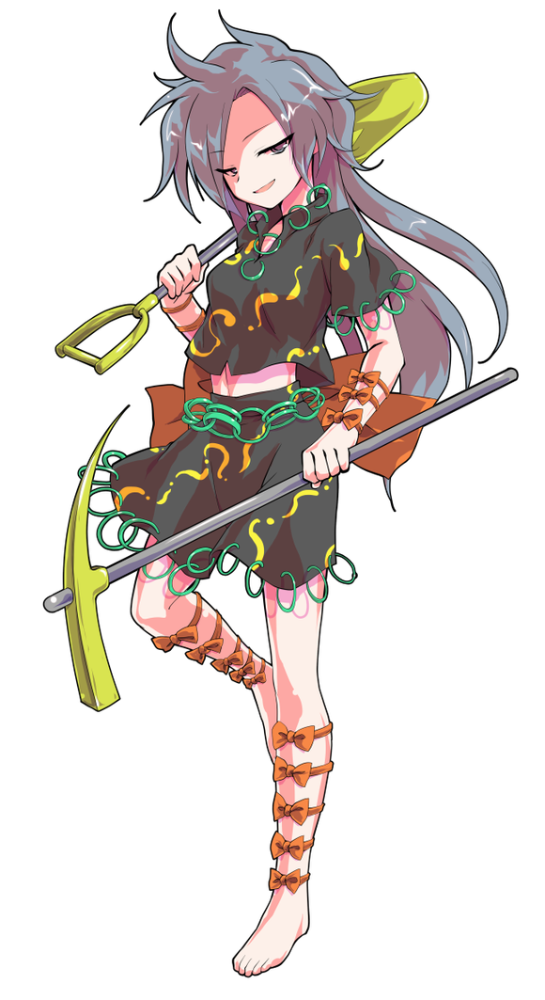

T7

千亦：战斗中的一方在做出了像新番动画主人公拿出必杀技一样充满自信的行为发起攻击后却突然被打扮土气的对手莫名其妙一招秒杀了这是哪门子的胡扯展开啊？！！

烈：咳……咳……

这种事情……也不是没有发生过……

摩多罗女士的打扮其实也……称不上时尚……

千亦：那是谁啊话说你居然还有气吗？！

武术家吐了口血，从坑中爬起

烈：我还不至于因为这种程度的攻击而死掉

刚刚的是梦想封印？

魅须丸：正品的阴阳玉在这一任的传承者手里，我所用的只是临时做出的简易版本

正因如此你还能有一口气在呢

烈：哦，原来灵梦的阴阳玉就是你做的，怪不得你能用出这样相似的招式

我也很好奇自己能否撑住多次刚刚那样的攻击

就请你多做几个“简易版本”，一口气攻上来吧！

蓝发少女伸手捂住了脸

千亦：我说，你啊

难不成你，其实很享受这种莫名其妙的战斗吗？

烈：是啊

千亦：结果这位小姐对你做出的评价可真是一点都没错啊！！

魅须丸：终于发现他的本质了吗，天弓千亦小姐

既然你一心求败，我就满足你的要求

【梦想封印】！

封印判定【1d100：100】成功！

本回合烈海王无法造成伤害！

那似曾相识的怪异感觉涌上了他的心头

距离感出现了莫名的扭曲，方向成为了他难以辨认的概念

洞穴内的空间似乎遭到了某种难以言喻的干涉，那是博丽巫女曾用无数灵符做到的事情

可这次，他的对手并没有做出任何多余的行径

那匠人只是丢出了数个回旋的巨大阴阳玉，便如同巫女一样停留在原地，看着这违反物理规则的光弹射向茫然无措之敌！

烈的反击：由于封印判定成功，自动失败

烈：这次居然连符纸运转的平衡点都没有

这可真是……这不就只能在原地躲避了吗

符卡宣言 武符【梦幻斗舞】！

空间的扭曲与必中的灵弹，以及那不言自明的可怕威力

博丽巫女的招牌技艺，在任何人眼里都称得上是不讲道理

以游戏打比方的话，那就是超越了所谓平衡性的违规，是正常战斗中不可能考虑的东西

可在旁观者看来，武术家此时所做的事情，却是另一种意义上的不可思议

像舞蹈般挪移着步伐，像舞者一样操纵着身躯，躲避光弹，迎向光弹，“穿过”光弹——

直到所有的阴阳玉都撞上了洞壁，他的舞步才终于停息

千亦：这是武术吗？

烈：嗯，是武术

一年多前就没能成功“反击”，现在也是一样，只能回避

要走的路还有很长啊

千亦：玉造小姐？

你的阴阳玉，好像被人类的技术躲过去了

勾玉职人神色复杂地摇了摇头

魅须丸：我现在明白为什么思兼神会收他做徒弟了

真没想到

你有这么强

T8

纯粹武道效果结束

玉将效果结束

烈：若是连这种实力都没有

怎还能站在永琳身旁呢

魅须丸：我不想听这个

恋爱故事还请和天弓千亦小姐讲述，她对这个话题比较感兴趣

千亦：别误会我只是有点好奇而已！

话说你别用勾玉随便窥视别人的想法啊，很没礼貌的！

魅须丸：这的确是，随便滥用这份力量是不好的

战斗中习惯性用得太多了，真是失礼了

不过，这也是我想要告诉你的道理呢

千亦：我？

魅须丸：你，天狗，还有这洞穴深处的大蜈蚣！

好了，再继续下去就无法遵循幻想乡的规则了，你就在这里乖乖倒下吧！

这个时候——

那一直被拘束着的，一直被压抑着的，一直被刻意掩盖着的气势——

终于显现

神明

不需要任何说明，光是这气息出现的瞬间，武术家就足以凭此做出判断

玉造魅须丸是一柱神明

守矢神社的二神、灵长园的偶像之神，这气息比起祂们还要更加沉着……那感觉像是神像自壁画上走出，来到凡人面前，眼中所见的就不只是祂的容颜，而是活生生的神话重现于人间

他凝神望着这女子的背后，看着那似有似无的形体

那是一颗巨大的勾玉，恰似阴阳玉中的阳鱼

烈：天津神……

月之民？

魅须丸：我从很久以前就一直待在地上了，算不上天上的居民

没有遗憾地迎接败北吧，烈海王

符卡宣言 玉符【阴阳神玉】

符卡宣言【阴阳窒息】

烈的破解

玉符【1d100：85】成功！

这招式的确令人窒息

他穿过又一张阴阳玉编织的巨网，在心中如是想到

由于过去与某位巫女的交手，他对阴阳玉这一武器很是了解

球体、网、旋涡、封印，以阴阳玉使出的这些奇妙攻击都已经被他悉数击破了

可现在所见到的这个……还能称之为招式吗？

那依然是阴阳玉

无数大小各异的阴阳玉占据了这坑道之中的每一寸空间，每一颗都足以让他遭受重击，每一颗都足以让他作出回避，而这样难以处理的阴阳玉如今根本无法计数，那是七彩色的咆哮，是阴阳玉所构建的海洋！

烈：我可真是很久没用这招了……！

符卡宣言……

黑暗瞬间降临，连矿物闪烁的微光都不见踪影

紧接着，点点星光自无物的暗夜中亮起

那是比起七彩更为闪亮的异色，那是比起海洋更为神秘的星空

这是玉造部曾经见过的秘术，能够将其用出的，只有月之弓的弟子！

“秘术【天文密葬法】！”

魔崩拳发动

烈的攻击【279+25+90+900+1d100：48=1342】

魅须丸的攻击【280+900+1d100：67=1247】

魅须丸的受伤【1d10：4】

1 小伤害X2+3（无法回避）

2 小伤害X6+3

3 小伤害X6+3

4 中伤害X6+3

5 中伤害X6+3

6 大伤害X6+3

7 大伤害X6+3

8 特大伤害X6+3

9 小伤害X2+3（无法回避）

10 大成功/大失败【1d2：2】

Hp：8-2X6-3=0

黑暗的密室、满天的繁星、席卷洞穴的阴阳玉……

这些异样的，奇妙的，仿佛孩童脑中想象一般光景现在已经不在了

虹龙洞中有着异色的雾气，洞壁上的矿石闪烁着微光，一切都和一开始时一样，仿佛什么都没有发生

只是两人先前所站的位置也已经不见人影

向后看去

再向后看去

顺着地上这道不知何时出现的沟壑，望到这狰狞痕迹的尽头……

那是以正拳击出的武者，与单手握住拳头的匠人

魅须丸：我实在是没想到

她居然连这招都教给你了

烈：她其实没在战斗方面教过我太多招式

秘术与急救术，我想这些已经很够用了

魅须丸：天啊，“急救术”……

我真不知道说什么是好

到此为止吧

这次的弹幕游戏，是你胜利了

~战斗结束~

~胜者 烈海王！~

蓝发的无主物之神飞了过来

千亦：莫名其妙开始的战斗以莫名其妙的方式结束了……

说到底，为什么你这样古老的存在会来到这虹龙洞啊？

魅须丸：身为以龙珠制成的勾玉谋取利益的首谋，你居然还要问我这样的问题

当然是为了阻止你们继续在这里开采伊奘诺物质

烈：看来你的商业秘密是保不住了，千亦小姐

不如就好好说明下这些矿物的来龙去脉吧？

千亦的说明【1d65：21+35=56】（集市之神+35,50以上理解）

千亦：唉，没办法

具体的制造细节我就不说了——那就真是泄露商业机密了——就说明大体的原理吧

虹龙洞产出的矿物，这五光十色的“龙珠”，即为能力卡牌的原材料

它有着一种罕见的特性：复制魔力

魅须丸：所谓龙珠，便是自太古时代传承至今的伊奘诺物质

这是远早于人类诞生之时业已存在的，人智无法企及的矿物

我的勾玉就是用其作为主要的材料而制作的

烈：原来如此

能力卡牌与勾玉能够起到“使用他人能力”的效果，归根到底是因为用了这种奇怪的矿物吗

这样说来，如果我用龙珠捏出一个其他的东西，是不是也可以……

魅须丸：当然不行

勾玉是能够将生物的灵魂注入其中的魔法器具

虽说程度微小，但它能复制的不只是能力，也能将他人的气质和记忆收纳其中

你们手中的能力卡牌，不过是勾玉的全面劣化版罢了

但即使如此，那也不只是单纯加入龙珠就行，而是要有专门的手艺才能制作成功的

千亦：正是

解放龙珠中的能力，将其制作为卡牌，并将卡牌复制，流通

负责这些的全都是我哦~

魅须丸：所以才说你是首谋啊！

千亦：别这样说啊

能力卡牌只是一种强调交换要素的普通娱乐用品罢了

它的龙珠含量很低，出力也有限制，不是你想想的那种危险的东西

魅须丸：你，完全没有理解我的意图

我采取行动的原因，是为了阻止你们继续开采龙珠

你也想象得到吧，这种矿物落入恶人之手中会造成多么可怕的后果

而且，这样不加节制的开发会山的环境会造成怎样的破坏，这种事情你们难道就没有好好思考过吗？

千亦：唔……

完全是正论

无论在社会关怀的角度还是自然保护的角度，都是无从指责的正论

不善交际的集市之神将求助的目光投向了她的保镖

烈：我觉得玉造女士说得对啊！

魅须丸：看吧，这是连只知道打架的蛮子都会认同的道理！

我已经见过无数任由欲望开山，又随着资源耗竭而被抛弃的矿山遗址了

你们的行为，我必须要阻止才行！

千亦：可恶……我真没考虑过这种问题……

等四天后力量恢复了再慢慢举办传统集市，这样的事情我也有想过……

但是，负责挖掘龙珠的并不是我，而是百百世啊

我目前还和饭纲丸处于尴尬的对立状态

就算认同你的理念，也帮不上忙呢

烈：无所谓

我们本来就要去洞穴里面找这位“百百世”了解情况

就一并将这两件事解决了吧

勾玉匠人用手点了点自己的头

魅须丸：我已经警告过你，你去前面只会窒息了吧

你的智力水平已经低下到连这样言简意赅的警告都听不懂了吗？

那我再说一遍

再-往-前-走-你-会-死-的-

烈：没有问题，刚刚只是有些呼吸不畅罢了

我认为自己绝不会输给区区缺乏氧气！

无主物之神尴尬地捂住了脸，仿佛想装作不认识这个家伙

于是过一个烈的毅力【1d100：13】（75以上就能靠毅力克服缺氧）

~【1d5：3】分钟后~

战无不胜的武术家，所向披靡的名侦探，大家的好邻居，好朋友，我们熟悉的烈海王先生，“咕咚”一声倒在了地上

烈：——

这位健壮的男人如今面色青紫，呼吸微弱，口部缓慢地活动着，却说不出半个字来

命莲寺的圣僧曾经讲过，战斗力的提升相对快速，生命本质的变化却极为缓慢……可惜，这男人并没有将其听进心里，想必经过这次教训之后，他定将对自己有着更加深刻的认识吧！

千亦：笨蛋！

这里有笨蛋啊！！

想靠毅力克服缺氧然后三分钟就倒下的大笨蛋！！！

魅须丸：噗哈哈哈哈哈哈哈！

勾玉匠人幸灾乐祸地笑了起来

千亦：我又不是空气之神！

糟了当时没做能在无氧环境下呼吸的卡牌……

玉造小姐，可以用你的勾玉想想办法吗？

魅须丸：我是能造出在这种环境下起效的勾玉

但姑且不提那需要时间——我为什么要帮这个屡教不听的**？

那我就继续调查虹龙洞了，两位走好不送

幻想乡最好的医生就是他的老师，在迷途竹林深处的永远亭

千亦：我怎么就找了这么个搞笑的保镖……

唉，合作伙伴是个相互利用的天狗，朋友是个别有心思的白狐，保镖是个自顾自打起架来然后晕倒的笨蛋

为什么我认识的人都这么不靠谱啊……嘿咻

蓝发少女赶紧抬起了她无力的朋友，扛着武术家飞向出口了

~千亦扛着烈去永远亭了~

【1d30:27】分钟后，一边用治疗术吊着武术家的命一边在迷途竹林中迷路到快发狂的神明大人总算找到了永远亭

出来迎接的是【1d5：4】

1 铃仙

2 帝

3 皮克

4 师匠

5 辉夜

~永远亭~

时间已近夜晚，月之头脑在医务室伸了个懒腰

结束了今日的工作，她推开房门走到户外，享受着清新的空气，并等待着常在这个点回来的某位武术家走出竹林

只不过今日先一步过来的似乎是位急急匆匆的患者家属，这位打扮五颜六色的短发少女扛着个看上去极其眼熟的男人飞了过来

千亦：请问您是这里的医生吗？您认识这位烈海王吗？！

师匠：嗯，我，认识，请问？

千亦：他在矿洞里缺氧窒息了

我提醒过他好几次他都说没问题，结果刚进到虹龙洞深处不到三分钟就倒下了！

月之头脑默默捂住了脸

师匠：我不认识，我不认识他！

我没教过这么蠢的徒弟！！

优昙华！过来抢救你的笨蛋弟弟！！

“怎么了师匠……呜啊阿烈！阿烈你坚持住啊啊啊！”

月兔少女惊慌失措地接过武术家跑去医务室了

帝：感情异变、万宝槌异变、四季异变、都市传说异变、动物灵异变的解决者之一，月之都事件的参与者之一，幻想乡中的知名侦探，厨神，我们大部分时间都战无不胜的烈海王

于今日下午在妖怪之山的矿洞中，因窒息而昏迷了

皮克：嗷嗷嗷嗷嗷嗷嗷啊

（我要拍张照片给魔理沙小姐看）

辉夜：哈哈哈哈哈哈哈哈哈！

缺氧窒息，哈哈哈哈哈哈哈哈哈哈哈哈哈哈哈哈！

千亦：那个……

您不是他的老师吗？

永远亭的大夫一脸痛苦地收拾着急救包

师匠：我是，我还是他女朋友

为什么他能干出这么蠢的事情啊？！

月之头脑快步走进了医务室开始参与抢救，只留下蓝发少女一人在欢快的笑声中思考

千亦：（烈海王的师傅=八意思兼神=刚刚这位漂亮的白发大夫=他的女朋友）

哎？等等？

刚刚的那位是，八意思兼神？

辉夜：哈哈哈哈哈是啊，你看上去也是个神啊？

是不是就是黑曜石前几天认识那个朋友？能和他做朋友，你可真不容易啊哈哈哈哈哈哈哈哈哈！

天弓千亦小姐开始严肃而认真地思考着，自己是否在矿洞里中了某种奇异的幻术，以至于之后所见到的一切都是这样脱离实际而分外离奇

【1d60：46】分钟后，很快就被抢救回来的武术家顺道去厨房做了些小菜，并在众人欢快的目光中来到了医务室

铃仙：有这样一个人

他信誓旦旦地接下了当保镖的委托，结果自己因为过于自信而在矿洞中晕倒了，最后让委托人背着去医院抢救，他是谁呢？

师匠：真厉害啊，居然还有这样的事情，究竟是谁做出来的？

烈：不要取笑……

辉夜大小姐和兔妖怪已经快笑疯了

千亦小姐努力了半天，终于还是没能憋住，和大家一块笑了起来

已经笑够了的原始人同情地拍了拍武术家的肩膀——忍不住又笑了几声——而后问道

皮克：嗷嗷嗷嗷嗷嗷嗷嗷啊

（你今天到底遇见什么事了？）

烈的说明【1d100：70】

或许是为了维持自己在友人面前为数不多的那点面子，烈海王在众人惊愕的眼神中有条有理地讲完了他今天的经历

辉夜：这次甚至连我都听得懂，窒息还会带来这样的后遗症吗？

千亦：翻，翻译？？？

烈海王的口才不一向是非常好的么？

众人看向蓝发少女的眼神活像是在洗衣机里发现了一只大象

因幡帝：哇啊，这可真是相当波澜壮阔的一天

那只拨弄口舌的狐狸……啧啧，听上去可不是什么好东西呀

取得了他人的信任之后，甚至无需主动撒谎，只需稍稍改变话语之中的一星半点，就能让时态朝着她想要的方向发展了——你们都看着我干吗？

烈：咳咳，你在这方面比较有经验嘛

我也觉得那位菅牧典没有将事实全盘托出

师匠：情感问题方面明明说得完全没错啊~

说到这个，你今晚不如就跟我好好说明一下那些流言的详细内容吧~

月兔少女默默在心中象征性地为武术家祈祷了一句

铃仙：这次真是多谢千亦小姐帮忙了

我们这边的笨蛋给您添麻烦了真是不好意思

千亦：没有没有，不如说是他帮了我大忙呢

今天扩展了重要的人脉，也进一步确立了之后的方向了，该说谢谢的是我才对！

辉夜：你现在处境尴尬，不好回山是吧

就当做你辛苦把石头搬回来的谢礼，今天就先在病房住一晚吧

千亦的纠结【1d100:6】（50以下接受）

千亦：那就谢谢您了！

烈：你之前吃个饭都摆着那么大的架子现在却完全不纠结？！

千亦：在重要的时候因为好面子而拒绝他人的帮助，这样的只是单纯的笨蛋而已

一旦失败的话就意味着之前数个月的苦工全部白费，我怎么可以接受这样的结果

而且我一边做急救一边把你扛回来也真的很累啊！接受点报酬也是理所当然的吧！

师匠：唉，下次要不要给他做个便捷式氧气瓶啊

铃仙：不会有用的吧

又不是次次都会去矿洞

烈：哦，说到矿洞

那位玉造魅须丸女士是你的熟人吗？

师匠：玉造部啊

她就算在天津神中也算是有资历的一位了，那可是位相当优秀的匠人呢

烈的情商【1d100：8=20】（保底20）

烈：不至于啊，永琳

我觉得她的打扮挺土气的，难不成她比你资历还高吗啊啊啊啊啊我错了永琳头盖骨要裂了——

蓝发少女看着惨叫的某人心想，所谓有其师必有其徒大抵如是

师匠：折腾了半天现在都到晚饭时间了

关于伊奘诺物质和市场的常识说明就等到之后再说

现在就先吃饭吧

烈：交给我吧

我现在就去准备……

千亦：你还会做饭？

烈：我本职工作其实算厨师

永远亭的大厨走向了厨房

需要探究的谜题仍有许多，待解决的问题也依然存在

但现在已经到了吃饭的时间

于是就把这些不太重要的事情放到一边

先开始准备晚餐吧

（本日的更新结束，下一次更新在周日或周一，骰子之后发）

（以下是我的废话）

于是本次的更新到此结束

这是虹龙洞正篇的第二次更新，进度推进到了四面boss战，这不是很合理的进度吗……

合理个鬼哦！！！

典小姐明明有着超低好感度和大成功开局怎么就把好端端的挑拨离间完成了这样啊！！

紧接着这个侦探突然大成功之后用大成功加成在话术上把狐狸干翻了为什么啊！！

我差点以为自己在写什么劳什子女主文了，这啥啊，话术橄榄绿茶的好闺蜜吗？？？

然后大成功接了百百世本来想着就这样进ex面的

结果4面好感度超低于是直接四面开打了

好嘛，特意给了警告判定放水了结果烈师傅非得憋着气进去

啊，实在是过于自信，因缺氧而窒息大概是他最丢人的一次了（笑）

玉造的卡车起来很犹豫，虽说是老资历但EX面对话又显得不是那么有底气，但访谈里却又是老资格背书的……因此就做成了这种微妙放水微妙出力的卡

如果不考虑卡牌因素的话打起来应该也和这次差不多，无敌的T6居然拉了实在是意想之外

出力超高啊，玉造小姐

那么本次的更新到此结束，下一次的更新在周日或周一，骰子之后发

~幕间~

~虹龙洞 深处~

“咣当，咣当”

用矿镐掘开岩壁

“咣当，咣当”

以铁铲挖起砂石

不好吃的石头、不好吃的骨头、不好吃的沙土……

发现了，在这里

她将一块闪烁着光芒的矿石拿起

这是龙珠，这是好吃的矿石

为什么会叫做龙珠呢？

原本的名字应该叫伊奘诺物质，但说到底这就是无名的石头

正因无名才能复制力量，正因无名才能发挥效果，只是存在就拥有着意义，就如同未命名之前的神明

用最为简单易懂的话来形容，这就是天生的魔法器具

不过，明明已经给予名字了不是吗？

“龙珠”也好，“伊奘诺物质”也好，这都是一种称呼，一种名字吧

是因为这些名字并未给予其他的意义吗？是因为这名字还没重要到能影响它的存在吗？

“嘎巴，嘎巴”

她咀嚼着这块巨大的龙珠，思考着这寻找不到答案的问题

太深奥了，世界真奇妙啊

这或许就是哲学，能思考这深奥问题的她应当被称为哲学家

大哲学家将啃了一半的龙珠扔回矿车，决定将这个未知之谜暂且搁置，思考一下上一个已经快得到解答的问题

那是什么来着……

是了，是龙

被叫做“龙珠”是因为，这被称之为是龙的所有物

那就得去找了，因为她是噬龙的妖怪

龙珠是龙的所有物，那去找找然后尝尝它的味道

龙珠的名字里有龙，饭纲丸的名字里有龙，饭纲丸龙也是龙……？

那就是大天狗龙

那就得去吃了，因为她是噬龙的妖怪

但是，意气相投的大天狗是她的朋友

反正也有龙珠吃，那就不吃大天狗了

这就叫做随机应变

思维一点都不死板，她果然是个大哲学家

这时候，妖怪突然想到

如果有一天她把龙珠吃完了该怎么办？

这是个很现实的问题

说实话，龙珠在这段时间内吃太多了

已经吃腻了

真的吃腻了

再过段时间彻底不想吃这个了，到时候该吃什么啊——

“轰！”

自洞穴外部传来了隐隐约约的轰鸣

一同感受到的，还有一瞬爆发后所残留的强大气息

“哈”

她将那半块龙珠拿起丢入嘴中，沿着坑道向外部走去

走了有个……十几分钟？几十分钟？

差不多到地方了，人已经走光了

真可惜？不可惜

她抽了抽鼻子，记下了这两份陌生的气息

靠里面的这个像是神明，还有一个是奇怪的人类，以及在一旁的是……天弓千亦？

干什么呢，那漂亮的小姑娘

她不自觉地勾起嘴角，露出了口中那令人胆寒的尖利獠牙

大哲学家很高兴

“真好啊，我记住你们了”

“龙珠我已经吃腻了，刚刚还在思考食物的问题，现在看来真是多此一举——”

“盗采者可以说是最棒的点心了！”

她快乐地扛起工具，沿着原路返回工地

不用着急盲目追击，盗采者迟早会来到她的场地

人在家中坐，点心送上门，居然还有这样的好事发生在她的身边

世界真奇妙啊！

（幕间结束）

如果没有意外的话，大概明晚七点半左右可以更新

书接上文，千亦小姐来到了永远亭

现在是永远亭的晚餐时间，故事在这个时点继续……

烈的厨艺【1d25：1+75=76】

草，这个意外低出目是什么啊【1d10:7】

1 “连晚饭都要蹭的话无论如何都说不过去”，千亦小姐走进了厨房！

2 在炎热的夏季做了火锅

3 再次燃起做饭热情的辉夜大小姐（救命啊）

4 “连晚饭都要蹭的话无论如何都说不过去”，千亦小姐走进了厨房！

5 偶尔想尝试下厨的师匠

6 又有莫名其妙的家伙来蹭饭了（为啥啦）

7 “连晚饭都要蹭的话无论如何都说不过去”，千亦小姐走进了厨房！

8 还没从窒息的状态恢复过来……

9 燃起做饭热情的皮克（你搞笑啊）

10 大成功/大失败【1d2：1】

~半小时前~

“中午已经承蒙招待了，晚上再蹭一顿实在是说不过去，这里就请让我也出一份力吧！”

这样说着的市场之神，以格外自信的笑容走进了厨房

~现在~

永远亭的餐桌前

千亦小姐望着那一盘盘精美的前菜与相比之下极为朴实的主菜——一大锅炖烂的肉类与蔬菜——默默低头捂住了脸

永远亭的公主大人从房间走出，坐在主位，扫了眼桌上的菜肴

辉夜：今晚吃减肥餐？

千亦：呜啊……

武术家简直能想象得到她手背下通红的脸了

他斟酌了一番语句，以柔和的语气说到

烈：至少在营养学上是份很健康的料理

我看你连盐都没怎么放

千亦：呜啊！

月兔少女随手往大盆里加着调味料

铃仙：也就是味道淡一点，火候还是掌握得挺好的

不要灰心丧气，千亦小姐

平时不怎么做菜的人能做成这样已经很不错了，比辉……比某些业余爱好者要好多了呢！

无主物之神仰面躺在了椅子上，像是结结实实挨了一顿无形的连打

皮克挖了一大勺子大乱炖盛到了自己的盘里

皮克：嗷嗷嗷嗷嗷嗷嗷嗷啊

（我吃着感觉还行）

嗷嗷嗷嗷嗷嗷嗷嗷啊

（千亦小姐，你是市场之神，那就是掌管所有商品交易与经济系统的神明）

嗷嗷嗷嗷嗷嗷嗷嗷嗷嗷啊

（这样的你为什么会进入幻想乡啊？我前几年在外面的时候社会还很繁华啊）

千亦小姐的表情活像是她的对手在连打后又补上了一击上勾拳

千亦：该怎么说呢，我所象征的“市场”并不是你想象的那种宽泛的概念

以更为精确的词来形容……

师匠的说明【1d50：27+50=77】（月之头脑+50,60以上理解）

师匠：就是“集市”吧

只在特殊时刻举办的祭典，人与物聚集相会的场所，商品由卖方直接交易给买方的，一种传统的交易方式

烈对此应该很熟悉

烈：那不就是赶集吗！

怪不得，这事在现在确实是很少见了

可连白林寺的僧侣都能网购了，实体商店也随处可见，现在还在开集市的地方算不上多了

辉夜：要说城市里还在召开的集市……漫展大概算吧

只在少数的日子召开、并非固定的商店而是临时带着货物过来举办的摊位、商品由卖方直接交易给买方

你能从这种活动里获取信仰吗？

千亦的市场范围【1d100：70】（60以上可以）

千亦：可以是可以

您知道，集市不光起到了交易的作用

它同时也是一个满足人类需求的社交场所，更是为了神而召开的祭典

同人展会可以满足其中大多数的要求——为取悦神明而召开的集市终究是少数的——但它的举办频率与次数都称不上多，能为我提供的信仰也自然不理想了

集市之神叹了口气

千亦：唉，能力卡牌的生意历经波折总算是走上了正道，没想到现在却由于原材料而出了问题

天狗那边又是僵持的状态……等这次的事件结束后，又要思考下一桩生意了

（注：例行提醒，上层内容与以下几层内容中都含有大量我个人对于原作剧情的理解，请大家千万千万不要当真）

烈：说到原材料

我之前在矿洞就觉得很奇怪了

“龙珠”，或者说“伊奘诺物质”，它为什么能起到复制魔力的效果啊？

师匠的说明【1d50：18+50=68】（月之头脑+50,60以上理解）

师匠：那是因为，“龙珠”就是“神”啊

铃仙：师匠，龙珠是某种神的分灵吗？

师匠：不是这样理解的~

我们先来复习一下有关神的小常识

神可大体分为两种，这个烈是知道的吧？

烈：这个我昨天刚听千亦小姐讲过

由人、物、或者其他的某种东西变为的神

以及，由纯粹的信仰所构成的，自“无”中诞生的八百万神

银发女子用勺子挖起了一大块果冻

师匠：姑且先把这个想象成“无名的混沌”

烈：永琳，但这是我刚刚做的果冻噗呜——

这勺果冻被极为残忍地一口气塞进了武术家的嘴里

面不改色的讲师将勺子拿出，又挖了一大勺果冻出来

师匠：我们刚刚说到哪来着？对了，无名的混沌

世间万物原本都是没有名字的，世界也本是个万物纷杂的混沌之所，所谓的“神”就寄宿在万物的本质之中，也就是无名的原生自然之类的东西

无名之物是混沌的“无”，而当有了名字之后，“无”就成为了“有”：物质因名字而得到了概念，物与物之间产生了区别，划分出境界；神明因名字而获得了自我，由寄宿在万物之间的“无”而成为了拥有名字与人格的“神”

失去了原初的力量而得到了自我的力量，这种说法不算准确，但你可以朝这个方向理解——喏，像是这样

她抖了下勺子

勺中的果冻颤抖了一阵，变成了一个扎着鞭子，神色严肃的大头

师匠：和原本的样子完全不同了吧？但同时也是独立的存在了

这就是“有了名字”之后的神，也可看做是由命名给予意义的物质

在遥远的神代，物质并不属于任何人，无名的物质拥有着属于自己的意义，而那就是你所说的伊奘诺物质

那时的物质本身拥有与神明相当的力量，有着与神同样的来源，因此我才说它就是神呢

现在你明白了吗？“龙珠”可以复制魔力的原理

烈：就像无名的混沌可以变成有名之神一样……

已经拥有着意义，但却依旧保留着神代无名性质的伊奘诺物质，也就能够成为任何东西

那就相当于现在一切事物的“原型”——无论复制魔力、气质还是情报都是轻而易举，因为这本就是原型可以成为的东西，也就是它所拥有的能力啊

“回答正确~”

银发女子一口吃掉了勺子里的果冻大头，令武术家下意识打了个寒颤

师匠：这就是伊奘诺物质的性质了

但只有原料还不行，用其制造道具则需要专门的技艺

玉造魅须丸就是一位手艺高超的匠人，用“龙珠”制造阴阳玉、勾玉等等是她的拿手好戏

而这次的能力卡牌，看样子就是你做的啊

千亦：是这样的

说到这个，我总觉得玉造小姐的话语虽说正确，却不该由她来说

她浑身上下都挂着多少勾玉了！还有那些巨大的阴阳玉弹，用伊奘诺物质制造了这么多东西的她却来指责我……

师匠：天啊，她的衣品还是那样糟糕吗

玉祖命是有资格说这话的

那是因为，她所使用的道具都在许久之前就已经制作完成

神代的矿石可不像现在这样少见，举例来说……

皮克，你应该见过很多吧？闪闪发光的，会不断改变颜色的石头

原始人这时刚好吃完一盆炖菜

他努力挖掘着自己脑中的回忆，在几秒之后答道

皮克：嗷嗷嗷嗷嗷嗷嗷嗷嗷嗷啊

（我小时候经常用那个打水漂）

嗷嗷嗷嗷嗷嗷嗷嗷啊

（在水面上跳来跳去的时候比普通的石头更漂亮）

帝：你看看，你看看

多浪费

现在大家都找不着石头了，指不定就是因为你当初全扔水底了

见怪不怪的武术家与月兔起身收拾着桌上的残羹剩宴

千亦小姐则坐在凳子上默默思考，这个嗷呜乱叫的大个头是否又是某位威名赫赫的神明……

这里过一个烈的余力【1d100：87】（51以上先搞定氧气对策，50以下明天再说）

~【1d30：12】分钟后~

武术家给蓝发少女挑了个不错的病房，正好在某个黑白色魔法使偶尔住的那间对面

他将集市之神带了过去，而后思考起了缺乏氧气的对策

烈：没有氧气根本就进不了洞穴深处，可不能再窒息一次了

必须得想点办法才行

让我想想……

烈海王要做什么【1d10:3】

1 help me erinnnnnn~

2 像支援月球时一样依靠妖精的力量

3 为此而开发新的技能（为啥啦）

4 拜托千亦小姐制作对策卡吧

5 铃仙姐说不定会有派的上用场的道具

6 魔理沙的垃圾堆里说不定……（为啥啦）

7 正巧来做客的赫卡提亚

8 后户之门呼吸器

9 只要不断用急救拳……（为啥啦！）

10 大成功/大失败【1d2：1】

烈：在缺氧情况下就无法战斗，这样还怎么称之为武术家

必须要开发新的招式才行！

蓝发少女一把拉开房门把头探了出来

千亦：到底是经过了怎样的思考过程才会得到这样的结论啊？！

烈：上次上太空是依靠了妖精的力量才没有窒息，但总不会次次都有这样好的事情

他人的帮助或实用的道具，总有一天会在没有这些的情况下开始战斗

如果下次的战场在海底又该怎么办！

千亦：那就别在海底打架啊你！！！

烈：在战斗时可以依靠的只有自己

为了应对在极端环境下的战斗，是时候开发全新的招式了

烈海王要怎么做【1d10:1】

1 就靠我烈海王积累至今的战斗经验

2 还是老老实实跟师匠学习吧

3 用催眠术引出心灵的力量（啥啊这是）

4 就靠我烈海王积累至今的战斗经验

5 超人术的新应用法

6 问问摩多罗女士吧（为啥啦）

7 就靠我烈海王积累至今的战斗经验

8 进一步探究平衡的力量

9 “只要战斗力够强的话就能解决！”某位突然来访的客人如是说到

10 大成功/大失败【1d2：2】

烈的灵感【1d70：30+30=60】（长久的战斗经验+30,60以上新的技能，80以上新的必杀技）

你想到了什么啊【1d10:2】

1 用血魔法制造血铠

2 急救术的扩展应用，身体暂时强化

3 在体内构建微小的密室……（为啥啦）

4 用血魔法制造血铠

5 微型弹幕结界

6 尝试用花弹提供氧气……（什么玩意）

7 用血魔法制造血铠

8 学习郭老师的假死术，将身体机能压抑到极限

9 尝试打开背后的“门”（为啥啦）

10 大成功/大失败【1d2：1】

调用着自己过去的战斗经验，武术家开始了严肃的思考

人类会受到环境的限制

在极端严酷的环境下，普通人是无法正常活动的

可是……

在深海、在高空、在火山口……

在这些人类无法自由战斗的地方……

动物却依旧可以活动

生命活动依然存在！

这是因为什么呢？

若是在数年之前，武术家会毫不犹豫地回答

“这是因为动物为适应了环境而进化了”

这是适应力，属于生命的适应力

但现在，在经历了那样多艰难的战斗后，在面对了那样多怪异的对手后

烈海王有了新的认识

适应了环境，产生了进化……不是这样浅显的问题

真正的，根本性的，关键性的要素在于……

强！

烈：是生命力！

是生命力的强大！

没错！

人类做不到的事情，动物们却能做到，这是因为它们足够强！

他开始回忆，回忆那些艰难的战斗，那些强大的对手

皮克……会惧怕缺氧吗？

鬼王会因为缺氧而无法战斗吗？秘神，或是仙灵呢？

永琳和幽香又如何？

根本不用思考就能得出答案

不会！

这是生命力的差距，是生命本源的差距

在这场“能否存活”的比较之中……

是人类，落在了下风！

他回想起了许久之前的那场战斗，想起了那个男孩在战斗时的嘶吼

“我们得到了技术，我们什么都没有失去！”

但现在，他不得不苦涩地承认

承认自身的渺小

烈：我们还是失去了！

我们所失去的，是作为生命所必须持有的力量

连妖精都能在月球表面生存，人类却做不到

在这个角度来看——我输给了妖精！

千亦：你的确输掉了啊！但是不是生命力而是智力啊！！

把深海鱼类拿到陆地上也照样会因为缺水而暴毙的请想清楚其他动物的缺陷再下结论可以吗！！！

要承认人类的败北……要承认人类的脆弱！

单看身为“生命”的强度，人类……他……在这永远亭中，就是最弱的一个！

烈：我甚至连帝都比不上！

啃着胡萝卜路过的兔妖怪闻言立马给了他一脚，被武术家以无意识的消力消去

但不能一直这样想

一味思考自己所没有的东西是无济于事的

要想想自己还有什么……要想想自己得到了什么……

他所拥有的，人类所拥有的是……

技术

以弱胜强，以柔克刚，以别样的姿态站上“强”的颁奖台，令人类做到这点的正是技术

这不是很简单的事情吗？

生命力的脆弱，生命力的败北……

人类又一次遇到的这个困难，就用技术解决！

烈：我想通了

只要用技术增强生命力，就不会畏惧区区缺氧了！

千亦：你 在 做 梦

原理十分简单

利用生命力的技术……他在过去的一段时间内经常使用

急救技术

汇聚大量的生命力，令自身在极度不利的状况下起死回生

那么，反其道而行之

如果将这份精炼出的强大生命力，在一开始的时候就就直接使用

并不是集于拳上而是分散到全身……

并不是用于治疗而是应用于战斗……

能够依靠的经验是存在的

四季异变时在他身后打开的生命力之门，那令他各位活跃的状态就是他可以借鉴的对象

于是武者开始尝试

烈：呼……

急救术的起手极快，不然根本无法起到及时救援的作用

那就想办法让它慢下来

将汇聚生命力的部分由拳转为心脏，让魔力与生命力通过血液而传递到全身

并非一瞬间的爆发，而是相对长久的强化

构筑理论后就开始尝试

就在现在……

开始！

“咚！”

那是连旁人都可听见的，极为沉重的心跳声

这健壮男人似乎随之而变得更加伟岸了，但定睛看去却没有面貌上的改变

他眼中似有精光闪烁，过量溢出的生命力于体表渗出，浮现出一层无色的雾气

他感觉到这力量反而会妨碍他的行动，武术家学着他所遇见过的好对手们一样，将这些溢出的力量聚集成型，随心意转移

于是过量的生命力倾斜凝聚在他的身后，化为了一簇摇曳的龙状灵气

烈：应该没有问题

该测试缺氧状态下的状态了……！

武术家快步向着医务室走去，留下在原地目瞪口呆的委托人和啃着胡萝卜的兔子

千亦：这是基于什么理论而开发出的招式？

请问他是怎么做到的？

帝：没道理，谁知道他怎么做到的

毕竟他在战斗方面是个天才嘛，习惯就好

【1d15：13】分钟后

~医务室~

师匠：低氧环境模拟战斗时间达到了十分钟

感觉如何？

烈：没有问题！

这时灵气已经燃烧了大概三分之一，银发女子在观察了一阵后撤销了她所模拟的环境

师匠：按照这次收集的数据来看

这个模式足以让你在战斗以外的情况下维持相当一段时间的自由活动

而一旦进入高烈度战斗，持续时间就会缩减到半个小时，对一场弹幕决斗来说应该是够用了

顺便一提，其余极端环境下的持续时间会和这次模拟的有所差异

烈：相当于灵气燃烧殆尽的时间？

师匠：差不多吧，字面意义上的倒计时呢

把用来保命的技术开发出了战斗用途，真不愧是你

烈：我还是更喜欢这样的用法

说来，永琳

之前战斗时，我听玉造女士的口气有点不对头

这个“急救术”其实是很了不起的技术……？

师匠：算不上

复活术的前置基础，也就不过是这样的概念

要说有什么特别的……目前为止只教过你吧

烈：就我学了？！

师匠：个人都有个人的天赋和性格

像你呢，喜欢战斗，擅长战斗，偏偏又特别容易受伤

不把这个教给你，我怎么放心让你去月球啊？

她伸出食指，点了下弟子的额头

武术家愣了半晌，想起了过去的经历

他们相对而视，眼瞳中映出彼此温和的笑意

~烈海王学会了新的技能~

苏活【命时计】（CT2）：（自身加持系）形成灵气以维持生命，消耗灵气以夺得生机，存活亦或战斗，这选择就是生命的意义。6T内自身Atk+10，给予伤害+1，受到伤害-1。一场战斗中仅限一次，自身破解失败的场合，可以额外消耗2T的持续时间进行一次成功值-10的防御判定。

——————

苏活【命时计】与急救拳无法同时使用

在虹龙洞深处发生战斗时，将默认使用苏活【命时计】

除此以外的战斗场合，将在战斗前决定使用的符卡

重要战斗时则依然选用最合适的组合

——————

~一夜过后~

~第1254天~

依然过一个行动对抗

烈&amp;千亦【1d100：79】

典【1d100：71】

~妖怪之山~

典：饭纲丸大人，请听我说

千亦大人为了对付您而特意聘请了强大的保镖

是那位竹林的武术家，烈海王

饭纲丸：哦？

看来天弓千亦已经下定决心，与我为敌了

居然请来了这样的战斗力，她付出了什么代价

典：我听闻那男人平日作风相当令人不齿

手头没有闲钱的千亦大人想要将他请来，想必……

“在说烈海王先生吗？那可是位乐于助人的老好人，我想找他帮忙应该很简单吧~”

正巧进门递材料的某位鸦天狗顺势接上了话头

饭纲丸：说来，你那些个美食专栏主要就是拍得他的料理啊

你以前也见过那人吧，实力比起传言如何？

“饭纲丸大人，这我感觉不出来哎……”

大天狗点了点头，示意送完文件的鸦天狗离去

被当面反驳的白狐看上去一点都不尴尬

她面不改色地走到主人身后，将手举在嘴边，像是说悄悄话一样低声说道

典：事情变成这样也是无可奈何

之后就由我来对付那个人类

饭纲丸大人则……

饭纲丸：啊哈哈，别瞎掺和

那可是解决了数次大事件的，那个月之贤者的弟子

就凭你这点本事，怎么可能让你来对付这家伙

饭纲丸：你今天就坐在这跟我一块办公

上午之内就把文件和生意都处理完了，下午我亲自去一趟看看情况

典：您总是这样不听我的劝告，这样下去可不行呐~

万一他们前往矿洞，把最重要的矿物开采线毁掉了，这可怎么办呢

饭纲丸：没关系，百百世在那呢

如果是那家伙动起真格也无法解决的对手，换你过去就更是没用

好了，少说废话，干正事去

先把这些文件送去……

管狐无奈地捧起一沓足以遮住她头部的纸张，摇摇摆摆地向着门外走去

哎呀呀，我可都是为了您能赚钱才提出的建议

这样下去事情的发展可就越来越无趣了……

~永远亭~

~清晨~

天弓千亦从睡梦中苏醒

她睡眼惺忪地坐起身子，茫然地看了一阵窗外竹林的风景

她与一只蹲在窗台上的红眼兔子大眼瞪小眼对视了半天，直到那兔子咕噜噜滚下地面跑走，才想起来自己现在所在何地

千亦：永远亭的病床还挺舒服的……

她眨了眨眼睛，慢悠悠躺回床上，翻了个身，准备再睡个回笼觉——

“咚咚咚！”

然后被突然而来的敲门声惊得再次坐起

千亦：请，请进！

房门打开，提着一个野餐篮子的武术家走了进来

烈：早上好，千亦小姐

我们准备出发吧

这是我做的三明治，可以当早餐在路上吃

千亦：去哪？虹龙洞？

这才几点啊，没必要这么急吧——

烈：很有必要

考虑到菅牧典小姐的性格，她干坐着什么都不做的可能性几乎为零

如果不抢先采取行动，等到对方将一切准备都做好后，可就只会踩进陷阱了

烈：你的力量会在3日后恢复，但这不意味着要将事情拖延到三日后解决

速战速决，就在今天解决这次的事件！

无主物之神好像还没彻底睡醒

她缓慢地点了点脑袋，又沉默了几秒钟，这才慢慢悠悠地开口

千亦：我怎么感觉你比我这个委托人还着急……

烈：我在这方面经验相当丰富

快人一步采取行动总能让事情变得简单起来

准备好了我们就出发吧！

【1d60：53】分钟后，肌肉侦探与紧急洗漱完毕的委托人抵达了虹龙洞深处

（例行跑步倒垃圾洗漱，20:50左右继续）

~虹龙洞 深处~

区区半天的时间没能让一切恢复如初，昨日战斗所留下的痕迹依然清晰可见

武术家站在他所打出的那条长而又长的沟壑之前

他闭目感受着逐渐稀薄的氧气所带给他的压力，像昨日一般令生命力流向四肢百骸，引出那如环状摇曳的龙形灵气

沉闷的窒息感瞬间消退，他甚至感受不到一星半点的“不适应”

他回想着过去在月球上的经历，绕有所悟

充满了生命力的妖精可以在荒凉的月面上带来氧气，那么充斥着生命力的自己当然也能做到类似的事情

烈：……相当于某种意义上的“妖精化”啊

千亦：请不要这样

再这样下去，我脑中的妖精会变成奇怪的形象的

烈：好，起码在这个状态下可以克服缺氧了

开始向深处探索吧！

武术家与集市之神走向了越加幽暗的洞穴深处

~【1d15：8】分钟后~

BGM：幻想地下大轨道网

矿石的光辉愈加闪烁，将雾气的色彩渲染的更为浓郁

幽深的洞穴内部不时闪过一道猩红光芒，将眼前所见的一切均染上不祥的浓郁颜色

两人的及时行动产生了效果，白狐的妨碍并未来得及进行，他们在这无声的矿洞深处悄然前行，寻找着那位不知是否存在的，迷样的怪异

这洞穴未免过于深邃了，那未知的矿工究竟挖掘了多久？若是再往前去，会走到什么地方？抵达地狱，还是更深的某处？

就在武术家开始发散思维的时候，那打破宁静的噪音终于到来

那是遭受重击的闷响

那是高速袭来的某物

那是背向着他们飞来的……玉造魅须丸！

千亦：玉造小姐？！

七彩的神明连忙飞起，全力招架住了这位飞退而来的匠人

勾玉匠人重重咳了一声

她向千亦道了声谢，随即恼怒地看向前方

魅须丸：你这丑恶的大蜈蚣

怎么就不讲一点道理！

“和盗采者需要讲什么道理啊？”

“我记住了，你的气息”

“昨天和奇怪的人类大打出手的就是你吧……哦，另一个家伙不是也在吗！你们这群盗采者，居然成群结伙地过来了！”

伴随着令人牙酸的摩擦声，尖利的金属在地面上划出痕迹

击飞匠人的大妖怪拖着矿镐，扛着铁铲，在这不快的噪音中现出身形

她有着灰色的双瞳，留着一头灰蓝色的长发，右侧的一撮头发高高翘起，给她添上了半分俏皮

她身穿绣有黄色曲线的黑色短袖上衣与短裙，其领口、袖口与裙摆处均挂着一圈绿色的铁环，行动时相互敲击，会发出清脆的响声

与这粗野打扮相悖的是，少女的小臂与小腿处均系有数个橙黄色的蝴蝶结，其后腰处则系着大上几号的同款的装饰

这少女朝着烈与玉造走来，看上去下一秒就将冲上来开战——但她随即便看向了搀扶着匠人的少女，向她挑了挑眉毛

？？？：天弓千亦！

你是那个……集市之神吧

怎么不在彩虹上待着了

那里才比较适合你啊

千亦：月虹市场是要在特别的夜晚才能召开的，我平时也无法一直待在彩虹桥上啊

早上好，姬虫百百世小姐

我这次来是有事想——

百百世：那可真是奇怪了

你不是饭纲丸的合作伙伴吗

怎么会带着盗采者来这里？

勾玉匠人顺了顺气，以尽量平和的语气开口

玉造：居然称我为盗采者……

我是玉造魅须丸，龙珠的正当的所有者

把妖怪之山挖空，偷走伊奘诺物质的，不就是你们大蜈蚣所率领的妖怪团伙吗！

马上停下开采工作，你们的行为是绝对无法被容忍的！！

很明显，她的尝试失败了，玉造部的声调愈来愈高，到最后一句已经完全变为了严肃而恼火的呵斥声

百百世闻言惊讶地张大了嘴

百百世：你、说什么？

你是所有者？

这座山，原来是你的吗？

玉造：——

不，不是这个意思

我并不是这座山的神明

百百世：那你不就是在胡扯吗！

我就说不记得这山上什么时候有你这么一号五彩缤纷的人物

好，决定了

就在这里狠狠教训一顿你们！

这里过一个烈的推理【1d60：26+40=66】（由于天弓的介绍，60以上起效）

闷不做声的武术家回想起了蓝发少女来时对他所做的简略介绍

烈：（拥有着噬龙的传说，极为好战，被称作“丑恶的大蜈蚣”）

（要说与这几项能对的上号的妖怪……）

你是曾被藤原秀乡讨伐的，三上山的大百足吗？

百百世：真意外，你认识我啊

你跟那个那个箭术很厉害的武士有关系？

你是谁啊

烈：没有关系，只是凭借知识推理出来的

我是永远亭的武术家，烈海王

大百足揪着头发思考了片刻

百百世：……哦，没听说过

我是姬虫百百世，这虹龙洞的负责人

烈的战意【1d60：30+40=70】（46以上开战，55以上舍弃卡牌）

“我听千亦小姐讲过你的事情……”

武术家将两张卡牌递给了同伴，在她惊讶的眼神中一步步向前走去

他打量着这妖怪的面容，对视着她的双眼

好相貌

这是习惯于战斗的，热爱着战斗的人才会拥有的脸，才会拥有的眼神

“我这次是想来找你帮忙的……”

他注意到了

对方也同样在观察着他

对方也同样收紧了拳头

对方也同样露出了笑容

熟悉的感受

令人欣喜的氛围

“不过……”

自己所学会的这些技术……自己所拥有的这些力量……

能否在对方身上起到效果？

发自心底的求知欲

想要知道，想要尝试，想法出现的时候就做出了决定，之后的行动就已经全都变成了确定事项

像是过去走进竞技场，走上擂台一般，堂堂正正地走过去

烈：在那之前……

还有想做的事情

百百世：知道吗？

我一直都在找……

无论我做什么都能得到原谅的敌人

我一直在寻找这样的家伙啊

烈：想找我吗？

我真高兴

大百足无视了其余的两人

工作，职责，哲学思考，那都不重要了

现在眼中已经容不下其他东西了，他肯定也一样

百百世：做好准备了吗

要不要再去收集点卡牌再过来啊！

烈：无所谓，正经的战斗用不着玩具

来吧，大百足！

百百世：高兴地发抖吧，人类！

这座山就是你的坟头！

在旁观者们茫然的目光中

铁拳挥出，铁铲击下

有两个心怀战意之人相遇，那么战斗就在那时开始了！

战斗！

BGM：灭杀龙王的公主

（本战视为重要战斗，常规技能自动取合适配置，由于地形原因，急救拳替换为苏活符）

烈海王

Atk：289（147）

Hp：23

技能

烈 海 王：超越海皇，仍为海王。AtkX1.9，Hp+1。不会陷入异常状态，不会受到驻足，束缚等判定影响，面对所有技能都可以进行【1d100】的破解判定，55以上成功

完全消力：普通攻击以及近战系、弹幕系技能所造成的的最终伤害/2（仅对Atk260以下的对手起效）自身所收到的普通攻击伤害-1，近战系、弹幕系技能伤害-2（仅对Atk261以上的对手起效）

神秘杀手EX：与古代日本出身的且在历史上留名的知名妖怪或神明战斗时，Atk+10，破解判定所需成功值-5

天弓千亦的支援：Hp归零时发动，？？？

天符【伸手及月】（CT1）：一场战斗中只能使用一次，3T内自身每回合Hp+2，战斗骰变为【3d40】，并暂时获得对特殊攻击的耐性。

苏活【命时计】（CT2）：（自身加持系）形成灵气以维持生命，消耗灵气以夺得生机，存活亦或战斗，这选择就是生命的意义。6T内自身Atk+10，给予伤害+1，受到伤害-1。一场战斗中仅限一次，自身破解失败的场合，可以额外消耗2T的持续时间进行一次成功值-10的防御判定（持续时间仅剩1回合的场合发动时，则无成功值补正）。

异红符【巨阙】（CT3）：（近战系）本回合Hp-1，Atk+80，给予伤害+4

魔崩拳（CT4）：（近战系）Atk+90，给予伤害+3，本回合无视所有减伤效果，造成伤害后进行一次【1d100】的爆破判定，50以上对手Hp减少1/4,75以上对手Hp减少1/2。（对拥有特殊攻击耐性的对手，成功标准值变为65/90）

贫穷神的加护：自动发动，一天只能使用一次，令对手的大成功转变为大失败

必杀技

纯粹武道（CT5）：怀抱纯粹的武术，心存无色的执着。3T内Atk+70，对对手造成的伤害+3。3T内可对所有攻击进行【1d100】的破解判定，近战系、技巧系技能30以上成功，其余技能40以上成功，必杀技60以上成功

【无秩序的弹幕地狱】（CT6）以千奇百怪的弹幕建造无尽的混乱地狱。

3T内Atk+700，给予伤害X3/Atk+800，给予伤害X4/Atk+900，给予伤害X5，每回合进行一次【特殊攻击】混乱：进行一次【1d100】的混乱判定，10以上对手本回合无法使用技能，30以上对手本回合无法造成伤害，50以上对手本回合战斗自动失败，70以上对手本场战斗自动失败（面对具有特殊攻击耐性的对手，标准值变更为40/60/85/96，对手拥有回避/破解/防御能力的场合，仅第六回合可以使用）

姬虫百百世

Atk：290

Hp：24

技能

漆黑的噬龙者：自身每次受到弹幕系·近战系技能伤害时，可进行一次【1d100】的吞食判定，出目为1~10,11~20,21~30分别回复1/1d2/1d3点Hp，出目为31-60无视其带来的特殊效果，出目为61~70，71~80，81~90时，在10/20/30的出目基础上追加Atk提升1d3点，91以上视为本次攻击无效

自身每次受到【使用魔力发动】的必杀技伤害时，可进行一次【1d100】的吞噬判定，出目为1~30时回复自身【1d4】点Hp且本回合受到伤害-2，出目为31~60时回复4点Hp并令Atk提升【1d15】点，出目为61~90时回复【2d3】点Hp，Atk提升5点，本回合受到的伤害/2，91以上视为本回合无敌且Atk+10

每次使用蛊毒符卡时，发动一次【特殊攻击】蛊毒：进行一次【1d3】的蛊毒判定，出目为1 2时判断为轻度中毒，令对手Hp减少1/10，出目为3时判定为剧毒，令对手Hp减少1/6（对手拥有特殊攻击耐性的场合，变为出目为1时无效，出目为2、3时轻度中毒）

每次使用采掘符卡时，发动一次【特殊攻击】爆破：进行一次【1d100】的爆破判定，出目为1~10时无效果，出目为11~40时自身本回合给予伤害+2，攻击必中，出目为41~75时对对手造成无视减伤效果的2点伤害，出目为76~90时自身回避概率X4，出目为91~100时随机选择其中以上其中两个效果发动

蛊毒【CannibalisticInsect】（CT1）（弹幕系）一场战斗中仅能使用一次，以扭曲回旋，如同虫群的弹链发起攻击，本回合自身Atk+44，给予伤害X2，成功给予伤害的场合追加【1d5】点无效减伤的伤害

蛊毒【CaveSwarmer】（CT2）（弹幕系）一场战斗中仅能使用一次，如蜂群般的二色弹幕自两侧涌来，本回合给予对手【2d3】点伤害

蛊毒【SkyPendra】（CT3）（弹幕系）一场战斗中仅能使用一次，以蜈蚣般扭曲的激光封锁空间后用毒胆给予最后一击，本回合自身Atk+90，给予伤害+2，给予伤害后令对手下回合无法行动

采掘【MineBlast】（CT4）（弹幕系）一场战斗中仅能使用一次，能撑过毒液攻击，真是个不错的家伙！现在开始要使用武器了，呀呼！对对手造成必中且无视减伤的【3d3】点伤害

采掘【妖怪们的盾构法】（CT5）（弹幕系）一场战斗中仅能使用一次，转起来转起来转起来！本回合自身无敌，3T内自身Atk+70，给予伤害+2，受到的所有伤害-1，被破解时仅无敌效果消失

必杀技

大蜈蚣【SnakeEater】（CT6）其为吞噬巨蛇之虫，Atk+730，给予伤害X4，2T内吞噬一次对手所使用的技能

大蜈蚣【DragonEater】（CT7）无法回避/破解/防御，其为吞噬巨龙之妖，Atk+830，给予伤害X5，本回合战斗胜利的场合吸取对手【1d5】点的Hp

【虫姬殿下的闪耀忙乱的日常】（CT8）无法回避/破解/防御，其为令人惧怕的狂乱扭曲的所向无敌的贪婪丑恶的智慧过人的于黑暗中闪烁光芒的手忙脚乱的公主殿下！无法回避/破解/防御，Atk+930，给予伤害X6，战斗结束对手未死亡的场合会得到公主殿下的友谊……不过只有一点点

