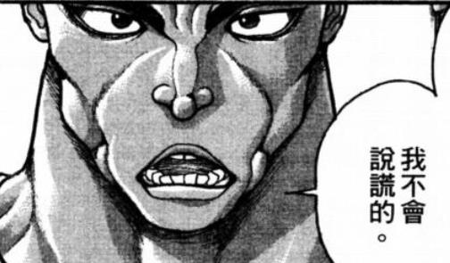
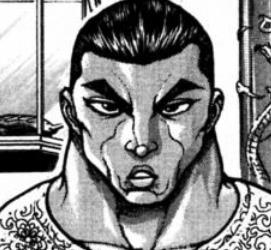
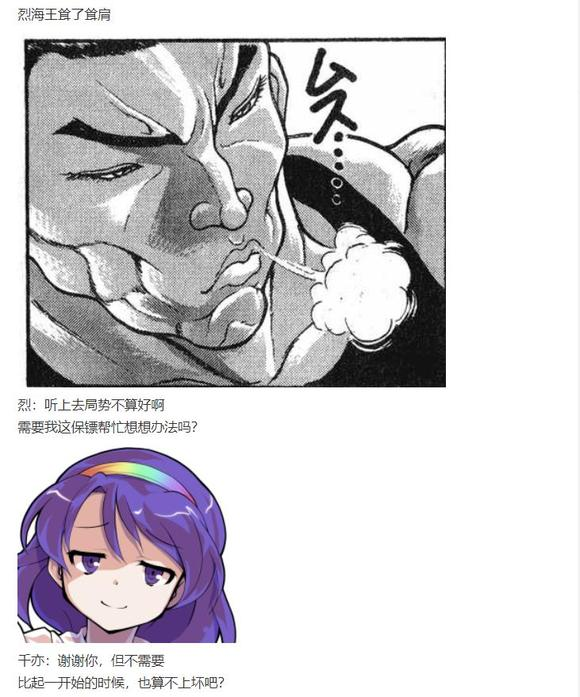

T1

百百世：开始了，人类！

符卡宣言 蛊毒【Cannibalistic Insect】！

扭曲如长虫的弹链自其掌心生出，弯曲如勾爪般射向了武者

天符【伸手及月】发动

烈：符卡宣言 天符【伸手及月】！

银白色的月光在洞穴中亮起，沐浴在光芒下的男人轻松避过弹链，袭向对手

百百世：呵呵呵

这样呢~~？

她屈指成抓，向后一扯，被避过的弹链随即掉头，以阴狠的角度刺向武术家的身后！

烈的破解【1d100：8】失败

剧毒判定【1d3：1】（天符效果在3T内拥有抗性）

1 无效

2 中毒

3 中毒

烈：！

并不是没有想到自后方而来的攻击……只是这弹链攻击之刁钻迅速远远超乎了他的想象！

单凭直觉闪躲已经行不通了，他不得不分出一臂以阻拦弹链

而与此同时，大百足的攻击也已经来临！

烈的攻击【289+3d40：55】

百百世的攻击【290+44+1d100：78】

灰发少女将工具随手扔到一边，千亦小姐赶快过去接好

她狞笑着举起空余的左手，让黑色的毒液凝结在指尖

百百世：才一开始就撑不住了吗

别告诉我你是这么软弱的家伙啊！

蜈蚣妖怪的毒爪毫不留情地撕扯在了武者的胸膛上！

烈的受伤【1d10:6】

1 回避

2 小伤害X2-1

3 小伤害X2-1

4 中伤害X2-1

5 中伤害X2-1

6 大伤害X2-1

7 大伤害X2-1

8 特大伤害X2-1

9 特大伤害X2-1

10 大成功/大失败【1d2：2】

Hp：23-3X2+1=18

追加伤害【1d4：3】点

Hp：18-3=15

Hp：15+3=18

利爪撕开皮肉，令血液飞溅，同时刺进背部的毒弹，使武者不由得咳血

他一腿踢出，逼退了正待追击的虫妖

姬虫百百世将指头伸进口中，舔舐着其上残留的血珠

烈：好吃吗？

百百世：还不错啊~

再给我一些吧！

T2

烈：容我拒绝

这样的经历有一次已经足够

绝不能再度……蒙受耻辱！

百百世：拒绝无用，我才不管你的意见！

符卡宣言 蛊毒【Cave Swarmer】！

碧绿色的弹群自洞穴两侧来袭，每一颗弹幕都形似毒蜂，每一只毒蜂内部都藏有致命的毒液，这是如字面意义一般的蛊毒，是虫类最具有代表性的武器！

烈的破解【1d100：86】成功

剧毒判定【1d3：2】（天符效果在3T内拥有抗性）

1 无效

2 中毒

3 中毒

Hp：18-23/10=16

Hp：16+3=19

武者以假腿重重踩踏大地

灵气的燃烧速度刹那间加快数倍，一同带来的是强度被全方面提升的肉体

毒蜂自四面八方飞来，却只穿过了一个逐渐消逝的残影，大百足凭直觉回过头去——正挥拳击来的，除那武者之外还能有何人？

烈的攻击【289+10+3d40：84=383】

百百世的攻击【290+1d100：81=371】

她在察觉到残影的瞬间就立即回身，回旋的右足如鞭般扫向对手的脖颈

“喝啊！”

但这次是烈海王夺得了先机！左手化作铁钳牢牢抓住脚踝，平衡被破坏的对手当场露出空隙，蓄力已久的右臂长驱直入，一击直拳打出！

百百世的受伤【1d10：9】

1 回避

2 小伤害+1

3 小伤害+1

4 中伤害+1

5 中伤害+1

6 大伤害+1

7 大伤害+1

8 特大伤害+1

9 特大伤害+1

10 大成功/大失败【1d2：1】

Hp：24-4-1=19

正中要害！像是数分钟前的匠人一般，大蜈蚣的身躯以急速向后飞去

她抬手抓住凸起的矿石，让尖利的指甲在岩壁上划出道道触目惊心的痕迹

终于停步的少女发起跳起，她大笑着狂奔在这与地面垂直的洞壁，以那恶毒的尖爪开始了下一波的攻击

百百世：对，就是这样！

不想被吃的话，就用行动表明！

你叫什么名字来着？！

烈：中华武术，烈海王

百百世：我记住你了

我是姬虫百百世

是连龙都能吃的大妖怪！

T3

百百世的身体在他眼中宛如一团模糊的黑影，武术家迅速做出决断

在原地维持地面战只会营造出被动防守的局面，仓促飞起在狭隘的洞中简直是让自己变成活动的靶子

既然对手选择了高速运动战，那就以相同的方式迎击！

于是烈海王同样走上山壁，虹龙洞的矿道中多出了两道颜色相异的光影

那是不断移动，不断跳起的人与妖，是在一瞬之间寻找着破绽，在空中重复着一次又一次交手的两人

千亦：真厉害啊~

已经习惯这节奏的集市之神提着百百世的工具慢慢跟在后方，密切注意着战局的勾玉匠人也一并跟去

一开始的目的逐渐被她抛在脑后了，她开始逐渐享受起这场发生在眼前的战斗，开始期待着这场战斗的结局

百百世：好~爽！

看看这招你要怎么办

符卡宣言 蛊毒【Sky Pendra】！

又一次交手过后，她没有退去岩壁，反倒飞向坑道的顶部

灰发少女将右爪合拢反手插入山石之间，纹路复杂的大型魔法阵立刻布满了这片坑道的每一块岩壁与土地

淡蓝色的激光如蜈蚣般扭曲着自法阵射出，全方位封锁着武者能够行动的空间，黄色的毒弹随机飞出，向着他的浑身各处要害射去！

烈的破解【1d100：63】成功！

剧毒判定【1d3：3】（天符效果在3T内拥有抗性）

1 无效

2 中毒

3 中毒

Hp：19-23/10=17

Hp：17+3=20

烈：够了吧，百百世小姐

毒液、毒弹、激光攻击……

异红符【巨阙】发动

Hp：20-1=19

巨剑在他的手中舞动，如同一团血色的烈火，将剧毒凝成的弹幕悉数拦截

剑风劈开激光，武者趁机飞起，他毫不在意那些零落滴在身上的液滴，一鼓作气持剑向大妖怪砍去！

烈：别玩这些毫无用处的东西了

拿出你真正的实力吧！

烈的攻击【289+10+80+3d40：44=423】（本回合破解成功，差值大于100自动胜利）

百百世的受伤【1d10：1】

1 回避

2 小伤害+1+4

3 小伤害+1+4

4 中伤害+1+4

5 中伤害+1+4

6 大伤害+1+4

7 大伤害+1+4

8 特大伤害+1+4

9 特大伤害+1+4

10 大成功/大失败【1d2：1】

“好啊”

烈：！

停下了

炽热的，巨大的，所向无敌的血剑

习自吸血鬼的技术，他所惯用的兵器，现在——

被那相比之下无比渺小的手，单手接住了

暗紫色的魔力缠绕在大百足的双臂之上，化作狰狞的凶爪，她大笑着发力，在巨剑深深斩入手掌的同时，将其自正中捏碎为巨大的破片

大妖怪扯起剑尖，丢入嘴中，手掌上深可见骨的伤痕瞬间恢复如初

她以单爪招架着武者的追击，肆无忌惮地将脸贴近，发出了那充斥着血腥味的兴奋的嘶吼

百百世：——那就来玩点更有意思的吧！

T4

灰发少女伸手向着身旁一抓

她什么都没抓住，这才想起自己开场时顺手把工具扔一边去了

百百世：你等一会行吗？

我找找我工具扔哪去了

烈：无所谓

百百世小姐随意即可

姬虫百百世回过头去，正好看见了拎着铁铲矿稿飞来的千亦

百百世：哦哦，谢谢你

这边，麻烦帮我扔过来！

千亦：您的工具请接好~

大蜈蚣双手接过她的武器，拿在手中敲了敲，心满意足地回过头来

百百世：让你久等了

我们继续吧！

魅须丸：这是何等……意义不明的对话……

这两个人清楚自己在干什么吗

千亦：在打架吧

打得很开心的样子，真愉快啊

“咚！咚！咚！”

她再度开始奔跑，以常人难以追及的速度奔跑，她肆意挥舞着一对工具，在这过程中凿下一块又一块巨大的砂石，魔力构成的巨爪将其牢牢握紧，捏成一团团如鹅卵石般圆润的物体

姬虫百百世坏笑着将其举起

百百世：不玩毒液了，来玩点石头吧

符卡宣言 采掘【Mine Blast】！

烈的破解【1d100：11】失败！

烈：这……

丢石子？

他轻而易举地躲过了大百足抛来的圆弹，心中疑惑对方为何会使出如此无用的攻击

百百世：呵呵~

——爆！

姬虫百百世将矿稿重重一敲，椭圆状的石块刺入洞壁，随这鸣声而一齐颤抖

武术家心中警铃大作，他瞅见那块正向他飞来的圆石开始绽放丝丝光芒

烈海王瞬间明白了他所没能理解的攻击真相为何

明黄色的光芒越发炽盛，数十块高度压缩的魔力炸弹同时爆发！在百百世的狂笑声中，无数细碎而不规则的散弹以极速炸向了位于中心的武者，这次的他没有任何回避手段，在真正意义上无路可逃！

（注：前3T天符回复Hp计算错误，烈的Hp调整为14）

T5

百百世：看样子你也和那家伙战斗过了啊

那么我也就再拿出点实力了

符卡宣言 采掘【妖怪们的盾构法】！

战斗中的双方互拼了一拳，均没占到半点便宜

他们同时向着后方退去，但大百足这次却并没像过去一样抢先追击——她将持有工具的双手交叉在前，以此为中心释放出了五道粗壮的激光

激光开始旋转，化作坚实的盾构，沙土与魔弹混杂在一起，随旋转的光芒一同向前射去

这魔力所构成的盾构机就这样一步步朝着洞穴外部推进，本应开凿隧道的工具此刻却成了将敌人碾碎的机器，这巨大器械将切割的已不再是山石，而是那渺小至极的人类的肉体！

百百世：这在开掘矿洞时可是个很好用的招式，只是不知道你跟山石比哪个更硬？

纯粹武道 发动

烈的破解【1d100：46】成功！（成功值：40-5=35）

烈：我想现在的自己大概比石块要坚硬些

不过……我也没有必要和这东西硬碰硬！

他抓准时机飞起，穿梭在魔弹与石块之间，与这巨大的盾构逐渐拉近距离

飞速旋转的激光比起机械的刀盘还要可怕数倍，可以这形式运转的器械也总有空隙

可以利用的时间甚至不到半秒？

对他而言，已经足够了！

烈：破！

——————

在后方观战的千亦小姐望着那从激光中飞出的身影，抬手鼓起了掌

千亦：厉害

真是精彩

魅须丸：……你认真的？

千亦：我认真的

虽说我不是战斗专精的神明，但看到这样的对决也还是会感到欣喜

要在集市之中，这可是能吸引无数游客的祭典呢！

玉造小姐没兴趣的话可以先离场，我会负责解决这里的事态的

魅须丸：神也好妖怪也好人类也好，现在的家伙们怎么一个个都这么暴力

那我就先走一步了

如果他们两个彻底失控……

千亦：我会将他们分开的，请您放心

虽说现在还未恢复至全盛状态，只是劝架的话应当没有问题

如果您打算寄售勾玉的话也欢迎光临我的市场~

——————

爆破判定【1d100：81】

本回合百百世回避概率X4

烈：妖怪们的盾构法，看样子没有比人类的强到哪去

烈的攻击【289+10+70+1d100：7=376】

突破阻碍的武术家出拳击向了大百足的下巴——

百百世的攻击【293+70+1d100：66=429】

百百世：别这样说嘛，烈海王

人类的拳头看样子……

可武者的铁拳，却被那暗色的魔爪所牢牢握在了手里！

百百世：也没比妖怪的强到哪去啊，哈哈哈哈哈哈哈哈！

她一把将武者拉到身前，将坚固的钝器大力砸下，哈哈大笑

百百世：输掉了？很正常！

我呢，是虫妖怪

昆虫的反应速度本来就被人类要快得多了

而我可是虫妖怪之中最强的公主啊！

烈的受伤【1d10:2】

1 回避

2 小伤害+2-1-1

3 小伤害+2-1-1

4 中伤害+2-1-1

5 中伤害+2-1-1

6 大伤害+2-1-1

7 大伤害+2-1-1

8 特大伤害+2-1-1

9 特大伤害+2-1-1

10 大成功/大失败【1d2：1】

Hp：14-1=13

在大百足那惊讶的注视下，武术家凭空旋转半圈，硬生生将这铁铲的重击所消去了

烈：我有句话一定要说

百百世小姐

蜈蚣不属于虫类

百百世：……啊？

真的吗？

烈：我不会撒谎的

蜈蚣与蜘蛛一样都属于节肢动物

灰发少女呆呆地长大了嘴巴

百百世：我当了这么多年的虫姬，现在你告诉我蜈蚣不是虫？

你听谁说的？

烈：是外界的课本……

百百世安心地长舒了一口气

百百世：吓死我了，人类懂什么啊

那肯定是人类胡说八道

我就说蜈蚣怎么可能不是虫子，我明明就是正儿八经的虫妖怪！

T6

苏活【命时计】效果结束（持续时间-2T）

烈：恕我直言，比起我那虫妖弟子，我可真看不出你哪里像虫妖怪

与其说是虫妖，不如说是矿工

灵气燃烧的速度缓缓变慢，先前的大量消耗过后，剩余的分量已不足以令他继续维持全面战斗的模式

爪间传来的力道顿时减轻，大妖怪立即加强握力，企图在此时废掉一臂

但武术家却将四指收起，中指关节前突，于方寸间发力刺向虫妖的爪心——于是魔力所形成的巨爪破碎为片片晶亮的碎屑，武者终于得以将左拳收起

百百世：哦？哦？你说什么？

矿工啊，是这样啊，这是我的工作来着，但居然，在旁人眼里比虫的特征还要强吗？

天弓千亦！是这样吗？

旁观的千亦小姐想了想，拿出了一张卡牌

千亦：我觉得百百世小姐平时的形象离矿工就差一顶安全帽

这里倒是有小石子帽子，百百世小姐需要吗？

灰发少女气恼地揪着她的头发

百百世：可——恶——

不行，这样不行啊！

再这样下去就不是大百足而是大矿工了！

不用了这种东西，本来就不该用工具干架的！

她又一次将矿稿与铁铲丢到一边——千亦小姐飞过去接住——而后伸展四肢，趴在了地上

烈：——收回前言

现在可是，真真正正的大百足了

他眼中所见的已经不是那个有点傻气的少女

那是在深不见底的洞穴深处所闪烁的点点微光，是尚未现出全貌却足以令人毛骨悚然的“虫”，是久远年代一直存活至今的，名为“百足”的吞噬者！

百百世：铁壳，钢躯，数以千万之足

凶恶，狂暴，吞噬巨蛇之虫

那是如长蛇般扭曲的线条，那是如巨蛇般粗壮的光芒，与大百足一同奔向前方的，乃是无可阻挡的力量！

百百世：张狂显现于外部的贪婪，嘶吼，咆哮，震慑万物，于深渊之底延伸直至天空！

——大蜈蚣【Snake Eater】！

光芒之顶端化作巨口，光之蛇与黑之虫一同咆哮，矿道与矿车早已不见踪影，就连那坚固无比的石壁也被一视同仁地吞入腹中！

烈的破解【1d100：66】成功！

烈：真是久违了……

唤醒了许久之前的记忆

高速冲击而来的敌人，相较之下孱弱的力量，败北就是被吃，失败就是死亡

真是久违了

这男人在战斗方面与过去相较并无太大改变，古板执着不知变通，一味相信着自己所选择的手段定然是绝对正确

这思维方式在于恶鬼战斗时又一次使他遭受重击

说到底，与这样的对手硬碰硬本身就是找死

姑且不提高速袭来的本体，光看看那些无脸的巨蛇就知道，正面冲突就是败北的结局

男人在心中赞同这个看法

技量不足的状况下，正面冲突只会导致败北……

烈：无所谓，有着现在的技术就不一样了！

外道之妖的吞噬，就以外道之法对应

接招，【无秩序的弹幕地狱】！

异红符【巨阙】发动

Hp：13-1=12

光怪陆离的歪曲世界代替了现实之中的矿洞，难以描述的怪异魔弹，令人作呕的几何图形，这如同噩梦中才会出现的种种异物迎向了巨大的光之蛇，而手持巨剑的武者则以全力斩向了扑来的蜈蚣！

烈的攻击【289+80+70+1d100：68=1207】

差值大于100自动胜利

百百世：血剑？谢谢你给我送吃的啊！

烈：既然你这么喜欢，那就送给你了！

百足妖怪故技重施，伸手抓向巨剑，但这次的武术家却主动松手将其放弃

血液与魔力被他一并抽出，百百世所得到的仅是巨大的空壳，那赤红的右拳却已经以极为刁钻的角度打出！

百百世的受伤【1d10：8】

1 回避

2 小伤害X4+3+4-2

3 小伤害X4+3+4-2

4 中伤害X4+3+4-2

5 中伤害X4+3+4-2

6 大伤害X4+3+4-2

7 大伤害X4+3+4-2

8 特大伤害X4+3+4-2

9 特大伤害X4+3+4-2

10 大成功/大失败【1d2：2】

完全命中！没有放过这转瞬即逝的时机，烈海王全力将拳打出，如此才能称得上最基本的敬意！

灰发少女飞向了那怪异结界的深处，扭曲的魔弹如潮水般涌来——

吞噬判定【1d100：66】

回复【2d3：5】点Hp，Atk提升5点，本回合受到的伤害/2

Atk：293+5=298

Hp：15-4X4/2-3-4+2=2

Hp：2+5=7

“谢谢你啦！”

而后

如噩梦般不详的紫红色虚影一闪而过

姬虫百百世周围的一切在刹那间消失，甚至连结界本身都短暂淡去，露出了外部坑道的岩壁

百百世：虽说血剑没吃干净，但这玩意的味道可更好啊

这是……我想想……啊！后户的贤者！

嘿~真有趣~！

（补上上回合漏掉的混乱判定【1d100:79】，百百世拥有特殊攻击耐性（这个卡面也漏写了就是高Atk强者标配那两句），判定效果为百百世上回合无法造成伤害，对结果无影响）

（以及弹幕地狱伤害倍率打错了，百百世Hp修正为9）

T7

她向着武术家勾了勾手指，并再次调动起了用负面能量精炼的强大魔力

百百世：赤红，深紫，不详之爪，妄念之甲

白之毒，黑之力，负面之妖，恶虫魔姬

魔力构成铠甲，妖甲链接成型，赤色与紫色的巨爪浮现于身侧，狰狞的黑铠化作那庞大的身形

那潜藏于洞中的巨虫终于开始行动，它以无可阻挡的气势走出，展露着那闪烁着寒光的爪与牙！

百百世：厌恶来自心中的恐惧，畏惧正是实力的证明

巨龙逼退，万灵哀鸣，哭泣吧，嚎叫吧，而后葬身于百足之腹吧！

大蜈蚣【Dragon Eater】！

混乱判定【1d100：44】

本回合百百世无法使用技能

烈的攻击【289+800+70+1d100：66=1155】

百百世的攻击【298+830+70+1d100：44=1172】

不可名状的低语被这狂暴的妖怪所完全无视，狂暴的巨虫撕碎了眼前所见的所有事物

位于结界正中的武术家被狂奔而来的大百足正面撞上，那凄厉的轰响穿透了深邃的山洞，森林中的飞鸟走兽顿时为之惊起，瀑布上巡逻的天狗也不由得感到畏惧，整座大山的每一处角落都能听到这可怕的轰鸣！

烈的受伤【1d10:3】

1 回避

2 小伤害X5+2-1

3 小伤害X5+2-1

4 中伤害X5+2-1

5 中伤害X5+2-1

6 大伤害X5+2-1

7 大伤害X5+2-1

8 特大伤害X5+2-1

9 特大伤害X5+2-1

10 大成功/大失败【1d2：1】

Hp：12-1X5-2+1=6

百百世的Hp吸取：1d5：3

烈的Hp：6-3=3

百百世的Hp：9+3=12

战场早已从矿洞的深处转移到了入口处不远的地域，漫天的尘埃与狂暴的魔力掩盖了一切，连紧随在后方的无主物之神都难以窥视其中的战局

千亦：……

她有些紧张地飞进烟尘之中，将手伸入腰间的布袋，双指夹住了其中的某张卡牌……

“太过分了吧你！”

千亦：什么嘛，吓我一跳

她安下心来，将卡牌放回原处

那魔力所造出的巨大蜈蚣已经尽数消散，位于战场正中的是被压制在地上的武术家，与被他牢牢钳住双臂的百足妖怪

百足妖怪张开的大嘴被仓促生成的花弹堵住，以此躲过捕食的烈海王一头冷汗，暗自庆幸

百百世：拼招输了就给我投降——

放手，我就吃一口——

烈：要是我输了，你想吃多少就吃多少

但现在绝不可能在这里失去肢体！

百百世：一招输了也是输了，你这武术家压根就说话不算数！

烈：简直是强词夺理……

倒是你，你不是虫妖公主吗？

可否有点公主的样子，我就没见过你这样的公主！

金色的光辉浮现，璀璨的光芒亮起，令人联想起虫齿的三角状的尖利魔弹层层自她的身后凭空生出

大百足这次并未伏下身去，她将双臂向着两侧伸开，双爪用力勾起，向着那百折不挠的对手展露出兴奋而又欣喜的笑意

烈：还请全力以赴吧

弹幕地狱，最终阶段！

百百世：吞噬是喜悦的来源，战斗是生命的意义！

挥舞工具展露爪牙思考哲学问题吐出毒液开凿山石与好对手决一胜负将一切吞进口中，此即【虫姬殿下的闪耀忙乱的日常】！

混乱判定【1d100：53】

本回合百百世无法使用技能

武术家在最后一刻的冲突发生前释放了弹幕地狱的干扰

他并没在意这招最终的效果，只是习惯性地用出了自己所有的手段

烈海王握紧拳头，专心注视着那黄金色的巨虫，注视着那咆哮而来的虫妖公主

他调动着浑身上下所有的魔力，操纵着魔弹迎向了虫姬的攻击！

魔崩拳 发动

烈的攻击【289+900+90+1d100：61=1340】

百百世的攻击【298+930+1d100：36=1264】

百百世的受伤【1d10：1】

1 小伤害X3+3（无法回避）

2 小伤害X5+3

3 小伤害X5+3

4 中伤害X5+3

5 中伤害X5+3

6 大伤害X5+3

7 大伤害X5+3

8 特大伤害X5+3

9 特大伤害X5+3

10 大成功/大失败【1d2：1】

Hp：12-1X3-3=6

爆破判定【1d100：100】成功！

Hp：6-3=3

在震动山林的轰鸣声中，金黄色的巨虫冲出了草原深处的矿洞

莫说草原上的小小妖精，就连悬崖之下的山童与山顶的巫女都能看到它那遮天蔽日的躯体！

但这巨虫突然开始颤抖，这巨物突然停滞在空中

刹那间，金色的百足爆散为无数细小的破片，露出其肚腹之中的真容——那是逐渐消退的扭曲空间，与缓缓出拳的烈海王！

吞噬判定【1d100：48】

回复4点Hp并令Atk提升【1d15】点

Atk：293+【1d15：7】=300

Hp：3+4=7

T9

坠落，坠落，人与妖怪同时向那遍布积雪的草原上坠落

百百世将空中残留的破片一口气吸尽，烈海王用所剩不多的力量再次将魔剑铸出

离接触地面还有5秒

双方同时调整架势，一人举起巨剑，一人伸出尖爪

还有3秒

无需多言，他们向着彼此飞去

还有1秒

最后的胜负开始！

异红符【巨阙】发动

Hp：3-1=2

烈的攻击【289+90+1d100：79=458】

百百世的攻击【300+1d100：26=326】

百百世的受伤【1d10:5】

1 回避

2 小伤害+4

3 小伤害+4

4 中伤害+4

5 中伤害+4

6 大伤害+4

7 大伤害+4

8 特大伤害+4

9 特大伤害+4

10 大成功/大失败【1d2：1】

Hp：7-2-4=1

吞食判定【1d100:39】

无视特殊效果——没有特殊效果！

虫妖那百试不爽的能力这次却遭到了失利，早有预料的武者硬顶着她的爪击，将自己的小臂直接塞了过去！

尖牙深深刺入肉体，巨剑自上空奋力斩下，最后一秒的时间过去，两人同时砸向了伪天棚的中心！

T10

没有结束！

仍然还有力量，战斗的双方都有余力！

他们并未如想象般倒在草原上，而是如野兽般站立着瞪视着彼此

血剑溶解，妖爪散去，能够使用的武器仅剩下自己的肢体！

纯粹武道发动

烈的攻击【289+70+1d100：58=417】

百百世的攻击【300+1d100：20=320】

若要比拼肉体的强度，那一定会是是大百足的胜利

但若要比拼空手搏斗的实力……若要在余力不多的情况下以近身战分出胜负……

那毫无疑问，会是中华武术的大获全胜！

百百世的受伤【1d10:6】

1 回避

2 小伤害+3

3 小伤害+3

4 中伤害+3

5 中伤害+3

6 大伤害+3

7 大伤害+3

8 特大伤害+3

9 特大伤害+3

10 大成功/大失败【1d2：1】

Hp：1-3-3=0

烈：呼……

可以劳烦你……松口吗？

大蜈蚣终于在此刻倒下，烈的拳头擦着她的面庞砸入草原的湿地

气喘吁吁的武术家抽搐着面庞，企图从她的口中抢救回自己的左臂

大百足想了想，慢慢悠悠地松开了嘴

百百世：……好

烈：？

百百世：好爽！

多谢你能尽情让我射出弹幕，挥动爪牙！

武术家愣了半晌，也一并笑了起来

烈：这是我的要说的话

多谢你能陪我打一场

百百世：我非常欢迎强者！

不管你是盗采者还是什么人，想来就随时来这虹龙洞吧！

武术家站起身来，将躺倒在地上的虫妖拉起

真是一场愉快的战斗

他们同时在心中这样想到，也同时在嘴上说起

~战斗结束~

~胜者 烈海王~

~【1d15：14】分钟后~

百百世的好感度【1d100：76】（大成功千亦的介绍+20，战斗胜利+30，战胜终符+10，合计保底60）

千亦小姐淡然地递给两人好几张画着❤符号的生命卡牌，在他们使用完毕后又木着脸将其收回

千亦：多准备了几张这种卡牌看样子还挺有用的

好了，我估计整个妖怪之山都知道你们在这里打架了

山女郎蹲坐在不远处的矿洞入口，向着湛蓝的天空吐了口烟圈

山如：百足老大，还有这位小哥

能否劳烦你们换个地方聊天啊？

矿洞的维修姑且不提，再这样下去连赌场都要停业了呐

百百世：抱歉抱歉，说来的确有正事要办

你……是来干什么的来着？

烈的说明【1d100：6】

在这场激烈的战斗之后，武术家不由自主地放松下来

他下意识地开口……

烈：哦哦哦哦哦哦哦哦哦！

并在蓝发少女那惊悚的眼神中打起了车轮拳

百百世：你想再打一场吗？

太棒了，我接受你的挑衅！

现在就再战一场！

千亦：有人吗——

有人能管管这两个肌肉笨蛋吗——

大夫——麻烦过来喷点烟草可以吗——

山女郎看着再次厮打成一团的两人，缓慢地摇了摇头，以此委婉表达了拒绝

~【1d5：3】分钟后~

最终，劝架的职责还是交给了集市之神

千亦小姐以尽可能简明扼要的话语说出了两人的来意

百百世：这样啊，你和天弓千亦想找我帮忙？

那怪不得你要跟我打架

做的没错！只要打赢了我我就会帮你的！

烈：那就谢谢百百世小姐了

方才千亦小姐也和你说了，她想要知道自己与那位大天狗之间是否有什么误会

你怎么看？

百百世的了解【1d70：46+30=76】（制造卡牌的同伙+30,60以上有个大概想法，75以上化解矛盾）

大百足立即开口答道

百百世：还用想吗

肯定是那典又挑拨离间了啊

千亦：毫不犹豫地给出了答复？！

百百世：在她身边出现这种破事，我不用想都知道是典干的

我听饭纲丸讲过，你们两人之间的确有……那个叫啥来着？

烈：利益冲突

百百世：对，利益冲突

但这事很严重吗？不至于吧

你恢复到全盛时期能打过我吗，天弓千亦？

千亦：不敢说稳操胜券

和你维持稳定程度的战局，这点程度的自信我还是有的——请不要用“那我们到时候来打一场吧”这样的眼神看着我好吗你们两个！

武术家与大蜈蚣移开了视线，仿佛什么都没发生过一样

百百世：意外的实力派啊你

没关系，就算你恢复到巅峰实力之后和我一样强吧

——那又怎么了？妖怪之山这么大，天狗以外的实力者也多得很，光你一个就能破坏山上的平衡了？

胡说八道，就算再来个守矢神社这山头也塞的下，还差你这一个神？

烈：说得也是

皮克隔三差五爬山，也没见天狗找他麻烦

千亦：但我们的冲突是商业利益方面的……

大百足摆了摆手

百百世：正常情况下，她可不会像这次一样采取这种别扭的行动

什么相互试探，秘密武器，暗藏底牌，胡扯胡扯

烈：……？

那位饭纲丸小姐到底是什么样的人啊？

灰发少女提着铁铲，走向了草原与峭壁的交接处

百百世：你自己亲眼看看不就完了？

哦，来了

微笑的白狐先一步到来，随后有呼啸的山风吹起

一位身材高大的蓝发女子伴随着狂风出现在了众人眼前

“本想着处理完文件就来的……真是一刻都不让我安生”

她头戴蓝色的六角帽，身穿深蓝色的山伏装，脚踩紫色的一本歯下駄，金色的肩甲下固定着如外衣般的黑色披风，其下装饰着天狗身上常见的绒球

她就是鸦天狗的首领，天弓千亦的合作伙伴，大天狗饭纲丸龙，而其右手所持的物体尤为吸引目光，那是个常用于支撑相机的三脚架

这位大天狗单手拎着三脚架的一条腿将其抗在肩上，笑呵呵地走向了她的朋友

饭纲丸：百百世，你这家伙~

又在这里给我找事！！

如钝器般重重砸下的三脚架刚好与铁铲的底部相击，姬虫百百世大笑着以矿稿回击

百百世：干架就是正事！

你还要感谢我才对

典这次又在挑拨离间，要不是我发现及时，你的商业伙伴就要和你闹掰了！

饭纲丸龙看向了快被惊掉下巴的集市之神

饭纲丸：错了，你这天真的家伙

天弓千亦已经失控了

她不光想要独占卡牌的利益，还想将妖怪之山整个纳入她的手中

典：唉，这可真是令人叹息

千亦大人的野心竟然大到了如此地步

我们也不得不及时采取措施了……

武术家看到他的委托人脸色由白转红，由红转紫

简直要气炸肺了的千亦小姐大喊出声

千亦：说什么！说什么呢你！

能力卡牌的制造过程我可是出了大力，现在好不容易生意红火起来了你却要将其放弃，我怎么可能同意！

但就算这样我也没想过要当妖怪社会的主宰者啊，最多也只是想由我做主导人而已！

典：的确如此，千亦大人，您可万万不能就这样退缩了

饭纲丸大人利用您做生意，这是路人皆知的事情

如今好不容易拥有了力量，怎能就如此让出利益——啊

得意忘形的白狐刚将耳语说到一半，就被百百世拎着领子提起

百百世：我刚刚说什么来着？

暂时让典闭嘴然后好好谈一谈或者干脆打一架

你们看我这个建议怎么样啊？

面色不善的大天狗与神明同时看向了白狐

典：那个……

饭纲丸：之前就有些隐隐约约感觉不对

我就说你这几短时间怎么天天鼓动着我做这做那的

典，果然又是你在激化矛盾啊

千亦：呐，饭纲丸小姐

我们之间的分歧暂且放在一边

——我可以教训一下你的宠物吗？

饭纲丸：这可令我为难了

于情于理我不该答应——但偶尔让她长个记性也算不错

没有问题

典：等……

虫妖怪把管狐往前一丢，随后抬手招呼着武术家向矿洞中走去

烈海王心领神会地跟上她的脚步

他知道，之后的事情就暂时不需要他的参与了

烈：嗯……

贪婪？

千亦：错了，是“知足”啊

力量在几天后就能回来了，我也建成了属于自己的势力

之后可以以平等的姿态与山上山下的人们谈生意了，而且……

七彩色的少女背对着暗淡的阳光转过身来

如天空般的斗篷随风飘动着，映衬出她那美丽的笑颜

千亦：我还认识了重要的朋友！

这样都感受不到满足的话，我就要变成大百足了吧？

烈：像百百世小姐那样也不错啊

烈的察觉【1d60：44+40=84】（50以上成功）

烈：说起来……

刚才战斗的时候

我好像看见你拿出了什么东西

天弓千亦从布袋中夹出了一张卡牌

卡面上印着殷红如血的凤凰之羽

千亦：锵锵~

【不死鸟之尾】，起死回生的卡牌哦

本来打算用在关键时刻救命的，但某位保镖实在过于能打，这卡牌就没有使用的必要了

烈：我个人情感上是不希望你用这种……

千亦：不~行~

我一定会用

动动脑子好吗，我怎么可能看着你白白送命啊？

肌肉侦探和他的委托人在草原上漫步行走着

这次异变或许还称不上结束

不过，烈海王在心中确信

他所需要做的事情，已经尽数完成了

（本日的更新到此结束，下一次更新在明天或后天或大后天，内容不多，会是本次异变回的收尾）

（以下是我的废话）

那么虹龙洞ex关卡堂堂结束！

正篇五六面一个没打就突入EX了并且拜托EXboss帮忙解决问题了！好哎！都什么玩意啊！

我一开始准备在氧气环节整点乐子的没想到烈师傅非得开发新技能

血铠不是挺好的吗还帅气，结果中了急救拳开发……于是就做了这个替换

单看上去感觉似乎没急救强？毕竟是剧情做出来的生存buff嘛，烈师傅的抗性已经很全面了因此就没加那些个杂七杂八的效果，给了个重复判定机会

这卡是思路其实是一张帅气且用得上的卡，尾气真的挺不错，而急救拳在这环境下也很少能上场了，因此不如就换个能经常用的吧

然后是百百世小姐的卡

我为什么要车这么一张折磨自己的卡啊（悲）这场真的真的好麻烦啊啊啊啊

百百世这场我写的挺开心的，几个场景我感觉都挺帅气

不过到底还是出了问题，前面算错了一点Hp因此……T10是我现场骰现场写的！！！我的妈耶累死我了，幸亏烈师傅武道cd好了不然这场真的悬了

之后的名侦探百百世就……啊你真厉害

给了加上去的保底结果骰出来比保底还高你和千亦到底是怎么回事（笑）

于是烈师傅的委托告一段落，之后会是这次异变回的收尾，委托报酬啊卡牌机制啊以及3天后的市场啊这些……我能在明天写完吗？希望可以，希望可以

那么本次的更新到此结束，骰子明天发，下一次的更新在明晚或后晚或大后天晚上，内容不多，为卡牌异变的收尾

顺便一提下次更新是异变回完结篇不是直接停更啊)

这个异变回完了以后写什么回还没想好，总之会写个一两篇再停的，大概吧)

大概今晚八点左右更新

~3天后~

~第1256天~

~夜晚~

漫步行走吧

拾起无名之石，穿越七彩薄雾

走向青翠丛芮，踏过未融之霜

飞上云端吧

山道上闪烁着点点灯火，丛林中亦有魔力辉光

来自四方之光汇聚一堂，辉映着空中璀璨星芒

于此停驻，遥望着不属于任何人的夜空

山的顶端是有月的天空

七色的虹桥架于清光之上

“……”

随手抛接着美丽的石块，她的思维再度陷入迷茫

此夜风景美丽依旧，但她又因何而来到这里？

“欢迎光临，月虹市场”

“今夜您是第一位客人呢”

自空中传来了声音

呼唤者从彩虹走下

绚丽的光芒如弯月般凝聚在她的身后

柔和却不耀眼，让她得以看清对方的容颜

啊，原来如此

她迟缓地想着

山顶之上是月与虹架构的市场

不属于任何人的天空之下，却是交换所有权的场地

正如过去数次到来时一样，今夜的目的是……

百百世：付出钱财，得到物品

千亦：就是这样

让我想起了第一次举办集市的时候

那时你也是第一位客人呢，百百世小姐

大百足抬起手指，敲了敲脑袋

百百世：天弓千亦……

真是美丽的神明

集市之神愕然地微微张口

千亦：啊？

百百世：和风景画一样漂亮，说不定比风景画还漂亮呢

和我这种丑恶的妖怪完全不一样啊

我那时是这样想的

而现在的话……

她露出了那富有侵略性的，象征着捕食者的笑容

百百世：现在就不只是漂亮的样子货了

是要认真对待的家伙了啊

蓝发少女愣了一下

千亦：“谢谢称赞”……我该这样说吗？

但是，你刚刚提到的一点，我无法认同

百百世小姐才不是什么丑恶的妖怪

——而是帅气的大百足呀

这次，露出惊愕表情的人换成了姬虫百百世

她习惯性地揪着头发，似乎是感觉有点不好意思

随后，妖怪和神明一起笑了起来

山道上汇聚的灯火升向天空

参加者们逐渐入场，今夜的集市就要开始了

BGM：Lunar Rainbow

天弓小姐的势力成员【1d10：1】

1 三花猫、厄运神、野生神明

2 1+出门打工的山姥与妖精

3 其实暗地里劝诱了鸦天狗（为啥啦）

4 三花猫、厄运神、野生神明

5 4+出门打工的山姥与妖精

6 其实和山童河童达成了合作协议（为啥啦）

7 三花猫、厄运神、野生神明

8 7+出门打工的山姥与妖精

9 最近比较闲的鬼仙人……（为啥啦）

10 大成功/大失败【1d2：1】

三花猫：那边那位姐姐~

这里有上好的卡牌——以及其他的玩具！要来看看吗！

揽客中的三花猫被抽出半截御币的巫女吓得一哆嗦，赶紧改变了说辞

灵梦：是你啊，豪德寺三花

上次在我的神社门口拿着“地底太阳”叫卖……

三花：不好意思啊，灵梦姐姐~

我不懂得规矩嘛

这次是在妖怪之山的市场，卖温和的卡牌和其他的玩具

你看，这张是【擅长做生意的招财猫】，想做生意的话推荐购入哦~

灵梦：这个不错啊

给我一张招财猫卡牌~

先一步来到市场的博丽巫女，已经开始兴致勃勃地挑起了物品

而在市场的另一头——

键山雏：一次性的雏人偶，价格便宜方便好用

您要买些放在城堡中吗？

另外我也提供厄运吸纳服务

红魔馆的女仆长阴沉着脸将食指与中指交叉起来

咲夜：脏东西走——

蕾米莉亚：别这样无礼，咲夜

这个厄运神看样子是得到了某种加护

键山雏：如您所说，天弓老板用做卡牌时剩下的余料帮我做了一个护身符

只要时常充能的话，直接和普通人说话也没关系了

大概吧！

咲夜：这个真的靠谱吗

姑且先买一个放在美铃的房间拿她试试……

天弓千亦所收拢的妖怪们是这次集市的主力

而说到集市，自然也少不了路边叫卖的小吃摊位

秋穰子：便宜好吃的烤红薯~

新鲜现切的水果~

秋静叶：买水果红薯送红叶挂饰~

啊，是早苗小姐！

诹访子大人也在呢，您要来点吗？

早苗：请给我一份冰西瓜吧

诹访子大人就不用了，她什么都不想吃呢

诹访子：早苗，你怎么能这样对待你的神明

又不是什么大不了的事——咿呀！

绿发的巫女小姐一瞬间露出了如恶鬼般的表情，旁观的秋姐妹吓得打起了哆嗦

早苗：不好意思我没听清楚

能再说一遍吗，趁着我不在家偷偷带着钱去赌场输得一塌糊涂之后为了拿回赌本和小铃比合气道失败最终被人家可怜着送回钱来兴高采烈地叫嚣着回家刚好和在家查账的我打了个照面的诹访子大人？

诹访子：（神奈子——）

神奈子：逐渐也攒下些信仰了，对你们来说是好事啊

给我一个红薯吧

秋静叶：您请~

多亏了小千亦帮忙呢

明明刚开始还是需要我们照顾的新人，不知不觉间就变成可靠的神了

神奈子完全无视了老友那求助的眼神！为了避免自己良心不安，她甚至当做什么都没发生一样和秋姐妹搭起话来！何等可怕的神明啊！

早苗：我一直都这样想，诹访子大人需要深刻的反省

等今晚回去之后我会再和您认真谈一谈的

诹访子：救命啊……

顾客逐渐多了起来，现场的氛围变得越加热烈

被特意请来主持集市的天人大小姐，站在事先准备好的高台上吸引着众人的目光

而两盆会说话的巨大花卉，在这时才在众人奇异的眼神中入场

“搬货这种苦力活你居然找我这种青春少女帮忙？！你那一身肌肉光摆着好看啊？！”

“我再厉害一共也就两根胳膊啊！我连头都用上了真的拿不完了！”

五彩缤纷的花卉们被小心翼翼地放在了摊位上，气喘吁吁的武术家与魔法使赶紧拉了两个小凳子坐了下来

魔理沙：哎呦我的胳膊累死我了……

幽香，给钱！

幽香：我没有请你哦，我只找了免费的苦劳力而已

报酬请就找旁边这位武术家要吧

武术家连忙摆了摆手

烈：真没带什么好东西

等之后我问问千亦小姐有没有你的卡牌给你整两张？

魔理沙：已经做好的卡牌太没意思了

拿点龙珠自己做点东西赚钱才是正道啊！

烈：你可拉倒吧，都说了再开采会出问题的

真想要得找那几位看看有没有存货……

“呵呵，有存货也不会给你的，请放心吧”

毫不掩饰自身嫌恶之情的白狐走到了花摊前方

她瞪了眼乘凉的武术家，连带着也一并瞪了眼坐在他旁边的魔法使

魔理沙：（这狐狸瞪我干吗？我认识她吗？）

烈：（可能是想试试魔炮，以此鼓励你给她来一发）

典的怀恨在心【1d70：29+30=59】（连续的失败+30，50以上低语）

他看见那管狐嘴唇轻颤，似在嗫嚅

菅牧典就这样堂而皇之地当着他的面说起话来，那声音极低，如同之前与千亦低语那般轻细，纵使他就站在旁边，没能听清楚其中的一言半语

他猜测那或许是对幽香所说，但武术家却不懂得唇语

他回忆起了三天前的场景

——————

典：……如今好不容易拥有了力量，怎能就如此让出利益——啊

得意忘形的白狐刚将耳语说到一半，就被百百世拎着领子提起

百百世：~

那难以察觉的声音立即变大了，莫说是天狗与神明，就连站在不远处的他也听得清晰

——————

烈：（我说她那时怎么敢就这么直接开口）

（如果没有百百世小姐帮忙，其他人是都听不见的啊……）

烈：（你懂唇语吗？）

魔理沙：（你当我是万能的吗？我试试啊不保证一定对）

（ “您的男朋友前些日子与大百足百百世大人打了一场呢”）

（“那凶猛而好斗的样子，据说和当日与您战斗时都可相提并论”）

（ “我忍不住怀疑，以战斗这形式而促进的恋情，又能否称之为真正的爱意？或许他接近您真正的目的仅是满足心中好战之欲……”）

哇 咧

“噗，哈哈，哈哈哈，哈哈哈哈哈哈哈哈哈！”

绿发的大妖怪开始还捂着嘴，听到最后到底还是没能憋住，畅快地大笑了起来

典：……？

她在木椅子上笑得摇摇欲坠，武术家赶紧走到她身后抓紧了椅背

烈：有这么好笑吗？

幽香：可以打100分啊，在漫才表演里

帮我把伞拿过来

她从恋人手中接过阳伞，将伞尖指向了目瞪口呆的白狐

幽香：说完了？

去死吧❤

甚至连象征性的倒计时都没说一声，毫不顾忌目前所处的环境，阳伞的顶端瞬间聚集起了堪称可怖的魔力

闪亮的光芒照耀着白狐娇小的面庞，可怜可叹的悲剧下一秒就将发生——

“抱歉，抱歉”

“没有管好宠物是我的失职，难得的祭典，还请别这样大动肝火了吧”

身材高大的天狗瞬间拦在了白狐身前，伞尖的光芒被她握在手中

饭纲丸龙口中连声道歉，又毫不尴尬地向众人问好

幽香：没有生气哦~

烈：（生气了）

魔理沙：（绝对生气了）

幽香：管不住嘴的小宠物可要看好了

万一哪天将可怕的家伙激怒了，就这样暴毙在外面，或是凭空消失了，该怎么办呢？

你也会很伤心的吧~

饭纲丸：说得是呢

还好她是我的宠物，一般情况下也就教训一下结束了

你看，典这么可爱，不会有人对她动杀心吧~

幽香：当然

一 般 情 况下

“呵呵呵”“哈哈哈”

大天狗与大妖怪和谐地笑着，站在她们中间的白狐脸上的表情令烈海王也不由得感到同情

他终究还是没能战胜自己的良心，在友人鼓励的目光中硬着头皮站了起来

烈：饭纲丸小姐！

关于卡牌我还有些搞不太明白的事情，请问您可否帮我解答一二！

饭纲丸：卡牌？可以，毕竟这本来就是我的作品

到旁边清净些的地方谈吧

鸦天狗的首领放开了宠物，和武术家向着一旁走去

白狐正准备趁机离去——

幽香：~

绿发的大妖怪将写着标价的卡牌递给了魔法使，金发小女孩立即心领神会地凑上前去

她一手揽住了这只可爱的狐妖，在她的耳边悄声低语

魔理沙：这位客人，要买花吗？

价钱很公道的，买回去装饰房间，当魔药素材，或者看家护院都不错

现在买我给您打18折，您看怎么样？

典：我……我买……

走远的武术家在心里暗自安慰自己

这可不关我事……我尽力救你了……要怪就怪你找错人了吧……

