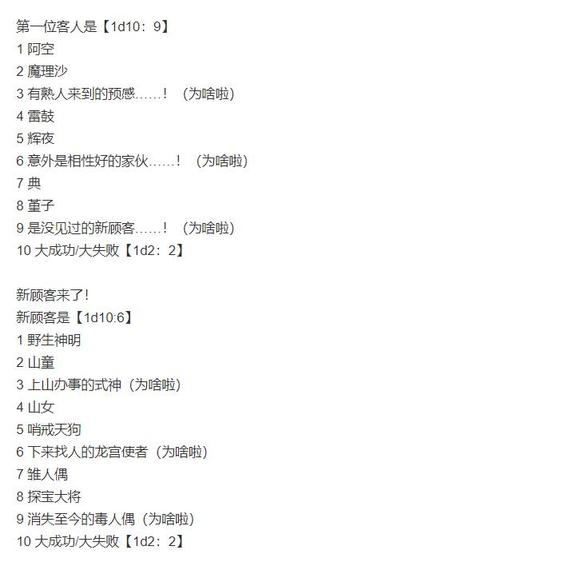
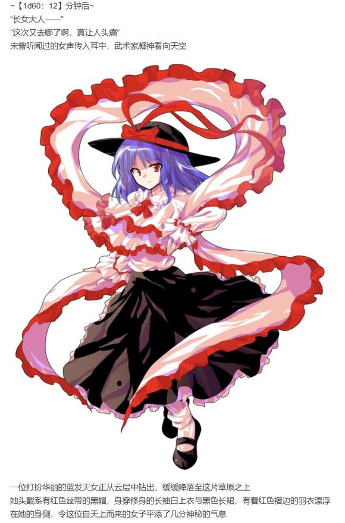

她将杯子指向了垃圾桶，犹豫了足足五秒钟，才在快要准备的动手的某人那极具压迫力的目光下将手收了回来

吉吊小姐又喝了口咖啡，而后慢条斯理地说到

吉吊：我还以为您早就知道了

我是特意来嘲笑您的啊

烈：真的就这么说出来了！！

你就丝毫不打算遮掩一下你言语中的恶意吗？！

她故作惊奇地张大了嘴

吉吊：又何必要？

无论是过去还是现在，我与您说话时从未带有过一丝一毫的善意，“我的朋友”

烈：我……

你……

吉吊：您还是一如既往的思维僵化，口笨舌拙，您现在的样子活像只刚刚孵化的雏鸟，只知仰头张口却发不出一星半点算得上有意义的鸣叫

您不必着急，也无需勉强自己，我有着充足的耐心，因为【我一直都是您的朋友】

武术家紧皱眉头捂住了耳朵，目睹此景的黑帮老大以极具嘲讽性的慢动作轻轻鼓掌，并配上了她那优雅而不失礼节的笑容

烈：你真是个彻头彻尾的恶棍

你的瓶装咖啡，不加毒，拿好，走好，不送

吉吊的兴致【1d100：95】（50以上留下来接着看笑话）

吉吊：谢谢，但我还不准备走

我今日休假

我打算在这里坐上一天，喝着勉勉强强的咖啡看看还算不错的风景，顺便欣赏您很可能会做出的其他可笑之举，也算是个度过假期的愉快的方式

百百世：哦哦~听上去还挺有情调的

烈海王，你这朋友真够意思，这才刚开业就过来捧一天的场子！

烈：——我谢谢她啊！

他叹了口气，走进后厨收拾起厨具，期望着这位顾客早日离开，下位顾客快些到来

第一日下午的人气【1d70:13+30=43】（事先宣传+30默认一位顾客，60以上两位，80以上三位）

第二位客人【1d10：8】

1 阿空

2 魔理沙

3 有熟人来到的预感……！（为啥啦）

4 琪露诺

5 辉夜

6 意外是相性好的家伙……！（为啥啦）

7 典

8 一轮

9 是没见过的新顾客……！（为啥啦）

10 大成功/大失败【1d2：2】

时间到了下午

“喝！”“哈！”

瓦尔哈拉的店主与服务员正在门口进行着紧张而刺激的近身搏击

至于唯一一位客人对此有何看法，由于烈海王在这一上午已经品鉴的足够多了，因此就暂且不提——实际上，对方迟迟不走而带来的某种焦虑感正是这场交手开始的原因之一

更主要的原因是这两位都认为既然没客人不如打上一场

两人手上动作逐渐加重，友谊性质的切磋眼看着就要为第二场决斗了，湛蓝的天空下却在此时浮现出一朵异色的云彩

烈：？

武术家立即收手，指向前方

一位头戴僧帽的蓝发少女正快步走来，正是命莲寺的入道使

一轮：呵~这不是……

百百世（大声）：总算又有客人来了啊！欢迎光临！

烈（大声）：呦，这不是一轮师傅吗！

下午好啊！一轮师傅想喝点什么？

警觉地看了眼这位陌生的大妖怪后，蓝发少女立即举起了一双铁环

一轮：陷阱？！

吉吊八千慧端着续了一次的咖啡，看着店主那手忙脚乱的说明，如同在近距离观赏一场结局未知的情景喜剧，从中感受到了充足的乐趣

这可真是与假期相配的娱乐活动

~【1d15：13】分钟后~

一轮：你跟我说这一位是你请的服务员？！

哪家饮品店会有这么强的服务员啊？！

百百世：眼光不错嘛你~♪

别担心，你身上肉是挺多，但我不感兴趣，不会吃你的

一轮：肉，肉多？！

你——

烈：一轮师傅别误会，百百世小姐平时说话就这样，没有恶意的，只有食欲

一轮师傅想喝什么啊？

一轮的点单【1d10:5】

1 要一斤珍珠细细剁成臊子……

2 要一杯泾渭分明的奶茶，上面是凉的下面是热的……

3 要一杯螺丝起子（这里不是酒吧！）

4 要一斤珍珠细细剁成臊子……

5 要一杯泾渭分明的奶茶，上面是凉的下面是热的……

6 来一份饺子汤（你搞笑吧）

7 要一斤珍珠细细剁成臊子……

8 要一杯泾渭分明的奶茶，上面是凉的下面是热的……

9 要一份不加糖的甜饮料（为啥啦）

10 大成功/大失败【1d2：2】

一轮：嘿嘿嘿

蓝发僧侣不怀好意地笑着

一轮：请给我一份大杯的黑糖珍珠奶茶

去冰，少糖……

烈：好的，稍等……

一轮：牛奶和茶劳烦分开

要冻的牛奶与热茶，一层在上一层在下，不要混到一块去

蜈蚣服务员用手指缠着自己的发丝

百百世：奶茶是这么个饮料吗？

烈：一轮师傅啊你这怎么喝啊？

没听说哪家奶茶是这么做的啊！

一轮：我最近想尝试一下创新性的口感

想必，永远亭的大厨是不会被我这点小小的要求所难倒的吧？

跟在搭档身后的云入道双手合十，做了个抱歉的手势

烈的厨艺【1d45：16+55=71】（65以上成功）

烈：这……

一轮：啊~~~~~~？

难道说，做不出来吗？

不会吧~~~真是抱歉，果然太为难你了，我就换——

武术家将黑糖珍珠挂壁放置，又将调好的饮料倒入杯中，淡红色的茶水与雪白的牛奶恰好分成一线，泾渭分明

店员小姐拿了个便宜塑料盖盖上，一并带上一根大吸管，递给了目瞪口呆的入道使小姐

烈：一半凉的一半热的，我觉得口感不会太好

还是摇匀后了再喝吧？

这是你点的奶茶，请用吧

一轮：——这是怎么做到的？！

烈：一点动用魔力的小技巧，主要用于帮辉夜小姐做那些异想天开的菜式

一轮师傅想学我可以教你

一轮：不用了，谢谢你！

入道使一把接过奶茶，咬牙切齿地道谢，随后看向了吉吊所在的那张桌子——黑帮老大向她做了个“请”的手势——她气鼓鼓地坐了下来，叼着吸管喝了一大口

温热的茶水混着珍珠与少量凉牛奶入口，那味道不能说差但也绝算不上优秀

云居一轮臭着脸搅拌起了杯中的饮料，让其变成了常见的柔和的棕色

这次味道好多了，但这又显得某位武术家说得对了

吉吊：您在将这杯饮品丢弃前会犹豫几秒钟？

一轮：啊？

为，为什么要把它丢掉？

吉吊：只是个小玩笑，您有着勤俭节约的好习惯

您看上去是位有着良好习惯、身份得体的人

我知晓这位店主行径粗暴，不通礼数，但依然难以想象他会得罪您这样处事随和的僧人

那想必是很过分的事吧……

入道使将杯子往桌上重重一放

一轮：就是说啊！您说的一点都没错！

这人——

她酝酿了半天，最终还是无可奈何地泄了气

一轮：这人战斗时说话实在太气人了……

其实也没什么，只是我次次跟他决斗都失败而已……

烈的情商【1d100：58】（50以上转移话题）

武术家见势不妙，赶紧拉了张椅子在一旁坐下，陪这位老朋友聊起天来

烈：一轮师傅也是进步神速，越来越强啊

我前段时间有些忙，这个月还没来得及拜访白莲师傅

最近庙里如何啊？

一轮：关你什么事啊？

讲经，布道，说服圣大人举办活动……

一如既往，平平无奇

百百世：你们没玩卡牌吗？

一轮师傅的卡牌战绩【1d10：3】

1 用普普通通的卡牌赢了几场

2 拿到了强力卡牌豪快全胜！

3 被白莲没收了……（一轮——）

4 用普普通通的卡牌赢了几场

5 拿到了强力卡牌豪快全胜！

6 拿到了烈的卡牌（为啥啊）

7 用普普通通的卡牌赢了几场

8 拿到了强力卡牌豪快全胜！

9 拿到了自己的卡牌（为啥啦）

10 大成功/大失败【1d2：2】

入道使闻言干笑两声

一轮：啊哈哈

有呢，每个人都拿到了

我们正准备好好享受这次的新庆典

——圣大人就把卡牌挨个没收了

烈海王立刻想象出了那位圣僧不容分说地将妖怪们的卡牌一一没收，并在其后看着失灵的卡牌而深感疑惑的样子

烈：这可……

真可惜

吉吊：您不考虑将其拿回来吗？

一轮：要说想不想，的确想

但圣大人是很担心我们因此而出去惹是生非

想打弹幕战的话什么时候都行，还是不要因此而让她操劳了吧

百百世：（她的身旁有仿佛有光芒在闪烁）

（好耀眼……！是好孩子光线……！）

烈：这倒也是

我想白莲师傅听了您这话一定会很开心的

一轮：哈哈，是吗——为什么我要和你说这些啊！

我原本是来给你找麻烦的！

烈：偶尔聊几句也不错嘛

要再来杯酒吗？

我这次从厨房里带了瓶洋酒出来

一轮的兴趣【1d70：4+30=34】（好酒的僧侣+30,50以上要）

天啊，一轮！你怎么了【1d10：1】

1 我对洋酒没兴趣！

2 前两天刚被白莲逮住……

3 一轮师傅戒酒中（什么？！）

4 我对洋酒没兴趣！

5 前两天刚被白莲逮住……

6 一轮师傅今早已经喝了一轮了（为啥啊）

7 我对洋酒没兴趣！

8 前两天刚被白莲逮住……

9 不饮嗟来之酒！（你要买单的呀）

10 大成功/大失败【1d2：1】

一轮：我才不要喝那种

我喜欢喝的是大米酿造的日本酒，是传统的，美味的酒

烈：葡萄酒也有将近3000年的历史了

对西方人而言这也是传统的一部分

一轮将那杯喝了一半的饮料拿起，百无聊赖地晃荡着杯子

一轮：对我而言就是新出现的东西

这酒在世界上已经存在过多久是无关紧要的，它在我的印象中存在过多久才是决定其新兴与传统的要点

烈：这话未免有失偏颇

不管你认识与否，这事物总是在世界上存在过的

一轮：好奇怪的话

我的“世界”只取决于我的认识啊

我不曾认识的事物，我不曾相信的概念，我不曾理解的信息，在我的世界中就是从未存在过的，毫无痕迹的空想

你这人今年几岁来着？

这突然袭来的问题打得武术家措手不及

他心里一算，额头上渗出几滴冷汗

烈：……我今年是三十代前半！

吉吊：哦，“三十代前半”！

真是难为您在没有说谎的情况下想出这般含混且委婉的描述

这着实令我惊叹不已，我对您的口才评级要上升大概千分之一的等级了

入道使给这位素不相识的朋友比了一个大拇指

一轮：哈哈哈哈哈哈哈哈哈！

说到哪里来着？你的年龄

你也就四岁左右吧

烈：我第一次听见这样不惹人生气的侮辱

一轮：我认识你也就四年左右，你所存在的历史在我的世界中也只有这段时间

在这个角度而言，你也只是位新生儿啊~

武术家耸了耸肩

烈：但一轮师傅，你刚刚喝那奶茶也挺新鲜的啊

而且如果这样想，那我岂不是以新生儿的身份击败了对手？

僧人那得意洋洋的笑容瞬间僵硬在了脸上

烈：而进一步推断，一轮师傅在我眼中不就也成了四岁儿童了？

怎么想都很奇怪，我可适应不了这种看待事物的方式——一轮师傅要走了么？

到底还是没能冷静到最后，她咬牙切齿地拿起那杯所剩不多的饮料，大步流星走出了矿洞中的瓦尔哈拉

一轮：你这人——我 受 够 了

钱交给这位小姐了，我走了！

和百百世聊到一半的云山赶紧起身跟上，饮品店今日第二位值得一提的顾客就此离去了

此后又零零散散地有些妖精过来买了几杯果汁

几小时后，夕阳的光辉洒在了草原上

吉吊八千慧依旧坐在小石头桌旁

她身后那粗壮的尾巴懒散地伸直了，随后又如平时那般蜷起，像是伸了个懒腰

吉吊：您这饮品店真是生意兴隆

百百世：我觉得挺冷清的啊

这样的客流量在你们那边都算火了吗？

**界的饮品店流行度【1d100：69】

吉吊：倒不至于这般糟糕

你们这一天下来，也就相当于我旗下营业额最糟糕的店铺工作【1d3:3】个小时左右吧

烈：动物灵也喜欢这个啊……

话说回来你平时工作很忙吧

难得的假期，你居然真的就在这里坐了一整天？

吉吊：如您这般平时几乎不动用大脑思考的人类应当很难理解

思索与交谈同样是需要认真对待的工作，在假期时将其推到一旁才是对我而言的休息

她注视着眼前那荡漾着金色的草原，以及那些在空中飞舞着的妖精，脸上似乎浮现了些许笑意

吉吊：这是片不错的风景

见不到令人作呕的埴轮与人造的无机物，过来的也都是些单纯而愚蠢的客人

我无需喋喋不休，大可享受沉默，只在有兴致时开口倾吐恶意

烈：我现在在认真思索要不要和你全力再打一场

鬼杰组的组长摆了摆手

吉吊：仅因客人的评论不合心意就妄图动用暴力，您在我所见过的业界人员中也算是服务态度数一数二的存在

我是否应当为这些额外的咖啡而付费？

烈海王重重叹了口气

烈：无所谓，当我请你的吧

……你还记得前些日子在旧地狱遇到的那个彩虹色的姑娘吗

吉吊：哦，那天真的神明

烈：你的建议帮了她很大的忙

我替千亦小姐向你说声谢谢

吉吊：看哪，您又做出了一个错误的决定

您不该让我知道这事，更不该在我面前这样提起

因为无论我是一时兴起还是早有图谋，我的谏言一旦起到效果，就意味着那人欠下了我一份人情

免费的永远是最为昂贵的，她必将为此而付出回报，这理所应当

大蜈蚣在柜台上咕噜噜滚着脑袋，侧头注视着这位有着熟悉味道的动物灵

吉吊八千慧对其回以微笑

吉吊：但我今日毕竟也享受了几杯免费的咖啡

这次就算做我们相互抵消吧

我该回地狱去了，祝您早日倒闭

武术家摇了摇头，将对方的恶语统统当做了耳旁风

烈：我看你还是挺喜欢喝咖啡的，这周末聊天时我可以教你怎么泡

再见，吉吊小姐

吉吊：多谢您傲慢的好意，但我不需要亲自去做这些琐碎的事情

再见，烈海王

瓦尔哈拉的第一位客人也离去了，大百足趴在桌上打了个哈欠

百百世：哈~她让我想起了每次开例会前的饭纲丸

这牙尖嘴利的灵体平时生活压力肯定很大

你觉得你这两杯饮品有起到“改变人生”的效果吗？

烈：我想也是，不然她绝不会次次度假都往幻想乡跑

口号也就是个口号，在大多数情况下，没有人的生活会被一杯饮品改变

不说这个了，咱们第一天的营业就到此为止

你想喝点什么？

百百世：冰咖啡和你做的那个奇怪的奶茶

我要放在一个杯子里一口气喝掉！

“老板，我要一份彩虹色的可尔必思~”

彩虹一般的姑娘恰好在这时来了

她拉开凳子坐下，竖起食指，点了份菜单上没有的饮料

千亦：自己做生意的感觉怎么样？

另外，你今晚准备住哪啊？

今天晚上烈要住哪？【1d10:5】

1 千亦小姐安排好了山上的宾馆！

2 烈：难得的假期就体验下露营的感觉

3 来天上吧！（为啥啦）

4 千亦小姐安排好了山上的宾馆！

5 烈：难得的假期就体验下露营的感觉

6 百百世的备用洞（为啥啦）

7 千亦小姐安排好了山上的宾馆！

8 烈：难得的假期就体验下露营的感觉

9 还是回去吧（为啥啦！）

10 大成功/大失败【1d2：1】

千亦小姐目瞪口呆地看着武术家从矿洞中搬出一个简易的野营帐篷

千亦：请，告诉我，你在，开玩笑

烈：难得的假期，我想体验一下野营的感觉

虽说直接在草原打坐也无妨，但那或许会惊扰山上的居民，因此我特意准备了帐篷

百百世：哇

原来人类的假期是这样度过的啊

千亦：不是啦，别把这人的表现与普通人类划等号！

真是无话可说，我本来想帮你定山上的宾馆的

烈海王将调好的两杯饮料放到了桌上

百百世的超大杯混合物有着看上去会让饮用者心律爆炸的浑浊褐色，仅用了三秒钟就被她用最小号吸管喝光了

她砸了咂嘴，看上去很有些意犹未尽，这使得千亦小姐悄悄把杯子往自己的方向移了移

烈：只是一味消费金钱，住比平时更舒适的房间，那也称不上度假呀

两位的饮品做好了，请用

这家店今日就到此结业了

考虑到出门度假的意义，他没像平时一样自己做饭，而是走出草原，在山路上徘徊了一阵

他遇到了几家天狗与河童的料理店，在反复观看餐品标价后确认了其黑心程度与某位集市之神所言有过之而无不及

武术家最后去平日进货的小店处买了两袋水果与几个烤红薯，与店员分着当做了今日的晚餐

他又耗费了些时间支好了帐篷，并钻进了便宜睡袋中

烈：……

毫无疑问，睡袋没有平日的床舒服，夜晚的草原也不像竹林一样安静

这对他而言倒是没什么所谓

他漫无目的地思考着，思索着现在所做的事情

假期的目的是舒缓压力，大多数人所选择的方式是做些平常没机会做的事情

或许与异变一样，假期同样属于“非日常”的一种，而人们从中所得到的，究竟是如愿以偿的快乐，还是尝试新事物时的新鲜感？

像是某种意义上的逃避，又像是特意为自己蒙上了眼睛……那不妨借此机会训练听声辨位……

武术家哑然失笑，思来想去，自己又绕回了变强的路上

这样的胡思乱想不是他往日的风格，更像是今日与客人们交谈后所产生的影响

他又想到了刚过去没多久的卡牌异变，想到了今日过得十分快活的店员

或许制作卡牌的四人中最聪明的不是饭纲丸龙，而是百百世小姐……

不知不觉间，他的意识陷入困顿，就此进入了梦乡

~第1289天~

~清晨~

姬虫百百世打着哈欠走到了洞口的临时设立的商铺，发现那位武术家已经开始准备起了今日的工作

店员慢慢吞吞地走到柜台前坐下，趴在桌上，决定先睡个回笼觉再考虑其他

第二日的人气【1d100：77】（第二日无宣传加成，30以上一位，50以上两位，70以上三位）

【1d15：7】分钟后

一脸遗憾的大百足将冰乌龙茶递给了这位客人

永江衣玖接过杯子，继续听武术家说着有关天人的事情

烈：……那场异变结束后，天子小姐就一直住在小人族的城堡里了

衣玖：因为这样令人无言的原因被罚下天界，该说真不愧是那个人吗

白白担心了一场呢

能容忍她居住这样久的时间，那位小人族的公主与天邪鬼想必都是心胸宽广的人物

烈：说到这个

天子小姐已经跑来地上很久了

这惩处莫非有很长的时间吗？

龙宫使者喝了口茶水，发出了舒适的叹声

衣玖：长女大人在地上应当过得很开心

烈：为什么？

衣玖：平淡度日的天人们，是不会做出那样严厉的处罚的

按理来说她早就可以回去了

迟迟不归的原因，是想着以此为借口而在地上多待些时间吧

百百世：我懂，这个我懂

和朋友在一起玩是很开心的事情

衣玖：是呢~她也终于遇到了可以平等交流的朋友了

这是件好事呀

衣玖的兴趣【1d100：32】（50以上询问百百世）

龙宫使没有就此话题进一步展开，也没问这位妖怪店员先前那古怪的表现是出于何意

这悠悠然的女子似乎不愿过多提及他人的事情

她只是淡淡提了句自己的看法，就捧着杯子看起了天上漂浮着的云朵

烈：（不知道该说什么……）

百百世：（好像没必要讲话……）

若要开口却也没什么好聊的，瓦尔哈拉的两位工作人员又开始用单手打起了架

天女慢慢喝着茶水

她平淡地笑着，像是见到了有趣的事情

衣玖：可否告诉我那座城堡在哪个方向？

又过了一阵，衣玖小姐将茶水喝完后提出了这个问题

武术家手忙脚乱地指引了方向，她留下钱财，道了声别，又飞向了空中

那在云层中漂浮着的身影让两人想起了水中鱼类，不似飞行，而像是在云海中游泳

百百世：脾气不错，但是个怪人

懒洋洋的，连我的战意都消退了

乌龙茶也是龙……？

烈：难得有这样好相处的人了

这样悠哉度日的妖怪，她的每一日都是幸福的吧

乌龙茶不是龙

武术家与妖怪也变得有点懒散了

维持着这样的状态，他们等待着下一位客人的到来

第二位客人是【1d10：2】

1 阿空

2 魔理沙

3 有熟人来到的预感……！（为啥啦）

4 雷鼓

5 辉夜

6 意外是相性好的家伙……！（为啥啦）

7 典

8 堇子

9 是没见过的新顾客……！（为啥啦）

10 大成功/大失败【1d2：1】

~【1d60：54】分钟后~

“——”

一道如流星般的轨迹划过天际，一路留下无数彩色的星星

那是一根扫帚，一根载着人的木头扫帚

这未知来客以极快的速度飞向洞口，降落时的气浪令青草与雪花随风飘扬，黑白色的魔法使伸出右手，对着这家小店的店主比了个射击的手势

魔理沙：呦！

百百世：你~好~

烈：欢迎~光临~

金发小女孩的表情简直可用惊悚来形容

她立即从腰间掏出八卦炉，毫不犹豫地调成最大功率指向前方

魔理沙：Final Master——

烈：给我住手你要干什么！！

手疾眼快的店主一把抓向了那危险的道具

魔理沙：你定然是被幽灵附身了才会变成这幅鬼样

看在我们多年交情的份上，我雾雨魔理沙今日就帮你免费驱邪！

不要害怕，一瞬间就结束da☆ze

烈：放手！我的店铺一瞬间也要消失了！！

一旁的店员小姐本着优秀的职业操守，用菜单戳起了这位顾客的脸

百百世：这位客人要喝什么啊~

金发小女孩收回迷你八卦炉，接过了大百足递来的菜单

魔理沙：啧啧啧，你是不知道

你刚刚那表情活像是大彻大悟准备出家一样，恶心的要死

（真的很恶心）

烈：有必要说两遍吗？！

坐坐坐

有言在先啊，我这是开店，不免费请客的，想点单就花钱

她把扫帚竖在一边，走到桌前坐下，坏笑着翘起了二郎腿

魔理沙：想要钱行啊，给我打折！

不打折我就不买了，索性借上几杯再走

烈：你看看你这强盗相，哪来的贼这是

千亦小姐听见这话得被你气死

行啊，给你打个【1d10：8】折，爱买买不买拉倒

（平常蹭吃蹭喝都多少回了你现在跟我整这套）

魔理沙：（你少吃我家东西了？我那茶叶罐都快空了得有一半是你喝的）

抠门呀~真抠啊~

行吧，八折就八折，我看看你这有什么~

魔理沙的点单【1d10:7】

1 来一杯随便

2 来个可爱星星飞天撞！

3 来杯可爱！（什么玩意）

4 来一杯随便

5 一份午间商务套餐！

6 要一份卤水（你搞笑吧）

7 来一杯随便

8 老板，一份儿童套餐！

9 来一杯无所谓（为啥啦）

10 大成功/大失败【1d2：1】

魔理沙：随便

烈：随便来一杯？

魔理沙：来一杯随便

武术家苦恼地揉起了太阳穴，金发小女孩哈哈大笑

烈：你来找茬的是吧？

百百世：咱们这小店这两天来的客人大部分不都是来找茬的

魔法使，起码给个方向啊

随便是什么味啊，甜的还是咸的？

魔理沙：随便就是怎么样都行的味道

没多好也没多坏，不算美妙也不算糟糕

能调出来吗烈大厨？

烈的厨艺【1d45：34+55=89】（80以上成功）

“等着啊你”

武术家摩拳擦掌走进厨房，魔法使与大妖怪对视一眼，均在对方眼中看到了好奇的神色

几分钟后，烈海王端着一杯不时冒着气泡的透明饮品走了过来

魔理沙：真做出来啦？！

烈：还能让你失望吗？

一杯随便，请用吧

百百世：我也要一杯这个！

早有准备的店主端出了另一杯一模一样的饮品，百百世迫不及待地喝了起来

她一口气吸了一半，回味了片刻，发现自己想不出什么评论

百百世：……？

金发小女孩尝了一口，严肃地说

魔理沙：这饮料喝了之后就跟喝了这饮料一样

烈：你不是要的随便吗？

这就是随便的味道

她用吸管搅合着透明的液体，看着里面的气泡慢慢上浮

魔理沙：你加了什么做的这东西？

烈：苏打水、纯净水、蜂蜜、果糖、酒……

控制好量之后把常见的饮品往里面都加了一点，就做出了这么个东西

顺便一提你这杯糖量超级加倍，保证能量充足

魔理沙差点没呛着自己

百百世：真随便！

武术家笑了起来

烈：可不是就是随便嘛

雷厉风行的你怎么突然想点这种东西？

这更像是灵梦会点的饮品

（有心事？）

魔理沙：（有个屁，想整蛊一下你而已）

“不想做决定”，“选择困难”，“怎么样都好”，我也有这样的时候

这时候说上一句“随便”——

烈：就可以将做决定的权利转让给其他人，连带着把这份困扰也让过去了

含糖量的危险终究没战胜喝饮料的欲望

她端起杯子，咬了咬牙又喝了一口

魔理沙：对，就是这样

说是随便就好，可那样所得到的又不是我所期待的结果

少说些随便才是对的？

烈：未必吧

至少在诸如“今天中午吃什么”的问题上，说些随便还是可以理解的——尽管我并不想听见这样的要求

魔理沙：辛苦思索后不一定会得到想要的发展，随便交给他人后情况也够呛能得到满意的结果

真麻烦呐~

烈：我想你光临过的大多数店铺老板都会发出同样的感慨

说来你今天过来居然没偷东西

我是不是还得跟你说声谢谢？

魔理沙：呵呵呵，你是这样想的吗~

但你失算了

我——

她一转魔女帽，再次伸手指向了这位老实巴交的店主

魔理沙：已经将你的时间偷走了！

烈的厚脸皮【1d100：74】（保底20）

烈：厉害啊，又用这招骗谁了你？

你这脸皮也着实令我望而惊叹，我怎么都说不出这样的话来

（很可爱）

魔理沙：（那还用说？）

荷取那家伙其实还挺好哄的~

嗨呀我还想着拿相机抓拍一张笑话呢，你这脸皮厚度也逐日上涨啊

烈：走走走，赶紧走

我这还得做生意呢，再不走赶人了啊！

金发小女孩一点没挪地方

魔理沙：就不走，怎么着？

今儿一天我就专门在这闹事了，保证让你血本无归啊！

店主店员与顾客就这样不着边际地聊着

今天的饮品店瓦尔哈拉比起昨天要更热闹些了

第三位顾客【1d10：5】

1 阿空

2 琪露诺

3 有熟人来到的预感……！（为啥啦）

4 雷鼓

5 辉夜

6 意外是相性好的家伙……！（为啥啦）

7 典

8 堇子

9 是没见过的新顾客……！（为啥啦）

10 大成功/大失败【1d2：1】

~【1d60：5】分钟后~

黑白色的魔法使还没坐下多久，又有新客人到来了

准确来说，来的是两位客人，白发的蓬莱人与黑发的月之公主

光是远远瞟见那熟悉的身影就让武术家感到一阵没来由的头疼，他赶紧走上前去，亲自迎接

烈：……欢迎光临，辉夜小姐

永远亭的公主大人打量了一番这矿洞门口的商铺，故作惊奇地抬起长袖，遮住了嘴

辉夜：现在的幻想乡，怎么还能容许这样寒酸的地方存在

黑曜石在破矿洞中开店，也真是相得益彰啊

店员小姐扬起了矿稿

百百世：你是来干架的是吧！

欢迎，现在就吃了你！

说来妹红以前在妖怪之山活跃过一段时间

妹红认识百百世吗【1d100：17】（50以上认识）

辉夜：蘑菇碳，护驾~

妹红：我 就 知 道

抱歉呐，这位大小姐只是来找乐子的

不是故意的，只是恶意的

想玩弹幕游戏的话，就由我来奉陪

百百世：真的？谢谢！现在就开始吧！

店员与保镖飞向空中，开始了弹幕决斗

武术家再次叹了口气，他觉得自己这两天叹气的次数比平日多了太多

魔理沙：怎么是你过来啊，公主大人？

辉夜：黑曜石商店可是个稀奇的事

我和蘑菇碳出门约会，就顺路过来看看

在肮脏的矿洞里开饮品店，品味真是一如既往的糟糕

烈：辉夜小姐想喝什么？

辉夜的点单【1d10：1】

1 团子

2 冻巧克力

3 普通的茶（为啥啦）

4 加料加满的奶茶

5 一份刺身拼盘

6 普通的咖啡（为啥啦）

7 蛋包饭

8 炒面面包

9 普通的柠檬水（为啥啦）

10 大成功/大失败【1d2：1】

辉夜：我要吃团子

烈的情商【1d100：86】

我开的是饮料店！瓦尔哈拉是家饮料店！！

烈海王把即将冲出口的吐槽咽了回去，转头找起了那些以防万一而带来的专用设备

烈：还好我为了做最近流行的饮品而特意准备了素团子

和以前一样，三色团子两串、御手洗团子一串？

辉夜：噫，谁允许你接我的话了，真恶心

除此以外再加两串红豆团子给蘑菇碳和魔理沙，十分钟以内做好

魔理沙：（你连她想吃什么猜得出来？！）

烈：（你以为人家和你一样随便呐？）

（她的生活习惯可是相当顽固，每次吃东西时要什么种类，什么数量基本上都是固定的）

十分钟啊……

烈的厨艺【1d45：7+55=62】（75以上限时内做完）

【10+1d15：6=16】分钟后，武术家将做好了的团子端了上来

烈：久等了，这里的设备毕竟有限

没有办法做到像在家里那样快了

辉夜：呵

无妨，反正我最不缺的就是时间

茶呢？

店主变魔术般掏出两个瓷杯，里头盛满了温热的茶水

烈：在这里，请用

辉夜大小姐毫不掩饰自己脸上的失望之色

辉夜：还真准备好了啊？令人不爽

跑到这种地方来居然还准备的这样周全，你这家伙到底在搞什么

烈：这个嘛……

平日工作时上司总会突然下达些刁难人的任务，我与同事也不知不觉就积累出这样的能力了

辉夜：怎么，你对上司有意见吗？

烈：尽管她是个很难相处的人，但我的上司平日也很照顾我

因此我对她没有任何意见，只是有些牢骚

比如我总觉得她应当多像这样今天这样出来走走，而不是……

金发小女孩无声地捧腹大笑，看上去活像是被调到静音的电视屏幕中所播放的喜剧画面

永远亭的公主大人吃完了一串团子，将第二串团子拿起

辉夜：知道你比魔理沙差在哪里吗？

她在这种场合下就只会说好听的话

魔理沙：这都能扯到我头上？！

不说好听的专说大实话，我嫌自己命长不是？我可不想再住院了！

烈：我其实有在努力

我一开始想说我这是饮品店不做团子的

辉夜：结果？

烈：辉夜小姐想吃团子，那怎么也不能找理由推脱啊

那么这位客人，请问您对本店评价如何？

黑发少女慢条斯理地吃完了第三串团子

她捧起杯子，喝了口茶，不咸不淡地给出了评价

辉夜：团子还可以，茶一般般，店主没有任何聊天的才能

这店的内在和那它可怜的外表可谓是表里如一，不会向任何人推荐这个地方

事实证明，优秀的厨师不一定是合格的店主，真可谓是跨行创业的绝佳反面教材了

价钱多少？

武术家耸了耸肩

烈：免费

无论工作还是假期

给永远亭的大家做东西吃，我是决计不能收一点费用的

辉夜：无聊透顶的坚持

走了，蘑菇碳

我们接着登山去了！

~出力对抗~

妹红的出力【1d100：40】

百百世的出力【1d100：100】大成功

草草草草，这里大成功是什么啊【1d10:8】

1 认识了新的朋友！

2 1+“晚上去吃烤肉吧！”

3 百百世学会了点火（为啥啦）

4 认识了新的朋友！

5 4+“晚上去吃烤肉吧！”

6 和辉夜也成了朋友（为啥啦）

7 认识了新的朋友！

8 7+“晚上去吃烤肉吧！”

9 学会了超回复（为啥啦）

10 大成功/大失败【1d2：1】

“咚！”

白发的蓬莱人在草原上砸出一个人形的大坑

她吐了口血，爬起身来，举手示意战斗停止

妹红：停，今天就到此为止，我要陪辉夜爬山去了

厉害啊，你

我难得体会到了与死亡相近的感觉

之后有空再来一场？

百百世：嗯~~~~~

我也要接着工作，今天就算了吧！

你可真抗揍！等下一场打完，我们就是朋友啦！

藤原妹红扬起了眉毛

妹红：……和那原始人说的话一模一样，你们想必会很有共同语言

今晚有空吗？

有空的话，我请你吃烤肉

百百世：哦！那谢谢你，到时候来这里找我就行

辉夜：……你请的这是个什么店员？

烈：……她胃口比皮克还好，我说真的

百百世小姐连石头都吃

黑发的蓬莱人与白发的蓬莱人结伴上山去了，充分活动了一番手脚的大百足看起来也很是心满意足

武术家走回店面，发现某位魔法使正用手指从签子上退着团子

魔理沙：哎呦呦，你看看

给我才打个八折，给辉夜就全套免单

心寒呐！

认识这么久了，愣是没看出你这双标人的本性！

烈：知足吧，没给你打十八折不错了

干什么呢，用手吃团子，脏不脏呀你

“这不给你留一个吗，喏”

她成功扯下一个团子，屈指一弹

红豆团子打着旋飞进了武术家的口中，正好卡在他嗓子眼里

烈海王赶紧灌了两大口白水

烈：我差点被你噎死

我真谢谢你

魔理沙：别客气，应该的啊~

~几小时后~

此后的饮品店只是有些嬉笑着的妖精过来买了果汁，再没遇见什么值得一提的客人

夕阳西下

白发的蓬莱人接走了大百足去吃烤肉了，武术家决定今天就这样关门大吉

烈：这位客人，今日到此结业了

魔理沙：这就完了？真无聊

你假期做这个有意思吗？

烈的情商【1d100：62】（保底20）

烈：坦白说，第二天没有第一日那样新鲜了

我发觉做这工作的大部分时间都是在无所事事的发呆度日，那着实算得上无趣

但我得说今天还是挺开心的——毕竟你一直在这陪我呢

感谢捧场

魔理沙：呕呕呕呕呕呕呕呕我要吐了

烈：我难得想出来一句好听点的，给点面子行吗？！

黑白色的魔法使以极其刻意的语调装腔作势地说着，甚至刻意搓了搓脸让皮肤显得有点发红

魔理沙：“什，什么啊，人家只是闲得无聊而已，才不是故意过来的！”

烈：呕，呕呕呕，呕呕呕呕呕

快住口我真要吐了

魔理沙：我刚刚感受到的反胃感差不多就这样，爽吗？

我也该回去做魔药了

下次——

烈：呕，呕呕

下次免费请你啊

金发小女孩骑上扫帚，伸手与他击掌告别，如来时一样潇洒地离去了

此后，他与例行过来的千亦小姐打了声招呼，又早早钻进了帐篷，准备休息

他心想着，明明来的客人们大多都是熟人，但在离去时却会有种莫名的“分别感”

这或许是这一行的特征，他只是个陪客人们聊天的家伙，而在离开店后，双方的人生轨迹似乎就不再相交了

小店是陌生人们唯一的交点，但也仅此而已

烈：……

他发觉这事只是听着有趣，实则不然

武术家在心中得出了结论，他还是更喜欢平日的工作，喜欢做厨师，当侦探，与大家打上一架后坐下来喝酒，而不是做个熟悉的陌生人

他习惯性地想了一阵武术，随后闭上双眼，就此睡去

~第1289天结束~

~第1290天~

本日的人气【1d100:28】（无宣传加成，30以上一位，50以上两位，70以上三位）

~上午~

武术家观望着无***原

他身旁的大百足身上透着一股子烤肉味，他猜想昨晚的妹红小姐或许直接烤了一只野猪，或是克隆的恐龙，不然这味道不至于到现在还能隐约闻见

烈：……没人呐

百百世：没人呐！

就连来找茬的人都没有了，他不禁感到有些遗憾——尽管这几天他就没接待过什么正常的客人

武术家此刻暗自思索，是否要提前结束假期回家呢……

仅此一次的救济！有老熟人要来吗【1d10:9】

1 摩多罗

2 铃仙

3 永琳

4 摩多罗

5 铃仙

6 幽香

7 摩多罗

8 铃仙

9 勇仪

10 大成功/大失败【1d2：2】

“老板！你这店里有酒吗！”

他听见一声大大咧咧的招呼，那标志性的大嗓门让他感觉脑门一震

黄发独角的鬼王端着那巨大的杯子，正在远方朝他挥着手

烈：都是些淡酒，怕是不合你胃口啊！

勇仪：那没事，往杯子里放一放就好喝了

呦！这不是百百世吗！

好久不见啊

百百世：星熊勇仪！强大的鬼！

你不是跑地底去了吗？

恶鬼直接在草地上盘膝坐下了

勇仪：前两天萃香说约着一块出来爬山，我今天就先过来踩个点

结果才到草原就感觉到你的气息了

我看看你这店……谁是老板？

烈：你看百百世小姐像是会调饮料的样子吗？

我是老板

她一把揽住友人的肩膀，伸出大拇指和食指在他眼前比了个圈

勇仪：你这老板多少钱？

百百世：我看看菜单上写没写……

烈：菜单没写！老板不卖！

不准动手动脚啊，再整我就跑了！

勇仪：真抠门呀~

老板不卖就陪我喝两杯吧

她举起杯子，武术家为她倒满了便宜酒

烈：大清早就喝

唉，一身酒气

最近怎么样？

勇仪：怎么样？还那样呗

地底下能有什么新鲜事……

我想起来了，前阵子喝酒的时候遇见了一个花里胡哨的神

古明地家的小恋和她玩得挺开心的

烈：她叫天弓千亦，是集市之神

你可能不信啊

她当时愣是没察觉到你们几个的实力

勇仪的惊讶【1d100：94】

独角的鬼王大张着嘴，眼睛眨了好几下才把嘴闭上

勇仪：你认真的？

我闭气功夫有这么好吗？

不说其他几个，我们仨那天可都在那地方拼酒呐，满打满算直线距离不到五米啊！

烈：我这么跟你说吧

她后来跟我提起过这事

我从字里行间推断出，她当时认为那酒馆里最值得警惕的是恋小姐

她拍着大腿狂笑，差点因此把自己呛着

勇仪：啊哈哈哈哈哈哈哈哈哈！

也没错，小恋那神出鬼没的样子是挺可怕啊！

我这算不算，是被小瞧了？

百百世：天弓千亦没那心思

她啊，一看就知道没正经打过几场

判断实力全靠第一眼扫过去看到的那点气息，可不就天天闹笑话咯

鬼王另找了个杯子，给大百足递了杯酒

勇仪：你看上去和这新人混得不错啊

最近还在找龙？

灰发少女接过酒杯一口喝干

百百世：我吃了很多龙珠！吃到腻了，龙珠暂时也无法开采了

又不能吃了饭纲丸，我决定先减肥一段时间

……听说茨木华扇养了条小龙？

勇仪：你够胆就去呗，能打赢华扇随便你吃

还是放弃吧，姬虫百百世！

你终究到不了龙的世界，将那些找得到的龙又不会让你满足

就算在矿洞里挖到最后，得到的也只是虚无

百百世：我知道

但我总要吃“龙”，因为我是漆黑的噬龙者

这份饥渴你无法理解吧，你们就算在地上消失很久也没事呢

勇仪：我对龙是没兴趣

而且，我已经找到了合胃口的人类了

食欲战意和其他乱七八糟的都能一口气满足咯~

姬虫百百世对龙那堪称异样的关注，在这两天之中早已被武术家所察觉到了

极其关注，极端执着

可以吞入口中的绝非远在天际的龙神，而是冠以龙之名的矿物，但即使如此却也足够让她满意

这究竟仅仅是为了满足饥饿？亦或者说，是有着他所不了解的原因？

烈的好奇【1d100：18】（30以上发问）

他和身旁的恶鬼碰了碰杯，借着酒将疑问一同吞进肚里

那不重要，朋友想说自然会提

每个人都有着自己在意的私事，既然与己无关，又何必特意提起？

烈：其他乱七八糟的我可不负责满足啊

鬼王“看上去”比刚才还要更加吃惊

勇仪：烈，你这么急着对号入座？

我说是你了吗？

烈：！

你——

然而为时已晚了！金发独角的女子坏笑着将脸凑的更近了些，低声说道

勇仪：乱七八糟的是什么~说来听听啊~

呦，不说是吧？

来来来百百世，我跟你讲讲我上次洗——

烈（大声）：百百世小姐，我不得不跟你分享下上次情人节——

鬼王与武术家同时伸手捂向了对方的嘴

勇仪：你住口！

烈：谁先开始的？你先开始的！

大不了咱们一块丢人现眼！

百百世：两~个~笨~蛋~

看来你这家伙在地底过得很滋润啊

勇仪：羡慕吗？要来吗？

我手下那帮小子要是听见噬龙的大百足来旧都，可是会兴奋的不得了的

百百世的兴趣【1d100：34】（90以上去）

百百世：不去不去

我昨天刚认识了个愿意请我吃烤肉的好家伙，前几天认识了烈海王

前段时间还认识了天弓千亦，还有咋咋呼呼的典……还有饭纲丸

有这些家伙在的话日子就不会无聊

有这些家伙在的话，就算没得吃“龙”也没所谓啦

勇仪：受人厌恶，被人畏惧的大百足也有好友啊

百百世：前几天还有人说我很帅气呢！

“过得开心就好，借你的老板用一会啊！”

勇仪拽着武术家走远了

百百世看着那一坛子酒，思考了一秒，决定把剩下的全都喝光

~【1d15：8】分钟后~

~阻绝人际的溪谷~

这里是河童平日所栖息的溪谷，沿着上游望去，可看到那磅礴而大气的九天瀑布

勇仪在河边坐下，望着潺潺流动的溪水发起了呆

烈的情商【1d100：59】（保底20，50以上成功）

武术家站在她的身旁

烈：很多年前，你也是这样坐在这里？

她似乎没听进去

几秒之后，星熊勇仪才做出答复

勇仪：啊……？啊……

是不是呢，我也记不得了

这一直都是河童们活跃的地方，我以前也是偶尔才过来吧

烈：得是很久以前了吧？

我前些日子听当地的妖怪说，山上的老大有很久都被认为是天狗了

勇仪：嘿嘿，天狗，跑腿的！

他们现在开始用些奇妙的小玩意了

但我听大家的说法，表现还是和以前差不多嘛

他在鬼王身旁坐下

烈：我看你不打算重回妖怪之山

勇仪：本来就是腻味了才会离开地上，现在又回来干什么？

我就是突然有点……怎么说呢？

前两天萃香约着我们去爬山，我想都没想就答应了

但我回过神来才发现，上次这么玩是很久以前的事了

烈：萃香小姐神出鬼没，华扇女士则是去修仙了

“你就看外形瞎叫吧你，萃香才是老大”

“外形对我而言意义还是挺大的，我怎么也没法把萃香小姐当做那种……长辈来看待”

勇仪：大家不在地上待着了，也不天天玩在一起了

我本来已经习惯这样的生活，反正偶尔见到也会聚聚

但是……前几年，萃香和巫女来了地底一趟，之后我们联络次数又多了

最近华扇那档子事后，她也不像以前那样子发神经了

酒罐子没带过来，大杯中的酒已经喝干了

这时候，武术家递过来一瓶红酒

她喜笑颜开，将酒瓶底子像盖子一样掰开，把葡萄酒倒进了星熊杯里

勇仪：现在我们几个又开始像**一样说傻不拉几的笑话，分享无聊的琐事，一块喝酒一块吃饭一块约着去爬山

真稀奇！我明明什么都没做，但不知不觉，日子又过得有趣起来啦！

我感觉挺开心，又有点感慨，索性提前几天过来山上怀念下从前——结果半路上遇见你了

烈：你今天这些话可不像是平时会说的

星熊勇仪撇了撇嘴

勇仪：我能当着她俩面说这些？

那俩***能笑死我

我都能想象得到她们会说什么混账话……

烈的推理【1d60：46+40=86】（50以上成功）

烈：“多愁善感的小女孩”~

勇仪：对，“我们的勇仪变成多愁善感的小女孩啦”——你怎么知道的？！

武术家拼命掩饰着自己的笑意

他只努力了一秒不到就彻底放弃

烈：别生气，我猜的

挺少女的，真的

勇仪：烈海王我宰了你

烈：说归说别动手啊！

遇到了好事也会让人有莫名的惆怅，这是很正常的事情

想跟我讲些闲言碎语，随时欢迎

他抬起手

他的手犹豫地停留在半空中，而后落下，轻轻拍了拍身边人的肩膀

烈：你知道，我不会嘲笑你的

红酒瓶里还剩最后一口，她晃了晃底部开口的瓶子，把它交了回去

武术家将剩下的酒喝光了

勇仪：嘿……

来扳手腕？

烈：好啊

现在的我可不会这么轻易地输掉！

他信心满满地伸出了手——

烈的出力【1d100：6】（75以上说不定能维持一阵平局）

连一秒都没到，武术家的腕子就被重重砸在了地上，连带着整个人也随之倒下

