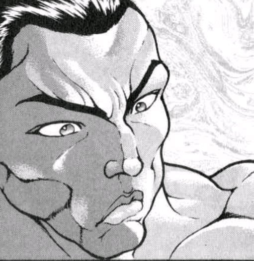
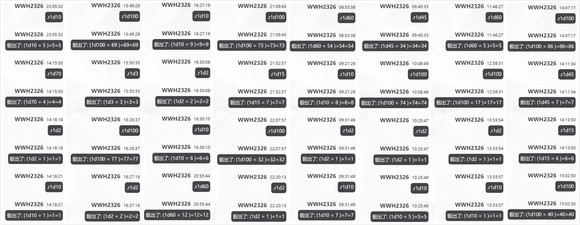
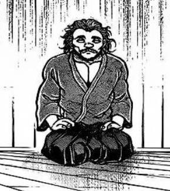

烈：怎么可能？！

勇仪：哈哈哈哈！太快了！

连一秒都不到，太快了吧你！

烈：我就不该跟你比这个

你这力气简直就不讲道理……

她将友人从地上拽起

勇仪：神清气爽啊~

现在心情绝赞！

再独自往上走也没什么劲头，我还是等明天和她们一块爬山吧

你这饮品店还开几天？

烈：一共三天假期，今天就结业了

勇仪：这么说我运气还不错嘛

祝关门大吉啊！

烈：不会说就别说了你！

她笑着走远了，连带着武术家也笑了起来

那莫名堆积的烦闷也随着酒和故事一并溜走，唯一余留的只是未散去的欢笑声

有个会来找你喝两杯的朋友是件令人愉快的事情，尽管她有些时候不是那样“安分守己”

对此相对的，若有时不时来找麻烦的家伙，那也可看做是好事——谁又会将时间消耗在无关紧要的人身上呢？

他轻快地起身，走向虹龙洞

~几分钟后~

~虹龙洞~

“没有新客人来！今天客人好少啊！”

武术家快步走到店员小姐身旁

烈：无所谓，咱们这就歇业了！

百百世小姐想喝点什么？

咕噜咕噜，趴在柜台上的大蜈蚣滚来滚去

百百世：其实我更喜欢吃东西

烈：我知道，想点什么吃的也无所谓

我今天有的是时间

百百世的点单【1d10:3】

1 想吃龙

2 龙……须面

3 龙……井茶（为啥啦）

4 想吃龙

5 龙……须糖

6 龙……虾（为啥啊）

7 想吃龙

8 龙……利鱼

9 龙……卷寿司！（为啥啦）

10 大成功/大失败【1d2：1】

百百世：我想起来了！

之前在库房看到了很感兴趣的标签

“龙井茶”，是中国的茶吧？

武术家扬起了眉毛

烈：百百世小姐想喝茶？

稍等片刻，我去找两个茶杯……

几分钟后，茶泡好了

朋友间喝茶用不着那般多的礼仪，他以前还用保温杯盛过茶水

他省略了那些待客时的工序，直接给小杯倒了七分满，将其推到少女跟前

烈：中国茶，我泡的

尝尝吧

她好奇地拎起杯子，一口喝干了滚烫的茶水

百百世的评价【1d100：54】

百百世：嗯……

嗯……

烈：如何？

百百世：闻着很香

但喝起来就不好不坏

烈海王为她续了杯茶水

烈：喝的慢些

这茶中的香气，是要慢慢品出来的

这次她以常人般的速度将茶喝完了

她闭目沉思了一阵

百百世：嗯~~~~~尝不出来

之前饭纲丸请我喝过她的茶，我也感觉不出好喝在哪里

还是太没品味了？

烈：怎么会？

喜欢什么，不喜欢什么……与所谓的“品味”无关，不过是个人好恶罢了

这是无所谓的事情

百百世：我喜欢这说法！

再来一杯

烈：稍安勿躁，只是帮你调整一下情绪

我看你现在正常多了

百百世：我没有不开心啊

烈：你说的也对，我也没法说这样的你是多么和善或可爱的妖怪

不过，饭纲丸小姐呢？

她又是怎么说的？

百百世：饭纲丸？

她没说什么啊

就是以前遇到了干了一架，之后她就时不时过来找我玩

那家伙从来不厌恶与我相处呢……我们就这样成了朋友了

烈：你怎么没将她吃掉呢？

这次还帮她开采龙珠，你大可独吞矿物的

百百世：说什么呢你，饭纲丸是我的朋友

就算很想吃也得忍着呀！朋友需要的话就帮个忙嘛

现在也是，我很~~~~~想吃掉你的，都是一直忍着而已

武术家笑了，他给茶壶中又添了些热水

烈：看来丑恶的大百足也总有些可取之处，不然谁又想和只知道吃东西的妖怪做朋友？

那就不妨自信些吧，你想，妹红小姐昨晚不还请你吃烤肉去了？

再来一杯？

百百世：还是喝不出味道来

再来一杯

但是你想啊，无论干什么都显得自信满满的样子，不就像个笨蛋一样吗

武术家哑然失笑

烈：你觉得自己现在看上去不像吗？

百百世：我连挖矿时都在思考，我可是大哲学家

烈：大哲学家平时一举一动都洋溢着自信的气息，因为他们的思想令他们充满魅力

同样的，你在战斗时也是那样的自信，当得起闪耀的虫族公主之名

我想这是一个道理，只要把日常生活也当做战斗处理就可以了

大百足一拍茶几站了起来

百百世：是这么回事吗！

对啊……每一分每一秒都是战斗状态，这样的我无论何时就都闪闪发光啦！

烈：哈哈……

瓦尔哈拉的店主与店员就这样闲聊着，消磨着假期的时光

除了几个例行来买果汁的妖精外，今日再没来过什么值得一提的顾客

~傍晚~

饮料店结业了，大百足也回洞中休息了

武术家将收拾好的箱子搬出洞外，思索着某人今日是否会过来

他没有等待太久，彩虹般的少女从云层中钻出，飞向了矿洞的入口

千亦：还~有~喝~的~吗~？

烈：有，想喝什么？

千亦小姐面色愁苦地翻着布袋

千亦：我看看……

10，10资金可以买什么解暑的饮料？

烈：一碗冰酸梅汤？

“就要这个，谢谢！”

她迫不及待地端起小碗，将冰镇的饮料两口喝干

千亦：啊~~~

真舒服啊~~~

眼见四下无人，千亦小姐不再端着平时那副架子，而是舒舒服服地伸了个懒腰

烈：这位客人，注意一下形象

千亦：咳咳，你刚刚什么都没看到，明白吗？

怎么样？这三天下来，你有赚到钱吗？

烈的营收【1d100：8】

武术家对着账本算了一番

烈：连续三天人气低迷，连成本都没收回来

这都亏了两个月的工资了，得亏是这地方没有租金，不然我怕是亏得更惨……

千亦：我的天哪，请问你到底是怎么做到的？

连饮品店这样的行业都……你干什么？

烈海王拿过空碗，给她又盛了一碗酸梅汤递了过去

烈：免费续杯啊

千亦：哇

你这做派能赚到钱才是见鬼的事

烈：无所谓，我今天早上刚见过鬼

反正是度假，最主要是自己开心

最后一杯饮品也调好了，瓦尔哈拉该停业了

他把那块歪歪扭扭的招牌拆下，转过身去，发现门口那些整理好的木箱飘了起来

千亦：中介商的免费配送服务

请问需要吗？

烈：那就多谢帮忙了！

武术家与无主物之神离开了虹龙洞

妖怪之山的草原上再次恢复了平静

这家小店就到此结业了

~【1d3：3】小时后~

~永远亭~

考虑到这毕竟是假期的最后一天，他索性和千亦小姐吃过了晚饭，才拖着东西回到了永远亭

他先行将设备放回库房，才走进了平日聊天的医务室

烈：我回来了！

幽香：欢迎回来~

烈：啊！

永琳：假期过得如何啊？

某位大妖怪已经闲到大晚上过来找我喝茶的地步了

看来你很享受这几天的假期啊~

幽香：是呢，我很无聊呢

实在是没有事情做，就过来找某位月之民聊天了~

冷汗以肉眼可见的速度出现在了他的脸上

他将求助的目光投向了一旁的众人——

【1d4：3】

1 铃仙前辈！

2 皮克！

3 帝！

4 辉夜（为啥啊）

烈：（铃仙前辈的眼中充满了怨念？！凭什么只有你放假，是这样的意思吗？！）

（皮克！别移开目光啊！！你本来也不需要假期吧！！！）

（辉夜小姐……不可能的）

（帝！帝！救命啊！！！）

真没办法呢~

脸上仿佛写着一行这样的大字，值得依靠的因幡帝站了出来！

帝（棒读）：开饮料店的时候有遇到什么有意思的事情吗，我好好奇啊

烈：有有有有，遇见很多有意思的事！

烈的说明【1d100：15】

由于过于紧张且想快速提炼要点，烈海王打起了车轮拳！

烈：哦哦哦哦哦哦哦！

辉夜：这可真是太有意思了

铃仙：师匠！放假没用啊！

这不是什么都没有改变吗！！

皮克：嗷嗷嗷嗷嗷嗷啊

（师匠，我还是听不懂）

师匠：我不想翻译了，随他去吧

四季鲜花之主木着脸丢了一个花弹，那无奈的神情与一旁的银发女子简直如出一辙

【1d15：15】分钟后，烈海王总算将这三天的故事大略说了一遍

幽香：听上去不怎么有趣啊

烈：我也觉得

我真没想到，原来饮品店的客人们会提出这样难以应付的要求……

师匠：是你那边太过奇怪了

假期结束后，有感觉自己轻快些吗？

武术家毫不犹豫地开口

烈：我感到自己对工作充满了期待

我从未像现在这般意识到在家做饭是件多么令人愉快的事情

我已经迫不及待地准备迎接明天的工作……了？

烈海王的语速慢了下来，他看到房间内的所有人都露出了诡异的笑容

师匠：明天？不不，假期已经结束了

既然已经回来了，那你的工作就从现在开始

我要喝抹茶

幽香：我要一壶热水果茶

铃仙：中杯草莓奶昔少冰~

皮克：嗷嗷嗷嗷嗷嗷啊

（要一碗解暑的，什么都行）

辉夜：大杯奶茶，加料加满

五分钟以内做完

帝：给我一杯胡萝卜苹果汁~

他赶忙记下了众人的要求，并立刻跑去厨房

烈：稍等一下啊！

马上就好！

仅营业三日的小店关门后，烈海王的假期结束了

在喧嚣的谈笑声中，他又一次回到了自己最熟悉的地方

回到了那平平无奇，却又令人安心的日常生活之中

~第1290天结束~

~本日的更新结束~

（附上本次的骰子）

（以下是我的废话）

于是这次是久违的原创活动回！

说是要开店本来想着要做个模拟经营回类活动的，结果开局就大失败骰到客人们都是些糟糕的家伙（笑）

正好名称中了瓦尔哈拉于是本次主要的内容就都是聊天了

实际上我写到一半的时候才想起来“哎是不是可以参考游戏里加酒精那样给这边的饮品加糖啊”，但我已经写到一半啦！这时候已经来不及改系统了，实际遗憾

但就算加太多糖可能也就是让顾客们体重增加一点而已，没什么意义嘛（

原本是个搞笑活动回结果写着写着气氛莫名变忧虑起来了，到底是为什么啊！最后好不容易才把气氛调整回来

在这种环境下聊着聊着就会莫名开始聊些奇怪的话题呢

虽然用了瓦尔哈拉的梗但总体风格并不是原作那样，毕竟这是个饮品店而非酒吧）

原本想骰一下百百世小姐对龙的看法，不过烈师傅不是很感兴趣因此之后就换了个方向描写

毕竟这次百百世小姐是助手，总不能一直打酱油吧？

顺便这次是吉吊魔理沙勇仪三连发，金发少女的存在感今日真的好高……

之后歇一阵大概会去加把劲把宝可梦贴的后半段骰完，大概吧！

下一次更新的时间未知，骰子已经发了，虹龙洞篇就到此为止——可能还会写一两个彩蛋，可能吧

于是，本次的更新到此结束！

~彩蛋~

~调制饮料……改变体重~

烈：考虑到妖怪之山的居民们平日工作时都相当辛苦，需要补充糖分，因此我在开这饮品店时立下的第一个原则就是“加糖加爆”

无糖做成正常糖、少糖做成多糖、多糖做成超多糖

保证一杯喝完之后让顾客充满活力！

铃仙：阿烈，这个月仓库里的糖比预计多消耗了26包，你有什么头绪吗？

烈：我全加饮料里去了

铃仙：什么恶魔行径！

于是来看看这几天的顾客们是否中了招

（衣玖小姐只喝了一杯乌龙茶，60以上中招，吉吊小姐是灵体90以上中招，魔理沙加了超多糖保底30，其余五十以上中招）

（辉夜大小姐由于体质不会中招）

吉吊【1d100：43】

~畜 生 界~

吉吊：水獭灵，给我煮杯咖啡

水獭灵：吉吊大人请稍等片刻，我还有五秒就听完您传给我的这段录音……

听完了，我现在就来！

吉吊：那武术家说的技巧真有用处？

水獭灵：我听完发现还挺实用的

顺便向您汇报，这个月组里开办的饮品店营业额又创新高！

不愧是吉吊大人，真是高瞻远瞩啊

吉吊：毕竟灵体无需担心体重问题

可谓是毫无代价的娱乐呢，要付出的只有金钱而已

一轮【1d100：74】

~命莲寺~

一轮：……

……

……

白莲：一轮，你已经在这里发呆半个小时了

遇到什么事了？

一轮：【1d7：6】斤……

怎么可能啊圣大人！！

我，胖了，6斤！！！！！

白莲噗呲一声笑了出来

白莲：哈哈哈哈！

你仔细想想，是不是最近太缺乏运动了？

还是说，又吃了太多不健康的食物？

一轮：我最近有控制饮酒的啊！

要说唯一可疑的是……那杯奶茶？！

——喂！烈海王！！！！

武术家今日正巧来找白莲探讨法术，他一脸疑惑地走了过来

烈：怎么了，一轮师傅？

一轮：我那天要的不是少糖吗？！为什么会变成这样！！

前店主不慌不忙地答道

烈：一轮师傅有所不知

我那店的少糖本来就相当于一般所说的正常糖

而你那天要的饮品又有些难做，为了隔开上下两层，我又用魔力融了些无色的糖水进去……也就相当于是多糖的好几倍糖量吧，对你这样的入道使来说应当不算什么

一轮：你 这 混 账 ！

白莲：没事，没事~

一轮现在的体重刚刚好~

一轮：别用慈祥长辈的语气说这种话啊圣大人！

要是一直这样想的话会真的会变肥胖的！

可恶……可恶啊啊啊啊啊啊！！

一轮师傅咬紧牙关，为了减肥而开始了绕寺长跑

“一轮师傅居然大清早就这样努力！

真是令我自愧不如……请让我也一块跑吧！”

白莲：今天是个适合体力锻炼的好天气

我也一起来，就先跑上【1d6：5】个小时吧~

于是乎，命莲寺外多了三位热血沸腾的跑者

顺便一提，领头的那位在途中不断发出了如“不要跟过来！”的喊叫声，不过这就是后话了

衣玖【1d100：6】

~辉针城~

天子：你的身材到底是怎么保持的这么好的

有特意节食运动吗？

衣玖：没有啊

只是顺其自然而已~

魔理沙【1d70：11+30=41】

~博丽神社~

魔理沙：……只要将这几种蘑菇的汁液以合适的比例调和并服用，就可以在一段时间内放开大吃高热量食品而不用担心体重增长的问题了！

这就是本人这段时间的突破性研究成果！

灵梦：听上去很诱人啊

保险起见我问一句，如果调配过程出了点问题会怎么样？

魔理沙：咳咳，就会有点不值一提的副作用……

不至于致命，但你可能得多去几次……

灵梦：这药你可留着自己喝吧

烈：啧，亏我特意给你放了超级加倍糖量

魔理沙：哼，我才不会两次踩中同样的陷阱

灵梦：嗯？两次？

那上一次是什么个结果啊~

金发小女孩迅速压下帽子，避过坏笑着的友人的注视

魔理沙：这就暂且不提！

勇仪【1d100：43】

~旧地狱~

勇仪：再来一罐！

帕露西：天天喝酒身材还这么好，我好嫉妒啊……

百百世【1d100：44】

~虹龙洞~

百百世：我前几天去和朋友吃了烤肉！

烈海王来这边打工的时候还尝了些饮料，大部分都挺好喝的！

饭纲丸：好好你先给我坐在这里不要动啊

大天狗蹲了下来，伸出双手

她仔仔细细地从对方的腿部抚摸到腹部，又不敢置信地拍了两下，这才哑然松开双手

百百世：？

怎么了？

饭纲丸：算上之前吃的那么多龙珠

你体型和之前相比一点都没变化

凭什么啊？

百百世：就是说啊

我这几天想减肥结果一斤没瘦！

饭纲丸：别说了，百百世

唉……傻虫有傻福……

千亦【1d100：93】

~妖怪之山~

武术家打量着友人不敢置信的表情，以极其自信的口气说道

烈：我猜你胖了

千亦：我只喝了三杯饮料，怎么会胖【1d7：2】斤？！

烈：我记得你当时说得是“偶尔喝一杯”，结果自己就连续喝了三天

那就算发福也是情有可原吧？

千亦：事情怎会到了这般地步

烈：这方面我很有经验

需要我提供减重建议吗？

千亦小姐的动力【1d100：87】（50以上减）

千亦：拜托你了！

不能让事态继续恶化下去

我要利用今晚的时间解决这个问题！

烈的建议【1d10:7】

1 这里就靠我烈海王的减肥餐

2 像一轮师傅一样长跑吧！

3 来学武术吧！（为啥啦）

4 这里就靠我烈海王的减肥餐

5 像一轮师傅一样长跑吧！

6 扎马步（别扎了）

7 这里就靠我烈海王的减肥餐

8 像一轮师傅一样长跑吧！

9 要试试蘑菇汁吗（为啥啦）

10 大成功/大失败【1d2：2】

千亦：——我准备好了

请告诉我，我现在该做些什么？

烈：你该吃晚饭

千亦：……？

烈：你该吃晚饭，千亦小姐

胖两斤没什么大不了的，属于正常范围内的体重浮动

你只需要吃些健康低脂的食物，用不了几天就能调整回来

来，试试我做的杂粮饭

千亦小姐半信半疑地尝了一口

千亦：真好吃~

我还以为你要建议我去长跑或者做高难度健身动作……

千亦眼中的武术家活像是想起了什么不堪回首的往事

烈：还是算了吧，千亦小姐

你这衣服的质量着实令我担忧，我可不想再来一次了

千亦：？？？

我这外衣质量很好的呀

再说，这和减肥有什么关系啊？

面对好奇追问的友人，武术家硬是堵住了嘴一句没说相关事宜

把这事说出来的话在千亦小姐心中的形象就要崩塌了……！

这样想着，他越发打定了坚守秘密的主意

但武术家大概忘记了，早在他在虹龙洞内因缺氧而昏迷的时点，他在对方眼中就已经没什么“形象”可言了……

（彩蛋环节结束）

~彩蛋~

~七夕特别篇~

这件事发生在烈海王来到幻想乡的第【？？？】天

七夕节，又名七巧节，女儿节，是中华最具有浪漫色彩的传统节日之一

而在传入日本之后，七夕节在当地也有了祈求女子拥有一身好手艺的意义

因此，这同样是普通朋友们可以一同欢庆的节日

而在这次七夕节的晚上，烈海王做了什么？【1d10：6】

1 与永琳共度夜晚

2 与幽香共度夜晚

3 与魔理沙一起逃难（为啥啊）

4 与勇仪一起喝酒

5 与紫苑一起祈愿

6 与圣白莲一起飙车（为啥啊）

7 与铃仙一起祈愿

8 与千亦一起祈愿

9 与吉吊小姐打电话（为啥啦）

10 大成功/大失败【1d2：1】

~妖怪之山~

~山路~

“轰轰轰轰~”

夜间，无人的山道上

一辆摩托车正尽情释放着动力，带着它的主人在道路上以急速奔驰

“呼~”

她看着周围的环境视野中变换成模糊的色彩，打从心里感到一阵心旷神怡

尽管她仅仅凭借肉体就可以跑得比这更快，但自身奔跑与骑乘钢铁的感受毕竟不同——后者能够带来独一无二的愉悦感，而前者却只是锻炼的一种

她热爱锻炼，但锻炼与娱乐终究是不同的，不是吗？

或许只有那位武术家会将这两者混为一谈吧……

“——？”

某位似曾相识的身影与她擦肩而过，命莲寺的圣僧紧急踩了一脚刹车

车轮与地面摩擦，发出令人牙酸的响声，横转了90°的摩托车瞬间停在了山路上——她一脚踩在地上，做出最后的制动，随机抬眼望去

白莲：烈先生，你怎么会在这里？

烈：晚上好，白莲师傅

我……今晚无处可去

白莲：？

武术家显得有些尴尬，慢慢吞吞地说着

烈：……今晚是七夕节

您说我该去哪呢？

白莲：啊……

圣僧恍然大悟，点了点头

烈：在永远亭待着也不是，去花田也不是

像之前那样冒险两边来回跑，我担心自己会因此而住院

所以我与大家一并祈愿之后，就找了个由头出来了

圣僧双手合十

白莲：自作自受啊，烈先生

烈：无话可说

白莲师傅可否教我些佛家经文

我想我今晚特别需要这些

命莲寺的主持温和地笑了起来

白莲：不

我想你今晚更需要让自己放松一下

烈：您是说？

她打开了摩托车的后尾箱，自用空间魔法扩展的小小箱子中拿出了一个挎斗

她歪了歪头，看上去有些俏皮的意味

白莲：我可以帮你加装一个挎斗……

武术家愣了一下，随后一脸的惊喜

烈：那就谢谢白莲师傅了！

于是不久之后，山路上又响起了摩托车引擎的轰鸣声

白莲：不妨抬头看看天空吧！

身旁有着清爽的空气，头顶上有着璀璨的星空

它们会让我放松下来，它们是属于所有人的宝物

武术家也一并笑了起来

烈：谢谢你，白莲师傅

我感觉自己好多了

“烈先生之后要做什么？”

“我要去该去的地方……但在此之前，还是先享受飙车的快感吧！”

有辆古怪的摩托车在妖怪之山的山道上疾驰

那看上去活像是流言中才存在的某种离奇的都市传说

若是仔细观察，侧耳聆听，摩托车行驶的噪音中似乎还有其余的声响

那是伴随着笑声的，两人在夜幕下平淡而放松的闲聊

（彩蛋环节结束）

~（晚了一天的）教师节彩蛋~

~这件事发生在烈海王来到幻想乡的第【？？？】天~

这次教师节的老师是【1d10：3】

1 武术班的老师

2 师匠

3 芙兰朵露老师（为啥啦）

4 武术班的老师

5 白莲

6 摩多罗老师（为啥啦）

7 武术班的老师

8 魔理沙的厨艺老师

9 老郭（为啥啦）

10 大成功/大失败【1d2：2】

~红魔馆~

“哼哼~”

烈日当空

金发幼女打着阳伞，在城堡的大门前愉快地飞行着

前来拜访的武术家讶异地扬起了眉毛

烈：芙兰朵露小姐心情不错啊

芙兰朵露：是烈啊

你知道今天是什么节日吗~

武术家在心中默默一算

烈：（将报纸刊登的日期换算成外界时间……）

应当是外界的教师节吧

吸血鬼之妹骄傲地挺起胸膛，以大拇指指向了自己

芙兰朵露：也就是说，是属于芙兰老师我的节日呢！

烈：（突然想起来这回事了？！）

芙兰朵露：桀桀桀桀

我的弟子，烈·海王呦

烈：我觉得芙兰朵露小姐……

在对方那威胁的手势之下，武术家赶忙改口

烈：我觉得芙兰老师不太适合这种说话语调

芙兰朵露：嗯~~~？

今年，你打算孝敬老师我的货，是什~~~~么啊？

武术家全力抑制着自己的笑意

烈：别这样芙兰老师

听上去像个小混混一样

芙兰朵露：哼，哼哼……

噗嗤

少女老气横秋地哼了几声

之后，似乎是憋不住了，她自己先一步笑出了声来

两人的笑声惊醒了一旁打瞌睡的门番

红美铃：！

到演唱会的时间了吗？！

烈：不不，是教师节的事

芙兰朵露：是教师节礼物啦！芙兰朵露老师想要礼物！

红发门番扶正了帽子，在心中想到

这与其说是教师节，不如说是万圣节

于是教师节礼物是【1d10：1】

1 毛血旺

2 血 肠

3 名为败北的礼物……！（为啥啦）

4 月之都出品防晒霜

5 之前买的美漫还有剩

6 仅限三小时的局部天象操控……（已经是异变了！！）

7 血……糖

8 血腥玛丽

9 经典港漫《海虎》高清合集版（为啥啦）

10 大成功/大失败【1d2：2】

武术家故作严肃地清了清嗓子

烈：咳咳

弟子怎敢不遵师命

芙兰朵露：噗噗噗噗噗

烈：值此佳节，为老师献上一道如恶魔般混沌、毒辣而鲜红的血液料理……

不知您意下如何？

吸血鬼之妹的双眼亮了起来

芙兰朵露：与我恶魔之妹相配的正是这样的邪恶之物口牙！

那老师我就饱含期待地等着了~

芙兰朵露老师飞到院子后方去了

红美铃：……西红柿酸辣汤配血肠？

烈：毛血旺

门番叹服地鼓起了掌

红美铃：可以、可以

我也馋川菜了，给我也来一份

烈：这大下午的吃这个？

我本来打算晚上做的

红美铃：当下午茶嘛！今儿吃川式下午茶

不久之后，借用了厨房的大厨将一盆毛血旺端上了刚架在门前的小桌

金发吸血鬼拿起了一双筷子

筷子技术【1d100：61】

对她而言这明显不算什么难事，芙兰朵露轻松地夹起一块血豆腐送入了口中

芙兰朵露：~

真好吃~

红美铃：呦，这味道很地道啊

你这手艺可以

烈：那是，我这菜连幽幽子小姐都说可以

——正经地说，感谢两位老师对我的指导

祝二位教师节快乐

“嘿，怎么把我也算上了？”

“红海皇您这话说得，我从您身上学的东西还少了吗……”

恶魔之妹老气横秋地拍了拍武术家的头

芙兰朵露：放心吧

今后如再有恋爱难题，老师我也会一如既往地帮助你的

烈：多谢多谢但以后可千万别再有这方面的难题了！

“哈哈哈哈！”

三人的笑声自红魔馆的门口飘扬到了远处吸血鬼的耳中

蕾米莉亚·斯卡雷特放下手中的红茶，皱起了秀气的眉头

蕾米莉亚：芙兰那家伙，笑得那么没品

下午时分在城门口进食，成何体统

咲夜！

“有什么事，大小姐？”

蕾米莉亚：那个，晚上给我也做一份

要盛在精致的盘中，用刀叉享用

女仆小姐停下时间，翻了个白眼，又叹了口气

时间开始流动

“明白了，大小姐。还要再来一杯红茶吗？”

她面色如常地点头，并维持着平时的步调远去

咲夜：（还好之前问过他菜谱）

（一会把美铃抓来调味吧，不许她拒绝）

在门口闲聊着的红师傅尚不知晓，之后她将面临名为做西餐版毛血旺的噩梦

而芙兰朵露老师之后则准备培养弟子的动手能力——通过玩高速飞行躲避球的方式

真是辛苦了

（彩蛋环节结束）

~新的视频更新了~

虽然馆长因为现实生活过于忙碌的原因暂缓了视频的制作进度……

不过，热心的koki海皇主动联系了我与馆长，提出了帮忙做视频的援助

我和馆长都很高兴，考虑到直接接着做主线大家可能会不适应，刚开始的时候也需要先尝试一下，于是koki海皇在与我们讨论后决定先做一下后面的交流回——也就是本期的帕秋莉交流回啦

虽然和之前的视频进度跳了，不过大家应该无所谓……吧？

以及，刚开始做这个系列的koki海皇还有些不太适应，如果有与过去不太相同的地方，还请吧友们谅解

于是，新的视频更新啦！

本期有实际好看的手绘op哦，如果感兴趣的话就来看一下吧！

地址：（发不出全的因此只放BV号了，我的动态也有转）BV1mq4y1R7q2

～关于刚欲异闻篇～

刚欲异闻前几天就出啦!另外dairi绘这周也出了。

不过，这个贴子的新篇应该是没法在近期更新了。

一方面现在在做的贴子还没完结，另一方面我再过几天就要进入考试月了，现实生活中会变得忙碌，没有那样多的余力更新。

因此刚欲异闻篇大概要等到明年再更了，还请大家理解)

以上，久违的碎碎念环节结束

由koki海皇制作的交流回视频第二集更新啦！

本期的内容是四季活动回，感兴趣的话就去看看吧~

（标题有点奇怪是因为正常打过不了审（悲））

由望远镜海皇 @望远镜300  制作的视频第二季第21集更新啦！

本期的内容是月都篇的收尾 同时也是第二季的完结篇 感兴趣的话就去看看吧～

大概今晚八点左右更新

(刚刚不小心把宝可梦贴子的更新发在这里了，很抱歉)

于是，宝可梦贴也写完了。

修整了一段时间，虽然还没歇够，不过在写新东西之前就先把这个贴子的刚欲异闻篇补上。

毕竟这次的异变规格小，牵涉人员也不多，故事属于相对简单的那种……和以前的噩梦日记篇一样，进度快的话两次更新左右说不定能结束了？这个就到时候再说。

好久没写烈师傅手也挺生了，希望味道别变。

那么周三晚上8点左右更新新的异变回。

由koki海皇制作的交流回视频更新啦~

本期内容是四季交流回的下篇，感兴趣的话就来看看吧~

